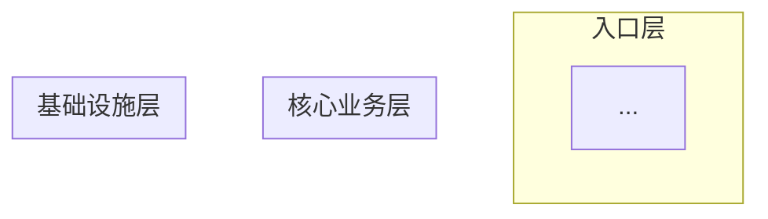

# 开源项目源码分析技能

本技能提供两个核心能力：

1. **项目全貌分析**：快速建立对项目的全局认知，输出系统架构图和核心功能清单
2. **特定功能深度分析**：对用户选定的功能进行深度技术分析，输出核心实现逻辑和流程图

## 核心原则

- **由粗到细**：先全局后局部，先骨架后细节
- **由外到内**：先看公共 API 和行为，再看内部实现
- **动静结合**：静态阅读 + 运行时行为推断，互相验证
- **测试驱动理解**：测试是最可靠的行为文档
- **持续记录**：边分析边输出，形成可回溯的分析链

---

## 能力一：项目全貌分析

当用户要求了解一个项目的全貌、架构或核心功能时，按以下步骤执行。

### 步骤 1：读项目入口文档

按优先级读取以下文件（存在即读）：

| 文件 | 关注点 |
|------|--------|
| `README.md` | 项目定位、核心功能、技术栈 |
| `AGENTS.md` / `CLAUDE.md` | 开发约定、目录结构、构建命令（通常信息密度最高） |
| `CONTRIBUTING.md` | 开发规范、分支策略 |
| `CHANGELOG.md` | 最近迭代方向 |
| `package.json` / `Cargo.toml` / `go.mod` / `pyproject.toml` | 依赖和构建配置 |

### 步骤 2：扫描项目结构

1. 列出顶层目录结构
2. 列出主源码目录（通常是 `src/`、`lib/`、`cmd/`、`pkg/`）的下一层
3. 识别以下关键要素：
   - 入口文件（`main`、`bin`、`index`）
   - 核心业务目录 vs 基础设施目录
   - 测试组织方式（colocated 还是分离）
   - 插件/扩展目录
   - 文档目录

### 步骤 3：识别核心抽象

通过以下方法找到项目的核心类型和接口：
- 搜索被最多文件 import 的类型
- 查看 `types.ts` / `interfaces/` / `models/` 目录
- 查看核心函数的参数和返回值类型
- 搜索核心的 `export class` / `export interface` / `export type`

### 步骤 4：追踪主执行流

找到项目的入口点，追踪一个典型请求从进入到完成的主干路径：

| 项目类型 | 入口点 |
|----------|--------|
| CLI 工具 | `bin` 字段指向的文件 |
| Web 服务 | `app.listen()` / HTTP handler 注册 |
| 库 | `exports` / `index.ts` 导出的公共 API |
| Agent 运行时 | Agent 的 `run()` 循环 |

记录主干调用链，用箭头表示调用关系，标记关键分支点。

### 步骤 5：输出全貌分析文档

输出必须包含以下内容：

#### 5.1 项目概述（一段话）

用一段话说清楚：这个项目是什么、解决什么问题、核心技术栈是什么。

#### 5.2 系统架构图（Mermaid）

用 Mermaid 画出系统架构图，展示核心模块及其关系。图的层次结构应该体现：
- 入口层（CLI / API / UI）
- 核心业务层（主要业务逻辑模块）
- 基础设施层（数据库、存储、网络等）
- 外部依赖（第三方服务、API）



#### 5.3 核心功能清单

以表格形式列出项目的核心功能，每个功能包含：

| 功能名称 | 一句话描述 | 核心模块/文件 | 复杂度评估 |
|----------|-----------|-------------|-----------|
| ... | ... | ... | 高/中/低 |

这个清单是用户后续选择"深入分析哪个功能"的菜单。

#### 5.4 目录结构心智模型

用带注释的树形结构展示项目目录，标注每个目录的职责：

```
src/
├── cli/              # CLI 入口和命令注册
├── core/             # 🔑 核心业务逻辑
├── infra/            # 基础设施
└── ...
```

用 🔑 标记最重要的目录。

#### 5.5 核心数据流

用一句话或简短的箭头链描述数据从输入到输出的主干路径：

```
用户输入 → 路由 → 业务处理 → 存储/外部调用 → 响应
```

---

## 能力二：特定功能深度分析

当用户选定了一个具体功能要求深入分析时，按以下步骤执行。

### 步骤 1：明确功能边界

先回答以下问题（如果信息不足，向用户确认）：

- 这个功能的用户可见行为是什么？（从外部看）
- 触发条件是什么？（什么时候被调用）
- 输入和输出是什么？
- 涉及哪些子系统/模块？

### 步骤 2：定位入口代码

按以下优先级搜索：

1. 搜索功能名/关键词（函数名、类名、路由路径）
2. 从 UI/CLI/API 入口反向追踪
3. 搜索相关的类型定义（`interface`、`type`、`struct`）
4. 查看相关测试文件

### 步骤 3：正向追踪（Top-Down）

从入口开始，逐层深入，记录完整的调用链：

```
functionA()
  → functionB()          # 做什么
      → functionC()      # 做什么
  → functionD()          # 做什么
```

规则：
- 遇到分支（if/switch/策略模式），先走最常见的路径
- 遇到不理解的先标记 `// TODO`，保持主线不断
- 超过 3 层间接调用时，标记"这里有个抽象层"

### 步骤 4：反向追踪（Bottom-Up）

对关键的底层机制，从实现往上追：
- 找到核心实现
- 搜索谁在调用它
- 理解使用场景和调用模式

### 步骤 5：分析关键设计决策

对每个重要的实现细节，分析：
1. 为什么这样设计？（而不是另一种方式）
2. 这样设计的 trade-off 是什么？
3. 有没有已知的限制或 TODO？
4. 错误情况怎么处理？
5. 并发/性能/安全方面有什么考虑？

### 步骤 6：输出功能分析文档

输出必须包含以下内容：

#### 6.1 功能概述

一段话说清楚这个功能做什么、为什么需要它。

#### 6.2 核心流程图（Mermaid）

用 Mermaid 画出功能的核心执行流程。根据功能特点选择合适的图类型：

- **顺序流程**：用 `flowchart TD`（从上到下的流程图）
- **多方交互**：用 `sequenceDiagram`（时序图）
- **状态变迁**：用 `stateDiagram-v2`（状态机图）
- **条件分支多**：用 `flowchart TD` 配合菱形判断节点

流程图要求：
- 包含关键的判断分支
- 标注错误处理路径
- 标注关键的数据变换
- 中文标注节点和边

#### 6.3 核心调用链

带源码文件引用的调用链分析：

```
entryFunction()                    # src/module/entry.ts
  → validateInput()                # src/module/validate.ts
  → processCore()                  # src/module/core.ts:L42
      → helperA()                  # src/utils/helper.ts
  → formatOutput()                 # src/module/format.ts
```

#### 6.4 关键数据结构

列出核心类型/接口的字段说明，用代码块展示简化后的类型定义，并加注释说明每个字段的作用。

#### 6.5 设计决策分析

以"问题 → 方案 → 原因 → Trade-off"的结构分析关键设计决策。

#### 6.6 错误处理策略

说明异常情况的处理方式，包括：重试、降级、回退、超时等。

#### 6.7 关键代码位置索引

以表格形式列出关键文件和行号：

| 文件 | 关键内容 |
|------|---------|
| `src/module/core.ts` | 核心处理逻辑 |
| `src/module/types.ts` | 类型定义 |
| `src/module/core.test.ts` | 测试用例 |

---

## 输出格式规范

### 语言

所有输出使用中文，代码和技术术语保持英文原文。

### Mermaid 图规范

- 节点文字使用中文
- 边的标注使用中文
- 保持图的层次清晰，避免过于复杂
- 每张图聚焦一个主题，复杂系统拆分为多张图
- 使用 `subgraph` 对相关节点分组

### 文档结构

- 使用 Markdown 格式
- 代码引用使用 repo-root 相对路径
- 重要目录用 🔑 标记
- 复杂度用 高/中/低 标记

### 图类型选择指南

| 要表达的内容 | 推荐图类型 | Mermaid 语法 |
|-------------|-----------|-------------|
| 模块关系/系统架构 | 架构图 | `graph TB` / `graph LR` |
| 请求处理流程 | 流程图 | `flowchart TD` |
| 多组件交互 | 时序图 | `sequenceDiagram` |
| 状态变化 | 状态图 | `stateDiagram-v2` |
| 类/接口关系 | 类图 | `classDiagram` |
| 数据流向 | 数据流图 | `graph LR` |
