# Design Document: Agent V2 框架设计

## 1. Overview

Agent V2 是一个基于 **LangChain Agents** 框架构建的可扩展 AI Agent 系统。它以 `langchain.agents.create_agent` 为核心构建入口，通过中间件（Middleware）驱动的管道架构实现请求处理的各个阶段，并提供可插拔的技能（Skills）系统让 Agent 具备领域专业能力。

核心设计理念：

- **中间件驱动**：14 个中间件覆盖 Agent 生命周期的每个阶段（输入预处理 → 模型调用 → 工具执行 → 输出后处理），每个中间件职责单一、可独立开关。
- **技能可插拔**：通过 SKILL.md 文件声明式定义技能，支持 inline（注入上下文）和 fork（独立子 Agent）两种执行模式，无需修改框架代码即可扩展 Agent 能力。
- **状态持久化**：基于 Checkpointer 机制实现对话状态的持久化存储，支持 Redis 和 SQLite 两种后端。

## 2. Architecture

### 2.1 架构总览

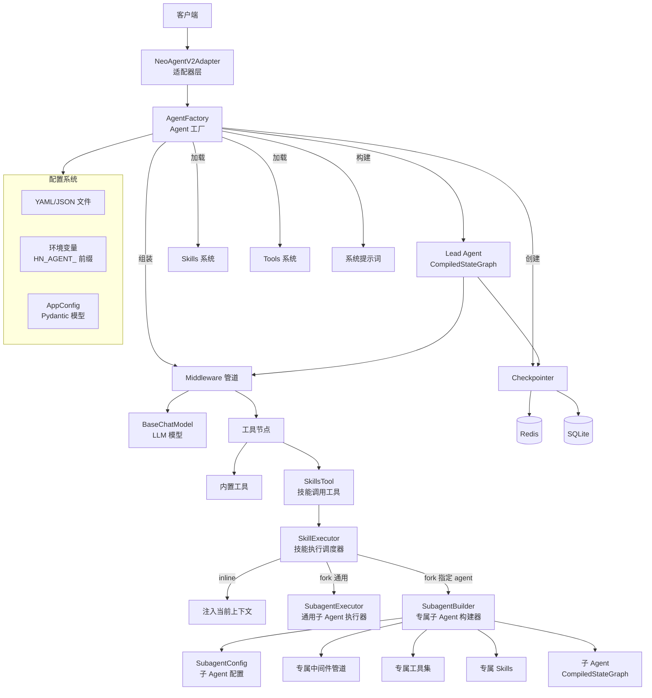

### 2.2 请求处理流程

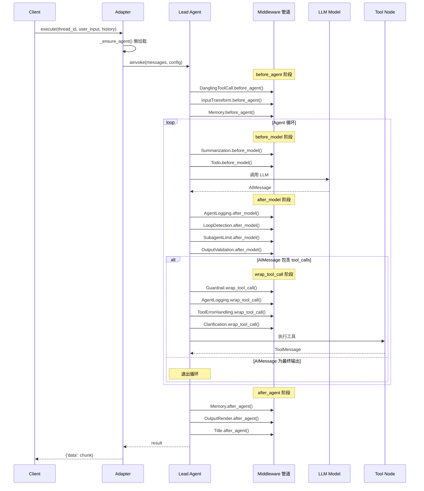

## 3. 框架基础：LangChain Agents

### 3.1 核心依赖

Agent V2 的核心构建 API 来自 `langchain` 包：

| 依赖 | 来源 | 用途 |
|------|------|------|
| `create_agent` | `langchain.agents` | Agent 图构建入口，接收 model、tools、prompt、middleware 等参数，返回编译后的状态图 |
| `AgentMiddleware` | `langchain.agents.middleware.types` | 中间件基类，定义 6 个生命周期钩子 |
| `AgentState` | `langchain.agents.middleware.types` | 中间件钩子中的状态类型 |
| `BaseChatModel` | `langchain_core.language_models` | LLM 模型抽象接口 |
| `BaseTool` | `langchain_core.tools` | 工具抽象基类 |
| `HumanMessage` / `AIMessage` / `ToolMessage` / `SystemMessage` | `langchain_core.messages` | 消息类型体系 |

### 3.2 底层运行时依赖

以下类型由 LangGraph 提供，作为 `create_agent` 的底层运行时支撑：

| 依赖 | 来源 | 用途 |
|------|------|------|
| `CompiledStateGraph` | `langgraph.graph.state` | `create_agent` 返回的 Agent 运行时类型 |
| `Runtime` | `langgraph.runtime` | 中间件钩子的运行时上下文参数 |
| `BaseCheckpointSaver` | `langgraph.checkpoint.base` | 状态持久化接口 |
| `ToolCallRequest` | `langgraph.prebuilt.tool_node` | 工具调用请求封装，用于 `wrap_tool_call` 钩子 |
| `Command` | `langgraph.types` | 工具调用返回类型之一 |
| `MessagesState` | `langgraph.graph` | ThreadState 的基类，提供 messages 字段和 add_messages reducer |
| `get_config` | `langgraph.config` | 获取当前运行时配置（thread_id 等） |

### 3.3 Agent 创建流程


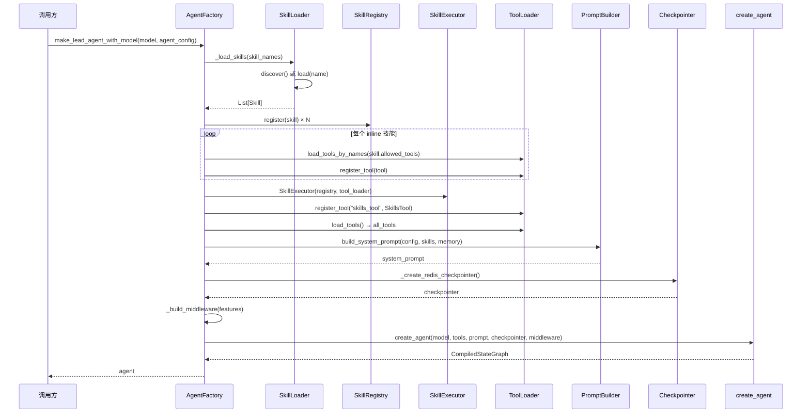

`create_agent` 的调用签名：

```python
from langchain.agents import create_agent

agent: CompiledStateGraph = create_agent(
    model=model,              # BaseChatModel 实例
    tools=all_tools,          # List[BaseTool]
    system_prompt=prompt,     # str
    checkpointer=checkpointer,  # BaseCheckpointSaver | None
    middleware=middleware,     # List[AgentMiddleware]
)
```

## 4. 框架关键能力

### 4.1 线程状态管理

`ThreadState` 继承自 `MessagesState`，定义了 Agent 运行时的完整状态 Schema：

```python
class ThreadState(MessagesState):
    artifacts: Annotated[list[Artifact], artifacts_reducer]  # 生成的制品
    images: Annotated[list[ImageData], operator.add]         # 图片数据
    title: str | None                                        # 对话标题
    thread_data: dict[str, Any]                              # 扩展数据
```

**核心数据模型：**

| 模型 | 字段 | 说明 |
|------|------|------|
| `Artifact` | id, type, title, content, created_at | Agent 生成的制品（代码、文档等） |
| `ImageData` | id, url, alt_text, data | 图片数据，支持 base64 编码 |

**自定义 Reducer — `artifacts_reducer`：**

采用「增量追加 + 按 ID 更新」策略：
- 新 artifact 的 ID 已存在 → 替换（更新）
- 新 artifact 的 ID 不存在 → 追加到末尾

这保证了并发修改时 artifacts 列表的一致性。

### 4.2 流式输出

通过 `stream_agent_response()` 将 LangGraph 的 `astream_events` 映射为 SSE 事件流：

```python
@dataclass
class SSEEvent:
    event: str       # 事件类型
    data: dict       # 事件数据
```

**SSE 事件类型映射：**

| SSE 事件类型 | LangGraph 事件 | 数据内容 |
|-------------|---------------|---------|
| `token` | `on_chat_model_stream` | `{"content": "..."}` |
| `tool_call` | `on_tool_start` | `{"tool_name": "...", "input": {...}}` |
| `tool_result` | `on_tool_end` | `{"tool_name": "...", "output": "..."}` |
| `subagent_start` | — | 子 Agent 启动信息 |
| `subagent_result` | — | 子 Agent 执行结果 |
| `done` | 流结束 / 异常 | `{"finished": true}` 或 `{"error": "...", "finished": true}` |

### 4.3 检查点与状态持久化

支持两种 Checkpointer 后端：

| 后端 | 实现 | 适用场景 |
|------|------|---------|
| Redis | `AsyncRedisSaver` (from `langgraph.checkpoint.redis`) | 生产环境，支持 TTL（默认 24h）和读取刷新 |
| SQLite | `AsyncSqliteSaver` / `SqliteSaver` | 开发/测试环境 |

Redis Checkpointer 创建流程：
1. 从 `get_redis_config()` 获取 Redis 连接地址
2. 配置 TTL：`default_ttl=24*60`, `refresh_on_read=True`
3. 调用 `AsyncRedisSaver.from_conn_string()` 创建实例
4. 执行 `asetup()` 初始化
5. 失败时降级为 `None`（Agent 状态不持久化但不影响运行）

### 4.4 特性开关系统

```python
@dataclass
class Features:
    sandbox_enabled: bool = True     # 沙箱代码执行
    memory_enabled: bool = True      # 记忆系统
    subagent_enabled: bool = True    # 子 Agent 委派
    guardrail_enabled: bool = True   # 护栏授权检查
    mcp_enabled: bool = True         # MCP 工具集成
```

Features 影响两个维度：
1. **中间件加载**：`MemoryMiddleware`、`SubagentLimitMiddleware`、`GuardrailMiddleware` 受对应开关控制
2. **工具集组装**：影响哪些工具类别被加载到 Agent

### 4.5 配置系统

基于 Pydantic v2 的类型化配置体系：

```python
class AppConfig(BaseModel):
    app: AppSettings           # 应用基础设置（name, debug, log_level, host, port）
    model: ModelSettings       # 模型配置（default_model, providers）
    sandbox: SandboxSettings   # 沙箱配置（provider, timeout, work_dir）
    tool: ToolSettings         # 工具配置（builtin_enabled, community_tools, mcp_servers）
    memory: MemorySettings     # 记忆配置（enabled, debounce, vector_store）
    extensions: ExtensionsSettings  # 扩展配置
    guardrails: GuardrailSettings   # 护栏配置（enabled, provider, rules）
    skills: SkillSettings      # 技能配置（skills_dir, default_skills, auto_activate）
    version: str = "1.0"
```

**配置加载优先级（高 → 低）：**
1. 环境变量覆盖：`HN_AGENT_` 前缀，双下划线分隔嵌套层级
   - 例：`HN_AGENT_APP__DEBUG=true` → `config["app"]["debug"] = true`
2. 配置文件：支持 YAML (`.yaml`/`.yml`) 和 JSON (`.json`) 格式

### 4.6 异常层次结构

```
HarnessError (基类)
├── ConfigurationError          # 配置错误（缺失必需项、格式错误）
├── UnsupportedProviderError    # 不支持的模型提供商
├── CredentialError             # API 凭证缺失或无效
├── SandboxError                # 沙箱执行错误
│   ├── SandboxTimeoutError     # 沙箱超时
│   └── PathEscapeError         # 路径逃逸
├── SkillValidationError        # 技能文件验证失败
├── SkillActivationError        # 技能激活失败
├── SkillExecutionError         # 技能执行失败
├── AuthorizationDeniedError    # 护栏授权拒绝
├── MCPConnectionError          # MCP 连接失败
└── VectorStoreError            # 向量存储错误
```


## 5. 中间件系统

### 5.1 中间件基类与生命周期钩子

所有中间件继承自 `langchain.agents.middleware.types.AgentMiddleware`，通过 6 个生命周期钩子介入 Agent 执行的不同阶段：

| 钩子 | 触发时机 | 参数 | 返回值 | 说明 |
|------|---------|------|--------|------|
| `before_agent` | Agent 执行开始前 | `state: AgentState, runtime: Runtime` | `dict | None` | 预处理输入，返回 dict 则合并到 state |
| `after_agent` | Agent 执行完成后 | `state: AgentState, runtime: Runtime` | `dict | None` | 后处理输出，返回 dict 则合并到 state |
| `before_model` | 每次 LLM 调用前 | `state: AgentState, runtime: Runtime` | `dict | None` | 修改发送给模型的消息 |
| `after_model` | 每次 LLM 调用后 | `state: AgentState, runtime: Runtime` | `dict | None` | 检查/修改模型输出 |
| `wrap_tool_call` | 同步工具调用时 | `request: ToolCallRequest, handler` | `ToolMessage | Command` | 包装工具调用，可拦截/修改/记录 |
| `awrap_tool_call` | 异步工具调用时 | `request: ToolCallRequest, handler` | `ToolMessage | Command` | 异步版本的工具调用包装 |

**钩子执行时序：**

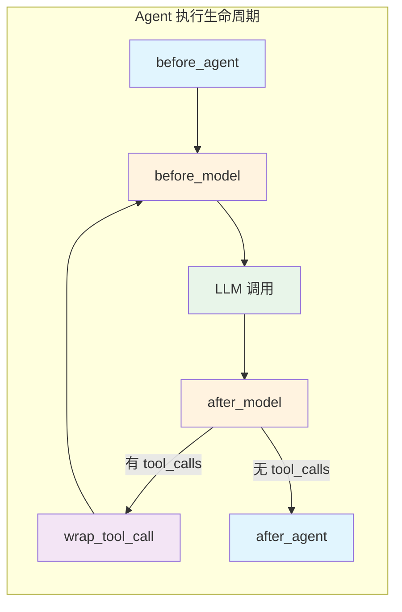

**钩子返回值规则：**
- 返回 `None`：不修改 state，继续执行
- 返回 `dict`：将返回的字典合并到当前 state（如注入消息、修改字段）
- `wrap_tool_call` / `awrap_tool_call`：必须返回 `ToolMessage` 或 `Command`，可调用 `handler(request)` 继续执行原始工具

### 5.2 中间件加载顺序与条件加载

中间件在 `_build_middleware(features)` 中按固定顺序组装，部分中间件受 Features 开关控制：

| 序号 | 中间件 | 条件 | 主要钩子 |
|------|--------|------|---------|
| 1 | `AgentLoggingMiddleware` | 始终加载 | after_model, wrap_tool_call |
| 2 | `DanglingToolCallMiddleware` | 始终加载 | before_agent |
| 3 | `InputTransformMiddleware` | 始终加载 | before_agent |
| 4 | `SummarizationMiddleware` | 始终加载 | before_model |
| 5 | `MemoryMiddleware` | `features.memory_enabled` | before_agent, after_agent |
| 6 | `TodoMiddleware` | 始终加载 | before_model |
| 7 | `SubagentLimitMiddleware` | `features.subagent_enabled` | after_model |
| 8 | `GuardrailMiddleware` | `features.guardrail_enabled` | wrap_tool_call |
| 9 | `LoopDetectionMiddleware` | 始终加载 | after_model |
| 10 | `ToolErrorHandlingMiddleware` | 始终加载 | wrap_tool_call |
| 11 | `ClarificationMiddleware` | 始终加载 | wrap_tool_call |
| 12 | `OutputValidationMiddleware` | 始终加载 | after_model |
| 13 | `OutputRenderMiddleware` | 始终加载 | after_agent |
| 14 | `TitleMiddleware` | 始终加载 | after_agent |

### 5.3 各中间件详解

#### 5.3.1 AgentLoggingMiddleware — 日志记录

**职责：** 记录模型输出、工具调用的关键信息，便于调试和监控。

**使用钩子：**
- `after_model`：记录模型的 tool_calls 或最终文本输出
- `wrap_tool_call` / `awrap_tool_call`：记录工具执行的开始、耗时和结果

**核心逻辑：**
- 通过 `get_config()` 获取 `thread_id` 标识当前会话
- 使用 `_truncate()` 截断过长文本（默认 500 字符），保留首尾
- 工具调用记录包含：工具名、参数（截断至 300 字符）、执行耗时、结果

#### 5.3.2 DanglingToolCallMiddleware — 悬挂工具调用修复

**职责：** 修复上一轮 Agent 响应中包含 `tool_calls` 但没有对应 `ToolMessage` 的情况（通常由会话中断导致）。

**使用钩子：** `before_agent`

**核心逻辑：**
- 扫描消息历史，收集所有已有的 `ToolMessage.tool_call_id`
- 从最后一条 `AIMessage` 开始反向查找未匹配的 `tool_calls`
- 为每个悬挂的 tool_call 补充一条 `status="error"` 的 `ToolMessage`
- 避免 LLM 因缺少 ToolMessage 而报错

#### 5.3.3 InputTransformMiddleware — 输入转换

**职责：** 在 Agent 处理之前对用户输入进行预处理。

**使用钩子：** `before_agent`

**核心逻辑：**
- 维护一个 `InputTransformer` 列表，按注册顺序依次执行
- 内置 `MultimodalTransformer`（预留骨架，用于多模态输入处理）
- 支持通过 `register()` 动态添加转换器
- 单个转换器失败不影响其他转换器执行

#### 5.3.4 SummarizationMiddleware — 上下文压缩

**职责：** 当消息历史接近 token 上限时，对较早的消息进行摘要压缩。

**使用钩子：** `before_model`

**配置参数：**
- `max_tokens`: 最大 token 数（默认 100,000）
- `trigger_ratio`: 触发压缩的比例（默认 0.75，即 75,000 tokens 时触发）

**核心逻辑：**
- 消息数 < 6 时跳过（对话太短无需压缩）
- 使用 `len(content) // 2` 估算 token 数
- 触发时保留最近 4 条消息，将更早的消息压缩为摘要
- 摘要格式：`[role] 截断内容（最多 200 字符）`，最多保留 10 条
- 用 `SystemMessage` 注入摘要替换原始消息

#### 5.3.5 MemoryMiddleware — 记忆系统

**职责：** 在输入侧检索相关记忆注入上下文，在输出侧异步提取记忆维度并更新。

**使用钩子：** `before_agent`（检索）, `after_agent`（提取）

**记忆维度：**

| 维度 | 标签 | 说明 |
|------|------|------|
| `USER_PROFILE` | 用户画像 | 用户偏好、习惯等 |
| `CUSTOMER_CONTEXT` | 客户上下文 | 客户相关信息 |
| `TASK_HISTORY` | 任务历史 | 历史任务记录 |
| `DOMAIN_KNOWLEDGE` | 领域知识 | 领域专业知识 |

**核心逻辑：**
- **输入侧（before_agent）：**
  1. 提取当前用户查询
  2. 多轮对话时通过 `rewrite_query()` 重写查询
  3. 调用 `retrieve()` 检索相关记忆
  4. 按维度格式化为 `<memory_context>` 标签注入 SystemMessage
- **输出侧（after_agent）：**
  1. 异步调用 `extract_and_update()` 提取新记忆
  2. 优先使用 `create_task` 异步执行，降级为守护线程

**引擎接口：** `MemoryEngine`（抽象类），默认使用 `NoopMemoryEngine`（空实现占位）

#### 5.3.6 TodoMiddleware — 计划模式任务跟踪

**职责：** 在计划模式下，将 TODO 列表注入模型上下文。

**使用钩子：** `before_model`

**核心逻辑：**
- 仅在 `configurable.is_plan_mode == True` 时激活
- 从 state 中读取 `todos` 列表
- 格式化为 `✅/⬜ 序号. 任务描述` 的 SystemMessage 注入

#### 5.3.7 SubagentLimitMiddleware — 子 Agent 并发限制

**职责：** 限制单轮中子 Agent 的并发调用数量。

**使用钩子：** `after_model`

**配置参数：** `max_concurrent`: 最大并发数（默认 3）

**核心逻辑：**
- 检查模型输出的 `tool_calls` 中 `task_tool` 调用的数量
- 超过上限时截断，只保留前 `max_concurrent` 个
- 其他非 `task_tool` 的工具调用不受影响

#### 5.3.8 GuardrailMiddleware — 安全护栏

**职责：** Allowlist 模式拦截不在白名单中的工具调用。

**使用钩子：** `wrap_tool_call` / `awrap_tool_call`

**核心逻辑：**
- 构造时传入 `allowed_tools` 白名单（`None` 或空表示允许所有）
- 工具调用时检查 `tool_name` 是否在白名单中
- 不在白名单 → 返回 `status="error"` 的 ToolMessage，阻止执行
- 在白名单 → 调用 `handler(request)` 继续执行

#### 5.3.9 LoopDetectionMiddleware — 循环检测

**职责：** 检测 Agent 是否在重复调用相同的工具（相同参数），防止无限循环。

**使用钩子：** `after_model`

**配置参数：**
- `warn_threshold`: 警告阈值（默认 3）
- `hard_limit`: 硬限制（默认 5）
- `window_size`: 滑动窗口大小（默认 20）

**核心逻辑：**
- 对每次 tool_calls 计算 MD5 hash（按 name + args 归一化）
- 按 thread_id 维护滑动窗口历史
- 达到 `warn_threshold` → 注入 HumanMessage 警告，要求停止重复调用
- 达到 `hard_limit` → 剥离 tool_calls，强制模型输出文本
- 内存管理：最多缓存 100 个 thread 的历史，LRU 淘汰

#### 5.3.10 ToolErrorHandlingMiddleware — 工具异常处理

**职责：** 将工具执行异常转为错误 ToolMessage，避免整个 Agent run 崩溃。

**使用钩子：** `wrap_tool_call` / `awrap_tool_call`

**核心逻辑：**
- 用 try/except 包装 `handler(request)` 调用
- 异常时返回 `status="error"` 的 ToolMessage，包含异常类名和详情（截断至 500 字符）
- 提示模型："Continue with available context, or choose an alternative tool."

#### 5.3.11 ClarificationMiddleware — 澄清

**职责：** 拦截 `ask_clarification` 工具调用，格式化后中断执行流。

**使用钩子：** `wrap_tool_call` / `awrap_tool_call`

**澄清类型：**

| 类型 | 图标 | 说明 |
|------|------|------|
| `missing_info` | ❓ | 缺少信息 |
| `ambiguous_requirement` | 🤔 | 需求模糊 |
| `approach_choice` | 🔀 | 方案选择 |
| `risk_confirmation` | ⚠️ | 风险确认 |

**核心逻辑：**
- 仅拦截 `name == "ask_clarification"` 的工具调用
- 从 args 中提取 question、clarification_type、context、options
- 格式化为带图标的文本，设置 `additional_kwargs={"interrupt": True}` 中断执行

#### 5.3.12 OutputValidationMiddleware — 输出验证

**职责：** 在 Agent 准备输出最终答案时，检查结果是否满足质量要求。

**使用钩子：** `after_model`

**配置参数：**
- `min_output_length`: 最小输出长度（默认 100）
- `max_retries`: 最大重试次数（默认 1）

**验证规则：**

| 检查项 | 条件 | 说明 |
|--------|------|------|
| `too_short` | 输出长度 < min_output_length | 输出过短，可能遗漏信息 |
| `missing_entity` | 用户提及的关键实体全部缺失 | 未回应用户关注点 |
| `no_tool_use` | 加载了 Skill 但几乎没有调用工具 | 可能跳过了关键步骤 |

**核心逻辑：**
- 仅对无 tool_calls 的 AIMessage（最终输出）进行验证
- 验证失败 → 注入修正指令 HumanMessage，要求模型补充
- 每个 thread 最多重试 `max_retries` 次，避免无限循环

#### 5.3.13 OutputRenderMiddleware — 输出渲染

**职责：** 将 Agent 输出映射到 UI 组件协议。

**使用钩子：** `after_agent`

**核心逻辑：**
- 维护 `OutputRenderer` 列表（TableRenderer、ReportRenderer、DashboardRenderer 等）
- 遍历渲染器，找到第一个 `can_render()` 返回 True 的渲染器执行
- 渲染结果包含：text、components、artifacts、metadata
- 当前所有渲染器为预留骨架（`can_render()` 返回 False）

#### 5.3.14 TitleMiddleware — 标题生成

**职责：** 在首轮对话完成后，自动生成对话标题。

**使用钩子：** `after_agent`

**核心逻辑：**
- 如果 `state.title` 已存在则跳过
- 取第一条 HumanMessage 的内容，截取前 50 字符作为标题
- 超过 50 字符追加 `...`


## 6. Skills 系统

### 6.1 数据模型

```python
@dataclass
class Skill:
    name: str              # 技能名称，不设则用目录名
    description: str       # 一句话描述技能功能（必填）
    prompt: str = ""       # 技能提示词内容（SKILL.md 的 Markdown body）
    when_to_use: str = ""  # 指导模型何时自动调用此技能
    arguments: list[str] = field(default_factory=list)       # 命名参数列表
    allowed_tools: list[str] = field(default_factory=list)   # 额外允许调用的工具列表
    model: str = ""        # 指定执行模型，为空则继承主模型
    context: str = "inline"  # 执行上下文：inline | fork
    agent: str = ""        # fork 模式下指定的子 Agent 名称，为空则使用通用执行器
```

**字段详解：**

| 字段 | 类型 | 必填 | 默认值 | 说明 |
|------|------|------|--------|------|
| `name` | str | 否 | 目录名 | 技能唯一标识，未在 frontmatter 中指定时自动取 SKILL.md 所在目录名 |
| `description` | str | **是** | — | 技能功能描述，用于模型理解技能用途 |
| `prompt` | str | 否 | `""` | 技能的完整提示词，来自 SKILL.md 的 Markdown body 部分 |
| `when_to_use` | str | 否 | `""` | 指导模型何时应该调用此技能的说明 |
| `arguments` | list[str] | 否 | `[]` | 技能执行所需的命名参数列表，执行时通过 `{arg_name}` 占位符替换 |
| `allowed_tools` | list[str] | 否 | `[]` | 技能执行时额外允许调用的工具名称列表 |
| `model` | str | 否 | `""` | 指定执行此技能的 LLM 模型，为空则继承 Lead Agent 的主模型 |
| `context` | str | 否 | `"inline"` | 执行模式：`inline`（注入当前 Agent 上下文）或 `fork`（创建独立子 Agent） |
| `agent` | str | 否 | `""` | fork 模式下指定的子 Agent 名称。指定后执行时会加载该子 Agent 的完整配置（系统提示词、中间件、工具集）。为空时使用通用 SubagentExecutor。仅在 `context=fork` 时生效 |

### 6.2 SKILL.md 文件格式规范

每个技能以一个 `SKILL.md` 文件定义，放置在 `skills/definitions/<skill-name>/SKILL.md` 路径下。

**文件结构：**

```
---
<YAML frontmatter: 元数据>
---
<Markdown body: 作为 prompt 内容>
```

**YAML Frontmatter 字段定义：**

| 字段 | 类型 | 必填 | 说明 |
|------|------|------|------|
| `name` | string | 否 | 技能名称，省略时取目录名 |
| `description` | string | **是** | 技能描述 |
| `when_to_use` | string | 否 | 何时使用此技能 |
| `arguments` | list | 否 | 参数列表 |
| `allowed-tools` | list | 否 | 允许调用的工具列表（注意：YAML 中用连字符 `allowed-tools`） |
| `context` | string | 否 | `inline` 或 `fork`，默认 `inline` |
| `model` | string | 否 | 指定模型 |
| `agent` | string | 否 | fork 模式下指定的子 Agent 名称，用于加载该子 Agent 的完整配置 |

**验证规则：**
- 文件必须以 `---` 开头
- YAML frontmatter 必须闭合（有第二个 `---`）
- `description` 字段必填且不能为空
- `arguments` 和 `allowed-tools` 如果存在必须是列表类型
- `context` 如果存在必须是 `fork` 或 `inline` 之一
- `agent` 仅在 `context=fork` 时有意义，指定后会加载对应子 Agent 的完整配置

**完整示例（code-review 技能 — inline 模式）：**

```markdown
---
description: 审查代码质量，检查潜在问题、安全隐患和最佳实践违规，给出改进建议。
when_to_use: 当用户提交代码片段或文件要求审查、review、检查代码质量时使用。
arguments:
  - code
  - language
allowed-tools: []
context: inline
---

你是一位资深代码审查专家。请对用户提供的代码进行全面审查，按以下维度逐项分析：

## 审查维度

1. **正确性** — 逻辑是否正确，是否存在潜在 bug
2. **安全性** — 是否存在注入、越权、敏感信息泄露等安全隐患
3. **可读性** — 命名是否清晰，结构是否合理，注释是否充分
4. **性能** — 是否存在不必要的计算、内存泄漏或 N+1 查询等性能问题
5. **最佳实践** — 是否遵循语言/框架的惯用写法和设计模式

## 输出格式

对每个发现的问题，请按以下格式输出：

- **问题**: 简要描述
- **严重程度**: 🔴 严重 / 🟡 警告 / 🔵 建议
- **位置**: 相关代码行或函数
- **建议**: 具体的修改方案

最后给出整体评价和改进优先级建议。
```

**fork 模式示例（指定子 Agent 的技能）：**

```markdown
---
description: 对项目进行深度安全审计，检测 OWASP Top 10 漏洞和供应链风险。
when_to_use: 当用户要求进行安全审计、渗透测试分析或安全合规检查时使用。
arguments:
  - project_path
  - scan_scope
allowed-tools:
  - file_reader
  - dependency_scanner
context: fork
agent: security-auditor
model: gpt-4o
---

你是一位专业的安全审计专家。请对指定项目进行全面的安全审计...
```

在此示例中，`agent: security-auditor` 指定了执行此技能的子 Agent。执行时 SkillExecutor 会查找名为 `security-auditor` 的子 Agent 配置，加载其专属的系统提示词、中间件管道和工具集来构建独立的子 Agent 实例。

### 6.3 技能生命周期

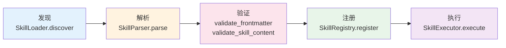

**各阶段详解：**

**1. 发现（SkillLoader）**
- `discover(skills_dir)`: 扫描目录下所有子目录的 `SKILL.md` 文件
- `load(skill_name)`: 按名称加载指定技能，优先从缓存查找
- 支持两种目录结构：
  - `definitions/<skill-name>/SKILL.md`（推荐）
  - `definitions/SKILL.md`（直接放在目录下）

**2. 解析（SkillParser）**
- 分离 YAML frontmatter 和 Markdown body
- 使用 `yaml.safe_load()` 解析 frontmatter
- 将 frontmatter 字段映射到 `Skill` dataclass
- `name` 未指定时自动取 `os.path.basename(os.path.dirname(source))`

**3. 验证（validation）**
- `validate_skill_content()`: 检查文件基本结构（非空、有 frontmatter、frontmatter 闭合）
- `validate_frontmatter()`: 检查必需字段、类型正确性、context 合法性
- 验证失败抛出 `SkillValidationError`，包含详细的 errors 列表

**4. 注册（SkillRegistry）**
- `register(skill)`: 以 `skill.name` 为键注册，重复注册覆盖并记录警告
- `get(name)`: 按名称查询
- `list_by_context(context)`: 按执行模式筛选（`inline` / `fork`）
- `unregister(name)`: 移除技能

**5. 执行（SkillExecutor）**
- 根据 `skill.context` 字段路由到 inline 或 fork 模式
- 执行前加载 `allowed_tools` 声明的工具

### 6.4 执行模式

#### inline 模式

将 `skill.prompt` + `arguments` 注入当前 Agent 上下文，由 Lead Agent 继续处理。

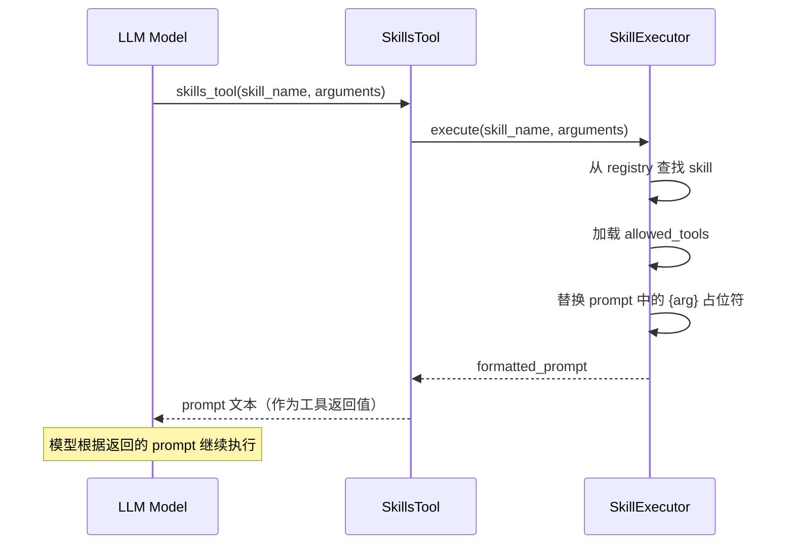

**特点：**
- 技能 prompt 作为工具调用的返回值注入对话
- 共享 Lead Agent 的上下文和工具集
- 适合轻量级、需要上下文感知的技能

#### fork 模式

创建独立子 Agent 执行，通过 `SubagentExecutor` 在独立线程池中运行。fork 模式支持两种子 Agent 构建方式：

**方式 A：通用执行（`agent` 字段为空）**

使用通用 SubagentExecutor，仅传入 instruction 和 allowed_tools，行为与现有实现一致。

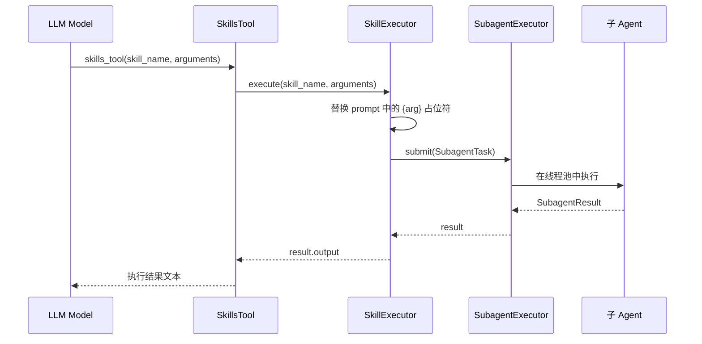

**方式 B：指定子 Agent 执行（`agent` 字段非空）**

根据 `skill.agent` 查找对应的 `SubagentConfig`，使用其专属配置（系统提示词、中间件、工具集）构建独立子 Agent 实例。

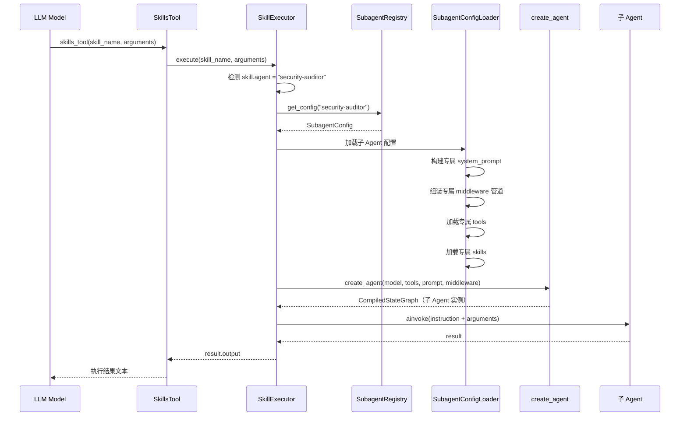

**特点：**
- 独立执行环境，不共享 Lead Agent 上下文
- 可指定不同的 LLM 模型
- 适合重量级、独立性强的技能
- 需要 `SubagentExecutor` 已配置，否则抛出 `SkillExecutionError`
- 指定 `agent` 时，子 Agent 拥有完全独立的系统提示词、中间件管道和工具集
- 未指定 `agent` 时，使用通用 SubagentExecutor 执行

#### 执行模式对比

| 维度 | inline | fork（通用） | fork（指定 agent） |
|------|--------|-------------|-------------------|
| 执行环境 | 共享 Lead Agent 上下文 | 独立子 Agent | 独立子 Agent（专属配置） |
| 上下文感知 | ✅ 可访问对话历史 | ❌ 仅接收 instruction | ❌ 仅接收 instruction |
| 系统提示词 | 共享 Lead Agent prompt | skill.prompt 作为 instruction | 子 Agent 专属 system_prompt |
| 中间件 | 共享 Lead Agent 中间件 | 无独立中间件 | 子 Agent 专属中间件管道 |
| 工具集 | 共享 Lead Agent 工具 + allowed_tools | allowed_tools | 子 Agent 专属工具集 |
| Skills | 共享 Lead Agent Skills | 无 | 子 Agent 专属 Skills |
| 模型 | 继承主模型 | 可指定独立模型 | 可指定独立模型 |
| 适用场景 | 轻量级、需要上下文的技能 | 中等复杂度的独立任务 | 重量级、需要完整 Agent 能力的专业领域任务 |
| 并发 | 串行（在 Agent 循环内） | 可并行（线程池） | 可并行（线程池） |

### 6.5 SkillsTool — 模型调用技能的统一入口

`SkillsTool` 是一个 `BaseTool` 子类，作为模型调用技能的统一入口注册到 Agent 的工具集中。

```python
class SkillsToolInput(BaseModel):
    skill_name: str = Field(description="要调用的技能名称")
    arguments: dict[str, str] = Field(description="传递给技能的命名参数")

class SkillsTool(BaseTool):
    name: str = "skills_tool"
    description: str = "调用已注册的技能。传入 skill_name 和 arguments。"
    args_schema: type[BaseModel] = SkillsToolInput
    skill_executor: SkillExecutor
    parent_thread_id: str = "default"
```

**调用链路：** 模型 → `skills_tool(skill_name, arguments)` → `SkillExecutor.execute()` → inline/fork

**同步/异步桥接：**
- `_arun()`: 直接 `await self.skill_executor.execute()`
- `_run()`: 检测是否在运行中的事件循环内，是则通过 `ThreadPoolExecutor` 桥接，否则直接 `asyncio.run()`

### 6.6 如何编写一个新技能

**Step 1: 创建技能目录**

```
service/neo_agent_v2/skills/definitions/<skill-name>/
└── SKILL.md
```

**Step 2: 编写 SKILL.md**

```markdown
---
description: 你的技能描述（必填）
when_to_use: 何时使用此技能
arguments:
  - arg1
  - arg2
allowed-tools:
  - tool_name_1
context: inline   # 或 fork
model: ""          # 留空继承主模型，或指定如 "gpt-4o"
agent: ""          # fork 模式下指定子 Agent 名称（仅 context=fork 时生效）
---

你的技能提示词内容。

可以使用 {arg1} 和 {arg2} 作为参数占位符，
执行时会被实际参数值替换。
```

**Step 3: 注册技能**

两种方式：

1. **自动发现**：将 SKILL.md 放在 `skills/definitions/` 目录下，`SkillLoader.discover()` 会自动扫描加载
2. **指定加载**：在 `AgentConfig.skill_names` 中添加技能名称

```python
agent_config = AgentConfig()
agent_config.skill_names = ['code-review', 'your-new-skill']
```

**Step 4: 验证**

技能文件会在加载时自动验证：
- frontmatter 格式正确
- `description` 字段存在且非空
- `context` 值合法（`inline` 或 `fork`）
- `arguments` 和 `allowed-tools` 为列表类型

验证失败会记录警告日志并跳过该技能，不会阻止 Agent 启动。

### 6.7 如何运行技能

技能从注册到执行的完整链路：

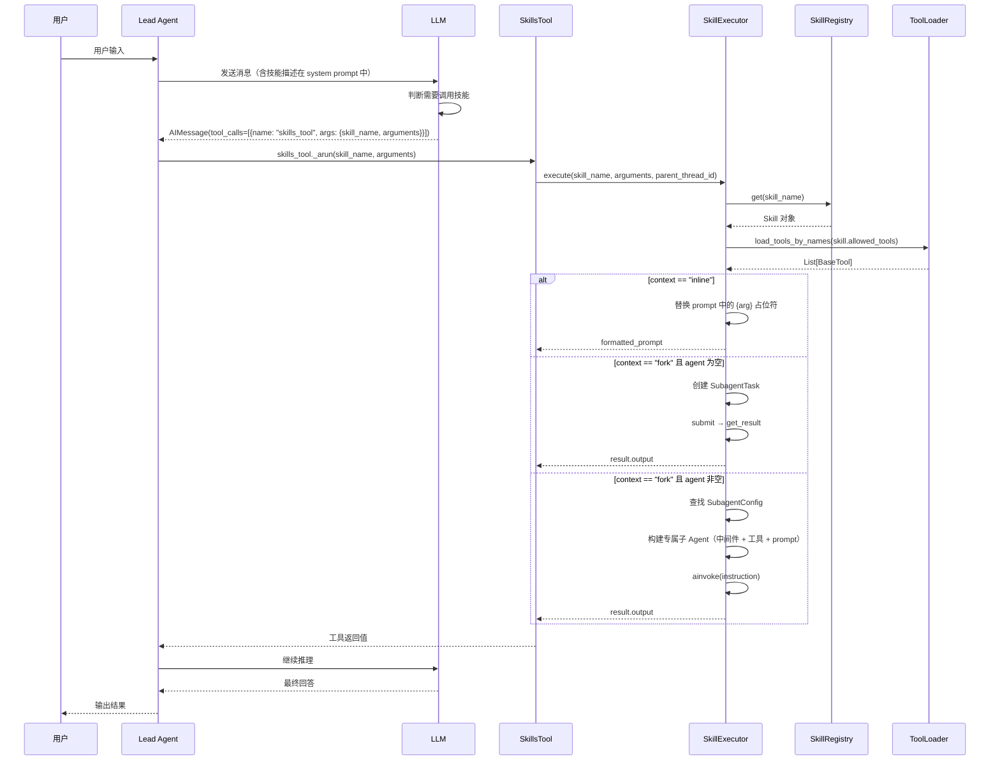

**关键点：**

1. **技能信息注入 system prompt**：在 Agent 创建时，`build_system_prompt()` 会将所有已注册技能的 name、description、when_to_use、arguments 注入系统提示词的 `<skills>` 标签中
2. **模型自主决策**：模型根据用户输入和技能描述，自主决定是否调用 `skills_tool`
3. **参数替换**：执行时将 `arguments` 字典中的值替换 prompt 中的 `{key}` 占位符
4. **错误处理**：技能未注册 → `SkillValidationError`；fork 模式无 executor → `SkillExecutionError`；子 Agent 执行失败 → `SkillExecutionError`；指定的 agent 配置不存在 → `SkillExecutionError`

## 7. 子 Agent 系统

### 7.1 数据模型

```python
@dataclass
class SubagentDefinition:
    name: str                          # 子 Agent 名称
    description: str                   # 描述
    task_type: TaskType = TaskType.IO  # 任务类型：IO | CPU
    metadata: dict[str, Any] = {}

@dataclass
class SubagentTask:
    task_id: str              # 任务 ID（UUID）
    agent_name: str           # 目标子 Agent 名称
    instruction: str          # 执行指令
    parent_thread_id: str     # 父线程 ID
    context: dict[str, Any]   # 上下文数据
    created_at: datetime      # 创建时间

@dataclass
class SubagentResult:
    task_id: str       # 任务 ID
    success: bool      # 是否成功
    output: str        # 输出内容
    error: str | None  # 错误信息
```

### 7.2 双线程池执行器

`SubagentExecutor` 使用两个独立的 `ThreadPoolExecutor` 分离 I/O 密集型和 CPU 密集型任务：

| 线程池 | 默认 workers | 用途 |
|--------|-------------|------|
| IO Pool | 4 | I/O 密集型任务（API 调用、网络请求） |
| CPU Pool | 2 | CPU 密集型任务（数据处理、计算） |

**执行流程：**
1. `submit(task)`: 根据 `task_type` 选择线程池，通过 `run_in_executor` 异步提交
2. `_execute(handler, task)`: 在线程池中执行，捕获所有异常封装为 `SubagentResult`
3. `get_result(task_id)`: 等待任务完成，返回结果

### 7.3 子 Agent 配置体系

当 fork 模式的 Skill 指定了 `agent` 字段时，系统需要加载该子 Agent 的完整配置来构建独立的 Agent 实例。

#### 7.3.1 SubagentConfig 数据模型

```python
@dataclass
class SubagentConfig:
    """子 Agent 完整配置，描述一个可被 fork 技能驱动的专属子 Agent。"""

    name: str                    # 子 Agent 唯一标识
    description: str = ""        # 子 Agent 描述
    system_prompt: str = ""      # 专属系统提示词
    model: str = ""              # 指定 LLM 模型，为空则继承 Lead Agent 主模型
    
    # 中间件配置
    middleware_names: list[str] = field(default_factory=list)
    # 可选值: "logging", "loop_detection", "tool_error_handling",
    #         "summarization", "guardrail", "output_validation" 等
    # 为空时使用最小默认中间件集（logging + tool_error_handling）
    middleware_config: dict[str, dict[str, Any]] = field(default_factory=dict)
    # 中间件个性化参数，如 {"loop_detection": {"warn_threshold": 2, "hard_limit": 3}}
    
    # 工具配置
    tool_names: list[str] = field(default_factory=list)
    # 子 Agent 专属的工具名称列表，从全局 ToolRegistry 中按名称加载
    # 不继承 Lead Agent 的工具集
    
    # 技能配置
    skill_names: list[str] = field(default_factory=list)
    # 子 Agent 可调用的技能列表（仅 inline 模式技能，防止递归 fork）
    
    # 特性开关
    features: dict[str, bool] = field(default_factory=dict)
    # 覆盖默认 Features，如 {"memory_enabled": False, "guardrail_enabled": True}
    
    # 扩展配置
    metadata: dict[str, Any] = field(default_factory=dict)
```

**字段详解：**

| 字段 | 类型 | 必填 | 说明 |
|------|------|------|------|
| `name` | str | **是** | 子 Agent 唯一标识，与 Skill 的 `agent` 字段对应 |
| `description` | str | 否 | 子 Agent 用途描述 |
| `system_prompt` | str | 否 | 专属系统提示词，替代 Lead Agent 的 prompt |
| `model` | str | 否 | 指定 LLM 模型，为空继承主模型 |
| `middleware_names` | list[str] | 否 | 需要加载的中间件名称列表 |
| `middleware_config` | dict | 否 | 中间件个性化参数 |
| `tool_names` | list[str] | 否 | 专属工具名称列表 |
| `skill_names` | list[str] | 否 | 可调用的技能列表（仅 inline 模式） |
| `features` | dict | 否 | 特性开关覆盖 |
| `metadata` | dict | 否 | 扩展配置 |

#### 7.3.2 配置加载方式

子 Agent 配置支持两种加载方式：

**方式 A：YAML 配置文件**

在配置目录下定义子 Agent 配置：

```yaml
# config/subagents/security-auditor.yaml
name: security-auditor
description: 专业安全审计子 Agent
system_prompt: |
  你是一位专业的安全审计专家，专注于 OWASP Top 10 漏洞检测和供应链安全分析。
  请严格按照安全审计标准执行检查，输出结构化的审计报告。
model: gpt-4o

middleware_names:
  - logging
  - tool_error_handling
  - guardrail
  - loop_detection

middleware_config:
  loop_detection:
    warn_threshold: 2
    hard_limit: 3
  guardrail:
    allowed_tools:
      - file_reader
      - dependency_scanner

tool_names:
  - file_reader
  - dependency_scanner
  - cve_lookup

skill_names: []

features:
  memory_enabled: false
  guardrail_enabled: true
```

**方式 B：代码注册**

```python
from service.neo_agent_v2.subagents.config import SubagentConfig

config = SubagentConfig(
    name="security-auditor",
    description="专业安全审计子 Agent",
    system_prompt="你是一位专业的安全审计专家...",
    model="gpt-4o",
    middleware_names=["logging", "tool_error_handling", "guardrail"],
    tool_names=["file_reader", "dependency_scanner", "cve_lookup"],
)

# 注册到 SubagentRegistry
subagent_registry.register_config("security-auditor", config)
```

#### 7.3.3 子 Agent 构建流程

当 SkillExecutor 检测到 `skill.agent` 非空时，触发以下构建流程：

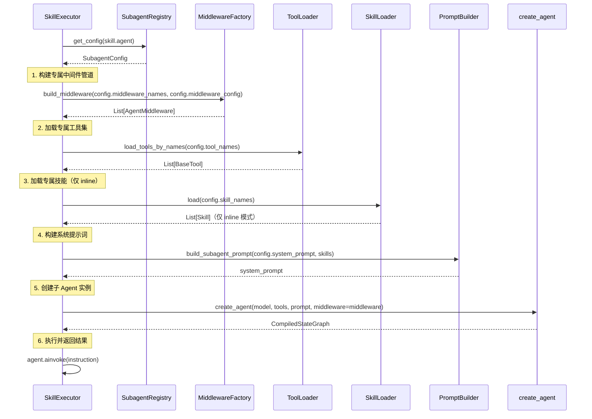

**关键设计决策：**

1. **子 Agent 不创建 Checkpointer**：子 Agent 是短生命周期的，状态不需要独立持久化
2. **子 Agent 的 Skills 仅限 inline 模式**：防止 fork 技能递归调用 fork 技能导致无限嵌套
3. **子 Agent 实例可缓存**：对于相同配置的子 Agent，可以缓存 CompiledStateGraph 实例避免重复构建

### 7.4 主/子 Agent 资源隔离

子 Agent 拥有完全独立的运行时资源，与 Lead Agent 严格隔离。

#### 7.4.1 隔离维度对比

| 维度 | Lead Agent | 子 Agent（指定 agent） | 隔离方式 |
|------|-----------|----------------------|---------|
| 系统提示词 | `build_system_prompt()` 生成 | `SubagentConfig.system_prompt` | 完全独立，不继承 |
| 中间件管道 | `_build_middleware(features)` 14 个 | `SubagentConfig.middleware_names` 按需加载 | 完全独立，不继承 |
| 工具集 | `ToolLoader.load_tools()` 全量 | `SubagentConfig.tool_names` 按名称加载 | 完全独立，不继承 |
| Skills | `AgentConfig.skill_names` | `SubagentConfig.skill_names`（仅 inline） | 完全独立，不继承 |
| LLM 模型 | `AgentConfig.model_name` | `SubagentConfig.model` 或继承 | 可独立指定 |
| Checkpointer | Redis / SQLite | 无 | 子 Agent 不持久化状态 |
| 特性开关 | `Features` 全量 | `SubagentConfig.features` 覆盖 | 独立配置 |
| 线程状态 | `ThreadState` | 独立的 `ThreadState` 实例 | 不共享消息历史 |

#### 7.4.2 中间件隔离

子 Agent 的中间件管道通过 `middleware_names` 声明式配置，与 Lead Agent 完全独立：

```python
# Lead Agent 中间件（14 个，按 Features 开关加载）
lead_middleware = _build_middleware(features)

# 子 Agent 中间件（按 SubagentConfig 配置加载）
sub_middleware = _build_subagent_middleware(
    middleware_names=["logging", "tool_error_handling", "guardrail"],
    middleware_config={"guardrail": {"allowed_tools": ["file_reader"]}},
)
```

**子 Agent 默认最小中间件集**（`middleware_names` 为空时）：
- `AgentLoggingMiddleware` — 日志记录（调试必需）
- `ToolErrorHandlingMiddleware` — 工具异常处理（稳定性必需）

**子 Agent 可选中间件**（按需添加）：
- `LoopDetectionMiddleware` — 防止子 Agent 循环调用
- `GuardrailMiddleware` — 工具白名单控制
- `SummarizationMiddleware` — 长上下文压缩
- `OutputValidationMiddleware` — 输出质量检查

**子 Agent 不适用的中间件**：
- `MemoryMiddleware` — 子 Agent 是短生命周期，不需要记忆
- `TitleMiddleware` — 子 Agent 不生成对话标题
- `TodoMiddleware` — 子 Agent 不参与计划模式
- `SubagentLimitMiddleware` — 子 Agent 不再嵌套子 Agent
- `InputTransformMiddleware` — 子 Agent 输入由 SkillExecutor 控制
- `OutputRenderMiddleware` — 子 Agent 输出由 Lead Agent 统一渲染
- `DanglingToolCallMiddleware` — 子 Agent 是单次执行，不存在悬挂问题
- `ClarificationMiddleware` — 子 Agent 不直接与用户交互

#### 7.4.3 工具集隔离

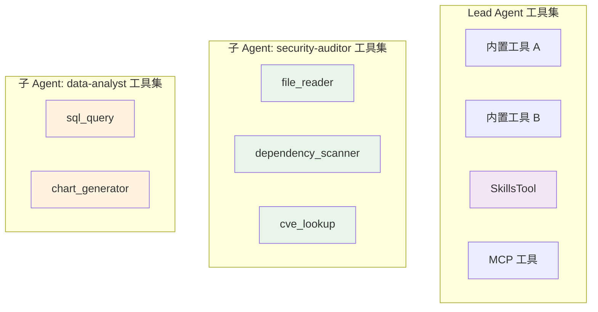

- Lead Agent 的工具集包含 SkillsTool（技能调用入口），子 Agent 不包含 SkillsTool（防止递归）
- 子 Agent 的工具通过 `SubagentConfig.tool_names` 从全局 ToolRegistry 按名称加载
- 同一个工具实例可以被多个子 Agent 共享（工具本身是无状态的）

#### 7.4.4 Skills 隔离

- 子 Agent 可以拥有自己的 Skills 注册表，但仅限 inline 模式技能
- 子 Agent 的 SkillRegistry 与 Lead Agent 的 SkillRegistry 是独立实例
- 子 Agent 不会加载 fork 模式的技能，避免递归嵌套

```
Lead Agent SkillRegistry:
  ├── code-review (inline)
  ├── security-audit (fork, agent=security-auditor)
  └── data-analysis (fork, agent=data-analyst)

security-auditor SkillRegistry:
  ├── cve-check (inline)        ← 子 Agent 专属 inline 技能
  └── dependency-scan (inline)  ← 子 Agent 专属 inline 技能

data-analyst SkillRegistry:
  └── chart-format (inline)     ← 子 Agent 专属 inline 技能
```

### 7.5 子 Agent 生命周期与驱动模型

#### 7.5.1 核心约束：子 Agent 不能独立运行

子 Agent 是 Lead Agent 的「执行代理」，不具备独立运行的能力：

- **无独立入口**：子 Agent 没有 Adapter 层，不接受外部请求
- **无独立状态**：子 Agent 不持有 Checkpointer，状态不持久化
- **无独立生命周期**：子 Agent 的创建和销毁完全由 Lead Agent 控制
- **单向驱动**：Lead Agent → SkillsTool → SkillExecutor → 子 Agent，不可反向

#### 7.5.2 生命周期

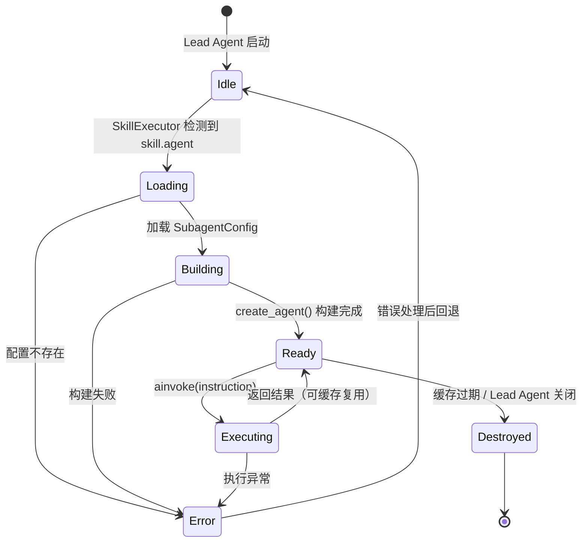

**各阶段说明：**

| 阶段 | 触发条件 | 行为 |
|------|---------|------|
| Idle | Lead Agent 启动 | 子 Agent 尚未创建，等待技能调用 |
| Loading | `skill.agent` 非空 | 从 SubagentRegistry 查找配置 |
| Building | 配置加载成功 | 构建中间件、工具集、提示词，调用 `create_agent()` |
| Ready | 构建完成 | 子 Agent 实例就绪，可接受执行请求 |
| Executing | `ainvoke()` 调用 | 子 Agent 处理 instruction，返回结果 |
| Destroyed | 缓存过期或主动销毁 | 释放子 Agent 实例资源 |
| Error | 任何阶段异常 | 抛出 `SkillExecutionError`，回退到 Idle |

#### 7.5.3 实例缓存策略

为避免每次技能调用都重新构建子 Agent，采用实例缓存：

```python
class SubagentCache:
    """子 Agent 实例缓存，按 agent_name 缓存已构建的 CompiledStateGraph。"""
    
    def __init__(self, max_size: int = 10, ttl_seconds: int = 3600):
        self._cache: OrderedDict[str, CacheEntry] = OrderedDict()
        self._max_size = max_size
        self._ttl = ttl_seconds
    
    def get(self, agent_name: str) -> CompiledStateGraph | None: ...
    def put(self, agent_name: str, agent: CompiledStateGraph) -> None: ...
    def invalidate(self, agent_name: str) -> None: ...
```

- **缓存键**：`agent_name`（SubagentConfig.name）
- **缓存大小**：默认最多 10 个子 Agent 实例，LRU 淘汰
- **TTL**：默认 1 小时，过期后下次调用重新构建
- **主动失效**：配置变更时调用 `invalidate()` 清除缓存

#### 7.5.4 完整驱动链路

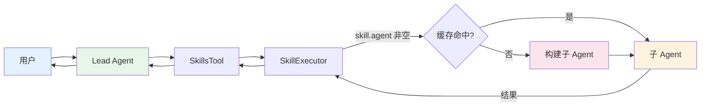

**驱动规则：**
1. 用户请求只能到达 Lead Agent
2. Lead Agent 通过 SkillsTool 触发技能
3. SkillExecutor 根据 `skill.agent` 决定是否构建专属子 Agent
4. 子 Agent 执行完毕后，结果回传给 Lead Agent
5. Lead Agent 整合结果后回复用户
6. 子 Agent 永远不直接与用户交互

## 8. 适配器层

`NeoAgentV2Adapter` 是 Agent V2 对外暴露的单例入口，封装了 Agent 的初始化和执行：

```python
class NeoAgentV2Adapter:
    def __init__(self):
        self._agent: CompiledStateGraph | None = None

    async def _ensure_agent(self) -> CompiledStateGraph:
        """懒加载：首次调用时初始化 Agent"""

    async def execute(self, thread_id, user_input, history) -> AsyncGenerator[dict, None]:
        """执行 Agent，输出 {'data': chunk} 格式事件流"""
```

**特点：**
- **懒加载**：首次调用 `execute()` 时才初始化 Agent，后续复用
- **消息转换**：`_build_messages()` 将 `[{role, content}]` 格式的历史消息转换为 LangChain Message 对象
- **输出格式**：与现有 producer.py 的 `{'data': {'type': MessageType, 'content': ...}}` 格式对齐
- **SSE 事件转换**：`_sse_event_to_chunk()` 将 SSEEvent 映射为 MessageType 格式（Text、ActionStart、ActionEnd）

全局单例：`neo_agent_v2_adapter = NeoAgentV2Adapter()`
