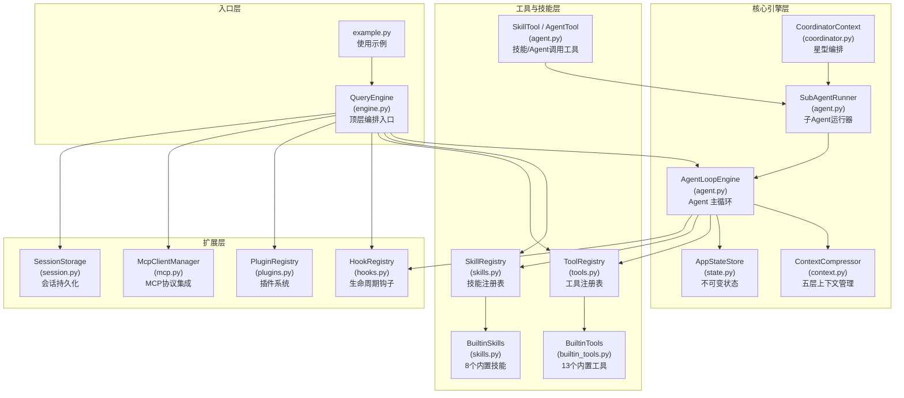
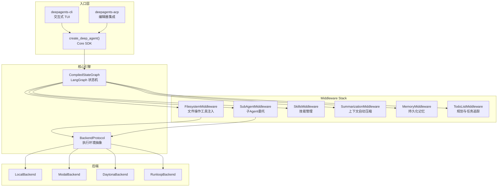
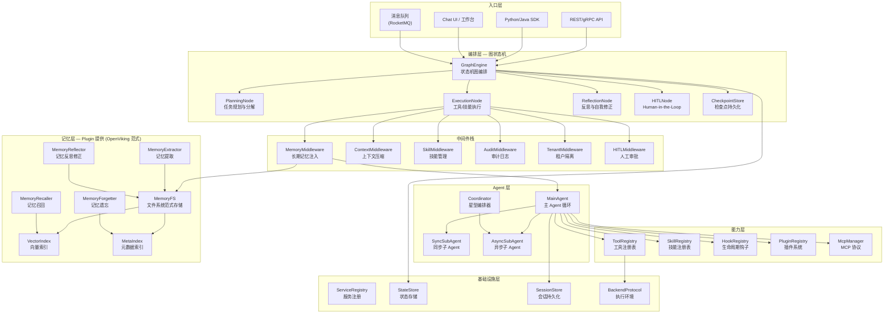
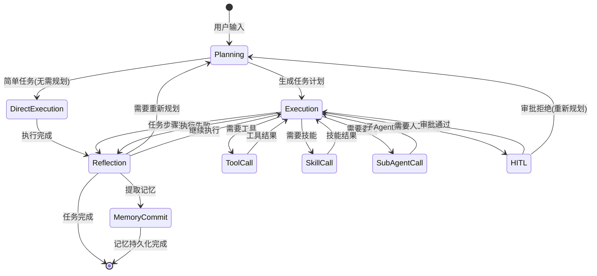
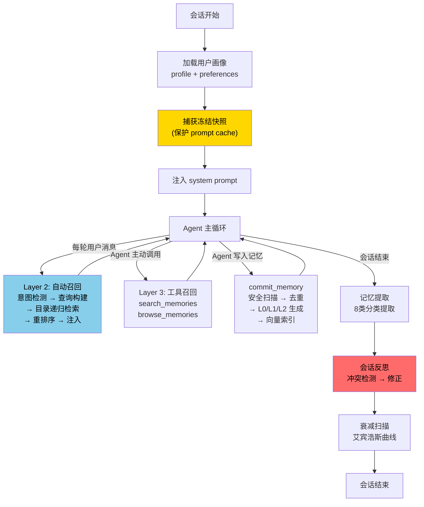
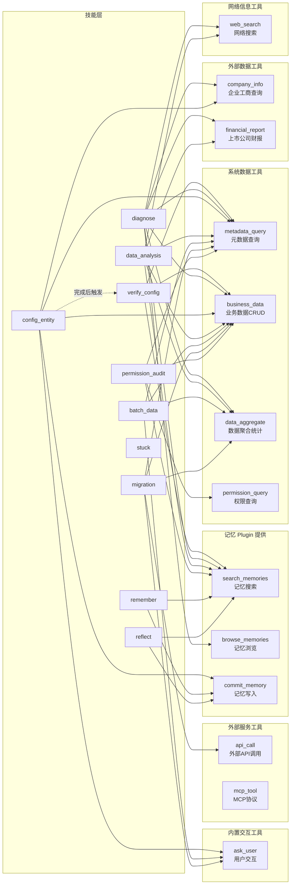
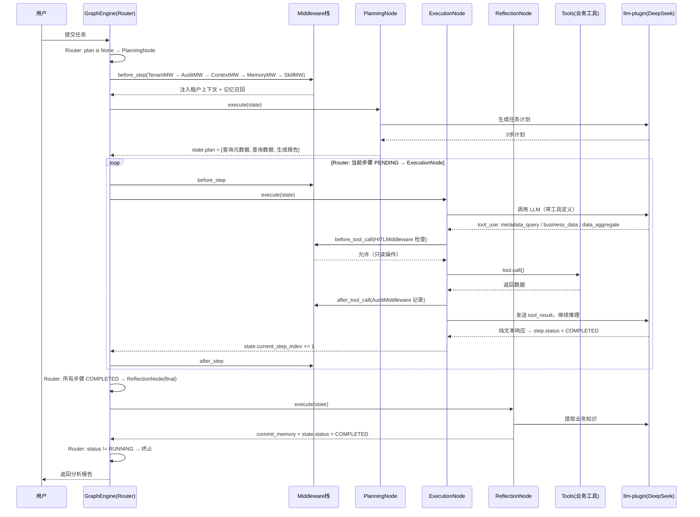

# 2B 行业 Agent 系统深度设计方案 — DeepAgent 架构

> 基于 agent-system 现有代码深度分析 + LangChain DeepAgents 框架 + OpenViking 文件系统范式 + Hermes 长期记忆，设计面向 aPaaS 平台的企业级 Agent 系统

---

## 一、现有 agent-system 代码深度分析

### 1.1 项目概述

agent-system 是一套借鉴 Claude Code 架构的 Python Agent 框架原型，约 3500 行代码，覆盖了 Agent 系统的完整骨架。核心模块 14 个文件，实现了 Agent Loop + Skills + Tools + Hooks + Plugins + MCP + Session + Coordinator 体系。

### 1.2 系统架构图



### 1.3 核心功能清单

| 功能名称 | 一句话描述 | 核心模块/文件 | 复杂度 |
|----------|-----------|-------------|--------|
| Agent 主循环 | while(true) + yield 模式的 agentic loop，集成 Hooks/Session/压缩/反思 | `agent.py` AgentLoopEngine | 高 |
| 工具体系 | 统一 Tool 接口 + 权限控制 + 结果预算 + 并行执行 | `tools.py` + `builtin_tools.py` | 高 |
| 技能体系 | 8 个内置技能 + 文件技能加载 + inline/fork 执行模式 | `skills.py` | 中 |
| 子 Agent 编排 | 命名 Agent + Fork 模式 + 独立工具池 + 权限隔离 | `agent.py` SubAgentRunner | 高 |
| Coordinator 模式 | 星型编排，Coordinator 只编排不执行，Worker 外围执行 | `coordinator.py` | 中 |
| 上下文管理 | 六策略压缩：Budget/Snip/Microcompact/Collapse/Autocompact/Reactive | `context.py` | 高 |
| Hook 系统 | Pre/Post ToolUse + Session 生命周期钩子 | `hooks.py` | 中 |
| 插件系统 | 插件提供 Skills + Hooks + MCP Servers | `plugins.py` | 中 |
| MCP 集成 | JSON-RPC 协议连接外部工具服务器 | `mcp.py` | 中 |
| 会话持久化 | JSONL transcript + 文件快照 + 子 Agent sidechain | `session.py` | 中 |
| 反思机制 | 连续相同工具/连续错误检测 + 权限拒绝追踪 | `agent.py` ReflectionState | 低 |
| 状态管理 | 不可变状态 + 订阅模式 | `state.py` | 低 |
| LLM 客户端 | Anthropic API 完整实现 + Mock 客户端 | `llm_client.py` | 中 |
| 顶层引擎 | 组装所有子系统，提供 submit_message() 接口 | `engine.py` QueryEngine | 高 |

### 1.4 核心数据流

```
用户输入 → QueryEngine.submit_message()
  → 初始化所有子系统 (工具/技能/插件/MCP/Session)
  → 构建 System Prompt (systemContext + userContext + claudeMd)
  → AgentLoopEngine.run()
    → SessionStart Hooks
    → while(true):
      │ → 上下文压缩管线 (Budget → Snip → Microcompact)
      │ → 动态附件注入
      │ → PreQuery Hooks
      │ → 组装 System Prompt
      │ → LLM API 调用 (带重试)
      │ → 解析响应 → yield assistant_msg
      │ → 提取 tool_use blocks
      │ → 无 tool_use? → StopHooks → 结束
      │ → 并行执行工具 (findTool → preHook → validate → permission → call → postHook → budget)
      │ → 反思检测 (stuck pattern)
      │ → 权限拒绝追踪
      │ → 构建 tool_result 消息
      │ → 持久化 transcript
      └ → 继续循环
  → 最终持久化
```

### 1.5 现有代码的优势与不足

#### 优势

1. **架构完整性高** — 从 QueryEngine 到 Tool 执行的全链路已打通，14 个模块职责清晰
2. **扩展性好** — Plugin/MCP/Hook 三套扩展机制，支持多种方式增强能力
3. **容错机制** — 指数退避重试 + 反思检测 + 权限拒绝追踪
4. **上下文管理成熟** — 六策略压缩管线，借鉴 Claude Code 的生产级方案
5. **测试覆盖** — 60+ 测试用例，覆盖所有核心模块

#### 不足（需要增强的方向）

| 维度 | 现状 | 目标 |
|------|------|------|
| 长期记忆 | 仅有 CLAUDE.md 文件级记忆 + remember skill | 需要 OpenViking 式分层记忆 + 向量检索 + 遗忘策略 |
| 反思能力 | 仅检测 stuck pattern（连续相同工具/连续错误） | 需要深度反思：失败驱动反思、用户纠正反思、全局一致性审计 |
| 图编排 | 线性 while(true) 循环 | 需要 LangGraph 式状态机图编排，支持条件分支、并行、循环 |
| 异步子 Agent | 同步阻塞式子 Agent | 需要 DeepAgents 式异步子 Agent，fire-and-forget + 状态追踪 |
| 中间件架构 | Hook 系统较简单 | 需要 DeepAgents 式 Middleware Stack，拦截模型调用和工具执行 |
| 2B 行业适配 | 通用框架 | 需要租户隔离、元数据驱动、业务对象感知 |

---

## 二、LangChain DeepAgents 框架深度分析

### 2.1 DeepAgents 概述

[DeepAgents](https://github.com/langchain-ai/deepagents) 是 LangChain 团队开源的"电池全包"Agent 框架（v0.5.3，MIT 协议），灵感来自 Claude Code。核心定位：一个开箱即用的 Agent 运行时，内置规划、文件系统、子 Agent 委托和上下文管理。

关键特性：
- **LangGraph 原生** — `create_deep_agent()` 返回编译后的 LangGraph 图，支持流式、持久化、检查点
- **Middleware 架构** — 6 个内置中间件拦截模型调用和工具执行
- **异步子 Agent** — v0.5 新增，fire-and-forget 模式，支持远程 Agent Protocol 服务器
- **Backend 抽象** — 文件系统和 Shell 操作通过 BackendProtocol 抽象，支持本地/Docker/Modal/Daytona 等
- **Provider 无关** — 支持任何支持 tool calling 的 LLM

### 2.2 DeepAgents 架构图



### 2.3 DeepAgents 核心设计模式

#### 2.3.1 Middleware 拦截模式

DeepAgents 的核心创新是 Middleware Stack。每个中间件可以：
- `wrap_model_call()` — 拦截 LLM 调用前后，注入工具定义、修改 prompt
- `before_tool_call()` — 工具执行前拦截，可修改参数或拒绝执行
- `after_tool_call()` — 工具执行后处理，可修改结果或触发后续动作

这比我们现有的 Hook 系统更强大，因为中间件可以组合成管线，每个中间件独立管理自己的状态。

#### 2.3.2 异步子 Agent（v0.5 新增）

```
主 Agent ──→ start_async_task("researcher", prompt) ──→ 返回 task_id（不阻塞）
  │
  │ 继续处理其他工作或与用户对话
  │
  ├──→ check_async_task(task_id) ──→ 查询状态/获取结果
  ├──→ update_async_task(task_id, new_instructions) ──→ 发送后续指令
  ├──→ cancel_async_task(task_id) ──→ 取消任务
  └──→ list_async_tasks() ──→ 列出所有任务状态
```

异步子 Agent 基于 Agent Protocol（LangChain 的开放规范），支持：
- 远程部署（不同硬件、不同模型、不同工具集）
- 跨交互有状态（thread 历史保留）
- 与同步子 Agent 混合使用

#### 2.3.3 TodoList 规划

DeepAgents 用 `write_todos` 工具实现任务规划，而非独立的 Planning Agent：
- Agent 在开始复杂任务前自动分解为 todo 列表
- 每完成一步更新 todo 状态
- 规划信息持久化到文件系统，跨会话可恢复

#### 2.3.4 上下文窗口管理

- **SummarizationMiddleware** — 对话过长时自动调用 LLM 生成摘要
- **Tool Result Eviction** — 大工具结果自动写入文件，用文件路径替代
- **文件系统作为外部记忆** — Agent 主动将中间结果写入文件，减少上下文占用

### 2.4 DeepAgents vs 我们的 agent-system 对比

| 维度 | DeepAgents | 我们的 agent-system |
|------|-----------|-------------------|
| 编排模型 | LangGraph 状态机图 | while(true) 循环 |
| 扩展机制 | Middleware Stack（6个） | Hook + Plugin（分离） |
| 子 Agent | 同步 + 异步（Agent Protocol） | 同步（SubAgentRunner） |
| 规划 | TodoListMiddleware | 无内置规划 |
| 文件系统 | BackendProtocol 抽象（本地/远程） | 直接文件操作 |
| 记忆 | MemoryMiddleware + SkillsMiddleware | CLAUDE.md + remember skill |
| 上下文管理 | SummarizationMiddleware + Eviction | 六策略压缩管线（更丰富） |
| 安全 | Path Validation + Shell Allow-list | 权限模式 + deny rules |
| 2B 适配 | 无（通用框架） | 无（需要设计） |

---


---

## 三、融合设计：2B 行业 DeepAgent 系统

### 3.0 设计背景：Agent 系统的核心特性需求

Agent 与传统软件的三个关键差异决定了系统设计方向：

| 差异 | 带来的问题 | 需要的特性 | 我们的实现 |
|------|-----------|-----------|-----------|
| 高延迟（LLM 调用秒级） | 用户等待体验差 | 流式输出 + 可中断调用 | AgentCallbacks + interrupt_event |
| 低可靠性（长时间运行易失败） | 重试成本高 | 检查点恢复 | CheckpointStore |
| 非确定性（LLM 输出不可预测） | 需要人工介入 | Human-in-the-Loop | HITLMiddleware + PAUSED/resume |

**设计决策：自研简化版状态机（Router + 三个 Node），不直接依赖 LangGraph 库。** 理由：aPaaS 平台需要深度定制（租户隔离、审计日志、业务域子 Agent），直接依赖第三方框架会限制灵活性。

### 3.1 设计目标

将以下四个系统的精华融合为一套面向 2B 行业的 Agent 系统：

| 来源 | 借鉴要素 |
|------|---------|
| 现有 agent-system | Agent Loop + Tools + Skills + Hooks + Plugins + MCP + Session + Coordinator |
| LangChain DeepAgents | Middleware Stack + 异步子 Agent + TodoList 规划 + Backend 抽象 |
| LangGraph | 状态机图编排 + 检查点 + 确定性并发 + Human-in-the-Loop |
| OpenViking + Hermes | 文件系统范式记忆 + L0/L1/L2 三层模型 + 8 类记忆分类 + 反思修正 |

### 3.2 整体架构图



### 3.3 图状态机编排引擎

> 详细设计见 [Agent-Core-详细设计.md](Agent-Core-详细设计.md)，包含完整的状态定义、路由决策表、Node 内部循环、中间件执行时序、错误处理边界、HITL 暂停/恢复机制、以及 5 个完整的执行时序示例。

借鉴 LangGraph 的状态机理念，设计我们自己的图编排引擎：



#### 3.3.1 GraphState 核心字段

> 完整字段定义见 [Agent-Core-详细设计.md 第一章](Agent-Core-详细设计.md#一核心概念定义)

```python
@dataclass
class GraphState:
    # 身份与会话
    session_id: str                           # 会话 ID
    tenant_id: str                            # 租户 ID（隔离边界）
    user_id: str                              # 当前用户 ID
    messages: list[Message]                   # 完整对话历史
    
    # 任务规划
    plan: TaskPlan | None = None              # 当前任务计划
    current_step_index: int = 0               # 当前执行步骤
    
    # 执行追踪
    current_node: str = "router"              # 当前 Node
    total_llm_calls: int = 0                  # 累计 LLM 调用次数
    total_tool_calls: int = 0                 # 累计工具调用次数
    consecutive_errors: int = 0               # 连续错误计数
    consecutive_same_tool: int = 0            # 连续同一工具计数
    
    # 状态控制
    status: AgentStatus = AgentStatus.RUNNING # running/paused/completed/failed/max_turns/aborted
    pause_reason: str | None = None           # HITL 暂停原因
    
    # 上下文
    memory_context: str = ""                  # 记忆召回内容（MemoryMiddleware 注入）
    system_prompt: str = ""                   # 完整 system prompt
    checkpoint_version: int = 0               # 检查点版本号
```

#### 3.3.2 Router 路由决策

> 完整路由逻辑见 [Agent-Core-详细设计.md 第二章](Agent-Core-详细设计.md#二执行引擎主循环graphengine)

Router 根据 GraphState 决定下一个 Node，按优先级从高到低：

| 优先级 | 条件 | 路由到 |
|--------|------|--------|
| 1 | status != RUNNING | 终止 |
| 2 | total_llm_calls >= 200 | 终止(MAX_TURNS) |
| 3 | consecutive_errors >= 5 或 consecutive_same_tool >= 4 | ReflectionNode（stuck 自救） |
| 4 | plan is None | PlanningNode |
| 5 | 所有步骤 COMPLETED | ReflectionNode（最终反思） |
| 6 | 当前步骤 FAILED | ReflectionNode（失败分析） |
| 7 | 当前步骤 PENDING/RUNNING | ExecutionNode |

#### 3.3.3 主循环执行流程

> 完整伪代码见 [Agent-Core-详细设计.md 2.2 节](Agent-Core-详细设计.md#22-主循环伪代码)

```
GraphEngine.run(state):
  while True:
    node = Router.next_node(state)     # 路由决策
    if node is None: break             # 终止条件
    
    for mw in middlewares:             # 中间件前处理（按注册顺序）
      state = mw.before_step(state)
    
    state = node.execute(state)        # Node 执行
    
    for mw in reversed(middlewares):   # 中间件后处理（逆序）
      state = mw.after_step(state)
    
    checkpoint_store.save(state)       # 保存检查点
    yield state                        # 流式输出
    
    if state.status == PAUSED: break   # HITL 暂停
```

#### 3.3.4 三个核心 Node 的职责

> 完整内部逻辑见 [Agent-Core-详细设计.md 第三~五章](Agent-Core-详细设计.md#三planningnode-详细设计)

| Node | 职责 | 内部逻辑 | 输出 |
|------|------|---------|------|
| PlanningNode | 任务分解 | 判断复杂度 → 简单任务生成单步计划 / 复杂任务调用 LLM 生成多步计划 → 校验步骤数 ≤ 15 → 搜索历史经验注入 | state.plan 被填充 |
| ExecutionNode | 步骤执行 | 内部 mini agent loop: while step.status == RUNNING { LLM 调用 → 解析响应 → 有 tool_use? → 执行工具 → 继续 / 纯文本? → 步骤完成 } | 步骤 COMPLETED 或 FAILED |
| ReflectionNode | 反思决策 | 判断反思类型 → 最终反思(提取记忆) / 失败分析(retry/skip/replan/escalate/abort) / stuck 自救(注入自救 prompt) / 用户纠正(修正记忆) | 状态变更或 plan 清空 |

#### 3.3.5 HITL 暂停与恢复

> 完整机制见 [Agent-Core-详细设计.md 2.3 节](Agent-Core-详细设计.md#23-hitl-暂停与恢复机制)

```
暂停: HITLMiddleware.before_tool_call() 拦截危险操作
  → state.status = PAUSED, pause_reason = "..."
  → 保存检查点 → 退出主循环 → 展示给用户

恢复: GraphEngine.resume(session_id, decision)
  → approve: 继续执行被暂停的操作
  → reject:  跳过当前步骤
  → abort:   终止任务
  → 超时(1h): 自动 ABORTED
```

#### 3.3.6 错误处理分级

> 完整 16 级错误定义见 [Agent-Core-详细设计.md 第七章](Agent-Core-详细设计.md#七错误处理边界完整定义)

| 级别 | 场景 | 处理 |
|------|------|------|
| L1-L4 | 工具级错误（校验/执行/超时/权限） | 返回错误 tool_result，LLM 自行修正 |
| L5-L7 | LLM 可重试错误（超时/限流/服务端） | 指数退避重试，最多 3 次 |
| L8 | LLM 不可重试错误（认证失败） | 直接 FAILED |
| L9-L10 | 轮次耗尽（步骤级/全局级） | 步骤级→反思分析，全局级→终止 |
| L11-L12 | 连续错误/重复工具 | Router→ReflectionNode stuck 自救 |
| L13 | 重新规划上限（3次） | FAILED |
| L14 | HITL 超时（1小时） | ABORTED |
| L15-L16 | 中间件/检查点异常 | 记录日志，不阻塞主流程 |

### 3.4 中间件栈设计

借鉴 DeepAgents 的 Middleware 架构，设计我们的中间件栈：

```python
class Middleware(Protocol):
    """中间件接口 — 借鉴 DeepAgents 的 Middleware 模式"""
    name: str
    
    async def before_step(self, state: GraphState, nodes: list[GraphNode]) -> GraphState:
        """图步骤执行前"""
        return state
    
    async def after_step(self, state: GraphState, nodes: list[GraphNode]) -> GraphState:
        """图步骤执行后"""
        return state
    
    async def wrap_model_call(self, state: GraphState, call_fn: Callable) -> Any:
        """拦截 LLM 调用"""
        return await call_fn(state)
    
    async def before_tool_call(self, tool_name: str, input_data: dict) -> dict | None:
        """工具调用前拦截，返回 None 表示拒绝"""
        return input_data
    
    async def after_tool_call(self, tool_name: str, result: ToolResult) -> ToolResult:
        """工具调用后处理"""
        return result
```

#### 6 个核心中间件

| 中间件 | 职责 | 借鉴来源 |
|--------|------|---------|
| `TenantMiddleware` | 租户隔离：注入租户上下文、过滤工具/技能、隔离记忆空间 | 2B 行业需求 |
| `MemoryMiddleware` | 长期记忆：会话开始注入画像、每轮自动召回、记忆写入拦截 | memory-plugin 提供（OpenViking + Hermes） |
| `ContextMiddleware` | 上下文管理：五层压缩策略 + Tool Result Eviction + 自动摘要 | [压缩详细方案](Agent-Context-Compression-详细方案.md) |
| `SkillMiddleware` | 技能管理：技能发现、注入使用经验、技能自动创建 | 现有 SkillRegistry + Hermes skillify |
| `AuditMiddleware` | 审计日志：记录所有 LLM 调用、工具执行、状态变更 | 2B 行业合规需求 |
| `HITLMiddleware` | 人工审批：危险操作拦截、审批流程、超时处理 | DeepAgents HITLMiddleware + LangGraph interrupt |

### 3.5 长期记忆系统设计

> 记忆系统通过 memory-plugin 提供，非 Agent 引擎内置能力。Plugin 启用后，MemoryMiddleware 自动注册到中间件栈，search_memories/browse_memories/commit_memory 三个工具自动注册到 ToolRegistry。

融合 OpenViking 文件系统范式 + Hermes 冻结快照 + 反思修正机制：



#### 3.5.1 记忆存储模型

采用 OpenViking 的文件系统范式 + L0/L1/L2 三层模型：

```
{tenant_id}/
├── user/memories/
│   ├── profile.md                    # 用户画像
│   ├── preferences/                  # 用户偏好
│   │   ├── .abstract.md              # L0: ~100 tokens
│   │   ├── .overview.md              # L1: ~2k tokens
│   │   ├── coding_style.md           # L2: 完整内容
│   │   └── communication.md          # L2
│   ├── entities/                     # 实体记忆（人、项目、业务对象）
│   └── events/                       # 事件记录
├── agent/memories/
│   ├── cases/                        # 学习到的案例
│   ├── patterns/                     # 学习到的模式
│   ├── tools/                        # 工具使用知识
│   ├── skills/                       # 技能执行知识
│   └── reflections/                  # 反思日志
└── shared/memories/                  # 租户级共享记忆
    ├── domain_knowledge/             # 行业知识
    └── best_practices/               # 最佳实践
```

#### 3.5.2 四层召回体系

| 层级 | 触发时机 | 召回方式 | Token 成本 |
|------|---------|---------|-----------|
| Layer 1: 画像注入 | 会话开始（一次性） | profile 全量 + 高质量摘要 | 固定 ~500 tokens |
| Layer 2: 自动召回 | 每轮用户消息 | 意图检测 → 目录递归检索 → 重排序 | ~200-1000 tokens |
| Layer 3: 工具召回 | Agent 主动调用 | search_memories / browse_memories | 按需 |
| Layer 4: 技能注入 | 读取技能定义时 | 拦截 skill 读取，追加使用经验 | ~100-500 tokens |

#### 3.5.3 记忆遗忘与反思

**衰减评分模型**（基于艾宾浩斯遗忘曲线）：

```
memory_score = 0.30 × time_decay          # 时间衰减（指数）
             + 0.20 × frequency_factor     # 访问频率
             + 0.25 × importance_factor    # 重要性 × 置信度
             + 0.10 × reference_factor     # 被引用次数
             + 0.15 × category_factor      # 类别保护权重
```

**记忆状态机**：Active → Fading → Dormant → Archived

**五种反思触发**：
1. 会话结束反思 — 检查新记忆与已有记忆的矛盾
2. 冲突检测反思 — 新记忆写入时触发
3. 定期全局反思 — 每周一次，碎片合并 + 一致性检查
4. 失败驱动反思 — 任务失败后分析是否因错误记忆导致
5. 用户反馈反思 — 检测用户纠正行为

### 3.6 子 Agent 设计

> 主 Agent 初始化（8 个 Phase）和子 Agent 初始化（同步/异步两种模式）的完整流程见 [Agent-Core-详细设计.md 〇.一~〇.二节](Agent-Core-详细设计.md#〇一主-agent-初始化)

#### 3.6.1 两种子 Agent 模式

| 模式 | 触发工具 | 执行方式 | 适用场景 |
|------|---------|---------|---------|
| 同步 | `delegate_task` | 阻塞主 Agent，等待完成 | 短任务（< 2 分钟）：查询、校验、简单分析 |
| 异步 | `start_async_task` | 不阻塞，后台执行 | 长任务（> 2 分钟）：深度研究、批量处理、数据迁移 |

#### 3.6.2 继承与隔离原则

子 Agent 从主 Agent 派生时：
- **继承**: tenant_id、user_id、llm-plugin、memory-plugin、审计日志
- **隔离**: messages（独立对话历史）、session_id（派生 ID）、notification（不发通知）、HITL（不弹审批）
- **限制**: 工具集和技能集按 agent_type 裁剪、max_llm_calls 独立限制

#### 3.6.3 按业务域划分的子 Agent 类型

> 完整的工具分配表和三方交集算法见 [Agent-Core-详细设计.md](Agent-Core-详细设计.md#主-agent-与子-agent-的业务域工具分配)

参考 Salesforce 等 2B 平台覆盖的业务场景（销售/客服/营销/运营），子 Agent 按业务域而非技术能力划分：

| 业务域 | 类型 | 工具集 | 典型任务 |
|--------|------|--------|---------|
| 销售 | sales | business_data, data_aggregate, company_info, financial_report, web_search, search_memories | 查客户背景、分析商机、竞品调研 |
| 客服 | service | business_data, metadata_query, web_search, search_memories, ask_user | 诊断问题、搜索方案、引导用户 |
| 运营分析 | analytics | business_data, data_aggregate, financial_report, web_search, search_memories | 数据统计、趋势分析、异常检测 |
| 平台配置 | config | metadata_query, business_data, permission_query, search_memories, ask_user | 配置业务对象、字段规则、权限 |
| 数据管理 | data_ops | metadata_query, business_data, data_aggregate, api_call, ask_user | 数据清理、批量更新、迁移 |
| 外部调研 | research | web_search, company_info, financial_report, search_memories | 行业调研、企业尽调、政策查询 |
| 通用 | general | 继承主 Agent 全部（除编排工具） | 无法归类的任务 |

关键约束：
- 编排工具（delegate_task / start_async_task）只有主 Agent 可用，子 Agent 不能递归派生
- 每个域的工具集是该场景的最小必要集合
- 工具裁剪算法：`最终工具集 = 主 Agent 工具集 ∩ 业务域默认工具集 ∩ LLM 请求工具集`

#### 3.6.4 异步子 Agent 管理工具

| 工具 | 功能 |
|------|------|
| `start_async_task` | 启动异步任务，立即返回 task_id |
| `check_async_task` | 查询状态/获取结果 |
| `update_async_task` | 发送后续指令（任务有状态） |
| `cancel_async_task` | 取消任务 |
| `list_async_tasks` | 列出所有任务 |

### 3.7 2B 行业适配设计

#### 3.7.1 租户隔离

```python
class TenantMiddleware(Middleware):
    """租户隔离中间件"""
    name = "tenant"
    
    async def before_step(self, state: GraphState, nodes: list[GraphNode]) -> GraphState:
        tenant = await self._load_tenant(state.tenant_id)
        
        # 1. 注入租户上下文
        state.messages.insert(0, Message(
            role=MessageRole.SYSTEM,
            content=f"当前租户: {tenant.name}, 行业: {tenant.industry}"
        ))
        
        # 2. 过滤工具（租户级权限）
        # 某些租户可能禁用某些工具
        
        # 3. 隔离记忆空间
        # 记忆路径前缀为 {tenant_id}/
        
        return state
```

#### 3.7.2 2B 业务工具体系设计

> Tool 统一接口（Protocol）、ToolRegistry、13 个工具的完整 input_schema、工具调用链路、工具与后端服务的调用关系见 [Agent-Core-详细设计.md 〇.〇节](Agent-Core-详细设计.md#〇〇tool-接口与注册体系)

> 现有 agent-system 的 13 个内置工具（file_read/file_write/bash/grep/glob/web_fetch 等）面向开发者的文件系统和命令行操作。2B 业务场景下，Agent 需要的核心能力是：查系统数据、查网络信息、查工商数据、操作业务对象、调用外部服务。本节从零设计面向 2B 业务的工具体系。

##### 工具分类总览

从 2B 业务用户的实际工作场景出发，按"用户想做什么"而非"技术上调什么 API"来组织工具。底层通过 aPaaS 元数据驱动实现通用性——同一个 Tool 可以操作任何业务对象（客户/商机/工单/合同等）。

```
2B 业务工具体系:

一、查系统数据（2B 用户最高频的操作）
│
├── query_data          — 智能查询业务数据
│                         "帮我查一下上个月新增的客户"
│                         "看看金额超过100万的商机"
│                         "这个客户的详细信息"
│                         用户只需说自然语言，Tool 内部自动:
│                           1. 识别目标业务对象（客户/商机/工单/合同...）
│                           2. 查询对象的字段结构（自动调 metadata-service）
│                           3. 将自然语言条件转为过滤参数
│                           4. 执行查询并返回结果
│                         支持: 列表查询、单条详情、条件过滤、分页、排序
│                         底层: paas-metadata-service + paas-entity-service
│
├── modify_data         — 修改业务数据（创建/更新/删除）
│                         "帮我建一个新客户，公司名华为"
│                         "把这个商机的阶段改为已赢单"
│                         "删除这些过期的测试数据"（触发 HITL 审批）
│                         Tool 内部自动:
│                           1. 识别操作类型（create/update/delete）
│                           2. 查询字段结构，校验数据合法性
│                           3. 执行操作
│                         底层: paas-metadata-service + paas-entity-service
│
└── analyze_data        — 数据统计分析
                          "各渠道的转化率" "本月新增客户数" "按行业统计营收"
                          "最近三个月的商机趋势"
                          支持: count/sum/avg/min/max + 分组 + 时间趋势
                          底层: paas-entity-service 聚合查询

二、管系统配置（系统管理员的工作）
│
├── query_schema        — 查询业务对象的结构
│                         "客户这个对象有哪些字段"
│                         "商机和客户是什么关系"
│                         "这个字段的校验规则是什么"
│                         底层: paas-metadata-service
│
├── modify_schema       — 修改业务对象的配置（触发 HITL 审批）
│                         "给客户加一个行业字段"
│                         "修改这个校验规则"
│                         底层: paas-metarepo-service
│
└── query_permission    — 查询权限配置
                          "这个用户能看到哪些数据"
                          "销售角色的权限是什么"
                          底层: paas-privilege-service

三、外部信息获取（了解客户/市场/竞品）
│
├── web_search          — 搜索互联网信息
│                         "搜一下这个行业的最新政策" "竞品最近有什么动态"
│                         依赖: search-plugin（供应商可替换）
│
│                         "把这个网页的内容抓下来" "提取这篇报告的数据"
│                         依赖: search-plugin
│
├── company_info        — 查询企业工商信息
│                         "查一下这家公司的背景" "看看他们的股东结构"
│                         依赖: company-data-plugin（供应商可替换）
│
└── financial_report    — 查询上市公司财报
                          "看看这家公司的财务状况" "最近三年的营收趋势"
                          依赖: financial-data-plugin（供应商可替换）

四、协作与记忆
│
├── ask_user            — 向用户提问或确认
│                         "你希望按什么维度分析？" "确认要删除这些数据吗？"
│
├── search_memories     — 搜索历史经验
│                         "之前类似的问题怎么解决的" "这个客户上次聊了什么"
│                         依赖: memory-plugin
│
├── save_memory         — 保存业务知识
│                         "记住这个客户偏好简洁报告" "保存这次的配置方案"
│                         依赖: memory-plugin
│
└── send_notification   — 发送通知
                          "通知销售经理这个商机有更新" "提醒客户合同快到期了"
                          依赖: notification-plugin

五、任务编排（仅主 Agent 可用）
│
├── delegate_task       — 委托子任务（同步，等待完成）
│                         "帮我校验一下这个配置" "分析一下这批数据"
│
└── start_async_task    — 启动后台任务（异步，不等待）
                          "后台调研一下这三家竞品" "批量清理过期数据"
```

##### 工具清单汇总

| 分类 | 工具名 | 用户怎么说 | 底层服务 | 依赖 Plugin |
|------|--------|-----------|---------|------------|
| 查系统数据 | query_data | "查一下上个月的客户" | metadata-service + entity-service | — |
| 查系统数据 | modify_data | "建一个新客户" "删除测试数据" | metadata-service + entity-service | — |
| 查系统数据 | analyze_data | "各渠道转化率" "月度趋势" | entity-service 聚合 | — |
| 管系统配置 | query_schema | "客户有哪些字段" | metadata-service | — |
| 管系统配置 | modify_schema | "加一个行业字段" | metarepo-service | — |
| 管系统配置 | query_permission | "谁能看这些数据" | privilege-service | — |
| 查外部信息 | web_search | "搜一下行业动态" | — | search-plugin |
| 查外部信息 | company_info | "查公司背景" | — | company-data-plugin |
| 查外部信息 | financial_report | "看财务状况" | — | financial-data-plugin |
| 协作与记忆 | ask_user | "你想怎么分析？" | 前端回调 | — |
| 协作与记忆 | search_memories | "之前怎么解决的" | — | memory-plugin |
| 协作与记忆 | save_memory | "记住这个偏好" | — | memory-plugin |
| 协作与记忆 | send_notification | "通知销售经理" | — | notification-plugin |
| 任务编排 | delegate_task | "帮我校验配置" | 子 Agent | — |
| 任务编排 | start_async_task | "后台调研竞品" | 异步子 Agent | — |

**与旧设计的关键变化**:
1. `business_data`（6 种 action 合一）→ 拆为 `query_data` + `modify_data` + `analyze_data` 三个 Tool
   - `query_data` 是**智能查询**：内部自动查 schema → 理解字段 → 构建过滤 → 执行查询，用户不需要先调 metadata_query
   - `modify_data` 合并了 create/update/delete，内部自动识别操作类型
   - `analyze_data` 专注统计分析，与查询分离
2. `metadata_query` → `query_schema`，`schema_modify` 新增
3. `commit_memory` → `save_memory`，`browse_memories` 合并到 `search_memories`
4. 总数: 15 个 Tool（查数据 3 + 管配置 3 + 查外部 3 + 协作 4 + 编排 2）

##### 工具权限矩阵

> 完整的四层权限控制模型见 [Agent-Core-详细设计.md 权限控制完整模型](Agent-Core-详细设计.md#权限控制完整模型)

权限控制分四层，从外到内依次执行：

| 层级 | 控制什么 | 谁执行 | 粒度 |
|------|---------|--------|------|
| 第一层: 工具准入 | 能用哪些工具 | AgentFactory（enabled_tools/disabled_tools） | 工具级 |
| 第二层: 租户隔离 | 只看自己租户的数据 | TenantMiddleware（自动注入 tenant_id） | 数据级 |
| 第三层: 业务数据权限 | RBAC + 行级权限 | 后端微服务（透传 user_id，Agent 不做判断） | 行级 |
| 第四层: 危险操作审批 | 破坏性操作需确认 | HITLMiddleware（is_destructive + 自定义规则） | 操作级 |

##### 各工具的权限属性

| 工具 | 分类 | 只读 | HITL 审批 | 租户隔离 | 数据权限 | 依赖 Plugin |
|------|------|------|----------|---------|---------|------------|
| query_data | 查数据 | ✅ | ❌ | ✅ 自动注入 | ✅ 后端过滤 | — |
| modify_data (create/update) | 查数据 | ❌ | 可配置 | ✅ | ✅ | — |
| modify_data (delete) | 查数据 | ❌ | ✅ 必须确认 | ✅ | ✅ | — |
| analyze_data | 查数据 | ✅ | ❌ | ✅ | ✅ 后端过滤 | — |
| query_schema | 管配置 | ✅ | ❌ | ✅ | ❌ | — |
| modify_schema | 管配置 | ❌ | ✅ 必须确认 | ✅ | ❌ | — |
| query_permission | 管配置 | ✅ | ❌ | ✅ | ❌ | — |
| web_search | 查外部 | ✅ | ❌ | ❌ | ❌ | search-plugin |
| company_info | 查外部 | ✅ | ❌ | ✅ API配额 | ❌ | company-data-plugin |
| financial_report | 查外部 | ✅ | ❌ | ✅ API配额 | ❌ | financial-data-plugin |
| ask_user | 协作 | — | ❌ | ❌ | ❌ | — |
| search_memories | 协作 | ✅ | ❌ | ✅ 路径隔离 | ❌ | memory-plugin |
| save_memory | 协作 | ❌ | ❌ | ✅ 路径隔离 | ❌ | memory-plugin |
| send_notification | 协作 | — | ❌ | ✅ | ❌ | notification-plugin |
| delegate_task | 编排 | — | ❌ | ✅ | ❌ | — |
| start_async_task | 编排 | — | ❌ | ✅ | ❌ | — |

##### 主 Agent 与子 Agent 的工具可见性差异

主 Agent 能看到全部 15 个 Tool，子 Agent 按业务域裁剪。以下是每个 Tool 在不同角色下的可见性：

| 工具 | 主 Agent | sales | service | analytics | config | data_ops | research |
|------|---------|-------|---------|-----------|--------|----------|----------|
| query_data | ✅ | ✅ | ✅ | ✅ | ✅ | ✅ | ❌ |
| modify_data | ✅ | ❌ | ❌ | ❌ | ✅ | ✅ | ❌ |
| analyze_data | ✅ | ✅ | ❌ | ✅ | ❌ | ✅ | ❌ |
| query_schema | ✅ | ❌ | ✅ | ❌ | ✅ | ✅ | ❌ |
| modify_schema | ✅ | ❌ | ❌ | ❌ | ✅ | ❌ | ❌ |
| query_permission | ✅ | ❌ | ❌ | ❌ | ✅ | ❌ | ❌ |
| web_search | ✅ | ✅ | ✅ | ✅ | ❌ | ❌ | ✅ |
| company_info | ✅ | ✅ | ❌ | ❌ | ❌ | ❌ | ✅ |
| financial_report | ✅ | ✅ | ❌ | ✅ | ❌ | ❌ | ✅ |
| ask_user | ✅ | ❌ | ✅ | ❌ | ✅ | ✅ | ❌ |
| search_memories | ✅ | ✅ | ✅ | ✅ | ✅ | ❌ | ✅ |
| save_memory | ✅ | ❌ | ❌ | ❌ | ❌ | ❌ | ❌ |
| send_notification | ✅ | ❌ | ❌ | ❌ | ❌ | ❌ | ❌ |
| delegate_task | ✅ | ❌ | ❌ | ❌ | ❌ | ❌ | ❌ |
| start_async_task | ✅ | ❌ | ❌ | ❌ | ❌ | ❌ | ❌ |

**可见性规则**:
- 主 Agent 看到全部 15 个 Tool（Plugin 未启用的除外）
- 子 Agent 看不到 delegate_task / start_async_task（不能递归派生）
- 子 Agent 看不到 save_memory / send_notification（不直接写记忆和发通知，由主 Agent 的 ReflectionNode 统一处理）
- 子 Agent 看不到 modify_data / modify_schema（除了 config 和 data_ops 域，其他域只读）
- sales 域能查数据、查外部信息，但不能改数据、改配置
- config 域能查改配置和数据，但不查外部信息
- research 域只查外部信息，不碰系统数据

**HITL 审批在子 Agent 中的行为**:
- 主 Agent: modify_data(delete) 和 modify_schema 触发 HITL → 暂停等待用户确认
- 子 Agent: HITL 被禁用 → 遇到需要审批的操作直接返回错误 "此操作需要人工确认，请在主对话中执行"

#### 3.7.3 审计与合规

```python
class AuditMiddleware(Middleware):
    """审计中间件 — 2B 行业合规要求"""
    name = "audit"
    
    async def wrap_model_call(self, state: GraphState, call_fn: Callable) -> Any:
        start = time.monotonic()
        result = await call_fn(state)
        duration = time.monotonic() - start
        
        await self._log_audit({
            "type": "llm_call",
            "tenant_id": state.tenant_id,
            "model": state.model,
            "input_tokens": result.get("usage", {}).get("input_tokens"),
            "output_tokens": result.get("usage", {}).get("output_tokens"),
            "duration_ms": duration * 1000,
            "timestamp": time.time(),
        })
        return result
    
    async def after_tool_call(self, tool_name: str, result: ToolResult) -> ToolResult:
        await self._log_audit({
            "type": "tool_call",
            "tool": tool_name,
            "is_error": result.is_error,
            "timestamp": time.time(),
        })
        return result
```

### 3.8 深度反思引擎

> 完整实现见 [Agent-Core-详细设计.md 第五章 ReflectionNode](Agent-Core-详细设计.md#五reflectionnode-详细设计)

ReflectionNode 是一个决策树，根据触发原因执行不同的反思策略：

| 触发类型 | 触发条件 | 反思策略 | 输出动作 |
|----------|---------|---------|---------|
| 最终反思 | 所有步骤完成 或 预算耗尽 | 生成总结 + 提取记忆 + 技能改进 | status=COMPLETED 或 MAX_TURNS |
| 步骤失败 | step.status == FAILED | 调用 LLM 分析根因 | retry / skip / replan / escalate / abort |
| Stuck 检测 | 连续 5 次错误 或 连续 4 次同一工具 | 注入自救 prompt（不调用 LLM，节省预算） | 重置计数器，继续执行 |
| 用户纠正 | 检测到"不对/错了/改主意" | 识别被纠正内容 → 修正相关记忆 | 更新 memory-plugin |
| Nudge 定时 | 每 10 轮用户消息 | 后台审查对话 → 提取业务知识 | commit_memory（8 类分类） |

失败分析的恢复策略决策：
```
步骤失败 → LLM 分析 → 返回 JSON:
  "retry"    → 重置步骤状态为 PENDING，重试
  "skip"     → 标记步骤为 SKIPPED，跳到下一步
  "replan"   → 清空 plan（replan_count < 3 时），Router → PlanningNode
  "escalate" → status=PAUSED，等待人工介入
  "abort"    → status=FAILED，终止
```

技能自我改进（借鉴 Hermes 闭环学习）：
- 技能执行成功 → 记录成功案例到 agent/memories/skills/{name}.md → 发现更优路径时更新技能文件
- 技能执行失败 → 记录失败原因 → 连续 3 次失败标记 needs_review

### 3.9 服务调用抽象层设计

2B 业务场景下，Agent 不直接操作文件系统和 Shell，而是通过平台微服务 API 完成业务操作。借鉴 DeepAgents 的 BackendProtocol 思路，将服务调用抽象为可替换的后端：

```python
class ServiceBackend(Protocol):
    """
    服务调用抽象 — 所有业务操作通过此接口路由到对应微服务
    不同部署环境可替换实现（直连/网关/Mock）
    """
    
    # 元数据服务 (paas-metadata-service)
    async def query_metadata(self, path: str, params: dict) -> dict: ...
    
    # 实体数据服务 (paas-entity-service)
    async def query_data(self, entity: str, filters: dict, **kw) -> dict: ...
    async def mutate_data(self, entity: str, action: str, data: dict) -> dict: ...
    async def aggregate_data(self, entity: str, metrics: list, **kw) -> dict: ...
    
    # 权限服务 (paas-privilege-service)
    async def query_permission(self, query_type: str, **kw) -> dict: ...
    
    # 外部 API 调用
    async def call_external_api(self, connection: str, endpoint: str, **kw) -> dict: ...
    
    # 工商数据（第三方）
    async def query_company(self, keyword: str, query_type: str) -> dict: ...

class DirectServiceBackend(ServiceBackend):
    """直连微服务后端 — 通过 HTTP 直接调用各微服务"""
    def __init__(self, service_registry: dict[str, str]):
        # {"metadata": "http://paas-metadata:8080", "entity": "http://paas-entity:8080", ...}
        self._services = service_registry

class GatewayServiceBackend(ServiceBackend):
    """网关后端 — 所有请求通过 paas-gateway 路由"""
    def __init__(self, gateway_url: str, auth_token: str):
        self._gateway = gateway_url
        self._token = auth_token

class MockServiceBackend(ServiceBackend):
    """Mock 后端 — 用于测试，返回预设响应"""
    def __init__(self):
        self._responses: dict[str, Any] = {}
```

### 3.10 Plugin / Tool / Skill 边界定义

> 完整的边界分析见 [Plugin-Tool-Skill-边界分析.md](Plugin-Tool-Skill-边界分析.md)

| 层 | 本质 | 特征 | 谁调用 |
|----|------|------|--------|
| Tool | 一次原子操作 | 无状态、单步、LLM 直接调用 | LLM（function calling） |
| Skill | 业务 SOP（多步流程） | 有步骤、有策略、需要多轮 Tool 调用 | Agent 自己（PlanningNode 加载） |
| Plugin | 可插拔基础设施 | 有状态、有配置、可替换 | 引擎内部（Middleware / Node / Tool 通过 PluginContext） |

关键规则：
- Plugin 不直接注册 Tool — Plugin 提供接口，Tool 通过 PluginContext 调用 Plugin
- Tool 始终由 ToolRegistry 统一管理 — 依赖 Plugin 的 Tool 通过 `is_enabled()` 检查 Plugin 是否可用
- stuck / remember / reflect / iterate 不是 Skill — 它们是引擎内置机制（ReflectionNode / PlanningNode）
- 判断新能力属于哪层：一次调用→Tool，多步流程→Skill，基础设施→Plugin，引擎机制→Node 内置

### 3.11 借鉴 Hermes Agent 的设计融合

> 以下 6 个设计点借鉴自 [Hermes Agent](https://github.com/nousresearch/hermes-agent)（MIT 协议），已融入 [Agent-Core-详细设计.md](Agent-Core-详细设计.md) 的对应章节：

| 借鉴点 | 融入位置 | 解决的问题 |
|--------|---------|-----------|
| 可中断 API 调用 | ExecutionNode LLM 调用逻辑 | 用户可随时打断长时间 LLM 调用 |
| 迭代预算与优雅终止 | AgentLimits + Router 路由 | 80%/95%/100% 三级预算警告，到达上限自动总结 |
| 压缩前记忆刷新 | ContextMiddleware 压缩流程 | 压缩前先 flush 记忆到磁盘，防止知识丢失 |
| 回调表面（8 种 callback） | PluginContext + 主循环 + ExecutionNode | 前端实时展示思考/工具调用/步骤进度 |
| 消息交替规则强制 | ExecutionNode LLM 调用前校验 | 防止违反 User→Assistant 交替规则被 LLM 拒绝 |
| 技能自我改进 | ReflectionNode 最终反思 | 技能在使用中自动改进，失败 3 次标记 needs_review |

---

## 四、面向 2B 业务的 Skill + Tool + Plugin 体系设计

> 现有 agent-system 的 8 个内置技能（verify/debug/stuck/remember/batch/loop/simplify/skillify）完全面向代码开发场景，其 prompt 中充斥着 `git diff`、`npm test`、`python -m pytest` 等开发工具指令，无法直接用于 2B 业务系统。本章从零设计面向 aPaaS 元数据驱动平台的技能体系。

### 4.1 设计原则

1. **业务语义优先** — 技能的触发条件、执行步骤、输出格式都围绕业务对象（Entity/Item/BusiType/CheckRule 等），而非代码文件
2. **元数据感知** — 技能 prompt 中内置对三层架构（元模型→元数据→业务数据）的理解，能正确使用 api_key 关联
3. **租户安全** — 所有技能执行都在租户隔离边界内，不能跨租户访问数据
4. **可组合** — 技能之间可以互相调用（如 config_entity 完成后自动触发 verify_config）
5. **经验积累** — 技能执行结果自动沉淀为记忆，下次执行同类任务时注入历史经验

### 4.2 内置技能清单（全部重新设计）

| 技能 | 描述 | 执行模式 | 允许的工具 | 触发场景 |
|------|------|---------|-----------|---------|
| verify_config | 校验元数据配置的正确性与一致性 | fork | metadata_query, business_data, search_memories | 配置变更后自动触发 |
| diagnose | 诊断业务数据异常或配置问题 | fork | metadata_query, business_data, data_aggregate, company_info, financial_report, web_search, search_memories, browse_memories | 用户报告问题时 |
| batch_data | 批量操作业务数据 | fork | metadata_query, business_data, data_aggregate, ask_user | 批量导入/更新/清理 |
| config_entity | 引导式业务对象配置向导 | fork | metadata_query, business_data, company_info, ask_user, commit_memory | 新建/修改业务对象 |
| skillify | 将业务操作流程转化为可复用技能 | fork | search_memories, commit_memory | 用户要求保存操作流程 |
| data_analysis | 业务数据分析与洞察 | fork | metadata_query, business_data, data_aggregate, financial_report, web_search, search_memories | 数据分析请求 |
| migration | 数据迁移与映射转换 | fork | metadata_query, business_data, data_aggregate, api_call, ask_user | 数据迁移场景 |
| permission_audit | 权限配置审计与优化建议 | fork | metadata_query, business_data, permission_query, search_memories | 权限相关问题 |

### 4.3 核心技能 Prompt 详细设计

#### 4.3.1 verify_config — 元数据配置校验

```python
async def verify_config_prompt(args: str = "", **kw) -> str:
    focus = f"\n\n重点校验范围: {args}" if args else ""
    return f"""你是 aPaaS 平台的元数据配置校验专家。校验最近的元数据配置变更是否正确、一致、完整。

## 平台架构理解

本平台采用三层架构：
- 第一层：元模型注册（MetaModel）— 定义有哪些类型的元数据
- 第二层：元模型字段定义（MetaItem）— 定义每种元模型有哪些属性
- 第三层：元数据实例 — Common 级（出厂）+ Tenant 级（租户自定义）

所有关联使用 api_key，禁止使用 ID 关联。

## 校验步骤

1. **识别变更范围**: 使用 metadata_query 查询最近变更的元数据配置。
   如果用户指定了范围，聚焦到指定的 Entity/Item/BusiType。

2. **字段定义校验**: 对每个变更的 EntityItem 检查：
   - api_key 是否符合 camelCase 规范（禁止 snake_case）
   - 布尔字段是否使用 xxxFlg 后缀 + Integer(0/1)（禁止 enable*/is* 前缀）
   - 是否有对应的 xxxKey 国际化字段（label→labelKey, description→descriptionKey）
   - item_type 编码是否正确（VARCHAR/INTEGER/DECIMAL/DATE/DATETIME/RELATIONSHIP 等）
   - db_column 映射是否合理（类型匹配、无冲突）

3. **关联关系校验**: 对每个 EntityLink 检查：
   - 关联的 Entity api_key 是否存在
   - 关联类型（LOOKUP/MASTER_DETAIL/MANY_TO_MANY）是否合理
   - 反向关联是否正确配置

4. **校验规则校验**: 对每个 CheckRule 检查：
   - 引用的字段 api_key 是否存在于对应 Entity
   - 规则表达式语法是否正确
   - 必填/唯一/范围等约束是否合理

5. **业务类型校验**: 对每个 BusiType 检查：
   - 选项值（PickOption）是否完整
   - 是否有重复的 option_code
   - 默认值是否在选项范围内

6. **跨实体一致性**: 检查：
   - 计算公式（FormulaCompute）引用的字段是否都存在
   - 汇总累计（AggregationCompute）的源实体和目标实体关联是否正确
   - 数据权限配置（DataPermission）引用的角色/部门是否存在

## 输出格式

按严重程度分类报告：
- 🔴 ERROR: [必须修复] 会导致运行时错误的问题
- 🟡 WARNING: [建议修复] 不符合规范但不影响运行
- 🟢 PASS: [通过] 校验通过的项目
- 📊 SUMMARY: 总计 X 项检查，Y 项通过，Z 项需修复

最后给出 VERDICT: PASS / FAIL / WARNING{focus}"""
```

#### 4.3.2 diagnose — 业务问题诊断

```python
async def diagnose_prompt(args: str = "", **kw) -> str:
    return f"""你是 aPaaS 平台的业务问题诊断专家。系统化地诊断以下问题。

## 问题描述
{args or "[未指定具体问题 — 请检查最近的异常或用户反馈]"}

## 诊断协议

### 阶段 1: 问题定位
- 明确问题现象：哪个 Entity？哪个字段？哪个操作（CRUD/查询/计算）？
- 使用 metadata_query 查询相关的元数据配置
- 确认问题是元数据配置问题还是业务数据问题

### 阶段 2: 元数据层排查
- 检查 Entity 定义是否完整（必要字段是否缺失）
- 检查 EntityItem 的 item_type 和 db_column 映射是否正确
- 检查 EntityLink 关联关系是否正确
- 检查 CheckRule 校验规则是否有冲突
- 检查 FormulaCompute/AggregationCompute 计算公式是否引用了不存在的字段
- 检查 Common 和 Tenant 级元数据是否存在覆盖冲突

### 阶段 3: 业务数据层排查
- 使用 business_data 查询相关业务数据
- 检查数据是否符合元数据定义的约束
- 检查关联数据的一致性（外键引用是否有效）
- 检查计算字段的值是否与公式结果一致

### 阶段 4: 权限层排查
- 检查当前用户的角色和数据权限配置
- 检查 SharingRule 是否正确配置
- 检查 DataPermission 的过滤条件是否导致数据不可见

### 阶段 5: 历史经验参考
- 使用 search_memories 搜索是否有类似问题的历史诊断记录
- 如果有，参考历史解决方案

### 阶段 6: 给出诊断结论
- 根本原因（不是表面症状）
- 影响范围（哪些租户/哪些数据受影响）
- 修复方案（具体的配置变更步骤）
- 预防建议（如何避免类似问题再次发生）

## 规则
- 始终从元数据层开始排查，大部分问题根源在配置层
- 如果需要查看业务数据，注意数据权限边界
- 如果无法确定根因，列出 Top 3 假设并说明验证方法
- 诊断完成后，将问题和解决方案保存到记忆（commit_memory, category=cases）"""
```

#### 4.3.3 config_entity — 业务对象配置向导

```python
async def config_entity_prompt(args: str = "", **kw) -> str:
    return f"""你是 aPaaS 平台的业务对象配置向导。引导用户完成业务对象的创建或修改。

## 配置目标
{args or "[请描述你要配置的业务对象]"}

## 配置流程

### Step 1: 需求理解
向用户确认以下信息（使用 ask_user 工具）：
- 业务对象名称和用途（中文名 + 英文 api_key）
- 核心字段列表（名称、类型、是否必填）
- 与其他业务对象的关联关系
- 是否需要业务类型（BusiType）分类
- 是否需要审批流程

### Step 2: 元数据查询
- 使用 metadata_query 查询已有的 Entity 定义，避免重复
- 查询可能需要关联的目标 Entity
- 查询已有的 PickOption 选项值（可复用）
- 搜索记忆中是否有类似配置的历史经验

### Step 3: 配置方案设计
根据需求生成配置方案，包括：

**Entity 定义:**
- api_key: camelCase 英文（如 salesOrder）
- label: 简短中文名（如 "销售订单"）
- namespace: custom（租户自定义）

**字段定义（EntityItem）— 每个字段包含:**
- api_key: camelCase（如 orderAmount）
- label: 中文名 + labelKey 国际化键
- item_type: VARCHAR/INTEGER/DECIMAL/DATE/DATETIME/RELATIONSHIP/PICK_LIST 等
- requiredFlg: 是否必填（0/1）
- uniqueFlg: 是否唯一（0/1）
- helpText: 字段说明
- 布尔字段: xxxFlg 后缀 + INTEGER(0/1) + SMALLINT

**关联关系（EntityLink）:**
- 关联类型: LOOKUP / MASTER_DETAIL / MANY_TO_MANY
- 关联目标 Entity 的 api_key

**校验规则（CheckRule）:**
- 必填校验、格式校验、范围校验、唯一性校验

### Step 4: 用户确认
将完整配置方案展示给用户确认（使用 ask_user）

### Step 5: 执行配置
用户确认后，使用 business_data 工具依次创建：
1. Entity 定义 → 2. EntityItem 字段 → 3. EntityLink 关联
4. CheckRule 校验规则 → 5. BusiType 业务类型 → 6. PickOption 选项值

### Step 6: 配置验证
自动触发 verify_config 技能校验配置正确性。

### Step 7: 经验沉淀
将本次配置经验保存到记忆（cases + patterns 类别）。

## 关键约束
- 所有 api_key 使用 camelCase，禁止 snake_case
- 所有关联使用 api_key，禁止使用 ID
- 布尔字段统一 xxxFlg + Integer(0/1)
- 文本字段必须有 xxxKey 国际化字段
- namespace 为 custom（租户自定义）"""
```

#### 4.3.4 stuck — 业务场景自救协议

```python
async def stuck_prompt(args: str = "", **kw) -> str:
    return """你在处理业务任务时似乎陷入了困境。退一步，执行以下恢复协议：

## 自我评估
1. 原始业务目标是什么？
2. 已经尝试了哪些方法？
3. 每种方法为什么失败了？
4. 是否在重复相同的操作？

## 恢复策略（按顺序尝试）

### 策略 1: 重新理解元数据
- 用 metadata_query 重新查询相关 Entity 的完整定义
- 检查字段类型、关联关系、校验规则是否和你的假设一致
- 很多问题源于对元数据结构的误解

### 策略 2: 检查数据权限
- 当前操作是否受到数据权限限制？
- 查询 DataPermission 和 SharingRule 配置
- 某些数据"不存在"可能只是权限不可见

### 策略 3: 搜索历史经验
- 用 search_memories 搜索类似问题的历史解决方案
- 用 browse_memories 浏览 agent/memories/cases/ 目录

### 策略 4: 简化问题
- 能否用最小数据集复现问题？
- 去掉复杂的关联和计算，只保留核心字段

### 策略 5: 询问用户
- 使用 ask_user 工具，具体说明你尝试了什么、卡在哪里

## 禁止行为
- ❌ 重复调用相同的查询
- ❌ 忽略错误信息中的关键提示
- ❌ 在不理解元数据结构的情况下盲目操作数据
- ❌ 跳过权限检查直接操作"""
```

#### 4.3.5 data_analysis — 业务数据分析

```python
async def data_analysis_prompt(args: str = "", **kw) -> str:
    return f"""你是业务数据分析专家。基于 aPaaS 平台的元数据驱动架构进行数据分析。

## 分析目标
{args or "[请描述你的分析需求]"}

## 分析流程

### Step 1: 理解数据结构
- 使用 metadata_query 查询相关 Entity 的字段定义
- 理解字段类型（特别是 PICK_LIST 的选项值、RELATIONSHIP 的关联目标）
- 理解业务类型（BusiType）分类维度
- 搜索记忆中是否有该 Entity 的历史分析经验

### Step 2: 数据采集
- 使用 business_data 查询原始数据
- 注意数据权限边界 — 只能分析当前租户有权限的数据
- 如果数据量大，使用分页查询 + 聚合统计

### Step 3: 统计分析
- 分布分析: 按 PICK_LIST 字段或 BusiType 分组统计
- 趋势分析: 按 created_at/updated_at 时间维度聚合
- 关联分析: 通过 EntityLink 关联查询跨实体数据
- 异常检测: 识别不符合 CheckRule 的数据、空值率异常的字段

### Step 4: 洞察提炼
- 从数据中提炼关键发现（不是简单罗列数字）
- 结合历史记忆中的业务上下文解读数据

### Step 5: 输出报告
- 📊 数据概览（总量、时间范围、筛选条件）
- 🔍 关键发现（Top 3-5 个洞察）
- 📈 趋势/分布（文字描述 + 建议图表类型）
- ⚠️ 异常/风险
- 💡 行动建议

### Step 6: 经验沉淀
将分析方法和关键发现保存到记忆（cases + patterns 类别）。"""
```

#### 4.3.6 其余技能简要设计

| 技能 | 核心流程 | 关键设计点 |
|------|---------|-----------|
| batch_data | 查询元数据 → 评估影响范围 → 用户确认 → 分批执行(每批≤50条) → 结果报告 | 批量删除必须用户确认；单条失败不中止整批；操作后触发计算字段重算 |
| migration | 分析源数据结构 → 查询目标元数据 → 生成字段映射 → 用户确认 → 分批迁移 → 校验 | 处理 api_key 映射、item_type 转换、关联关系重建、Common/Tenant 层级 |
| permission_audit | 查询角色 → 查询数据权限 → 查询共享规则 → 分析覆盖范围 → 识别过度/不足授权 | 理解 RBAC 模型、SharingRule 条件、DataPermission 过滤逻辑 |
| skillify | 分析对话中的操作步骤 → 提炼为可复用技能模板 → 生成 .skills/{name}.md | prompt 中使用 ${1} 参数占位、引用 metadata_query/business_data 工具 |

### 4.4 技能与工具的依赖关系



### 4.5 技能自动创建与自我改进

借鉴 Hermes 的闭环学习机制，但围绕业务场景：

```
业务任务执行完成
  → ReflectionNode 检查：
    ├── 是否有值得保存的业务配置模式？
    │   → 是：保存到 agent/memories/patterns/
    │   → 例："CRM 行业的客户实体通常需要 company/contact/phone/email/source 字段"
    │
    ├── 是否有可复用的操作流程？
    │   → 是：自动调用 skillify 技能
    │   → 生成 .skills/{skill-name}.md
    │   → 例："配置审批流程" 的标准步骤被保存为技能
    │
    └── 是否有工具使用的最佳实践？
        → 是：保存到 agent/memories/tools/
        → 例："查询大量业务数据时，先用 count 确认数量，再分页查询"

下次执行类似任务时：
  → SkillMiddleware 拦截
  → 检索 agent/memories/ 中的相关经验
  → 注入到技能 prompt 中
  → 例：配置新的 CRM 客户实体时，自动建议标准字段列表
```

### 4.6 Plugin 体系增强 — 行业插件规范

```json
{
  "name": "crm-industry-plugin",
  "version": "1.0.0",
  "description": "CRM 行业插件 — 提供客户管理、销售管道、线索跟踪等业务能力",
  "industry": "crm",
  "required_entities": ["account", "contact", "opportunity", "lead"],

  "skills": [
    {
      "name": "lead-qualification",
      "description": "线索资质评估：分析线索信息，基于 BANT 模型评估转化可能性",
      "allowed_tools": ["metadata_query", "business_data", "search_memories"],
      "context": "fork",
      "prompt": "你是 CRM 线索评估专家。使用 BANT 模型（Budget/Authority/Need/Timeline）评估线索..."
    },
    {
      "name": "pipeline-analysis",
      "description": "销售管道分析：分析各阶段转化率、预测成交额、识别风险商机",
      "allowed_tools": ["metadata_query", "business_data", "search_memories"],
      "context": "fork"
    }
  ],

  "tools": [
    {
      "name": "crm_forecast",
      "description": "销售预测：基于历史数据和管道状态预测未来 N 个月的成交额",
      "api_endpoint": "/api/v1/crm/forecast",
      "input_schema": {
        "type": "object",
        "properties": {
          "period_months": {"type": "integer", "default": 3},
          "pipeline_stage": {"type": "string"}
        }
      }
    }
  ],

  "hooks": [
    {
      "event": "post_tool_use",
      "tool_name": "business_data",
      "action_type": "ask_agent",
      "prompt": "检查此数据操作是否符合 CRM 业务规则：商机金额变更需要记录变更原因；线索状态只能单向流转"
    }
  ],

  "memory_categories": ["leads", "opportunities", "accounts", "sales_patterns"],

  "entity_templates": [
    {
      "api_key": "account",
      "label": "客户",
      "standard_items": [
        {"api_key": "companyName", "label": "公司名称", "item_type": "VARCHAR", "requiredFlg": 1},
        {"api_key": "industry", "label": "行业", "item_type": "PICK_LIST"},
        {"api_key": "annualRevenue", "label": "年营收", "item_type": "DECIMAL"},
        {"api_key": "employeeCount", "label": "员工数", "item_type": "INTEGER"},
        {"api_key": "website", "label": "网站", "item_type": "VARCHAR"},
        {"api_key": "activeFlg", "label": "是否活跃", "item_type": "INTEGER"}
      ]
    }
  ]
}
```

### 4.7 平台级 Plugin — 记忆与通知

记忆和通知不是 Agent 的内置工具，而是通过 Plugin 机制提供的平台级能力。这样设计的原因：

- **可替换性** — 不同部署环境可以使用不同的记忆后端（文件系统/向量数据库/Redis），不同的通知渠道（站内信/钉钉/飞书/邮件）
- **可禁用** — 某些租户可能不需要长期记忆功能，或者出于数据合规要求禁用记忆
- **独立演进** — 记忆系统和通知系统可以独立升级，不影响 Agent 核心引擎

#### 4.7.1 大模型 Plugin (llm-plugin)

Agent 引擎本身不绑定任何 LLM 提供商，大模型能力通过 Plugin 接入。这样设计的原因：
- **多模型切换** — 不同租户可配置不同模型（DeepSeek/GPT-4o/Claude/通义千问/文心一言）
- **成本控制** — 简单任务用小模型，复杂任务用大模型，租户可自定义路由策略
- **私有化部署** — 部分租户要求数据不出境，可接入私有部署的模型

```json
{
  "name": "llm-plugin",
  "version": "1.0.0",
  "type": "platform",
  "required": true,
  "default_enabled": true,

  "providers": [
    {
      "name": "deepseek",
      "description": "DeepSeek — 高性价比，支持 tool calling",
      "api_base": "https://api.deepseek.com",
      "models": ["deepseek-chat", "deepseek-reasoner"],
      "supports_tool_calling": true,
      "default": true
    },
    {
      "name": "openai",
      "description": "OpenAI GPT 系列",
      "api_base": "https://api.openai.com/v1",
      "models": ["gpt-4o", "gpt-4o-mini"],
      "supports_tool_calling": true
    },
    {
      "name": "anthropic",
      "description": "Anthropic Claude 系列",
      "api_base": "https://api.anthropic.com",
      "models": ["claude-sonnet-4-20250514"],
      "supports_tool_calling": true
    }
  ],

  "config": {
    "default_provider": "deepseek",
    "default_model": "deepseek-chat",
    "routing_strategy": "fixed",
    "max_retries": 3,
    "timeout_seconds": 60,
    "fallback_provider": null
  }
}
```

**模型路由策略**：
| 策略 | 说明 |
|------|------|
| `fixed` | 固定使用 default_provider + default_model |
| `cost_optimized` | 简单任务用小模型，复杂任务自动升级大模型 |
| `fallback` | 主模型失败时自动切换到 fallback_provider |
| `tenant_config` | 每个租户独立配置模型偏好 |

#### 4.7.2 记忆 Plugin (memory-plugin)

```json
{
  "name": "memory-plugin",
  "version": "1.0.0",
  "type": "platform",
  "description": "长期记忆能力 — 基于 OpenViking 文件系统范式的分层记忆存储与检索",
  "required": false,
  "default_enabled": true,

  "tools": [
    {
      "name": "search_memories",
      "description": "语义搜索长期记忆。支持按类别(profile/preferences/entities/events/cases/patterns/tools/skills)、时间范围、相关性过滤",
      "input_schema": {
        "type": "object",
        "properties": {
          "query": {"type": "string", "description": "搜索查询"},
          "category": {"type": "string", "description": "记忆类别过滤"},
          "time_range": {"type": "string", "description": "时间范围"},
          "max_results": {"type": "integer", "default": 5}
        },
        "required": ["query"]
      }
    },
    {
      "name": "browse_memories",
      "description": "浏览记忆目录结构。按 L0/L1/L2 层级加载，L0 摘要最省 token",
      "input_schema": {
        "type": "object",
        "properties": {
          "path": {"type": "string", "description": "记忆路径，如 user/memories/preferences/"},
          "layer": {"type": "string", "enum": ["L0", "L1", "L2"], "default": "L1"}
        },
        "required": ["path"]
      }
    },
    {
      "name": "commit_memory",
      "description": "写入长期记忆。自动进行安全扫描、去重检查、L0/L1/L2 生成、向量索引",
      "input_schema": {
        "type": "object",
        "properties": {
          "category": {"type": "string", "enum": ["profile", "preferences", "entities", "events", "cases", "patterns", "tools", "skills"]},
          "content": {"type": "string"},
          "importance": {"type": "string", "enum": ["critical", "high", "medium", "low"], "default": "medium"},
          "tags": {"type": "array", "items": {"type": "string"}}
        },
        "required": ["category", "content"]
      }
    }
  ],

  "middleware": {
    "name": "MemoryMiddleware",
    "description": "记忆中间件 — 会话开始注入画像、每轮自动召回、记忆写入安全扫描",
    "hooks": [
      {"event": "session_start", "action": "inject_user_profile"},
      {"event": "pre_query", "action": "auto_recall_memories"},
      {"event": "post_tool_use", "tool_name": "commit_memory", "action": "security_scan_and_dedup"}
    ]
  },

  "config": {
    "backend": "filesystem",
    "vector_index": "faiss",
    "auto_recall_enabled": true,
    "nudge_interval": 10,
    "decay_scan_interval": "24h",
    "memory_capacity_limit": 10000
  }
}
```

**可替换后端**：
| 后端 | 适用场景 | 配置 |
|------|---------|------|
| filesystem (默认) | 单机部署、开发环境 | `backend: filesystem` |
| postgresql + pgvector | 生产环境、多实例部署 | `backend: pgvector` |
| elasticsearch | 大规模记忆、全文检索需求 | `backend: elasticsearch` |
| redis + redisearch | 低延迟、高并发场景 | `backend: redis` |

#### 4.7.3 通知 Plugin (notification-plugin)

```json
{
  "name": "notification-plugin",
  "version": "1.0.0",
  "type": "platform",
  "description": "用户通知能力 — 支持多渠道消息推送",
  "required": false,
  "default_enabled": true,

  "tools": [
    {
      "name": "notify_user",
      "description": "向用户推送通知。支持多种通知类型和渠道",
      "input_schema": {
        "type": "object",
        "properties": {
          "message": {"type": "string", "description": "通知内容"},
          "type": {
            "type": "string",
            "enum": ["info", "success", "warning", "error", "approval_request"],
            "default": "info",
            "description": "通知类型"
          },
          "channel": {
            "type": "string",
            "enum": ["in_app", "email", "dingtalk", "feishu", "wechat", "sms"],
            "default": "in_app",
            "description": "通知渠道（默认站内信）"
          },
          "target_user_id": {"type": "string", "description": "目标用户（不指定则通知当前用户）"},
          "action_url": {"type": "string", "description": "点击通知后跳转的 URL"},
          "metadata": {"type": "object", "description": "附加数据（如审批单 ID）"}
        },
        "required": ["message"]
      }
    }
  ],

  "config": {
    "default_channel": "in_app",
    "enabled_channels": ["in_app", "email"],
    "rate_limit": {"max_per_minute": 10, "max_per_hour": 100}
  }
}
```

**通知渠道适配**：
| 渠道 | 实现方式 | 配置要求 |
|------|---------|---------|
| in_app (站内信) | WebSocket / SSE 推送 | 无额外配置 |
| email | SMTP / SES | 租户配置邮件服务器 |
| dingtalk (钉钉) | 钉钉机器人 Webhook | 租户配置 Webhook URL |
| feishu (飞书) | 飞书机器人 Webhook | 租户配置 Webhook URL |
| wechat (企业微信) | 企微应用消息 API | 租户配置 CorpID + AgentID |
| sms (短信) | 短信网关 API | 租户配置短信服务商 |

#### 4.7.4 网络搜索 Plugin (search-plugin)

```json
{
  "name": "search-plugin",
  "version": "1.0.0",
  "type": "platform",
  "required": false,
  "default_enabled": true,
  "description": "网络搜索能力",

  "interface": {
    "query": "搜索关键词，返回结果列表（标题/URL/摘要）"
  },

  "adapters": [
    {"name": "tavily", "description": "Tavily Search API（当前默认）", "supports": ["query"]},
    {"name": "bing", "description": "Bing Web Search API", "supports": ["query"]},
    {"name": "google", "description": "Google Custom Search API", "supports": ["query"]},
    {"name": "serp", "description": "SerpAPI", "supports": ["query"]}
  ],

  "config": {
    "default_adapter": "tavily",
    "api_key_env": "SEARCH_API_KEY"
  }
}
```

对应的 Tool：web_search（调用 query）。Plugin 未启用时 Tool 自动隐藏。

#### 4.7.5 企业工商数据 Plugin (company-data-plugin)

```json
{
  "name": "company-data-plugin",
  "version": "1.0.0",
  "type": "platform",
  "required": false,
  "default_enabled": true,
  "description": "企业工商注册信息查询能力",

  "interface": {
    "query": "按企业名称或信用代码查询工商信息（基本信息/风险/股东/高管/投资/分支）"
  },

  "adapters": [
    {"name": "tianyancha", "description": "天眼查（当前默认）"},
    {"name": "qichacha", "description": "企查查"},
    {"name": "qixinbao", "description": "启信宝"}
  ],

  "config": {
    "default_adapter": "tianyancha",
    "api_key_env": "COMPANY_DATA_API_KEY"
  }
}
```

对应的 Tool：company_info。Plugin 未启用时 Tool 自动隐藏。

#### 4.7.6 上市公司财务数据 Plugin (financial-data-plugin)

```json
{
  "name": "financial-data-plugin",
  "version": "1.0.0",
  "type": "platform",
  "required": false,
  "default_enabled": true,
  "description": "上市公司财务报表查询能力",

  "interface": {
    "query": "按股票代码查询财务报表（利润表/资产负债表/现金流量表/财务指标）"
  },

  "adapters": [
    {"name": "cninfo", "description": "巨潮资讯（当前默认）"},
    {"name": "wind", "description": "Wind 金融终端"},
    {"name": "eastmoney", "description": "东方财富"}
  ],

  "config": {
    "default_adapter": "cninfo",
    "api_key_env": "FINANCIAL_DATA_API_KEY"
  }
}
```

对应的 Tool：financial_report。Plugin 未启用时 Tool 自动隐藏。

#### 4.7.7 Plugin 分层体系

```
Plugin 分层:
├── 平台级 Plugin (platform) — 由平台提供，所有租户可用
│   ├── llm-plugin             — 大模型接入（必选，支持多模型切换）
│   ├── search-plugin          — 网络搜索（可选，供应商: Tavily/Bing/Google）
│   ├── company-data-plugin    — 企业工商数据（可选，供应商: 天眼查/企查查/启信宝）
│   ├── financial-data-plugin  — 上市公司财务数据（可选，供应商: 巨潮资讯/Wind/东方财富）
│   ├── memory-plugin          — 长期记忆（可选，后端: filesystem/pgvector/elasticsearch）
│   ├── notification-plugin    — 通知推送（可选，渠道: 站内信/钉钉/飞书/邮件）
│   └── audit-plugin           — 审计日志（强制启用）
│
├── 行业级 Plugin (industry) — 按行业提供，租户按需安装
│   ├── crm-industry-plugin    — CRM 行业能力
│   ├── hr-industry-plugin     — HR 行业能力
│   └── finance-industry-plugin — 财务行业能力
│
└── 租户级 Plugin (tenant) — 租户自定义
    └── custom-plugin          — 租户自建的工具/技能/Hook
```

---
## 五、完整调用链路示例

### 6.1 复杂任务端到端流程

用户请求："帮我分析上个月的销售数据，找出转化率最低的渠道，并给出优化建议"

> 更多执行时序示例见 [Agent-Core-详细设计.md 第八章](Agent-Core-详细设计.md#八完整执行时序示例)



### 6.2 异步子 Agent 协作场景

用户请求："同时调研竞品 A、B、C 的定价策略，然后综合对比"

```
主 Agent (Coordinator)
  │
  ├── start_async_task("researcher", "调研竞品A定价策略") → task_1
  ├── start_async_task("researcher", "调研竞品B定价策略") → task_2
  ├── start_async_task("researcher", "调研竞品C定价策略") → task_3
  │
  │ （三个子 Agent 并行执行，主 Agent 不阻塞）
  │
  ├── 主 Agent 继续与用户对话："正在调研中，预计需要 2-3 分钟..."
  │
  ├── check_async_task(task_1) → completed, result="竞品A采用阶梯定价..."
  ├── check_async_task(task_2) → running (还在执行)
  ├── update_async_task(task_2, "重点关注企业版定价") → 发送后续指令
  ├── check_async_task(task_3) → completed, result="竞品C采用订阅制..."
  │
  │ （等待 task_2 完成）
  ├── check_async_task(task_2) → completed, result="竞品B企业版定价..."
  │
  └── 综合三个结果，生成对比报告
```

### 6.3 Human-in-the-Loop 审批场景

用户请求："删除所有过期的测试数据"

```
GraphEngine
  → PlanningNode: 生成计划
    1. 查询过期测试数据范围
    2. 确认删除范围（需要人工审批）
    3. 执行批量删除
    4. 验证删除结果
  
  → ExecutionNode: 步骤 1 — 查询数据
    → business_data(action="query", filter="expired AND test")
    → 返回: "找到 1,247 条过期测试数据"
  
  → ExecutionNode: 步骤 2 — 触发审批
    → HITLMiddleware 拦截 (检测到批量删除操作)
    → state.status = "paused"
    → 向用户展示: "即将删除 1,247 条数据，是否确认？"
    
    [等待用户响应]
    
    → 用户确认 → state.status = "running"
    → CheckpointStore 恢复执行
  
  → ExecutionNode: 步骤 3 — 执行删除
    → business_data(action="delete", batch=True)
  
  → ReflectionNode: 提取记忆
    → commit_memory(category="events", content="删除了1247条过期测试数据")
```

### 6.4 记忆召回增强执行场景

用户请求："帮我配置一个新的审批流程"

```
MemoryMiddleware (Layer 2 自动召回):
  → 意图检测: "配置审批流程" — 非问候/确认，需要召回
  → 查询构建: 最近 5 条用户消息拼接
  → 目录递归检索:
    Step 1: 向量检索 L0 摘要 → 命中 agent/memories/cases/ 和 user/memories/preferences/
    Step 2: 目录内精细检索 → 找到 "上次配置审批流程的案例"
    Step 3: 加载 L1 概览 → "用户偏好三级审批，金额>10万需要总监审批"
  → 注入到用户消息: <memory-context>上次配置审批流程时...</memory-context>

Agent 执行时:
  → 基于召回的记忆，直接采用用户偏好的三级审批模式
  → 无需重新询问用户审批层级偏好
  → 用户体验: "它记住了我的习惯！"
```

---

## 六、技术实现路线图

### Phase 1: 核心引擎（2-3 周）

- [ ] 实现 Plugin 接口层（LLMPluginInterface / MemoryPluginInterface / AgentCallbacks）
- [ ] 实现 GraphState + MessageValidator + AgentLimits
- [ ] 实现 Router 路由决策（7 级优先级 + 预算警告注入）
- [ ] 实现 GraphEngine 主循环（Middleware 洋葱模型 + 检查点 + HITL 暂停/恢复）
- [ ] 实现 PlanningNode（简单/复杂任务判断 + LLM 规划 + 结果校验）
- [ ] 实现 ExecutionNode（内部 mini loop + 可中断 LLM 调用 + 消息交替校验）
- [ ] 实现 ReflectionNode（最终反思/失败分析/stuck 自救 + 技能改进）
- [ ] 实现 AgentFactory（8 Phase 初始化）+ SubAgentFactory（同步/异步派生）
- [ ] 实现 CheckpointStore（JSON 文件，可替换为 Redis/PG）

### Phase 2: 2B 业务工具体系（2-3 周）

- [ ] 实现 ServiceBackend 抽象层（DirectServiceBackend / GatewayServiceBackend / MockServiceBackend）
- [ ] 实现系统数据类工具（metadata_query, business_data, data_aggregate, permission_query）
- [x] 实现网络搜索工具 web_search（Tavily Search API — 已调通）
- [x] 实现工商查询工具 company_info（天眼查 API — 已调通）
- [x] 实现财报查询工具 financial_report（巨潮资讯 API p_stock2302 — 已调通）
- [ ] 实现外部服务类工具（api_call, mcp_tool）
- [ ] 实现 8 个 2B 业务技能的完整 Prompt（verify_config/diagnose/config_entity/batch_data/data_analysis/migration/permission_audit/skillify）

### Phase 3: Plugin 体系 + 长期记忆（3-4 周）

- [ ] 实现 Plugin 加载框架（platform / industry / tenant 三层）
- [x] 实现 llm-plugin（DeepSeek chat + tool calling — 已调通）
- [ ] 实现 llm-plugin 多模型路由（fallback / cost_optimized / tenant_config）
- [ ] 实现 memory-plugin（MemoryFS + L0/L1/L2 + 向量索引 + MemoryMiddleware）
- [ ] 实现 notification-plugin（站内信 + 钉钉/飞书 Webhook）
- [ ] 实现 8 类记忆提取 Prompt
- [ ] 实现目录递归检索（向量 + 关键词）
- [ ] 实现记忆遗忘策略（衰减评分模型）
- [ ] 实现反思修正机制（5 种触发）

### Phase 4: 异步子 Agent + HITL（2-3 周）

- [ ] 实现 AsyncSubAgentManager
- [ ] 实现 5 个异步任务管理工具
- [ ] 实现 HITLNode（interrupt/resume）
- [ ] 实现 HITLMiddleware（危险操作拦截）
- [ ] 实现 Agent Protocol 服务端（支持远程部署）

### Phase 5: 2B 行业适配 + 行业 Plugin（3-4 周）

- [ ] 实现 TenantMiddleware（租户隔离）
- [ ] 实现 AuditMiddleware（审计日志）
- [ ] 实现 CRM 行业 Plugin（lead-qualification, pipeline-analysis 等技能）
- [ ] 实现 Plugin 行业模板规范（entity_templates, memory_categories）
- [ ] 实现租户级 API 连接管理（api_call 工具的后台配置）
- [ ] 实现工商数据 API 适配层（天眼查/企查查等多供应商切换）

### Phase 6: 生产化（2-3 周）

- [ ] 性能优化（并发控制、缓存策略）
- [ ] 监控与可观测性（Metrics、Tracing）
- [ ] 安全加固（Prompt Injection 防护、数据脱敏）
- [ ] 压力测试与容量规划
- [ ] 文档与 SDK

---

## 七、关键设计决策总结

| 决策 | 选择 | 理由 |
|------|------|------|
| 编排模型 | 自研图状态机（借鉴 LangGraph 理念） | 需要深度定制 + 保留现有 Hook/Plugin 体系 |
| 扩展机制 | Middleware Stack + Hook + Plugin 三层 | Middleware 处理横切关注点，Hook 处理事件，Plugin 提供能力包 |
| 记忆存储 | OpenViking 文件系统范式 + L0/L1/L2 | Token 消耗降低 83%，支持层级导航 |
| 记忆召回 | 四层召回体系 | 平衡自动化与精确性 |
| 记忆遗忘 | 艾宾浩斯衰减曲线 + 多因子评分 | 模拟人类记忆自然衰减 |
| 反思机制 | 5 种触发 + 独立 ReflectionNode | 深度反思而非简单 stuck detection |
| 子 Agent | 同步 + 异步混合 | 短任务同步，长任务异步 |
| 2B 适配 | 中间件层实现租户隔离/审计 | 不侵入核心引擎 |
| LLM 调用 | Plugin 机制提供（llm-plugin），默认 DeepSeek，支持多模型切换 | 不绑定提供商，租户可自选模型 |
| 可中断调用 | LLM 调用支持用户中断（借鉴 Hermes） | 长时间调用时用户可随时打断 |
| 回调表面 | 8 种 callback 通知前端实时进度 | 前端展示思考/工具调用/步骤进度 |
| 消息校验 | LLM 调用前强制 User→Assistant 交替校验 | 防止被 LLM 提供商拒绝 |
| 安全模型 | 工具/沙箱层强制执行（借鉴 DeepAgents） | 不依赖 LLM 自我约束 |
| 工具体系 | 15 个 Tool（平台内置 + Plugin 依赖），7 个 Plugin | Tool 是 LLM 的稳定接口，Plugin 是可替换的供应商适配层 |
| 记忆/通知 | Tool 由 ToolRegistry 管理，内部调用 Plugin 接口 | Plugin 提供基础设施，Tool 封装原子操作，职责分离 |

---

## 八、与现有代码的映射关系

### 9.1 模块迁移映射

| 现有模块 | 新架构位置 | 迁移策略 |
|----------|-----------|---------|
| `engine.py` QueryEngine | GraphEngine + 各 Node | 重构为图引擎，QueryEngine 变为 GraphEngine 的入口适配器 |
| `agent.py` AgentLoopEngine | ExecutionNode | while(true) 循环提取为图的 ExecutionNode |
| `agent.py` SubAgentRunner | SyncSubAgent + AsyncSubAgentManager | 保留同步模式，新增异步模式 |
| `agent.py` ReflectionState | ReflectionNode + FailureAnalyzer + NudgeExtractor | 大幅增强，从简单检测升级为深度反思引擎 |
| `agent.py` SkillTool/AgentTool | 保留，注册到 ToolRegistry | 无需改动 |
| `tools.py` ToolRegistry | 保留，通过 Middleware 增强 | 新增 before_tool_call/after_tool_call 中间件拦截点 |
| `skills.py` SkillRegistry | 保留，通过 SkillMiddleware 增强 | 新增技能经验注入和自动创建 |
| `hooks.py` HookRegistry | 保留，与 Middleware 并存 | Hook 处理事件通知，Middleware 处理拦截逻辑 |
| `plugins.py` PluginRegistry | 保留，扩展行业插件规范 | 新增 industry/memory_categories 字段 |
| `mcp.py` McpClientManager | 保留 | 无需改动 |
| `context.py` ContextCompressor | ContextMiddleware | 六策略压缩逻辑迁移到中间件 |
| `context.py` AttachmentManager | MemoryMiddleware | 记忆注入逻辑迁移到记忆中间件 |
| `session.py` SessionStorage | CheckpointStore + SessionStore | 扩展为检查点存储，支持中间步骤恢复 |
| `state.py` AppStateStore | GraphState + StateStore | 状态模型扩展为图状态 |
| `coordinator.py` CoordinatorContext | Coordinator + AsyncSubAgentManager | 保留星型编排，新增异步 Worker 支持 |
| `llm_client.py` AnthropicClient | **替换为 llm-plugin** | Plugin 提供多模型接入，默认 DeepSeek |
| `builtin_tools.py` 13 个工具 | **替换为 2B 业务工具体系**（13 个内置 + Plugin 工具） | 系统数据/网络信息/工商数据/财务数据/外部服务/交互 6 大类 |
| **新增** MemoryFS | 记忆层 | 全新实现，OpenViking 文件系统范式 |
| **新增** VectorIndex | 记忆层 | 全新实现，向量检索 |
| **新增** Agent-Core-详细设计.md | 详细设计 | Agent 核心执行逻辑的严谨定义（1509 行） |
| **新增** 6 个 Middleware | 中间件栈 | 全新实现（MemoryMiddleware 由 memory-plugin 提供） |
| **新增** memory-plugin | Plugin 层 | 记忆工具 + MemoryMiddleware + 可替换后端 |
| **新增** notification-plugin | Plugin 层 | 通知工具 + 多渠道适配 |
| **新增** PlanningNode | 编排层 | 全新实现，TodoList 规划 |
| **新增** HITLNode | 编排层 | 全新实现，Human-in-the-Loop |

### 9.2 渐进式迁移策略

```
Phase 0 (当前): 现有 agent-system 正常运行
    │
Phase 1: 在现有代码旁边新增 Middleware 接口
    │  → 不改动现有代码，新增 middleware/ 目录
    │  → AgentLoopEngine 增加 middleware 调用点
    │  → 验证 Middleware 不影响现有功能
    │
Phase 2: 新增 GraphEngine，将 AgentLoopEngine 包装为 ExecutionNode
    │  → GraphEngine 默认只有一个 ExecutionNode（等价于现有行为）
    │  → 逐步添加 PlanningNode、ReflectionNode
    │  → QueryEngine 切换为 GraphEngine 入口
    │
Phase 3: 新增记忆层，通过 MemoryMiddleware 注入
    │  → 不改动 Agent 核心逻辑
    │  → 记忆召回通过中间件透明注入
    │
Phase 4: 新增异步子 Agent 和 HITL
    │  → 与现有同步子 Agent 并存
    │  → HITL 通过 HITLMiddleware 实现
    │
Phase 5: 2B 行业适配
    → TenantMiddleware + AuditMiddleware + 行业工具/技能/插件
```

核心原则：**每个 Phase 都保持系统可运行，新旧代码并存，逐步切换。**

---

> 本方案融合了 4 个系统的核心设计：
> - **现有 agent-system**：Agent Loop + Tools + Skills + Hooks + Plugins + MCP + Session + Coordinator（保留并增强）
> - **LangChain DeepAgents**：Middleware Stack + 异步子 Agent + TodoList 规划 + Backend 抽象（借鉴架构模式）
> - **LangGraph**：状态机图编排 + 检查点 + 确定性并发 + Human-in-the-Loop（借鉴运行时理念）
> - **OpenViking + Hermes**：文件系统范式记忆 + L0/L1/L2 三层模型 + 8 类记忆分类 + 冻结快照 + 反思修正 + Nudge 自动提取（完整采纳记忆方案）
>
> 参考来源：
> - [LangChain DeepAgents](https://github.com/langchain-ai/deepagents) — MIT 协议
> - [LangGraph 设计博客](https://www.blog.langchain.com/building-langgraph/)
> - [Hermes Agent](https://github.com/nousresearch/hermes-agent) — MIT 协议（可中断调用/迭代预算/回调表面/技能自我改进）
> - [OpenViking](https://github.com/volcengine/OpenViking) — 火山引擎开源
> - Content was rephrased for compliance with licensing restrictions
>
> 已调通的外部接口（API Key 由平台密钥管理服务统一配置，不硬编码）：
> - DeepSeek Chat API — `POST https://api.deepseek.com/chat/completions`（chat + tool calling）
> - Tavily Search API — `POST https://api.tavily.com/search`（basic + advanced + AI answer）
> - 天眼查企业基本信息 — `GET http://open.api.tianyancha.com/services/open/ic/baseinfo/normal`
> - 巨潮资讯财务报表 — `GET http://webapi.cninfo.com.cn/api/stock/p_stock2302`（利润表 071001 / 资产负债表 071002 / 现金流量表 071003）
