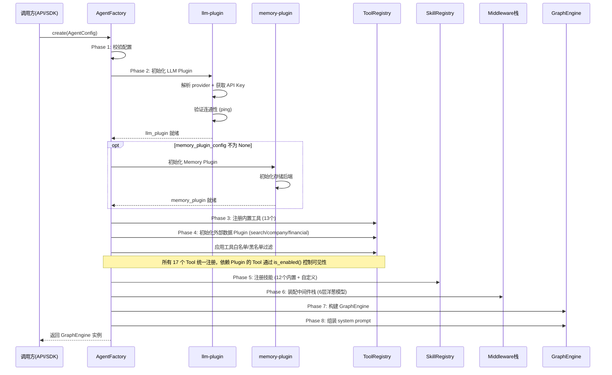
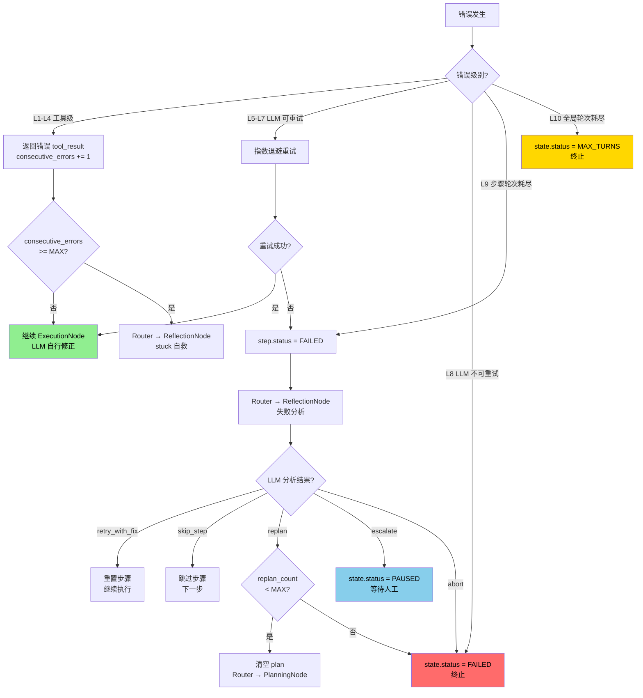

# Agent 核心执行引擎 — 详细设计

> 本文档是 `2B-Agent-System-DeepAgent-完整设计方案.md` 第四章的细化补充，聚焦 Agent 核心执行逻辑的严谨定义。

---

## 零、Plugin 调用约定

Agent 引擎本身不直接依赖任何 LLM 或记忆实现，通过 Plugin 接口调用：

```python
class PluginContext:
    """
    Node 和 Tool 执行时可用的全部接口。
    由 AgentFactory 在初始化时组装，注入到 GraphEngine。
    Tool 通过此 context 调用 Plugin 的能力（而非 Plugin 直接注册 Tool）。
    """
    # 必选 Plugin
    llm: LLMPluginInterface                    # 大模型调用
    
    # 可选 Plugin（未启用时为 None，对应的 Tool 通过 is_enabled() 自动隐藏）
    memory: MemoryPluginInterface | None        # 长期记忆
    notification: NotificationPluginInterface | None  # 通知推送
    search: SearchPluginInterface | None        # 网络搜索 + 网页提取
    company: CompanyDataPluginInterface | None   # 企业工商数据
    financial: FinancialDataPluginInterface | None  # 上市公司财务数据
    
    # 内置能力（非 Plugin）
    tool_registry: ToolRegistry                # 工具注册表
    checkpoint_store: CheckpointStore          # 检查点存储
    callbacks: AgentCallbacks | None = None     # 回调接口
    tenant_id: str = ""
    user_id: str = ""

@dataclass
class AgentCallbacks:
    on_tool_start: Callable[[str, dict], None] | None = None       # (tool_name, input)
    on_tool_end: Callable[[str, ToolResult], None] | None = None   # (tool_name, result)
    on_stream_delta: Callable[[str], None] | None = None           # (token) 流式输出
    on_status_change: Callable[[str, str], None] | None = None     # (old, new) 状态变化
    on_plan_created: Callable[[TaskPlan], None] | None = None      # 规划完成
    on_step_progress: Callable[[int, int, str], None] | None = None  # (current, total, desc)
    on_approval_request: Callable[[str, dict], Awaitable[str]] | None = None  # HITL 审批
    on_memory_extracted: Callable[[list], None] | None = None      # 记忆提取通知

class LLMPluginInterface(Protocol):
    async def call(self, system_prompt: str, messages: list, tools: list | None = None) -> dict: ...

class MemoryPluginInterface(Protocol):
    async def recall(self, query: str, categories: list[str] | None = None, max_results: int = 5) -> list[MemoryEntry]: ...
    async def commit(self, entry: MemoryEntry) -> None: ...
    async def update(self, uri: str, content: str) -> None: ...
    async def search(self, query: str) -> list[MemoryEntry]: ...
```

**调用规则**：
- 所有 Node 和 Middleware 通过 `context.llm.call()` 调用大模型，不直接 import 任何 LLM SDK
- 记忆操作通过 `context.memory.recall()` / `context.memory.commit()`，调用前必须检查 `context.memory is not None`
- 工具执行通过 `context.tool_registry.find(name)` 查找工具，然后调用 `tool.call(input, context)`


---

## 〇.〇、Tool 接口与注册体系

### Tool 统一接口

所有工具（内置工具 + Plugin 提供的工具）必须实现此接口。借鉴 Claude Code 的 Tool.ts（35+ 字段），保留 2B 业务场景必要的字段：

```python
class Tool(ABC):
    """
    工具基类。分为四组字段:
    - 核心（必须实现）: name, input_schema, call, description
    - 注册与发现（可选覆盖）: aliases, search_hint, is_enabled, should_defer
    - 安全与权限（可选覆盖）: validate_input, check_permissions, is_read_only, is_destructive
    - 输出控制（可选覆盖）: max_result_size_chars, prompt
    """

    # ═══════ 核心（必须实现） ═══════

    @property
    @abstractmethod
    def name(self) -> str:
        """工具唯一名称，如 "query_schema"、"web_search"。"""
        ...

    @abstractmethod
    def input_schema(self) -> dict:
        """
        JSON Schema 格式的输入定义。LLM 通过此 schema 生成工具调用参数。
        必须包含 type, properties, required 三个字段。
        """
        ...

    @abstractmethod
    async def call(
        self,
        input_data: dict,
        context: PluginContext,
        on_progress: Callable[[str], None] | None = None,
    ) -> ToolResult:
        """
        执行工具。
        
        参数:
            input_data: 符合 input_schema 的参数字典（由 LLM 生成，已通过 validate_input）
            context: Plugin 上下文（可访问 llm/memory/tenant_id/user_id 等）
            on_progress: 进度回调（长时间执行时报告中间状态，如"已查询 50/200 条"）
        返回:
            ToolResult
        异常:
            不应抛出异常，所有错误通过 ToolResult.is_error=True 返回
        """
        ...

    async def description(self, input_data: dict) -> str:
        """
        动态描述——根据实际参数生成人类可读的操作描述。
        用于审计日志和前端展示（如"查询华为的工商信息"而非"调用 company_info"）。
        默认返回 name。
        """
        return self.name

    # ═══════ 注册与发现（可选覆盖） ═══════

    @property
    def aliases(self) -> list[str]:
        """别名列表。LLM 可能用不同名称调用同一工具（向后兼容）。默认空。"""
        return []

    @property
    def search_hint(self) -> str | None:
        """
        搜索提示关键词。当工具数量多时，帮助 LLM 找到正确工具。
        如 company_info 的 search_hint = "企业 公司 工商 注册资本 法人 股东"
        """
        return None

    def is_enabled(self) -> bool:
        """运行时开关。返回 False 时工具不出现在 LLM 的工具列表中。默认 True。"""
        return True

    @property
    def should_defer(self) -> bool:
        """
        是否延迟加载。True 时工具不在初始 schema 列表中，
        只有 LLM 通过 search_hint 搜索到时才加载。
        适用于不常用的工具，减少初始 token 消耗。默认 False。
        """
        return False

    # ═══════ 安全与权限（可选覆盖） ═══════

    def validate_input(self, input_data: dict) -> ValidationResult:
        """
        输入校验——在 call() 之前执行。
        检查参数合法性（必填字段、格式、范围等），避免无效的 API 调用。
        校验失败时返回 ValidationResult(valid=False, message="错误原因")，
        错误信息会作为 tool_result 返回给 LLM，让 LLM 自行修正参数。
        """
        return ValidationResult(valid=True)

    async def check_permissions(
        self, input_data: dict, context: PluginContext
    ) -> PermissionDecision:
        """
        工具级权限检查——比 Middleware 更细粒度。
        例如 query_data 可以根据 entity_api_key 判断用户是否有权操作该实体。
        返回 ALLOW / DENY / ASK。
        默认 ALLOW（权限检查主要由 Middleware 层处理）。
        """
        return PermissionDecision(behavior="allow")

    def is_read_only(self, input_data: dict) -> bool:
        """
        是否只读操作（根据实际参数判断）。
        只读工具可并行执行，写操作串行。
        例: query_data 时返回 True，action=="delete" 时返回 False。
        """
        return False

    def is_destructive(self, input_data: dict) -> bool:
        """
        是否破坏性操作（根据实际参数判断）。
        破坏性操作触发 HITLMiddleware 审批。
        例: modify_data 的 action=="delete" 返回 True。
        """
        return False

    # ═══════ 输出控制（可选覆盖） ═══════

    @property
    def max_result_size_chars(self) -> int:
        """
        结果最大字符数。超出时自动截断并附加 "[结果已截断]" 提示。
        不同工具有不同预算:
        - query_data: 50,000（查询结果可能很大）
        - web_search: 30,000
        - query_schema: 100,000（元数据定义需要完整）
        - ask_user: 无限制
        默认 50,000。
        """
        return 50_000

    def prompt(self) -> str:
        """
        工具使用说明，注入到 system prompt 中。
        LLM 通过此说明理解何时、如何使用此工具。
        应包含: 功能描述 + 典型用途 + 参数说明 + 注意事项。
        空字符串表示不注入额外说明（只用 input_schema 的 description）。
        """
        return ""


@dataclass
class ToolResult:
    content: str                      # 结果文本（返回给 LLM）
    is_error: bool = False            # 是否失败
    metadata: dict = field(default_factory=dict)  # 附加元数据（不返回给 LLM，用于审计/追踪）


@dataclass
class ValidationResult:
    valid: bool
    message: str = ""                 # 校验失败时的错误信息


@dataclass
class PermissionDecision:
    behavior: str = "allow"           # allow / deny / ask
    reason: str | None = None         # deny/ask 时的原因说明
```

### 完整工具实现示例

以下用 `company_info`（天眼查）和 `query_data`（业务数据 CRUD）两个最典型的工具，展示每个接口方法的具体实现：

#### 示例 1: CompanyInfoTool（天眼查企业工商查询）

```python
class CompanyInfoTool(Tool):

    # ═══════ 核心 ═══════

    @property
    def name(self) -> str:
        return "company_info"

    def input_schema(self) -> dict:
        return {
            "type": "object",
            "properties": {
                "keyword": {
                    "type": "string",
                    "description": "企业名称（需全称，如'华为技术有限公司'）或统一社会信用代码"
                },
                "query_type": {
                    "type": "string",
                    "enum": ["basic", "risk", "shareholders", "executives", "investments", "branches"],
                    "default": "basic",
                    "description": "查询类型: basic=基本工商信息, risk=风险信息, shareholders=股东, executives=高管, investments=对外投资, branches=分支机构"
                }
            },
            "required": ["keyword"]
        }

    async def call(self, input_data, context, on_progress=None):
        keyword = input_data["keyword"]
        query_type = input_data.get("query_type", "basic")

        # 根据 query_type 选择天眼查 API 端点
        endpoints = {
            "basic": "/services/open/ic/baseinfo/normal",
            "risk": "/services/open/risk/info",
            "shareholders": "/services/open/ic/holder/list",
            "executives": "/services/open/ic/staff/list",
            "investments": "/services/open/ic/invest/list",
            "branches": "/services/open/ic/branch/list",
        }
        endpoint = endpoints.get(query_type, endpoints["basic"])

        if on_progress:
            on_progress(f"正在查询{keyword}的{query_type}信息...")

        try:
            # 通过 Plugin 接口调用（供应商无关，由 company-data-plugin 适配）
            data = await context.company.query(keyword=keyword, query_type=query_type)
            if data.get("error_code") == 0:
                return ToolResult(
                    content=json.dumps(data["result"], ensure_ascii=False, indent=2),
                    metadata={"api": "tianyancha", "query_type": query_type}
                )
            else:
                return ToolResult(
                    content=f"企业信息查询失败: {data.get('reason', '未知错误')}",
                    is_error=True
                )
        except Exception as e:
            return ToolResult(content=f"企业信息查询异常: {e}", is_error=True)

    async def description(self, input_data):
        keyword = input_data.get("keyword", "")
        query_type = input_data.get("query_type", "basic")
        type_names = {
            "basic": "基本工商信息", "risk": "风险信息", "shareholders": "股东信息",
            "executives": "高管信息", "investments": "对外投资", "branches": "分支机构"
        }
        return f"查询{keyword}的{type_names.get(query_type, '工商信息')}"
        # 审计日志中显示: "查询华为技术有限公司的基本工商信息"
        # 而非: "调用 company_info"

    # ═══════ 注册与发现 ═══════

    @property
    def aliases(self):
        return ["company_search", "enterprise_info", "company_query"]
        # LLM 调用 "tianyancha" 或 "company_search" 也能匹配到此工具

    @property
    def search_hint(self):
        return "企业 公司 工商 注册资本 法人 股东 高管 风险 诉讼 失信 经营异常 对外投资 分支机构"
        # 工具多时，LLM 搜索"查企业信息"能通过关键词匹配到此工具

    def is_enabled(self):
        # 只有配置了天眼查 API Key 时才启用
        return context.company is not None  # company-data-plugin 是否启用

    @property
    def should_defer(self):
        return False  # 常用工具，不延迟加载

    # ═══════ 安全与权限 ═══════

    def validate_input(self, input_data):
        keyword = input_data.get("keyword", "").strip()
        if not keyword:
            return ValidationResult(valid=False, message="keyword 不能为空")
        if len(keyword) < 2:
            return ValidationResult(valid=False, message="企业名称至少 2 个字符")
        query_type = input_data.get("query_type", "basic")
        if query_type not in ("basic", "risk", "shareholders", "executives", "investments", "branches"):
            return ValidationResult(valid=False, message=f"不支持的 query_type: {query_type}")
        return ValidationResult(valid=True)

    async def check_permissions(self, input_data, context):
        # 天眼查是公开数据，不需要额外权限检查
        return PermissionDecision(behavior="allow")

    def is_read_only(self, input_data):
        return True  # 天眼查只有查询，没有写操作

    def is_destructive(self, input_data):
        return False  # 不可能是破坏性操作

    # ═══════ 输出控制 ═══════

    @property
    def max_result_size_chars(self):
        return 30_000  # 工商信息通常不大，30K 足够

    def prompt(self):
        return (
            "查询企业工商信息（数据源: 天眼查）。\n"
            "- keyword 必须是企业全称（如'华为技术有限公司'）或统一社会信用代码，简称可能查不到\n"
            "- query_type 默认 basic（基本信息），可选 risk/shareholders/executives/investments/branches\n"
            "- 返回 JSON 格式的企业信息，包含注册资本、法人、经营范围、企业状态等"
        )
```

#### 示例 2: BusinessDataTool（业务数据 CRUD）

```python
class BusinessDataTool(Tool):

    # ═══════ 核心 ═══════

    @property
    def name(self):
        return "query_data"

    def input_schema(self):
        return {
            "type": "object",
            "properties": {
                "action": {
                    "type": "string",
                    "enum": ["query", "get", "create", "update", "delete", "count"],
                    "description": "操作类型"
                },
                "entity_api_key": {
                    "type": "string",
                    "description": "业务对象 api_key（如 account, opportunity, lead）"
                },
                "record_id": {
                    "type": "string",
                    "description": "记录 ID（get/update/delete 时必填）"
                },
                "filters": {
                    "type": "object",
                    "description": "查询过滤条件，格式: {字段api_key: 值}，如 {status: 'active', industry: '制造业'}"
                },
                "fields": {
                    "type": "array",
                    "items": {"type": "string"},
                    "description": "返回字段列表（不指定则返回全部），如 ['companyName', 'industry', 'annualRevenue']"
                },
                "data": {
                    "type": "object",
                    "description": "创建/更新的数据，格式: {字段api_key: 值}，如 {companyName: '华为', industry: '通信'}"
                },
                "page": {"type": "integer", "default": 1, "description": "页码（从 1 开始）"},
                "page_size": {"type": "integer", "default": 20, "maximum": 100, "description": "每页条数"},
                "order_by": {"type": "string", "description": "排序字段，如 'createdAt' 或 '-annualRevenue'（前缀-表示降序）"}
            },
            "required": ["action", "entity_api_key"]
        }

    async def call(self, input_data, context, on_progress=None):
        action = input_data["action"]
        entity = input_data["entity_api_key"]

        # ServiceBackend 自动注入 tenant_id（由 TenantMiddleware 在 before_tool_call 中设置）
        tenant_id = input_data.get("_tenant_id", context.tenant_id)

        if action == "query":
            if on_progress:
                on_progress(f"正在查询 {entity} 数据...")
            result = await self._service.post(
                f"/api/v1/data/{entity}/query",
                json={"filters": input_data.get("filters", {}),
                      "fields": input_data.get("fields"),
                      "page": input_data.get("page", 1),
                      "pageSize": input_data.get("page_size", 20),
                      "orderBy": input_data.get("order_by")},
                headers={"X-Tenant-Id": tenant_id, "X-User-Id": context.user_id},
            )
            records = result.get("data", {}).get("records", [])
            total = result.get("data", {}).get("total", 0)
            return ToolResult(
                content=json.dumps({"total": total, "records": records}, ensure_ascii=False, indent=2),
                metadata={"action": action, "entity": entity, "total": total}
            )

        elif action == "count":
            result = await self._service.post(
                f"/api/v1/data/{entity}/count",
                json={"filters": input_data.get("filters", {})},
                headers={"X-Tenant-Id": tenant_id, "X-User-Id": context.user_id},
            )
            count = result.get("data", {}).get("count", 0)
            return ToolResult(content=f"{entity} 符合条件的记录数: {count}")

        elif action == "create":
            result = await self._service.post(
                f"/api/v1/data/{entity}",
                json=input_data["data"],
                headers={"X-Tenant-Id": tenant_id, "X-User-Id": context.user_id},
            )
            return ToolResult(
                content=f"成功创建 {entity} 记录，ID: {result.get('data', {}).get('id')}",
                metadata={"action": "create", "entity": entity, "record_id": result.get("data", {}).get("id")}
            )

        elif action == "delete":
            record_id = input_data["record_id"]
            await self._service.delete(
                f"/api/v1/data/{entity}/{record_id}",
                headers={"X-Tenant-Id": tenant_id, "X-User-Id": context.user_id},
            )
            return ToolResult(content=f"成功删除 {entity} 记录 {record_id}")

        # update / get 类似...
        return ToolResult(content=f"不支持的操作: {action}", is_error=True)

    async def description(self, input_data):
        action = input_data.get("action", "")
        entity = input_data.get("entity_api_key", "")
        action_names = {
            "query": "查询", "get": "获取", "create": "创建",
            "update": "更新", "delete": "删除", "count": "统计"
        }
        desc = f"{action_names.get(action, action)} {entity}"
        if action == "delete":
            desc += f" 记录 {input_data.get('record_id', '')}"
        if action == "query" and input_data.get("filters"):
            desc += f"（过滤: {input_data['filters']}）"
        return desc
        # 审计日志: "查询 opportunity（过滤: {status: 'won'}）"
        # 审计日志: "删除 lead 记录 rec_abc123"

    # ═══════ 注册与发现 ═══════

    @property
    def aliases(self):
        return ["data", "crud", "entity_data"]

    @property
    def search_hint(self):
        return "业务数据 查询 创建 更新 删除 CRUD 记录 实体"

    def is_enabled(self):
        return True  # 核心工具，始终启用

    @property
    def should_defer(self):
        return False  # 核心工具，不延迟

    # ═══════ 安全与权限 ═══════

    def validate_input(self, input_data):
        action = input_data.get("action")
        entity = input_data.get("entity_api_key", "").strip()

        if not entity:
            return ValidationResult(valid=False, message="entity_api_key 不能为空")

        if action in ("get", "update", "delete") and not input_data.get("record_id"):
            return ValidationResult(valid=False, message=f"{action} 操作必须提供 record_id")

        if action == "create" and not input_data.get("data"):
            return ValidationResult(valid=False, message="create 操作必须提供 data")

        if input_data.get("page_size", 20) > 100:
            return ValidationResult(valid=False, message="page_size 不能超过 100")

        return ValidationResult(valid=True)

    async def check_permissions(self, input_data, context):
        # 实际的行级权限由后端微服务执行（透传 user_id）
        # 这里只做工具级的粗粒度检查
        action = input_data.get("action")
        entity = input_data.get("entity_api_key")

        # 示例: 某些实体禁止通过 Agent 删除
        protected_entities = {"user", "role", "department"}
        if action == "delete" and entity in protected_entities:
            return PermissionDecision(
                behavior="deny",
                reason=f"不允许通过 Agent 删除 {entity} 数据，请在管理后台操作"
            )

        return PermissionDecision(behavior="allow")

    def is_read_only(self, input_data):
        return input_data.get("action") in ("query", "get", "count")

    def is_destructive(self, input_data):
        return input_data.get("action") == "delete"

    # ═══════ 输出控制 ═══════

    @property
    def max_result_size_chars(self):
        return 50_000  # 查询结果可能很大

    def prompt(self):
        return (
            "操作 aPaaS 平台的业务数据（通过 paas-entity-service）。\n"
            "- action: query=查询(支持分页/排序/过滤), get=获取单条, create=创建, update=更新, delete=删除, count=计数\n"
            "- entity_api_key: 业务对象标识，如 account(客户), opportunity(商机), lead(线索), contract(合同)\n"
            "- filters: 过滤条件，格式 {字段: 值}，如 {status: 'active', industry: '制造业'}\n"
            "- 查询前建议先用 query_schema 了解实体有哪些字段\n"
            "- delete 操作需要用户确认，会触发审批流程\n"
            "- 数据权限由后端自动过滤，你只能看到当前用户有权限的数据"
        )
```

### 工具调用完整链路（14 步）

```
LLM 返回 tool_use block
  │
  ├── [1]  registry.find_by_name(name)  — 查找工具（支持 aliases）
  │        → 找不到? → ToolResult(is_error=True, content="未知工具: {name}")
  │
  ├── [2]  tool.is_enabled()  — 运行时开关检查
  │        → False? → ToolResult(is_error=True, content="工具已禁用: {name}")
  │
  ├── [3]  Middleware.before_tool_call()  — 中间件前处理
  │        ├── TenantMiddleware: 注入 tenant_id
  │        ├── AuditMiddleware: 记录调用开始
  │        └── HITLMiddleware: 检查是否需要审批
  │            → 需要审批? → state.status=PAUSED, return None
  │
  ├── [4]  tool.validate_input(input_data)  — 输入校验
  │        → valid=False? → ToolResult(is_error=True, content=message)
  │        → LLM 收到错误后自行修正参数重试
  │
  ├── [5]  tool.check_permissions(input_data, context)  — 工具级权限
  │        → deny? → ToolResult(is_error=True, content="权限不足: {reason}")
  │
  ├── [6]  tool.description(input_data)  — 生成动态描述
  │        → 用于审计日志和 callbacks.on_tool_start
  │
  ├── [7]  callbacks.on_tool_start(name, input_data)  — 回调通知前端
  │
  ├── [8]  tool.call(input_data, context, on_progress)  — 执行（带超时）
  │        → 超时? → ToolResult(is_error=True, content="工具执行超时")
  │
  ├── [9]  结果预算控制: len(result.content) > tool.max_result_size_chars?
  │        → 超出? → 截断 + 附加 "[结果已截断，共 {N} 字符]"
  │
  ├── [10] callbacks.on_tool_end(name, result)  — 回调通知前端
  │
  ├── [11] Middleware.after_tool_call()  — 中间件后处理
  │        ├── AuditMiddleware: 记录结果和耗时
  │        └── MemoryMiddleware: save_memory 安全扫描
  │
  ├── [12] 更新执行追踪: consecutive_errors / consecutive_same_tool / total_tool_calls
  │
  ├── [13] 构建 ToolResultBlock → 追加到 state.messages
  │
  └── [14] 如果 state.status == PAUSED → break（HITL 暂停）
```

### ToolRegistry

```python
class ToolRegistry:
    """工具注册表。管理所有可用工具的注册、查找、过滤。"""

    def register(self, tool: Tool) -> None:
        """注册一个工具。名称冲突时后注册的覆盖先注册的。"""
        ...

    def unregister(self, name: str) -> None:
        """注销一个工具。"""
        ...

    def find_by_name(self, name: str) -> Tool | None:
        """按名称查找工具。找不到返回 None。"""
        ...

    @property
    def all_tools(self) -> list[Tool]:
        """返回所有已注册工具的列表。"""
        ...

    def get_tool_schemas(self) -> list[dict]:
        """
        返回所有工具的 LLM function calling 格式定义。
        用于传给 LLM 的 tools 参数。
        格式: [{"name": "...", "description": "...", "input_schema": {...}}, ...]
        """
        return [
            {
                "name": t.name,
                "description": t.prompt(),
                "input_schema": t.input_schema(),
            }
            for t in self.all_tools
        ]
```

### 工具调用链路（在 ExecutionNode 中）

```
LLM 返回 tool_use: {"name": "company_info", "input": {"keyword": "华为"}}
  │
  ├── [1] Middleware.before_tool_call(name, input)
  │   ├── TenantMiddleware: 注入 tenant_id 到参数
  │   ├── AuditMiddleware: 记录调用日志
  │   └── HITLMiddleware: 检查是否需要审批
  │       → 需要审批? → state.status=PAUSED, return None（阻止执行）
  │       → 不需要? → return input（可能已修改）
  │
  ├── [2] tool = registry.find_by_name("company_info")
  │   → 找不到? → ToolResult(is_error=True, content="未知工具")
  │
  ├── [3] tool.call(input, context)
  │   → 内部: 调用天眼查 API → 返回 ToolResult
  │   → 超时? → ToolResult(is_error=True, content="工具执行超时")
  │
  ├── [4] Middleware.after_tool_call(name, result)
  │   ├── AuditMiddleware: 记录结果和耗时
  │   └── MemoryMiddleware: 如果是 save_memory → 安全扫描
  │
  └── [5] 构建 ToolResultBlock → 追加到 state.messages
```

### 13 个内置工具的 input_schema 定义

#### 系统数据类（4 个）

```python
# query_schema
{
    "type": "object",
    "properties": {
        "query_type": {
            "type": "string",
            "enum": ["entity", "entity_items", "entity_links", "check_rules",
                     "busi_types", "pick_options", "formula_computes",
                     "aggregation_computes", "duplicate_rules",
                     "data_permissions", "sharing_rules", "list_entities"],
            "description": "查询类型"
        },
        "entity_api_key": {
            "type": "string",
            "description": "业务对象 api_key（如 account, opportunity）"
        }
    },
    "required": ["query_type"]
}

# query_data
{
    "type": "object",
    "properties": {
        "action": {
            "type": "string",
            "enum": ["query", "get", "create", "update", "delete", "count"],
            "description": "操作类型"
        },
        "entity_api_key": {"type": "string", "description": "业务对象 api_key"},
        "record_id": {"type": "string", "description": "记录 ID（get/update/delete）"},
        "filters": {"type": "object", "description": "查询过滤条件 {字段api_key: 值}"},
        "fields": {"type": "array", "items": {"type": "string"}, "description": "返回字段列表"},
        "data": {"type": "object", "description": "创建/更新的数据 {字段api_key: 值}"},
        "page": {"type": "integer", "default": 1},
        "page_size": {"type": "integer", "default": 20, "maximum": 100},
        "order_by": {"type": "string", "description": "排序字段 api_key"}
    },
    "required": ["action", "entity_api_key"]
}

# analyze_data
{
    "type": "object",
    "properties": {
        "entity_api_key": {"type": "string"},
        "metrics": {
            "type": "array",
            "items": {
                "type": "object",
                "properties": {
                    "field": {"type": "string", "description": "字段 api_key"},
                    "function": {"type": "string", "enum": ["count", "sum", "avg", "min", "max"]}
                },
                "required": ["field", "function"]
            }
        },
        "group_by": {"type": "array", "items": {"type": "string"}, "description": "分组字段"},
        "filters": {"type": "object"},
        "time_field": {"type": "string", "description": "时间字段（趋势分析）"},
        "time_granularity": {"type": "string", "enum": ["day", "week", "month", "quarter", "year"]}
    },
    "required": ["entity_api_key", "metrics"]
}

# query_permission
{
    "type": "object",
    "properties": {
        "query_type": {
            "type": "string",
            "enum": ["roles", "role_detail", "data_permissions", "sharing_rules", "user_permissions"]
        },
        "role_api_key": {"type": "string"},
        "entity_api_key": {"type": "string"},
        "user_id": {"type": "string"}
    },
    "required": ["query_type"]
}
```

#### 网络信息类（2 个）

```python
# web_search (Tavily Search API)
{
    "type": "object",
    "properties": {
        "query": {"type": "string", "description": "搜索关键词"},
        "search_depth": {
            "type": "string", "enum": ["basic", "advanced"], "default": "basic",
            "description": "basic=快速, advanced=深度搜索+AI摘要"
        },
        "max_results": {"type": "integer", "default": 5, "maximum": 10},
        "include_answer": {
            "type": "boolean", "default": false,
            "description": "是否返回 AI 生成的直接回答"
        }
    },
    "required": ["query"]
}

# web_fetch (Tavily Extract API)
{
    "type": "object",
    "properties": {
        "urls": {
            "type": "array", "items": {"type": "string"},
            "description": "要提取内容的 URL 列表（最多 5 个）",
            "maxItems": 5
        }
    },
    "required": ["urls"]
}
```

#### 工商数据类（1 个）

```python
# company_info (天眼查 API)
{
    "type": "object",
    "properties": {
        "keyword": {
            "type": "string",
            "description": "企业名称（需全称）或统一社会信用代码"
        },
        "query_type": {
            "type": "string",
            "enum": ["basic", "risk", "shareholders", "executives", "investments", "branches"],
            "default": "basic",
            "description": "查询类型"
        }
    },
    "required": ["keyword"]
}
```

#### 财务数据类（1 个）

```python
# financial_report (巨潮资讯 API, 接口: p_stock2302)
{
    "type": "object",
    "properties": {
        "stock_code": {
            "type": "string",
            "description": "股票代码（6位数字，如 000002）"
        },
        "report_type": {
            "type": "string",
            "enum": ["income_statement", "balance_sheet", "cash_flow"],
            "default": "income_statement",
            "description": "报表类型: 利润表/资产负债表/现金流量表"
        }
    },
    "required": ["stock_code"]
}
```

内部映射: `income_statement` → type=071001, `balance_sheet` → type=071002, `cash_flow` → type=071003

#### 外部服务类（2 个）

```python
# api_call (租户预配置的外部 API)
{
    "type": "object",
    "properties": {
        "connection_name": {
            "type": "string",
            "description": "API 连接名称（租户在管理后台配置的名称）"
        },
        "endpoint": {"type": "string", "description": "API 端点路径（如 /orders/list）"},
        "method": {"type": "string", "enum": ["GET", "POST", "PUT", "DELETE"], "default": "GET"},
        "params": {"type": "object", "description": "查询参数"},
        "body": {"type": "object", "description": "请求体"}
    },
    "required": ["connection_name", "endpoint"]
}

# mcp_tool — 动态注册，schema 由 MCP Server 提供
```

#### 用户交互类（1 个）

```python
# ask_user
{
    "type": "object",
    "properties": {
        "question": {"type": "string", "description": "要问用户的问题"}
    },
    "required": ["question"]
}
```

### 工具与后端服务的调用关系

```
工具                    → 后端服务                          → 外部接口
─────────────────────────────────────────────────────────────────────
query_schema          → ServiceBackend.query_metadata()   → paas-metadata-service API
query_data           → ServiceBackend.query_data()       → paas-entity-service API
                          ServiceBackend.mutate_data()
analyze_data          → ServiceBackend.aggregate_data()   → paas-entity-service API
query_permission        → ServiceBackend.query_permission() → paas-privilege-service API
web_search              → 直接 HTTP                         → 网络搜索服务 API
web_fetch               → 直接 HTTP                         → 网页内容提取服务 API
company_info            → 直接 HTTP                         → 企业工商数据服务 API
financial_report        → 直接 HTTP                         → 上市公司财务数据服务 API
api_call                → ServiceBackend.call_external_api()→ 租户配置的外部 URL
ask_user                → callbacks.on_approval_request()   → 前端 UI
```

系统数据类工具通过 `ServiceBackend` 抽象层调用平台微服务（可替换为直连/网关/Mock）。
网络/工商/财务类工具直接调用外部 HTTP API（API Key 从环境变量获取，不暴露给 Agent）。

### Plugin 提供的工具

Plugin 工具与内置工具实现相同的 `Tool` 接口，区别在于注册时机：

```
内置工具: AgentFactory Phase 3 注册（始终可用）
Plugin 工具: AgentFactory Phase 4 注册（Plugin 启用时才注册）

memory-plugin 提供:
  search_memories  — input: {query, categories?, max_results?}
  search_memories  — input: {path, layer?}
  save_memory    — input: {category, content, importance?, tags?}

notification-plugin 提供:
  send_notification      — input: {message, type?, channel?, target_user_id?}
```

### 权限控制完整模型

Agent 系统的权限控制分为 **四层**，从外到内依次执行，任何一层拒绝则操作终止：

```
用户请求 → Agent 执行
  │
  ├── 第一层: 工具准入控制（AgentFactory 初始化时，静态）
  │   谁能用哪些工具？
  │
  ├── 第二层: 租户数据隔离（TenantMiddleware，每次工具调用时）
  │   只能看到自己租户的数据
  │
  ├── 第三层: 业务数据权限（ServiceBackend 调用微服务时，由后端服务执行）
  │   RBAC 角色权限 + 数据行级权限
  │
  └── 第四层: 危险操作审批（HITLMiddleware，写操作时）
      破坏性操作需要人工确认
```

#### 第一层: 工具准入控制

**时机**: AgentFactory 初始化时（Phase 3），静态生效，运行期间不变。

**机制**:
```
AgentConfig:
  enabled_tools: ["query_schema", "query_data", "web_search"]  # 白名单（只能用这些）
  disabled_tools: ["api_call"]                                       # 黑名单（不能用这个）

AgentFactory Phase 3:
  注册全部 13 个内置工具
  → 如果 enabled_tools 不为 None → 只保留白名单中的工具
  → 如果 disabled_tools 不为 None → 移除黑名单中的工具
  → 最终 ToolRegistry 中只有允许的工具
  → LLM 只能看到 ToolRegistry 中的工具 schema，看不到的工具无法调用
```

**子 Agent 的工具准入**:
```
子 Agent 最终工具集 = 主 Agent 工具集 ∩ 预定义类型工具集 ∩ LLM 请求工具集

三方取交集，保证:
  1. 子 Agent 永远不能获得主 Agent 没有的工具（安全边界）
  2. 预定义类型限制了子 Agent 的能力范围（最小权限原则）
  3. LLM 可以进一步缩小范围，但不能扩大（只能做减法）

示例:
  主 Agent 工具集 = {query_schema, query_data, web_search, ask_user}
  预定义类型 verifier = {query_schema, query_data}
  LLM 请求 tools = ["query_schema"]
  → 最终: {query_schema}  ✅ ⊆ 主 Agent

  主 Agent 工具集 = {query_schema, query_data}  (api_call 被黑名单禁用)
  LLM 请求 tools = ["query_schema", "api_call"]
  → 最终: {query_schema}  ✅ api_call 被过滤掉（主 Agent 没有）
```

**控制粒度**: 工具级（整个工具可用或不可用）

#### 第二层: 租户数据隔离

**时机**: 每次工具调用时，TenantMiddleware.before_tool_call() 自动执行。

**机制**:
```
TenantMiddleware.before_tool_call(tool_name, input_data, state, context):
  
  # 1. 系统数据类工具: 自动注入 tenant_id 到请求参数
  if tool_name in ["query_schema", "query_data", "analyze_data", "query_permission"]:
      input_data["_tenant_id"] = state.tenant_id
      # ServiceBackend 收到 _tenant_id 后，在 SQL 查询中自动加 WHERE tenant_id = ?
      # Agent 和 LLM 无法绕过此过滤
  
  # 2. 记忆类工具: 自动限定记忆路径前缀
  if tool_name in ["search_memories", "search_memories", "save_memory"]:
      input_data["_memory_prefix"] = f"{state.tenant_id}/"
      # 只能访问自己租户的记忆空间
  
  # 3. 外部 API 工具: 只能调用本租户配置的连接
  if tool_name == "api_call":
      connection = input_data.get("connection_name")
      tenant_connections = await load_tenant_connections(state.tenant_id)
      if connection not in tenant_connections:
          return None  # 拒绝: 连接不属于当前租户
  
  # 4. 网络/工商/财务类工具: 不涉及租户数据，无需隔离
  #    但受 API 配额限制（按租户计费）
  
  return input_data  # 返回修改后的参数
```

**控制粒度**: 数据级（同一工具，不同租户看到不同数据）

#### 第三层: 业务数据权限（RBAC + 行级权限）

**时机**: ServiceBackend 调用 paas-entity-service / paas-privilege-service 时，由后端微服务执行。

**机制**: Agent 系统不自己实现数据权限，而是透传用户身份给后端服务，由后端服务的 RBAC 体系执行权限过滤。

```
Agent 调用 query_data(action="query", entity="opportunity"):
  │
  ├── TenantMiddleware 注入: _tenant_id = "tenant_001"
  │
  ├── ServiceBackend.query_data() 构建 HTTP 请求:
  │   POST /api/v1/data/opportunity/query
  │   Headers:
  │     X-Tenant-Id: tenant_001
  │     X-User-Id: user_123          ← 当前用户 ID
  │     Authorization: Bearer {内部服务 token}
  │
  └── paas-entity-service 收到请求后:
      ├── 查询 DataPermission 配置: 该用户对 opportunity 的权限级别
      │   → "本人" → WHERE owner_id = user_123
      │   → "本部门" → WHERE department_id IN (用户所在部门)
      │   → "本部门及下级" → WHERE department_id IN (部门树)
      │   → "全部" → 无额外过滤
      ├── 查询 SharingRule: 是否有共享规则扩大可见范围
      └── 返回过滤后的数据
```

**Agent 系统的职责**: 只负责透传 tenant_id + user_id，不做任何数据权限判断。
**后端服务的职责**: 执行完整的 RBAC + 行级权限过滤。

**控制粒度**: 行级（同一用户对同一实体，只能看到权限范围内的记录）

#### 第四层: 危险操作审批（HITL）

**时机**: HITLMiddleware.before_tool_call() 在工具执行前检查。

**机制**:
```
HITLMiddleware.before_tool_call(tool_name, input_data, state, context):
  
  # 规则 1: 内置规则 — 基于工具的 is_destructive()
  tool = context.tool_registry.find_by_name(tool_name)
  if tool and tool.is_destructive(input_data):
      # modify_data + action="delete" → is_destructive=True
      # api_call + method="DELETE" → is_destructive=True
      → 触发审批
  
  # 规则 2: 自定义规则 — AgentConfig.hitl_rules
  for rule in self._rules:
      if rule.matches(tool_name, input_data):
          → 触发审批
  
  # 规则 3: 批量操作 — 影响超过 N 条记录
  if tool_name == "query_data" and input_data.get("action") in ("update", "delete"):
      # 先执行 count 查询
      count = await count_affected_records(input_data)
      if count > 50:  # 可配置阈值
          → 触发审批，pause_reason 中包含影响数量
  
  # 触发审批的执行流程:
  触发审批:
      if context.callbacks and context.callbacks.on_approval_request:
          # 有回调 → 异步等待用户响应
          state.status = AgentStatus.PAUSED
          state.pause_reason = f"操作需要确认: {描述}"
          return None  # 阻止工具执行
      else:
          # 无回调（如子 Agent）→ 直接拒绝
          return None  # 阻止工具执行，返回错误 tool_result
```

**自定义审批规则示例**:
```python
AgentConfig(
    hitl_rules=[
        HITLRule(
            tool_name="query_data",
            condition="action == 'create' and entity_api_key == 'contract'",
            message_template="创建合同记录需要确认"
        ),
        HITLRule(
            tool_name="api_call",
            condition="method != 'GET'",
            message_template="外部 API 写操作需要确认"
        ),
    ]
)
```

**控制粒度**: 操作级（同一工具的不同操作，有的需要审批有的不需要）

#### 四层权限的完整执行时序

```
LLM 返回 tool_use: query_data(action="delete", entity="lead", filters={status:"expired"})
  │
  ├── 第一层: 工具准入
  │   query_data 在 ToolRegistry 中? → 是 → 通过
  │
  ├── 第二层: 租户隔离 (TenantMiddleware)
  │   注入 _tenant_id = "tenant_001" → 通过
  │
  ├── 第四层: 危险操作审批 (HITLMiddleware)  ← 注意: 第四层在第三层之前
  │   is_destructive(action="delete") → True
  │   先执行 count: 1247 条记录
  │   → state.status = PAUSED
  │   → pause_reason = "即将删除 lead 实体的 1247 条过期记录，是否确认？"
  │   → 等待用户确认...
  │   → 用户点击"确认" → resume → 继续
  │
  ├── 工具执行: ServiceBackend.mutate_data("delete", "lead", filters)
  │   │
  │   └── 第三层: 业务数据权限 (paas-entity-service 内部)
  │       X-User-Id: user_123 的权限级别 = "全部"
  │       → 允许删除 → 执行 DELETE WHERE tenant_id='tenant_001' AND status='expired'
  │       → 返回: 删除 1247 条
  │
  └── 返回 ToolResult(content="成功删除 1247 条过期线索记录")
```

**为什么第四层在第三层之前？**
因为第三层（RBAC）在后端微服务中执行，需要实际发起 HTTP 请求。而第四层（HITL）是在 Agent 本地执行的中间件拦截，应该在发起请求之前就拦住危险操作，避免不必要的网络调用。

#### 权限控制总结

| 层级 | 控制什么 | 谁执行 | 何时执行 | 粒度 |
|------|---------|--------|---------|------|
| 第一层: 工具准入 | 能用哪些工具 | AgentFactory | 初始化时（静态） | 工具级 |
| 第二层: 租户隔离 | 只看自己租户的数据 | TenantMiddleware | 每次工具调用 | 数据级 |
| 第三层: 业务数据权限 | RBAC + 行级权限 | 后端微服务 | HTTP 请求时 | 行级 |
| 第四层: 危险操作审批 | 破坏性操作需确认 | HITLMiddleware | 工具执行前 | 操作级 |


## 〇.一、主 Agent 初始化

### 初始化入口

```python
class AgentFactory:
    """
    Agent 工厂 — 创建和配置 Agent 实例的唯一入口
    职责: 加载配置 → 初始化 Plugin → 注册工具 → 装配中间件 → 构建 GraphEngine
    """
    
    @staticmethod
    async def create(config: AgentConfig) -> GraphEngine:
        """
        创建主 Agent。完整初始化流程（严格按顺序执行）:
        
        Phase 1: 校验配置
        Phase 2: 初始化 Plugin
        Phase 3: 注册内置工具
        Phase 4: 加载 Plugin 提供的工具
        Phase 5: 注册技能
        Phase 6: 装配中间件栈
        Phase 7: 构建 GraphEngine
        Phase 8: 组装 system prompt
        """
        ...
```

### 初始化配置

```python
@dataclass
class AgentConfig:
    """Agent 配置 — 创建 Agent 所需的全部参数"""
    
    # ─── 必填 ───
    tenant_id: str                            # 租户 ID
    user_id: str                              # 用户 ID
    
    # ─── Plugin 配置 ───
    llm_plugin_config: LLMPluginConfig        # 大模型配置（必选）
    memory_plugin_config: MemoryPluginConfig | None = None   # 记忆配置（可选）
    notification_plugin_config: NotifyPluginConfig | None = None  # 通知配置（可选）
    
    # ─── 工具配置 ───
    enabled_tools: list[str] | None = None    # 工具白名单（None = 全部启用）
    disabled_tools: list[str] | None = None   # 工具黑名单
    external_api_connections: list[ApiConnection] = field(default_factory=list)  # 租户的外部 API 连接
    
    # ─── 技能配置 ───
    enabled_skills: list[str] | None = None   # 技能白名单
    custom_skill_dirs: list[str] = field(default_factory=list)  # 自定义技能目录
    
    # ─── 中间件配置 ───
    enable_hitl: bool = True                  # 是否启用人工审批
    enable_audit: bool = True                 # 是否启用审计日志
    hitl_rules: list[HITLRule] = field(default_factory=list)  # 自定义审批规则
    
    # ─── 运行限制 ───
    max_total_llm_calls: int = 200            # 覆盖默认值
    max_step_llm_calls: int = 20
    
    # ─── 会话 ───
    session_id: str | None = None             # 指定 session_id 用于 resume
    system_prompt_override: str | None = None  # 自定义 system prompt（覆盖默认）
    system_prompt_append: str | None = None    # 追加到默认 system prompt 之后


@dataclass
class LLMPluginConfig:
    provider: str = "deepseek"                # deepseek / openai / anthropic
    model: str = "deepseek-chat"              # 模型名
    api_base: str | None = None               # 自定义 API 地址（私有化部署）
    # API Key 从环境变量或密钥管理服务获取，不在配置中明文传递
    api_key_env: str = "LLM_API_KEY"          # 环境变量名
    temperature: float = 0.0
    max_tokens: int = 8192
    timeout_seconds: int = 120
    fallback_provider: str | None = None      # 降级模型
    fallback_model: str | None = None
```

### 初始化流程（8 个 Phase）

```
AgentFactory.create(config):

Phase 1: 校验配置
  ├── config.tenant_id 非空
  ├── config.user_id 非空
  ├── config.llm_plugin_config 非空
  └── 校验失败 → 抛出 ConfigError（不创建 Agent）

Phase 2: 初始化 Plugin
  ├── [必选] llm_plugin = LLMPlugin(config.llm_plugin_config)
  │   ├── 解析 provider → 选择对应的 SDK（DeepSeek/OpenAI/Anthropic）
  │   ├── 从环境变量获取 API Key
  │   ├── 创建 HTTP 客户端（连接池、超时配置）
  │   └── 验证连通性: await llm_plugin.call("ping", [{"role":"user","content":"hi"}])
  │       → 失败? → 如果有 fallback → 切换到 fallback
  │       → 全部失败? → 抛出 LLMInitError
  │
  ├── [可选] memory_plugin = None
  │   如果 config.memory_plugin_config 不为 None:
  │     ├── memory_plugin = MemoryPlugin(config.memory_plugin_config)
  │     ├── 初始化存储后端（filesystem / pgvector / elasticsearch）
  │     └── 加载用户画像快照
  │
  └── [可选] notification_plugin = None
      如果 config.notification_plugin_config 不为 None:
        └── notification_plugin = NotificationPlugin(config.notification_plugin_config)

Phase 3: 注册全部 Tool（统一由 ToolRegistry 管理）
  tool_registry = ToolRegistry()
  注册全部 17 个 Tool:
  ├── 平台内置（始终可用）:
  │   query_schema, query_data, analyze_data, query_permission,
  │   api_call, mcp_tool, ask_user, delegate_task, start_async_task
  ├── 依赖 Plugin（通过 is_enabled() 检查 Plugin 是否可用，未启用时 LLM 看不到）:
  │   web_search, web_fetch          → is_enabled = context.search is not None
  │   company_info                   → is_enabled = context.company is not None
  │   financial_report               → is_enabled = context.financial is not None
  │   search_memories, save_memory → is_enabled = context.memory is not None
  │   send_notification                    → is_enabled = context.notification is not None
  
  注意: 所有 Tool 都在 Phase 3 注册，不再有 Phase 4 "Plugin 注册工具" 的步骤。
  Plugin 只提供接口（PluginContext 中的字段），Tool 通过接口调用 Plugin 的能力。
  
  应用工具过滤:
  ├── config.enabled_tools 不为 None → 只保留白名单中的工具
  └── config.disabled_tools 不为 None → 移除黑名单中的工具

Phase 4: 初始化外部数据 Plugin
  如果 config.search_plugin_config 不为 None:
    search_plugin = SearchPlugin(config.search_plugin_config)
  如果 config.company_data_plugin_config 不为 None:
    company_plugin = CompanyDataPlugin(config.company_data_plugin_config)
  如果 config.financial_data_plugin_config 不为 None:
    financial_plugin = FinancialDataPlugin(config.financial_data_plugin_config)

Phase 5: 注册技能
  skill_registry = SkillRegistry()
  ├── 注册 12 个内置业务技能（verify_config, diagnose, config_entity, ...）
  ├── 加载自定义技能目录: config.custom_skill_dirs
  └── 应用技能过滤: config.enabled_skills

Phase 6: 装配中间件栈（顺序重要 — 洋葱模型）
  middleware_stack = []
  ├── [1] TenantMiddleware(config.tenant_id)           # 最外层
  ├── [2] AuditMiddleware() if config.enable_audit      # 审计包裹所有操作
  ├── [3] ContextMiddleware()                           # 上下文压缩
  ├── [4] MemoryMiddleware(memory_plugin) if memory_plugin  # 记忆注入
  ├── [5] SkillMiddleware(skill_registry)               # 技能经验注入
  └── [6] HITLMiddleware(config.hitl_rules) if config.enable_hitl  # 最内层

Phase 7: 构建 GraphEngine
  plugin_context = PluginContext(
      llm=llm_plugin,
      memory=memory_plugin,       # 可能为 None
      tool_registry=tool_registry,
      checkpoint_store=CheckpointStore(config.tenant_id, config.session_id),
  )
  
  engine = GraphEngine(
      nodes={
          "planning": PlanningNode(),
          "execution": ExecutionNode(),
          "reflection": ReflectionNode(),
      },
      middleware_stack=middleware_stack,
      plugin_context=plugin_context,
      limits=AgentLimits(
          MAX_TOTAL_LLM_CALLS=config.max_total_llm_calls,
          MAX_STEP_LLM_CALLS=config.max_step_llm_calls,
      ),
  )

Phase 8: 组装 system prompt
  system_prompt = build_system_prompt(
      base=DEFAULT_SYSTEM_PROMPT,
      override=config.system_prompt_override,
      append=config.system_prompt_append,
      tools=tool_registry.all_tools,       # 工具描述注入
      skills=skill_registry.all_skills,    # 技能列表注入
      tenant_context=tenant_info,          # 租户信息
  )

return engine
```

### 初始化时序图



### 调用方使用示例

```python
# 创建主 Agent
engine = await AgentFactory.create(AgentConfig(
    tenant_id="tenant_001",
    user_id="user_123",
    llm_plugin_config=LLMPluginConfig(
        provider="deepseek",
        model="deepseek-chat",
    ),
    memory_plugin_config=MemoryPluginConfig(backend="filesystem"),
    enable_hitl=True,
))

# 提交用户消息
initial_state = GraphState(
    session_id=generate_session_id(),
    tenant_id="tenant_001",
    user_id="user_123",
    messages=[Message(role=MessageRole.USER, content="帮我查一下华为的工商信息")],
)

async for state in engine.run(initial_state):
    # 流式处理每一步的状态
    if state.status == AgentStatus.PAUSED:
        # 展示审批请求给用户
        show_approval_dialog(state.pause_reason)
    elif state.status == AgentStatus.COMPLETED:
        # 展示最终结果
        show_result(state.messages[-1])
```

---

## 〇.二、子 Agent 初始化

### 子 Agent 的两种模式

| 模式 | 触发方式 | 执行方式 | 上下文关系 | 适用场景 |
|------|---------|---------|-----------|---------|
| 同步子 Agent | LLM 调用 `delegate_task` 工具 | 阻塞主 Agent，等待完成 | 继承主 Agent 的部分上下文 | 短任务（< 2 分钟）：查询、校验、简单分析 |
| 异步子 Agent | LLM 调用 `start_async_task` 工具 | 不阻塞，后台执行 | 独立上下文，通过消息通信 | 长任务（> 2 分钟）：深度研究、批量处理、数据迁移 |

### 同步子 Agent 初始化

```
主 Agent ExecutionNode 执行中:
  LLM 返回 tool_use: delegate_task({
    "task": "校验 account 实体的字段配置是否符合规范",
    "agent_type": "verifier",        # 可选，指定子 Agent 类型
    "tools": ["query_schema"],     # 可选，限制工具范围
    "max_llm_calls": 10              # 可选，限制轮次
  })

DelegateTaskTool.call():
  
  Step 1: 确定子 Agent 配置
    ├── agent_type 指定了? → 使用预定义的 Agent 类型配置
    │   预定义类型:
    │   ├── "verifier"  — 只读工具 + verify_config 技能, max_llm_calls=10
    │   ├── "analyzer"  — 只读工具 + data_analysis 技能, max_llm_calls=15
    │   ├── "researcher" — web_search + company_info + financial_report, max_llm_calls=20
    │   └── "general"   — 继承主 Agent 全部工具, max_llm_calls=20
    └── 未指定? → 使用 "general" 类型
  
  Step 2: 解析子 Agent 的工具集（核心安全逻辑）
  
    # 获取主 Agent 当前可用的工具名列表（已经过白名单/黑名单过滤）
    parent_tool_names = {t.name for t in parent_context.tool_registry.all_tools}
    # 例: parent_tool_names = {"query_schema", "query_data", "web_search", "ask_user"}
    
    # 获取预定义类型的默认工具集
    preset = PRESETS.get(agent_type, PRESETS["general"])
    preset_tools = set(preset["tools"]) if preset["tools"] else parent_tool_names
    # verifier: {"query_schema", "query_data"}
    # general:  parent_tool_names（继承主 Agent 全部）
    
    # 获取 LLM 指定的工具列表（可选）
    requested_tools = set(task.tools) if task.tools else None
    # LLM 可能指定: {"query_schema"}
    
    # ─── 三方取交集 ───
    # 子 Agent 最终工具集 = 主 Agent 工具集 ∩ 预定义类型工具集 ∩ LLM 请求工具集
    
    if requested_tools is not None:
        # LLM 指定了工具 → 三方交集
        final_tools = parent_tool_names & preset_tools & requested_tools
    else:
        # LLM 未指定 → 主 Agent ∩ 预定义类型
        final_tools = parent_tool_names & preset_tools
    
    # 安全保证: final_tools ⊆ parent_tool_names（永远成立）
    # LLM 无法通过 delegate_task 的 tools 参数获得主 Agent 没有的工具
    
    # 如果交集为空 → 至少保留 ask_user（子 Agent 需要能向用户求助）
    if not final_tools and "ask_user" in parent_tool_names:
        final_tools = {"ask_user"}
    
  Step 3: 从主 Agent 派生配置
    sub_config = AgentConfig(
        tenant_id = 主 Agent 的 tenant_id,          # ✅ 继承（同一租户）
        user_id = 主 Agent 的 user_id,              # ✅ 继承（同一用户）
        llm_plugin_config = 主 Agent 的 llm 配置,    # ✅ 继承（同一模型）
        memory_plugin_config = 主 Agent 的 memory 配置, # ✅ 继承（共享记忆）
        notification_plugin_config = None,           # ❌ 不继承（子 Agent 不发通知）
        enabled_tools = list(final_tools),           # 🔒 三方交集（见 Step 2）
        enabled_skills = 类型默认技能,                # 🔒 限制（技能子集）
        enable_hitl = False,                         # ❌ 不继承（子 Agent 不弹审批）
        enable_audit = True,                         # ✅ 继承（审计不能跳过）
        max_total_llm_calls = task.max_llm_calls or 类型默认值,  # 🔒 限制
        system_prompt_append = f"你是一个专注于以下任务的子 Agent:
{task.task}",
    )
  
  Step 4: 创建子 Agent（复用 AgentFactory）
    sub_engine = await AgentFactory.create(sub_config)
  
  Step 5: 构建子 Agent 的初始状态
    sub_state = GraphState(
        session_id = f"{主session_id}__sub_{generate_short_id()}",  # 子会话 ID
        tenant_id = sub_config.tenant_id,
        user_id = sub_config.user_id,
        messages = [
            Message(role=MessageRole.USER, content=task.task)
        ],
        # 注意: 不继承主 Agent 的 messages（独立上下文）
        # 但 system_prompt 中包含了主 Agent 传递的任务描述
    )
  
  Step 6: 同步执行子 Agent
    result_messages = []
    async for state in sub_engine.run(sub_state):
        result_messages = state.messages
    
    # 提取子 Agent 的最终文本输出
    final_text = extract_final_response(result_messages)
  
  Step 7: 返回结果给主 Agent
    return ToolResult(content=final_text)
    # 主 Agent 的 ExecutionNode 收到 tool_result，继续执行
```

### 异步子 Agent 初始化

```
主 Agent ExecutionNode 执行中:
  LLM 返回 tool_use: start_async_task({
    "name": "researcher",
    "task": "深度调研华为2025年的AI战略布局",
    "agent_type": "researcher",
    "tools": ["web_search", "web_fetch", "company_info", "financial_report"],
    "max_llm_calls": 50
  })

StartAsyncTaskTool.call():
  
  Step 1: 确定子 Agent 配置（与同步子 Agent 相同的派生逻辑）
    sub_config = 从主 Agent 派生（同上 Step 2）
    但有以下差异:
    ├── max_total_llm_calls = 50（异步任务允许更多轮次）
    ├── enable_hitl = False（异步任务不能弹审批，遇到需要审批的操作直接跳过）
    └── memory_plugin_config = 主 Agent 的 memory 配置（共享记忆，可以写入）
  
  Step 2: 创建子 Agent
    sub_engine = await AgentFactory.create(sub_config)
  
  Step 3: 生成 task_id，注册到 AsyncTaskManager
    task_id = generate_task_id()
    async_task_manager.register(task_id, TaskRecord(
        task_id=task_id,
        name=task.name,
        status="running",
        parent_session_id=主 Agent 的 session_id,
        sub_engine=sub_engine,
        sub_state=GraphState(...),
        created_at=time.time(),
    ))
  
  Step 4: 后台启动执行（不阻塞主 Agent）
    asyncio.create_task(_run_async_task(task_id))
    
    async def _run_async_task(task_id):
        record = async_task_manager.get(task_id)
        try:
            async for state in record.sub_engine.run(record.sub_state):
                record.latest_state = state
            record.status = "completed"
            record.result = extract_final_response(state.messages)
        except Exception as e:
            record.status = "failed"
            record.error = str(e)
  
  Step 5: 立即返回 task_id 给主 Agent（不等待完成）
    return ToolResult(content=f"异步任务已启动，task_id={task_id}")
    # 主 Agent 继续执行其他工作
    # 后续通过 check_async_task(task_id) 查询结果
```

### 主 Agent 与子 Agent 的继承/隔离矩阵

| 维度 | 同步子 Agent | 异步子 Agent | 说明 |
|------|-------------|-------------|------|
| tenant_id | ✅ 继承 | ✅ 继承 | 同一租户边界 |
| user_id | ✅ 继承 | ✅ 继承 | 同一用户权限 |
| llm-plugin | ✅ 继承 | ✅ 继承 | 同一模型（可覆盖） |
| memory-plugin | ✅ 继承 | ✅ 继承 | 共享记忆空间 |
| notification-plugin | ❌ 不继承 | ❌ 不继承 | 子 Agent 不直接通知用户 |
| 工具集 | 🔒 子集 | 🔒 子集 | 按 agent_type 限制 |
| 技能集 | 🔒 子集 | 🔒 子集 | 按 agent_type 限制 |
| HITL 审批 | ❌ 禁用 | ❌ 禁用 | 子 Agent 不弹审批对话框 |
| 审计日志 | ✅ 继承 | ✅ 继承 | 审计不能跳过 |
| messages | ❌ 独立 | ❌ 独立 | 子 Agent 有自己的对话历史 |
| system_prompt | 🔀 派生 | 🔀 派生 | 基础 prompt + 任务描述 |
| session_id | 🔀 派生 | 🔀 派生 | `{parent_id}__sub_{short_id}` |
| max_llm_calls | 🔒 限制 | 🔒 限制（更大） | 同步默认 20，异步默认 50 |
| checkpoint | ❌ 不保存 | ✅ 独立保存 | 同步任务短，不需要检查点 |

### 主 Agent 与子 Agent 的业务域工具分配

#### 主 Agent 工具集（全量）

主 Agent 拥有全部底层工具，是所有子 Agent 的能力上界：

```
主 Agent 工具全集:
├── 平台数据工具（操作 aPaaS 平台内部数据）
│   ├── query_schema      查询元数据定义
│   ├── query_data       业务数据 CRUD
│   ├── analyze_data      数据聚合统计
│   └── query_permission    权限配置查询
│
├── 外部信息工具（获取平台外部的信息）
│   ├── web_search          网络搜索（Tavily）
│   ├── web_fetch           网页内容提取（Tavily）
│   ├── company_info        企业工商信息（天眼查）
│   └── financial_report    上市公司财报（巨潮资讯）
│
├── 集成工具（连接外部系统）
│   ├── api_call            调用租户配置的外部 API
│   └── mcp_tool            MCP 协议扩展
│
├── 交互工具
│   └── ask_user            向用户提问/确认
│
├── 编排工具（主 Agent 独有，子 Agent 不可用）
│   ├── delegate_task       派生同步子 Agent
│   └── start_async_task    派生异步子 Agent
│
└── Plugin 工具（按 Plugin 启用情况动态注册）
    ├── search_memories     记忆搜索（memory-plugin）
    ├── search_memories     记忆浏览（memory-plugin）
    ├── save_memory       记忆写入（memory-plugin）
    └── send_notification         通知推送（notification-plugin）
```

#### 子 Agent 按业务域裁剪

子 Agent 不按"技术能力"分类（verifier/analyzer），而是按 **2B 业务场景** 分类。每个业务域的子 Agent 只拥有该场景需要的工具子集：

| 业务域 | 子 Agent 类型 | 工具集 | 典型任务 | 默认轮次 |
|--------|-------------|--------|---------|---------|
| **销售** | sales | query_data, analyze_data, company_info, financial_report, web_search, search_memories | 查客户背景、分析商机、评估线索质量、竞品调研 | 20 |
| **客服** | service | query_data, query_schema, web_search, search_memories, ask_user | 查工单历史、诊断配置问题、搜索解决方案、引导用户操作 | 15 |
| **运营分析** | analytics | query_data, analyze_data, financial_report, web_search, search_memories | 数据统计、趋势分析、异常检测、生成报告 | 20 |
| **平台配置** | config | query_schema, modify_schema, query_data, modify_data, query_permission, search_memories, ask_user | 配置业务对象、字段规则、校验规则、权限设置 | 15 |
| **数据管理** | data_ops | query_data, modify_data, analyze_data, query_schema, ask_user | 数据清理、批量更新、数据迁移、数据校验 | 30 |
| **外部调研** | research | web_search, web_fetch, company_info, financial_report, search_memories | 行业调研、竞品分析、政策法规查询、企业尽调 | 25 |
| **通用** | general | 继承主 Agent 全部（除编排工具） | 无法归类到上述域的任务 | 20 |

**关键设计原则**：
1. **编排工具（delegate_task / start_async_task）只有主 Agent 可用** — 子 Agent 不能再派生子 Agent（防止递归失控）
2. **每个业务域的工具集是该场景的最小必要集合** — 销售域不需要 query_schema（不配置元数据），配置域不需要 company_info（不查工商）
3. **search_memories 对所有需要历史经验的域开放** — 销售、客服、运营、配置都可能需要参考历史案例
4. **ask_user 只对需要用户交互的域开放** — 客服和配置需要引导用户，分析和调研不需要（异步执行）
5. **data_ops 域有 api_call** — 数据迁移可能需要从外部系统拉数据，其他域不需要直接调外部 API

#### 工具裁剪的三方交集算法

```
子 Agent 最终工具集 = 主 Agent 工具集 ∩ 业务域默认工具集 ∩ LLM 请求工具集

输入:
  parent_tools  = 主 Agent 的 ToolRegistry 中当前可用的工具名集合
  domain_tools  = 业务域预定义的工具集（上表中的"工具集"列）
  request_tools = LLM 在 delegate_task 中指定的 tools 参数（可选）

计算:
  if request_tools 不为空:
      final = parent_tools ∩ domain_tools ∩ request_tools
  else:
      final = parent_tools ∩ domain_tools

  # 移除编排工具（子 Agent 不能派生子 Agent）
  final -= {"delegate_task", "start_async_task"}

  # 保底: 至少保留 ask_user（如果主 Agent 有的话）
  if not final and "ask_user" in parent_tools:
      final = {"ask_user"}

安全保证:
  final ⊆ parent_tools          # 永远成立
  final ⊆ domain_tools          # 永远成立（除非 LLM 进一步缩小）
  "delegate_task" ∉ final       # 永远成立（子 Agent 不能递归派生）
```

#### 业务域选择逻辑

LLM 在调用 delegate_task 时指定 agent_type，Router 不做自动推断：

```python
# delegate_task 的 input_schema
{
    "type": "object",
    "properties": {
        "task": {"type": "string", "description": "任务描述"},
        "agent_type": {
            "type": "string",
            "enum": ["sales", "service", "analytics", "config", "data_ops", "research", "general"],
            "description": "业务域类型。sales=销售相关, service=客服相关, analytics=数据分析, config=平台配置, data_ops=数据管理, research=外部调研, general=通用"
        },
        "tools": {
            "type": "array", "items": {"type": "string"},
            "description": "可选，进一步限制工具范围（只能做减法）"
        },
        "max_llm_calls": {
            "type": "integer",
            "description": "可选，覆盖默认轮次限制"
        }
    },
    "required": ["task", "agent_type"]
}
```

主 Agent 的 system prompt 中包含业务域说明，引导 LLM 选择正确的 agent_type：
```
当你需要委托子任务时，根据任务性质选择业务域:
- sales: 涉及客户、商机、线索、竞品的任务
- service: 涉及工单、问题诊断、用户引导的任务
- analytics: 涉及数据统计、趋势分析、报表的任务
- config: 涉及业务对象配置、字段规则、权限设置的任务
- data_ops: 涉及数据清理、批量操作、数据迁移的任务
- research: 涉及行业调研、企业背调、政策查询的任务
- general: 无法归类到上述域的任务
```

---

## 一、核心概念定义

### 1.1 状态对象（GraphState）

GraphState 是整个 Agent 执行过程中唯一的状态载体，所有 Node 和 Middleware 通过读写 GraphState 通信。

```python
@dataclass
class GraphState:
    # ─── 身份与会话 ───
    session_id: str                           # 会话 ID（全局唯一）
    tenant_id: str                            # 租户 ID（隔离边界）
    user_id: str                              # 当前用户 ID
    
    # ─── 对话历史 ───
    messages: list[Message]                   # 完整对话历史（含 system/user/assistant/tool_result）
    
    # ─── 任务规划 ───
    plan: TaskPlan | None = None              # 当前任务计划（None 表示尚未规划）
    current_step_index: int = 0               # 当前执行到第几步（0-based）
    
    # ─── 执行追踪 ───
    current_node: str = "router"              # 当前所在的 Node 名称
    total_llm_calls: int = 0                  # 累计 LLM 调用次数
    total_tool_calls: int = 0                 # 累计工具调用次数
    consecutive_errors: int = 0               # 连续错误计数（成功后归零）
    last_tool_name: str | None = None         # 上一次调用的工具名
    consecutive_same_tool: int = 0            # 连续调用同一工具的次数
    
    # ─── 状态控制 ───
    status: AgentStatus = AgentStatus.RUNNING # 执行状态
    pause_reason: str | None = None           # 暂停原因（HITL 时设置）
    error: str | None = None                  # 终止错误信息
    
    # ─── 上下文 ───
    memory_context: str = ""                  # 本轮召回的记忆（由 MemoryMiddleware 注入）
    system_prompt: str = ""                   # 完整 system prompt（由引擎组装）
    
    # ─── 中断控制 ───
    interrupt_event: asyncio.Event = field(default_factory=asyncio.Event)  # 用户中断信号
    
    # ─── 检查点 ───
    checkpoint_version: int = 0               # 检查点版本号（单调递增）


class AgentStatus(str, Enum):
    RUNNING = "running"           # 正常执行中
    PAUSED = "paused"             # 等待人工审批（HITL）
    COMPLETED = "completed"       # 任务正常完成
    FAILED = "failed"             # 不可恢复的错误
    MAX_TURNS = "max_turns"       # 达到最大轮次限制
    ABORTED = "aborted"           # 用户主动取消


@dataclass
class TaskPlan:
    description: str                          # 任务整体描述
    steps: list[TaskStep]                     # 步骤列表
    created_at: float = field(default_factory=time.time)
    replan_count: int = 0                     # 重新规划次数（防止无限重规划）

@dataclass
class TaskStep:
    description: str                          # 步骤描述
    status: StepStatus = StepStatus.PENDING   # pending/running/completed/failed/skipped
    max_llm_calls: int = 20                   # 单步骤最大 LLM 调用次数
    llm_calls_used: int = 0                   # 已使用的 LLM 调用次数
    error: str | None = None                  # 失败原因

class StepStatus(str, Enum):
    PENDING = "pending"
    RUNNING = "running"
    COMPLETED = "completed"
    FAILED = "failed"
    SKIPPED = "skipped"
```

### 1.2 全局约束常量

```python
class AgentLimits:
    MAX_TOTAL_LLM_CALLS = 200        # 单次会话最大 LLM 调用次数
    MAX_STEP_LLM_CALLS = 20          # 单步骤最大 LLM 调用次数
    MAX_PLAN_STEPS = 15              # 单次规划最大步骤数
    MAX_REPLAN_COUNT = 3             # 最大重新规划次数
    MAX_CONSECUTIVE_ERRORS = 5       # 连续错误上限（触发 stuck 反思）
    MAX_CONSECUTIVE_SAME_TOOL = 4    # 连续调用同一工具上限（触发 stuck 反思）
    CONTEXT_COMPRESS_RATIO = 0.5     # 上下文占模型窗口 50% 时触发压缩（借鉴 Hermes）
    CONTEXT_FORCE_COMPRESS_RATIO = 0.85  # 85% 时强制压缩
    BUDGET_WARNING_RATIO = 0.8       # 80% 预算时注入警告（借鉴 Hermes IterationBudget）
    BUDGET_CRITICAL_RATIO = 0.95     # 95% 预算时注入紧急警告
    LLM_CALL_TIMEOUT_SECONDS = 120   # 单次 LLM 调用超时
    TOOL_CALL_TIMEOUT_SECONDS = 60   # 单次工具调用超时
    HITL_WAIT_TIMEOUT_SECONDS = 3600 # HITL 等待超时（1小时）
    CHECKPOINT_INTERVAL = 1          # 每 N 步保存一次检查点
```

---

## 二、执行引擎主循环（GraphEngine）

### 2.1 Node 路由逻辑

Agent 执行是一个状态机，Node 之间的跳转由 **Router** 根据 GraphState 的当前状态决定：

```
Router 路由决策表（按优先级从高到低）:

┌─────────────────────────────────────────────────────────────────────────┐
│ 条件                                          │ 路由到        │ 说明   │
├─────────────────────────────────────────────────────────────────────────┤
│ state.status != RUNNING                       │ → 终止        │ 非运行态直接退出 │
│ state.total_llm_calls >= MAX_TOTAL_LLM_CALLS  │ → 终止(MAX_TURNS) │ 全局轮次耗尽 │
│ state.consecutive_errors >= MAX_CONSECUTIVE_ERRORS │ → ReflectionNode │ 连续错误触发反思 │
│ state.consecutive_same_tool >= MAX_CONSECUTIVE_SAME_TOOL │ → ReflectionNode │ 重复工具触发反思 │
│ state.plan is None                            │ → PlanningNode │ 尚未规划 │
│ state.plan 所有步骤都 completed               │ → ReflectionNode(final=True) │ 任务完成反思 │
│ state.plan 当前步骤 status == FAILED          │ → ReflectionNode │ 步骤失败反思 │
│ state.plan 当前步骤 status == PENDING/RUNNING │ → ExecutionNode │ 继续执行 │
│ 其他                                          │ → 终止(FAILED) │ 不应到达 │
└─────────────────────────────────────────────────────────────────────────┘
```

```python
class Router:
    """路由器 — 根据 GraphState 决定下一个 Node"""
    
    def next_node(self, state: GraphState) -> str | None:
        """返回下一个 Node 名称，None 表示终止"""
        
        # 优先级 1: 非运行态 → 终止
        if state.status != AgentStatus.RUNNING:
            return None
        
        # 优先级 2: 全局轮次耗尽 → 优雅终止（借鉴 Hermes IterationBudget）
        budget_ratio = state.total_llm_calls / AgentLimits.MAX_TOTAL_LLM_CALLS
        if budget_ratio >= 1.0:
            # 100%: 强制进入最终反思，生成工作总结后终止
            return "reflection"  # ReflectionNode 检测到 budget_ratio >= 1.0 → final + summary
        if budget_ratio >= AgentLimits.BUDGET_CRITICAL_RATIO:
            # 95%: 注入紧急警告
            _inject_budget_warning(state, "critical",
                f"你只剩 {AgentLimits.MAX_TOTAL_LLM_CALLS - state.total_llm_calls} 次调用。"
                f"请立即总结当前进展并停止。")
        elif budget_ratio >= AgentLimits.BUDGET_WARNING_RATIO:
            # 80%: 注入普通警告
            _inject_budget_warning(state, "warning",
                f"你已使用 {state.total_llm_calls}/{AgentLimits.MAX_TOTAL_LLM_CALLS} 次调用。"
                f"请优先完成最重要的步骤。")
        
        # 优先级 3: 连续错误 / 重复工具 → 反思
        if (state.consecutive_errors >= AgentLimits.MAX_CONSECUTIVE_ERRORS or
            state.consecutive_same_tool >= AgentLimits.MAX_CONSECUTIVE_SAME_TOOL):
            return "reflection"
        
        # 优先级 4: 无计划 → 规划
        if state.plan is None:
            return "planning"
        
        # 优先级 5: 所有步骤完成 → 最终反思
        if all(s.status == StepStatus.COMPLETED for s in state.plan.steps):
            return "reflection"  # ReflectionNode 内部判断 final=True
        
        # 优先级 6: 当前步骤失败 → 反思
        current_step = state.plan.steps[state.current_step_index]
        if current_step.status == StepStatus.FAILED:
            return "reflection"
        
        # 优先级 7: 当前步骤待执行/执行中 → 执行
        if current_step.status in (StepStatus.PENDING, StepStatus.RUNNING):
            return "execution"
        
        # 不应到达
        state.status = AgentStatus.FAILED
        state.error = f"Router: unexpected step status {current_step.status}"
        return None
```

### 2.2 主循环伪代码

```python
class GraphEngine:
    
    async def run(self, state: GraphState) -> AsyncIterator[GraphState]:
        """
        Agent 主循环。每次迭代：
        1. Router 决定下一个 Node
        2. Middleware.before_step() 前处理
        3. Node.execute() 执行
        4. Middleware.after_step() 后处理
        5. 保存检查点
        6. yield 当前状态
        """
        router = Router()
        
        # ─── 恢复检查点（如果是 resume） ───
        if state.checkpoint_version > 0 and self._checkpoint_store:
            restored = await self._checkpoint_store.load(state.session_id)
            if restored:
                state = restored
                state.status = AgentStatus.RUNNING  # 恢复后重新进入运行态
        
        # ─── 主循环 ───
        while True:
            # Step 1: 路由决策
            next_node_name = router.next_node(state)
            if next_node_name is None:
                break  # 终止
            
            node = self._nodes[next_node_name]
            state.current_node = next_node_name
            
            # Step 2: Middleware 前处理（按注册顺序）
            for mw in self._middleware_stack:
                try:
                    state = await asyncio.wait_for(
                        mw.before_step(state, node),
                        timeout=30
                    )
                except asyncio.TimeoutError:
                    pass  # 中间件超时不阻塞主流程，记录日志
                except Exception as e:
                    pass  # 中间件异常不阻塞主流程，记录日志
            
            # Step 3: Node 执行
            try:
                state = await node.execute(state)
            except Exception as e:
                state.consecutive_errors += 1
                state.error = str(e)
                # 不直接 FAILED，让 Router 下一轮决定是反思还是终止
            
            # Step 4: Middleware 后处理（按注册逆序）
            for mw in reversed(self._middleware_stack):
                try:
                    state = await asyncio.wait_for(
                        mw.after_step(state, node),
                        timeout=30
                    )
                except (asyncio.TimeoutError, Exception):
                    pass
            
            # Step 5: 检查点持久化
            state.checkpoint_version += 1
            if (self._checkpoint_store and 
                state.checkpoint_version % AgentLimits.CHECKPOINT_INTERVAL == 0):
                await self._checkpoint_store.save(state)
            
            # Step 6: 触发回调 + yield 当前状态
            if self._callbacks:
                if state.current_node == "planning" and state.plan:
                    self._callbacks.on_plan_created and self._callbacks.on_plan_created(state.plan)
                if state.plan and state.current_step_index > 0:
                    self._callbacks.on_step_progress and self._callbacks.on_step_progress(
                        state.current_step_index, len(state.plan.steps),
                        state.plan.steps[min(state.current_step_index, len(state.plan.steps)-1)].description)
            yield state
            
            # Step 7: HITL 暂停检查
            if state.status == AgentStatus.PAUSED:
                # 保存检查点后退出循环，等待外部 resume
                await self._checkpoint_store.save(state)
                break
        
        # ─── 最终检查点 ───
        if self._checkpoint_store:
            await self._checkpoint_store.save(state)
        
        yield state  # 最终状态
```

### 2.3 HITL 暂停与恢复机制

```
暂停流程:
  ExecutionNode 执行工具前 → HITLMiddleware.before_tool_call() 拦截
    → 判断是否需要审批（delete 操作 / 外部 API 写操作 / 金额超阈值）
    → 需要审批:
        state.status = AgentStatus.PAUSED
        state.pause_reason = "删除操作需要确认: 即将删除 1247 条记录"
        → GraphEngine 检测到 PAUSED → 保存检查点 → 退出循环 → yield 状态给调用方
        → 调用方将 pause_reason 展示给用户

恢复流程:
  用户在 UI 上点击"确认"或"拒绝"
    → 调用 GraphEngine.resume(session_id, decision)
    → 从 CheckpointStore 加载最新检查点
    → decision == "approve":
        state.status = AgentStatus.RUNNING
        state.pause_reason = None
        → 重新进入主循环，继续执行被暂停的工具调用
    → decision == "reject":
        state.status = AgentStatus.RUNNING
        state.pause_reason = None
        state.plan.steps[current].status = StepStatus.SKIPPED
        state.current_step_index += 1
        → 跳过当前步骤，继续下一步
    → decision == "abort":
        state.status = AgentStatus.ABORTED
        → 终止

超时处理:
  CheckpointStore 记录暂停时间
    → 超过 HITL_WAIT_TIMEOUT_SECONDS（1小时）未恢复
    → 定时任务将状态改为 ABORTED
    → 通知用户（通过 notification-plugin）
```

```python
class GraphEngine:
    
    async def resume(self, session_id: str, decision: str, user_message: str = "") -> AsyncIterator[GraphState]:
        """从 HITL 暂停中恢复"""
        state = await self._checkpoint_store.load(session_id)
        if not state or state.status != AgentStatus.PAUSED:
            raise ValueError(f"Session {session_id} is not paused")
        
        if decision == "approve":
            state.status = AgentStatus.RUNNING
            state.pause_reason = None
        elif decision == "reject":
            state.status = AgentStatus.RUNNING
            state.pause_reason = None
            # 跳过当前步骤
            if state.plan and state.current_step_index < len(state.plan.steps):
                state.plan.steps[state.current_step_index].status = StepStatus.SKIPPED
                state.current_step_index += 1
        elif decision == "abort":
            state.status = AgentStatus.ABORTED
            yield state
            return
        
        if user_message:
            state.messages.append(Message(role=MessageRole.USER, content=user_message))
        
        # 重新进入主循环
        async for s in self.run(state):
            yield s
```

---

## 三、PlanningNode 详细设计

### 3.1 规划决策逻辑

```
输入: GraphState（plan 为 None）
输出: GraphState（plan 已填充，或 plan 为单步直接执行）

决策流程:
  1. 提取用户最新消息 user_msg = state.messages 中最后一条 role=USER 的消息
  2. 判断任务复杂度:
     ├── 简单任务（单轮问答、简单查询）→ 生成单步计划，跳过 LLM 规划
     │   判断条件: 消息长度 < 50 字符 且 不包含"分析/对比/迁移/配置/批量"等关键词
     └── 复杂任务 → 调用 LLM 生成多步计划
  3. 如果是重新规划（state.plan 被 ReflectionNode 清空）:
     ├── 检查 replan_count < MAX_REPLAN_COUNT（防止无限重规划）
     ├── 将上次失败的原因注入 prompt
     └── replan_count += 1
  4. 如果 memory-plugin 可用（context.memory is not None）:
     ├── context.memory.recall(query, categories=["cases","patterns","skills"])
     └── 注入到规划 prompt 中（"历史上类似任务的执行经验"）
     如果 memory-plugin 未启用 → 跳过此步骤
```

### 3.2 规划 Prompt 模板

```python
PLANNING_PROMPT = """你是一个任务规划专家。将用户的请求分解为可执行的步骤序列。

## 可用工具
{tool_descriptions}

## 约束
- 每个步骤必须是一个明确的、可验证的操作
- 步骤数量不超过 {max_steps} 个
- 步骤之间有明确的依赖关系（后续步骤可以使用前序步骤的结果）
- 如果任务涉及数据修改（创建/更新/删除），必须在修改前安排一个查询步骤确认数据范围

## 历史经验
{memory_context}

## 上次失败原因（如果是重新规划）
{failure_context}

## 输出格式
严格输出 JSON:
{{
  "description": "任务整体描述",
  "steps": [
    {{"description": "步骤描述", "expected_tools": ["tool1", "tool2"]}}
  ]
}}

## 用户请求
{user_message}
"""
```

### 3.3 规划结果校验

```python
def _validate_plan(self, plan: TaskPlan, state: GraphState) -> TaskPlan | str:
    """校验规划结果，返回 plan 或错误信息"""
    
    # 1. 步骤数量检查
    if len(plan.steps) == 0:
        return "规划结果为空"
    if len(plan.steps) > AgentLimits.MAX_PLAN_STEPS:
        plan.steps = plan.steps[:AgentLimits.MAX_PLAN_STEPS]  # 截断而非报错
    
    # 2. 步骤描述非空检查
    for i, step in enumerate(plan.steps):
        if not step.description.strip():
            return f"步骤 {i+1} 描述为空"
    
    # 3. 重新规划次数检查
    if plan.replan_count > AgentLimits.MAX_REPLAN_COUNT:
        return f"已重新规划 {plan.replan_count} 次，超过上限 {AgentLimits.MAX_REPLAN_COUNT}"
    
    return plan
```

---

## 四、ExecutionNode 详细设计

### 4.1 单步骤执行的内部循环

ExecutionNode 不是"调用一次 LLM 就返回"，而是在内部运行一个 **mini agent loop**，直到当前步骤完成或达到步骤级轮次上限：

```
ExecutionNode.execute(state):
  step = state.plan.steps[state.current_step_index]
  step.status = RUNNING
  
  while step.status == RUNNING:
    ├── 检查步骤级轮次上限: step.llm_calls_used >= MAX_STEP_LLM_CALLS?
    │   → 是: step.status = FAILED, step.error = "步骤轮次耗尽"
    │   → 否: 继续
    │
    ├── 检查上下文长度: 估算 token > CONTEXT_COMPRESS_THRESHOLD?
    │   → 是: 触发 ContextMiddleware 压缩（由中间件在 before_step 中处理）
    │
    ├── 组装 LLM 请求:
    │   messages = state.messages
    │   tools = 当前步骤允许的工具 schema 列表
    │   system_prompt = state.system_prompt + 当前步骤指令
    │
    ├── 消息交替校验（借鉴 Hermes 严格交替规则）:
    │   messages = MessageValidator.validate_and_fix(messages)
    │   规则: User→Assistant 严格交替, tool_result 可连续, 同角色连续则合并
    │
    ├── 可中断 LLM 调用（借鉴 Hermes _api_call_with_interrupt）:
    │   try:
    │     # 同时监听 LLM 响应和用户中断事件
    │     call_task = asyncio.create_task(context.llm.call(system_prompt, messages, tools))
    │     interrupt_task = asyncio.create_task(state.interrupt_event.wait())
    │     done, pending = await asyncio.wait(
    │       [call_task, interrupt_task], return_when=FIRST_COMPLETED, timeout=LLM_TIMEOUT)
    │     for t in pending: t.cancel()
    │     
    │     if interrupt_task in done:
    │       → 用户中断: 丢弃 LLM 响应, 不注入历史, break 退出内部循环
    │     
    │     response = call_task.result()
    │     state.total_llm_calls += 1
    │     step.llm_calls_used += 1
    │     state.consecutive_errors = 0
    │     callbacks.on_status_change("thinking", "executing")  # 回调通知
    │   except TimeoutError:
    │     state.consecutive_errors += 1
    │     continue
    │   except RateLimitError:
    │     await exponential_backoff(attempt)
    │     continue
    │   except NonRetryableError:
    │     step.status = FAILED
    │     step.error = str(e)
    │     break
    │
    ├── 解析 LLM 响应:
    │   assistant_msg = parse_response(response)
    │   state.messages.append(assistant_msg)
    │
    ├── 判断响应类型:
    │   ├── 纯文本（无 tool_use）→ 当前步骤完成
    │   │   step.status = COMPLETED
    │   │   state.current_step_index += 1
    │   │   state.consecutive_same_tool = 0
    │   │   break
    │   │
    │   └── 有 tool_use blocks → 执行工具
    │       for each tool_use in assistant_msg.tool_use_blocks:
    │         ├── Middleware.before_tool_call(tool_name, input)
    │         │   → 返回 None? → 工具被拒绝（HITL 或权限）
    │         │     → state.status = PAUSED? → break 退出内部循环
    │         │   → 返回修改后的 input? → 使用修改后的参数
    │         │
    │         ├── 查找工具: tool = registry.find(tool_name)
    │         │   → 找不到? → 返回错误 tool_result
    │         │
    │         ├── 输入校验: tool.validate_input(input)
    │         │   → 校验失败? → 返回错误 tool_result
    │         │
    │         ├── 权限检查: can_use_tool(tool, input, permission_context)
    │         │   → DENY? → 返回 "Permission denied" tool_result
    │         │
    │         ├── 触发回调: callbacks.on_tool_start(tool_name, input)
    │         │
    │         ├── 执行工具（带超时）:
    │         │   try:
    │         │     result = await asyncio.wait_for(
    │         │       tool.call(input, context), timeout=TOOL_CALL_TIMEOUT)
    │         │     state.total_tool_calls += 1
    │         │   except TimeoutError:
    │         │     result = ToolResult(content="工具执行超时", is_error=True)
    │         │
    │         ├── 触发回调: callbacks.on_tool_end(tool_name, result)
    │         │
    │         ├── 更新连续工具追踪:
    │         │   if tool_name == state.last_tool_name:
    │         │     state.consecutive_same_tool += 1
    │         │   else:
    │         │     state.consecutive_same_tool = 0
    │         │   state.last_tool_name = tool_name
    │         │
    │         ├── 更新错误追踪:
    │         │   if result.is_error:
    │         │     state.consecutive_errors += 1
    │         │   else:
    │         │     state.consecutive_errors = 0
    │         │
    │         └── Middleware.after_tool_call(tool_name, result)
    │
    │       构建 tool_result 消息追加到 state.messages
    │       continue  # 回到 while 循环顶部，再次调用 LLM
    │
    └── 如果 state.status == PAUSED → break（HITL 暂停）
  
  return state
```

### 4.2 LLM 调用的重试策略

```python
async def _call_llm_with_retry(self, state: GraphState, messages, tools) -> dict:
    """LLM 调用，带分级重试"""
    max_retries = 3
    
    for attempt in range(max_retries + 1):
        try:
            response = await asyncio.wait_for(
                context.llm.call(  # llm-plugin
                    system_prompt=state.system_prompt,
                    messages=messages,
                    tools=tools,
                ),
                timeout=AgentLimits.LLM_CALL_TIMEOUT_SECONDS,
            )
            return response
            
        except asyncio.TimeoutError:
            if attempt == max_retries:
                raise
            await asyncio.sleep(2 ** attempt)  # 1s, 2s, 4s
            
        except RateLimitError:
            # 429: 指数退避，基础延迟 10s
            delay = 10 * (2 ** attempt) + random.random()
            await asyncio.sleep(delay)
            
        except ServerError:
            # 500/502/503: 指数退避，基础延迟 2s
            if attempt == max_retries:
                raise
            await asyncio.sleep(2 * (2 ** attempt))
            
        except (AuthError, InvalidRequestError) as e:
            # 不可重试的错误，直接抛出
            raise
```

### 4.3 工具执行的并行与串行策略

```python
async def _execute_tool_calls(self, tool_uses: list[ToolUseBlock], state, context) -> list[ToolResultBlock]:
    """
    工具执行策略:
    - 所有工具都是只读的 → 并行执行
    - 包含写操作 → 串行执行（保证顺序一致性）
    - 混合 → 先并行执行只读，再串行执行写操作
    """
    read_only = []
    write_ops = []
    
    for tu in tool_uses:
        tool = self._registry.find(tu.name)
        if tool and tool.is_read_only(tu.input):
            read_only.append(tu)
        else:
            write_ops.append(tu)
    
    results = []
    
    # 并行执行只读工具
    if read_only:
        read_results = await asyncio.gather(*[
            self._execute_single_tool(tu, state, context) for tu in read_only
        ])
        results.extend(zip(read_only, read_results))
    
    # 串行执行写操作
    for tu in write_ops:
        result = await self._execute_single_tool(tu, state, context)
        results.append((tu, result))
    
    # 按原始顺序排列结果
    order = {tu.id: i for i, tu in enumerate(tool_uses)}
    results.sort(key=lambda x: order.get(x[0].id, 0))
    
    return [r for _, r in results]
```

---

## 五、ReflectionNode 详细设计

### 5.1 反思决策树

ReflectionNode 不是简单地"检测问题"，而是一个完整的决策树，根据不同的触发原因执行不同的反思策略，并输出明确的下一步动作：

```
ReflectionNode.execute(state):
  
  # ─── 判断反思类型 ───
  
  Case 1: 所有步骤已完成 或 预算耗尽（final reflection）
    → 执行最终反思:
      ├── 生成任务完成摘要（如果是预算耗尽，包含已完成/未完成/建议下一步）
      ├── 如果 memory-plugin 可用:
      │   ├── 提取本次会话的业务知识（8 类分类）
      │   ├── 检查是否有可复用的操作模式（→ skillify）
      │   └── save_memory
      │   └── callbacks.on_memory_extracted(memories)  # 回调通知
      ├── 技能自我改进（借鉴 Hermes 闭环学习）:
      │   ├── 本次是否使用了某个技能?
      │   │   → 是 + 执行成功: 记录成功案例到 agent/memories/skills/{name}.md
      │   │     → 如果发现更优路径: 更新技能文件本身（增加前置检查步骤等）
      │   │   → 是 + 执行失败: 记录失败原因, 连续 3 次失败则标记 needs_review
      │   └── 本次是否有值得保存为新技能的操作流程?
      │       → 是: 自动调用 skillify 生成 .skills/{name}.md
      ├── 如果是预算耗尽: state.status = MAX_TURNS
      └── 否则: state.status = COMPLETED
      → return state
  
  Case 2: 当前步骤失败（step.status == FAILED）
    → 分析失败原因:
      ├── step.error 包含 "轮次耗尽"?
      │   → 步骤太复杂，需要拆分
      │   → 如果 replan_count < MAX_REPLAN_COUNT:
      │       state.plan = None  # 清空计划，触发重新规划
      │       state.plan_replan_count += 1
      │   → 否则:
      │       state.status = FAILED
      │       state.error = "多次重新规划仍无法完成"
      │
      ├── step.error 包含工具错误?
      │   → 调用 LLM 分析根因（FailureAnalyzer）
      │   → LLM 返回 recommended_action:
      │       "retry_with_fix" → 重置 step.status=PENDING, step.llm_calls_used=0
      │       "skip_step"      → step.status=SKIPPED, current_step_index += 1
      │       "replan"         → state.plan = None（同上）
      │       "escalate"       → state.status = PAUSED, pause_reason = "需要人工介入: {原因}"
      │       "abort"          → state.status = FAILED
      │
      └── 将失败分析记录到 reflection_log
  
  Case 3: 连续错误 / 重复工具（stuck detection）
    → 注入自救 prompt 到 state.messages:
      "你似乎陷入了困境。已连续 {N} 次 {错误/调用同一工具}。
       请退一步重新思考：
       1. 重新查询元数据确认你的理解是否正确
       2. 检查数据权限是否限制了你的操作
       3. 尝试完全不同的方法
       4. 如果确实无法解决，使用 ask_user 工具向用户求助"
    → 重置计数器: consecutive_errors = 0, consecutive_same_tool = 0
    → return state（回到 Router → ExecutionNode 继续执行）
  
  Case 4: 用户纠正检测
    → 检查最新用户消息是否包含纠正模式（"不对/错了/改主意"）
    → 如果是:
      ├── 调用 LLM 识别被纠正的内容
      ├── 如果 memory-plugin 可用:
      │   ├── 搜索相关记忆
      │   └── 更新或归档错误记忆
      └── 将纠正信息注入 state.messages
    → return state
```

### 5.2 失败分析的 LLM Prompt

```python
FAILURE_ANALYSIS_PROMPT = """任务执行过程中遇到了问题，请分析根本原因并推荐恢复策略。

## 当前任务
{plan_description}

## 失败的步骤
第 {step_index} 步: {step_description}
错误信息: {step_error}

## 最近的工具调用记录（最后 5 次）
{recent_tool_calls}

## 可选的恢复策略
- "retry_with_fix": 修正方法后重试当前步骤（说明需要修正什么）
- "skip_step": 跳过当前步骤继续后续步骤（说明为什么可以跳过）
- "replan": 当前计划不可行，需要重新规划整个任务
- "escalate": 需要人工介入（说明需要用户提供什么信息）
- "abort": 任务无法完成（说明原因）

## 输出格式
严格输出 JSON:
{{
  "root_cause": "根本原因分析",
  "recommended_action": "retry_with_fix|skip_step|replan|escalate|abort",
  "fix_description": "修正说明（仅 retry_with_fix 时需要）",
  "escalate_question": "需要用户回答的问题（仅 escalate 时需要）"
}}
"""
```

---

## 六、Middleware 执行时序

### 6.1 中间件在主循环中的精确执行点

```
一次完整的 Node 执行周期中，Middleware 的调用时序:

GraphEngine.run() 主循环一次迭代:
│
├── [1] Middleware.before_step(state, node)  ← 按注册顺序
│   │
│   ├── TenantMiddleware.before_step()
│   │   → 注入租户上下文到 state.system_prompt
│   │   → 过滤工具列表（租户级权限）
│   │
│   ├── MemoryMiddleware.before_step()  [memory-plugin 提供]
│   │   → 如果是首次执行（checkpoint_version == 0）:
│   │     → 加载用户画像注入 state.system_prompt（Layer 1）
│   │   → 每轮执行:
│   │     → 基于最新用户消息自动召回记忆（Layer 2）
│   │     → 注入到 state.memory_context
│   │
│   ├── ContextMiddleware.before_step()
│   │   → 估算 state.messages 的 token 数占模型上下文窗口的比例
│   │   → 超过 50%（CONTEXT_COMPRESS_RATIO）?
│   │     → 【关键】压缩前先触发记忆刷新（借鉴 Hermes）:
│   │       if context.memory is not None:
│   │         → 扫描即将被压缩的 messages，提取业务知识
│   │         → context.memory.commit() 持久化，防止压缩丢失
│   │     → 然后执行压缩（snip + microcompact + summarize）
│   │   → 超过 85%（CONTEXT_FORCE_COMPRESS_RATIO）? → 强制压缩
│   │
│   ├── SkillMiddleware.before_step()
│   │   → 如果当前步骤涉及技能调用:
│   │     → 搜索 agent/memories/skills/ 中的使用经验
│   │     → 注入到技能 prompt
│   │
│   └── AuditMiddleware.before_step()
│       → 记录: {timestamp, node, state.total_llm_calls, state.current_step_index}
│
├── [2] Node.execute(state)  ← 核心执行
│   │
│   │  ExecutionNode 内部的工具调用会触发:
│   │
│   ├── [2a] Middleware.before_tool_call(tool_name, input)  ← 按注册顺序
│   │   │
│   │   ├── TenantMiddleware.before_tool_call()
│   │   │   → 检查租户是否有权使用此工具
│   │   │   → 注入 tenant_id 到工具参数（如 query_data 自动加租户过滤）
│   │   │
│   │   ├── HITLMiddleware.before_tool_call()
│   │   │   → 判断是否需要审批:
│   │   │     tool_name == "query_data" && action == "delete" → 需要
│   │   │     tool_name == "api_call" && method != "GET" → 需要
│   │   │   → 需要审批:
│   │   │     state.status = PAUSED
│   │   │     state.pause_reason = "..."
│   │   │     return None  ← 阻止工具执行
│   │   │
│   │   └── AuditMiddleware.before_tool_call()
│   │       → 记录: {timestamp, tool_name, input_summary}
│   │
│   ├── [2b] tool.call(input, context)  ← 实际工具执行
│   │
│   └── [2c] Middleware.after_tool_call(tool_name, result)  ← 按注册逆序
│       │
│       ├── AuditMiddleware.after_tool_call()
│       │   → 记录: {timestamp, tool_name, is_error, duration_ms}
│       │
│       └── MemoryMiddleware.after_tool_call()  [memory-plugin 提供]
│           → 如果 tool_name == "save_memory":
│             → 安全扫描（prompt injection 检测）
│             → 去重检查
│
├── [3] Middleware.after_step(state, node)  ← 按注册逆序
│   │
│   ├── AuditMiddleware.after_step()
│   │   → 记录: {timestamp, node, duration_ms, llm_calls_delta, tool_calls_delta}
│   │
│   └── ContextMiddleware.after_step()
│       → 如果本轮有大工具结果（> 50000 chars）:
│         → Tool Result Eviction: 替换为摘要 + 文件路径
│
└── [4] CheckpointStore.save(state)
```

### 6.2 中间件注册顺序（重要）

中间件的执行顺序影响行为。`before_step` 按注册顺序执行，`after_step` 按注册逆序执行（洋葱模型）：

```python
# 注册顺序（从外到内）:
engine.add_middleware(TenantMiddleware())      # 最先执行 before，最后执行 after
engine.add_middleware(AuditMiddleware())        # 审计包裹所有操作
engine.add_middleware(ContextMiddleware())      # 上下文压缩在记忆注入之后
engine.add_middleware(MemoryMiddleware())       # 记忆注入（由 memory-plugin 提供）
engine.add_middleware(SkillMiddleware())        # 技能经验注入
engine.add_middleware(HITLMiddleware())         # 最后检查 HITL（最内层）
```

执行顺序:
```
before_step: Tenant → Audit → Context → Memory → Skill → HITL
  → Node.execute()
    before_tool_call: Tenant → Audit → HITL
      → tool.call()
    after_tool_call: HITL → Audit → Tenant
after_step: HITL → Skill → Memory → Context → Audit → Tenant
```

---

## 七、错误处理边界完整定义

### 7.1 错误分级与处理策略

| 错误级别 | 触发条件 | 处理策略 | 状态变化 |
|----------|---------|---------|---------|
| L1 工具输入校验失败 | validate_input 返回 false | 返回错误 tool_result 给 LLM，让 LLM 自行修正参数 | consecutive_errors += 1 |
| L2 工具执行失败 | tool.call() 返回 is_error=True | 返回错误 tool_result 给 LLM，让 LLM 换工具或换参数 | consecutive_errors += 1 |
| L3 工具执行超时 | asyncio.TimeoutError | 返回 "工具执行超时" tool_result | consecutive_errors += 1 |
| L4 权限拒绝 | can_use_tool 返回 DENY | 返回 "Permission denied" tool_result | consecutive_errors += 1 |
| L5 LLM 调用超时 | LLM 响应超时 | 指数退避重试（最多 3 次），全部失败后 step.status=FAILED | consecutive_errors += 1 |
| L6 LLM 限流 | 429 Rate Limit | 指数退避重试（基础延迟 10s） | 不计入 consecutive_errors |
| L7 LLM 服务端错误 | 500/502/503 | 指数退避重试（最多 3 次） | consecutive_errors += 1 |
| L8 LLM 认证失败 | 401/403 | 不重试，step.status=FAILED | state.status=FAILED |
| L9 步骤轮次耗尽 | step.llm_calls_used >= MAX | step.status=FAILED → ReflectionNode 分析 | Router → reflection |
| L10 全局轮次耗尽 | total_llm_calls >= MAX | state.status=MAX_TURNS | 终止 |
| L11 连续错误上限 | consecutive_errors >= MAX | Router → ReflectionNode（stuck 自救） | 重置计数器 |
| L12 重复工具上限 | consecutive_same_tool >= MAX | Router → ReflectionNode（stuck 自救） | 重置计数器 |
| L13 重新规划上限 | replan_count >= MAX | state.status=FAILED | 终止 |
| L14 HITL 超时 | 暂停超过 1 小时 | state.status=ABORTED | 终止 |
| L15 中间件异常 | Middleware 抛出异常 | 捕获并记录日志，不阻塞主流程 | 无变化 |
| L16 检查点保存失败 | CheckpointStore 异常 | 记录日志，继续执行（best-effort） | 无变化 |

### 7.2 错误恢复流程图



---

## 八、完整执行时序示例

### 8.1 正常流程：用户请求"查询华为的工商信息和最新财报"

```
[1] 用户输入 → GraphEngine.run(state)
[2] Router: state.plan is None → PlanningNode

[3] PlanningNode:
    → MemoryMiddleware.before_step: 搜索记忆，找到"用户偏好简洁报告格式"
    → LLM 调用: 生成 2 步计划
      Step 1: 查询华为工商信息
      Step 2: 查询华为最新财报
    → state.plan = TaskPlan(steps=[step1, step2])
    → state.total_llm_calls = 1

[4] Router: step[0].status == PENDING → ExecutionNode

[5] ExecutionNode (Step 1):
    → LLM 调用: "请查询华为的工商信息"
    → LLM 返回 tool_use: company_info(keyword="华为技术有限公司", query_type="basic")
    → TenantMiddleware.before_tool_call: 注入 tenant_id
    → HITLMiddleware.before_tool_call: 只读操作，不需要审批
    → tool.call() → 天眼查 API → 返回华为工商信息
    → AuditMiddleware.after_tool_call: 记录审计日志
    → state.messages += [assistant_msg, tool_result_msg]
    → state.total_llm_calls = 2, total_tool_calls = 1
    
    → LLM 调用: 收到工商信息，生成文本摘要
    → LLM 返回纯文本（无 tool_use）→ step[0].status = COMPLETED
    → state.current_step_index = 1
    → state.total_llm_calls = 3

[6] Router: step[1].status == PENDING → ExecutionNode

[7] ExecutionNode (Step 2):
    → LLM 调用: "请查询华为最新财报"
    → LLM 返回 tool_use: financial_report(scode="002502", type="071001")
    → tool.call() → 巨潮资讯 API → 返回利润表数据
    → state.total_llm_calls = 4, total_tool_calls = 2
    
    → LLM 调用: 收到财报数据，生成分析报告
    → LLM 返回纯文本 → step[1].status = COMPLETED
    → state.current_step_index = 2
    → state.total_llm_calls = 5

[8] Router: 所有步骤 COMPLETED → ReflectionNode (final)

[9] ReflectionNode:
    → 生成任务完成摘要
    → MemoryMiddleware: save_memory(category="entities", content="华为2025年营收8809亿...")
    → state.status = COMPLETED

[10] Router: status != RUNNING → 终止
     → 最终 yield state
     → 总计: 5 次 LLM 调用, 2 次工具调用
```

### 8.2 异常流程：工具失败 → 反思 → 重试

```
[1] ExecutionNode: LLM 返回 tool_use: financial_report(scode="HW", type="071001")
[2] tool.call() → 巨潮资讯 API → 返回错误 "经查无结果"（股票代码错误）
[3] state.consecutive_errors = 1
[4] LLM 收到错误 tool_result，尝试修正: financial_report(scode="002502", type="071001")
[5] tool.call() → 成功 → state.consecutive_errors = 0
    → 正常继续
```

### 8.3 异常流程：连续错误 → stuck 反思 → 自救

```
[1] ExecutionNode: 连续 5 次工具调用都返回错误
[2] state.consecutive_errors = 5 >= MAX_CONSECUTIVE_ERRORS
[3] Router → ReflectionNode (stuck)
[4] ReflectionNode: 注入自救 prompt
    "你似乎陷入了困境。已连续 5 次错误。请退一步重新思考..."
[5] state.consecutive_errors = 0（重置）
[6] Router → ExecutionNode（继续执行，LLM 看到自救 prompt 后换策略）
```

### 8.4 异常流程：步骤失败 → 反思 → 重新规划

```
[1] ExecutionNode: step[1] 执行了 20 次 LLM 调用仍未完成
[2] step[1].status = FAILED, error = "步骤轮次耗尽"
[3] Router → ReflectionNode (step failure)
[4] ReflectionNode: 调用 LLM 分析失败原因
    → LLM 返回: recommended_action = "replan"
    → "步骤 2 太复杂，需要拆分为多个子步骤"
[5] state.plan = None, replan_count = 1
[6] Router: plan is None → PlanningNode
[7] PlanningNode: 重新规划（注入上次失败原因），生成更细粒度的计划
[8] 继续执行...
```

### 8.5 HITL 流程：删除操作 → 暂停 → 用户确认 → 恢复

```
[1] ExecutionNode: LLM 返回 tool_use: query_data(action="delete", entity="lead", filters={...})
[2] HITLMiddleware.before_tool_call():
    → action == "delete" → 需要审批
    → 先执行 count 查询: query_data(action="count", entity="lead", filters={...}) → 1247 条
    → state.status = PAUSED
    → state.pause_reason = "即将删除 lead 实体的 1247 条记录，是否确认？"
    → return None（阻止工具执行）
[3] ExecutionNode 检测到 PAUSED → break 退出内部循环
[4] GraphEngine 检测到 PAUSED → 保存检查点 → yield state → break
[5] 调用方将 pause_reason 展示给用户

... 用户在 UI 上点击"确认" ...

[6] GraphEngine.resume(session_id, "approve")
[7] 从检查点恢复 state
[8] state.status = RUNNING
[9] 重新进入主循环 → Router → ExecutionNode
[10] ExecutionNode: 重新执行被暂停的 tool_use（这次 HITLMiddleware 放行）
[11] tool.call() → 删除成功
[12] 继续执行...
```
