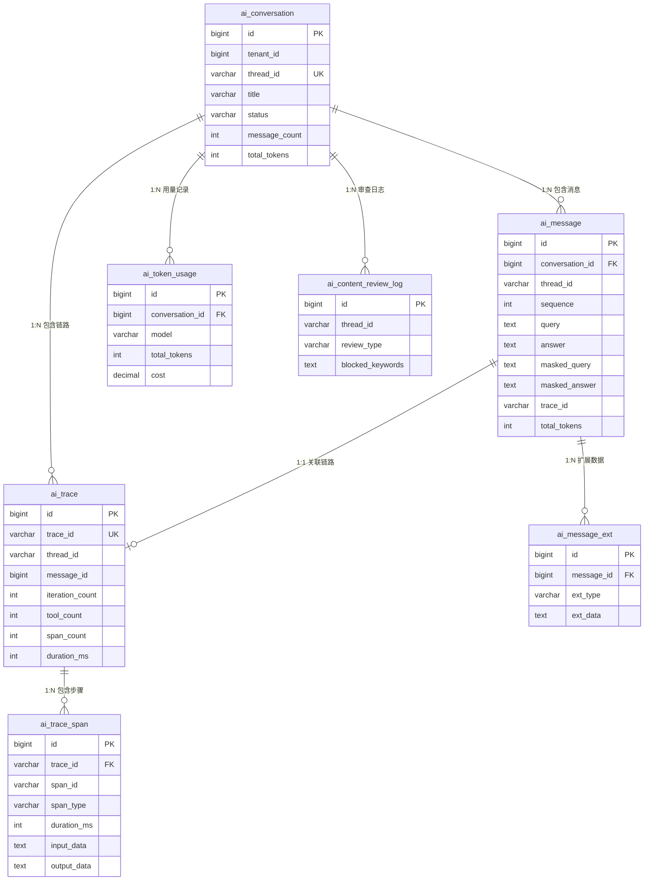

# Agent 对话存储表设计

## 1. 设计背景

当前 DeepAgent 的对话数据全部存在内存中：
- 对话历史：依赖 LangGraph checkpointer（Redis），服务重启后丢失
- 链路追踪：`Tracer` 类用 dict 存储，进程内有效
- 记忆数据：`MemoryStorage` 用 SQLite 本地文件

生产环境需要持久化存储，支持：对话历史回溯、消息审计、链路分析、用量统计、多实例部署。

## 2. 表总览

```
┌─────────────────────────────────────────────────────────┐
│                    ai_conversation                       │
│  一次对话会话（对应一个 thread_id）                       │
├─────────────────────────────────────────────────────────┤
│         │                              │                 │
│    ai_message                    ai_trace                │
│  一条用户问答对                 一次 Agent 执行链路       │
│  (query + answer)              (对应一次用户输入)         │
│         │                              │                 │
│    ai_message_ext               ai_trace_span            │
│  消息扩展数据                   链路中的每个步骤          │
│  (文件/卡片/反馈)              (LLM/工具/记忆/审查)       │
│                                                          │
├─────────────────────────────────────────────────────────┤
│                                                          │
│    ai_content_review_log        ai_token_usage           │
│  内容审查日志                   Token 用量统计            │
│  (输入/输出拦截记录)           (按会话/用户/模型聚合)     │
└─────────────────────────────────────────────────────────┘
```

## 3. 表结构详细设计

### 3.1 ai_conversation — 对话会话

一个 thread_id 对应一条记录，是用户与 Agent 的一次完整对话。

```sql
CREATE TABLE ai_conversation (
    id              BIGINT PRIMARY KEY,
    tenant_id       BIGINT NOT NULL,
    user_id         BIGINT NOT NULL,
    thread_id       VARCHAR(64) NOT NULL,
    agent_name      VARCHAR(100) NOT NULL DEFAULT 'CRM-Agent',
    title           VARCHAR(500) DEFAULT '',
    summary         TEXT DEFAULT '',
    model           VARCHAR(100) DEFAULT '',
    status          VARCHAR(20) NOT NULL DEFAULT 'active',
    message_count   INT NOT NULL DEFAULT 0,
    total_tokens    INT NOT NULL DEFAULT 0,
    total_cost      DECIMAL(10,4) NOT NULL DEFAULT 0,
    last_message_at BIGINT DEFAULT 0,
    ext_info        TEXT DEFAULT '{}',
    delete_flg      SMALLINT NOT NULL DEFAULT 0,
    created_at      BIGINT NOT NULL,
    created_by      BIGINT NOT NULL DEFAULT 0,
    updated_at      BIGINT NOT NULL,
    updated_by      BIGINT NOT NULL DEFAULT 0
);

CREATE UNIQUE INDEX uk_conversation_thread ON ai_conversation(tenant_id, thread_id);
CREATE INDEX idx_conversation_user ON ai_conversation(tenant_id, user_id, delete_flg);
CREATE INDEX idx_conversation_time ON ai_conversation(tenant_id, last_message_at DESC);
```

| 字段 | 说明 |
|------|------|
| thread_id | LangGraph 的 thread_id，全局唯一 |
| title | 对话标题（由 TitleMiddleware 生成） |
| summary | 对话摘要（由 SummarizationMiddleware 生成） |
| status | active / archived / deleted |
| message_count | 消息对数（每次问答 +1） |
| total_tokens | 累计 token 消耗 |
| last_message_at | 最后一条消息时间戳（用于排序） |
| ext_info | JSON 扩展字段（debug_mode、agent 配置等） |

### 3.2 ai_message — 对话消息

一条记录对应一次用户问答对（query + answer），对齐老项目 ai_message。

```sql
CREATE TABLE ai_message (
    id              BIGINT PRIMARY KEY,
    tenant_id       BIGINT NOT NULL,
    conversation_id BIGINT NOT NULL,
    thread_id       VARCHAR(64) NOT NULL,
    sequence        INT NOT NULL DEFAULT 0,
    role            VARCHAR(20) NOT NULL,
    query           TEXT DEFAULT '',
    answer          TEXT DEFAULT '',
    masked_query    TEXT DEFAULT '',
    masked_answer   TEXT DEFAULT '',
    model           VARCHAR(100) DEFAULT '',
    input_tokens    INT NOT NULL DEFAULT 0,
    output_tokens   INT NOT NULL DEFAULT 0,
    total_tokens    INT NOT NULL DEFAULT 0,
    iteration_count INT NOT NULL DEFAULT 0,
    tool_count      INT NOT NULL DEFAULT 0,
    duration_ms     INT NOT NULL DEFAULT 0,
    trace_id        VARCHAR(64) DEFAULT '',
    status          VARCHAR(20) NOT NULL DEFAULT 'success',
    error_message   TEXT DEFAULT '',
    ext_info        TEXT DEFAULT '{}',
    delete_flg      SMALLINT NOT NULL DEFAULT 0,
    created_at      BIGINT NOT NULL,
    created_by      BIGINT NOT NULL DEFAULT 0,
    updated_at      BIGINT NOT NULL,
    updated_by      BIGINT NOT NULL DEFAULT 0
);

CREATE INDEX idx_message_conversation ON ai_message(conversation_id, sequence);
CREATE INDEX idx_message_thread ON ai_message(tenant_id, thread_id, sequence);
CREATE INDEX idx_message_trace ON ai_message(trace_id);
```

| 字段 | 说明 |
|------|------|
| conversation_id | 关联 ai_conversation.id |
| sequence | 消息序号（从 1 递增） |
| role | user / assistant / system |
| query | 用户原始输入 |
| answer | Agent 最终回复 |
| masked_query | PII 脱敏后的输入（送入 LLM 的版本） |
| masked_answer | PII 脱敏后的输出（审计用） |
| trace_id | 关联 ai_trace.trace_id |
| iteration_count | ReAct 循环次数 |
| tool_count | 工具调用次数 |
| duration_ms | 端到端耗时（ms） |

### 3.3 ai_message_ext — 消息扩展数据

存储消息关联的附件、卡片、反馈等非结构化数据。

```sql
CREATE TABLE ai_message_ext (
    id              BIGINT PRIMARY KEY,
    tenant_id       BIGINT NOT NULL,
    message_id      BIGINT NOT NULL,
    ext_type        VARCHAR(50) NOT NULL,
    ext_data        TEXT NOT NULL DEFAULT '{}',
    status          VARCHAR(20) DEFAULT 'active',
    delete_flg      SMALLINT NOT NULL DEFAULT 0,
    created_at      BIGINT NOT NULL,
    updated_at      BIGINT NOT NULL
);

CREATE INDEX idx_message_ext ON ai_message_ext(message_id, ext_type);
```

| ext_type | ext_data 示例 | 说明 |
|----------|--------------|------|
| file | `{"fileName":"客户清单.csv","fileType":"document","url":"..."}` | 上传文件 |
| card | `{"cardType":"table","data":[...]}` | 结构化卡片（表格、图表） |
| feedback | `{"rating":"good","comment":"回答准确"}` | 用户反馈 |
| clarification | `{"type":"missing_info","question":"...","options":[...]}` | 澄清追问 |
| tool_result | `{"toolName":"query_data","input":{...},"output":{...}}` | 工具调用详情 |

### 3.4 ai_trace — 执行链路

一条记录对应一次 Agent 执行（一次用户输入触发的完整 ReAct 循环），对齐当前 `Trace` 类。

```sql
CREATE TABLE ai_trace (
    id              BIGINT PRIMARY KEY,
    tenant_id       BIGINT NOT NULL,
    trace_id        VARCHAR(64) NOT NULL,
    thread_id       VARCHAR(64) NOT NULL,
    message_id      BIGINT DEFAULT 0,
    user_input      TEXT DEFAULT '',
    agent_output    TEXT DEFAULT '',
    model           VARCHAR(100) DEFAULT '',
    agent_name      VARCHAR(100) DEFAULT '',
    status          VARCHAR(20) NOT NULL DEFAULT 'running',
    total_tokens    INT NOT NULL DEFAULT 0,
    total_cost      DECIMAL(10,4) NOT NULL DEFAULT 0,
    iteration_count INT NOT NULL DEFAULT 0,
    tool_count      INT NOT NULL DEFAULT 0,
    span_count      INT NOT NULL DEFAULT 0,
    duration_ms     INT NOT NULL DEFAULT 0,
    start_time      BIGINT NOT NULL,
    end_time        BIGINT DEFAULT 0,
    ext_info        TEXT DEFAULT '{}',
    delete_flg      SMALLINT NOT NULL DEFAULT 0,
    created_at      BIGINT NOT NULL,
    updated_at      BIGINT NOT NULL
);

CREATE UNIQUE INDEX uk_trace_id ON ai_trace(trace_id);
CREATE INDEX idx_trace_thread ON ai_trace(tenant_id, thread_id, start_time DESC);
CREATE INDEX idx_trace_time ON ai_trace(tenant_id, start_time DESC);
```

### 3.5 ai_trace_span — 链路步骤

一条记录对应链路中的一个步骤，对齐当前 `Span` 类。

```sql
CREATE TABLE ai_trace_span (
    id              BIGINT PRIMARY KEY,
    tenant_id       BIGINT NOT NULL,
    trace_id        VARCHAR(64) NOT NULL,
    span_id         VARCHAR(64) NOT NULL,
    parent_span_id  VARCHAR(64) DEFAULT '',
    span_type       VARCHAR(50) NOT NULL,
    span_name       VARCHAR(200) NOT NULL DEFAULT '',
    status          VARCHAR(20) NOT NULL DEFAULT 'running',
    duration_ms     INT NOT NULL DEFAULT 0,
    start_time      BIGINT NOT NULL,
    end_time        BIGINT DEFAULT 0,
    input_data      TEXT DEFAULT '{}',
    output_data     TEXT DEFAULT '{}',
    metadata        TEXT DEFAULT '{}',
    delete_flg      SMALLINT NOT NULL DEFAULT 0,
    created_at      BIGINT NOT NULL
);

CREATE INDEX idx_span_trace ON ai_trace_span(trace_id, start_time);
CREATE INDEX idx_span_type ON ai_trace_span(trace_id, span_type);
```

| span_type 枚举 | 说明 | 来源 |
|----------------|------|------|
| context_build | 上下文构建 | TracingMiddleware.before_agent |
| memory_retrieval | 记忆检索 | MemoryMiddleware |
| intent_analysis | 意图分析 | TracingMiddleware.before_model |
| llm_call | LLM 调用 | TracingMiddleware.after_model |
| tool_call | 工具调用 | TracingMiddleware.wrap_tool_call |
| hierarchical_search | 分层检索 | FTSMemoryEngine.retrieve |
| memory_extract | 记忆提取 | MemoryMiddleware.aafter_agent |
| clarification | 澄清追问 | ClarificationMiddleware |
| content_review | 内容审查 | ContentReviewTransformer |
| error | 异常 | 各中间件 |

### 3.6 ai_content_review_log — 内容审查日志

记录每次输入/输出审查的拦截事件，用于审计和规则优化。

```sql
CREATE TABLE ai_content_review_log (
    id              BIGINT PRIMARY KEY,
    tenant_id       BIGINT NOT NULL,
    thread_id       VARCHAR(64) NOT NULL,
    message_id      BIGINT DEFAULT 0,
    review_type     VARCHAR(20) NOT NULL,
    original_content TEXT NOT NULL,
    blocked_keywords TEXT DEFAULT '[]',
    blocked_reason  VARCHAR(500) DEFAULT '',
    rule_id         BIGINT DEFAULT 0,
    delete_flg      SMALLINT NOT NULL DEFAULT 0,
    created_at      BIGINT NOT NULL
);

CREATE INDEX idx_review_log_thread ON ai_content_review_log(tenant_id, thread_id);
CREATE INDEX idx_review_log_time ON ai_content_review_log(tenant_id, created_at DESC);
```

| review_type | 说明 |
|-------------|------|
| input | 输入审查拦截 |
| output | 输出审查拦截 |

### 3.7 ai_token_usage — Token 用量统计

按会话/用户/模型维度聚合 token 消耗，用于用量管控和计费。

```sql
CREATE TABLE ai_token_usage (
    id              BIGINT PRIMARY KEY,
    tenant_id       BIGINT NOT NULL,
    user_id         BIGINT NOT NULL,
    conversation_id BIGINT DEFAULT 0,
    thread_id       VARCHAR(64) DEFAULT '',
    trace_id        VARCHAR(64) DEFAULT '',
    model           VARCHAR(100) NOT NULL,
    input_tokens    INT NOT NULL DEFAULT 0,
    output_tokens   INT NOT NULL DEFAULT 0,
    total_tokens    INT NOT NULL DEFAULT 0,
    cost            DECIMAL(10,6) NOT NULL DEFAULT 0,
    created_at      BIGINT NOT NULL
);

CREATE INDEX idx_usage_user ON ai_token_usage(tenant_id, user_id, created_at DESC);
CREATE INDEX idx_usage_model ON ai_token_usage(tenant_id, model, created_at DESC);
CREATE INDEX idx_usage_conversation ON ai_token_usage(conversation_id);
```

## 4. 表关系 ER 图



## 5. 数据写入时机

| 表 | 写入时机 | 写入方 |
|---|---|---|
| ai_conversation | 首次对话时创建，每次消息后更新 message_count/total_tokens/last_message_at | server.py 的 /api/chat |
| ai_message | Agent 执行完成后写入（query + answer 一起） | MemoryMiddleware.aafter_agent 或 server.py |
| ai_message_ext | 有附件/反馈/卡片时写入 | FileProcessMiddleware / 前端反馈接口 |
| ai_trace | Tracer.start_trace 时创建，finish_trace 时更新 | Tracer |
| ai_trace_span | 每个 span 完成时写入 | TracingMiddleware 各钩子 |
| ai_content_review_log | 审查拦截时写入 | ContentReviewTransformer / OutputValidationMiddleware |
| ai_token_usage | LLM 调用返回 usage 后写入 | server.py 的 on_chat_model_end |

## 6. 与老项目对比

| 老项目表 | 新表 | 差异 |
|---------|------|------|
| ai_conversation | ai_conversation | 新增 total_tokens/total_cost/last_message_at |
| ai_message | ai_message | 新增 trace_id/iteration_count/tool_count/duration_ms |
| ai_debug_message | ai_trace_span | 老项目只记 4 种 type，新表记 10+ 种 span_type |
| ai_message_data | ai_message_ext | 统一为 ext_type + ext_data 的 KV 模式 |
| ai_conversation_pending | 去掉 | 异步状态由 LangGraph checkpointer 管理 |
| ai_llm_app_audit | ai_token_usage | 拆分为独立用量表，不再混在审计日志中 |
| （无） | ai_trace | 新增，完整链路追踪 |
| （无） | ai_content_review_log | 新增，审查审计 |

## 7. 约束

- 所有表遵循 BaseEntity 规范：id(BIGINT 雪花主键) + delete_flg + created_at/created_by + updated_at/updated_by
- 所有 DDL 兼容 MySQL 和 PostgreSQL，禁止 AUTO_INCREMENT/ENGINE/COMMENT/BOOLEAN/ENUM
- 关联使用 thread_id/trace_id 等业务标识，不使用自增 ID 关联
- TEXT 字段存储 JSON 时使用 `DEFAULT '{}'` 或 `DEFAULT '[]'`
