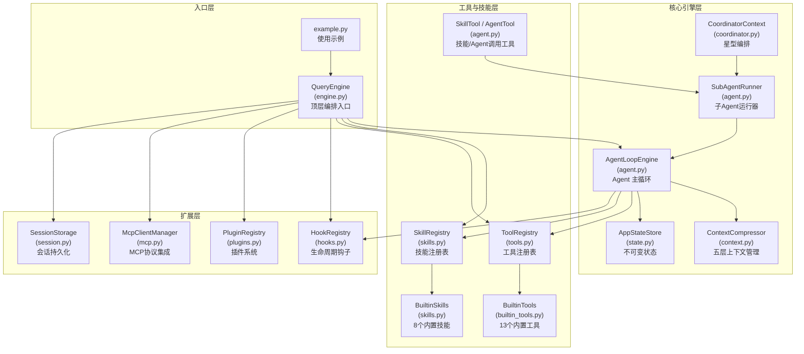
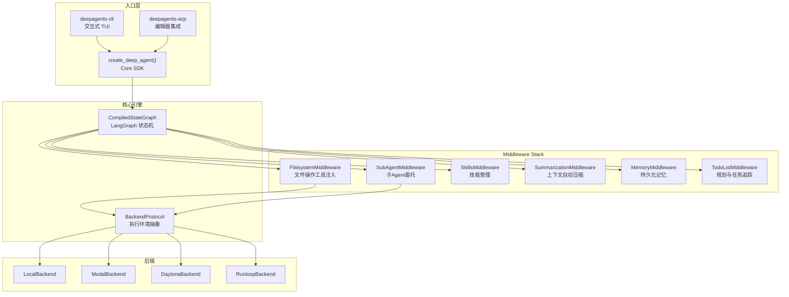
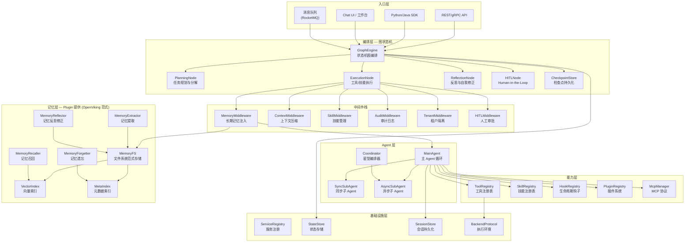
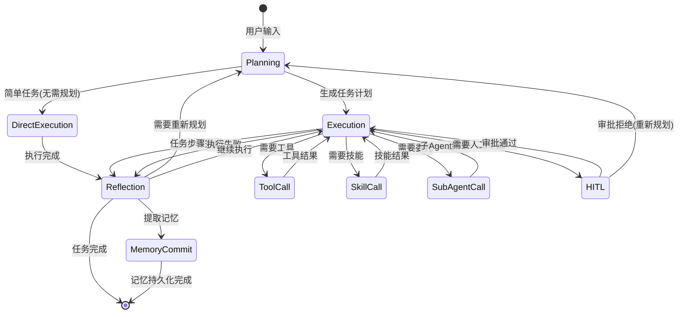
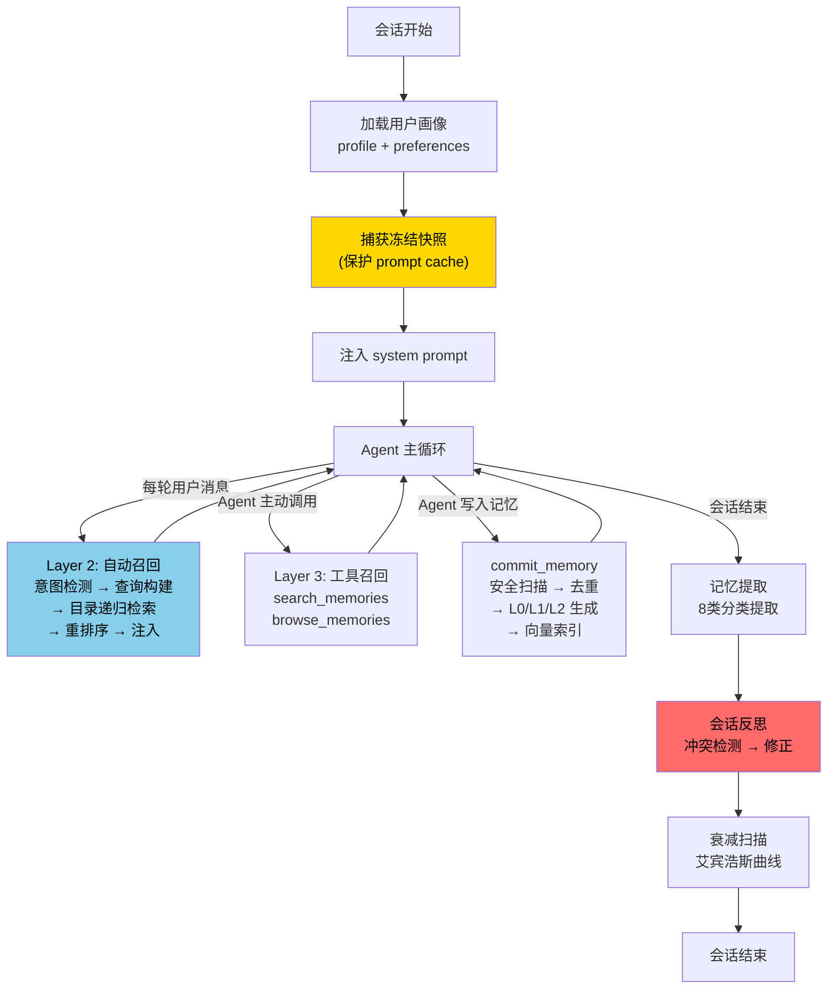
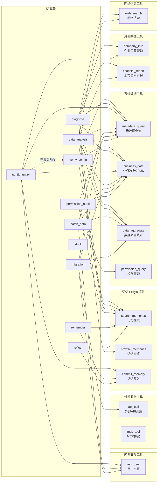
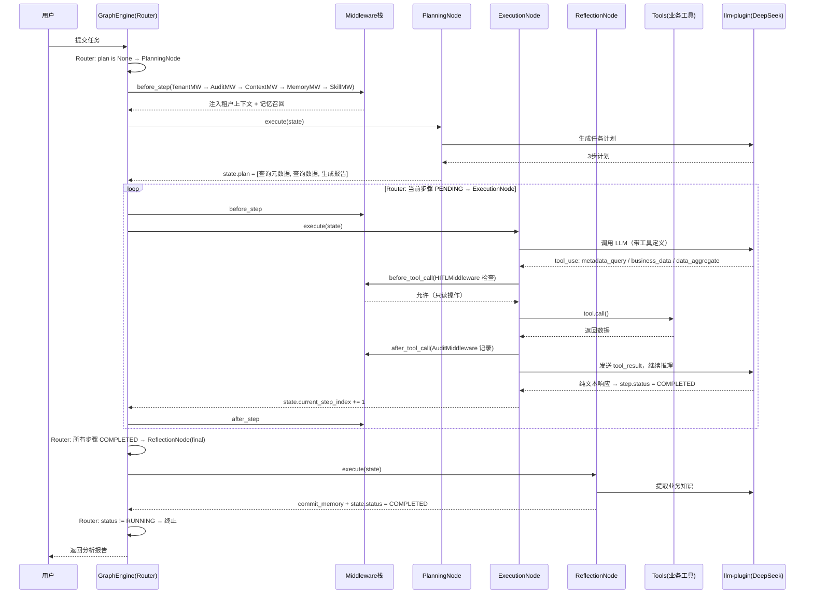
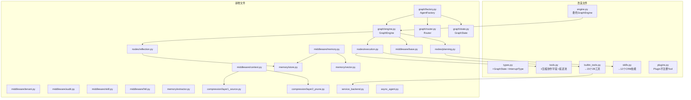
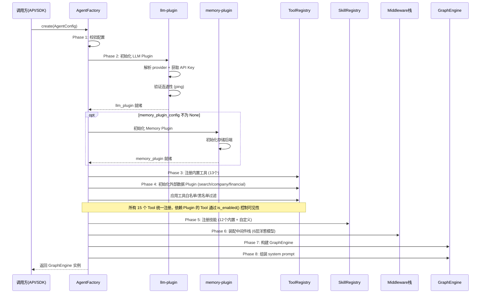
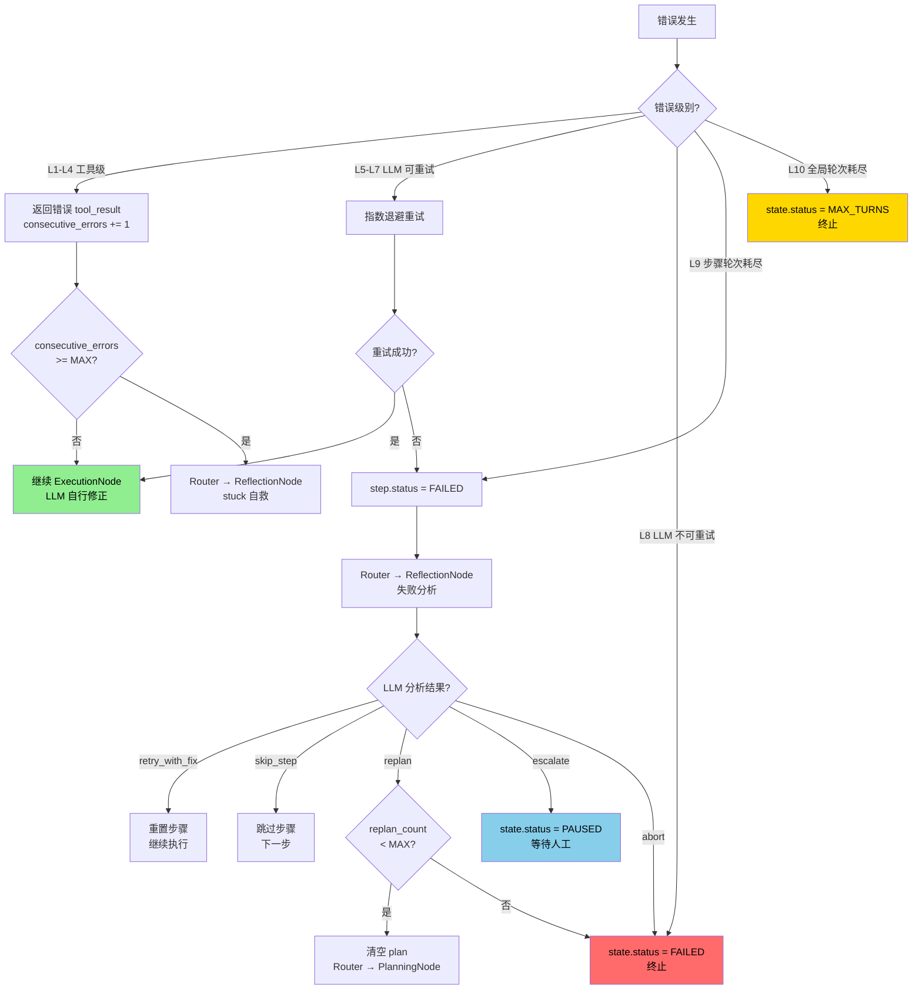

# Agent 系统设计 — DeepAgent 架构

> 本文档整合了完整设计方案、技术实现方案、核心引擎详细设计三部分。

> 基于 agent-system 现有代码深度分析 + LangChain DeepAgents 框架 + OpenViking 文件系统范式 + Hermes 长期记忆，设计面向 aPaaS 平台的企业级 Agent 系统

---

## 一、现有 agent-system 代码深度分析

### 1.1 项目概述

agent-system 是一套借鉴 Claude Code 架构的 Python Agent 框架原型，约 3500 行代码，覆盖了 Agent 系统的完整骨架。核心模块 14 个文件，实现了 Agent Loop + Skills + Tools + Hooks + Plugins + MCP + Session + Coordinator 体系。

### 1.2 系统架构图



### 1.3 核心功能清单

| 功能名称 | 一句话描述 | 核心模块/文件 | 复杂度 |
|----------|-----------|-------------|--------|
| Agent 主循环 | while(true) + yield 模式的 agentic loop，集成 Hooks/Session/压缩/反思 | `agent.py` AgentLoopEngine | 高 |
| 工具体系 | 统一 Tool 接口 + 权限控制 + 结果预算 + 并行执行 | `tools.py` + `builtin_tools.py` | 高 |
| 技能体系 | 8 个内置技能 + 文件技能加载 + inline/fork 执行模式 | `skills.py` | 中 |
| 子 Agent 编排 | 命名 Agent + Fork 模式 + 独立工具池 + 权限隔离 | `agent.py` SubAgentRunner | 高 |
| Coordinator 模式 | 星型编排，Coordinator 只编排不执行，Worker 外围执行 | `coordinator.py` | 中 |
| 上下文管理 | 六策略压缩：Budget/Snip/Microcompact/Collapse/Autocompact/Reactive | `context.py` | 高 |
| Hook 系统 | Pre/Post ToolUse + Session 生命周期钩子 | `hooks.py` | 中 |
| 插件系统 | 插件提供 Skills + Hooks + MCP Servers | `plugins.py` | 中 |
| MCP 集成 | JSON-RPC 协议连接外部工具服务器 | `mcp.py` | 中 |
| 会话持久化 | JSONL transcript + 文件快照 + 子 Agent sidechain | `session.py` | 中 |
| 反思机制 | 连续相同工具/连续错误检测 + 权限拒绝追踪 | `agent.py` ReflectionState | 低 |
| 状态管理 | 不可变状态 + 订阅模式 | `state.py` | 低 |
| LLM 客户端 | Anthropic API 完整实现 + Mock 客户端 | `llm_client.py` | 中 |
| 顶层引擎 | 组装所有子系统，提供 submit_message() 接口 | `engine.py` QueryEngine | 高 |

### 1.4 核心数据流

```
用户输入 → QueryEngine.submit_message()
  → 初始化所有子系统 (工具/技能/插件/MCP/Session)
  → 构建 System Prompt (systemContext + userContext + claudeMd)
  → AgentLoopEngine.run()
    → SessionStart Hooks
    → while(true):
      │ → 上下文压缩管线 (Budget → Snip → Microcompact)
      │ → 动态附件注入
      │ → PreQuery Hooks
      │ → 组装 System Prompt
      │ → LLM API 调用 (带重试)
      │ → 解析响应 → yield assistant_msg
      │ → 提取 tool_use blocks
      │ → 无 tool_use? → StopHooks → 结束
      │ → 并行执行工具 (findTool → preHook → validate → permission → call → postHook → budget)
      │ → 反思检测 (stuck pattern)
      │ → 权限拒绝追踪
      │ → 构建 tool_result 消息
      │ → 持久化 transcript
      └ → 继续循环
  → 最终持久化
```

### 1.5 现有代码的优势与不足

#### 优势

1. **架构完整性高** — 从 QueryEngine 到 Tool 执行的全链路已打通，14 个模块职责清晰
2. **扩展性好** — Plugin/MCP/Hook 三套扩展机制，支持多种方式增强能力
3. **容错机制** — 指数退避重试 + 反思检测 + 权限拒绝追踪
4. **上下文管理成熟** — 六策略压缩管线，借鉴 Claude Code 的生产级方案
5. **测试覆盖** — 60+ 测试用例，覆盖所有核心模块

#### 不足（需要增强的方向）

| 维度 | 现状 | 目标 |
|------|------|------|
| 长期记忆 | 仅有 CLAUDE.md 文件级记忆 + remember skill | 需要 OpenViking 式分层记忆 + 向量检索 + 遗忘策略 |
| 反思能力 | 仅检测 stuck pattern（连续相同工具/连续错误） | 需要深度反思：失败驱动反思、用户纠正反思、全局一致性审计 |
| 图编排 | 线性 while(true) 循环 | 需要 LangGraph 式状态机图编排，支持条件分支、并行、循环 |
| 异步子 Agent | 同步阻塞式子 Agent | 需要 DeepAgents 式异步子 Agent，fire-and-forget + 状态追踪 |
| 中间件架构 | Hook 系统较简单 | 需要 DeepAgents 式 Middleware Stack，拦截模型调用和工具执行 |
| 2B 行业适配 | 通用框架 | 需要租户隔离、元数据驱动、业务对象感知 |

---

## 二、LangChain DeepAgents 框架深度分析

### 2.1 DeepAgents 概述

[DeepAgents](https://github.com/langchain-ai/deepagents) 是 LangChain 团队开源的"电池全包"Agent 框架（v0.5.3，MIT 协议），灵感来自 Claude Code。核心定位：一个开箱即用的 Agent 运行时，内置规划、文件系统、子 Agent 委托和上下文管理。

关键特性：
- **LangGraph 原生** — `create_deep_agent()` 返回编译后的 LangGraph 图，支持流式、持久化、检查点
- **Middleware 架构** — 6 个内置中间件拦截模型调用和工具执行
- **异步子 Agent** — v0.5 新增，fire-and-forget 模式，支持远程 Agent Protocol 服务器
- **Backend 抽象** — 文件系统和 Shell 操作通过 BackendProtocol 抽象，支持本地/Docker/Modal/Daytona 等
- **Provider 无关** — 支持任何支持 tool calling 的 LLM

### 2.2 DeepAgents 架构图



### 2.3 DeepAgents 核心设计模式

#### 2.3.1 Middleware 拦截模式

DeepAgents 的核心创新是 Middleware Stack。每个中间件可以：
- `wrap_model_call()` — 拦截 LLM 调用前后，注入工具定义、修改 prompt
- `before_tool_call()` — 工具执行前拦截，可修改参数或拒绝执行
- `after_tool_call()` — 工具执行后处理，可修改结果或触发后续动作

这比我们现有的 Hook 系统更强大，因为中间件可以组合成管线，每个中间件独立管理自己的状态。

#### 2.3.2 异步子 Agent（v0.5 新增）

```
主 Agent ──→ start_async_task("researcher", prompt) ──→ 返回 task_id（不阻塞）
  │
  │ 继续处理其他工作或与用户对话
  │
  ├──→ check_async_task(task_id) ──→ 查询状态/获取结果
  ├──→ update_async_task(task_id, new_instructions) ──→ 发送后续指令
  ├──→ cancel_async_task(task_id) ──→ 取消任务
  └──→ list_async_tasks() ──→ 列出所有任务状态
```

异步子 Agent 基于 Agent Protocol（LangChain 的开放规范），支持：
- 远程部署（不同硬件、不同模型、不同工具集）
- 跨交互有状态（thread 历史保留）
- 与同步子 Agent 混合使用

#### 2.3.3 TodoList 规划

DeepAgents 用 `write_todos` 工具实现任务规划，而非独立的 Planning Agent：
- Agent 在开始复杂任务前自动分解为 todo 列表
- 每完成一步更新 todo 状态
- 规划信息持久化到文件系统，跨会话可恢复

#### 2.3.4 上下文窗口管理

- **SummarizationMiddleware** — 对话过长时自动调用 LLM 生成摘要
- **Tool Result Eviction** — 大工具结果自动写入文件，用文件路径替代
- **文件系统作为外部记忆** — Agent 主动将中间结果写入文件，减少上下文占用

### 2.4 DeepAgents vs 我们的 agent-system 对比

| 维度 | DeepAgents | 我们的 agent-system |
|------|-----------|-------------------|
| 编排模型 | LangGraph 状态机图 | while(true) 循环 |
| 扩展机制 | Middleware Stack（6个） | Hook + Plugin（分离） |
| 子 Agent | 同步 + 异步（Agent Protocol） | 同步（SubAgentRunner） |
| 规划 | TodoListMiddleware | 无内置规划 |
| 文件系统 | BackendProtocol 抽象（本地/远程） | 直接文件操作 |
| 记忆 | MemoryMiddleware + SkillsMiddleware | CLAUDE.md + remember skill |
| 上下文管理 | SummarizationMiddleware + Eviction | 六策略压缩管线（更丰富） |
| 安全 | Path Validation + Shell Allow-list | 权限模式 + deny rules |
| 2B 适配 | 无（通用框架） | 无（需要设计） |

---


---

## 三、融合设计：2B 行业 DeepAgent 系统

### 3.0 设计背景：Agent 系统的核心特性需求

Agent 与传统软件的三个关键差异决定了系统设计方向：

| 差异 | 带来的问题 | 需要的特性 | 我们的实现 |
|------|-----------|-----------|-----------|
| 高延迟（LLM 调用秒级） | 用户等待体验差 | 流式输出 + 可中断调用 | AgentCallbacks + interrupt_event |
| 低可靠性（长时间运行易失败） | 重试成本高 | 检查点恢复 | CheckpointStore |
| 非确定性（LLM 输出不可预测） | 需要人工介入 | Human-in-the-Loop | HITLMiddleware + PAUSED/resume |

**设计决策：自研简化版状态机（Router + 三个 Node），不直接依赖 LangGraph 库。** 理由：aPaaS 平台需要深度定制（租户隔离、审计日志、业务域子 Agent），直接依赖第三方框架会限制灵活性。

### 3.1 设计目标

将以下四个系统的精华融合为一套面向 2B 行业的 Agent 系统：

| 来源 | 借鉴要素 |
|------|---------|
| 现有 agent-system | Agent Loop + Tools + Skills + Hooks + Plugins + MCP + Session + Coordinator |
| LangChain DeepAgents | Middleware Stack + 异步子 Agent + TodoList 规划 + Backend 抽象 |
| LangGraph | 状态机图编排 + 检查点 + 确定性并发 + Human-in-the-Loop |
| OpenViking + Hermes | 文件系统范式记忆 + L0/L1/L2 三层模型 + 8 类记忆分类 + 反思修正 |

### 3.2 整体架构图



### 3.3 图状态机编排引擎

> 详细设计见 [Agent-Core-详细设计.md](Agent-Core-详细设计.md)，包含完整的状态定义、路由决策表、Node 内部循环、中间件执行时序、错误处理边界、HITL 暂停/恢复机制、以及 5 个完整的执行时序示例。

借鉴 LangGraph 的状态机理念，设计我们自己的图编排引擎：



#### 3.3.1 GraphState 核心字段

> 完整字段定义见 [Agent-Core-详细设计.md 第一章](Agent-Core-详细设计.md#一核心概念定义)

```python
@dataclass
class GraphState:
    # 身份与会话
    session_id: str                           # 会话 ID
    tenant_id: str                            # 租户 ID（隔离边界）
    user_id: str                              # 当前用户 ID
    messages: list[Message]                   # 完整对话历史
    
    # 任务规划
    plan: TaskPlan | None = None              # 当前任务计划
    current_step_index: int = 0               # 当前执行步骤
    
    # 执行追踪
    current_node: str = "router"              # 当前 Node
    total_llm_calls: int = 0                  # 累计 LLM 调用次数
    total_tool_calls: int = 0                 # 累计工具调用次数
    consecutive_errors: int = 0               # 连续错误计数
    consecutive_same_tool: int = 0            # 连续同一工具计数
    
    # 状态控制
    status: AgentStatus = AgentStatus.RUNNING # running/paused/completed/failed/max_turns/aborted
    pause_reason: str | None = None           # HITL 暂停原因
    
    # 上下文
    memory_context: str = ""                  # 记忆召回内容（MemoryMiddleware 注入）
    system_prompt: str = ""                   # 完整 system prompt
    checkpoint_version: int = 0               # 检查点版本号
```

#### 3.3.2 Router 路由决策

> 完整路由逻辑见 [Agent-Core-详细设计.md 第二章](Agent-Core-详细设计.md#二执行引擎主循环graphengine)

Router 根据 GraphState 决定下一个 Node，按优先级从高到低：

| 优先级 | 条件 | 路由到 |
|--------|------|--------|
| 1 | status != RUNNING | 终止 |
| 2 | total_llm_calls >= 200 | 终止(MAX_TURNS) |
| 3 | consecutive_errors >= 5 或 consecutive_same_tool >= 4 | ReflectionNode（stuck 自救） |
| 4 | plan is None | PlanningNode |
| 5 | 所有步骤 COMPLETED | ReflectionNode（最终反思） |
| 6 | 当前步骤 FAILED | ReflectionNode（失败分析） |
| 7 | 当前步骤 PENDING/RUNNING | ExecutionNode |

#### 3.3.3 主循环执行流程

> 完整伪代码见 [Agent-Core-详细设计.md 2.2 节](Agent-Core-详细设计.md#22-主循环伪代码)

```
GraphEngine.run(state):
  while True:
    node = Router.next_node(state)     # 路由决策
    if node is None: break             # 终止条件
    
    for mw in middlewares:             # 中间件前处理（按注册顺序）
      state = mw.before_step(state)
    
    state = node.execute(state)        # Node 执行
    
    for mw in reversed(middlewares):   # 中间件后处理（逆序）
      state = mw.after_step(state)
    
    checkpoint_store.save(state)       # 保存检查点
    yield state                        # 流式输出
    
    if state.status == PAUSED: break   # HITL 暂停
```

#### 3.3.4 三个核心 Node 的职责

> 完整内部逻辑见 [Agent-Core-详细设计.md 第三~五章](Agent-Core-详细设计.md#三planningnode-详细设计)

| Node | 职责 | 内部逻辑 | 输出 |
|------|------|---------|------|
| PlanningNode | 任务分解 | 判断复杂度 → 简单任务生成单步计划 / 复杂任务调用 LLM 生成多步计划 → 校验步骤数 ≤ 15 → 搜索历史经验注入 | state.plan 被填充 |
| ExecutionNode | 步骤执行 | 内部 mini agent loop: while step.status == RUNNING { LLM 调用 → 解析响应 → 有 tool_use? → 执行工具 → 继续 / 纯文本? → 步骤完成 } | 步骤 COMPLETED 或 FAILED |
| ReflectionNode | 反思决策 | 判断反思类型 → 最终反思(提取记忆) / 失败分析(retry/skip/replan/escalate/abort) / stuck 自救(注入自救 prompt) / 用户纠正(修正记忆) | 状态变更或 plan 清空 |

#### 3.3.5 HITL 暂停与恢复

> 完整机制见 [Agent-Core-详细设计.md 2.3 节](Agent-Core-详细设计.md#23-hitl-暂停与恢复机制)

```
暂停: HITLMiddleware.before_tool_call() 拦截危险操作
  → state.status = PAUSED, pause_reason = "..."
  → 保存检查点 → 退出主循环 → 展示给用户

恢复: GraphEngine.resume(session_id, decision)
  → approve: 继续执行被暂停的操作
  → reject:  跳过当前步骤
  → abort:   终止任务
  → 超时(1h): 自动 ABORTED
```

#### 3.3.6 错误处理分级

> 完整 16 级错误定义见 [Agent-Core-详细设计.md 第七章](Agent-Core-详细设计.md#七错误处理边界完整定义)

| 级别 | 场景 | 处理 |
|------|------|------|
| L1-L4 | 工具级错误（校验/执行/超时/权限） | 返回错误 tool_result，LLM 自行修正 |
| L5-L7 | LLM 可重试错误（超时/限流/服务端） | 指数退避重试，最多 3 次 |
| L8 | LLM 不可重试错误（认证失败） | 直接 FAILED |
| L9-L10 | 轮次耗尽（步骤级/全局级） | 步骤级→反思分析，全局级→终止 |
| L11-L12 | 连续错误/重复工具 | Router→ReflectionNode stuck 自救 |
| L13 | 重新规划上限（3次） | FAILED |
| L14 | HITL 超时（1小时） | ABORTED |
| L15-L16 | 中间件/检查点异常 | 记录日志，不阻塞主流程 |

### 3.4 中间件栈设计

借鉴 DeepAgents 的 Middleware 架构，设计我们的中间件栈：

```python
class Middleware(Protocol):
    """中间件接口 — 借鉴 DeepAgents 的 Middleware 模式"""
    name: str
    
    async def before_step(self, state: GraphState, nodes: list[GraphNode]) -> GraphState:
        """图步骤执行前"""
        return state
    
    async def after_step(self, state: GraphState, nodes: list[GraphNode]) -> GraphState:
        """图步骤执行后"""
        return state
    
    async def wrap_model_call(self, state: GraphState, call_fn: Callable) -> Any:
        """拦截 LLM 调用"""
        return await call_fn(state)
    
    async def before_tool_call(self, tool_name: str, input_data: dict) -> dict | None:
        """工具调用前拦截，返回 None 表示拒绝"""
        return input_data
    
    async def after_tool_call(self, tool_name: str, result: ToolResult) -> ToolResult:
        """工具调用后处理"""
        return result
```

#### 6 个核心中间件

| 中间件 | 职责 | 借鉴来源 |
|--------|------|---------|
| `TenantMiddleware` | 租户隔离：注入租户上下文、过滤工具/技能、隔离记忆空间 | 2B 行业需求 |
| `MemoryMiddleware` | 长期记忆：会话开始注入画像、每轮自动召回、记忆写入拦截 | memory-plugin 提供（OpenViking + Hermes） |
| `ContextMiddleware` | 上下文管理：五层压缩策略 + Tool Result Eviction + 自动摘要 | [压缩详细方案](Agent-Context-Compression-详细方案.md) |
| `SkillMiddleware` | 技能管理：技能发现、注入使用经验、技能自动创建 | 现有 SkillRegistry + Hermes skillify |
| `AuditMiddleware` | 审计日志：记录所有 LLM 调用、工具执行、状态变更 | 2B 行业合规需求 |
| `HITLMiddleware` | 人工审批：危险操作拦截、审批流程、超时处理 | DeepAgents HITLMiddleware + LangGraph interrupt |

### 3.5 长期记忆系统设计

> 记忆系统通过 memory-plugin 提供，非 Agent 引擎内置能力。Plugin 启用后，MemoryMiddleware 自动注册到中间件栈，search_memories/browse_memories/commit_memory 三个工具自动注册到 ToolRegistry。

融合 OpenViking 文件系统范式 + Hermes 冻结快照 + 反思修正机制：



#### 3.5.1 记忆存储模型

采用 OpenViking 的文件系统范式 + L0/L1/L2 三层模型：

```
{tenant_id}/
├── user/memories/
│   ├── profile.md                    # 用户画像
│   ├── preferences/                  # 用户偏好
│   │   ├── .abstract.md              # L0: ~100 tokens
│   │   ├── .overview.md              # L1: ~2k tokens
│   │   ├── coding_style.md           # L2: 完整内容
│   │   └── communication.md          # L2
│   ├── entities/                     # 实体记忆（人、项目、业务对象）
│   └── events/                       # 事件记录
├── agent/memories/
│   ├── cases/                        # 学习到的案例
│   ├── patterns/                     # 学习到的模式
│   ├── tools/                        # 工具使用知识
│   ├── skills/                       # 技能执行知识
│   └── reflections/                  # 反思日志
└── shared/memories/                  # 租户级共享记忆
    ├── domain_knowledge/             # 行业知识
    └── best_practices/               # 最佳实践
```

#### 3.5.2 四层召回体系

| 层级 | 触发时机 | 召回方式 | Token 成本 |
|------|---------|---------|-----------|
| Layer 1: 画像注入 | 会话开始（一次性） | profile 全量 + 高质量摘要 | 固定 ~500 tokens |
| Layer 2: 自动召回 | 每轮用户消息 | 意图检测 → 目录递归检索 → 重排序 | ~200-1000 tokens |
| Layer 3: 工具召回 | Agent 主动调用 | search_memories / browse_memories | 按需 |
| Layer 4: 技能注入 | 读取技能定义时 | 拦截 skill 读取，追加使用经验 | ~100-500 tokens |

#### 3.5.3 记忆遗忘与反思

**衰减评分模型**（基于艾宾浩斯遗忘曲线）：

```
memory_score = 0.30 × time_decay          # 时间衰减（指数）
             + 0.20 × frequency_factor     # 访问频率
             + 0.25 × importance_factor    # 重要性 × 置信度
             + 0.10 × reference_factor     # 被引用次数
             + 0.15 × category_factor      # 类别保护权重
```

**记忆状态机**：Active → Fading → Dormant → Archived

**五种反思触发**：
1. 会话结束反思 — 检查新记忆与已有记忆的矛盾
2. 冲突检测反思 — 新记忆写入时触发
3. 定期全局反思 — 每周一次，碎片合并 + 一致性检查
4. 失败驱动反思 — 任务失败后分析是否因错误记忆导致
5. 用户反馈反思 — 检测用户纠正行为

### 3.6 子 Agent 设计

> 主 Agent 初始化（8 个 Phase）和子 Agent 初始化（同步/异步两种模式）的完整流程见 [Agent-Core-详细设计.md 〇.一~〇.二节](Agent-Core-详细设计.md#〇一主-agent-初始化)

#### 3.6.1 两种子 Agent 模式

| 模式 | 触发工具 | 执行方式 | 适用场景 |
|------|---------|---------|---------|
| 同步 | `delegate_task` | 阻塞主 Agent，等待完成 | 短任务（< 2 分钟）：查询、校验、简单分析 |
| 异步 | `start_async_task` | 不阻塞，后台执行 | 长任务（> 2 分钟）：深度研究、批量处理、数据迁移 |

#### 3.6.2 继承与隔离原则

子 Agent 从主 Agent 派生时：
- **继承**: tenant_id、user_id、llm-plugin、memory-plugin、审计日志
- **隔离**: messages（独立对话历史）、session_id（派生 ID）、notification（不发通知）、HITL（不弹审批）
- **限制**: 工具集和技能集按 agent_type 裁剪、max_llm_calls 独立限制

#### 3.6.3 按业务域划分的子 Agent 类型

> 完整的工具分配表和三方交集算法见 [Agent-Core-详细设计.md](Agent-Core-详细设计.md#主-agent-与子-agent-的业务域工具分配)

参考 Salesforce 等 2B 平台覆盖的业务场景（销售/客服/营销/运营），子 Agent 按业务域而非技术能力划分：

| 业务域 | 类型 | 工具集 | 典型任务 |
|--------|------|--------|---------|
| 销售 | sales | business_data, data_aggregate, company_info, financial_report, web_search, search_memories | 查客户背景、分析商机、竞品调研 |
| 客服 | service | business_data, metadata_query, web_search, search_memories, ask_user | 诊断问题、搜索方案、引导用户 |
| 运营分析 | analytics | business_data, data_aggregate, financial_report, web_search, search_memories | 数据统计、趋势分析、异常检测 |
| 平台配置 | config | metadata_query, business_data, permission_query, search_memories, ask_user | 配置业务对象、字段规则、权限 |
| 数据管理 | data_ops | metadata_query, business_data, data_aggregate, api_call, ask_user | 数据清理、批量更新、迁移 |
| 外部调研 | research | web_search, company_info, financial_report, search_memories | 行业调研、企业尽调、政策查询 |
| 通用 | general | 继承主 Agent 全部（除编排工具） | 无法归类的任务 |

关键约束：
- 编排工具（delegate_task / start_async_task）只有主 Agent 可用，子 Agent 不能递归派生
- 每个域的工具集是该场景的最小必要集合
- 工具裁剪算法：`最终工具集 = 主 Agent 工具集 ∩ 业务域默认工具集 ∩ LLM 请求工具集`

#### 3.6.4 异步子 Agent 管理工具

| 工具 | 功能 |
|------|------|
| `start_async_task` | 启动异步任务，立即返回 task_id |
| `check_async_task` | 查询状态/获取结果 |
| `update_async_task` | 发送后续指令（任务有状态） |
| `cancel_async_task` | 取消任务 |
| `list_async_tasks` | 列出所有任务 |

### 3.7 2B 行业适配设计

#### 3.7.1 租户隔离

```python
class TenantMiddleware(Middleware):
    """租户隔离中间件"""
    name = "tenant"
    
    async def before_step(self, state: GraphState, nodes: list[GraphNode]) -> GraphState:
        tenant = await self._load_tenant(state.tenant_id)
        
        # 1. 注入租户上下文
        state.messages.insert(0, Message(
            role=MessageRole.SYSTEM,
            content=f"当前租户: {tenant.name}, 行业: {tenant.industry}"
        ))
        
        # 2. 过滤工具（租户级权限）
        # 某些租户可能禁用某些工具
        
        # 3. 隔离记忆空间
        # 记忆路径前缀为 {tenant_id}/
        
        return state
```

#### 3.7.2 2B 业务工具体系设计

> Tool 统一接口（Protocol）、ToolRegistry、13 个工具的完整 input_schema、工具调用链路、工具与后端服务的调用关系见 [Agent-Core-详细设计.md 〇.〇节](Agent-Core-详细设计.md#〇〇tool-接口与注册体系)

> 现有 agent-system 的 13 个内置工具（file_read/file_write/bash/grep/glob/web_fetch 等）面向开发者的文件系统和命令行操作。2B 业务场景下，Agent 需要的核心能力是：查系统数据、查网络信息、查工商数据、操作业务对象、调用外部服务。本节从零设计面向 2B 业务的工具体系。

##### 工具分类总览

从 2B 业务用户的实际工作场景出发，按"用户想做什么"而非"技术上调什么 API"来组织工具。底层通过 aPaaS 元数据驱动实现通用性——同一个 Tool 可以操作任何业务对象（客户/商机/工单/合同等）。

```
2B 业务工具体系:

一、查系统数据（2B 用户最高频的操作）
│
├── query_data          — 智能查询业务数据
│                         "帮我查一下上个月新增的客户"
│                         "看看金额超过100万的商机"
│                         "这个客户的详细信息"
│                         用户只需说自然语言，Tool 内部自动:
│                           1. 识别目标业务对象（客户/商机/工单/合同...）
│                           2. 查询对象的字段结构（自动调 metadata-service）
│                           3. 将自然语言条件转为过滤参数
│                           4. 执行查询并返回结果
│                         支持: 列表查询、单条详情、条件过滤、分页、排序
│                         底层: paas-metadata-service + paas-entity-service
│
├── modify_data         — 修改业务数据（创建/更新/删除）
│                         "帮我建一个新客户，公司名华为"
│                         "把这个商机的阶段改为已赢单"
│                         "删除这些过期的测试数据"（触发 HITL 审批）
│                         Tool 内部自动:
│                           1. 识别操作类型（create/update/delete）
│                           2. 查询字段结构，校验数据合法性
│                           3. 执行操作
│                         底层: paas-metadata-service + paas-entity-service
│
└── analyze_data        — 数据统计分析
                          "各渠道的转化率" "本月新增客户数" "按行业统计营收"
                          "最近三个月的商机趋势"
                          支持: count/sum/avg/min/max + 分组 + 时间趋势
                          底层: paas-entity-service 聚合查询

二、管系统配置（系统管理员的工作）
│
├── query_schema        — 查询业务对象的结构
│                         "客户这个对象有哪些字段"
│                         "商机和客户是什么关系"
│                         "这个字段的校验规则是什么"
│                         底层: paas-metadata-service
│
├── modify_schema       — 修改业务对象的配置（触发 HITL 审批）
│                         "给客户加一个行业字段"
│                         "修改这个校验规则"
│                         底层: paas-metarepo-service
│
└── query_permission    — 查询权限配置
                          "这个用户能看到哪些数据"
                          "销售角色的权限是什么"
                          底层: paas-privilege-service

三、外部信息获取（了解客户/市场/竞品）
│
├── web_search          — 搜索互联网信息
│                         "搜一下这个行业的最新政策" "竞品最近有什么动态"
│                         依赖: search-plugin（供应商可替换）
│
│                         "把这个网页的内容抓下来" "提取这篇报告的数据"
│                         依赖: search-plugin
│
├── company_info        — 查询企业工商信息
│                         "查一下这家公司的背景" "看看他们的股东结构"
│                         依赖: company-data-plugin（供应商可替换）
│
└── financial_report    — 查询上市公司财报
                          "看看这家公司的财务状况" "最近三年的营收趋势"
                          依赖: financial-data-plugin（供应商可替换）

四、协作与记忆
│
├── ask_user            — 向用户提问或确认
│                         "你希望按什么维度分析？" "确认要删除这些数据吗？"
│
├── search_memories     — 搜索历史经验
│                         "之前类似的问题怎么解决的" "这个客户上次聊了什么"
│                         依赖: memory-plugin
│
├── save_memory         — 保存业务知识
│                         "记住这个客户偏好简洁报告" "保存这次的配置方案"
│                         依赖: memory-plugin
│
└── send_notification   — 发送通知
                          "通知销售经理这个商机有更新" "提醒客户合同快到期了"
                          依赖: notification-plugin

五、任务编排（仅主 Agent 可用）
│
├── delegate_task       — 委托子任务（同步，等待完成）
│                         "帮我校验一下这个配置" "分析一下这批数据"
│
└── start_async_task    — 启动后台任务（异步，不等待）
                          "后台调研一下这三家竞品" "批量清理过期数据"
```

##### 工具清单汇总

| 分类 | 工具名 | 用户怎么说 | 底层服务 | 依赖 Plugin |
|------|--------|-----------|---------|------------|
| 查系统数据 | query_data | "查一下上个月的客户" | metadata-service + entity-service | — |
| 查系统数据 | modify_data | "建一个新客户" "删除测试数据" | metadata-service + entity-service | — |
| 查系统数据 | analyze_data | "各渠道转化率" "月度趋势" | entity-service 聚合 | — |
| 管系统配置 | query_schema | "客户有哪些字段" | metadata-service | — |
| 管系统配置 | modify_schema | "加一个行业字段" | metarepo-service | — |
| 管系统配置 | query_permission | "谁能看这些数据" | privilege-service | — |
| 查外部信息 | web_search | "搜一下行业动态" | — | search-plugin |
| 查外部信息 | company_info | "查公司背景" | — | company-data-plugin |
| 查外部信息 | financial_report | "看财务状况" | — | financial-data-plugin |
| 协作与记忆 | ask_user | "你想怎么分析？" | 前端回调 | — |
| 协作与记忆 | search_memories | "之前怎么解决的" | — | memory-plugin |
| 协作与记忆 | save_memory | "记住这个偏好" | — | memory-plugin |
| 协作与记忆 | send_notification | "通知销售经理" | — | notification-plugin |
| 任务编排 | delegate_task | "帮我校验配置" | 子 Agent | — |
| 任务编排 | start_async_task | "后台调研竞品" | 异步子 Agent | — |

**与旧设计的关键变化**:
1. `business_data`（6 种 action 合一）→ 拆为 `query_data` + `modify_data` + `analyze_data` 三个 Tool
   - `query_data` 是**智能查询**：内部自动查 schema → 理解字段 → 构建过滤 → 执行查询，用户不需要先调 metadata_query
   - `modify_data` 合并了 create/update/delete，内部自动识别操作类型
   - `analyze_data` 专注统计分析，与查询分离
2. `metadata_query` → `query_schema`，`schema_modify` 新增
3. `commit_memory` → `save_memory`，`browse_memories` 合并到 `search_memories`
4. 总数: 15 个 Tool（查数据 3 + 管配置 3 + 查外部 3 + 协作 4 + 编排 2）

##### 工具权限矩阵

> 完整的四层权限控制模型见 [Agent-Core-详细设计.md 权限控制完整模型](Agent-Core-详细设计.md#权限控制完整模型)

权限控制分四层，从外到内依次执行：

| 层级 | 控制什么 | 谁执行 | 粒度 |
|------|---------|--------|------|
| 第一层: 工具准入 | 能用哪些工具 | AgentFactory（enabled_tools/disabled_tools） | 工具级 |
| 第二层: 租户隔离 | 只看自己租户的数据 | TenantMiddleware（自动注入 tenant_id） | 数据级 |
| 第三层: 业务数据权限 | RBAC + 行级权限 | 后端微服务（透传 user_id，Agent 不做判断） | 行级 |
| 第四层: 危险操作审批 | 破坏性操作需确认 | HITLMiddleware（is_destructive + 自定义规则） | 操作级 |

##### 各工具的权限属性

| 工具 | 分类 | 只读 | HITL 审批 | 租户隔离 | 数据权限 | 依赖 Plugin |
|------|------|------|----------|---------|---------|------------|
| query_data | 查数据 | ✅ | ❌ | ✅ 自动注入 | ✅ 后端过滤 | — |
| modify_data (create/update) | 查数据 | ❌ | 可配置 | ✅ | ✅ | — |
| modify_data (delete) | 查数据 | ❌ | ✅ 必须确认 | ✅ | ✅ | — |
| analyze_data | 查数据 | ✅ | ❌ | ✅ | ✅ 后端过滤 | — |
| query_schema | 管配置 | ✅ | ❌ | ✅ | ❌ | — |
| modify_schema | 管配置 | ❌ | ✅ 必须确认 | ✅ | ❌ | — |
| query_permission | 管配置 | ✅ | ❌ | ✅ | ❌ | — |
| web_search | 查外部 | ✅ | ❌ | ❌ | ❌ | search-plugin |
| company_info | 查外部 | ✅ | ❌ | ✅ API配额 | ❌ | company-data-plugin |
| financial_report | 查外部 | ✅ | ❌ | ✅ API配额 | ❌ | financial-data-plugin |
| ask_user | 协作 | — | ❌ | ❌ | ❌ | — |
| search_memories | 协作 | ✅ | ❌ | ✅ 路径隔离 | ❌ | memory-plugin |
| save_memory | 协作 | ❌ | ❌ | ✅ 路径隔离 | ❌ | memory-plugin |
| send_notification | 协作 | — | ❌ | ✅ | ❌ | notification-plugin |
| delegate_task | 编排 | — | ❌ | ✅ | ❌ | — |
| start_async_task | 编排 | — | ❌ | ✅ | ❌ | — |

##### 主 Agent 与子 Agent 的工具可见性差异

主 Agent 能看到全部 15 个 Tool，子 Agent 按业务域裁剪。以下是每个 Tool 在不同角色下的可见性：

| 工具 | 主 Agent | sales | service | analytics | config | data_ops | research |
|------|---------|-------|---------|-----------|--------|----------|----------|
| query_data | ✅ | ✅ | ✅ | ✅ | ✅ | ✅ | ❌ |
| modify_data | ✅ | ❌ | ❌ | ❌ | ✅ | ✅ | ❌ |
| analyze_data | ✅ | ✅ | ❌ | ✅ | ❌ | ✅ | ❌ |
| query_schema | ✅ | ❌ | ✅ | ❌ | ✅ | ✅ | ❌ |
| modify_schema | ✅ | ❌ | ❌ | ❌ | ✅ | ❌ | ❌ |
| query_permission | ✅ | ❌ | ❌ | ❌ | ✅ | ❌ | ❌ |
| web_search | ✅ | ✅ | ✅ | ✅ | ❌ | ❌ | ✅ |
| company_info | ✅ | ✅ | ❌ | ❌ | ❌ | ❌ | ✅ |
| financial_report | ✅ | ✅ | ❌ | ✅ | ❌ | ❌ | ✅ |
| ask_user | ✅ | ❌ | ✅ | ❌ | ✅ | ✅ | ❌ |
| search_memories | ✅ | ✅ | ✅ | ✅ | ✅ | ❌ | ✅ |
| save_memory | ✅ | ❌ | ❌ | ❌ | ❌ | ❌ | ❌ |
| send_notification | ✅ | ❌ | ❌ | ❌ | ❌ | ❌ | ❌ |
| delegate_task | ✅ | ❌ | ❌ | ❌ | ❌ | ❌ | ❌ |
| start_async_task | ✅ | ❌ | ❌ | ❌ | ❌ | ❌ | ❌ |

**可见性规则**:
- 主 Agent 看到全部 15 个 Tool（Plugin 未启用的除外）
- 子 Agent 看不到 delegate_task / start_async_task（不能递归派生）
- 子 Agent 看不到 save_memory / send_notification（不直接写记忆和发通知，由主 Agent 的 ReflectionNode 统一处理）
- 子 Agent 看不到 modify_data / modify_schema（除了 config 和 data_ops 域，其他域只读）
- sales 域能查数据、查外部信息，但不能改数据、改配置
- config 域能查改配置和数据，但不查外部信息
- research 域只查外部信息，不碰系统数据

**HITL 审批在子 Agent 中的行为**:
- 主 Agent: modify_data(delete) 和 modify_schema 触发 HITL → 暂停等待用户确认
- 子 Agent: HITL 被禁用 → 遇到需要审批的操作直接返回错误 "此操作需要人工确认，请在主对话中执行"

#### 3.7.3 审计与合规

```python
class AuditMiddleware(Middleware):
    """审计中间件 — 2B 行业合规要求"""
    name = "audit"
    
    async def wrap_model_call(self, state: GraphState, call_fn: Callable) -> Any:
        start = time.monotonic()
        result = await call_fn(state)
        duration = time.monotonic() - start
        
        await self._log_audit({
            "type": "llm_call",
            "tenant_id": state.tenant_id,
            "model": state.model,
            "input_tokens": result.get("usage", {}).get("input_tokens"),
            "output_tokens": result.get("usage", {}).get("output_tokens"),
            "duration_ms": duration * 1000,
            "timestamp": time.time(),
        })
        return result
    
    async def after_tool_call(self, tool_name: str, result: ToolResult) -> ToolResult:
        await self._log_audit({
            "type": "tool_call",
            "tool": tool_name,
            "is_error": result.is_error,
            "timestamp": time.time(),
        })
        return result
```

### 3.8 深度反思引擎

> 完整实现见 [Agent-Core-详细设计.md 第五章 ReflectionNode](Agent-Core-详细设计.md#五reflectionnode-详细设计)

ReflectionNode 是一个决策树，根据触发原因执行不同的反思策略：

| 触发类型 | 触发条件 | 反思策略 | 输出动作 |
|----------|---------|---------|---------|
| 最终反思 | 所有步骤完成 或 预算耗尽 | 生成总结 + 提取记忆 + 技能改进 | status=COMPLETED 或 MAX_TURNS |
| 步骤失败 | step.status == FAILED | 调用 LLM 分析根因 | retry / skip / replan / escalate / abort |
| Stuck 检测 | 连续 5 次错误 或 连续 4 次同一工具 | 注入自救 prompt（不调用 LLM，节省预算） | 重置计数器，继续执行 |
| 用户纠正 | 检测到"不对/错了/改主意" | 识别被纠正内容 → 修正相关记忆 | 更新 memory-plugin |
| Nudge 定时 | 每 10 轮用户消息 | 后台审查对话 → 提取业务知识 | commit_memory（8 类分类） |

失败分析的恢复策略决策：
```
步骤失败 → LLM 分析 → 返回 JSON:
  "retry"    → 重置步骤状态为 PENDING，重试
  "skip"     → 标记步骤为 SKIPPED，跳到下一步
  "replan"   → 清空 plan（replan_count < 3 时），Router → PlanningNode
  "escalate" → status=PAUSED，等待人工介入
  "abort"    → status=FAILED，终止
```

技能自我改进（借鉴 Hermes 闭环学习）：
- 技能执行成功 → 记录成功案例到 agent/memories/skills/{name}.md → 发现更优路径时更新技能文件
- 技能执行失败 → 记录失败原因 → 连续 3 次失败标记 needs_review

### 3.9 服务调用抽象层设计

2B 业务场景下，Agent 不直接操作文件系统和 Shell，而是通过平台微服务 API 完成业务操作。借鉴 DeepAgents 的 BackendProtocol 思路，将服务调用抽象为可替换的后端：

```python
class ServiceBackend(Protocol):
    """
    服务调用抽象 — 所有业务操作通过此接口路由到对应微服务
    不同部署环境可替换实现（直连/网关/Mock）
    """
    
    # 元数据服务 (paas-metadata-service)
    async def query_metadata(self, path: str, params: dict) -> dict: ...
    
    # 实体数据服务 (paas-entity-service)
    async def query_data(self, entity: str, filters: dict, **kw) -> dict: ...
    async def mutate_data(self, entity: str, action: str, data: dict) -> dict: ...
    async def aggregate_data(self, entity: str, metrics: list, **kw) -> dict: ...
    
    # 权限服务 (paas-privilege-service)
    async def query_permission(self, query_type: str, **kw) -> dict: ...
    
    # 外部 API 调用
    async def call_external_api(self, connection: str, endpoint: str, **kw) -> dict: ...
    
    # 工商数据（第三方）
    async def query_company(self, keyword: str, query_type: str) -> dict: ...

class DirectServiceBackend(ServiceBackend):
    """直连微服务后端 — 通过 HTTP 直接调用各微服务"""
    def __init__(self, service_registry: dict[str, str]):
        # {"metadata": "http://paas-metadata:8080", "entity": "http://paas-entity:8080", ...}
        self._services = service_registry

class GatewayServiceBackend(ServiceBackend):
    """网关后端 — 所有请求通过 paas-gateway 路由"""
    def __init__(self, gateway_url: str, auth_token: str):
        self._gateway = gateway_url
        self._token = auth_token

class MockServiceBackend(ServiceBackend):
    """Mock 后端 — 用于测试，返回预设响应"""
    def __init__(self):
        self._responses: dict[str, Any] = {}
```

### 3.10 Plugin / Tool / Skill 边界定义

> 完整的边界分析见 [Plugin-Tool-Skill-边界分析.md](Plugin-Tool-Skill-边界分析.md)

| 层 | 本质 | 特征 | 谁调用 |
|----|------|------|--------|
| Tool | 一次原子操作 | 无状态、单步、LLM 直接调用 | LLM（function calling） |
| Skill | 业务 SOP（多步流程） | 有步骤、有策略、需要多轮 Tool 调用 | Agent 自己（PlanningNode 加载） |
| Plugin | 可插拔基础设施 | 有状态、有配置、可替换 | 引擎内部（Middleware / Node / Tool 通过 PluginContext） |

关键规则：
- Plugin 不直接注册 Tool — Plugin 提供接口，Tool 通过 PluginContext 调用 Plugin
- Tool 始终由 ToolRegistry 统一管理 — 依赖 Plugin 的 Tool 通过 `is_enabled()` 检查 Plugin 是否可用
- stuck / remember / reflect / iterate 不是 Skill — 它们是引擎内置机制（ReflectionNode / PlanningNode）
- 判断新能力属于哪层：一次调用→Tool，多步流程→Skill，基础设施→Plugin，引擎机制→Node 内置

### 3.11 借鉴 Hermes Agent 的设计融合

> 以下 6 个设计点借鉴自 [Hermes Agent](https://github.com/nousresearch/hermes-agent)（MIT 协议），已融入 [Agent-Core-详细设计.md](Agent-Core-详细设计.md) 的对应章节：

| 借鉴点 | 融入位置 | 解决的问题 |
|--------|---------|-----------|
| 可中断 API 调用 | ExecutionNode LLM 调用逻辑 | 用户可随时打断长时间 LLM 调用 |
| 迭代预算与优雅终止 | AgentLimits + Router 路由 | 80%/95%/100% 三级预算警告，到达上限自动总结 |
| 压缩前记忆刷新 | ContextMiddleware 压缩流程 | 压缩前先 flush 记忆到磁盘，防止知识丢失 |
| 回调表面（8 种 callback） | PluginContext + 主循环 + ExecutionNode | 前端实时展示思考/工具调用/步骤进度 |
| 消息交替规则强制 | ExecutionNode LLM 调用前校验 | 防止违反 User→Assistant 交替规则被 LLM 拒绝 |
| 技能自我改进 | ReflectionNode 最终反思 | 技能在使用中自动改进，失败 3 次标记 needs_review |

---

## 四、面向 2B 业务的 Skill + Tool + Plugin 体系设计

> 现有 agent-system 的 8 个内置技能（verify/debug/stuck/remember/batch/loop/simplify/skillify）完全面向代码开发场景，其 prompt 中充斥着 `git diff`、`npm test`、`python -m pytest` 等开发工具指令，无法直接用于 2B 业务系统。本章从零设计面向 aPaaS 元数据驱动平台的技能体系。

### 4.1 设计原则

1. **业务语义优先** — 技能的触发条件、执行步骤、输出格式都围绕业务对象（Entity/Item/BusiType/CheckRule 等），而非代码文件
2. **元数据感知** — 技能 prompt 中内置对三层架构（元模型→元数据→业务数据）的理解，能正确使用 api_key 关联
3. **租户安全** — 所有技能执行都在租户隔离边界内，不能跨租户访问数据
4. **可组合** — 技能之间可以互相调用（如 config_entity 完成后自动触发 verify_config）
5. **经验积累** — 技能执行结果自动沉淀为记忆，下次执行同类任务时注入历史经验

### 4.2 内置技能清单（全部重新设计）

| 技能 | 描述 | 执行模式 | 允许的工具 | 触发场景 |
|------|------|---------|-----------|---------|
| verify_config | 校验元数据配置的正确性与一致性 | fork | metadata_query, business_data, search_memories | 配置变更后自动触发 |
| diagnose | 诊断业务数据异常或配置问题 | fork | metadata_query, business_data, data_aggregate, company_info, financial_report, web_search, search_memories, browse_memories | 用户报告问题时 |
| batch_data | 批量操作业务数据 | fork | metadata_query, business_data, data_aggregate, ask_user | 批量导入/更新/清理 |
| config_entity | 引导式业务对象配置向导 | fork | metadata_query, business_data, company_info, ask_user, commit_memory | 新建/修改业务对象 |
| skillify | 将业务操作流程转化为可复用技能 | fork | search_memories, commit_memory | 用户要求保存操作流程 |
| data_analysis | 业务数据分析与洞察 | fork | metadata_query, business_data, data_aggregate, financial_report, web_search, search_memories | 数据分析请求 |
| migration | 数据迁移与映射转换 | fork | metadata_query, business_data, data_aggregate, api_call, ask_user | 数据迁移场景 |
| permission_audit | 权限配置审计与优化建议 | fork | metadata_query, business_data, permission_query, search_memories | 权限相关问题 |

### 4.3 核心技能 Prompt 详细设计

#### 4.3.1 verify_config — 元数据配置校验

```python
async def verify_config_prompt(args: str = "", **kw) -> str:
    focus = f"\n\n重点校验范围: {args}" if args else ""
    return f"""你是 aPaaS 平台的元数据配置校验专家。校验最近的元数据配置变更是否正确、一致、完整。

## 平台架构理解

本平台采用三层架构：
- 第一层：元模型注册（MetaModel）— 定义有哪些类型的元数据
- 第二层：元模型字段定义（MetaItem）— 定义每种元模型有哪些属性
- 第三层：元数据实例 — Common 级（出厂）+ Tenant 级（租户自定义）

所有关联使用 api_key，禁止使用 ID 关联。

## 校验步骤

1. **识别变更范围**: 使用 metadata_query 查询最近变更的元数据配置。
   如果用户指定了范围，聚焦到指定的 Entity/Item/BusiType。

2. **字段定义校验**: 对每个变更的 EntityItem 检查：
   - api_key 是否符合 camelCase 规范（禁止 snake_case）
   - 布尔字段是否使用 xxxFlg 后缀 + Integer(0/1)（禁止 enable*/is* 前缀）
   - 是否有对应的 xxxKey 国际化字段（label→labelKey, description→descriptionKey）
   - item_type 编码是否正确（VARCHAR/INTEGER/DECIMAL/DATE/DATETIME/RELATIONSHIP 等）
   - db_column 映射是否合理（类型匹配、无冲突）

3. **关联关系校验**: 对每个 EntityLink 检查：
   - 关联的 Entity api_key 是否存在
   - 关联类型（LOOKUP/MASTER_DETAIL/MANY_TO_MANY）是否合理
   - 反向关联是否正确配置

4. **校验规则校验**: 对每个 CheckRule 检查：
   - 引用的字段 api_key 是否存在于对应 Entity
   - 规则表达式语法是否正确
   - 必填/唯一/范围等约束是否合理

5. **业务类型校验**: 对每个 BusiType 检查：
   - 选项值（PickOption）是否完整
   - 是否有重复的 option_code
   - 默认值是否在选项范围内

6. **跨实体一致性**: 检查：
   - 计算公式（FormulaCompute）引用的字段是否都存在
   - 汇总累计（AggregationCompute）的源实体和目标实体关联是否正确
   - 数据权限配置（DataPermission）引用的角色/部门是否存在

## 输出格式

按严重程度分类报告：
- 🔴 ERROR: [必须修复] 会导致运行时错误的问题
- 🟡 WARNING: [建议修复] 不符合规范但不影响运行
- 🟢 PASS: [通过] 校验通过的项目
- 📊 SUMMARY: 总计 X 项检查，Y 项通过，Z 项需修复

最后给出 VERDICT: PASS / FAIL / WARNING{focus}"""
```

#### 4.3.2 diagnose — 业务问题诊断

```python
async def diagnose_prompt(args: str = "", **kw) -> str:
    return f"""你是 aPaaS 平台的业务问题诊断专家。系统化地诊断以下问题。

## 问题描述
{args or "[未指定具体问题 — 请检查最近的异常或用户反馈]"}

## 诊断协议

### 阶段 1: 问题定位
- 明确问题现象：哪个 Entity？哪个字段？哪个操作（CRUD/查询/计算）？
- 使用 metadata_query 查询相关的元数据配置
- 确认问题是元数据配置问题还是业务数据问题

### 阶段 2: 元数据层排查
- 检查 Entity 定义是否完整（必要字段是否缺失）
- 检查 EntityItem 的 item_type 和 db_column 映射是否正确
- 检查 EntityLink 关联关系是否正确
- 检查 CheckRule 校验规则是否有冲突
- 检查 FormulaCompute/AggregationCompute 计算公式是否引用了不存在的字段
- 检查 Common 和 Tenant 级元数据是否存在覆盖冲突

### 阶段 3: 业务数据层排查
- 使用 business_data 查询相关业务数据
- 检查数据是否符合元数据定义的约束
- 检查关联数据的一致性（外键引用是否有效）
- 检查计算字段的值是否与公式结果一致

### 阶段 4: 权限层排查
- 检查当前用户的角色和数据权限配置
- 检查 SharingRule 是否正确配置
- 检查 DataPermission 的过滤条件是否导致数据不可见

### 阶段 5: 历史经验参考
- 使用 search_memories 搜索是否有类似问题的历史诊断记录
- 如果有，参考历史解决方案

### 阶段 6: 给出诊断结论
- 根本原因（不是表面症状）
- 影响范围（哪些租户/哪些数据受影响）
- 修复方案（具体的配置变更步骤）
- 预防建议（如何避免类似问题再次发生）

## 规则
- 始终从元数据层开始排查，大部分问题根源在配置层
- 如果需要查看业务数据，注意数据权限边界
- 如果无法确定根因，列出 Top 3 假设并说明验证方法
- 诊断完成后，将问题和解决方案保存到记忆（commit_memory, category=cases）"""
```

#### 4.3.3 config_entity — 业务对象配置向导

```python
async def config_entity_prompt(args: str = "", **kw) -> str:
    return f"""你是 aPaaS 平台的业务对象配置向导。引导用户完成业务对象的创建或修改。

## 配置目标
{args or "[请描述你要配置的业务对象]"}

## 配置流程

### Step 1: 需求理解
向用户确认以下信息（使用 ask_user 工具）：
- 业务对象名称和用途（中文名 + 英文 api_key）
- 核心字段列表（名称、类型、是否必填）
- 与其他业务对象的关联关系
- 是否需要业务类型（BusiType）分类
- 是否需要审批流程

### Step 2: 元数据查询
- 使用 metadata_query 查询已有的 Entity 定义，避免重复
- 查询可能需要关联的目标 Entity
- 查询已有的 PickOption 选项值（可复用）
- 搜索记忆中是否有类似配置的历史经验

### Step 3: 配置方案设计
根据需求生成配置方案，包括：

**Entity 定义:**
- api_key: camelCase 英文（如 salesOrder）
- label: 简短中文名（如 "销售订单"）
- namespace: custom（租户自定义）

**字段定义（EntityItem）— 每个字段包含:**
- api_key: camelCase（如 orderAmount）
- label: 中文名 + labelKey 国际化键
- item_type: VARCHAR/INTEGER/DECIMAL/DATE/DATETIME/RELATIONSHIP/PICK_LIST 等
- requiredFlg: 是否必填（0/1）
- uniqueFlg: 是否唯一（0/1）
- helpText: 字段说明
- 布尔字段: xxxFlg 后缀 + INTEGER(0/1) + SMALLINT

**关联关系（EntityLink）:**
- 关联类型: LOOKUP / MASTER_DETAIL / MANY_TO_MANY
- 关联目标 Entity 的 api_key

**校验规则（CheckRule）:**
- 必填校验、格式校验、范围校验、唯一性校验

### Step 4: 用户确认
将完整配置方案展示给用户确认（使用 ask_user）

### Step 5: 执行配置
用户确认后，使用 business_data 工具依次创建：
1. Entity 定义 → 2. EntityItem 字段 → 3. EntityLink 关联
4. CheckRule 校验规则 → 5. BusiType 业务类型 → 6. PickOption 选项值

### Step 6: 配置验证
自动触发 verify_config 技能校验配置正确性。

### Step 7: 经验沉淀
将本次配置经验保存到记忆（cases + patterns 类别）。

## 关键约束
- 所有 api_key 使用 camelCase，禁止 snake_case
- 所有关联使用 api_key，禁止使用 ID
- 布尔字段统一 xxxFlg + Integer(0/1)
- 文本字段必须有 xxxKey 国际化字段
- namespace 为 custom（租户自定义）"""
```

#### 4.3.4 stuck — 业务场景自救协议

```python
async def stuck_prompt(args: str = "", **kw) -> str:
    return """你在处理业务任务时似乎陷入了困境。退一步，执行以下恢复协议：

## 自我评估
1. 原始业务目标是什么？
2. 已经尝试了哪些方法？
3. 每种方法为什么失败了？
4. 是否在重复相同的操作？

## 恢复策略（按顺序尝试）

### 策略 1: 重新理解元数据
- 用 metadata_query 重新查询相关 Entity 的完整定义
- 检查字段类型、关联关系、校验规则是否和你的假设一致
- 很多问题源于对元数据结构的误解

### 策略 2: 检查数据权限
- 当前操作是否受到数据权限限制？
- 查询 DataPermission 和 SharingRule 配置
- 某些数据"不存在"可能只是权限不可见

### 策略 3: 搜索历史经验
- 用 search_memories 搜索类似问题的历史解决方案
- 用 browse_memories 浏览 agent/memories/cases/ 目录

### 策略 4: 简化问题
- 能否用最小数据集复现问题？
- 去掉复杂的关联和计算，只保留核心字段

### 策略 5: 询问用户
- 使用 ask_user 工具，具体说明你尝试了什么、卡在哪里

## 禁止行为
- ❌ 重复调用相同的查询
- ❌ 忽略错误信息中的关键提示
- ❌ 在不理解元数据结构的情况下盲目操作数据
- ❌ 跳过权限检查直接操作"""
```

#### 4.3.5 data_analysis — 业务数据分析

```python
async def data_analysis_prompt(args: str = "", **kw) -> str:
    return f"""你是业务数据分析专家。基于 aPaaS 平台的元数据驱动架构进行数据分析。

## 分析目标
{args or "[请描述你的分析需求]"}

## 分析流程

### Step 1: 理解数据结构
- 使用 metadata_query 查询相关 Entity 的字段定义
- 理解字段类型（特别是 PICK_LIST 的选项值、RELATIONSHIP 的关联目标）
- 理解业务类型（BusiType）分类维度
- 搜索记忆中是否有该 Entity 的历史分析经验

### Step 2: 数据采集
- 使用 business_data 查询原始数据
- 注意数据权限边界 — 只能分析当前租户有权限的数据
- 如果数据量大，使用分页查询 + 聚合统计

### Step 3: 统计分析
- 分布分析: 按 PICK_LIST 字段或 BusiType 分组统计
- 趋势分析: 按 created_at/updated_at 时间维度聚合
- 关联分析: 通过 EntityLink 关联查询跨实体数据
- 异常检测: 识别不符合 CheckRule 的数据、空值率异常的字段

### Step 4: 洞察提炼
- 从数据中提炼关键发现（不是简单罗列数字）
- 结合历史记忆中的业务上下文解读数据

### Step 5: 输出报告
- 📊 数据概览（总量、时间范围、筛选条件）
- 🔍 关键发现（Top 3-5 个洞察）
- 📈 趋势/分布（文字描述 + 建议图表类型）
- ⚠️ 异常/风险
- 💡 行动建议

### Step 6: 经验沉淀
将分析方法和关键发现保存到记忆（cases + patterns 类别）。"""
```

#### 4.3.6 其余技能简要设计

| 技能 | 核心流程 | 关键设计点 |
|------|---------|-----------|
| batch_data | 查询元数据 → 评估影响范围 → 用户确认 → 分批执行(每批≤50条) → 结果报告 | 批量删除必须用户确认；单条失败不中止整批；操作后触发计算字段重算 |
| migration | 分析源数据结构 → 查询目标元数据 → 生成字段映射 → 用户确认 → 分批迁移 → 校验 | 处理 api_key 映射、item_type 转换、关联关系重建、Common/Tenant 层级 |
| permission_audit | 查询角色 → 查询数据权限 → 查询共享规则 → 分析覆盖范围 → 识别过度/不足授权 | 理解 RBAC 模型、SharingRule 条件、DataPermission 过滤逻辑 |
| skillify | 分析对话中的操作步骤 → 提炼为可复用技能模板 → 生成 .skills/{name}.md | prompt 中使用 ${1} 参数占位、引用 metadata_query/business_data 工具 |

### 4.4 技能与工具的依赖关系



### 4.5 技能自动创建与自我改进

借鉴 Hermes 的闭环学习机制，但围绕业务场景：

```
业务任务执行完成
  → ReflectionNode 检查：
    ├── 是否有值得保存的业务配置模式？
    │   → 是：保存到 agent/memories/patterns/
    │   → 例："CRM 行业的客户实体通常需要 company/contact/phone/email/source 字段"
    │
    ├── 是否有可复用的操作流程？
    │   → 是：自动调用 skillify 技能
    │   → 生成 .skills/{skill-name}.md
    │   → 例："配置审批流程" 的标准步骤被保存为技能
    │
    └── 是否有工具使用的最佳实践？
        → 是：保存到 agent/memories/tools/
        → 例："查询大量业务数据时，先用 count 确认数量，再分页查询"

下次执行类似任务时：
  → SkillMiddleware 拦截
  → 检索 agent/memories/ 中的相关经验
  → 注入到技能 prompt 中
  → 例：配置新的 CRM 客户实体时，自动建议标准字段列表
```

### 4.6 Plugin 体系增强 — 行业插件规范

```json
{
  "name": "crm-industry-plugin",
  "version": "1.0.0",
  "description": "CRM 行业插件 — 提供客户管理、销售管道、线索跟踪等业务能力",
  "industry": "crm",
  "required_entities": ["account", "contact", "opportunity", "lead"],

  "skills": [
    {
      "name": "lead-qualification",
      "description": "线索资质评估：分析线索信息，基于 BANT 模型评估转化可能性",
      "allowed_tools": ["metadata_query", "business_data", "search_memories"],
      "context": "fork",
      "prompt": "你是 CRM 线索评估专家。使用 BANT 模型（Budget/Authority/Need/Timeline）评估线索..."
    },
    {
      "name": "pipeline-analysis",
      "description": "销售管道分析：分析各阶段转化率、预测成交额、识别风险商机",
      "allowed_tools": ["metadata_query", "business_data", "search_memories"],
      "context": "fork"
    }
  ],

  "tools": [
    {
      "name": "crm_forecast",
      "description": "销售预测：基于历史数据和管道状态预测未来 N 个月的成交额",
      "api_endpoint": "/api/v1/crm/forecast",
      "input_schema": {
        "type": "object",
        "properties": {
          "period_months": {"type": "integer", "default": 3},
          "pipeline_stage": {"type": "string"}
        }
      }
    }
  ],

  "hooks": [
    {
      "event": "post_tool_use",
      "tool_name": "business_data",
      "action_type": "ask_agent",
      "prompt": "检查此数据操作是否符合 CRM 业务规则：商机金额变更需要记录变更原因；线索状态只能单向流转"
    }
  ],

  "memory_categories": ["leads", "opportunities", "accounts", "sales_patterns"],

  "entity_templates": [
    {
      "api_key": "account",
      "label": "客户",
      "standard_items": [
        {"api_key": "companyName", "label": "公司名称", "item_type": "VARCHAR", "requiredFlg": 1},
        {"api_key": "industry", "label": "行业", "item_type": "PICK_LIST"},
        {"api_key": "annualRevenue", "label": "年营收", "item_type": "DECIMAL"},
        {"api_key": "employeeCount", "label": "员工数", "item_type": "INTEGER"},
        {"api_key": "website", "label": "网站", "item_type": "VARCHAR"},
        {"api_key": "activeFlg", "label": "是否活跃", "item_type": "INTEGER"}
      ]
    }
  ]
}
```

### 4.7 平台级 Plugin — 记忆与通知

记忆和通知不是 Agent 的内置工具，而是通过 Plugin 机制提供的平台级能力。这样设计的原因：

- **可替换性** — 不同部署环境可以使用不同的记忆后端（文件系统/向量数据库/Redis），不同的通知渠道（站内信/钉钉/飞书/邮件）
- **可禁用** — 某些租户可能不需要长期记忆功能，或者出于数据合规要求禁用记忆
- **独立演进** — 记忆系统和通知系统可以独立升级，不影响 Agent 核心引擎

#### 4.7.1 大模型 Plugin (llm-plugin)

Agent 引擎本身不绑定任何 LLM 提供商，大模型能力通过 Plugin 接入。这样设计的原因：
- **多模型切换** — 不同租户可配置不同模型（DeepSeek/GPT-4o/Claude/通义千问/文心一言）
- **成本控制** — 简单任务用小模型，复杂任务用大模型，租户可自定义路由策略
- **私有化部署** — 部分租户要求数据不出境，可接入私有部署的模型

```json
{
  "name": "llm-plugin",
  "version": "1.0.0",
  "type": "platform",
  "required": true,
  "default_enabled": true,

  "providers": [
    {
      "name": "deepseek",
      "description": "DeepSeek — 高性价比，支持 tool calling",
      "api_base": "https://api.deepseek.com",
      "models": ["deepseek-chat", "deepseek-reasoner"],
      "supports_tool_calling": true,
      "default": true
    },
    {
      "name": "openai",
      "description": "OpenAI GPT 系列",
      "api_base": "https://api.openai.com/v1",
      "models": ["gpt-4o", "gpt-4o-mini"],
      "supports_tool_calling": true
    },
    {
      "name": "anthropic",
      "description": "Anthropic Claude 系列",
      "api_base": "https://api.anthropic.com",
      "models": ["claude-sonnet-4-20250514"],
      "supports_tool_calling": true
    }
  ],

  "config": {
    "default_provider": "deepseek",
    "default_model": "deepseek-chat",
    "routing_strategy": "fixed",
    "max_retries": 3,
    "timeout_seconds": 60,
    "fallback_provider": null
  }
}
```

**模型路由策略**：
| 策略 | 说明 |
|------|------|
| `fixed` | 固定使用 default_provider + default_model |
| `cost_optimized` | 简单任务用小模型，复杂任务自动升级大模型 |
| `fallback` | 主模型失败时自动切换到 fallback_provider |
| `tenant_config` | 每个租户独立配置模型偏好 |

#### 4.7.2 记忆 Plugin (memory-plugin)

```json
{
  "name": "memory-plugin",
  "version": "1.0.0",
  "type": "platform",
  "description": "长期记忆能力 — 基于 OpenViking 文件系统范式的分层记忆存储与检索",
  "required": false,
  "default_enabled": true,

  "tools": [
    {
      "name": "search_memories",
      "description": "语义搜索长期记忆。支持按类别(profile/preferences/entities/events/cases/patterns/tools/skills)、时间范围、相关性过滤",
      "input_schema": {
        "type": "object",
        "properties": {
          "query": {"type": "string", "description": "搜索查询"},
          "category": {"type": "string", "description": "记忆类别过滤"},
          "time_range": {"type": "string", "description": "时间范围"},
          "max_results": {"type": "integer", "default": 5}
        },
        "required": ["query"]
      }
    },
    {
      "name": "browse_memories",
      "description": "浏览记忆目录结构。按 L0/L1/L2 层级加载，L0 摘要最省 token",
      "input_schema": {
        "type": "object",
        "properties": {
          "path": {"type": "string", "description": "记忆路径，如 user/memories/preferences/"},
          "layer": {"type": "string", "enum": ["L0", "L1", "L2"], "default": "L1"}
        },
        "required": ["path"]
      }
    },
    {
      "name": "commit_memory",
      "description": "写入长期记忆。自动进行安全扫描、去重检查、L0/L1/L2 生成、向量索引",
      "input_schema": {
        "type": "object",
        "properties": {
          "category": {"type": "string", "enum": ["profile", "preferences", "entities", "events", "cases", "patterns", "tools", "skills"]},
          "content": {"type": "string"},
          "importance": {"type": "string", "enum": ["critical", "high", "medium", "low"], "default": "medium"},
          "tags": {"type": "array", "items": {"type": "string"}}
        },
        "required": ["category", "content"]
      }
    }
  ],

  "middleware": {
    "name": "MemoryMiddleware",
    "description": "记忆中间件 — 会话开始注入画像、每轮自动召回、记忆写入安全扫描",
    "hooks": [
      {"event": "session_start", "action": "inject_user_profile"},
      {"event": "pre_query", "action": "auto_recall_memories"},
      {"event": "post_tool_use", "tool_name": "commit_memory", "action": "security_scan_and_dedup"}
    ]
  },

  "config": {
    "backend": "filesystem",
    "vector_index": "faiss",
    "auto_recall_enabled": true,
    "nudge_interval": 10,
    "decay_scan_interval": "24h",
    "memory_capacity_limit": 10000
  }
}
```

**可替换后端**：
| 后端 | 适用场景 | 配置 |
|------|---------|------|
| filesystem (默认) | 单机部署、开发环境 | `backend: filesystem` |
| postgresql + pgvector | 生产环境、多实例部署 | `backend: pgvector` |
| elasticsearch | 大规模记忆、全文检索需求 | `backend: elasticsearch` |
| redis + redisearch | 低延迟、高并发场景 | `backend: redis` |

#### 4.7.3 通知 Plugin (notification-plugin)

```json
{
  "name": "notification-plugin",
  "version": "1.0.0",
  "type": "platform",
  "description": "用户通知能力 — 支持多渠道消息推送",
  "required": false,
  "default_enabled": true,

  "tools": [
    {
      "name": "notify_user",
      "description": "向用户推送通知。支持多种通知类型和渠道",
      "input_schema": {
        "type": "object",
        "properties": {
          "message": {"type": "string", "description": "通知内容"},
          "type": {
            "type": "string",
            "enum": ["info", "success", "warning", "error", "approval_request"],
            "default": "info",
            "description": "通知类型"
          },
          "channel": {
            "type": "string",
            "enum": ["in_app", "email", "dingtalk", "feishu", "wechat", "sms"],
            "default": "in_app",
            "description": "通知渠道（默认站内信）"
          },
          "target_user_id": {"type": "string", "description": "目标用户（不指定则通知当前用户）"},
          "action_url": {"type": "string", "description": "点击通知后跳转的 URL"},
          "metadata": {"type": "object", "description": "附加数据（如审批单 ID）"}
        },
        "required": ["message"]
      }
    }
  ],

  "config": {
    "default_channel": "in_app",
    "enabled_channels": ["in_app", "email"],
    "rate_limit": {"max_per_minute": 10, "max_per_hour": 100}
  }
}
```

**通知渠道适配**：
| 渠道 | 实现方式 | 配置要求 |
|------|---------|---------|
| in_app (站内信) | WebSocket / SSE 推送 | 无额外配置 |
| email | SMTP / SES | 租户配置邮件服务器 |
| dingtalk (钉钉) | 钉钉机器人 Webhook | 租户配置 Webhook URL |
| feishu (飞书) | 飞书机器人 Webhook | 租户配置 Webhook URL |
| wechat (企业微信) | 企微应用消息 API | 租户配置 CorpID + AgentID |
| sms (短信) | 短信网关 API | 租户配置短信服务商 |

#### 4.7.4 网络搜索 Plugin (search-plugin)

```json
{
  "name": "search-plugin",
  "version": "1.0.0",
  "type": "platform",
  "required": false,
  "default_enabled": true,
  "description": "网络搜索能力",

  "interface": {
    "query": "搜索关键词，返回结果列表（标题/URL/摘要）"
  },

  "adapters": [
    {"name": "tavily", "description": "Tavily Search API（当前默认）", "supports": ["query"]},
    {"name": "bing", "description": "Bing Web Search API", "supports": ["query"]},
    {"name": "google", "description": "Google Custom Search API", "supports": ["query"]},
    {"name": "serp", "description": "SerpAPI", "supports": ["query"]}
  ],

  "config": {
    "default_adapter": "tavily",
    "api_key_env": "SEARCH_API_KEY"
  }
}
```

对应的 Tool：web_search（调用 query）。Plugin 未启用时 Tool 自动隐藏。

#### 4.7.5 企业工商数据 Plugin (company-data-plugin)

```json
{
  "name": "company-data-plugin",
  "version": "1.0.0",
  "type": "platform",
  "required": false,
  "default_enabled": true,
  "description": "企业工商注册信息查询能力",

  "interface": {
    "query": "按企业名称或信用代码查询工商信息（基本信息/风险/股东/高管/投资/分支）"
  },

  "adapters": [
    {"name": "tianyancha", "description": "天眼查（当前默认）"},
    {"name": "qichacha", "description": "企查查"},
    {"name": "qixinbao", "description": "启信宝"}
  ],

  "config": {
    "default_adapter": "tianyancha",
    "api_key_env": "COMPANY_DATA_API_KEY"
  }
}
```

对应的 Tool：company_info。Plugin 未启用时 Tool 自动隐藏。

#### 4.7.6 上市公司财务数据 Plugin (financial-data-plugin)

```json
{
  "name": "financial-data-plugin",
  "version": "1.0.0",
  "type": "platform",
  "required": false,
  "default_enabled": true,
  "description": "上市公司财务报表查询能力",

  "interface": {
    "query": "按股票代码查询财务报表（利润表/资产负债表/现金流量表/财务指标）"
  },

  "adapters": [
    {"name": "cninfo", "description": "巨潮资讯（当前默认）"},
    {"name": "wind", "description": "Wind 金融终端"},
    {"name": "eastmoney", "description": "东方财富"}
  ],

  "config": {
    "default_adapter": "cninfo",
    "api_key_env": "FINANCIAL_DATA_API_KEY"
  }
}
```

对应的 Tool：financial_report。Plugin 未启用时 Tool 自动隐藏。

#### 4.7.7 Plugin 分层体系

```
Plugin 分层:
├── 平台级 Plugin (platform) — 由平台提供，所有租户可用
│   ├── llm-plugin             — 大模型接入（必选，支持多模型切换）
│   ├── search-plugin          — 网络搜索（可选，供应商: Tavily/Bing/Google）
│   ├── company-data-plugin    — 企业工商数据（可选，供应商: 天眼查/企查查/启信宝）
│   ├── financial-data-plugin  — 上市公司财务数据（可选，供应商: 巨潮资讯/Wind/东方财富）
│   ├── memory-plugin          — 长期记忆（可选，后端: filesystem/pgvector/elasticsearch）
│   ├── notification-plugin    — 通知推送（可选，渠道: 站内信/钉钉/飞书/邮件）
│   └── audit-plugin           — 审计日志（强制启用）
│
├── 行业级 Plugin (industry) — 按行业提供，租户按需安装
│   ├── crm-industry-plugin    — CRM 行业能力
│   ├── hr-industry-plugin     — HR 行业能力
│   └── finance-industry-plugin — 财务行业能力
│
└── 租户级 Plugin (tenant) — 租户自定义
    └── custom-plugin          — 租户自建的工具/技能/Hook
```

---
## 五、完整调用链路示例

### 6.1 复杂任务端到端流程

用户请求："帮我分析上个月的销售数据，找出转化率最低的渠道，并给出优化建议"

> 更多执行时序示例见 [Agent-Core-详细设计.md 第八章](Agent-Core-详细设计.md#八完整执行时序示例)



### 6.2 异步子 Agent 协作场景

用户请求："同时调研竞品 A、B、C 的定价策略，然后综合对比"

```
主 Agent (Coordinator)
  │
  ├── start_async_task("researcher", "调研竞品A定价策略") → task_1
  ├── start_async_task("researcher", "调研竞品B定价策略") → task_2
  ├── start_async_task("researcher", "调研竞品C定价策略") → task_3
  │
  │ （三个子 Agent 并行执行，主 Agent 不阻塞）
  │
  ├── 主 Agent 继续与用户对话："正在调研中，预计需要 2-3 分钟..."
  │
  ├── check_async_task(task_1) → completed, result="竞品A采用阶梯定价..."
  ├── check_async_task(task_2) → running (还在执行)
  ├── update_async_task(task_2, "重点关注企业版定价") → 发送后续指令
  ├── check_async_task(task_3) → completed, result="竞品C采用订阅制..."
  │
  │ （等待 task_2 完成）
  ├── check_async_task(task_2) → completed, result="竞品B企业版定价..."
  │
  └── 综合三个结果，生成对比报告
```

### 6.3 Human-in-the-Loop 审批场景

用户请求："删除所有过期的测试数据"

```
GraphEngine
  → PlanningNode: 生成计划
    1. 查询过期测试数据范围
    2. 确认删除范围（需要人工审批）
    3. 执行批量删除
    4. 验证删除结果
  
  → ExecutionNode: 步骤 1 — 查询数据
    → business_data(action="query", filter="expired AND test")
    → 返回: "找到 1,247 条过期测试数据"
  
  → ExecutionNode: 步骤 2 — 触发审批
    → HITLMiddleware 拦截 (检测到批量删除操作)
    → state.status = "paused"
    → 向用户展示: "即将删除 1,247 条数据，是否确认？"
    
    [等待用户响应]
    
    → 用户确认 → state.status = "running"
    → CheckpointStore 恢复执行
  
  → ExecutionNode: 步骤 3 — 执行删除
    → business_data(action="delete", batch=True)
  
  → ReflectionNode: 提取记忆
    → commit_memory(category="events", content="删除了1247条过期测试数据")
```

### 6.4 记忆召回增强执行场景

用户请求："帮我配置一个新的审批流程"

```
MemoryMiddleware (Layer 2 自动召回):
  → 意图检测: "配置审批流程" — 非问候/确认，需要召回
  → 查询构建: 最近 5 条用户消息拼接
  → 目录递归检索:
    Step 1: 向量检索 L0 摘要 → 命中 agent/memories/cases/ 和 user/memories/preferences/
    Step 2: 目录内精细检索 → 找到 "上次配置审批流程的案例"
    Step 3: 加载 L1 概览 → "用户偏好三级审批，金额>10万需要总监审批"
  → 注入到用户消息: <memory-context>上次配置审批流程时...</memory-context>

Agent 执行时:
  → 基于召回的记忆，直接采用用户偏好的三级审批模式
  → 无需重新询问用户审批层级偏好
  → 用户体验: "它记住了我的习惯！"
```

---

## 六、技术实现路线图

### Phase 1: 核心引擎（2-3 周）

- [ ] 实现 Plugin 接口层（LLMPluginInterface / MemoryPluginInterface / AgentCallbacks）
- [ ] 实现 GraphState + MessageValidator + AgentLimits
- [ ] 实现 Router 路由决策（7 级优先级 + 预算警告注入）
- [ ] 实现 GraphEngine 主循环（Middleware 洋葱模型 + 检查点 + HITL 暂停/恢复）
- [ ] 实现 PlanningNode（简单/复杂任务判断 + LLM 规划 + 结果校验）
- [ ] 实现 ExecutionNode（内部 mini loop + 可中断 LLM 调用 + 消息交替校验）
- [ ] 实现 ReflectionNode（最终反思/失败分析/stuck 自救 + 技能改进）
- [ ] 实现 AgentFactory（8 Phase 初始化）+ SubAgentFactory（同步/异步派生）
- [ ] 实现 CheckpointStore（JSON 文件，可替换为 Redis/PG）

### Phase 2: 2B 业务工具体系（2-3 周）

- [ ] 实现 ServiceBackend 抽象层（DirectServiceBackend / GatewayServiceBackend / MockServiceBackend）
- [ ] 实现系统数据类工具（metadata_query, business_data, data_aggregate, permission_query）
- [x] 实现网络搜索工具 web_search（Tavily Search API — 已调通）
- [x] 实现工商查询工具 company_info（天眼查 API — 已调通）
- [x] 实现财报查询工具 financial_report（巨潮资讯 API p_stock2302 — 已调通）
- [ ] 实现外部服务类工具（api_call, mcp_tool）
- [ ] 实现 8 个 2B 业务技能的完整 Prompt（verify_config/diagnose/config_entity/batch_data/data_analysis/migration/permission_audit/skillify）

### Phase 3: Plugin 体系 + 长期记忆（3-4 周）

- [ ] 实现 Plugin 加载框架（platform / industry / tenant 三层）
- [x] 实现 llm-plugin（DeepSeek chat + tool calling — 已调通）
- [ ] 实现 llm-plugin 多模型路由（fallback / cost_optimized / tenant_config）
- [ ] 实现 memory-plugin（MemoryFS + L0/L1/L2 + 向量索引 + MemoryMiddleware）
- [ ] 实现 notification-plugin（站内信 + 钉钉/飞书 Webhook）
- [ ] 实现 8 类记忆提取 Prompt
- [ ] 实现目录递归检索（向量 + 关键词）
- [ ] 实现记忆遗忘策略（衰减评分模型）
- [ ] 实现反思修正机制（5 种触发）

### Phase 4: 异步子 Agent + HITL（2-3 周）

- [ ] 实现 AsyncSubAgentManager
- [ ] 实现 5 个异步任务管理工具
- [ ] 实现 HITLNode（interrupt/resume）
- [ ] 实现 HITLMiddleware（危险操作拦截）
- [ ] 实现 Agent Protocol 服务端（支持远程部署）

### Phase 5: 2B 行业适配 + 行业 Plugin（3-4 周）

- [ ] 实现 TenantMiddleware（租户隔离）
- [ ] 实现 AuditMiddleware（审计日志）
- [ ] 实现 CRM 行业 Plugin（lead-qualification, pipeline-analysis 等技能）
- [ ] 实现 Plugin 行业模板规范（entity_templates, memory_categories）
- [ ] 实现租户级 API 连接管理（api_call 工具的后台配置）
- [ ] 实现工商数据 API 适配层（天眼查/企查查等多供应商切换）

### Phase 6: 生产化（2-3 周）

- [ ] 性能优化（并发控制、缓存策略）
- [ ] 监控与可观测性（Metrics、Tracing）
- [ ] 安全加固（Prompt Injection 防护、数据脱敏）
- [ ] 压力测试与容量规划
- [ ] 文档与 SDK

---

## 七、关键设计决策总结

| 决策 | 选择 | 理由 |
|------|------|------|
| 编排模型 | 自研图状态机（借鉴 LangGraph 理念） | 需要深度定制 + 保留现有 Hook/Plugin 体系 |
| 扩展机制 | Middleware Stack + Hook + Plugin 三层 | Middleware 处理横切关注点，Hook 处理事件，Plugin 提供能力包 |
| 记忆存储 | OpenViking 文件系统范式 + L0/L1/L2 | Token 消耗降低 83%，支持层级导航 |
| 记忆召回 | 四层召回体系 | 平衡自动化与精确性 |
| 记忆遗忘 | 艾宾浩斯衰减曲线 + 多因子评分 | 模拟人类记忆自然衰减 |
| 反思机制 | 5 种触发 + 独立 ReflectionNode | 深度反思而非简单 stuck detection |
| 子 Agent | 同步 + 异步混合 | 短任务同步，长任务异步 |
| 2B 适配 | 中间件层实现租户隔离/审计 | 不侵入核心引擎 |
| LLM 调用 | Plugin 机制提供（llm-plugin），默认 DeepSeek，支持多模型切换 | 不绑定提供商，租户可自选模型 |
| 可中断调用 | LLM 调用支持用户中断（借鉴 Hermes） | 长时间调用时用户可随时打断 |
| 回调表面 | 8 种 callback 通知前端实时进度 | 前端展示思考/工具调用/步骤进度 |
| 消息校验 | LLM 调用前强制 User→Assistant 交替校验 | 防止被 LLM 提供商拒绝 |
| 安全模型 | 工具/沙箱层强制执行（借鉴 DeepAgents） | 不依赖 LLM 自我约束 |
| 工具体系 | 15 个 Tool（平台内置 + Plugin 依赖），7 个 Plugin | Tool 是 LLM 的稳定接口，Plugin 是可替换的供应商适配层 |
| 记忆/通知 | Tool 由 ToolRegistry 管理，内部调用 Plugin 接口 | Plugin 提供基础设施，Tool 封装原子操作，职责分离 |

---

## 八、与现有代码的映射关系

### 9.1 模块迁移映射

| 现有模块 | 新架构位置 | 迁移策略 |
|----------|-----------|---------|
| `engine.py` QueryEngine | GraphEngine + 各 Node | 重构为图引擎，QueryEngine 变为 GraphEngine 的入口适配器 |
| `agent.py` AgentLoopEngine | ExecutionNode | while(true) 循环提取为图的 ExecutionNode |
| `agent.py` SubAgentRunner | SyncSubAgent + AsyncSubAgentManager | 保留同步模式，新增异步模式 |
| `agent.py` ReflectionState | ReflectionNode + FailureAnalyzer + NudgeExtractor | 大幅增强，从简单检测升级为深度反思引擎 |
| `agent.py` SkillTool/AgentTool | 保留，注册到 ToolRegistry | 无需改动 |
| `tools.py` ToolRegistry | 保留，通过 Middleware 增强 | 新增 before_tool_call/after_tool_call 中间件拦截点 |
| `skills.py` SkillRegistry | 保留，通过 SkillMiddleware 增强 | 新增技能经验注入和自动创建 |
| `hooks.py` HookRegistry | 保留，与 Middleware 并存 | Hook 处理事件通知，Middleware 处理拦截逻辑 |
| `plugins.py` PluginRegistry | 保留，扩展行业插件规范 | 新增 industry/memory_categories 字段 |
| `mcp.py` McpClientManager | 保留 | 无需改动 |
| `context.py` ContextCompressor | ContextMiddleware | 六策略压缩逻辑迁移到中间件 |
| `context.py` AttachmentManager | MemoryMiddleware | 记忆注入逻辑迁移到记忆中间件 |
| `session.py` SessionStorage | CheckpointStore + SessionStore | 扩展为检查点存储，支持中间步骤恢复 |
| `state.py` AppStateStore | GraphState + StateStore | 状态模型扩展为图状态 |
| `coordinator.py` CoordinatorContext | Coordinator + AsyncSubAgentManager | 保留星型编排，新增异步 Worker 支持 |
| `llm_client.py` AnthropicClient | **替换为 llm-plugin** | Plugin 提供多模型接入，默认 DeepSeek |
| `builtin_tools.py` 13 个工具 | **替换为 2B 业务工具体系**（13 个内置 + Plugin 工具） | 系统数据/网络信息/工商数据/财务数据/外部服务/交互 6 大类 |
| **新增** MemoryFS | 记忆层 | 全新实现，OpenViking 文件系统范式 |
| **新增** VectorIndex | 记忆层 | 全新实现，向量检索 |
| **新增** Agent-Core-详细设计.md | 详细设计 | Agent 核心执行逻辑的严谨定义（1509 行） |
| **新增** 6 个 Middleware | 中间件栈 | 全新实现（MemoryMiddleware 由 memory-plugin 提供） |
| **新增** memory-plugin | Plugin 层 | 记忆工具 + MemoryMiddleware + 可替换后端 |
| **新增** notification-plugin | Plugin 层 | 通知工具 + 多渠道适配 |
| **新增** PlanningNode | 编排层 | 全新实现，TodoList 规划 |
| **新增** HITLNode | 编排层 | 全新实现，Human-in-the-Loop |

### 9.2 渐进式迁移策略

```
Phase 0 (当前): 现有 agent-system 正常运行
    │
Phase 1: 在现有代码旁边新增 Middleware 接口
    │  → 不改动现有代码，新增 middleware/ 目录
    │  → AgentLoopEngine 增加 middleware 调用点
    │  → 验证 Middleware 不影响现有功能
    │
Phase 2: 新增 GraphEngine，将 AgentLoopEngine 包装为 ExecutionNode
    │  → GraphEngine 默认只有一个 ExecutionNode（等价于现有行为）
    │  → 逐步添加 PlanningNode、ReflectionNode
    │  → QueryEngine 切换为 GraphEngine 入口
    │
Phase 3: 新增记忆层，通过 MemoryMiddleware 注入
    │  → 不改动 Agent 核心逻辑
    │  → 记忆召回通过中间件透明注入
    │
Phase 4: 新增异步子 Agent 和 HITL
    │  → 与现有同步子 Agent 并存
    │  → HITL 通过 HITLMiddleware 实现
    │
Phase 5: 2B 行业适配
    → TenantMiddleware + AuditMiddleware + 行业工具/技能/插件
```

核心原则：**每个 Phase 都保持系统可运行，新旧代码并存，逐步切换。**

---

> 本方案融合了 4 个系统的核心设计：
> - **现有 agent-system**：Agent Loop + Tools + Skills + Hooks + Plugins + MCP + Session + Coordinator（保留并增强）
> - **LangChain DeepAgents**：Middleware Stack + 异步子 Agent + TodoList 规划 + Backend 抽象（借鉴架构模式）
> - **LangGraph**：状态机图编排 + 检查点 + 确定性并发 + Human-in-the-Loop（借鉴运行时理念）
> - **OpenViking + Hermes**：文件系统范式记忆 + L0/L1/L2 三层模型 + 8 类记忆分类 + 冻结快照 + 反思修正 + Nudge 自动提取（完整采纳记忆方案）
>
> 参考来源：
> - [LangChain DeepAgents](https://github.com/langchain-ai/deepagents) — MIT 协议
> - [LangGraph 设计博客](https://www.blog.langchain.com/building-langgraph/)
> - [Hermes Agent](https://github.com/nousresearch/hermes-agent) — MIT 协议（可中断调用/迭代预算/回调表面/技能自我改进）
> - [OpenViking](https://github.com/volcengine/OpenViking) — 火山引擎开源
> - Content was rephrased for compliance with licensing restrictions
>
> 已调通的外部接口（API Key 由平台密钥管理服务统一配置，不硬编码）：
> - DeepSeek Chat API — `POST https://api.deepseek.com/chat/completions`（chat + tool calling）
> - Tavily Search API — `POST https://api.tavily.com/search`（basic + advanced + AI answer）
> - 天眼查企业基本信息 — `GET http://open.api.tianyancha.com/services/open/ic/baseinfo/normal`
> - 巨潮资讯财务报表 — `GET http://webapi.cninfo.com.cn/api/stock/p_stock2302`（利润表 071001 / 资产负债表 071002 / 现金流量表 071003）

---

# 附录A：技术实现方案

# DeepAgent 技术实现方案

> 基于 `2B-Agent-System-DeepAgent-完整设计方案.md` 产品设计，转化为可落地的技术实现方案。
> 现有代码基线：`product-specs/agent-system/src/` 14 个模块 ~3500 行。
> LLM 提供商：DeepSeek（OpenAI-Compatible API），已在 `llm_client.py` 中实现。

---

## 一、实现总览

### 1.1 从产品设计到技术实现的映射

| 产品设计章节 | 技术实现 | 新增/改造 | 预估工作量 |
|-------------|---------|----------|-----------|
| §3.3 图状态机编排引擎 | GraphEngine + Router + 3 Node | 新增 `graph_engine.py` | 高 |
| §3.4 中间件栈 | 6 个 Middleware | 新增 `middleware/` 目录 | 中 |
| §3.5 长期记忆系统 | memory-plugin 完整实现 | 新增 `memory/` 目录 | 高 |
| §3.6 子 Agent | 同步保留 + 异步新增 | 改造 `agent.py` + 新增 `async_agent.py` | 中 |
| §3.7 2B 行业适配 | TenantMW + AuditMW + ServiceBackend | 新增 `service_backend.py` | 中 |
| §3.8 深度反思引擎 | ReflectionNode 5 种策略 | 新增 `reflection.py` | 中 |
| §3.9 服务调用抽象 | ServiceBackend Protocol | 新增 `service_backend.py` | 低 |
| §3.10 Tool/Skill/Plugin 边界 | 重构注册机制 | 改造 `tools.py` `plugins.py` | 中 |
| §4 2B 业务 Skill 体系 | 8 个 CRM 业务技能 | 改造 `skills.py` | 中 |
| Tool/Skill 通用工具体系 | 压缩协作 + 延迟加载 + 中断 | 改造 `tools.py` `types.py` | 中 |
| 上下文压缩 | 四层压缩机制 | 新增 `compression.py` | 高 |

### 1.2 目标目录结构

```
product-specs/agent-system/src/
├── __init__.py                    # 模块导出（改造）
├── types.py                       # 核心类型定义（改造：新增 GraphState/InterruptType 等）
├── agent.py                       # LLMClient Protocol + AgentLoopEngine（保留，逐步迁移）
├── llm_client.py                  # DeepSeekClient（已完成）
│
├── graph/                         # 🔑 新增：图状态机编排引擎
│   ├── __init__.py
│   ├── engine.py                  # GraphEngine 主循环
│   ├── router.py                  # Router 路由决策
│   ├── state.py                   # GraphState 完整定义
│   └── factory.py                 # AgentFactory 8-Phase 初始化
│
├── nodes/                         # 🔑 新增：三个核心 Node
│   ├── __init__.py
│   ├── planning.py                # PlanningNode
│   ├── execution.py               # ExecutionNode（从 agent.py 提取）
│   └── reflection.py              # ReflectionNode（5 种反思策略）
│
├── middleware/                     # 🔑 新增：中间件栈
│   ├── __init__.py
│   ├── base.py                    # Middleware Protocol
│   ├── tenant.py                  # TenantMiddleware
│   ├── audit.py                   # AuditMiddleware
│   ├── context.py                 # ContextMiddleware（上下文压缩）
│   ├── memory.py                  # MemoryMiddleware（由 memory-plugin 提供）
│   ├── skill.py                   # SkillMiddleware
│   └── hitl.py                    # HITLMiddleware
│
├── memory/                        # 🔑 新增：长期记忆系统（memory-plugin 实现）
│   ├── __init__.py
│   ├── store.py                   # MemoryFS 文件系统范式存储
│   ├── vector.py                  # VectorIndex 向量索引
│   ├── extractor.py               # MemoryExtractor 8 类记忆提取
│   ├── recaller.py                # MemoryRecaller 四层召回
│   ├── forgetter.py               # MemoryForgetter 衰减遗忘
│   └── reflector.py               # MemoryReflector 反思修正
│
├── compression/                   # 🔑 新增：上下文压缩
│   ├── __init__.py
│   ├── layer1_source.py           # Layer 1 源头隔离
│   ├── layer2_prune.py            # Layer 2 轮次裁剪
│   ├── layer3_summary.py          # Layer 3 回复摘要
│   └── layer4_history.py          # Layer 4 历史构建
│
├── tools.py                       # Tool 统一接口 + ToolRegistry（改造：新增压缩协作字段）
├── builtin_tools.py               # 15 个 2B 业务工具（改造：替换开发者工具）
├── skills.py                      # Skill 体系（改造：替换为 CRM 业务技能）
├── plugins.py                     # Plugin 注册表（改造：新增 Plugin 不直接注册 Tool）
├── hooks.py                       # Hook 系统（保留）
├── mcp.py                         # MCP 集成（保留）
├── session.py                     # 会话持久化（保留，扩展为 CheckpointStore）
├── coordinator.py                 # Coordinator 模式（保留）
├── context.py                     # 旧上下文压缩（逐步迁移到 compression/）
├── state.py                       # 旧状态管理（逐步迁移到 graph/state.py）
├── service_backend.py             # 🔑 新增：服务调用抽象层
├── async_agent.py                 # 🔑 新增：异步子 Agent 管理
└── engine.py                      # QueryEngine（保留，作为 GraphEngine 的入口适配器）
```


---

## 二、Phase 1：核心引擎（图状态机 + Router + 三 Node）

### 2.1 GraphState 完整定义

文件：`src/graph/state.py`

```python
from __future__ import annotations
import uuid, time
from enum import Enum
from dataclasses import dataclass, field
from typing import Any

class AgentStatus(str, Enum):
    RUNNING = "running"
    PAUSED = "paused"           # HITL 暂停
    COMPLETED = "completed"
    FAILED = "failed"
    MAX_TURNS = "max_turns"     # 预算耗尽
    ABORTED = "aborted"         # 用户/超时取消

class StepStatus(str, Enum):
    PENDING = "pending"
    RUNNING = "running"
    COMPLETED = "completed"
    FAILED = "failed"
    SKIPPED = "skipped"

@dataclass
class TaskStep:
    description: str
    status: StepStatus = StepStatus.PENDING
    agent_type: str | None = None       # 子 Agent 类型
    tools: list[str] | None = None      # 限制工具
    result: str = ""
    error: str = ""
    llm_calls: int = 0

@dataclass
class TaskPlan:
    goal: str
    steps: list[TaskStep] = field(default_factory=list)
    created_at: float = field(default_factory=time.time)

@dataclass
class GraphState:
    """图状态机的完整状态 — 对应产品设计 §3.3.1"""
    # 身份与会话
    session_id: str = field(default_factory=lambda: f"sess_{uuid.uuid4().hex[:12]}")
    tenant_id: str = ""
    user_id: str = ""
    messages: list = field(default_factory=list)       # Message 列表

    # 任务规划
    plan: TaskPlan | None = None
    current_step_index: int = 0

    # 执行追踪
    current_node: str = "router"
    total_llm_calls: int = 0
    total_tool_calls: int = 0
    consecutive_errors: int = 0
    consecutive_same_tool: int = 0
    last_tool_name: str = ""
    replan_count: int = 0

    # 状态控制
    status: AgentStatus = AgentStatus.RUNNING
    pause_reason: str | None = None
    final_answer: str = ""

    # 上下文
    memory_context: str = ""            # MemoryMiddleware 注入
    system_prompt: str = ""
    file_list: list = field(default_factory=list)      # 虚拟文件 FileInfo
    language_name: str = "zh-CN"

    # 检查点
    checkpoint_version: int = 0

    @property
    def current_step(self) -> TaskStep | None:
        if self.plan and 0 <= self.current_step_index < len(self.plan.steps):
            return self.plan.steps[self.current_step_index]
        return None

    @property
    def all_steps_done(self) -> bool:
        if not self.plan:
            return False
        return all(s.status in (StepStatus.COMPLETED, StepStatus.SKIPPED) for s in self.plan.steps)


@dataclass
class AgentLimits:
    """执行限制 — 对应产品设计 §3.3.2 路由优先级"""
    MAX_TOTAL_LLM_CALLS: int = 200
    MAX_STEP_LLM_CALLS: int = 20
    MAX_CONSECUTIVE_ERRORS: int = 5
    MAX_CONSECUTIVE_SAME_TOOL: int = 4
    MAX_REPLAN_COUNT: int = 3
    HITL_TIMEOUT_SECONDS: int = 3600     # 1 小时
    BUDGET_WARNING_80: int = 160         # 80% 预算警告
    BUDGET_WARNING_95: int = 190         # 95% 预算警告
```

### 2.2 Router 路由决策

文件：`src/graph/router.py`

```python
class Router:
    """
    路由决策 — 对应产品设计 §3.3.2 的 7 级优先级表。
    根据 GraphState 决定下一个 Node，纯函数无副作用。
    """

    def __init__(self, limits: AgentLimits):
        self._limits = limits

    def next_node(self, state: GraphState) -> str | None:
        """返回下一个 Node 名称，None 表示终止"""
        L = self._limits

        # P1: 非 RUNNING 状态 → 终止
        if state.status != AgentStatus.RUNNING:
            return None

        # P2: 全局预算耗尽 → 终止
        if state.total_llm_calls >= L.MAX_TOTAL_LLM_CALLS:
            state.status = AgentStatus.MAX_TURNS
            return None

        # P3: stuck 检测 → ReflectionNode
        if (state.consecutive_errors >= L.MAX_CONSECUTIVE_ERRORS
                or state.consecutive_same_tool >= L.MAX_CONSECUTIVE_SAME_TOOL):
            return "reflection"

        # P4: 无计划 → PlanningNode
        if state.plan is None:
            return "planning"

        # P5: 所有步骤完成 → ReflectionNode（最终反思）
        if state.all_steps_done:
            return "reflection"

        # P6: 当前步骤失败 → ReflectionNode（失败分析）
        step = state.current_step
        if step and step.status == StepStatus.FAILED:
            return "reflection"

        # P7: 当前步骤待执行 → ExecutionNode
        if step and step.status in (StepStatus.PENDING, StepStatus.RUNNING):
            return "execution"

        # 兜底：推进到下一步
        state.current_step_index += 1
        if state.current_step_index < len(state.plan.steps):
            return "execution"

        return "reflection"

    def inject_budget_warning(self, state: GraphState) -> str | None:
        """预算警告注入 — 80%/95% 时在 system prompt 中追加提醒"""
        L = self._limits
        used = state.total_llm_calls
        if used >= L.BUDGET_WARNING_95:
            return "[URGENT] 预算即将耗尽（95%），请立即总结当前进展并结束。"
        if used >= L.BUDGET_WARNING_80:
            return "[WARNING] 已使用 80% 预算，请加快执行节奏。"
        return None
```

### 2.3 GraphEngine 主循环

文件：`src/graph/engine.py`

```python
class GraphEngine:
    """
    图状态机编排引擎 — 对应产品设计 §3.3.3 主循环。
    自研简化版状态机（不依赖 LangGraph），保留深度定制能力。
    """

    def __init__(
        self,
        nodes: dict[str, GraphNode],
        middleware_stack: list[Middleware],
        plugin_context: PluginContext,
        limits: AgentLimits,
        checkpoint_store: CheckpointStore | None = None,
    ):
        self._nodes = nodes
        self._middlewares = middleware_stack
        self._context = plugin_context
        self._router = Router(limits)
        self._limits = limits
        self._checkpoint = checkpoint_store

    async def run(self, state: GraphState) -> AsyncIterator[GraphState]:
        """
        主循环 — 洋葱模型中间件 + Router 路由 + Node 执行。
        每步 yield state 实现流式输出。
        """
        while True:
            # 路由决策
            node_name = self._router.next_node(state)
            if node_name is None:
                break

            node = self._nodes.get(node_name)
            if not node:
                state.status = AgentStatus.FAILED
                break

            state.current_node = node_name

            # 预算警告注入
            warning = self._router.inject_budget_warning(state)
            if warning:
                state.system_prompt += f"\n\n{warning}"

            # 中间件前处理（按注册顺序）
            for mw in self._middlewares:
                state = await mw.before_step(state, self._context)

            # Node 执行
            state = await node.execute(state, self._context)

            # 中间件后处理（逆序）
            for mw in reversed(self._middlewares):
                state = await mw.after_step(state, self._context)

            # 保存检查点
            if self._checkpoint:
                state.checkpoint_version += 1
                await self._checkpoint.save(state)

            # 流式输出
            yield state

            # HITL 暂停 → 退出循环，等待 resume
            if state.status == AgentStatus.PAUSED:
                break

        # 最终 yield
        yield state

    async def resume(self, session_id: str, decision: str, data: dict | None = None) -> AsyncIterator[GraphState]:
        """
        HITL 恢复 — 对应产品设计 §3.3.5。
        从检查点恢复状态，根据用户决策继续执行。
        """
        if not self._checkpoint:
            raise RuntimeError("CheckpointStore required for resume")

        state = await self._checkpoint.load(session_id)
        if not state:
            raise ValueError(f"Session {session_id} not found")

        if decision == "approve":
            state.status = AgentStatus.RUNNING
        elif decision == "reject":
            if state.current_step:
                state.current_step.status = StepStatus.SKIPPED
            state.status = AgentStatus.RUNNING
        elif decision == "abort":
            state.status = AgentStatus.ABORTED
            yield state
            return
        else:
            raise ValueError(f"Unknown decision: {decision}")

        async for s in self.run(state):
            yield s
```

### 2.4 PlanningNode

文件：`src/nodes/planning.py`

```python
class PlanningNode(GraphNode):
    """
    任务规划 — 对应产品设计 §3.3.4。
    判断复杂度 → 简单任务单步计划 / 复杂任务 LLM 多步规划。
    """

    PLANNING_PROMPT = """你是任务规划专家。分析用户请求，生成执行计划。

## 规则
1. 简单任务（单次查询/单次操作）→ 生成 1 步计划
2. 复杂任务（多步骤/多实体/需要分析）→ 生成 2-15 步计划
3. 每步必须包含: description（做什么）、agent_type（可选，子 Agent 类型）、tools（可选，限制工具）
4. 步骤之间有依赖关系时，按依赖顺序排列

## 可用的子 Agent 类型
- sales: 销售相关（查客户/商机/竞品）
- service: 客服相关（诊断问题/搜索方案）
- analytics: 数据分析（统计/趋势/异常检测）
- config: 平台配置（业务对象/字段/权限）
- data_ops: 数据管理（清理/批量更新/迁移）
- research: 外部调研（行业/企业/政策）
- general: 通用（无法归类时使用）

## 输出格式（严格 JSON）
{"goal": "...", "steps": [{"description": "...", "agent_type": "...", "tools": [...]}]}
"""

    async def execute(self, state: GraphState, context: PluginContext) -> GraphState:
        # 简单任务判断：消息少于 50 字且不含"分析""对比""批量"等关键词
        user_msg = self._get_last_user_message(state)
        if self._is_simple_task(user_msg):
            state.plan = TaskPlan(
                goal=user_msg,
                steps=[TaskStep(description=user_msg)]
            )
            return state

        # 复杂任务：调用 LLM 生成计划
        messages = [{"role": "user", "content": f"用户请求: {user_msg}"}]

        # 注入历史经验（从 SkillMiddleware 获取）
        if state.memory_context:
            messages[0]["content"] += f"\n\n历史经验参考:\n{state.memory_context}"

        response = await context.llm.call(
            system_prompt=self.PLANNING_PROMPT,
            messages=messages,
            model=context.llm.config.model if hasattr(context.llm, 'config') else "",
        )

        # 解析 LLM 返回的计划
        plan = self._parse_plan(response)
        if plan and len(plan.steps) <= 15:
            state.plan = plan
        else:
            # 解析失败或步骤过多 → 降级为单步
            state.plan = TaskPlan(goal=user_msg, steps=[TaskStep(description=user_msg)])

        state.total_llm_calls += 1
        return state

    def _is_simple_task(self, msg: str) -> bool:
        if len(msg) > 100:
            return False
        complex_keywords = ["分析", "对比", "批量", "迁移", "审计", "诊断", "配置向导", "报告", "调研"]
        return not any(kw in msg for kw in complex_keywords)

    def _parse_plan(self, response: dict) -> TaskPlan | None:
        """从 LLM 响应中解析 JSON 计划"""
        import json
        for block in response.get("content", []):
            if block.get("type") == "text":
                text = block["text"]
                # 尝试提取 JSON
                try:
                    # 可能被 markdown 包裹
                    if "```json" in text:
                        text = text.split("```json")[1].split("```")[0]
                    elif "```" in text:
                        text = text.split("```")[1].split("```")[0]
                    data = json.loads(text.strip())
                    steps = [TaskStep(
                        description=s["description"],
                        agent_type=s.get("agent_type"),
                        tools=s.get("tools"),
                    ) for s in data.get("steps", [])]
                    return TaskPlan(goal=data.get("goal", ""), steps=steps)
                except (json.JSONDecodeError, KeyError, IndexError):
                    continue
        return None
```

### 2.5 ExecutionNode

文件：`src/nodes/execution.py`

```python
class ExecutionNode(GraphNode):
    """
    步骤执行 — 对应产品设计 §3.3.4。
    内部 mini agent loop: LLM 调用 → 解析 → 工具执行 → 继续。
    从现有 AgentLoopEngine.run() 提取核心逻辑。
    """

    async def execute(self, state: GraphState, context: PluginContext) -> GraphState:
        step = state.current_step
        if not step:
            return state

        step.status = StepStatus.RUNNING

        # 构建工具列表（按步骤限制过滤）
        tools = self._resolve_tools(step, context)
        tool_schemas = [self._tool_to_schema(t) for t in tools]

        # 构建消息（system prompt + 历史 + 当前步骤指令）
        system_prompt = state.system_prompt
        if step.description:
            system_prompt += f"\n\n当前任务步骤: {step.description}"

        # Mini agent loop（步骤级）
        step_llm_calls = 0
        while step.status == StepStatus.RUNNING:
            # 步骤级预算检查
            if step_llm_calls >= context.limits.MAX_STEP_LLM_CALLS:
                step.status = StepStatus.FAILED
                step.error = "步骤 LLM 调用次数超限"
                break

            # 调用 LLM
            api_messages = self._build_api_messages(state)
            try:
                response = await context.llm.call(
                    system_prompt=system_prompt,
                    messages=api_messages,
                    tools=tool_schemas if tool_schemas else None,
                )
            except Exception as e:
                state.consecutive_errors += 1
                step.status = StepStatus.FAILED
                step.error = str(e)
                break

            state.total_llm_calls += 1
            step_llm_calls += 1

            # 解析响应
            assistant_msg = self._parse_response(response)
            state.messages.append(assistant_msg)

            # 提取 tool_use blocks
            tool_uses = [b for b in (assistant_msg.tool_use_blocks or []) if b]
            if not tool_uses:
                # 纯文本响应 → 步骤完成
                step.status = StepStatus.COMPLETED
                step.result = assistant_msg.content if isinstance(assistant_msg.content, str) else ""
                state.consecutive_errors = 0
                state.consecutive_same_tool = 0
                break

            # 执行工具
            for tu in tool_uses:
                # 中间件 before_tool_call
                tool_input = tu.input
                for mw in context.middlewares:
                    result = await mw.before_tool_call(tu.name, tool_input, state, context)
                    if result is None:
                        # 被拦截（HITL 暂停或权限拒绝）
                        if state.status == AgentStatus.PAUSED:
                            return state
                        tool_input = None
                        break
                    tool_input = result

                if tool_input is None:
                    # 工具被拒绝
                    tool_result = ToolResultBlock(
                        tool_use_id=tu.id,
                        content="操作被拒绝",
                        is_error=True,
                    )
                else:
                    # 执行工具
                    tool_result = await execute_tool_use(
                        ToolUseBlock(id=tu.id, name=tu.name, input=tool_input),
                        context.tool_use_context,
                        context.permission_context,
                        context.tool_registry,
                    )

                # 中间件 after_tool_call
                for mw in reversed(context.middlewares):
                    tool_result = await mw.after_tool_call(tu.name, tool_result, state, context)

                # 追踪
                state.total_tool_calls += 1
                self._update_tracking(state, tu.name, tool_result.is_error)

                # 构建 tool_result 消息
                state.messages.append(Message(
                    role=MessageRole.USER,
                    content=[{
                        "type": "tool_result",
                        "tool_use_id": tu.id,
                        "content": tool_result.content,
                    }],
                ))

            # 回调通知
            if context.callbacks and context.callbacks.on_step_progress:
                total = len(state.plan.steps) if state.plan else 1
                context.callbacks.on_step_progress(
                    state.current_step_index + 1, total, step.description
                )

        step.llm_calls = step_llm_calls
        return state

    def _update_tracking(self, state: GraphState, tool_name: str, is_error: bool):
        """更新执行追踪计数器"""
        if is_error:
            state.consecutive_errors += 1
        else:
            state.consecutive_errors = 0

        if tool_name == state.last_tool_name:
            state.consecutive_same_tool += 1
        else:
            state.consecutive_same_tool = 0
        state.last_tool_name = tool_name
```

### 2.6 ReflectionNode

文件：`src/nodes/reflection.py`

```python
class ReflectionNode(GraphNode):
    """
    反思决策 — 对应产品设计 §3.8。
    5 种触发类型，每种有独立的处理策略。
    """

    async def execute(self, state: GraphState, context: PluginContext) -> GraphState:
        trigger = self._detect_trigger(state)

        if trigger == "final":
            return await self._final_reflection(state, context)
        elif trigger == "step_failed":
            return await self._failure_analysis(state, context)
        elif trigger == "stuck":
            return await self._stuck_recovery(state, context)
        elif trigger == "user_correction":
            return await self._user_correction(state, context)
        else:
            # 兜底：标记完成
            state.status = AgentStatus.COMPLETED
            return state

    def _detect_trigger(self, state: GraphState) -> str:
        """判断反思触发类型"""
        if state.consecutive_errors >= 5 or state.consecutive_same_tool >= 4:
            return "stuck"
        if state.all_steps_done or state.total_llm_calls >= state._limits_ref.BUDGET_WARNING_95:
            return "final"
        if state.current_step and state.current_step.status == StepStatus.FAILED:
            return "step_failed"
        # 用户纠正检测
        last_msg = self._get_last_user_message(state)
        if last_msg and any(kw in last_msg for kw in ["不对", "错了", "改一下", "不是这个"]):
            return "user_correction"
        return "final"

    async def _final_reflection(self, state: GraphState, context: PluginContext) -> GraphState:
        """最终反思：生成总结 + 提取记忆 + 技能改进"""
        # 提取记忆（如果 memory-plugin 可用）
        if context.memory:
            await self._extract_and_commit_memories(state, context)

        # 生成最终回答
        state.final_answer = self._compile_final_answer(state)
        state.status = AgentStatus.COMPLETED
        return state

    async def _failure_analysis(self, state: GraphState, context: PluginContext) -> GraphState:
        """
        失败分析 — 调用 LLM 分析根因，返回恢复策略。
        策略: retry / skip / replan / escalate / abort
        """
        step = state.current_step
        if not step:
            state.status = AgentStatus.FAILED
            return state

        FAILURE_PROMPT = f"""分析以下步骤失败的原因，返回恢复策略。

步骤描述: {step.description}
错误信息: {step.error}
已重试次数: {step.llm_calls}
剩余预算: {state._limits_ref.MAX_TOTAL_LLM_CALLS - state.total_llm_calls}

返回 JSON: {{"strategy": "retry|skip|replan|escalate|abort", "reason": "..."}}
"""
        response = await context.llm.call(
            system_prompt="你是错误分析专家。",
            messages=[{"role": "user", "content": FAILURE_PROMPT}],
        )
        state.total_llm_calls += 1

        strategy = self._parse_strategy(response)

        if strategy == "retry":
            step.status = StepStatus.PENDING
            step.error = ""
        elif strategy == "skip":
            step.status = StepStatus.SKIPPED
            state.current_step_index += 1
        elif strategy == "replan":
            if state.replan_count < state._limits_ref.MAX_REPLAN_COUNT:
                state.plan = None  # 清空计划，Router → PlanningNode
                state.replan_count += 1
            else:
                state.status = AgentStatus.FAILED
        elif strategy == "escalate":
            state.status = AgentStatus.PAUSED
            state.pause_reason = f"步骤失败需要人工介入: {step.error}"
        else:  # abort
            state.status = AgentStatus.FAILED

        return state

    async def _stuck_recovery(self, state: GraphState, context: PluginContext) -> GraphState:
        """Stuck 自救 — 注入自救 prompt，不调用 LLM（节省预算）"""
        recovery_prompt = (
            "[STUCK RECOVERY] 你似乎陷入了循环。请:\n"
            "1. 停止重复相同的操作\n"
            "2. 重新审视原始目标\n"
            "3. 尝试不同的方法\n"
            "4. 如果无法继续，使用 ask_user 工具向用户求助"
        )
        state.messages.append(Message(role=MessageRole.SYSTEM, content=recovery_prompt))
        state.consecutive_errors = 0
        state.consecutive_same_tool = 0
        return state

    async def _extract_and_commit_memories(self, state: GraphState, context: PluginContext):
        """提取 8 类记忆并写入 memory-plugin"""
        EXTRACT_PROMPT = """从以下对话中提取值得记住的业务知识。

分类:
- cases: 问题解决案例
- patterns: 业务模式/规律
- entities: 涉及的客户/商机/人物信息
- events: 重要事件
- tools: 工具使用技巧
- skills: 技能执行经验

返回 JSON 数组: [{"category": "...", "content": "...", "importance": "high|medium|low"}]
"""
        # 取最近 10 条消息作为上下文
        recent = state.messages[-10:] if len(state.messages) > 10 else state.messages
        msg_text = "\n".join(
            f"{m.role}: {m.content}" for m in recent if isinstance(m.content, str)
        )

        response = await context.llm.call(
            system_prompt=EXTRACT_PROMPT,
            messages=[{"role": "user", "content": msg_text}],
        )
        state.total_llm_calls += 1

        memories = self._parse_memories(response)
        for mem in memories:
            await context.memory.commit(MemoryEntry(
                category=mem["category"],
                content=mem["content"],
                importance=mem.get("importance", "medium"),
            ))
```


### 2.7 AgentFactory 8-Phase 初始化

文件：`src/graph/factory.py`

```python
class AgentFactory:
    """
    Agent 工厂 — 对应产品设计 §3.7 + Agent-Core-详细设计 〇.一节。
    创建和配置 Agent 实例的唯一入口。
    """

    @staticmethod
    async def create(config: AgentConfig) -> GraphEngine:
        # Phase 1: 校验配置
        assert config.tenant_id, "tenant_id required"
        assert config.user_id, "user_id required"

        # Phase 2: 初始化 Plugin
        llm_plugin = DeepSeekClient(
            api_key=config.llm_api_key,
            default_model=config.llm_model or "deepseek-chat",
        )
        memory_plugin = None
        if config.memory_enabled:
            memory_plugin = MemoryPlugin(config.memory_config)

        # Phase 3: 注册全部 Tool（统一由 ToolRegistry 管理）
        tool_registry = ToolRegistry()
        register_builtin_tools(tool_registry, config)
        # 依赖 Plugin 的 Tool 通过 is_enabled() 检查
        # Plugin 不直接注册 Tool

        # Phase 4: 初始化外部数据 Plugin
        search_plugin = SearchPlugin(config.search_config) if config.search_config else None
        company_plugin = CompanyDataPlugin(config.company_config) if config.company_config else None
        financial_plugin = FinancialDataPlugin(config.financial_config) if config.financial_config else None

        # Phase 5: 注册技能
        skill_registry = SkillRegistry()
        register_crm_builtin_skills(skill_registry)
        if config.custom_skill_dirs:
            for d in config.custom_skill_dirs:
                skill_registry.load_from_directory(d)
        if config.db_skills:
            skill_registry.load_from_db(config.tenant_id, config.db_skills)

        # Phase 6: 装配中间件栈（洋葱模型，顺序重要）
        middlewares = []
        middlewares.append(TenantMiddleware(config.tenant_id))
        if config.enable_audit:
            middlewares.append(AuditMiddleware())
        middlewares.append(ContextMiddleware())
        if memory_plugin:
            middlewares.append(MemoryMiddleware(memory_plugin))
        middlewares.append(SkillMiddleware(skill_registry))
        if config.enable_hitl:
            middlewares.append(HITLMiddleware(config.hitl_rules))

        # Phase 7: 构建 PluginContext
        plugin_context = PluginContext(
            llm=llm_plugin,
            memory=memory_plugin,
            search=search_plugin,
            company=company_plugin,
            financial=financial_plugin,
            tool_registry=tool_registry,
            skill_registry=skill_registry,
            middlewares=middlewares,
            limits=AgentLimits(
                MAX_TOTAL_LLM_CALLS=config.max_total_llm_calls,
                MAX_STEP_LLM_CALLS=config.max_step_llm_calls,
            ),
            tenant_id=config.tenant_id,
            user_id=config.user_id,
            callbacks=config.callbacks,
        )

        # Phase 7: 构建 GraphEngine
        nodes = {
            "planning": PlanningNode(),
            "execution": ExecutionNode(),
            "reflection": ReflectionNode(),
        }
        checkpoint = CheckpointStore(config.tenant_id, config.session_id)

        engine = GraphEngine(
            nodes=nodes,
            middleware_stack=middlewares,
            plugin_context=plugin_context,
            limits=plugin_context.limits,
            checkpoint_store=checkpoint,
        )

        # Phase 8: 组装 system prompt
        system_prompt = build_system_prompt(
            tools=tool_registry.all_tools,
            skills=skill_registry.all_skills,
            deferred_hints=tool_registry.get_deferred_hints(),
            tenant_id=config.tenant_id,
        )

        return engine, system_prompt
```

### 2.8 CheckpointStore

文件：扩展 `src/session.py`

```python
class CheckpointStore:
    """
    检查点存储 — 支持 HITL 暂停/恢复。
    默认 JSON 文件，可替换为 Redis/PostgreSQL。
    """

    def __init__(self, tenant_id: str, session_id: str | None = None):
        self._tenant_id = tenant_id
        self._base_dir = Path(f".checkpoints/{tenant_id}")
        self._base_dir.mkdir(parents=True, exist_ok=True)

    async def save(self, state: GraphState) -> None:
        path = self._base_dir / f"{state.session_id}.json"
        data = self._serialize(state)
        path.write_text(json.dumps(data, ensure_ascii=False, indent=2))

    async def load(self, session_id: str) -> GraphState | None:
        path = self._base_dir / f"{session_id}.json"
        if not path.exists():
            return None
        data = json.loads(path.read_text())
        return self._deserialize(data)

    def _serialize(self, state: GraphState) -> dict:
        """GraphState → JSON dict"""
        return {
            "session_id": state.session_id,
            "tenant_id": state.tenant_id,
            "user_id": state.user_id,
            "status": state.status.value,
            "plan": self._serialize_plan(state.plan) if state.plan else None,
            "current_step_index": state.current_step_index,
            "total_llm_calls": state.total_llm_calls,
            "total_tool_calls": state.total_tool_calls,
            "pause_reason": state.pause_reason,
            "checkpoint_version": state.checkpoint_version,
            # messages 序列化（大对象，生产环境应存 DB）
            "message_count": len(state.messages),
        }
```


---

## 三、Phase 2：中间件栈 + ServiceBackend

### 3.1 Middleware Protocol

文件：`src/middleware/base.py`

```python
from typing import Protocol, Any

class Middleware(Protocol):
    """
    中间件接口 — 对应产品设计 §3.4。
    洋葱模型：before_step 按注册顺序，after_step 逆序。
    """
    name: str

    async def before_step(self, state: GraphState, context: PluginContext) -> GraphState:
        return state

    async def after_step(self, state: GraphState, context: PluginContext) -> GraphState:
        return state

    async def before_tool_call(
        self, tool_name: str, input_data: dict, state: GraphState, context: PluginContext
    ) -> dict | None:
        """返回 None 表示拒绝执行"""
        return input_data

    async def after_tool_call(
        self, tool_name: str, result: ToolResultBlock, state: GraphState, context: PluginContext
    ) -> ToolResultBlock:
        return result
```

### 3.2 TenantMiddleware

文件：`src/middleware/tenant.py`

```python
class TenantMiddleware:
    """租户隔离 — 对应产品设计 §3.7.1 + Agent-Core 权限第二层"""
    name = "tenant"

    def __init__(self, tenant_id: str):
        self._tenant_id = tenant_id

    async def before_tool_call(self, tool_name, input_data, state, context):
        # 系统数据类工具：自动注入 tenant_id
        if tool_name in ("query_schema", "query_data", "analyze_data", "query_permission", "modify_data"):
            input_data["_tenant_id"] = self._tenant_id

        # 记忆类工具：限定路径前缀
        if tool_name in ("search_memories", "save_memory"):
            input_data["_memory_prefix"] = f"{self._tenant_id}/"

        # 外部 API：校验连接归属
        if tool_name == "api_call":
            connection = input_data.get("connection_name")
            tenant_connections = await self._load_tenant_connections()
            if connection not in tenant_connections:
                return None  # 拒绝

        return input_data
```

### 3.3 HITLMiddleware

文件：`src/middleware/hitl.py`

```python
class HITLMiddleware:
    """
    人工审批 — 对应产品设计 §3.3.5 + §6 中断体系。
    融合 [CC] cancel/block + [NA] 澄清/确认/执行中断。
    """
    name = "hitl"

    def __init__(self, rules: list[HITLRule] | None = None):
        self._rules = rules or []

    async def before_tool_call(self, tool_name, input_data, state, context):
        tool = context.tool_registry.find_by_name(tool_name)
        if not tool:
            return input_data

        # 规则 1：内置规则 — is_destructive
        if tool.is_destructive(input_data):
            return await self._trigger_approval(state, context, tool_name, input_data,
                reason=f"破坏性操作: {await tool.description(input_data)}")

        # 规则 2：自定义规则
        for rule in self._rules:
            if rule.matches(tool_name, input_data):
                return await self._trigger_approval(state, context, tool_name, input_data,
                    reason=rule.message)

        # 规则 3：批量操作阈值
        if tool_name == "query_data" and input_data.get("action") in ("update", "delete"):
            count = await self._estimate_affected_count(input_data, context)
            if count and count > 50:
                return await self._trigger_approval(state, context, tool_name, input_data,
                    reason=f"批量操作将影响 {count} 条记录")

        return input_data

    async def _trigger_approval(self, state, context, tool_name, input_data, reason):
        """触发 CONFIRM 中断"""
        state.status = AgentStatus.PAUSED
        state.pause_reason = reason
        # 通知前端
        if context.callbacks and context.callbacks.on_approval_request:
            await context.callbacks.on_approval_request(reason, {
                "tool_name": tool_name,
                "input_data": input_data,
            })
        return None  # 阻止工具执行
```

### 3.4 ContextMiddleware（上下文压缩）

文件：`src/middleware/context.py`

```python
class ContextMiddleware:
    """
    上下文压缩 — 对应 CRM-Agent上下文压缩详细设计方案.md 四层机制。
    在 before_step 中执行 Layer 2（轮次裁剪），
    在 after_tool_call 中执行 Layer 1（源头隔离）。
    """
    name = "context"

    async def before_step(self, state, context):
        """Layer 2: 当前轮次工具结果裁剪（ToolMessage >= 5 时触发）"""
        from ..compression.layer2_prune import should_run_layer2, run_layer2
        if should_run_layer2(state.messages):
            state.messages = run_layer2(state.messages, context.tool_registry)
        return state

    async def after_tool_call(self, tool_name, result, state, context):
        """Layer 1: 源头隔离（每次工具执行后）"""
        from ..compression.layer1_source import process_tool_result
        tool = context.tool_registry.find_by_name(tool_name)
        if tool:
            original, compressed = await process_tool_result(tool, result, state)
            # 替换 result.content 为压缩后的文本
            result = ToolResultBlock(
                tool_use_id=result.tool_use_id,
                content=compressed,
                is_error=result.is_error,
            )
        return result
```

### 3.5 ServiceBackend 抽象层

文件：`src/service_backend.py`

```python
from typing import Protocol

class ServiceBackend(Protocol):
    """
    服务调用抽象 — 对应产品设计 §3.9。
    所有业务操作通过此接口路由到对应微服务。
    """
    async def query_metadata(self, path: str, params: dict) -> dict: ...
    async def query_data(self, entity: str, filters: dict, **kw) -> dict: ...
    async def mutate_data(self, entity: str, action: str, data: dict) -> dict: ...
    async def aggregate_data(self, entity: str, metrics: list, **kw) -> dict: ...
    async def query_permission(self, query_type: str, **kw) -> dict: ...
    async def call_external_api(self, connection: str, endpoint: str, **kw) -> dict: ...


class DirectServiceBackend:
    """直连微服务后端"""
    def __init__(self, service_registry: dict[str, str]):
        self._services = service_registry  # {"metadata": "http://...", "entity": "http://..."}
        self._http = None  # aiohttp.ClientSession

    async def query_data(self, entity, filters, **kw):
        url = f"{self._services['entity']}/api/v1/data/{entity}/query"
        async with self._http.post(url, json={"filters": filters, **kw}) as resp:
            return await resp.json()

    async def mutate_data(self, entity, action, data):
        url = f"{self._services['entity']}/api/v1/data/{entity}/{action}"
        async with self._http.post(url, json=data) as resp:
            return await resp.json()

    # ... 其他方法类似


class MockServiceBackend:
    """Mock 后端 — 用于测试"""
    def __init__(self):
        self._responses: dict[str, Any] = {}

    def set_response(self, method: str, response: Any):
        self._responses[method] = response

    async def query_data(self, entity, filters, **kw):
        return self._responses.get("query_data", {"data": {"records": [], "total": 0}})
```


---

## 四、Phase 3：2B 业务工具 + 上下文压缩

### 4.1 15 个内置工具注册

文件：改造 `src/builtin_tools.py`

```python
def register_builtin_tools(registry: ToolRegistry, config: AgentConfig):
    """注册全部 15 个 2B 业务工具 — 对应产品设计 §3.7.2"""

    backend = config.service_backend or MockServiceBackend()

    # ── 系统数据类（4 个，始终启用）──
    registry.register(QuerySchemaTool(backend))
    registry.register(QueryDataTool(backend))
    registry.register(AnalyzeDataTool(backend))
    registry.register(QueryPermissionTool(backend))

    # ── 外部信息类（3 个，依赖 Plugin，延迟加载）──
    registry.register(WebSearchTool())        # should_defer=True, is_enabled=context.search is not None
    registry.register(CompanyInfoTool())      # should_defer=True
    registry.register(FinancialReportTool())  # should_defer=True

    # ── 外部服务类（2 个，延迟加载）──
    registry.register(ApiCallTool(backend))   # should_defer=True
    registry.register(McpToolProxy())         # should_defer=True

    # ── 用户交互（1 个）──
    registry.register(AskUserTool())

    # ── 记忆类（2 个，依赖 memory-plugin）──
    registry.register(SearchMemoriesTool())   # is_enabled=context.memory is not None
    registry.register(SaveMemoryTool())

    # ── 编排类（2 个，仅主 Agent）──
    registry.register(DelegateTaskTool())
    registry.register(StartAsyncTaskTool())

    # ── 通知类（1 个，依赖 notification-plugin，延迟加载）──
    registry.register(SendNotificationTool()) # should_defer=True
```

### 4.2 QueryDataTool 实现示例（含压缩协作字段）

```python
class QueryDataTool(Tool):
    """
    智能查询业务数据 — 对应产品设计 §3.7.2 query_data。
    内部自动查 schema → 理解字段 → 构建过滤 → 执行查询。
    """

    def __init__(self, backend: ServiceBackend):
        self._backend = backend

    @property
    def name(self): return "query_data"

    def input_schema(self):
        return {
            "type": "object",
            "properties": {
                "action": {"type": "string", "enum": ["query", "get", "count"],
                           "description": "操作类型"},
                "entity_api_key": {"type": "string", "description": "业务对象 api_key"},
                "record_id": {"type": "string", "description": "记录 ID（get 时必填）"},
                "filters": {"type": "object", "description": "过滤条件 {字段: 值}"},
                "fields": {"type": "array", "items": {"type": "string"}},
                "page": {"type": "integer", "default": 1},
                "page_size": {"type": "integer", "default": 20, "maximum": 100},
                "order_by": {"type": "string"},
            },
            "required": ["action", "entity_api_key"]
        }

    async def call(self, input_data, context, on_progress=None):
        action = input_data["action"]
        entity = input_data["entity_api_key"]
        try:
            if action == "query":
                result = await self._backend.query_data(
                    entity, input_data.get("filters", {}),
                    fields=input_data.get("fields"),
                    page=input_data.get("page", 1),
                    page_size=input_data.get("page_size", 20),
                    order_by=input_data.get("order_by"),
                )
                records = result.get("data", {}).get("records", [])
                total = result.get("data", {}).get("total", 0)
                return ToolResult(
                    content=json.dumps({"total": total, "records": records}, ensure_ascii=False),
                    metadata={"action": action, "entity": entity, "total": total},
                )
            elif action == "count":
                result = await self._backend.query_data(entity, input_data.get("filters", {}))
                count = result.get("data", {}).get("total", 0)
                return ToolResult(content=f"{entity} 符合条件的记录数: {count}")
            elif action == "get":
                record_id = input_data.get("record_id")
                result = await self._backend.query_data(entity, {"id": record_id})
                return ToolResult(content=json.dumps(result.get("data", {}), ensure_ascii=False))
        except Exception as e:
            return ToolResult(content=f"查询失败: {e}", is_error=True)

    async def description(self, input_data):
        action = input_data.get("action", "query")
        entity = input_data.get("entity_api_key", "")
        return f"{'查询' if action == 'query' else '获取' if action == 'get' else '统计'} {entity}"

    # ── 压缩协作字段 [NEW] ──
    @property
    def summary_threshold(self): return 300      # 查询类阈值低
    @property
    def summary_max_words(self): return 100
    @property
    def code_extractable(self): return True      # JSON 列表可代码提取
    @property
    def render_type(self): return None           # 按实体动态决定

    # ── 注册与发现 ──
    @property
    def tags(self): return ["read", "crm", "data"]
    def is_read_only(self, input_data): return True
    def is_destructive(self, input_data): return False
    @property
    def max_result_size_chars(self): return 50_000

    def prompt(self):
        return (
            "查询 aPaaS 平台的业务数据。\n"
            "- action: query=列表查询, get=单条详情, count=计数\n"
            "- entity_api_key: 业务对象标识（如 account, opportunity, lead）\n"
            "- 查询前建议先用 query_schema 了解实体有哪些字段"
        )
```

### 4.3 上下文压缩 Layer 1 实现

文件：`src/compression/layer1_source.py`

```python
async def process_tool_result(tool: Tool, result: ToolResultBlock, state) -> tuple[str, str]:
    """
    Layer 1 源头隔离 — 对应上下文压缩方案 §二。
    返回 (original_text, context_text)。
    """
    original = result.content
    threshold = tool.summary_threshold

    # 短结果不摘要
    if len(original) <= threshold:
        return original, original

    # 第一层：代码格式化提取（零 LLM 成本）
    if tool.code_extractable:
        extracted = try_code_extract(tool.name, original)
        if extracted:
            _save_virtual_file(state, tool.name, original, extracted)
            return original, extracted

    # 第二层：LLM 摘要
    max_words = tool.summary_max_words
    # 使用辅助模型（便宜快速）
    summary = await _llm_summarize(original, max_words, state.language_name)
    _save_virtual_file(state, tool.name, original, summary)
    return original, summary


def try_code_extract(tool_name: str, content: str) -> str | None:
    """零 LLM 成本的代码格式化提取"""
    import json
    # JSON 列表提取
    stripped = content.strip()
    if stripped.startswith("[") or stripped.startswith("{"):
        try:
            data = json.loads(stripped)
            if isinstance(data, dict) and "records" in data:
                records = data["records"]
                total = data.get("total", len(records))
                names = [r.get("name") or r.get("label") or "" for r in records[:5]]
                names_str = ", ".join(n for n in names if n)
                if total > 5:
                    names_str += f"...等{total}条"
                return f"查询返回{total}条记录: {names_str}"
            if isinstance(data, list):
                count = len(data)
                names = [item.get("name") or item.get("label") or "" for item in data[:5]]
                names_str = ", ".join(n for n in names if n)
                return f"返回{count}条: {names_str}"
        except json.JSONDecodeError:
            pass
    return None
```

### 4.4 上下文压缩 Layer 2 实现

文件：`src/compression/layer2_prune.py`

```python
import hashlib

def should_run_layer2(messages: list) -> bool:
    """Layer 2 触发条件：ToolMessage >= 5 且总字符 > 3000"""
    tool_msgs = [m for m in messages if _is_tool_message(m)]
    if len(tool_msgs) < 5:
        return False
    total = sum(len(_get_content(m)) for m in tool_msgs)
    return total > 3000


def run_layer2(messages: list, tool_registry) -> list:
    """
    Layer 2 三遍裁剪 — 对应上下文压缩方案 §三。
    Pass 1: MD5 去重
    Pass 2: 保护区外旧 ToolMessage 信息摘要替换
    Pass 3: tool_call 参数截断
    """
    messages = _pass1_dedup(messages)
    messages = _pass2_summarize(messages, tool_registry)
    messages = _pass3_truncate_args(messages)
    return messages


def _pass1_dedup(messages: list) -> list:
    """MD5 去重 — 从末尾向前遍历，相同内容只保留最新"""
    seen: dict[str, int] = {}
    result = list(messages)
    for i in range(len(result) - 1, -1, -1):
        if not _is_tool_message(result[i]):
            continue
        content = _get_content(result[i])
        if len(content) < 100:
            continue
        h = hashlib.md5(content.encode()).hexdigest()[:12]
        if h in seen:
            result[i] = _replace_content(result[i], "[重复结果 — 与最近一次相同查询结果一致]")
        else:
            seen[h] = i
    return result


def _pass2_summarize(messages: list, tool_registry) -> list:
    """保护区外的旧 ToolMessage 用零 LLM 成本规则摘要替换"""
    # 保护区：从末尾向前累积 ~20K tokens（约 80K 字符）
    PROTECTION_CHARS = 80_000
    total = 0
    protection_boundary = len(messages)
    for i in range(len(messages) - 1, -1, -1):
        total += len(_get_content(messages[i]))
        if total > PROTECTION_CHARS:
            protection_boundary = i
            break

    result = list(messages)
    for i in range(protection_boundary):
        if not _is_tool_message(result[i]):
            continue
        content = _get_content(result[i])
        if len(content) <= 200:
            continue
        # 用工具专用摘要模板替换
        tool_name = _extract_tool_name(result[i])
        tool = tool_registry.find_by_name(tool_name) if tool_name else None
        if tool:
            summary = _summarize_crm_tool_result(tool, {}, content)
            result[i] = _replace_content(result[i], summary)
    return result
```


---

## 五、Phase 4：长期记忆系统

### 5.1 MemoryFS 存储

文件：`src/memory/store.py`

```python
class MemoryFS:
    """
    文件系统范式记忆存储 — 对应产品设计 §3.5.1。
    L0/L1/L2 三层模型，按 OpenViking 范式组织。
    """

    def __init__(self, base_dir: str, tenant_id: str):
        self._base = Path(base_dir) / tenant_id
        self._base.mkdir(parents=True, exist_ok=True)

    async def write(self, category: str, name: str, content: str, importance: str = "medium"):
        """写入记忆 + 自动生成 L0/L1 摘要"""
        dir_path = self._base / "user" / "memories" / category
        dir_path.mkdir(parents=True, exist_ok=True)

        # L2: 完整内容
        (dir_path / f"{name}.md").write_text(content, encoding="utf-8")

        # L1: 概览（前 500 字符）
        overview = content[:500] + ("..." if len(content) > 500 else "")
        (dir_path / ".overview.md").write_text(overview, encoding="utf-8")

        # L0: 摘要（一行）
        abstract = content[:100].replace("\n", " ")
        (dir_path / ".abstract.md").write_text(abstract, encoding="utf-8")

        # 元数据
        meta = {
            "name": name, "category": category, "importance": importance,
            "created_at": time.time(), "access_count": 0, "last_accessed": time.time(),
        }
        (dir_path / f"{name}.meta.json").write_text(json.dumps(meta), encoding="utf-8")

    async def read(self, path: str, layer: str = "L1") -> str:
        """按层级读取"""
        full_path = self._base / path
        if layer == "L0":
            abstract = full_path.parent / ".abstract.md"
            return abstract.read_text() if abstract.exists() else ""
        elif layer == "L1":
            overview = full_path.parent / ".overview.md"
            return overview.read_text() if overview.exists() else ""
        else:
            return full_path.read_text() if full_path.exists() else ""

    async def search(self, query: str, category: str | None = None, max_results: int = 5) -> list[dict]:
        """关键词搜索（向量搜索由 VectorIndex 提供）"""
        results = []
        search_dir = self._base / "user" / "memories"
        if category:
            search_dir = search_dir / category

        for meta_file in search_dir.rglob("*.meta.json"):
            meta = json.loads(meta_file.read_text())
            content_file = meta_file.with_suffix("").with_suffix(".md")
            if content_file.exists():
                content = content_file.read_text()
                # 简单关键词匹配（生产环境用向量搜索）
                if query.lower() in content.lower():
                    results.append({**meta, "content": content[:200], "path": str(content_file)})
                    if len(results) >= max_results:
                        break
        return results
```

### 5.2 MemoryMiddleware

文件：`src/middleware/memory.py`

```python
class MemoryMiddleware:
    """
    记忆中间件 — 对应产品设计 §3.5.2 四层召回。
    会话开始注入画像，每轮自动召回。
    """
    name = "memory"

    def __init__(self, memory_plugin):
        self._memory = memory_plugin
        self._profile_injected = False

    async def before_step(self, state, context):
        # Layer 1: 画像注入（首次）
        if not self._profile_injected:
            profile = await self._memory.recall("user profile", categories=["profile"], max_results=1)
            if profile:
                state.memory_context = f"[用户画像] {profile[0].content}"
            self._profile_injected = True

        # Layer 2: 自动召回（每轮）
        last_msg = self._get_last_user_message(state)
        if last_msg and not self._is_greeting(last_msg):
            recalled = await self._memory.recall(last_msg, max_results=3)
            if recalled:
                context_parts = [f"- {r.content[:200]}" for r in recalled]
                state.memory_context += "\n[相关记忆]\n" + "\n".join(context_parts)

        return state
```

---

## 六、Phase 5：异步子 Agent

### 6.1 AsyncSubAgentManager

文件：`src/async_agent.py`

```python
class AsyncSubAgentManager:
    """
    异步子 Agent 管理 — 对应产品设计 §3.6.4。
    fire-and-forget 模式，后台执行，主 Agent 不阻塞。
    """

    def __init__(self):
        self._tasks: dict[str, AsyncTask] = {}

    async def start_task(self, task_id: str, config: AgentConfig, prompt: str) -> str:
        """启动异步任务，立即返回 task_id"""
        task = AsyncTask(task_id=task_id, status="running", prompt=prompt)
        self._tasks[task_id] = task

        # 后台执行（asyncio.create_task）
        import asyncio
        asyncio.create_task(self._run_task(task, config))
        return task_id

    async def check_task(self, task_id: str) -> dict:
        task = self._tasks.get(task_id)
        if not task:
            return {"error": f"Task {task_id} not found"}
        return {"task_id": task_id, "status": task.status, "result": task.result}

    async def cancel_task(self, task_id: str) -> bool:
        task = self._tasks.get(task_id)
        if task and task.status == "running":
            task.status = "cancelled"
            return True
        return False

    async def _run_task(self, task: AsyncTask, config: AgentConfig):
        try:
            engine, system_prompt = await AgentFactory.create(config)
            state = GraphState(
                tenant_id=config.tenant_id,
                user_id=config.user_id,
                system_prompt=system_prompt,
                messages=[Message(role=MessageRole.USER, content=task.prompt)],
            )
            async for s in engine.run(state):
                if task.status == "cancelled":
                    break
            task.status = "completed"
            task.result = s.final_answer
        except Exception as e:
            task.status = "failed"
            task.error = str(e)


@dataclass
class AsyncTask:
    task_id: str
    status: str = "pending"    # pending/running/completed/failed/cancelled
    prompt: str = ""
    result: str = ""
    error: str = ""
    created_at: float = field(default_factory=time.time)
```

---

## 七、Phase 6：CRM 业务技能

### 7.1 注册 CRM 内置技能

文件：改造 `src/skills.py`

```python
def register_crm_builtin_skills(registry: SkillRegistry) -> None:
    """注册 12 个 CRM 业务技能 — 对应产品设计 §4.2 + Tool/Skill 体系设计 §5.3"""

    # 1. verify_config — 元数据配置校验
    registry.register(SkillDefinition(
        name="verify_config",
        description="校验元数据配置的正确性与一致性",
        aliases=["verify", "check_config"],
        when_to_use="配置变更后自动触发，或用户要求校验配置",
        allowed_tools=["query_schema", "query_data", "search_memories"],
        context="inline",  # 轻量级，inline 注入
        get_prompt=verify_config_prompt,
    ))

    # 2. diagnose — 业务问题诊断
    registry.register(SkillDefinition(
        name="diagnose",
        description="系统化诊断业务数据异常或配置问题",
        aliases=["debug", "troubleshoot"],
        when_to_use="用户报告问题、数据异常、功能不正常时",
        allowed_tools=["query_schema", "query_data", "query_permission", "search_memories"],
        context="fork",
        max_llm_calls=15,
        get_prompt=diagnose_prompt,
    ))

    # 3. config_entity — 业务对象配置向导
    registry.register(SkillDefinition(
        name="config_entity",
        description="引导式业务对象创建或修改向导",
        aliases=["create_entity", "setup"],
        when_to_use="用户要创建新业务对象、添加字段、配置关联关系时",
        allowed_tools=["query_schema", "query_data", "ask_user"],
        context="fork",
        max_llm_calls=20,
        get_prompt=config_entity_prompt,
    ))

    # 4. batch_data — 批量数据操作
    registry.register(SkillDefinition(
        name="batch_data",
        description="批量操作业务数据（导入/更新/清理）",
        aliases=["batch", "bulk"],
        when_to_use="用户要批量处理数据时",
        allowed_tools=["query_data", "analyze_data", "ask_user"],
        context="fork",
        get_prompt=batch_data_prompt,
    ))

    # 5. data_analysis — 业务数据分析
    registry.register(SkillDefinition(
        name="data_analysis",
        description="业务数据分析与洞察",
        aliases=["analyze", "report"],
        when_to_use="用户要分析数据、生成报告、查看趋势时",
        allowed_tools=["query_schema", "query_data", "analyze_data", "search_memories"],
        context="fork",
        get_prompt=data_analysis_prompt,
    ))

    # 6. migration — 数据迁移
    registry.register(SkillDefinition(
        name="migration",
        description="数据迁移与映射转换",
        when_to_use="数据迁移、系统切换、数据导入时",
        allowed_tools=["query_schema", "query_data", "ask_user"],
        context="fork",
        max_llm_calls=20,
        get_prompt=migration_prompt,
    ))

    # 7. permission_audit — 权限审计
    registry.register(SkillDefinition(
        name="permission_audit",
        description="权限配置审计与优化建议",
        when_to_use="权限相关问题、安全审计、权限优化时",
        allowed_tools=["query_permission", "query_data", "query_schema", "search_memories"],
        context="fork",
        get_prompt=permission_audit_prompt,
    ))

    # 8. skillify — 操作转技能
    registry.register(SkillDefinition(
        name="skillify",
        description="将业务操作流程转化为可复用技能",
        aliases=["create_skill"],
        when_to_use="用户要保存操作流程为可复用模板时",
        context="fork",
        get_prompt=skillify_prompt,
    ))

    # 9-12: CRM 销售场景技能
    registry.register(SkillDefinition(
        name="competitive_analysis", description="竞品分析",
        when_to_use="竞品调研、竞争态势分析时",
        allowed_tools=["web_search", "company_info", "financial_report", "query_data"],
        context="fork", get_prompt=competitive_analysis_prompt,
    ))
    registry.register(SkillDefinition(
        name="deal_coaching", description="商机辅导",
        when_to_use="商机分析、销售策略、BANT 评估时",
        allowed_tools=["query_data", "analyze_data", "search_memories"],
        context="fork", get_prompt=deal_coaching_prompt,
    ))
    registry.register(SkillDefinition(
        name="customer_onboarding", description="客户入职引导",
        when_to_use="新客户入职、客户配置初始化时",
        allowed_tools=["query_data", "query_schema", "ask_user", "send_notification"],
        context="fork", get_prompt=customer_onboarding_prompt,
    ))
    registry.register(SkillDefinition(
        name="report_generation", description="报告生成",
        when_to_use="生成业务报告、周报、月报时",
        allowed_tools=["query_data", "analyze_data", "web_search"],
        context="fork", get_prompt=report_generation_prompt,
    ))
```

---

## 八、渐进式迁移策略

### 8.1 与现有代码的兼容方案

```
现有代码                          新架构
─────────                        ─────
engine.py QueryEngine     →      保留，内部委托给 GraphEngine
agent.py AgentLoopEngine  →      保留，ExecutionNode 内部复用其核心逻辑
agent.py SubAgentRunner   →      保留，DelegateTaskTool 内部调用
tools.py ToolRegistry     →      改造，新增延迟池 + 压缩协作字段
skills.py SkillRegistry   →      改造，替换为 CRM 业务技能
plugins.py PluginRegistry →      改造，Plugin 不再直接注册 Tool
hooks.py HookRegistry     →      保留，与 Middleware 并存
context.py                →      逐步迁移到 compression/
state.py                  →      逐步迁移到 graph/state.py
session.py                →      扩展为 CheckpointStore
```

### 8.2 迁移步骤

```
Step 1: 新增 graph/ 目录，实现 GraphEngine + Router + GraphState
        QueryEngine.submit_message() 内部委托给 GraphEngine
        → 验证：现有测试全部通过

Step 2: 新增 middleware/ 目录，实现 6 个 Middleware
        AgentLoopEngine.run() 中插入 middleware 调用点
        → 验证：中间件不影响现有功能

Step 3: 新增 nodes/ 目录，将 AgentLoopEngine 核心逻辑提取为 ExecutionNode
        新增 PlanningNode + ReflectionNode
        → 验证：GraphEngine 三 Node 协作正常

Step 4: 改造 builtin_tools.py，替换为 2B 业务工具
        改造 skills.py，替换为 CRM 业务技能
        → 验证：工具和技能正常执行

Step 5: 新增 memory/ 目录，实现 MemoryFS + MemoryMiddleware
        新增 compression/ 目录，实现四层压缩
        → 验证：记忆注入和压缩正常

Step 6: 新增 async_agent.py，实现异步子 Agent
        → 验证：异步任务正常执行

每步都保持系统可运行，新旧代码并存。
```

---

## 九、关键技术决策

| 决策 | 选择 | 理由 |
|------|------|------|
| LLM 提供商 | DeepSeek（OpenAI-Compatible） | 已实现 `DeepSeekClient`，高性价比 |
| 编排引擎 | 自研 GraphEngine（不依赖 LangGraph） | 需要深度定制租户隔离/审计/HITL |
| 状态持久化 | JSON 文件（可替换 Redis/PG） | 开发阶段简单，生产环境切换后端 |
| 向量索引 | FAISS（可替换 pgvector） | 本地开发零依赖，生产环境切换 |
| 消息格式 | 内部统一格式（兼容 OpenAI） | DeepSeekClient 已做格式转换 |
| 中间件执行 | 洋葱模型（before 正序，after 逆序） | 借鉴 DeepAgents，保证拦截顺序 |
| 工具注册 | ToolRegistry 唯一真相源 | Plugin 不直接注册 Tool，避免职责混淆 |
| 技能执行 | inline + fork 两种模式 | 轻量级 inline 注入，复杂任务 fork 子 Agent |
| 上下文压缩 | 四层机制（源头/轮次/回复/历史） | 与 Tool 压缩协作字段无缝衔接 |
| 错误处理 | 16 级分级 | 工具级自修正 → LLM 重试 → 反思分析 → 人工介入 |

---

## 十、文件清单与依赖关系




---

# 附录B：核心引擎详细设计

# Agent 核心执行引擎 — 详细设计

> 本文档是 `2B-Agent-System-DeepAgent-完整设计方案.md` 第四章的细化补充，聚焦 Agent 核心执行逻辑的严谨定义。

---

## 零、Plugin 调用约定

Agent 引擎本身不直接依赖任何 LLM 或记忆实现，通过 Plugin 接口调用：

```python
class PluginContext:
    """
    Node 和 Tool 执行时可用的全部接口。
    由 AgentFactory 在初始化时组装，注入到 GraphEngine。
    Tool 通过此 context 调用 Plugin 的能力（而非 Plugin 直接注册 Tool）。
    """
    # 必选 Plugin
    llm: LLMPluginInterface                    # 大模型调用
    
    # 可选 Plugin（未启用时为 None，对应的 Tool 通过 is_enabled() 自动隐藏）
    memory: MemoryPluginInterface | None        # 长期记忆
    notification: NotificationPluginInterface | None  # 通知推送
    search: SearchPluginInterface | None        # 网络搜索
    company: CompanyDataPluginInterface | None   # 企业工商数据
    financial: FinancialDataPluginInterface | None  # 上市公司财务数据
    
    # 内置能力（非 Plugin）
    tool_registry: ToolRegistry                # 工具注册表
    checkpoint_store: CheckpointStore          # 检查点存储
    callbacks: AgentCallbacks | None = None     # 回调接口
    tenant_id: str = ""
    user_id: str = ""

@dataclass
class AgentCallbacks:
    on_tool_start: Callable[[str, dict], None] | None = None       # (tool_name, input)
    on_tool_end: Callable[[str, ToolResult], None] | None = None   # (tool_name, result)
    on_stream_delta: Callable[[str], None] | None = None           # (token) 流式输出
    on_status_change: Callable[[str, str], None] | None = None     # (old, new) 状态变化
    on_plan_created: Callable[[TaskPlan], None] | None = None      # 规划完成
    on_step_progress: Callable[[int, int, str], None] | None = None  # (current, total, desc)
    on_approval_request: Callable[[str, dict], Awaitable[str]] | None = None  # HITL 审批
    on_memory_extracted: Callable[[list], None] | None = None      # 记忆提取通知

class LLMPluginInterface(Protocol):
    async def call(self, system_prompt: str, messages: list, tools: list | None = None) -> dict: ...

class MemoryPluginInterface(Protocol):
    async def recall(self, query: str, categories: list[str] | None = None, max_results: int = 5) -> list[MemoryEntry]: ...
    async def commit(self, entry: MemoryEntry) -> None: ...
    async def update(self, uri: str, content: str) -> None: ...
    async def search(self, query: str) -> list[MemoryEntry]: ...
```

**调用规则**：
- 所有 Node 和 Middleware 通过 `context.llm.call()` 调用大模型，不直接 import 任何 LLM SDK
- 记忆操作通过 `context.memory.recall()` / `context.memory.commit()`，调用前必须检查 `context.memory is not None`
- 工具执行通过 `context.tool_registry.find(name)` 查找工具，然后调用 `tool.call(input, context)`


---

## 〇.〇、Tool 接口与注册体系

### Tool 统一接口

所有工具（内置工具 + Plugin 提供的工具）必须实现此接口。借鉴 Claude Code 的 Tool.ts（35+ 字段），保留 2B 业务场景必要的字段：

```python
class Tool(ABC):
    """
    工具基类。分为四组字段:
    - 核心（必须实现）: name, input_schema, call, description
    - 注册与发现（可选覆盖）: aliases, search_hint, is_enabled, should_defer
    - 安全与权限（可选覆盖）: validate_input, check_permissions, is_read_only, is_destructive
    - 输出控制（可选覆盖）: max_result_size_chars, prompt
    """

    # ═══════ 核心（必须实现） ═══════

    @property
    @abstractmethod
    def name(self) -> str:
        """工具唯一名称，如 "query_schema"、"web_search"。"""
        ...

    @abstractmethod
    def input_schema(self) -> dict:
        """
        JSON Schema 格式的输入定义。LLM 通过此 schema 生成工具调用参数。
        必须包含 type, properties, required 三个字段。
        """
        ...

    @abstractmethod
    async def call(
        self,
        input_data: dict,
        context: PluginContext,
        on_progress: Callable[[str], None] | None = None,
    ) -> ToolResult:
        """
        执行工具。
        
        参数:
            input_data: 符合 input_schema 的参数字典（由 LLM 生成，已通过 validate_input）
            context: Plugin 上下文（可访问 llm/memory/tenant_id/user_id 等）
            on_progress: 进度回调（长时间执行时报告中间状态，如"已查询 50/200 条"）
        返回:
            ToolResult
        异常:
            不应抛出异常，所有错误通过 ToolResult.is_error=True 返回
        """
        ...

    async def description(self, input_data: dict) -> str:
        """
        动态描述——根据实际参数生成人类可读的操作描述。
        用于审计日志和前端展示（如"查询华为的工商信息"而非"调用 company_info"）。
        默认返回 name。
        """
        return self.name

    # ═══════ 注册与发现（可选覆盖） ═══════

    @property
    def aliases(self) -> list[str]:
        """别名列表。LLM 可能用不同名称调用同一工具（向后兼容）。默认空。"""
        return []

    @property
    def search_hint(self) -> str | None:
        """
        搜索提示关键词。当工具数量多时，帮助 LLM 找到正确工具。
        如 company_info 的 search_hint = "企业 公司 工商 注册资本 法人 股东"
        """
        return None

    def is_enabled(self) -> bool:
        """运行时开关。返回 False 时工具不出现在 LLM 的工具列表中。默认 True。"""
        return True

    @property
    def should_defer(self) -> bool:
        """
        是否延迟加载。True 时工具不在初始 schema 列表中，
        只有 LLM 通过 search_hint 搜索到时才加载。
        适用于不常用的工具，减少初始 token 消耗。默认 False。
        """
        return False

    # ═══════ 安全与权限（可选覆盖） ═══════

    def validate_input(self, input_data: dict) -> ValidationResult:
        """
        输入校验——在 call() 之前执行。
        检查参数合法性（必填字段、格式、范围等），避免无效的 API 调用。
        校验失败时返回 ValidationResult(valid=False, message="错误原因")，
        错误信息会作为 tool_result 返回给 LLM，让 LLM 自行修正参数。
        """
        return ValidationResult(valid=True)

    async def check_permissions(
        self, input_data: dict, context: PluginContext
    ) -> PermissionDecision:
        """
        工具级权限检查——比 Middleware 更细粒度。
        例如 query_data 可以根据 entity_api_key 判断用户是否有权操作该实体。
        返回 ALLOW / DENY / ASK。
        默认 ALLOW（权限检查主要由 Middleware 层处理）。
        """
        return PermissionDecision(behavior="allow")

    def is_read_only(self, input_data: dict) -> bool:
        """
        是否只读操作（根据实际参数判断）。
        只读工具可并行执行，写操作串行。
        例: query_data 时返回 True，action=="delete" 时返回 False。
        """
        return False

    def is_destructive(self, input_data: dict) -> bool:
        """
        是否破坏性操作（根据实际参数判断）。
        破坏性操作触发 HITLMiddleware 审批。
        例: modify_data 的 action=="delete" 返回 True。
        """
        return False

    # ═══════ 输出控制（可选覆盖） ═══════

    @property
    def max_result_size_chars(self) -> int:
        """
        结果最大字符数。超出时自动截断并附加 "[结果已截断]" 提示。
        不同工具有不同预算:
        - query_data: 50,000（查询结果可能很大）
        - web_search: 30,000
        - query_schema: 100,000（元数据定义需要完整）
        - ask_user: 无限制
        默认 50,000。
        """
        return 50_000

    def prompt(self) -> str:
        """
        工具使用说明，注入到 system prompt 中。
        LLM 通过此说明理解何时、如何使用此工具。
        应包含: 功能描述 + 典型用途 + 参数说明 + 注意事项。
        空字符串表示不注入额外说明（只用 input_schema 的 description）。
        """
        return ""


@dataclass
class ToolResult:
    content: str                      # 结果文本（返回给 LLM）
    is_error: bool = False            # 是否失败
    metadata: dict = field(default_factory=dict)  # 附加元数据（不返回给 LLM，用于审计/追踪）


@dataclass
class ValidationResult:
    valid: bool
    message: str = ""                 # 校验失败时的错误信息


@dataclass
class PermissionDecision:
    behavior: str = "allow"           # allow / deny / ask
    reason: str | None = None         # deny/ask 时的原因说明
```

### 完整工具实现示例

以下用 `company_info`（天眼查）和 `query_data`（业务数据 CRUD）两个最典型的工具，展示每个接口方法的具体实现：

#### 示例 1: CompanyInfoTool（天眼查企业工商查询）

```python
class CompanyInfoTool(Tool):

    # ═══════ 核心 ═══════

    @property
    def name(self) -> str:
        return "company_info"

    def input_schema(self) -> dict:
        return {
            "type": "object",
            "properties": {
                "keyword": {
                    "type": "string",
                    "description": "企业名称（需全称，如'华为技术有限公司'）或统一社会信用代码"
                },
                "query_type": {
                    "type": "string",
                    "enum": ["basic", "risk", "shareholders", "executives", "investments", "branches"],
                    "default": "basic",
                    "description": "查询类型: basic=基本工商信息, risk=风险信息, shareholders=股东, executives=高管, investments=对外投资, branches=分支机构"
                }
            },
            "required": ["keyword"]
        }

    async def call(self, input_data, context, on_progress=None):
        keyword = input_data["keyword"]
        query_type = input_data.get("query_type", "basic")

        # 根据 query_type 选择天眼查 API 端点
        endpoints = {
            "basic": "/services/open/ic/baseinfo/normal",
            "risk": "/services/open/risk/info",
            "shareholders": "/services/open/ic/holder/list",
            "executives": "/services/open/ic/staff/list",
            "investments": "/services/open/ic/invest/list",
            "branches": "/services/open/ic/branch/list",
        }
        endpoint = endpoints.get(query_type, endpoints["basic"])

        if on_progress:
            on_progress(f"正在查询{keyword}的{query_type}信息...")

        try:
            # 通过 Plugin 接口调用（供应商无关，由 company-data-plugin 适配）
            data = await context.company.query(keyword=keyword, query_type=query_type)
            if data.get("error_code") == 0:
                return ToolResult(
                    content=json.dumps(data["result"], ensure_ascii=False, indent=2),
                    metadata={"api": "tianyancha", "query_type": query_type}
                )
            else:
                return ToolResult(
                    content=f"企业信息查询失败: {data.get('reason', '未知错误')}",
                    is_error=True
                )
        except Exception as e:
            return ToolResult(content=f"企业信息查询异常: {e}", is_error=True)

    async def description(self, input_data):
        keyword = input_data.get("keyword", "")
        query_type = input_data.get("query_type", "basic")
        type_names = {
            "basic": "基本工商信息", "risk": "风险信息", "shareholders": "股东信息",
            "executives": "高管信息", "investments": "对外投资", "branches": "分支机构"
        }
        return f"查询{keyword}的{type_names.get(query_type, '工商信息')}"
        # 审计日志中显示: "查询华为技术有限公司的基本工商信息"
        # 而非: "调用 company_info"

    # ═══════ 注册与发现 ═══════

    @property
    def aliases(self):
        return ["company_search", "enterprise_info", "company_query"]
        # LLM 调用 "tianyancha" 或 "company_search" 也能匹配到此工具

    @property
    def search_hint(self):
        return "企业 公司 工商 注册资本 法人 股东 高管 风险 诉讼 失信 经营异常 对外投资 分支机构"
        # 工具多时，LLM 搜索"查企业信息"能通过关键词匹配到此工具

    def is_enabled(self):
        # 只有配置了天眼查 API Key 时才启用
        return context.company is not None  # company-data-plugin 是否启用

    @property
    def should_defer(self):
        return False  # 常用工具，不延迟加载

    # ═══════ 安全与权限 ═══════

    def validate_input(self, input_data):
        keyword = input_data.get("keyword", "").strip()
        if not keyword:
            return ValidationResult(valid=False, message="keyword 不能为空")
        if len(keyword) < 2:
            return ValidationResult(valid=False, message="企业名称至少 2 个字符")
        query_type = input_data.get("query_type", "basic")
        if query_type not in ("basic", "risk", "shareholders", "executives", "investments", "branches"):
            return ValidationResult(valid=False, message=f"不支持的 query_type: {query_type}")
        return ValidationResult(valid=True)

    async def check_permissions(self, input_data, context):
        # 天眼查是公开数据，不需要额外权限检查
        return PermissionDecision(behavior="allow")

    def is_read_only(self, input_data):
        return True  # 天眼查只有查询，没有写操作

    def is_destructive(self, input_data):
        return False  # 不可能是破坏性操作

    # ═══════ 输出控制 ═══════

    @property
    def max_result_size_chars(self):
        return 30_000  # 工商信息通常不大，30K 足够

    def prompt(self):
        return (
            "查询企业工商信息（数据源: 天眼查）。\n"
            "- keyword 必须是企业全称（如'华为技术有限公司'）或统一社会信用代码，简称可能查不到\n"
            "- query_type 默认 basic（基本信息），可选 risk/shareholders/executives/investments/branches\n"
            "- 返回 JSON 格式的企业信息，包含注册资本、法人、经营范围、企业状态等"
        )
```

#### 示例 2: BusinessDataTool（业务数据 CRUD）

```python
class BusinessDataTool(Tool):

    # ═══════ 核心 ═══════

    @property
    def name(self):
        return "query_data"

    def input_schema(self):
        return {
            "type": "object",
            "properties": {
                "action": {
                    "type": "string",
                    "enum": ["query", "get", "create", "update", "delete", "count"],
                    "description": "操作类型"
                },
                "entity_api_key": {
                    "type": "string",
                    "description": "业务对象 api_key（如 account, opportunity, lead）"
                },
                "record_id": {
                    "type": "string",
                    "description": "记录 ID（get/update/delete 时必填）"
                },
                "filters": {
                    "type": "object",
                    "description": "查询过滤条件，格式: {字段api_key: 值}，如 {status: 'active', industry: '制造业'}"
                },
                "fields": {
                    "type": "array",
                    "items": {"type": "string"},
                    "description": "返回字段列表（不指定则返回全部），如 ['companyName', 'industry', 'annualRevenue']"
                },
                "data": {
                    "type": "object",
                    "description": "创建/更新的数据，格式: {字段api_key: 值}，如 {companyName: '华为', industry: '通信'}"
                },
                "page": {"type": "integer", "default": 1, "description": "页码（从 1 开始）"},
                "page_size": {"type": "integer", "default": 20, "maximum": 100, "description": "每页条数"},
                "order_by": {"type": "string", "description": "排序字段，如 'createdAt' 或 '-annualRevenue'（前缀-表示降序）"}
            },
            "required": ["action", "entity_api_key"]
        }

    async def call(self, input_data, context, on_progress=None):
        action = input_data["action"]
        entity = input_data["entity_api_key"]

        # ServiceBackend 自动注入 tenant_id（由 TenantMiddleware 在 before_tool_call 中设置）
        tenant_id = input_data.get("_tenant_id", context.tenant_id)

        if action == "query":
            if on_progress:
                on_progress(f"正在查询 {entity} 数据...")
            result = await self._service.post(
                f"/api/v1/data/{entity}/query",
                json={"filters": input_data.get("filters", {}),
                      "fields": input_data.get("fields"),
                      "page": input_data.get("page", 1),
                      "pageSize": input_data.get("page_size", 20),
                      "orderBy": input_data.get("order_by")},
                headers={"X-Tenant-Id": tenant_id, "X-User-Id": context.user_id},
            )
            records = result.get("data", {}).get("records", [])
            total = result.get("data", {}).get("total", 0)
            return ToolResult(
                content=json.dumps({"total": total, "records": records}, ensure_ascii=False, indent=2),
                metadata={"action": action, "entity": entity, "total": total}
            )

        elif action == "count":
            result = await self._service.post(
                f"/api/v1/data/{entity}/count",
                json={"filters": input_data.get("filters", {})},
                headers={"X-Tenant-Id": tenant_id, "X-User-Id": context.user_id},
            )
            count = result.get("data", {}).get("count", 0)
            return ToolResult(content=f"{entity} 符合条件的记录数: {count}")

        elif action == "create":
            result = await self._service.post(
                f"/api/v1/data/{entity}",
                json=input_data["data"],
                headers={"X-Tenant-Id": tenant_id, "X-User-Id": context.user_id},
            )
            return ToolResult(
                content=f"成功创建 {entity} 记录，ID: {result.get('data', {}).get('id')}",
                metadata={"action": "create", "entity": entity, "record_id": result.get("data", {}).get("id")}
            )

        elif action == "delete":
            record_id = input_data["record_id"]
            await self._service.delete(
                f"/api/v1/data/{entity}/{record_id}",
                headers={"X-Tenant-Id": tenant_id, "X-User-Id": context.user_id},
            )
            return ToolResult(content=f"成功删除 {entity} 记录 {record_id}")

        # update / get 类似...
        return ToolResult(content=f"不支持的操作: {action}", is_error=True)

    async def description(self, input_data):
        action = input_data.get("action", "")
        entity = input_data.get("entity_api_key", "")
        action_names = {
            "query": "查询", "get": "获取", "create": "创建",
            "update": "更新", "delete": "删除", "count": "统计"
        }
        desc = f"{action_names.get(action, action)} {entity}"
        if action == "delete":
            desc += f" 记录 {input_data.get('record_id', '')}"
        if action == "query" and input_data.get("filters"):
            desc += f"（过滤: {input_data['filters']}）"
        return desc
        # 审计日志: "查询 opportunity（过滤: {status: 'won'}）"
        # 审计日志: "删除 lead 记录 rec_abc123"

    # ═══════ 注册与发现 ═══════

    @property
    def aliases(self):
        return ["data", "crud", "entity_data"]

    @property
    def search_hint(self):
        return "业务数据 查询 创建 更新 删除 CRUD 记录 实体"

    def is_enabled(self):
        return True  # 核心工具，始终启用

    @property
    def should_defer(self):
        return False  # 核心工具，不延迟

    # ═══════ 安全与权限 ═══════

    def validate_input(self, input_data):
        action = input_data.get("action")
        entity = input_data.get("entity_api_key", "").strip()

        if not entity:
            return ValidationResult(valid=False, message="entity_api_key 不能为空")

        if action in ("get", "update", "delete") and not input_data.get("record_id"):
            return ValidationResult(valid=False, message=f"{action} 操作必须提供 record_id")

        if action == "create" and not input_data.get("data"):
            return ValidationResult(valid=False, message="create 操作必须提供 data")

        if input_data.get("page_size", 20) > 100:
            return ValidationResult(valid=False, message="page_size 不能超过 100")

        return ValidationResult(valid=True)

    async def check_permissions(self, input_data, context):
        # 实际的行级权限由后端微服务执行（透传 user_id）
        # 这里只做工具级的粗粒度检查
        action = input_data.get("action")
        entity = input_data.get("entity_api_key")

        # 示例: 某些实体禁止通过 Agent 删除
        protected_entities = {"user", "role", "department"}
        if action == "delete" and entity in protected_entities:
            return PermissionDecision(
                behavior="deny",
                reason=f"不允许通过 Agent 删除 {entity} 数据，请在管理后台操作"
            )

        return PermissionDecision(behavior="allow")

    def is_read_only(self, input_data):
        return input_data.get("action") in ("query", "get", "count")

    def is_destructive(self, input_data):
        return input_data.get("action") == "delete"

    # ═══════ 输出控制 ═══════

    @property
    def max_result_size_chars(self):
        return 50_000  # 查询结果可能很大

    def prompt(self):
        return (
            "操作 aPaaS 平台的业务数据（通过 paas-entity-service）。\n"
            "- action: query=查询(支持分页/排序/过滤), get=获取单条, create=创建, update=更新, delete=删除, count=计数\n"
            "- entity_api_key: 业务对象标识，如 account(客户), opportunity(商机), lead(线索), contract(合同)\n"
            "- filters: 过滤条件，格式 {字段: 值}，如 {status: 'active', industry: '制造业'}\n"
            "- 查询前建议先用 query_schema 了解实体有哪些字段\n"
            "- delete 操作需要用户确认，会触发审批流程\n"
            "- 数据权限由后端自动过滤，你只能看到当前用户有权限的数据"
        )
```

### 工具调用完整链路（14 步）

```
LLM 返回 tool_use block
  │
  ├── [1]  registry.find_by_name(name)  — 查找工具（支持 aliases）
  │        → 找不到? → ToolResult(is_error=True, content="未知工具: {name}")
  │
  ├── [2]  tool.is_enabled()  — 运行时开关检查
  │        → False? → ToolResult(is_error=True, content="工具已禁用: {name}")
  │
  ├── [3]  Middleware.before_tool_call()  — 中间件前处理
  │        ├── TenantMiddleware: 注入 tenant_id
  │        ├── AuditMiddleware: 记录调用开始
  │        └── HITLMiddleware: 检查是否需要审批
  │            → 需要审批? → state.status=PAUSED, return None
  │
  ├── [4]  tool.validate_input(input_data)  — 输入校验
  │        → valid=False? → ToolResult(is_error=True, content=message)
  │        → LLM 收到错误后自行修正参数重试
  │
  ├── [5]  tool.check_permissions(input_data, context)  — 工具级权限
  │        → deny? → ToolResult(is_error=True, content="权限不足: {reason}")
  │
  ├── [6]  tool.description(input_data)  — 生成动态描述
  │        → 用于审计日志和 callbacks.on_tool_start
  │
  ├── [7]  callbacks.on_tool_start(name, input_data)  — 回调通知前端
  │
  ├── [8]  tool.call(input_data, context, on_progress)  — 执行（带超时）
  │        → 超时? → ToolResult(is_error=True, content="工具执行超时")
  │
  ├── [9]  结果预算控制: len(result.content) > tool.max_result_size_chars?
  │        → 超出? → 截断 + 附加 "[结果已截断，共 {N} 字符]"
  │
  ├── [10] callbacks.on_tool_end(name, result)  — 回调通知前端
  │
  ├── [11] Middleware.after_tool_call()  — 中间件后处理
  │        ├── AuditMiddleware: 记录结果和耗时
  │        └── MemoryMiddleware: save_memory 安全扫描
  │
  ├── [12] 更新执行追踪: consecutive_errors / consecutive_same_tool / total_tool_calls
  │
  ├── [13] 构建 ToolResultBlock → 追加到 state.messages
  │
  └── [14] 如果 state.status == PAUSED → break（HITL 暂停）
```

### ToolRegistry

```python
class ToolRegistry:
    """工具注册表。管理所有可用工具的注册、查找、过滤。"""

    def register(self, tool: Tool) -> None:
        """注册一个工具。名称冲突时后注册的覆盖先注册的。"""
        ...

    def unregister(self, name: str) -> None:
        """注销一个工具。"""
        ...

    def find_by_name(self, name: str) -> Tool | None:
        """按名称查找工具。找不到返回 None。"""
        ...

    @property
    def all_tools(self) -> list[Tool]:
        """返回所有已注册工具的列表。"""
        ...

    def get_tool_schemas(self) -> list[dict]:
        """
        返回所有工具的 LLM function calling 格式定义。
        用于传给 LLM 的 tools 参数。
        格式: [{"name": "...", "description": "...", "input_schema": {...}}, ...]
        """
        return [
            {
                "name": t.name,
                "description": t.prompt(),
                "input_schema": t.input_schema(),
            }
            for t in self.all_tools
        ]
```

### 工具调用链路（在 ExecutionNode 中）

```
LLM 返回 tool_use: {"name": "company_info", "input": {"keyword": "华为"}}
  │
  ├── [1] Middleware.before_tool_call(name, input)
  │   ├── TenantMiddleware: 注入 tenant_id 到参数
  │   ├── AuditMiddleware: 记录调用日志
  │   └── HITLMiddleware: 检查是否需要审批
  │       → 需要审批? → state.status=PAUSED, return None（阻止执行）
  │       → 不需要? → return input（可能已修改）
  │
  ├── [2] tool = registry.find_by_name("company_info")
  │   → 找不到? → ToolResult(is_error=True, content="未知工具")
  │
  ├── [3] tool.call(input, context)
  │   → 内部: 调用天眼查 API → 返回 ToolResult
  │   → 超时? → ToolResult(is_error=True, content="工具执行超时")
  │
  ├── [4] Middleware.after_tool_call(name, result)
  │   ├── AuditMiddleware: 记录结果和耗时
  │   └── MemoryMiddleware: 如果是 save_memory → 安全扫描
  │
  └── [5] 构建 ToolResultBlock → 追加到 state.messages
```

### 13 个内置工具的 input_schema 定义

#### 系统数据类（4 个）

```python
# query_schema
{
    "type": "object",
    "properties": {
        "query_type": {
            "type": "string",
            "enum": ["entity", "entity_items", "entity_links", "check_rules",
                     "busi_types", "pick_options", "formula_computes",
                     "aggregation_computes", "duplicate_rules",
                     "data_permissions", "sharing_rules", "list_entities"],
            "description": "查询类型"
        },
        "entity_api_key": {
            "type": "string",
            "description": "业务对象 api_key（如 account, opportunity）"
        }
    },
    "required": ["query_type"]
}

# query_data
{
    "type": "object",
    "properties": {
        "action": {
            "type": "string",
            "enum": ["query", "get", "create", "update", "delete", "count"],
            "description": "操作类型"
        },
        "entity_api_key": {"type": "string", "description": "业务对象 api_key"},
        "record_id": {"type": "string", "description": "记录 ID（get/update/delete）"},
        "filters": {"type": "object", "description": "查询过滤条件 {字段api_key: 值}"},
        "fields": {"type": "array", "items": {"type": "string"}, "description": "返回字段列表"},
        "data": {"type": "object", "description": "创建/更新的数据 {字段api_key: 值}"},
        "page": {"type": "integer", "default": 1},
        "page_size": {"type": "integer", "default": 20, "maximum": 100},
        "order_by": {"type": "string", "description": "排序字段 api_key"}
    },
    "required": ["action", "entity_api_key"]
}

# analyze_data
{
    "type": "object",
    "properties": {
        "entity_api_key": {"type": "string"},
        "metrics": {
            "type": "array",
            "items": {
                "type": "object",
                "properties": {
                    "field": {"type": "string", "description": "字段 api_key"},
                    "function": {"type": "string", "enum": ["count", "sum", "avg", "min", "max"]}
                },
                "required": ["field", "function"]
            }
        },
        "group_by": {"type": "array", "items": {"type": "string"}, "description": "分组字段"},
        "filters": {"type": "object"},
        "time_field": {"type": "string", "description": "时间字段（趋势分析）"},
        "time_granularity": {"type": "string", "enum": ["day", "week", "month", "quarter", "year"]}
    },
    "required": ["entity_api_key", "metrics"]
}

# query_permission
{
    "type": "object",
    "properties": {
        "query_type": {
            "type": "string",
            "enum": ["roles", "role_detail", "data_permissions", "sharing_rules", "user_permissions"]
        },
        "role_api_key": {"type": "string"},
        "entity_api_key": {"type": "string"},
        "user_id": {"type": "string"}
    },
    "required": ["query_type"]
}
```

#### 网络信息类（2 个）

```python
# web_search (Tavily Search API)
{
    "type": "object",
    "properties": {
        "query": {"type": "string", "description": "搜索关键词"},
        "search_depth": {
            "type": "string", "enum": ["basic", "advanced"], "default": "basic",
            "description": "basic=快速, advanced=深度搜索+AI摘要"
        },
        "max_results": {"type": "integer", "default": 5, "maximum": 10},
        "include_answer": {
            "type": "boolean", "default": false,
            "description": "是否返回 AI 生成的直接回答"
        }
    },
    "required": ["query"]
}


```

#### 工商数据类（1 个）

```python
# company_info (天眼查 API)
{
    "type": "object",
    "properties": {
        "keyword": {
            "type": "string",
            "description": "企业名称（需全称）或统一社会信用代码"
        },
        "query_type": {
            "type": "string",
            "enum": ["basic", "risk", "shareholders", "executives", "investments", "branches"],
            "default": "basic",
            "description": "查询类型"
        }
    },
    "required": ["keyword"]
}
```

#### 财务数据类（1 个）

```python
# financial_report (巨潮资讯 API, 接口: p_stock2302)
{
    "type": "object",
    "properties": {
        "stock_code": {
            "type": "string",
            "description": "股票代码（6位数字，如 000002）"
        },
        "report_type": {
            "type": "string",
            "enum": ["income_statement", "balance_sheet", "cash_flow"],
            "default": "income_statement",
            "description": "报表类型: 利润表/资产负债表/现金流量表"
        }
    },
    "required": ["stock_code"]
}
```

内部映射: `income_statement` → type=071001, `balance_sheet` → type=071002, `cash_flow` → type=071003

#### 外部服务类（2 个）

```python
# api_call (租户预配置的外部 API)
{
    "type": "object",
    "properties": {
        "connection_name": {
            "type": "string",
            "description": "API 连接名称（租户在管理后台配置的名称）"
        },
        "endpoint": {"type": "string", "description": "API 端点路径（如 /orders/list）"},
        "method": {"type": "string", "enum": ["GET", "POST", "PUT", "DELETE"], "default": "GET"},
        "params": {"type": "object", "description": "查询参数"},
        "body": {"type": "object", "description": "请求体"}
    },
    "required": ["connection_name", "endpoint"]
}

# mcp_tool — 动态注册，schema 由 MCP Server 提供
```

#### 用户交互类（1 个）

```python
# ask_user
{
    "type": "object",
    "properties": {
        "question": {"type": "string", "description": "要问用户的问题"}
    },
    "required": ["question"]
}
```

### 工具与后端服务的调用关系

```
工具                    → 后端服务                          → 外部接口
─────────────────────────────────────────────────────────────────────
query_schema          → ServiceBackend.query_metadata()   → paas-metadata-service API
query_data           → ServiceBackend.query_data()       → paas-entity-service API
                          ServiceBackend.mutate_data()
analyze_data          → ServiceBackend.aggregate_data()   → paas-entity-service API
query_permission        → ServiceBackend.query_permission() → paas-privilege-service API
web_search              → 直接 HTTP                         → 网络搜索服务 API
company_info            → 直接 HTTP                         → 企业工商数据服务 API
financial_report        → 直接 HTTP                         → 上市公司财务数据服务 API
api_call                → ServiceBackend.call_external_api()→ 租户配置的外部 URL
ask_user                → callbacks.on_approval_request()   → 前端 UI
```

系统数据类工具通过 `ServiceBackend` 抽象层调用平台微服务（可替换为直连/网关/Mock）。
网络/工商/财务类工具直接调用外部 HTTP API（API Key 从环境变量获取，不暴露给 Agent）。

### Plugin 提供的工具

Plugin 工具与内置工具实现相同的 `Tool` 接口，区别在于注册时机：

```
内置工具: AgentFactory Phase 3 注册（始终可用）
Plugin 工具: AgentFactory Phase 4 注册（Plugin 启用时才注册）

memory-plugin 提供:
  search_memories  — input: {query, categories?, max_results?}
  search_memories  — input: {path, layer?}
  save_memory    — input: {category, content, importance?, tags?}

notification-plugin 提供:
  send_notification      — input: {message, type?, channel?, target_user_id?}
```

### 权限控制完整模型

Agent 系统的权限控制分为 **四层**，从外到内依次执行，任何一层拒绝则操作终止：

```
用户请求 → Agent 执行
  │
  ├── 第一层: 工具准入控制（AgentFactory 初始化时，静态）
  │   谁能用哪些工具？
  │
  ├── 第二层: 租户数据隔离（TenantMiddleware，每次工具调用时）
  │   只能看到自己租户的数据
  │
  ├── 第三层: 业务数据权限（ServiceBackend 调用微服务时，由后端服务执行）
  │   RBAC 角色权限 + 数据行级权限
  │
  └── 第四层: 危险操作审批（HITLMiddleware，写操作时）
      破坏性操作需要人工确认
```

#### 第一层: 工具准入控制

**时机**: AgentFactory 初始化时（Phase 3），静态生效，运行期间不变。

**机制**:
```
AgentConfig:
  enabled_tools: ["query_schema", "query_data", "web_search"]  # 白名单（只能用这些）
  disabled_tools: ["api_call"]                                       # 黑名单（不能用这个）

AgentFactory Phase 3:
  注册全部 13 个内置工具
  → 如果 enabled_tools 不为 None → 只保留白名单中的工具
  → 如果 disabled_tools 不为 None → 移除黑名单中的工具
  → 最终 ToolRegistry 中只有允许的工具
  → LLM 只能看到 ToolRegistry 中的工具 schema，看不到的工具无法调用
```

**子 Agent 的工具准入**:
```
子 Agent 最终工具集 = 主 Agent 工具集 ∩ 预定义类型工具集 ∩ LLM 请求工具集

三方取交集，保证:
  1. 子 Agent 永远不能获得主 Agent 没有的工具（安全边界）
  2. 预定义类型限制了子 Agent 的能力范围（最小权限原则）
  3. LLM 可以进一步缩小范围，但不能扩大（只能做减法）

示例:
  主 Agent 工具集 = {query_schema, query_data, web_search, ask_user}
  预定义类型 verifier = {query_schema, query_data}
  LLM 请求 tools = ["query_schema"]
  → 最终: {query_schema}  ✅ ⊆ 主 Agent

  主 Agent 工具集 = {query_schema, query_data}  (api_call 被黑名单禁用)
  LLM 请求 tools = ["query_schema", "api_call"]
  → 最终: {query_schema}  ✅ api_call 被过滤掉（主 Agent 没有）
```

**控制粒度**: 工具级（整个工具可用或不可用）

#### 第二层: 租户数据隔离

**时机**: 每次工具调用时，TenantMiddleware.before_tool_call() 自动执行。

**机制**:
```
TenantMiddleware.before_tool_call(tool_name, input_data, state, context):
  
  # 1. 系统数据类工具: 自动注入 tenant_id 到请求参数
  if tool_name in ["query_schema", "query_data", "analyze_data", "query_permission"]:
      input_data["_tenant_id"] = state.tenant_id
      # ServiceBackend 收到 _tenant_id 后，在 SQL 查询中自动加 WHERE tenant_id = ?
      # Agent 和 LLM 无法绕过此过滤
  
  # 2. 记忆类工具: 自动限定记忆路径前缀
  if tool_name in ["search_memories", "search_memories", "save_memory"]:
      input_data["_memory_prefix"] = f"{state.tenant_id}/"
      # 只能访问自己租户的记忆空间
  
  # 3. 外部 API 工具: 只能调用本租户配置的连接
  if tool_name == "api_call":
      connection = input_data.get("connection_name")
      tenant_connections = await load_tenant_connections(state.tenant_id)
      if connection not in tenant_connections:
          return None  # 拒绝: 连接不属于当前租户
  
  # 4. 网络/工商/财务类工具: 不涉及租户数据，无需隔离
  #    但受 API 配额限制（按租户计费）
  
  return input_data  # 返回修改后的参数
```

**控制粒度**: 数据级（同一工具，不同租户看到不同数据）

#### 第三层: 业务数据权限（RBAC + 行级权限）

**时机**: ServiceBackend 调用 paas-entity-service / paas-privilege-service 时，由后端微服务执行。

**机制**: Agent 系统不自己实现数据权限，而是透传用户身份给后端服务，由后端服务的 RBAC 体系执行权限过滤。

```
Agent 调用 query_data(action="query", entity="opportunity"):
  │
  ├── TenantMiddleware 注入: _tenant_id = "tenant_001"
  │
  ├── ServiceBackend.query_data() 构建 HTTP 请求:
  │   POST /api/v1/data/opportunity/query
  │   Headers:
  │     X-Tenant-Id: tenant_001
  │     X-User-Id: user_123          ← 当前用户 ID
  │     Authorization: Bearer {内部服务 token}
  │
  └── paas-entity-service 收到请求后:
      ├── 查询 DataPermission 配置: 该用户对 opportunity 的权限级别
      │   → "本人" → WHERE owner_id = user_123
      │   → "本部门" → WHERE department_id IN (用户所在部门)
      │   → "本部门及下级" → WHERE department_id IN (部门树)
      │   → "全部" → 无额外过滤
      ├── 查询 SharingRule: 是否有共享规则扩大可见范围
      └── 返回过滤后的数据
```

**Agent 系统的职责**: 只负责透传 tenant_id + user_id，不做任何数据权限判断。
**后端服务的职责**: 执行完整的 RBAC + 行级权限过滤。

**控制粒度**: 行级（同一用户对同一实体，只能看到权限范围内的记录）

#### 第四层: 危险操作审批（HITL）

**时机**: HITLMiddleware.before_tool_call() 在工具执行前检查。

**机制**:
```
HITLMiddleware.before_tool_call(tool_name, input_data, state, context):
  
  # 规则 1: 内置规则 — 基于工具的 is_destructive()
  tool = context.tool_registry.find_by_name(tool_name)
  if tool and tool.is_destructive(input_data):
      # modify_data + action="delete" → is_destructive=True
      # api_call + method="DELETE" → is_destructive=True
      → 触发审批
  
  # 规则 2: 自定义规则 — AgentConfig.hitl_rules
  for rule in self._rules:
      if rule.matches(tool_name, input_data):
          → 触发审批
  
  # 规则 3: 批量操作 — 影响超过 N 条记录
  if tool_name == "query_data" and input_data.get("action") in ("update", "delete"):
      # 先执行 count 查询
      count = await count_affected_records(input_data)
      if count > 50:  # 可配置阈值
          → 触发审批，pause_reason 中包含影响数量
  
  # 触发审批的执行流程:
  触发审批:
      if context.callbacks and context.callbacks.on_approval_request:
          # 有回调 → 异步等待用户响应
          state.status = AgentStatus.PAUSED
          state.pause_reason = f"操作需要确认: {描述}"
          return None  # 阻止工具执行
      else:
          # 无回调（如子 Agent）→ 直接拒绝
          return None  # 阻止工具执行，返回错误 tool_result
```

**自定义审批规则示例**:
```python
AgentConfig(
    hitl_rules=[
        HITLRule(
            tool_name="query_data",
            condition="action == 'create' and entity_api_key == 'contract'",
            message_template="创建合同记录需要确认"
        ),
        HITLRule(
            tool_name="api_call",
            condition="method != 'GET'",
            message_template="外部 API 写操作需要确认"
        ),
    ]
)
```

**控制粒度**: 操作级（同一工具的不同操作，有的需要审批有的不需要）

#### 四层权限的完整执行时序

```
LLM 返回 tool_use: query_data(action="delete", entity="lead", filters={status:"expired"})
  │
  ├── 第一层: 工具准入
  │   query_data 在 ToolRegistry 中? → 是 → 通过
  │
  ├── 第二层: 租户隔离 (TenantMiddleware)
  │   注入 _tenant_id = "tenant_001" → 通过
  │
  ├── 第四层: 危险操作审批 (HITLMiddleware)  ← 注意: 第四层在第三层之前
  │   is_destructive(action="delete") → True
  │   先执行 count: 1247 条记录
  │   → state.status = PAUSED
  │   → pause_reason = "即将删除 lead 实体的 1247 条过期记录，是否确认？"
  │   → 等待用户确认...
  │   → 用户点击"确认" → resume → 继续
  │
  ├── 工具执行: ServiceBackend.mutate_data("delete", "lead", filters)
  │   │
  │   └── 第三层: 业务数据权限 (paas-entity-service 内部)
  │       X-User-Id: user_123 的权限级别 = "全部"
  │       → 允许删除 → 执行 DELETE WHERE tenant_id='tenant_001' AND status='expired'
  │       → 返回: 删除 1247 条
  │
  └── 返回 ToolResult(content="成功删除 1247 条过期线索记录")
```

**为什么第四层在第三层之前？**
因为第三层（RBAC）在后端微服务中执行，需要实际发起 HTTP 请求。而第四层（HITL）是在 Agent 本地执行的中间件拦截，应该在发起请求之前就拦住危险操作，避免不必要的网络调用。

#### 权限控制总结

| 层级 | 控制什么 | 谁执行 | 何时执行 | 粒度 |
|------|---------|--------|---------|------|
| 第一层: 工具准入 | 能用哪些工具 | AgentFactory | 初始化时（静态） | 工具级 |
| 第二层: 租户隔离 | 只看自己租户的数据 | TenantMiddleware | 每次工具调用 | 数据级 |
| 第三层: 业务数据权限 | RBAC + 行级权限 | 后端微服务 | HTTP 请求时 | 行级 |
| 第四层: 危险操作审批 | 破坏性操作需确认 | HITLMiddleware | 工具执行前 | 操作级 |


## 〇.一、主 Agent 初始化

### 初始化入口

```python
class AgentFactory:
    """
    Agent 工厂 — 创建和配置 Agent 实例的唯一入口
    职责: 加载配置 → 初始化 Plugin → 注册工具 → 装配中间件 → 构建 GraphEngine
    """
    
    @staticmethod
    async def create(config: AgentConfig) -> GraphEngine:
        """
        创建主 Agent。完整初始化流程（严格按顺序执行）:
        
        Phase 1: 校验配置
        Phase 2: 初始化 Plugin
        Phase 3: 注册内置工具
        Phase 4: 加载 Plugin 提供的工具
        Phase 5: 注册技能
        Phase 6: 装配中间件栈
        Phase 7: 构建 GraphEngine
        Phase 8: 组装 system prompt
        """
        ...
```

### 初始化配置

```python
@dataclass
class AgentConfig:
    """Agent 配置 — 创建 Agent 所需的全部参数"""
    
    # ─── 必填 ───
    tenant_id: str                            # 租户 ID
    user_id: str                              # 用户 ID
    
    # ─── Plugin 配置 ───
    llm_plugin_config: LLMPluginConfig        # 大模型配置（必选）
    memory_plugin_config: MemoryPluginConfig | None = None   # 记忆配置（可选）
    notification_plugin_config: NotifyPluginConfig | None = None  # 通知配置（可选）
    
    # ─── 工具配置 ───
    enabled_tools: list[str] | None = None    # 工具白名单（None = 全部启用）
    disabled_tools: list[str] | None = None   # 工具黑名单
    external_api_connections: list[ApiConnection] = field(default_factory=list)  # 租户的外部 API 连接
    
    # ─── 技能配置 ───
    enabled_skills: list[str] | None = None   # 技能白名单
    custom_skill_dirs: list[str] = field(default_factory=list)  # 自定义技能目录
    
    # ─── 中间件配置 ───
    enable_hitl: bool = True                  # 是否启用人工审批
    enable_audit: bool = True                 # 是否启用审计日志
    hitl_rules: list[HITLRule] = field(default_factory=list)  # 自定义审批规则
    
    # ─── 运行限制 ───
    max_total_llm_calls: int = 200            # 覆盖默认值
    max_step_llm_calls: int = 20
    
    # ─── 会话 ───
    session_id: str | None = None             # 指定 session_id 用于 resume
    system_prompt_override: str | None = None  # 自定义 system prompt（覆盖默认）
    system_prompt_append: str | None = None    # 追加到默认 system prompt 之后


@dataclass
class LLMPluginConfig:
    provider: str = "deepseek"                # deepseek / openai / anthropic
    model: str = "deepseek-chat"              # 模型名
    api_base: str | None = None               # 自定义 API 地址（私有化部署）
    # API Key 从环境变量或密钥管理服务获取，不在配置中明文传递
    api_key_env: str = "LLM_API_KEY"          # 环境变量名
    temperature: float = 0.0
    max_tokens: int = 8192
    timeout_seconds: int = 120
    fallback_provider: str | None = None      # 降级模型
    fallback_model: str | None = None
```

### 初始化流程（8 个 Phase）

```
AgentFactory.create(config):

Phase 1: 校验配置
  ├── config.tenant_id 非空
  ├── config.user_id 非空
  ├── config.llm_plugin_config 非空
  └── 校验失败 → 抛出 ConfigError（不创建 Agent）

Phase 2: 初始化 Plugin
  ├── [必选] llm_plugin = LLMPlugin(config.llm_plugin_config)
  │   ├── 解析 provider → 选择对应的 SDK（DeepSeek/OpenAI/Anthropic）
  │   ├── 从环境变量获取 API Key
  │   ├── 创建 HTTP 客户端（连接池、超时配置）
  │   └── 验证连通性: await llm_plugin.call("ping", [{"role":"user","content":"hi"}])
  │       → 失败? → 如果有 fallback → 切换到 fallback
  │       → 全部失败? → 抛出 LLMInitError
  │
  ├── [可选] memory_plugin = None
  │   如果 config.memory_plugin_config 不为 None:
  │     ├── memory_plugin = MemoryPlugin(config.memory_plugin_config)
  │     ├── 初始化存储后端（filesystem / pgvector / elasticsearch）
  │     └── 加载用户画像快照
  │
  └── [可选] notification_plugin = None
      如果 config.notification_plugin_config 不为 None:
        └── notification_plugin = NotificationPlugin(config.notification_plugin_config)

Phase 3: 注册全部 Tool（统一由 ToolRegistry 管理）
  tool_registry = ToolRegistry()
  注册全部 15 个 Tool:
  ├── 平台内置（始终可用）:
  │   query_schema, query_data, analyze_data, query_permission,
  │   api_call, mcp_tool, ask_user, delegate_task, start_async_task
  ├── 依赖 Plugin（通过 is_enabled() 检查 Plugin 是否可用，未启用时 LLM 看不到）:
  │   web_search          → is_enabled = context.search is not None
  │   company_info                   → is_enabled = context.company is not None
  │   financial_report               → is_enabled = context.financial is not None
  │   search_memories, save_memory → is_enabled = context.memory is not None
  │   send_notification                    → is_enabled = context.notification is not None
  
  注意: 所有 Tool 都在 Phase 3 注册，不再有 Phase 4 "Plugin 注册工具" 的步骤。
  Plugin 只提供接口（PluginContext 中的字段），Tool 通过接口调用 Plugin 的能力。
  
  应用工具过滤:
  ├── config.enabled_tools 不为 None → 只保留白名单中的工具
  └── config.disabled_tools 不为 None → 移除黑名单中的工具

Phase 4: 初始化外部数据 Plugin
  如果 config.search_plugin_config 不为 None:
    search_plugin = SearchPlugin(config.search_plugin_config)
  如果 config.company_data_plugin_config 不为 None:
    company_plugin = CompanyDataPlugin(config.company_data_plugin_config)
  如果 config.financial_data_plugin_config 不为 None:
    financial_plugin = FinancialDataPlugin(config.financial_data_plugin_config)

Phase 5: 注册技能
  skill_registry = SkillRegistry()
  ├── 注册 12 个内置业务技能（verify_config, diagnose, config_entity, ...）
  ├── 加载自定义技能目录: config.custom_skill_dirs
  └── 应用技能过滤: config.enabled_skills

Phase 6: 装配中间件栈（顺序重要 — 洋葱模型）
  middleware_stack = []
  ├── [1] TenantMiddleware(config.tenant_id)           # 最外层
  ├── [2] AuditMiddleware() if config.enable_audit      # 审计包裹所有操作
  ├── [3] ContextMiddleware()                           # 上下文压缩
  ├── [4] MemoryMiddleware(memory_plugin) if memory_plugin  # 记忆注入
  ├── [5] SkillMiddleware(skill_registry)               # 技能经验注入
  └── [6] HITLMiddleware(config.hitl_rules) if config.enable_hitl  # 最内层

Phase 7: 构建 GraphEngine
  plugin_context = PluginContext(
      llm=llm_plugin,
      memory=memory_plugin,       # 可能为 None
      tool_registry=tool_registry,
      checkpoint_store=CheckpointStore(config.tenant_id, config.session_id),
  )
  
  engine = GraphEngine(
      nodes={
          "planning": PlanningNode(),
          "execution": ExecutionNode(),
          "reflection": ReflectionNode(),
      },
      middleware_stack=middleware_stack,
      plugin_context=plugin_context,
      limits=AgentLimits(
          MAX_TOTAL_LLM_CALLS=config.max_total_llm_calls,
          MAX_STEP_LLM_CALLS=config.max_step_llm_calls,
      ),
  )

Phase 8: 组装 system prompt
  system_prompt = build_system_prompt(
      base=DEFAULT_SYSTEM_PROMPT,
      override=config.system_prompt_override,
      append=config.system_prompt_append,
      tools=tool_registry.all_tools,       # 工具描述注入
      skills=skill_registry.all_skills,    # 技能列表注入
      tenant_context=tenant_info,          # 租户信息
  )

return engine
```

### 初始化时序图



### 调用方使用示例

```python
# 创建主 Agent
engine = await AgentFactory.create(AgentConfig(
    tenant_id="tenant_001",
    user_id="user_123",
    llm_plugin_config=LLMPluginConfig(
        provider="deepseek",
        model="deepseek-chat",
    ),
    memory_plugin_config=MemoryPluginConfig(backend="filesystem"),
    enable_hitl=True,
))

# 提交用户消息
initial_state = GraphState(
    session_id=generate_session_id(),
    tenant_id="tenant_001",
    user_id="user_123",
    messages=[Message(role=MessageRole.USER, content="帮我查一下华为的工商信息")],
)

async for state in engine.run(initial_state):
    # 流式处理每一步的状态
    if state.status == AgentStatus.PAUSED:
        # 展示审批请求给用户
        show_approval_dialog(state.pause_reason)
    elif state.status == AgentStatus.COMPLETED:
        # 展示最终结果
        show_result(state.messages[-1])
```

---

## 〇.二、子 Agent 初始化

### 子 Agent 的两种模式

| 模式 | 触发方式 | 执行方式 | 上下文关系 | 适用场景 |
|------|---------|---------|-----------|---------|
| 同步子 Agent | LLM 调用 `delegate_task` 工具 | 阻塞主 Agent，等待完成 | 继承主 Agent 的部分上下文 | 短任务（< 2 分钟）：查询、校验、简单分析 |
| 异步子 Agent | LLM 调用 `start_async_task` 工具 | 不阻塞，后台执行 | 独立上下文，通过消息通信 | 长任务（> 2 分钟）：深度研究、批量处理、数据迁移 |

### 同步子 Agent 初始化

```
主 Agent ExecutionNode 执行中:
  LLM 返回 tool_use: delegate_task({
    "task": "校验 account 实体的字段配置是否符合规范",
    "agent_type": "verifier",        # 可选，指定子 Agent 类型
    "tools": ["query_schema"],     # 可选，限制工具范围
    "max_llm_calls": 10              # 可选，限制轮次
  })

DelegateTaskTool.call():
  
  Step 1: 确定子 Agent 配置
    ├── agent_type 指定了? → 使用预定义的 Agent 类型配置
    │   预定义类型:
    │   ├── "verifier"  — 只读工具 + verify_config 技能, max_llm_calls=10
    │   ├── "analyzer"  — 只读工具 + data_analysis 技能, max_llm_calls=15
    │   ├── "researcher" — web_search + company_info + financial_report, max_llm_calls=20
    │   └── "general"   — 继承主 Agent 全部工具, max_llm_calls=20
    └── 未指定? → 使用 "general" 类型
  
  Step 2: 解析子 Agent 的工具集（核心安全逻辑）
  
    # 获取主 Agent 当前可用的工具名列表（已经过白名单/黑名单过滤）
    parent_tool_names = {t.name for t in parent_context.tool_registry.all_tools}
    # 例: parent_tool_names = {"query_schema", "query_data", "web_search", "ask_user"}
    
    # 获取预定义类型的默认工具集
    preset = PRESETS.get(agent_type, PRESETS["general"])
    preset_tools = set(preset["tools"]) if preset["tools"] else parent_tool_names
    # verifier: {"query_schema", "query_data"}
    # general:  parent_tool_names（继承主 Agent 全部）
    
    # 获取 LLM 指定的工具列表（可选）
    requested_tools = set(task.tools) if task.tools else None
    # LLM 可能指定: {"query_schema"}
    
    # ─── 三方取交集 ───
    # 子 Agent 最终工具集 = 主 Agent 工具集 ∩ 预定义类型工具集 ∩ LLM 请求工具集
    
    if requested_tools is not None:
        # LLM 指定了工具 → 三方交集
        final_tools = parent_tool_names & preset_tools & requested_tools
    else:
        # LLM 未指定 → 主 Agent ∩ 预定义类型
        final_tools = parent_tool_names & preset_tools
    
    # 安全保证: final_tools ⊆ parent_tool_names（永远成立）
    # LLM 无法通过 delegate_task 的 tools 参数获得主 Agent 没有的工具
    
    # 如果交集为空 → 至少保留 ask_user（子 Agent 需要能向用户求助）
    if not final_tools and "ask_user" in parent_tool_names:
        final_tools = {"ask_user"}
    
  Step 3: 从主 Agent 派生配置
    sub_config = AgentConfig(
        tenant_id = 主 Agent 的 tenant_id,          # ✅ 继承（同一租户）
        user_id = 主 Agent 的 user_id,              # ✅ 继承（同一用户）
        llm_plugin_config = 主 Agent 的 llm 配置,    # ✅ 继承（同一模型）
        memory_plugin_config = 主 Agent 的 memory 配置, # ✅ 继承（共享记忆）
        notification_plugin_config = None,           # ❌ 不继承（子 Agent 不发通知）
        enabled_tools = list(final_tools),           # 🔒 三方交集（见 Step 2）
        enabled_skills = 类型默认技能,                # 🔒 限制（技能子集）
        enable_hitl = False,                         # ❌ 不继承（子 Agent 不弹审批）
        enable_audit = True,                         # ✅ 继承（审计不能跳过）
        max_total_llm_calls = task.max_llm_calls or 类型默认值,  # 🔒 限制
        system_prompt_append = f"你是一个专注于以下任务的子 Agent:
{task.task}",
    )
  
  Step 4: 创建子 Agent（复用 AgentFactory）
    sub_engine = await AgentFactory.create(sub_config)
  
  Step 5: 构建子 Agent 的初始状态
    sub_state = GraphState(
        session_id = f"{主session_id}__sub_{generate_short_id()}",  # 子会话 ID
        tenant_id = sub_config.tenant_id,
        user_id = sub_config.user_id,
        messages = [
            Message(role=MessageRole.USER, content=task.task)
        ],
        # 注意: 不继承主 Agent 的 messages（独立上下文）
        # 但 system_prompt 中包含了主 Agent 传递的任务描述
    )
  
  Step 6: 同步执行子 Agent
    result_messages = []
    async for state in sub_engine.run(sub_state):
        result_messages = state.messages
    
    # 提取子 Agent 的最终文本输出
    final_text = extract_final_response(result_messages)
  
  Step 7: 返回结果给主 Agent
    return ToolResult(content=final_text)
    # 主 Agent 的 ExecutionNode 收到 tool_result，继续执行
```

### 异步子 Agent 初始化

```
主 Agent ExecutionNode 执行中:
  LLM 返回 tool_use: start_async_task({
    "name": "researcher",
    "task": "深度调研华为2025年的AI战略布局",
    "agent_type": "researcher",
    "tools": ["web_search", "company_info", "financial_report"],
    "max_llm_calls": 50
  })

StartAsyncTaskTool.call():
  
  Step 1: 确定子 Agent 配置（与同步子 Agent 相同的派生逻辑）
    sub_config = 从主 Agent 派生（同上 Step 2）
    但有以下差异:
    ├── max_total_llm_calls = 50（异步任务允许更多轮次）
    ├── enable_hitl = False（异步任务不能弹审批，遇到需要审批的操作直接跳过）
    └── memory_plugin_config = 主 Agent 的 memory 配置（共享记忆，可以写入）
  
  Step 2: 创建子 Agent
    sub_engine = await AgentFactory.create(sub_config)
  
  Step 3: 生成 task_id，注册到 AsyncTaskManager
    task_id = generate_task_id()
    async_task_manager.register(task_id, TaskRecord(
        task_id=task_id,
        name=task.name,
        status="running",
        parent_session_id=主 Agent 的 session_id,
        sub_engine=sub_engine,
        sub_state=GraphState(...),
        created_at=time.time(),
    ))
  
  Step 4: 后台启动执行（不阻塞主 Agent）
    asyncio.create_task(_run_async_task(task_id))
    
    async def _run_async_task(task_id):
        record = async_task_manager.get(task_id)
        try:
            async for state in record.sub_engine.run(record.sub_state):
                record.latest_state = state
            record.status = "completed"
            record.result = extract_final_response(state.messages)
        except Exception as e:
            record.status = "failed"
            record.error = str(e)
  
  Step 5: 立即返回 task_id 给主 Agent（不等待完成）
    return ToolResult(content=f"异步任务已启动，task_id={task_id}")
    # 主 Agent 继续执行其他工作
    # 后续通过 check_async_task(task_id) 查询结果
```

### 主 Agent 与子 Agent 的继承/隔离矩阵

| 维度 | 同步子 Agent | 异步子 Agent | 说明 |
|------|-------------|-------------|------|
| tenant_id | ✅ 继承 | ✅ 继承 | 同一租户边界 |
| user_id | ✅ 继承 | ✅ 继承 | 同一用户权限 |
| llm-plugin | ✅ 继承 | ✅ 继承 | 同一模型（可覆盖） |
| memory-plugin | ✅ 继承 | ✅ 继承 | 共享记忆空间 |
| notification-plugin | ❌ 不继承 | ❌ 不继承 | 子 Agent 不直接通知用户 |
| 工具集 | 🔒 子集 | 🔒 子集 | 按 agent_type 限制 |
| 技能集 | 🔒 子集 | 🔒 子集 | 按 agent_type 限制 |
| HITL 审批 | ❌ 禁用 | ❌ 禁用 | 子 Agent 不弹审批对话框 |
| 审计日志 | ✅ 继承 | ✅ 继承 | 审计不能跳过 |
| messages | ❌ 独立 | ❌ 独立 | 子 Agent 有自己的对话历史 |
| system_prompt | 🔀 派生 | 🔀 派生 | 基础 prompt + 任务描述 |
| session_id | 🔀 派生 | 🔀 派生 | `{parent_id}__sub_{short_id}` |
| max_llm_calls | 🔒 限制 | 🔒 限制（更大） | 同步默认 20，异步默认 50 |
| checkpoint | ❌ 不保存 | ✅ 独立保存 | 同步任务短，不需要检查点 |

### 主 Agent 与子 Agent 的业务域工具分配

#### 主 Agent 工具集（全量）

主 Agent 拥有全部底层工具，是所有子 Agent 的能力上界：

```
主 Agent 工具全集:
├── 平台数据工具（操作 aPaaS 平台内部数据）
│   ├── query_schema      查询元数据定义
│   ├── query_data       业务数据 CRUD
│   ├── analyze_data      数据聚合统计
│   └── query_permission    权限配置查询
│
├── 外部信息工具（获取平台外部的信息）
│   ├── web_search          网络搜索（Tavily）
│   ├── company_info        企业工商信息（天眼查）
│   └── financial_report    上市公司财报（巨潮资讯）
│
├── 集成工具（连接外部系统）
│   ├── api_call            调用租户配置的外部 API
│   └── mcp_tool            MCP 协议扩展
│
├── 交互工具
│   └── ask_user            向用户提问/确认
│
├── 编排工具（主 Agent 独有，子 Agent 不可用）
│   ├── delegate_task       派生同步子 Agent
│   └── start_async_task    派生异步子 Agent
│
└── Plugin 工具（按 Plugin 启用情况动态注册）
    ├── search_memories     记忆搜索（memory-plugin）
    ├── search_memories     记忆浏览（memory-plugin）
    ├── save_memory       记忆写入（memory-plugin）
    └── send_notification         通知推送（notification-plugin）
```

#### 子 Agent 按业务域裁剪

子 Agent 不按"技术能力"分类（verifier/analyzer），而是按 **2B 业务场景** 分类。每个业务域的子 Agent 只拥有该场景需要的工具子集：

| 业务域 | 子 Agent 类型 | 工具集 | 典型任务 | 默认轮次 |
|--------|-------------|--------|---------|---------|
| **销售** | sales | query_data, analyze_data, company_info, financial_report, web_search, search_memories | 查客户背景、分析商机、评估线索质量、竞品调研 | 20 |
| **客服** | service | query_data, query_schema, web_search, search_memories, ask_user | 查工单历史、诊断配置问题、搜索解决方案、引导用户操作 | 15 |
| **运营分析** | analytics | query_data, analyze_data, financial_report, web_search, search_memories | 数据统计、趋势分析、异常检测、生成报告 | 20 |
| **平台配置** | config | query_schema, modify_schema, query_data, modify_data, query_permission, search_memories, ask_user | 配置业务对象、字段规则、校验规则、权限设置 | 15 |
| **数据管理** | data_ops | query_data, modify_data, analyze_data, query_schema, ask_user | 数据清理、批量更新、数据迁移、数据校验 | 30 |
| **外部调研** | research | web_search, company_info, financial_report, search_memories | 行业调研、竞品分析、政策法规查询、企业尽调 | 25 |
| **通用** | general | 继承主 Agent 全部（除编排工具） | 无法归类到上述域的任务 | 20 |

**关键设计原则**：
1. **编排工具（delegate_task / start_async_task）只有主 Agent 可用** — 子 Agent 不能再派生子 Agent（防止递归失控）
2. **每个业务域的工具集是该场景的最小必要集合** — 销售域不需要 query_schema（不配置元数据），配置域不需要 company_info（不查工商）
3. **search_memories 对所有需要历史经验的域开放** — 销售、客服、运营、配置都可能需要参考历史案例
4. **ask_user 只对需要用户交互的域开放** — 客服和配置需要引导用户，分析和调研不需要（异步执行）
5. **data_ops 域有 api_call** — 数据迁移可能需要从外部系统拉数据，其他域不需要直接调外部 API

#### 工具裁剪的三方交集算法

```
子 Agent 最终工具集 = 主 Agent 工具集 ∩ 业务域默认工具集 ∩ LLM 请求工具集

输入:
  parent_tools  = 主 Agent 的 ToolRegistry 中当前可用的工具名集合
  domain_tools  = 业务域预定义的工具集（上表中的"工具集"列）
  request_tools = LLM 在 delegate_task 中指定的 tools 参数（可选）

计算:
  if request_tools 不为空:
      final = parent_tools ∩ domain_tools ∩ request_tools
  else:
      final = parent_tools ∩ domain_tools

  # 移除编排工具（子 Agent 不能派生子 Agent）
  final -= {"delegate_task", "start_async_task"}

  # 保底: 至少保留 ask_user（如果主 Agent 有的话）
  if not final and "ask_user" in parent_tools:
      final = {"ask_user"}

安全保证:
  final ⊆ parent_tools          # 永远成立
  final ⊆ domain_tools          # 永远成立（除非 LLM 进一步缩小）
  "delegate_task" ∉ final       # 永远成立（子 Agent 不能递归派生）
```

#### 业务域选择逻辑

LLM 在调用 delegate_task 时指定 agent_type，Router 不做自动推断：

```python
# delegate_task 的 input_schema
{
    "type": "object",
    "properties": {
        "task": {"type": "string", "description": "任务描述"},
        "agent_type": {
            "type": "string",
            "enum": ["sales", "service", "analytics", "config", "data_ops", "research", "general"],
            "description": "业务域类型。sales=销售相关, service=客服相关, analytics=数据分析, config=平台配置, data_ops=数据管理, research=外部调研, general=通用"
        },
        "tools": {
            "type": "array", "items": {"type": "string"},
            "description": "可选，进一步限制工具范围（只能做减法）"
        },
        "max_llm_calls": {
            "type": "integer",
            "description": "可选，覆盖默认轮次限制"
        }
    },
    "required": ["task", "agent_type"]
}
```

主 Agent 的 system prompt 中包含业务域说明，引导 LLM 选择正确的 agent_type：
```
当你需要委托子任务时，根据任务性质选择业务域:
- sales: 涉及客户、商机、线索、竞品的任务
- service: 涉及工单、问题诊断、用户引导的任务
- analytics: 涉及数据统计、趋势分析、报表的任务
- config: 涉及业务对象配置、字段规则、权限设置的任务
- data_ops: 涉及数据清理、批量操作、数据迁移的任务
- research: 涉及行业调研、企业背调、政策查询的任务
- general: 无法归类到上述域的任务
```

---

## 一、核心概念定义

### 1.1 状态对象（GraphState）

GraphState 是整个 Agent 执行过程中唯一的状态载体，所有 Node 和 Middleware 通过读写 GraphState 通信。

```python
@dataclass
class GraphState:
    # ─── 身份与会话 ───
    session_id: str                           # 会话 ID（全局唯一）
    tenant_id: str                            # 租户 ID（隔离边界）
    user_id: str                              # 当前用户 ID
    
    # ─── 对话历史 ───
    messages: list[Message]                   # 完整对话历史（含 system/user/assistant/tool_result）
    
    # ─── 任务规划 ───
    plan: TaskPlan | None = None              # 当前任务计划（None 表示尚未规划）
    current_step_index: int = 0               # 当前执行到第几步（0-based）
    
    # ─── 执行追踪 ───
    current_node: str = "router"              # 当前所在的 Node 名称
    total_llm_calls: int = 0                  # 累计 LLM 调用次数
    total_tool_calls: int = 0                 # 累计工具调用次数
    consecutive_errors: int = 0               # 连续错误计数（成功后归零）
    last_tool_name: str | None = None         # 上一次调用的工具名
    consecutive_same_tool: int = 0            # 连续调用同一工具的次数
    
    # ─── 状态控制 ───
    status: AgentStatus = AgentStatus.RUNNING # 执行状态
    pause_reason: str | None = None           # 暂停原因（HITL 时设置）
    error: str | None = None                  # 终止错误信息
    
    # ─── 上下文 ───
    memory_context: str = ""                  # 本轮召回的记忆（由 MemoryMiddleware 注入）
    system_prompt: str = ""                   # 完整 system prompt（由引擎组装）
    
    # ─── 中断控制 ───
    interrupt_event: asyncio.Event = field(default_factory=asyncio.Event)  # 用户中断信号
    
    # ─── 检查点 ───
    checkpoint_version: int = 0               # 检查点版本号（单调递增）


class AgentStatus(str, Enum):
    RUNNING = "running"           # 正常执行中
    PAUSED = "paused"             # 等待人工审批（HITL）
    COMPLETED = "completed"       # 任务正常完成
    FAILED = "failed"             # 不可恢复的错误
    MAX_TURNS = "max_turns"       # 达到最大轮次限制
    ABORTED = "aborted"           # 用户主动取消


@dataclass
class TaskPlan:
    description: str                          # 任务整体描述
    steps: list[TaskStep]                     # 步骤列表
    created_at: float = field(default_factory=time.time)
    replan_count: int = 0                     # 重新规划次数（防止无限重规划）

@dataclass
class TaskStep:
    description: str                          # 步骤描述
    status: StepStatus = StepStatus.PENDING   # pending/running/completed/failed/skipped
    max_llm_calls: int = 20                   # 单步骤最大 LLM 调用次数
    llm_calls_used: int = 0                   # 已使用的 LLM 调用次数
    error: str | None = None                  # 失败原因

class StepStatus(str, Enum):
    PENDING = "pending"
    RUNNING = "running"
    COMPLETED = "completed"
    FAILED = "failed"
    SKIPPED = "skipped"
```

### 1.2 全局约束常量

```python
class AgentLimits:
    MAX_TOTAL_LLM_CALLS = 200        # 单次会话最大 LLM 调用次数
    MAX_STEP_LLM_CALLS = 20          # 单步骤最大 LLM 调用次数
    MAX_PLAN_STEPS = 15              # 单次规划最大步骤数
    MAX_REPLAN_COUNT = 3             # 最大重新规划次数
    MAX_CONSECUTIVE_ERRORS = 5       # 连续错误上限（触发 stuck 反思）
    MAX_CONSECUTIVE_SAME_TOOL = 4    # 连续调用同一工具上限（触发 stuck 反思）
    CONTEXT_COMPRESS_RATIO = 0.5     # 上下文占模型窗口 50% 时触发压缩（借鉴 Hermes）
    CONTEXT_FORCE_COMPRESS_RATIO = 0.85  # 85% 时强制压缩
    BUDGET_WARNING_RATIO = 0.8       # 80% 预算时注入警告（借鉴 Hermes IterationBudget）
    BUDGET_CRITICAL_RATIO = 0.95     # 95% 预算时注入紧急警告
    LLM_CALL_TIMEOUT_SECONDS = 120   # 单次 LLM 调用超时
    TOOL_CALL_TIMEOUT_SECONDS = 60   # 单次工具调用超时
    HITL_WAIT_TIMEOUT_SECONDS = 3600 # HITL 等待超时（1小时）
    CHECKPOINT_INTERVAL = 1          # 每 N 步保存一次检查点
```

---

## 二、执行引擎主循环（GraphEngine）

### 2.1 Node 路由逻辑

Agent 执行是一个状态机，Node 之间的跳转由 **Router** 根据 GraphState 的当前状态决定：

```
Router 路由决策表（按优先级从高到低）:

┌─────────────────────────────────────────────────────────────────────────┐
│ 条件                                          │ 路由到        │ 说明   │
├─────────────────────────────────────────────────────────────────────────┤
│ state.status != RUNNING                       │ → 终止        │ 非运行态直接退出 │
│ state.total_llm_calls >= MAX_TOTAL_LLM_CALLS  │ → 终止(MAX_TURNS) │ 全局轮次耗尽 │
│ state.consecutive_errors >= MAX_CONSECUTIVE_ERRORS │ → ReflectionNode │ 连续错误触发反思 │
│ state.consecutive_same_tool >= MAX_CONSECUTIVE_SAME_TOOL │ → ReflectionNode │ 重复工具触发反思 │
│ state.plan is None                            │ → PlanningNode │ 尚未规划 │
│ state.plan 所有步骤都 completed               │ → ReflectionNode(final=True) │ 任务完成反思 │
│ state.plan 当前步骤 status == FAILED          │ → ReflectionNode │ 步骤失败反思 │
│ state.plan 当前步骤 status == PENDING/RUNNING │ → ExecutionNode │ 继续执行 │
│ 其他                                          │ → 终止(FAILED) │ 不应到达 │
└─────────────────────────────────────────────────────────────────────────┘
```

```python
class Router:
    """路由器 — 根据 GraphState 决定下一个 Node"""
    
    def next_node(self, state: GraphState) -> str | None:
        """返回下一个 Node 名称，None 表示终止"""
        
        # 优先级 1: 非运行态 → 终止
        if state.status != AgentStatus.RUNNING:
            return None
        
        # 优先级 2: 全局轮次耗尽 → 优雅终止（借鉴 Hermes IterationBudget）
        budget_ratio = state.total_llm_calls / AgentLimits.MAX_TOTAL_LLM_CALLS
        if budget_ratio >= 1.0:
            # 100%: 强制进入最终反思，生成工作总结后终止
            return "reflection"  # ReflectionNode 检测到 budget_ratio >= 1.0 → final + summary
        if budget_ratio >= AgentLimits.BUDGET_CRITICAL_RATIO:
            # 95%: 注入紧急警告
            _inject_budget_warning(state, "critical",
                f"你只剩 {AgentLimits.MAX_TOTAL_LLM_CALLS - state.total_llm_calls} 次调用。"
                f"请立即总结当前进展并停止。")
        elif budget_ratio >= AgentLimits.BUDGET_WARNING_RATIO:
            # 80%: 注入普通警告
            _inject_budget_warning(state, "warning",
                f"你已使用 {state.total_llm_calls}/{AgentLimits.MAX_TOTAL_LLM_CALLS} 次调用。"
                f"请优先完成最重要的步骤。")
        
        # 优先级 3: 连续错误 / 重复工具 → 反思
        if (state.consecutive_errors >= AgentLimits.MAX_CONSECUTIVE_ERRORS or
            state.consecutive_same_tool >= AgentLimits.MAX_CONSECUTIVE_SAME_TOOL):
            return "reflection"
        
        # 优先级 4: 无计划 → 规划
        if state.plan is None:
            return "planning"
        
        # 优先级 5: 所有步骤完成 → 最终反思
        if all(s.status == StepStatus.COMPLETED for s in state.plan.steps):
            return "reflection"  # ReflectionNode 内部判断 final=True
        
        # 优先级 6: 当前步骤失败 → 反思
        current_step = state.plan.steps[state.current_step_index]
        if current_step.status == StepStatus.FAILED:
            return "reflection"
        
        # 优先级 7: 当前步骤待执行/执行中 → 执行
        if current_step.status in (StepStatus.PENDING, StepStatus.RUNNING):
            return "execution"
        
        # 不应到达
        state.status = AgentStatus.FAILED
        state.error = f"Router: unexpected step status {current_step.status}"
        return None
```

### 2.2 主循环伪代码

```python
class GraphEngine:
    
    async def run(self, state: GraphState) -> AsyncIterator[GraphState]:
        """
        Agent 主循环。每次迭代：
        1. Router 决定下一个 Node
        2. Middleware.before_step() 前处理
        3. Node.execute() 执行
        4. Middleware.after_step() 后处理
        5. 保存检查点
        6. yield 当前状态
        """
        router = Router()
        
        # ─── 恢复检查点（如果是 resume） ───
        if state.checkpoint_version > 0 and self._checkpoint_store:
            restored = await self._checkpoint_store.load(state.session_id)
            if restored:
                state = restored
                state.status = AgentStatus.RUNNING  # 恢复后重新进入运行态
        
        # ─── 主循环 ───
        while True:
            # Step 1: 路由决策
            next_node_name = router.next_node(state)
            if next_node_name is None:
                break  # 终止
            
            node = self._nodes[next_node_name]
            state.current_node = next_node_name
            
            # Step 2: Middleware 前处理（按注册顺序）
            for mw in self._middleware_stack:
                try:
                    state = await asyncio.wait_for(
                        mw.before_step(state, node),
                        timeout=30
                    )
                except asyncio.TimeoutError:
                    pass  # 中间件超时不阻塞主流程，记录日志
                except Exception as e:
                    pass  # 中间件异常不阻塞主流程，记录日志
            
            # Step 3: Node 执行
            try:
                state = await node.execute(state)
            except Exception as e:
                state.consecutive_errors += 1
                state.error = str(e)
                # 不直接 FAILED，让 Router 下一轮决定是反思还是终止
            
            # Step 4: Middleware 后处理（按注册逆序）
            for mw in reversed(self._middleware_stack):
                try:
                    state = await asyncio.wait_for(
                        mw.after_step(state, node),
                        timeout=30
                    )
                except (asyncio.TimeoutError, Exception):
                    pass
            
            # Step 5: 检查点持久化
            state.checkpoint_version += 1
            if (self._checkpoint_store and 
                state.checkpoint_version % AgentLimits.CHECKPOINT_INTERVAL == 0):
                await self._checkpoint_store.save(state)
            
            # Step 6: 触发回调 + yield 当前状态
            if self._callbacks:
                if state.current_node == "planning" and state.plan:
                    self._callbacks.on_plan_created and self._callbacks.on_plan_created(state.plan)
                if state.plan and state.current_step_index > 0:
                    self._callbacks.on_step_progress and self._callbacks.on_step_progress(
                        state.current_step_index, len(state.plan.steps),
                        state.plan.steps[min(state.current_step_index, len(state.plan.steps)-1)].description)
            yield state
            
            # Step 7: HITL 暂停检查
            if state.status == AgentStatus.PAUSED:
                # 保存检查点后退出循环，等待外部 resume
                await self._checkpoint_store.save(state)
                break
        
        # ─── 最终检查点 ───
        if self._checkpoint_store:
            await self._checkpoint_store.save(state)
        
        yield state  # 最终状态
```

### 2.3 HITL 暂停与恢复机制

```
暂停流程:
  ExecutionNode 执行工具前 → HITLMiddleware.before_tool_call() 拦截
    → 判断是否需要审批（delete 操作 / 外部 API 写操作 / 金额超阈值）
    → 需要审批:
        state.status = AgentStatus.PAUSED
        state.pause_reason = "删除操作需要确认: 即将删除 1247 条记录"
        → GraphEngine 检测到 PAUSED → 保存检查点 → 退出循环 → yield 状态给调用方
        → 调用方将 pause_reason 展示给用户

恢复流程:
  用户在 UI 上点击"确认"或"拒绝"
    → 调用 GraphEngine.resume(session_id, decision)
    → 从 CheckpointStore 加载最新检查点
    → decision == "approve":
        state.status = AgentStatus.RUNNING
        state.pause_reason = None
        → 重新进入主循环，继续执行被暂停的工具调用
    → decision == "reject":
        state.status = AgentStatus.RUNNING
        state.pause_reason = None
        state.plan.steps[current].status = StepStatus.SKIPPED
        state.current_step_index += 1
        → 跳过当前步骤，继续下一步
    → decision == "abort":
        state.status = AgentStatus.ABORTED
        → 终止

超时处理:
  CheckpointStore 记录暂停时间
    → 超过 HITL_WAIT_TIMEOUT_SECONDS（1小时）未恢复
    → 定时任务将状态改为 ABORTED
    → 通知用户（通过 notification-plugin）
```

```python
class GraphEngine:
    
    async def resume(self, session_id: str, decision: str, user_message: str = "") -> AsyncIterator[GraphState]:
        """从 HITL 暂停中恢复"""
        state = await self._checkpoint_store.load(session_id)
        if not state or state.status != AgentStatus.PAUSED:
            raise ValueError(f"Session {session_id} is not paused")
        
        if decision == "approve":
            state.status = AgentStatus.RUNNING
            state.pause_reason = None
        elif decision == "reject":
            state.status = AgentStatus.RUNNING
            state.pause_reason = None
            # 跳过当前步骤
            if state.plan and state.current_step_index < len(state.plan.steps):
                state.plan.steps[state.current_step_index].status = StepStatus.SKIPPED
                state.current_step_index += 1
        elif decision == "abort":
            state.status = AgentStatus.ABORTED
            yield state
            return
        
        if user_message:
            state.messages.append(Message(role=MessageRole.USER, content=user_message))
        
        # 重新进入主循环
        async for s in self.run(state):
            yield s
```

---

## 三、PlanningNode 详细设计

### 3.1 规划决策逻辑

```
输入: GraphState（plan 为 None）
输出: GraphState（plan 已填充，或 plan 为单步直接执行）

决策流程:
  1. 提取用户最新消息 user_msg = state.messages 中最后一条 role=USER 的消息
  2. 判断任务复杂度:
     ├── 简单任务（单轮问答、简单查询）→ 生成单步计划，跳过 LLM 规划
     │   判断条件: 消息长度 < 50 字符 且 不包含"分析/对比/迁移/配置/批量"等关键词
     └── 复杂任务 → 调用 LLM 生成多步计划
  3. 如果是重新规划（state.plan 被 ReflectionNode 清空）:
     ├── 检查 replan_count < MAX_REPLAN_COUNT（防止无限重规划）
     ├── 将上次失败的原因注入 prompt
     └── replan_count += 1
  4. 如果 memory-plugin 可用（context.memory is not None）:
     ├── context.memory.recall(query, categories=["cases","patterns","skills"])
     └── 注入到规划 prompt 中（"历史上类似任务的执行经验"）
     如果 memory-plugin 未启用 → 跳过此步骤
```

### 3.2 规划 Prompt 模板

```python
PLANNING_PROMPT = """你是一个任务规划专家。将用户的请求分解为可执行的步骤序列。

## 可用工具
{tool_descriptions}

## 约束
- 每个步骤必须是一个明确的、可验证的操作
- 步骤数量不超过 {max_steps} 个
- 步骤之间有明确的依赖关系（后续步骤可以使用前序步骤的结果）
- 如果任务涉及数据修改（创建/更新/删除），必须在修改前安排一个查询步骤确认数据范围

## 历史经验
{memory_context}

## 上次失败原因（如果是重新规划）
{failure_context}

## 输出格式
严格输出 JSON:
{{
  "description": "任务整体描述",
  "steps": [
    {{"description": "步骤描述", "expected_tools": ["tool1", "tool2"]}}
  ]
}}

## 用户请求
{user_message}
"""
```

### 3.3 规划结果校验

```python
def _validate_plan(self, plan: TaskPlan, state: GraphState) -> TaskPlan | str:
    """校验规划结果，返回 plan 或错误信息"""
    
    # 1. 步骤数量检查
    if len(plan.steps) == 0:
        return "规划结果为空"
    if len(plan.steps) > AgentLimits.MAX_PLAN_STEPS:
        plan.steps = plan.steps[:AgentLimits.MAX_PLAN_STEPS]  # 截断而非报错
    
    # 2. 步骤描述非空检查
    for i, step in enumerate(plan.steps):
        if not step.description.strip():
            return f"步骤 {i+1} 描述为空"
    
    # 3. 重新规划次数检查
    if plan.replan_count > AgentLimits.MAX_REPLAN_COUNT:
        return f"已重新规划 {plan.replan_count} 次，超过上限 {AgentLimits.MAX_REPLAN_COUNT}"
    
    return plan
```

---

## 四、ExecutionNode 详细设计

### 4.1 单步骤执行的内部循环

ExecutionNode 不是"调用一次 LLM 就返回"，而是在内部运行一个 **mini agent loop**，直到当前步骤完成或达到步骤级轮次上限：

```
ExecutionNode.execute(state):
  step = state.plan.steps[state.current_step_index]
  step.status = RUNNING
  
  while step.status == RUNNING:
    ├── 检查步骤级轮次上限: step.llm_calls_used >= MAX_STEP_LLM_CALLS?
    │   → 是: step.status = FAILED, step.error = "步骤轮次耗尽"
    │   → 否: 继续
    │
    ├── 检查上下文长度: 估算 token > CONTEXT_COMPRESS_THRESHOLD?
    │   → 是: 触发 ContextMiddleware 压缩（由中间件在 before_step 中处理）
    │
    ├── 组装 LLM 请求:
    │   messages = state.messages
    │   tools = 当前步骤允许的工具 schema 列表
    │   system_prompt = state.system_prompt + 当前步骤指令
    │
    ├── 消息交替校验（借鉴 Hermes 严格交替规则）:
    │   messages = MessageValidator.validate_and_fix(messages)
    │   规则: User→Assistant 严格交替, tool_result 可连续, 同角色连续则合并
    │
    ├── 可中断 LLM 调用（借鉴 Hermes _api_call_with_interrupt）:
    │   try:
    │     # 同时监听 LLM 响应和用户中断事件
    │     call_task = asyncio.create_task(context.llm.call(system_prompt, messages, tools))
    │     interrupt_task = asyncio.create_task(state.interrupt_event.wait())
    │     done, pending = await asyncio.wait(
    │       [call_task, interrupt_task], return_when=FIRST_COMPLETED, timeout=LLM_TIMEOUT)
    │     for t in pending: t.cancel()
    │     
    │     if interrupt_task in done:
    │       → 用户中断: 丢弃 LLM 响应, 不注入历史, break 退出内部循环
    │     
    │     response = call_task.result()
    │     state.total_llm_calls += 1
    │     step.llm_calls_used += 1
    │     state.consecutive_errors = 0
    │     callbacks.on_status_change("thinking", "executing")  # 回调通知
    │   except TimeoutError:
    │     state.consecutive_errors += 1
    │     continue
    │   except RateLimitError:
    │     await exponential_backoff(attempt)
    │     continue
    │   except NonRetryableError:
    │     step.status = FAILED
    │     step.error = str(e)
    │     break
    │
    ├── 解析 LLM 响应:
    │   assistant_msg = parse_response(response)
    │   state.messages.append(assistant_msg)
    │
    ├── 判断响应类型:
    │   ├── 纯文本（无 tool_use）→ 当前步骤完成
    │   │   step.status = COMPLETED
    │   │   state.current_step_index += 1
    │   │   state.consecutive_same_tool = 0
    │   │   break
    │   │
    │   └── 有 tool_use blocks → 执行工具
    │       for each tool_use in assistant_msg.tool_use_blocks:
    │         ├── Middleware.before_tool_call(tool_name, input)
    │         │   → 返回 None? → 工具被拒绝（HITL 或权限）
    │         │     → state.status = PAUSED? → break 退出内部循环
    │         │   → 返回修改后的 input? → 使用修改后的参数
    │         │
    │         ├── 查找工具: tool = registry.find(tool_name)
    │         │   → 找不到? → 返回错误 tool_result
    │         │
    │         ├── 输入校验: tool.validate_input(input)
    │         │   → 校验失败? → 返回错误 tool_result
    │         │
    │         ├── 权限检查: can_use_tool(tool, input, permission_context)
    │         │   → DENY? → 返回 "Permission denied" tool_result
    │         │
    │         ├── 触发回调: callbacks.on_tool_start(tool_name, input)
    │         │
    │         ├── 执行工具（带超时）:
    │         │   try:
    │         │     result = await asyncio.wait_for(
    │         │       tool.call(input, context), timeout=TOOL_CALL_TIMEOUT)
    │         │     state.total_tool_calls += 1
    │         │   except TimeoutError:
    │         │     result = ToolResult(content="工具执行超时", is_error=True)
    │         │
    │         ├── 触发回调: callbacks.on_tool_end(tool_name, result)
    │         │
    │         ├── 更新连续工具追踪:
    │         │   if tool_name == state.last_tool_name:
    │         │     state.consecutive_same_tool += 1
    │         │   else:
    │         │     state.consecutive_same_tool = 0
    │         │   state.last_tool_name = tool_name
    │         │
    │         ├── 更新错误追踪:
    │         │   if result.is_error:
    │         │     state.consecutive_errors += 1
    │         │   else:
    │         │     state.consecutive_errors = 0
    │         │
    │         └── Middleware.after_tool_call(tool_name, result)
    │
    │       构建 tool_result 消息追加到 state.messages
    │       continue  # 回到 while 循环顶部，再次调用 LLM
    │
    └── 如果 state.status == PAUSED → break（HITL 暂停）
  
  return state
```

### 4.2 LLM 调用的重试策略

```python
async def _call_llm_with_retry(self, state: GraphState, messages, tools) -> dict:
    """LLM 调用，带分级重试"""
    max_retries = 3
    
    for attempt in range(max_retries + 1):
        try:
            response = await asyncio.wait_for(
                context.llm.call(  # llm-plugin
                    system_prompt=state.system_prompt,
                    messages=messages,
                    tools=tools,
                ),
                timeout=AgentLimits.LLM_CALL_TIMEOUT_SECONDS,
            )
            return response
            
        except asyncio.TimeoutError:
            if attempt == max_retries:
                raise
            await asyncio.sleep(2 ** attempt)  # 1s, 2s, 4s
            
        except RateLimitError:
            # 429: 指数退避，基础延迟 10s
            delay = 10 * (2 ** attempt) + random.random()
            await asyncio.sleep(delay)
            
        except ServerError:
            # 500/502/503: 指数退避，基础延迟 2s
            if attempt == max_retries:
                raise
            await asyncio.sleep(2 * (2 ** attempt))
            
        except (AuthError, InvalidRequestError) as e:
            # 不可重试的错误，直接抛出
            raise
```

### 4.3 工具执行的并行与串行策略

```python
async def _execute_tool_calls(self, tool_uses: list[ToolUseBlock], state, context) -> list[ToolResultBlock]:
    """
    工具执行策略:
    - 所有工具都是只读的 → 并行执行
    - 包含写操作 → 串行执行（保证顺序一致性）
    - 混合 → 先并行执行只读，再串行执行写操作
    """
    read_only = []
    write_ops = []
    
    for tu in tool_uses:
        tool = self._registry.find(tu.name)
        if tool and tool.is_read_only(tu.input):
            read_only.append(tu)
        else:
            write_ops.append(tu)
    
    results = []
    
    # 并行执行只读工具
    if read_only:
        read_results = await asyncio.gather(*[
            self._execute_single_tool(tu, state, context) for tu in read_only
        ])
        results.extend(zip(read_only, read_results))
    
    # 串行执行写操作
    for tu in write_ops:
        result = await self._execute_single_tool(tu, state, context)
        results.append((tu, result))
    
    # 按原始顺序排列结果
    order = {tu.id: i for i, tu in enumerate(tool_uses)}
    results.sort(key=lambda x: order.get(x[0].id, 0))
    
    return [r for _, r in results]
```

---

## 五、ReflectionNode 详细设计

### 5.1 反思决策树

ReflectionNode 不是简单地"检测问题"，而是一个完整的决策树，根据不同的触发原因执行不同的反思策略，并输出明确的下一步动作：

```
ReflectionNode.execute(state):
  
  # ─── 判断反思类型 ───
  
  Case 1: 所有步骤已完成 或 预算耗尽（final reflection）
    → 执行最终反思:
      ├── 生成任务完成摘要（如果是预算耗尽，包含已完成/未完成/建议下一步）
      ├── 如果 memory-plugin 可用:
      │   ├── 提取本次会话的业务知识（8 类分类）
      │   ├── 检查是否有可复用的操作模式（→ skillify）
      │   └── save_memory
      │   └── callbacks.on_memory_extracted(memories)  # 回调通知
      ├── 技能自我改进（借鉴 Hermes 闭环学习）:
      │   ├── 本次是否使用了某个技能?
      │   │   → 是 + 执行成功: 记录成功案例到 agent/memories/skills/{name}.md
      │   │     → 如果发现更优路径: 更新技能文件本身（增加前置检查步骤等）
      │   │   → 是 + 执行失败: 记录失败原因, 连续 3 次失败则标记 needs_review
      │   └── 本次是否有值得保存为新技能的操作流程?
      │       → 是: 自动调用 skillify 生成 .skills/{name}.md
      ├── 如果是预算耗尽: state.status = MAX_TURNS
      └── 否则: state.status = COMPLETED
      → return state
  
  Case 2: 当前步骤失败（step.status == FAILED）
    → 分析失败原因:
      ├── step.error 包含 "轮次耗尽"?
      │   → 步骤太复杂，需要拆分
      │   → 如果 replan_count < MAX_REPLAN_COUNT:
      │       state.plan = None  # 清空计划，触发重新规划
      │       state.plan_replan_count += 1
      │   → 否则:
      │       state.status = FAILED
      │       state.error = "多次重新规划仍无法完成"
      │
      ├── step.error 包含工具错误?
      │   → 调用 LLM 分析根因（FailureAnalyzer）
      │   → LLM 返回 recommended_action:
      │       "retry_with_fix" → 重置 step.status=PENDING, step.llm_calls_used=0
      │       "skip_step"      → step.status=SKIPPED, current_step_index += 1
      │       "replan"         → state.plan = None（同上）
      │       "escalate"       → state.status = PAUSED, pause_reason = "需要人工介入: {原因}"
      │       "abort"          → state.status = FAILED
      │
      └── 将失败分析记录到 reflection_log
  
  Case 3: 连续错误 / 重复工具（stuck detection）
    → 注入自救 prompt 到 state.messages:
      "你似乎陷入了困境。已连续 {N} 次 {错误/调用同一工具}。
       请退一步重新思考：
       1. 重新查询元数据确认你的理解是否正确
       2. 检查数据权限是否限制了你的操作
       3. 尝试完全不同的方法
       4. 如果确实无法解决，使用 ask_user 工具向用户求助"
    → 重置计数器: consecutive_errors = 0, consecutive_same_tool = 0
    → return state（回到 Router → ExecutionNode 继续执行）
  
  Case 4: 用户纠正检测
    → 检查最新用户消息是否包含纠正模式（"不对/错了/改主意"）
    → 如果是:
      ├── 调用 LLM 识别被纠正的内容
      ├── 如果 memory-plugin 可用:
      │   ├── 搜索相关记忆
      │   └── 更新或归档错误记忆
      └── 将纠正信息注入 state.messages
    → return state
```

### 5.2 失败分析的 LLM Prompt

```python
FAILURE_ANALYSIS_PROMPT = """任务执行过程中遇到了问题，请分析根本原因并推荐恢复策略。

## 当前任务
{plan_description}

## 失败的步骤
第 {step_index} 步: {step_description}
错误信息: {step_error}

## 最近的工具调用记录（最后 5 次）
{recent_tool_calls}

## 可选的恢复策略
- "retry_with_fix": 修正方法后重试当前步骤（说明需要修正什么）
- "skip_step": 跳过当前步骤继续后续步骤（说明为什么可以跳过）
- "replan": 当前计划不可行，需要重新规划整个任务
- "escalate": 需要人工介入（说明需要用户提供什么信息）
- "abort": 任务无法完成（说明原因）

## 输出格式
严格输出 JSON:
{{
  "root_cause": "根本原因分析",
  "recommended_action": "retry_with_fix|skip_step|replan|escalate|abort",
  "fix_description": "修正说明（仅 retry_with_fix 时需要）",
  "escalate_question": "需要用户回答的问题（仅 escalate 时需要）"
}}
"""
```

---

## 六、Middleware 执行时序

### 6.1 中间件在主循环中的精确执行点

```
一次完整的 Node 执行周期中，Middleware 的调用时序:

GraphEngine.run() 主循环一次迭代:
│
├── [1] Middleware.before_step(state, node)  ← 按注册顺序
│   │
│   ├── TenantMiddleware.before_step()
│   │   → 注入租户上下文到 state.system_prompt
│   │   → 过滤工具列表（租户级权限）
│   │
│   ├── MemoryMiddleware.before_step()  [memory-plugin 提供]
│   │   → 如果是首次执行（checkpoint_version == 0）:
│   │     → 加载用户画像注入 state.system_prompt（Layer 1）
│   │   → 每轮执行:
│   │     → 基于最新用户消息自动召回记忆（Layer 2）
│   │     → 注入到 state.memory_context
│   │
│   ├── ContextMiddleware.before_step()
│   │   → 估算 state.messages 的 token 数占模型上下文窗口的比例
│   │   → 超过 50%（CONTEXT_COMPRESS_RATIO）?
│   │     → 【关键】压缩前先触发记忆刷新（借鉴 Hermes）:
│   │       if context.memory is not None:
│   │         → 扫描即将被压缩的 messages，提取业务知识
│   │         → context.memory.commit() 持久化，防止压缩丢失
│   │     → 然后执行压缩（snip + microcompact + summarize）
│   │   → 超过 85%（CONTEXT_FORCE_COMPRESS_RATIO）? → 强制压缩
│   │
│   ├── SkillMiddleware.before_step()
│   │   → 如果当前步骤涉及技能调用:
│   │     → 搜索 agent/memories/skills/ 中的使用经验
│   │     → 注入到技能 prompt
│   │
│   └── AuditMiddleware.before_step()
│       → 记录: {timestamp, node, state.total_llm_calls, state.current_step_index}
│
├── [2] Node.execute(state)  ← 核心执行
│   │
│   │  ExecutionNode 内部的工具调用会触发:
│   │
│   ├── [2a] Middleware.before_tool_call(tool_name, input)  ← 按注册顺序
│   │   │
│   │   ├── TenantMiddleware.before_tool_call()
│   │   │   → 检查租户是否有权使用此工具
│   │   │   → 注入 tenant_id 到工具参数（如 query_data 自动加租户过滤）
│   │   │
│   │   ├── HITLMiddleware.before_tool_call()
│   │   │   → 判断是否需要审批:
│   │   │     tool_name == "query_data" && action == "delete" → 需要
│   │   │     tool_name == "api_call" && method != "GET" → 需要
│   │   │   → 需要审批:
│   │   │     state.status = PAUSED
│   │   │     state.pause_reason = "..."
│   │   │     return None  ← 阻止工具执行
│   │   │
│   │   └── AuditMiddleware.before_tool_call()
│   │       → 记录: {timestamp, tool_name, input_summary}
│   │
│   ├── [2b] tool.call(input, context)  ← 实际工具执行
│   │
│   └── [2c] Middleware.after_tool_call(tool_name, result)  ← 按注册逆序
│       │
│       ├── AuditMiddleware.after_tool_call()
│       │   → 记录: {timestamp, tool_name, is_error, duration_ms}
│       │
│       └── MemoryMiddleware.after_tool_call()  [memory-plugin 提供]
│           → 如果 tool_name == "save_memory":
│             → 安全扫描（prompt injection 检测）
│             → 去重检查
│
├── [3] Middleware.after_step(state, node)  ← 按注册逆序
│   │
│   ├── AuditMiddleware.after_step()
│   │   → 记录: {timestamp, node, duration_ms, llm_calls_delta, tool_calls_delta}
│   │
│   └── ContextMiddleware.after_step()
│       → 如果本轮有大工具结果（> 50000 chars）:
│         → Tool Result Eviction: 替换为摘要 + 文件路径
│
└── [4] CheckpointStore.save(state)
```

### 6.2 中间件注册顺序（重要）

中间件的执行顺序影响行为。`before_step` 按注册顺序执行，`after_step` 按注册逆序执行（洋葱模型）：

```python
# 注册顺序（从外到内）:
engine.add_middleware(TenantMiddleware())      # 最先执行 before，最后执行 after
engine.add_middleware(AuditMiddleware())        # 审计包裹所有操作
engine.add_middleware(ContextMiddleware())      # 上下文压缩在记忆注入之后
engine.add_middleware(MemoryMiddleware())       # 记忆注入（由 memory-plugin 提供）
engine.add_middleware(SkillMiddleware())        # 技能经验注入
engine.add_middleware(HITLMiddleware())         # 最后检查 HITL（最内层）
```

执行顺序:
```
before_step: Tenant → Audit → Context → Memory → Skill → HITL
  → Node.execute()
    before_tool_call: Tenant → Audit → HITL
      → tool.call()
    after_tool_call: HITL → Audit → Tenant
after_step: HITL → Skill → Memory → Context → Audit → Tenant
```

---

## 七、错误处理边界完整定义

### 7.1 错误分级与处理策略

| 错误级别 | 触发条件 | 处理策略 | 状态变化 |
|----------|---------|---------|---------|
| L1 工具输入校验失败 | validate_input 返回 false | 返回错误 tool_result 给 LLM，让 LLM 自行修正参数 | consecutive_errors += 1 |
| L2 工具执行失败 | tool.call() 返回 is_error=True | 返回错误 tool_result 给 LLM，让 LLM 换工具或换参数 | consecutive_errors += 1 |
| L3 工具执行超时 | asyncio.TimeoutError | 返回 "工具执行超时" tool_result | consecutive_errors += 1 |
| L4 权限拒绝 | can_use_tool 返回 DENY | 返回 "Permission denied" tool_result | consecutive_errors += 1 |
| L5 LLM 调用超时 | LLM 响应超时 | 指数退避重试（最多 3 次），全部失败后 step.status=FAILED | consecutive_errors += 1 |
| L6 LLM 限流 | 429 Rate Limit | 指数退避重试（基础延迟 10s） | 不计入 consecutive_errors |
| L7 LLM 服务端错误 | 500/502/503 | 指数退避重试（最多 3 次） | consecutive_errors += 1 |
| L8 LLM 认证失败 | 401/403 | 不重试，step.status=FAILED | state.status=FAILED |
| L9 步骤轮次耗尽 | step.llm_calls_used >= MAX | step.status=FAILED → ReflectionNode 分析 | Router → reflection |
| L10 全局轮次耗尽 | total_llm_calls >= MAX | state.status=MAX_TURNS | 终止 |
| L11 连续错误上限 | consecutive_errors >= MAX | Router → ReflectionNode（stuck 自救） | 重置计数器 |
| L12 重复工具上限 | consecutive_same_tool >= MAX | Router → ReflectionNode（stuck 自救） | 重置计数器 |
| L13 重新规划上限 | replan_count >= MAX | state.status=FAILED | 终止 |
| L14 HITL 超时 | 暂停超过 1 小时 | state.status=ABORTED | 终止 |
| L15 中间件异常 | Middleware 抛出异常 | 捕获并记录日志，不阻塞主流程 | 无变化 |
| L16 检查点保存失败 | CheckpointStore 异常 | 记录日志，继续执行（best-effort） | 无变化 |

### 7.2 错误恢复流程图



---

## 八、完整执行时序示例

### 8.1 正常流程：用户请求"查询华为的工商信息和最新财报"

```
[1] 用户输入 → GraphEngine.run(state)
[2] Router: state.plan is None → PlanningNode

[3] PlanningNode:
    → MemoryMiddleware.before_step: 搜索记忆，找到"用户偏好简洁报告格式"
    → LLM 调用: 生成 2 步计划
      Step 1: 查询华为工商信息
      Step 2: 查询华为最新财报
    → state.plan = TaskPlan(steps=[step1, step2])
    → state.total_llm_calls = 1

[4] Router: step[0].status == PENDING → ExecutionNode

[5] ExecutionNode (Step 1):
    → LLM 调用: "请查询华为的工商信息"
    → LLM 返回 tool_use: company_info(keyword="华为技术有限公司", query_type="basic")
    → TenantMiddleware.before_tool_call: 注入 tenant_id
    → HITLMiddleware.before_tool_call: 只读操作，不需要审批
    → tool.call() → 天眼查 API → 返回华为工商信息
    → AuditMiddleware.after_tool_call: 记录审计日志
    → state.messages += [assistant_msg, tool_result_msg]
    → state.total_llm_calls = 2, total_tool_calls = 1
    
    → LLM 调用: 收到工商信息，生成文本摘要
    → LLM 返回纯文本（无 tool_use）→ step[0].status = COMPLETED
    → state.current_step_index = 1
    → state.total_llm_calls = 3

[6] Router: step[1].status == PENDING → ExecutionNode

[7] ExecutionNode (Step 2):
    → LLM 调用: "请查询华为最新财报"
    → LLM 返回 tool_use: financial_report(scode="002502", type="071001")
    → tool.call() → 巨潮资讯 API → 返回利润表数据
    → state.total_llm_calls = 4, total_tool_calls = 2
    
    → LLM 调用: 收到财报数据，生成分析报告
    → LLM 返回纯文本 → step[1].status = COMPLETED
    → state.current_step_index = 2
    → state.total_llm_calls = 5

[8] Router: 所有步骤 COMPLETED → ReflectionNode (final)

[9] ReflectionNode:
    → 生成任务完成摘要
    → MemoryMiddleware: save_memory(category="entities", content="华为2025年营收8809亿...")
    → state.status = COMPLETED

[10] Router: status != RUNNING → 终止
     → 最终 yield state
     → 总计: 5 次 LLM 调用, 2 次工具调用
```

### 8.2 异常流程：工具失败 → 反思 → 重试

```
[1] ExecutionNode: LLM 返回 tool_use: financial_report(scode="HW", type="071001")
[2] tool.call() → 巨潮资讯 API → 返回错误 "经查无结果"（股票代码错误）
[3] state.consecutive_errors = 1
[4] LLM 收到错误 tool_result，尝试修正: financial_report(scode="002502", type="071001")
[5] tool.call() → 成功 → state.consecutive_errors = 0
    → 正常继续
```

### 8.3 异常流程：连续错误 → stuck 反思 → 自救

```
[1] ExecutionNode: 连续 5 次工具调用都返回错误
[2] state.consecutive_errors = 5 >= MAX_CONSECUTIVE_ERRORS
[3] Router → ReflectionNode (stuck)
[4] ReflectionNode: 注入自救 prompt
    "你似乎陷入了困境。已连续 5 次错误。请退一步重新思考..."
[5] state.consecutive_errors = 0（重置）
[6] Router → ExecutionNode（继续执行，LLM 看到自救 prompt 后换策略）
```

### 8.4 异常流程：步骤失败 → 反思 → 重新规划

```
[1] ExecutionNode: step[1] 执行了 20 次 LLM 调用仍未完成
[2] step[1].status = FAILED, error = "步骤轮次耗尽"
[3] Router → ReflectionNode (step failure)
[4] ReflectionNode: 调用 LLM 分析失败原因
    → LLM 返回: recommended_action = "replan"
    → "步骤 2 太复杂，需要拆分为多个子步骤"
[5] state.plan = None, replan_count = 1
[6] Router: plan is None → PlanningNode
[7] PlanningNode: 重新规划（注入上次失败原因），生成更细粒度的计划
[8] 继续执行...
```

### 8.5 HITL 流程：删除操作 → 暂停 → 用户确认 → 恢复

```
[1] ExecutionNode: LLM 返回 tool_use: query_data(action="delete", entity="lead", filters={...})
[2] HITLMiddleware.before_tool_call():
    → action == "delete" → 需要审批
    → 先执行 count 查询: query_data(action="count", entity="lead", filters={...}) → 1247 条
    → state.status = PAUSED
    → state.pause_reason = "即将删除 lead 实体的 1247 条记录，是否确认？"
    → return None（阻止工具执行）
[3] ExecutionNode 检测到 PAUSED → break 退出内部循环
[4] GraphEngine 检测到 PAUSED → 保存检查点 → yield state → break
[5] 调用方将 pause_reason 展示给用户

... 用户在 UI 上点击"确认" ...

[6] GraphEngine.resume(session_id, "approve")
[7] 从检查点恢复 state
[8] state.status = RUNNING
[9] 重新进入主循环 → Router → ExecutionNode
[10] ExecutionNode: 重新执行被暂停的 tool_use（这次 HITLMiddleware 放行）
[11] tool.call() → 删除成功
[12] 继续执行...
```
