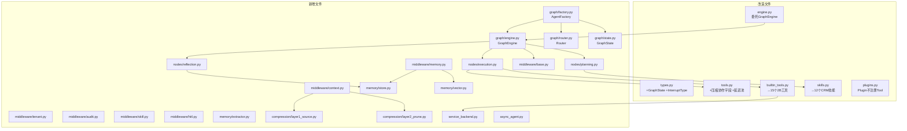

# DeepAgent 技术实现方案

> 基于 `2B-Agent-System-DeepAgent-完整设计方案.md` 产品设计，转化为可落地的技术实现方案。
> 现有代码基线：`product-specs/agent-system/src/` 14 个模块 ~3500 行。
> LLM 提供商：DeepSeek（OpenAI-Compatible API），已在 `llm_client.py` 中实现。

---

## 一、实现总览

### 1.1 从产品设计到技术实现的映射

| 产品设计章节 | 技术实现 | 新增/改造 | 预估工作量 |
|-------------|---------|----------|-----------|
| §3.3 图状态机编排引擎 | GraphEngine + Router + 3 Node | 新增 `graph_engine.py` | 高 |
| §3.4 中间件栈 | 6 个 Middleware | 新增 `middleware/` 目录 | 中 |
| §3.5 长期记忆系统 | memory-plugin 完整实现 | 新增 `memory/` 目录 | 高 |
| §3.6 子 Agent | 同步保留 + 异步新增 | 改造 `agent.py` + 新增 `async_agent.py` | 中 |
| §3.7 2B 行业适配 | TenantMW + AuditMW + ServiceBackend | 新增 `service_backend.py` | 中 |
| §3.8 深度反思引擎 | ReflectionNode 5 种策略 | 新增 `reflection.py` | 中 |
| §3.9 服务调用抽象 | ServiceBackend Protocol | 新增 `service_backend.py` | 低 |
| §3.10 Tool/Skill/Plugin 边界 | 重构注册机制 | 改造 `tools.py` `plugins.py` | 中 |
| §4 2B 业务 Skill 体系 | 8 个 CRM 业务技能 | 改造 `skills.py` | 中 |
| Tool/Skill 通用工具体系 | 压缩协作 + 延迟加载 + 中断 | 改造 `tools.py` `types.py` | 中 |
| 上下文压缩 | 四层压缩机制 | 新增 `compression.py` | 高 |

### 1.2 目标目录结构

```
product-specs/agent-system/src/
├── __init__.py                    # 模块导出（改造）
├── types.py                       # 核心类型定义（改造：新增 GraphState/InterruptType 等）
├── agent.py                       # LLMClient Protocol + AgentLoopEngine（保留，逐步迁移）
├── llm_client.py                  # DeepSeekClient（已完成）
│
├── graph/                         # 🔑 新增：图状态机编排引擎
│   ├── __init__.py
│   ├── engine.py                  # GraphEngine 主循环
│   ├── router.py                  # Router 路由决策
│   ├── state.py                   # GraphState 完整定义
│   └── factory.py                 # AgentFactory 8-Phase 初始化
│
├── nodes/                         # 🔑 新增：三个核心 Node
│   ├── __init__.py
│   ├── planning.py                # PlanningNode
│   ├── execution.py               # ExecutionNode（从 agent.py 提取）
│   └── reflection.py              # ReflectionNode（5 种反思策略）
│
├── middleware/                     # 🔑 新增：中间件栈
│   ├── __init__.py
│   ├── base.py                    # Middleware Protocol
│   ├── tenant.py                  # TenantMiddleware
│   ├── audit.py                   # AuditMiddleware
│   ├── context.py                 # ContextMiddleware（上下文压缩）
│   ├── memory.py                  # MemoryMiddleware（由 memory-plugin 提供）
│   ├── skill.py                   # SkillMiddleware
│   └── hitl.py                    # HITLMiddleware
│
├── memory/                        # 🔑 新增：长期记忆系统（memory-plugin 实现）
│   ├── __init__.py
│   ├── store.py                   # MemoryFS 文件系统范式存储
│   ├── vector.py                  # VectorIndex 向量索引
│   ├── extractor.py               # MemoryExtractor 8 类记忆提取
│   ├── recaller.py                # MemoryRecaller 四层召回
│   ├── forgetter.py               # MemoryForgetter 衰减遗忘
│   └── reflector.py               # MemoryReflector 反思修正
│
├── compression/                   # 🔑 新增：上下文压缩
│   ├── __init__.py
│   ├── layer1_source.py           # Layer 1 源头隔离
│   ├── layer2_prune.py            # Layer 2 轮次裁剪
│   ├── layer3_summary.py          # Layer 3 回复摘要
│   └── layer4_history.py          # Layer 4 历史构建
│
├── tools.py                       # Tool 统一接口 + ToolRegistry（改造：新增压缩协作字段）
├── builtin_tools.py               # 15 个 2B 业务工具（改造：替换开发者工具）
├── skills.py                      # Skill 体系（改造：替换为 CRM 业务技能）
├── plugins.py                     # Plugin 注册表（改造：新增 Plugin 不直接注册 Tool）
├── hooks.py                       # Hook 系统（保留）
├── mcp.py                         # MCP 集成（保留）
├── session.py                     # 会话持久化（保留，扩展为 CheckpointStore）
├── coordinator.py                 # Coordinator 模式（保留）
├── context.py                     # 旧上下文压缩（逐步迁移到 compression/）
├── state.py                       # 旧状态管理（逐步迁移到 graph/state.py）
├── service_backend.py             # 🔑 新增：服务调用抽象层
├── async_agent.py                 # 🔑 新增：异步子 Agent 管理
└── engine.py                      # QueryEngine（保留，作为 GraphEngine 的入口适配器）
```


---

## 二、Phase 1：核心引擎（图状态机 + Router + 三 Node）

### 2.1 GraphState 完整定义

文件：`src/graph/state.py`

```python
from __future__ import annotations
import uuid, time
from enum import Enum
from dataclasses import dataclass, field
from typing import Any

class AgentStatus(str, Enum):
    RUNNING = "running"
    PAUSED = "paused"           # HITL 暂停
    COMPLETED = "completed"
    FAILED = "failed"
    MAX_TURNS = "max_turns"     # 预算耗尽
    ABORTED = "aborted"         # 用户/超时取消

class StepStatus(str, Enum):
    PENDING = "pending"
    RUNNING = "running"
    COMPLETED = "completed"
    FAILED = "failed"
    SKIPPED = "skipped"

@dataclass
class TaskStep:
    description: str
    status: StepStatus = StepStatus.PENDING
    agent_type: str | None = None       # 子 Agent 类型
    tools: list[str] | None = None      # 限制工具
    result: str = ""
    error: str = ""
    llm_calls: int = 0

@dataclass
class TaskPlan:
    goal: str
    steps: list[TaskStep] = field(default_factory=list)
    created_at: float = field(default_factory=time.time)

@dataclass
class GraphState:
    """图状态机的完整状态 — 对应产品设计 §3.3.1"""
    # 身份与会话
    session_id: str = field(default_factory=lambda: f"sess_{uuid.uuid4().hex[:12]}")
    tenant_id: str = ""
    user_id: str = ""
    messages: list = field(default_factory=list)       # Message 列表

    # 任务规划
    plan: TaskPlan | None = None
    current_step_index: int = 0

    # 执行追踪
    current_node: str = "router"
    total_llm_calls: int = 0
    total_tool_calls: int = 0
    consecutive_errors: int = 0
    consecutive_same_tool: int = 0
    last_tool_name: str = ""
    replan_count: int = 0

    # 状态控制
    status: AgentStatus = AgentStatus.RUNNING
    pause_reason: str | None = None
    final_answer: str = ""

    # 上下文
    memory_context: str = ""            # MemoryMiddleware 注入
    system_prompt: str = ""
    file_list: list = field(default_factory=list)      # 虚拟文件 FileInfo
    language_name: str = "zh-CN"

    # 检查点
    checkpoint_version: int = 0

    @property
    def current_step(self) -> TaskStep | None:
        if self.plan and 0 <= self.current_step_index < len(self.plan.steps):
            return self.plan.steps[self.current_step_index]
        return None

    @property
    def all_steps_done(self) -> bool:
        if not self.plan:
            return False
        return all(s.status in (StepStatus.COMPLETED, StepStatus.SKIPPED) for s in self.plan.steps)


@dataclass
class AgentLimits:
    """执行限制 — 对应产品设计 §3.3.2 路由优先级"""
    MAX_TOTAL_LLM_CALLS: int = 200
    MAX_STEP_LLM_CALLS: int = 20
    MAX_CONSECUTIVE_ERRORS: int = 5
    MAX_CONSECUTIVE_SAME_TOOL: int = 4
    MAX_REPLAN_COUNT: int = 3
    HITL_TIMEOUT_SECONDS: int = 3600     # 1 小时
    BUDGET_WARNING_80: int = 160         # 80% 预算警告
    BUDGET_WARNING_95: int = 190         # 95% 预算警告
```

### 2.2 Router 路由决策

文件：`src/graph/router.py`

```python
class Router:
    """
    路由决策 — 对应产品设计 §3.3.2 的 7 级优先级表。
    根据 GraphState 决定下一个 Node，纯函数无副作用。
    """

    def __init__(self, limits: AgentLimits):
        self._limits = limits

    def next_node(self, state: GraphState) -> str | None:
        """返回下一个 Node 名称，None 表示终止"""
        L = self._limits

        # P1: 非 RUNNING 状态 → 终止
        if state.status != AgentStatus.RUNNING:
            return None

        # P2: 全局预算耗尽 → 终止
        if state.total_llm_calls >= L.MAX_TOTAL_LLM_CALLS:
            state.status = AgentStatus.MAX_TURNS
            return None

        # P3: stuck 检测 → ReflectionNode
        if (state.consecutive_errors >= L.MAX_CONSECUTIVE_ERRORS
                or state.consecutive_same_tool >= L.MAX_CONSECUTIVE_SAME_TOOL):
            return "reflection"

        # P4: 无计划 → PlanningNode
        if state.plan is None:
            return "planning"

        # P5: 所有步骤完成 → ReflectionNode（最终反思）
        if state.all_steps_done:
            return "reflection"

        # P6: 当前步骤失败 → ReflectionNode（失败分析）
        step = state.current_step
        if step and step.status == StepStatus.FAILED:
            return "reflection"

        # P7: 当前步骤待执行 → ExecutionNode
        if step and step.status in (StepStatus.PENDING, StepStatus.RUNNING):
            return "execution"

        # 兜底：推进到下一步
        state.current_step_index += 1
        if state.current_step_index < len(state.plan.steps):
            return "execution"

        return "reflection"

    def inject_budget_warning(self, state: GraphState) -> str | None:
        """预算警告注入 — 80%/95% 时在 system prompt 中追加提醒"""
        L = self._limits
        used = state.total_llm_calls
        if used >= L.BUDGET_WARNING_95:
            return "[URGENT] 预算即将耗尽（95%），请立即总结当前进展并结束。"
        if used >= L.BUDGET_WARNING_80:
            return "[WARNING] 已使用 80% 预算，请加快执行节奏。"
        return None
```

### 2.3 GraphEngine 主循环

文件：`src/graph/engine.py`

```python
class GraphEngine:
    """
    图状态机编排引擎 — 对应产品设计 §3.3.3 主循环。
    自研简化版状态机（不依赖 LangGraph），保留深度定制能力。
    """

    def __init__(
        self,
        nodes: dict[str, GraphNode],
        middleware_stack: list[Middleware],
        plugin_context: PluginContext,
        limits: AgentLimits,
        checkpoint_store: CheckpointStore | None = None,
    ):
        self._nodes = nodes
        self._middlewares = middleware_stack
        self._context = plugin_context
        self._router = Router(limits)
        self._limits = limits
        self._checkpoint = checkpoint_store

    async def run(self, state: GraphState) -> AsyncIterator[GraphState]:
        """
        主循环 — 洋葱模型中间件 + Router 路由 + Node 执行。
        每步 yield state 实现流式输出。
        """
        while True:
            # 路由决策
            node_name = self._router.next_node(state)
            if node_name is None:
                break

            node = self._nodes.get(node_name)
            if not node:
                state.status = AgentStatus.FAILED
                break

            state.current_node = node_name

            # 预算警告注入
            warning = self._router.inject_budget_warning(state)
            if warning:
                state.system_prompt += f"\n\n{warning}"

            # 中间件前处理（按注册顺序）
            for mw in self._middlewares:
                state = await mw.before_step(state, self._context)

            # Node 执行
            state = await node.execute(state, self._context)

            # 中间件后处理（逆序）
            for mw in reversed(self._middlewares):
                state = await mw.after_step(state, self._context)

            # 保存检查点
            if self._checkpoint:
                state.checkpoint_version += 1
                await self._checkpoint.save(state)

            # 流式输出
            yield state

            # HITL 暂停 → 退出循环，等待 resume
            if state.status == AgentStatus.PAUSED:
                break

        # 最终 yield
        yield state

    async def resume(self, session_id: str, decision: str, data: dict | None = None) -> AsyncIterator[GraphState]:
        """
        HITL 恢复 — 对应产品设计 §3.3.5。
        从检查点恢复状态，根据用户决策继续执行。
        """
        if not self._checkpoint:
            raise RuntimeError("CheckpointStore required for resume")

        state = await self._checkpoint.load(session_id)
        if not state:
            raise ValueError(f"Session {session_id} not found")

        if decision == "approve":
            state.status = AgentStatus.RUNNING
        elif decision == "reject":
            if state.current_step:
                state.current_step.status = StepStatus.SKIPPED
            state.status = AgentStatus.RUNNING
        elif decision == "abort":
            state.status = AgentStatus.ABORTED
            yield state
            return
        else:
            raise ValueError(f"Unknown decision: {decision}")

        async for s in self.run(state):
            yield s
```

### 2.4 PlanningNode

文件：`src/nodes/planning.py`

```python
class PlanningNode(GraphNode):
    """
    任务规划 — 对应产品设计 §3.3.4。
    判断复杂度 → 简单任务单步计划 / 复杂任务 LLM 多步规划。
    """

    PLANNING_PROMPT = """你是任务规划专家。分析用户请求，生成执行计划。

## 规则
1. 简单任务（单次查询/单次操作）→ 生成 1 步计划
2. 复杂任务（多步骤/多实体/需要分析）→ 生成 2-15 步计划
3. 每步必须包含: description（做什么）、agent_type（可选，子 Agent 类型）、tools（可选，限制工具）
4. 步骤之间有依赖关系时，按依赖顺序排列

## 可用的子 Agent 类型
- sales: 销售相关（查客户/商机/竞品）
- service: 客服相关（诊断问题/搜索方案）
- analytics: 数据分析（统计/趋势/异常检测）
- config: 平台配置（业务对象/字段/权限）
- data_ops: 数据管理（清理/批量更新/迁移）
- research: 外部调研（行业/企业/政策）
- general: 通用（无法归类时使用）

## 输出格式（严格 JSON）
{"goal": "...", "steps": [{"description": "...", "agent_type": "...", "tools": [...]}]}
"""

    async def execute(self, state: GraphState, context: PluginContext) -> GraphState:
        # 简单任务判断：消息少于 50 字且不含"分析""对比""批量"等关键词
        user_msg = self._get_last_user_message(state)
        if self._is_simple_task(user_msg):
            state.plan = TaskPlan(
                goal=user_msg,
                steps=[TaskStep(description=user_msg)]
            )
            return state

        # 复杂任务：调用 LLM 生成计划
        messages = [{"role": "user", "content": f"用户请求: {user_msg}"}]

        # 注入历史经验（从 SkillMiddleware 获取）
        if state.memory_context:
            messages[0]["content"] += f"\n\n历史经验参考:\n{state.memory_context}"

        response = await context.llm.call(
            system_prompt=self.PLANNING_PROMPT,
            messages=messages,
            model=context.llm.config.model if hasattr(context.llm, 'config') else "",
        )

        # 解析 LLM 返回的计划
        plan = self._parse_plan(response)
        if plan and len(plan.steps) <= 15:
            state.plan = plan
        else:
            # 解析失败或步骤过多 → 降级为单步
            state.plan = TaskPlan(goal=user_msg, steps=[TaskStep(description=user_msg)])

        state.total_llm_calls += 1
        return state

    def _is_simple_task(self, msg: str) -> bool:
        if len(msg) > 100:
            return False
        complex_keywords = ["分析", "对比", "批量", "迁移", "审计", "诊断", "配置向导", "报告", "调研"]
        return not any(kw in msg for kw in complex_keywords)

    def _parse_plan(self, response: dict) -> TaskPlan | None:
        """从 LLM 响应中解析 JSON 计划"""
        import json
        for block in response.get("content", []):
            if block.get("type") == "text":
                text = block["text"]
                # 尝试提取 JSON
                try:
                    # 可能被 markdown 包裹
                    if "```json" in text:
                        text = text.split("```json")[1].split("```")[0]
                    elif "```" in text:
                        text = text.split("```")[1].split("```")[0]
                    data = json.loads(text.strip())
                    steps = [TaskStep(
                        description=s["description"],
                        agent_type=s.get("agent_type"),
                        tools=s.get("tools"),
                    ) for s in data.get("steps", [])]
                    return TaskPlan(goal=data.get("goal", ""), steps=steps)
                except (json.JSONDecodeError, KeyError, IndexError):
                    continue
        return None
```

### 2.5 ExecutionNode

文件：`src/nodes/execution.py`

```python
class ExecutionNode(GraphNode):
    """
    步骤执行 — 对应产品设计 §3.3.4。
    内部 mini agent loop: LLM 调用 → 解析 → 工具执行 → 继续。
    从现有 AgentLoopEngine.run() 提取核心逻辑。
    """

    async def execute(self, state: GraphState, context: PluginContext) -> GraphState:
        step = state.current_step
        if not step:
            return state

        step.status = StepStatus.RUNNING

        # 构建工具列表（按步骤限制过滤）
        tools = self._resolve_tools(step, context)
        tool_schemas = [self._tool_to_schema(t) for t in tools]

        # 构建消息（system prompt + 历史 + 当前步骤指令）
        system_prompt = state.system_prompt
        if step.description:
            system_prompt += f"\n\n当前任务步骤: {step.description}"

        # Mini agent loop（步骤级）
        step_llm_calls = 0
        while step.status == StepStatus.RUNNING:
            # 步骤级预算检查
            if step_llm_calls >= context.limits.MAX_STEP_LLM_CALLS:
                step.status = StepStatus.FAILED
                step.error = "步骤 LLM 调用次数超限"
                break

            # 调用 LLM
            api_messages = self._build_api_messages(state)
            try:
                response = await context.llm.call(
                    system_prompt=system_prompt,
                    messages=api_messages,
                    tools=tool_schemas if tool_schemas else None,
                )
            except Exception as e:
                state.consecutive_errors += 1
                step.status = StepStatus.FAILED
                step.error = str(e)
                break

            state.total_llm_calls += 1
            step_llm_calls += 1

            # 解析响应
            assistant_msg = self._parse_response(response)
            state.messages.append(assistant_msg)

            # 提取 tool_use blocks
            tool_uses = [b for b in (assistant_msg.tool_use_blocks or []) if b]
            if not tool_uses:
                # 纯文本响应 → 步骤完成
                step.status = StepStatus.COMPLETED
                step.result = assistant_msg.content if isinstance(assistant_msg.content, str) else ""
                state.consecutive_errors = 0
                state.consecutive_same_tool = 0
                break

            # 执行工具
            for tu in tool_uses:
                # 中间件 before_tool_call
                tool_input = tu.input
                for mw in context.middlewares:
                    result = await mw.before_tool_call(tu.name, tool_input, state, context)
                    if result is None:
                        # 被拦截（HITL 暂停或权限拒绝）
                        if state.status == AgentStatus.PAUSED:
                            return state
                        tool_input = None
                        break
                    tool_input = result

                if tool_input is None:
                    # 工具被拒绝
                    tool_result = ToolResultBlock(
                        tool_use_id=tu.id,
                        content="操作被拒绝",
                        is_error=True,
                    )
                else:
                    # 执行工具
                    tool_result = await execute_tool_use(
                        ToolUseBlock(id=tu.id, name=tu.name, input=tool_input),
                        context.tool_use_context,
                        context.permission_context,
                        context.tool_registry,
                    )

                # 中间件 after_tool_call
                for mw in reversed(context.middlewares):
                    tool_result = await mw.after_tool_call(tu.name, tool_result, state, context)

                # 追踪
                state.total_tool_calls += 1
                self._update_tracking(state, tu.name, tool_result.is_error)

                # 构建 tool_result 消息
                state.messages.append(Message(
                    role=MessageRole.USER,
                    content=[{
                        "type": "tool_result",
                        "tool_use_id": tu.id,
                        "content": tool_result.content,
                    }],
                ))

            # 回调通知
            if context.callbacks and context.callbacks.on_step_progress:
                total = len(state.plan.steps) if state.plan else 1
                context.callbacks.on_step_progress(
                    state.current_step_index + 1, total, step.description
                )

        step.llm_calls = step_llm_calls
        return state

    def _update_tracking(self, state: GraphState, tool_name: str, is_error: bool):
        """更新执行追踪计数器"""
        if is_error:
            state.consecutive_errors += 1
        else:
            state.consecutive_errors = 0

        if tool_name == state.last_tool_name:
            state.consecutive_same_tool += 1
        else:
            state.consecutive_same_tool = 0
        state.last_tool_name = tool_name
```

### 2.6 ReflectionNode

文件：`src/nodes/reflection.py`

```python
class ReflectionNode(GraphNode):
    """
    反思决策 — 对应产品设计 §3.8。
    5 种触发类型，每种有独立的处理策略。
    """

    async def execute(self, state: GraphState, context: PluginContext) -> GraphState:
        trigger = self._detect_trigger(state)

        if trigger == "final":
            return await self._final_reflection(state, context)
        elif trigger == "step_failed":
            return await self._failure_analysis(state, context)
        elif trigger == "stuck":
            return await self._stuck_recovery(state, context)
        elif trigger == "user_correction":
            return await self._user_correction(state, context)
        else:
            # 兜底：标记完成
            state.status = AgentStatus.COMPLETED
            return state

    def _detect_trigger(self, state: GraphState) -> str:
        """判断反思触发类型"""
        if state.consecutive_errors >= 5 or state.consecutive_same_tool >= 4:
            return "stuck"
        if state.all_steps_done or state.total_llm_calls >= state._limits_ref.BUDGET_WARNING_95:
            return "final"
        if state.current_step and state.current_step.status == StepStatus.FAILED:
            return "step_failed"
        # 用户纠正检测
        last_msg = self._get_last_user_message(state)
        if last_msg and any(kw in last_msg for kw in ["不对", "错了", "改一下", "不是这个"]):
            return "user_correction"
        return "final"

    async def _final_reflection(self, state: GraphState, context: PluginContext) -> GraphState:
        """最终反思：生成总结 + 提取记忆 + 技能改进"""
        # 提取记忆（如果 memory-plugin 可用）
        if context.memory:
            await self._extract_and_commit_memories(state, context)

        # 生成最终回答
        state.final_answer = self._compile_final_answer(state)
        state.status = AgentStatus.COMPLETED
        return state

    async def _failure_analysis(self, state: GraphState, context: PluginContext) -> GraphState:
        """
        失败分析 — 调用 LLM 分析根因，返回恢复策略。
        策略: retry / skip / replan / escalate / abort
        """
        step = state.current_step
        if not step:
            state.status = AgentStatus.FAILED
            return state

        FAILURE_PROMPT = f"""分析以下步骤失败的原因，返回恢复策略。

步骤描述: {step.description}
错误信息: {step.error}
已重试次数: {step.llm_calls}
剩余预算: {state._limits_ref.MAX_TOTAL_LLM_CALLS - state.total_llm_calls}

返回 JSON: {{"strategy": "retry|skip|replan|escalate|abort", "reason": "..."}}
"""
        response = await context.llm.call(
            system_prompt="你是错误分析专家。",
            messages=[{"role": "user", "content": FAILURE_PROMPT}],
        )
        state.total_llm_calls += 1

        strategy = self._parse_strategy(response)

        if strategy == "retry":
            step.status = StepStatus.PENDING
            step.error = ""
        elif strategy == "skip":
            step.status = StepStatus.SKIPPED
            state.current_step_index += 1
        elif strategy == "replan":
            if state.replan_count < state._limits_ref.MAX_REPLAN_COUNT:
                state.plan = None  # 清空计划，Router → PlanningNode
                state.replan_count += 1
            else:
                state.status = AgentStatus.FAILED
        elif strategy == "escalate":
            state.status = AgentStatus.PAUSED
            state.pause_reason = f"步骤失败需要人工介入: {step.error}"
        else:  # abort
            state.status = AgentStatus.FAILED

        return state

    async def _stuck_recovery(self, state: GraphState, context: PluginContext) -> GraphState:
        """Stuck 自救 — 注入自救 prompt，不调用 LLM（节省预算）"""
        recovery_prompt = (
            "[STUCK RECOVERY] 你似乎陷入了循环。请:\n"
            "1. 停止重复相同的操作\n"
            "2. 重新审视原始目标\n"
            "3. 尝试不同的方法\n"
            "4. 如果无法继续，使用 ask_user 工具向用户求助"
        )
        state.messages.append(Message(role=MessageRole.SYSTEM, content=recovery_prompt))
        state.consecutive_errors = 0
        state.consecutive_same_tool = 0
        return state

    async def _extract_and_commit_memories(self, state: GraphState, context: PluginContext):
        """提取 8 类记忆并写入 memory-plugin"""
        EXTRACT_PROMPT = """从以下对话中提取值得记住的业务知识。

分类:
- cases: 问题解决案例
- patterns: 业务模式/规律
- entities: 涉及的客户/商机/人物信息
- events: 重要事件
- tools: 工具使用技巧
- skills: 技能执行经验

返回 JSON 数组: [{"category": "...", "content": "...", "importance": "high|medium|low"}]
"""
        # 取最近 10 条消息作为上下文
        recent = state.messages[-10:] if len(state.messages) > 10 else state.messages
        msg_text = "\n".join(
            f"{m.role}: {m.content}" for m in recent if isinstance(m.content, str)
        )

        response = await context.llm.call(
            system_prompt=EXTRACT_PROMPT,
            messages=[{"role": "user", "content": msg_text}],
        )
        state.total_llm_calls += 1

        memories = self._parse_memories(response)
        for mem in memories:
            await context.memory.commit(MemoryEntry(
                category=mem["category"],
                content=mem["content"],
                importance=mem.get("importance", "medium"),
            ))
```


### 2.7 AgentFactory 8-Phase 初始化

文件：`src/graph/factory.py`

```python
class AgentFactory:
    """
    Agent 工厂 — 对应产品设计 §3.7 + Agent-Core-详细设计 〇.一节。
    创建和配置 Agent 实例的唯一入口。
    """

    @staticmethod
    async def create(config: AgentConfig) -> GraphEngine:
        # Phase 1: 校验配置
        assert config.tenant_id, "tenant_id required"
        assert config.user_id, "user_id required"

        # Phase 2: 初始化 Plugin
        llm_plugin = DeepSeekClient(
            api_key=config.llm_api_key,
            default_model=config.llm_model or "deepseek-chat",
        )
        memory_plugin = None
        if config.memory_enabled:
            memory_plugin = MemoryPlugin(config.memory_config)

        # Phase 3: 注册全部 Tool（统一由 ToolRegistry 管理）
        tool_registry = ToolRegistry()
        register_builtin_tools(tool_registry, config)
        # 依赖 Plugin 的 Tool 通过 is_enabled() 检查
        # Plugin 不直接注册 Tool

        # Phase 4: 初始化外部数据 Plugin
        search_plugin = SearchPlugin(config.search_config) if config.search_config else None
        company_plugin = CompanyDataPlugin(config.company_config) if config.company_config else None
        financial_plugin = FinancialDataPlugin(config.financial_config) if config.financial_config else None

        # Phase 5: 注册技能
        skill_registry = SkillRegistry()
        register_crm_builtin_skills(skill_registry)
        if config.custom_skill_dirs:
            for d in config.custom_skill_dirs:
                skill_registry.load_from_directory(d)
        if config.db_skills:
            skill_registry.load_from_db(config.tenant_id, config.db_skills)

        # Phase 6: 装配中间件栈（洋葱模型，顺序重要）
        middlewares = []
        middlewares.append(TenantMiddleware(config.tenant_id))
        if config.enable_audit:
            middlewares.append(AuditMiddleware())
        middlewares.append(ContextMiddleware())
        if memory_plugin:
            middlewares.append(MemoryMiddleware(memory_plugin))
        middlewares.append(SkillMiddleware(skill_registry))
        if config.enable_hitl:
            middlewares.append(HITLMiddleware(config.hitl_rules))

        # Phase 7: 构建 PluginContext
        plugin_context = PluginContext(
            llm=llm_plugin,
            memory=memory_plugin,
            search=search_plugin,
            company=company_plugin,
            financial=financial_plugin,
            tool_registry=tool_registry,
            skill_registry=skill_registry,
            middlewares=middlewares,
            limits=AgentLimits(
                MAX_TOTAL_LLM_CALLS=config.max_total_llm_calls,
                MAX_STEP_LLM_CALLS=config.max_step_llm_calls,
            ),
            tenant_id=config.tenant_id,
            user_id=config.user_id,
            callbacks=config.callbacks,
        )

        # Phase 7: 构建 GraphEngine
        nodes = {
            "planning": PlanningNode(),
            "execution": ExecutionNode(),
            "reflection": ReflectionNode(),
        }
        checkpoint = CheckpointStore(config.tenant_id, config.session_id)

        engine = GraphEngine(
            nodes=nodes,
            middleware_stack=middlewares,
            plugin_context=plugin_context,
            limits=plugin_context.limits,
            checkpoint_store=checkpoint,
        )

        # Phase 8: 组装 system prompt
        system_prompt = build_system_prompt(
            tools=tool_registry.all_tools,
            skills=skill_registry.all_skills,
            deferred_hints=tool_registry.get_deferred_hints(),
            tenant_id=config.tenant_id,
        )

        return engine, system_prompt
```

### 2.8 CheckpointStore

文件：扩展 `src/session.py`

```python
class CheckpointStore:
    """
    检查点存储 — 支持 HITL 暂停/恢复。
    默认 JSON 文件，可替换为 Redis/PostgreSQL。
    """

    def __init__(self, tenant_id: str, session_id: str | None = None):
        self._tenant_id = tenant_id
        self._base_dir = Path(f".checkpoints/{tenant_id}")
        self._base_dir.mkdir(parents=True, exist_ok=True)

    async def save(self, state: GraphState) -> None:
        path = self._base_dir / f"{state.session_id}.json"
        data = self._serialize(state)
        path.write_text(json.dumps(data, ensure_ascii=False, indent=2))

    async def load(self, session_id: str) -> GraphState | None:
        path = self._base_dir / f"{session_id}.json"
        if not path.exists():
            return None
        data = json.loads(path.read_text())
        return self._deserialize(data)

    def _serialize(self, state: GraphState) -> dict:
        """GraphState → JSON dict"""
        return {
            "session_id": state.session_id,
            "tenant_id": state.tenant_id,
            "user_id": state.user_id,
            "status": state.status.value,
            "plan": self._serialize_plan(state.plan) if state.plan else None,
            "current_step_index": state.current_step_index,
            "total_llm_calls": state.total_llm_calls,
            "total_tool_calls": state.total_tool_calls,
            "pause_reason": state.pause_reason,
            "checkpoint_version": state.checkpoint_version,
            # messages 序列化（大对象，生产环境应存 DB）
            "message_count": len(state.messages),
        }
```


---

## 三、Phase 2：中间件栈 + ServiceBackend

### 3.1 Middleware Protocol

文件：`src/middleware/base.py`

```python
from typing import Protocol, Any

class Middleware(Protocol):
    """
    中间件接口 — 对应产品设计 §3.4。
    洋葱模型：before_step 按注册顺序，after_step 逆序。
    """
    name: str

    async def before_step(self, state: GraphState, context: PluginContext) -> GraphState:
        return state

    async def after_step(self, state: GraphState, context: PluginContext) -> GraphState:
        return state

    async def before_tool_call(
        self, tool_name: str, input_data: dict, state: GraphState, context: PluginContext
    ) -> dict | None:
        """返回 None 表示拒绝执行"""
        return input_data

    async def after_tool_call(
        self, tool_name: str, result: ToolResultBlock, state: GraphState, context: PluginContext
    ) -> ToolResultBlock:
        return result
```

### 3.2 TenantMiddleware

文件：`src/middleware/tenant.py`

```python
class TenantMiddleware:
    """租户隔离 — 对应产品设计 §3.7.1 + Agent-Core 权限第二层"""
    name = "tenant"

    def __init__(self, tenant_id: str):
        self._tenant_id = tenant_id

    async def before_tool_call(self, tool_name, input_data, state, context):
        # 系统数据类工具：自动注入 tenant_id
        if tool_name in ("query_schema", "query_data", "analyze_data", "query_permission", "modify_data"):
            input_data["_tenant_id"] = self._tenant_id

        # 记忆类工具：限定路径前缀
        if tool_name in ("search_memories", "save_memory"):
            input_data["_memory_prefix"] = f"{self._tenant_id}/"

        # 外部 API：校验连接归属
        if tool_name == "api_call":
            connection = input_data.get("connection_name")
            tenant_connections = await self._load_tenant_connections()
            if connection not in tenant_connections:
                return None  # 拒绝

        return input_data
```

### 3.3 HITLMiddleware

文件：`src/middleware/hitl.py`

```python
class HITLMiddleware:
    """
    人工审批 — 对应产品设计 §3.3.5 + §6 中断体系。
    融合 [CC] cancel/block + [NA] 澄清/确认/执行中断。
    """
    name = "hitl"

    def __init__(self, rules: list[HITLRule] | None = None):
        self._rules = rules or []

    async def before_tool_call(self, tool_name, input_data, state, context):
        tool = context.tool_registry.find_by_name(tool_name)
        if not tool:
            return input_data

        # 规则 1：内置规则 — is_destructive
        if tool.is_destructive(input_data):
            return await self._trigger_approval(state, context, tool_name, input_data,
                reason=f"破坏性操作: {await tool.description(input_data)}")

        # 规则 2：自定义规则
        for rule in self._rules:
            if rule.matches(tool_name, input_data):
                return await self._trigger_approval(state, context, tool_name, input_data,
                    reason=rule.message)

        # 规则 3：批量操作阈值
        if tool_name == "query_data" and input_data.get("action") in ("update", "delete"):
            count = await self._estimate_affected_count(input_data, context)
            if count and count > 50:
                return await self._trigger_approval(state, context, tool_name, input_data,
                    reason=f"批量操作将影响 {count} 条记录")

        return input_data

    async def _trigger_approval(self, state, context, tool_name, input_data, reason):
        """触发 CONFIRM 中断"""
        state.status = AgentStatus.PAUSED
        state.pause_reason = reason
        # 通知前端
        if context.callbacks and context.callbacks.on_approval_request:
            await context.callbacks.on_approval_request(reason, {
                "tool_name": tool_name,
                "input_data": input_data,
            })
        return None  # 阻止工具执行
```

### 3.4 ContextMiddleware（上下文压缩）

文件：`src/middleware/context.py`

```python
class ContextMiddleware:
    """
    上下文压缩 — 对应 CRM-Agent上下文压缩详细设计方案.md 四层机制。
    在 before_step 中执行 Layer 2（轮次裁剪），
    在 after_tool_call 中执行 Layer 1（源头隔离）。
    """
    name = "context"

    async def before_step(self, state, context):
        """Layer 2: 当前轮次工具结果裁剪（ToolMessage >= 5 时触发）"""
        from ..compression.layer2_prune import should_run_layer2, run_layer2
        if should_run_layer2(state.messages):
            state.messages = run_layer2(state.messages, context.tool_registry)
        return state

    async def after_tool_call(self, tool_name, result, state, context):
        """Layer 1: 源头隔离（每次工具执行后）"""
        from ..compression.layer1_source import process_tool_result
        tool = context.tool_registry.find_by_name(tool_name)
        if tool:
            original, compressed = await process_tool_result(tool, result, state)
            # 替换 result.content 为压缩后的文本
            result = ToolResultBlock(
                tool_use_id=result.tool_use_id,
                content=compressed,
                is_error=result.is_error,
            )
        return result
```

### 3.5 ServiceBackend 抽象层

文件：`src/service_backend.py`

```python
from typing import Protocol

class ServiceBackend(Protocol):
    """
    服务调用抽象 — 对应产品设计 §3.9。
    所有业务操作通过此接口路由到对应微服务。
    """
    async def query_metadata(self, path: str, params: dict) -> dict: ...
    async def query_data(self, entity: str, filters: dict, **kw) -> dict: ...
    async def mutate_data(self, entity: str, action: str, data: dict) -> dict: ...
    async def aggregate_data(self, entity: str, metrics: list, **kw) -> dict: ...
    async def query_permission(self, query_type: str, **kw) -> dict: ...
    async def call_external_api(self, connection: str, endpoint: str, **kw) -> dict: ...


class DirectServiceBackend:
    """直连微服务后端"""
    def __init__(self, service_registry: dict[str, str]):
        self._services = service_registry  # {"metadata": "http://...", "entity": "http://..."}
        self._http = None  # aiohttp.ClientSession

    async def query_data(self, entity, filters, **kw):
        url = f"{self._services['entity']}/api/v1/data/{entity}/query"
        async with self._http.post(url, json={"filters": filters, **kw}) as resp:
            return await resp.json()

    async def mutate_data(self, entity, action, data):
        url = f"{self._services['entity']}/api/v1/data/{entity}/{action}"
        async with self._http.post(url, json=data) as resp:
            return await resp.json()

    # ... 其他方法类似


class MockServiceBackend:
    """Mock 后端 — 用于测试"""
    def __init__(self):
        self._responses: dict[str, Any] = {}

    def set_response(self, method: str, response: Any):
        self._responses[method] = response

    async def query_data(self, entity, filters, **kw):
        return self._responses.get("query_data", {"data": {"records": [], "total": 0}})
```


---

## 四、Phase 3：2B 业务工具 + 上下文压缩

### 4.1 15 个内置工具注册

文件：改造 `src/builtin_tools.py`

```python
def register_builtin_tools(registry: ToolRegistry, config: AgentConfig):
    """注册全部 15 个 2B 业务工具 — 对应产品设计 §3.7.2"""

    backend = config.service_backend or MockServiceBackend()

    # ── 系统数据类（4 个，始终启用）──
    registry.register(QuerySchemaTool(backend))
    registry.register(QueryDataTool(backend))
    registry.register(AnalyzeDataTool(backend))
    registry.register(QueryPermissionTool(backend))

    # ── 外部信息类（3 个，依赖 Plugin，延迟加载）──
    registry.register(WebSearchTool())        # should_defer=True, is_enabled=context.search is not None
    registry.register(CompanyInfoTool())      # should_defer=True
    registry.register(FinancialReportTool())  # should_defer=True

    # ── 外部服务类（2 个，延迟加载）──
    registry.register(ApiCallTool(backend))   # should_defer=True
    registry.register(McpToolProxy())         # should_defer=True

    # ── 用户交互（1 个）──
    registry.register(AskUserTool())

    # ── 记忆类（2 个，依赖 memory-plugin）──
    registry.register(SearchMemoriesTool())   # is_enabled=context.memory is not None
    registry.register(SaveMemoryTool())

    # ── 编排类（2 个，仅主 Agent）──
    registry.register(DelegateTaskTool())
    registry.register(StartAsyncTaskTool())

    # ── 通知类（1 个，依赖 notification-plugin，延迟加载）──
    registry.register(SendNotificationTool()) # should_defer=True
```

### 4.2 QueryDataTool 实现示例（含压缩协作字段）

```python
class QueryDataTool(Tool):
    """
    智能查询业务数据 — 对应产品设计 §3.7.2 query_data。
    内部自动查 schema → 理解字段 → 构建过滤 → 执行查询。
    """

    def __init__(self, backend: ServiceBackend):
        self._backend = backend

    @property
    def name(self): return "query_data"

    def input_schema(self):
        return {
            "type": "object",
            "properties": {
                "action": {"type": "string", "enum": ["query", "get", "count"],
                           "description": "操作类型"},
                "entity_api_key": {"type": "string", "description": "业务对象 api_key"},
                "record_id": {"type": "string", "description": "记录 ID（get 时必填）"},
                "filters": {"type": "object", "description": "过滤条件 {字段: 值}"},
                "fields": {"type": "array", "items": {"type": "string"}},
                "page": {"type": "integer", "default": 1},
                "page_size": {"type": "integer", "default": 20, "maximum": 100},
                "order_by": {"type": "string"},
            },
            "required": ["action", "entity_api_key"]
        }

    async def call(self, input_data, context, on_progress=None):
        action = input_data["action"]
        entity = input_data["entity_api_key"]
        try:
            if action == "query":
                result = await self._backend.query_data(
                    entity, input_data.get("filters", {}),
                    fields=input_data.get("fields"),
                    page=input_data.get("page", 1),
                    page_size=input_data.get("page_size", 20),
                    order_by=input_data.get("order_by"),
                )
                records = result.get("data", {}).get("records", [])
                total = result.get("data", {}).get("total", 0)
                return ToolResult(
                    content=json.dumps({"total": total, "records": records}, ensure_ascii=False),
                    metadata={"action": action, "entity": entity, "total": total},
                )
            elif action == "count":
                result = await self._backend.query_data(entity, input_data.get("filters", {}))
                count = result.get("data", {}).get("total", 0)
                return ToolResult(content=f"{entity} 符合条件的记录数: {count}")
            elif action == "get":
                record_id = input_data.get("record_id")
                result = await self._backend.query_data(entity, {"id": record_id})
                return ToolResult(content=json.dumps(result.get("data", {}), ensure_ascii=False))
        except Exception as e:
            return ToolResult(content=f"查询失败: {e}", is_error=True)

    async def description(self, input_data):
        action = input_data.get("action", "query")
        entity = input_data.get("entity_api_key", "")
        return f"{'查询' if action == 'query' else '获取' if action == 'get' else '统计'} {entity}"

    # ── 压缩协作字段 [NEW] ──
    @property
    def summary_threshold(self): return 300      # 查询类阈值低
    @property
    def summary_max_words(self): return 100
    @property
    def code_extractable(self): return True      # JSON 列表可代码提取
    @property
    def render_type(self): return None           # 按实体动态决定

    # ── 注册与发现 ──
    @property
    def tags(self): return ["read", "crm", "data"]
    def is_read_only(self, input_data): return True
    def is_destructive(self, input_data): return False
    @property
    def max_result_size_chars(self): return 50_000

    def prompt(self):
        return (
            "查询 aPaaS 平台的业务数据。\n"
            "- action: query=列表查询, get=单条详情, count=计数\n"
            "- entity_api_key: 业务对象标识（如 account, opportunity, lead）\n"
            "- 查询前建议先用 query_schema 了解实体有哪些字段"
        )
```

### 4.3 上下文压缩 Layer 1 实现

文件：`src/compression/layer1_source.py`

```python
async def process_tool_result(tool: Tool, result: ToolResultBlock, state) -> tuple[str, str]:
    """
    Layer 1 源头隔离 — 对应上下文压缩方案 §二。
    返回 (original_text, context_text)。
    """
    original = result.content
    threshold = tool.summary_threshold

    # 短结果不摘要
    if len(original) <= threshold:
        return original, original

    # 第一层：代码格式化提取（零 LLM 成本）
    if tool.code_extractable:
        extracted = try_code_extract(tool.name, original)
        if extracted:
            _save_virtual_file(state, tool.name, original, extracted)
            return original, extracted

    # 第二层：LLM 摘要
    max_words = tool.summary_max_words
    # 使用辅助模型（便宜快速）
    summary = await _llm_summarize(original, max_words, state.language_name)
    _save_virtual_file(state, tool.name, original, summary)
    return original, summary


def try_code_extract(tool_name: str, content: str) -> str | None:
    """零 LLM 成本的代码格式化提取"""
    import json
    # JSON 列表提取
    stripped = content.strip()
    if stripped.startswith("[") or stripped.startswith("{"):
        try:
            data = json.loads(stripped)
            if isinstance(data, dict) and "records" in data:
                records = data["records"]
                total = data.get("total", len(records))
                names = [r.get("name") or r.get("label") or "" for r in records[:5]]
                names_str = ", ".join(n for n in names if n)
                if total > 5:
                    names_str += f"...等{total}条"
                return f"查询返回{total}条记录: {names_str}"
            if isinstance(data, list):
                count = len(data)
                names = [item.get("name") or item.get("label") or "" for item in data[:5]]
                names_str = ", ".join(n for n in names if n)
                return f"返回{count}条: {names_str}"
        except json.JSONDecodeError:
            pass
    return None
```

### 4.4 上下文压缩 Layer 2 实现

文件：`src/compression/layer2_prune.py`

```python
import hashlib

def should_run_layer2(messages: list) -> bool:
    """Layer 2 触发条件：ToolMessage >= 5 且总字符 > 3000"""
    tool_msgs = [m for m in messages if _is_tool_message(m)]
    if len(tool_msgs) < 5:
        return False
    total = sum(len(_get_content(m)) for m in tool_msgs)
    return total > 3000


def run_layer2(messages: list, tool_registry) -> list:
    """
    Layer 2 三遍裁剪 — 对应上下文压缩方案 §三。
    Pass 1: MD5 去重
    Pass 2: 保护区外旧 ToolMessage 信息摘要替换
    Pass 3: tool_call 参数截断
    """
    messages = _pass1_dedup(messages)
    messages = _pass2_summarize(messages, tool_registry)
    messages = _pass3_truncate_args(messages)
    return messages


def _pass1_dedup(messages: list) -> list:
    """MD5 去重 — 从末尾向前遍历，相同内容只保留最新"""
    seen: dict[str, int] = {}
    result = list(messages)
    for i in range(len(result) - 1, -1, -1):
        if not _is_tool_message(result[i]):
            continue
        content = _get_content(result[i])
        if len(content) < 100:
            continue
        h = hashlib.md5(content.encode()).hexdigest()[:12]
        if h in seen:
            result[i] = _replace_content(result[i], "[重复结果 — 与最近一次相同查询结果一致]")
        else:
            seen[h] = i
    return result


def _pass2_summarize(messages: list, tool_registry) -> list:
    """保护区外的旧 ToolMessage 用零 LLM 成本规则摘要替换"""
    # 保护区：从末尾向前累积 ~20K tokens（约 80K 字符）
    PROTECTION_CHARS = 80_000
    total = 0
    protection_boundary = len(messages)
    for i in range(len(messages) - 1, -1, -1):
        total += len(_get_content(messages[i]))
        if total > PROTECTION_CHARS:
            protection_boundary = i
            break

    result = list(messages)
    for i in range(protection_boundary):
        if not _is_tool_message(result[i]):
            continue
        content = _get_content(result[i])
        if len(content) <= 200:
            continue
        # 用工具专用摘要模板替换
        tool_name = _extract_tool_name(result[i])
        tool = tool_registry.find_by_name(tool_name) if tool_name else None
        if tool:
            summary = _summarize_crm_tool_result(tool, {}, content)
            result[i] = _replace_content(result[i], summary)
    return result
```


---

## 五、Phase 4：长期记忆系统

### 5.1 MemoryFS 存储

文件：`src/memory/store.py`

```python
class MemoryFS:
    """
    文件系统范式记忆存储 — 对应产品设计 §3.5.1。
    L0/L1/L2 三层模型，按 OpenViking 范式组织。
    """

    def __init__(self, base_dir: str, tenant_id: str):
        self._base = Path(base_dir) / tenant_id
        self._base.mkdir(parents=True, exist_ok=True)

    async def write(self, category: str, name: str, content: str, importance: str = "medium"):
        """写入记忆 + 自动生成 L0/L1 摘要"""
        dir_path = self._base / "user" / "memories" / category
        dir_path.mkdir(parents=True, exist_ok=True)

        # L2: 完整内容
        (dir_path / f"{name}.md").write_text(content, encoding="utf-8")

        # L1: 概览（前 500 字符）
        overview = content[:500] + ("..." if len(content) > 500 else "")
        (dir_path / ".overview.md").write_text(overview, encoding="utf-8")

        # L0: 摘要（一行）
        abstract = content[:100].replace("\n", " ")
        (dir_path / ".abstract.md").write_text(abstract, encoding="utf-8")

        # 元数据
        meta = {
            "name": name, "category": category, "importance": importance,
            "created_at": time.time(), "access_count": 0, "last_accessed": time.time(),
        }
        (dir_path / f"{name}.meta.json").write_text(json.dumps(meta), encoding="utf-8")

    async def read(self, path: str, layer: str = "L1") -> str:
        """按层级读取"""
        full_path = self._base / path
        if layer == "L0":
            abstract = full_path.parent / ".abstract.md"
            return abstract.read_text() if abstract.exists() else ""
        elif layer == "L1":
            overview = full_path.parent / ".overview.md"
            return overview.read_text() if overview.exists() else ""
        else:
            return full_path.read_text() if full_path.exists() else ""

    async def search(self, query: str, category: str | None = None, max_results: int = 5) -> list[dict]:
        """关键词搜索（向量搜索由 VectorIndex 提供）"""
        results = []
        search_dir = self._base / "user" / "memories"
        if category:
            search_dir = search_dir / category

        for meta_file in search_dir.rglob("*.meta.json"):
            meta = json.loads(meta_file.read_text())
            content_file = meta_file.with_suffix("").with_suffix(".md")
            if content_file.exists():
                content = content_file.read_text()
                # 简单关键词匹配（生产环境用向量搜索）
                if query.lower() in content.lower():
                    results.append({**meta, "content": content[:200], "path": str(content_file)})
                    if len(results) >= max_results:
                        break
        return results
```

### 5.2 MemoryMiddleware

文件：`src/middleware/memory.py`

```python
class MemoryMiddleware:
    """
    记忆中间件 — 对应产品设计 §3.5.2 四层召回。
    会话开始注入画像，每轮自动召回。
    """
    name = "memory"

    def __init__(self, memory_plugin):
        self._memory = memory_plugin
        self._profile_injected = False

    async def before_step(self, state, context):
        # Layer 1: 画像注入（首次）
        if not self._profile_injected:
            profile = await self._memory.recall("user profile", categories=["profile"], max_results=1)
            if profile:
                state.memory_context = f"[用户画像] {profile[0].content}"
            self._profile_injected = True

        # Layer 2: 自动召回（每轮）
        last_msg = self._get_last_user_message(state)
        if last_msg and not self._is_greeting(last_msg):
            recalled = await self._memory.recall(last_msg, max_results=3)
            if recalled:
                context_parts = [f"- {r.content[:200]}" for r in recalled]
                state.memory_context += "\n[相关记忆]\n" + "\n".join(context_parts)

        return state
```

---

## 六、Phase 5：异步子 Agent

### 6.1 AsyncSubAgentManager

文件：`src/async_agent.py`

```python
class AsyncSubAgentManager:
    """
    异步子 Agent 管理 — 对应产品设计 §3.6.4。
    fire-and-forget 模式，后台执行，主 Agent 不阻塞。
    """

    def __init__(self):
        self._tasks: dict[str, AsyncTask] = {}

    async def start_task(self, task_id: str, config: AgentConfig, prompt: str) -> str:
        """启动异步任务，立即返回 task_id"""
        task = AsyncTask(task_id=task_id, status="running", prompt=prompt)
        self._tasks[task_id] = task

        # 后台执行（asyncio.create_task）
        import asyncio
        asyncio.create_task(self._run_task(task, config))
        return task_id

    async def check_task(self, task_id: str) -> dict:
        task = self._tasks.get(task_id)
        if not task:
            return {"error": f"Task {task_id} not found"}
        return {"task_id": task_id, "status": task.status, "result": task.result}

    async def cancel_task(self, task_id: str) -> bool:
        task = self._tasks.get(task_id)
        if task and task.status == "running":
            task.status = "cancelled"
            return True
        return False

    async def _run_task(self, task: AsyncTask, config: AgentConfig):
        try:
            engine, system_prompt = await AgentFactory.create(config)
            state = GraphState(
                tenant_id=config.tenant_id,
                user_id=config.user_id,
                system_prompt=system_prompt,
                messages=[Message(role=MessageRole.USER, content=task.prompt)],
            )
            async for s in engine.run(state):
                if task.status == "cancelled":
                    break
            task.status = "completed"
            task.result = s.final_answer
        except Exception as e:
            task.status = "failed"
            task.error = str(e)


@dataclass
class AsyncTask:
    task_id: str
    status: str = "pending"    # pending/running/completed/failed/cancelled
    prompt: str = ""
    result: str = ""
    error: str = ""
    created_at: float = field(default_factory=time.time)
```

---

## 七、Phase 6：CRM 业务技能

### 7.1 注册 CRM 内置技能

文件：改造 `src/skills.py`

```python
def register_crm_builtin_skills(registry: SkillRegistry) -> None:
    """注册 12 个 CRM 业务技能 — 对应产品设计 §4.2 + Tool/Skill 体系设计 §5.3"""

    # 1. verify_config — 元数据配置校验
    registry.register(SkillDefinition(
        name="verify_config",
        description="校验元数据配置的正确性与一致性",
        aliases=["verify", "check_config"],
        when_to_use="配置变更后自动触发，或用户要求校验配置",
        allowed_tools=["query_schema", "query_data", "search_memories"],
        context="inline",  # 轻量级，inline 注入
        get_prompt=verify_config_prompt,
    ))

    # 2. diagnose — 业务问题诊断
    registry.register(SkillDefinition(
        name="diagnose",
        description="系统化诊断业务数据异常或配置问题",
        aliases=["debug", "troubleshoot"],
        when_to_use="用户报告问题、数据异常、功能不正常时",
        allowed_tools=["query_schema", "query_data", "query_permission", "search_memories"],
        context="fork",
        max_llm_calls=15,
        get_prompt=diagnose_prompt,
    ))

    # 3. config_entity — 业务对象配置向导
    registry.register(SkillDefinition(
        name="config_entity",
        description="引导式业务对象创建或修改向导",
        aliases=["create_entity", "setup"],
        when_to_use="用户要创建新业务对象、添加字段、配置关联关系时",
        allowed_tools=["query_schema", "query_data", "ask_user"],
        context="fork",
        max_llm_calls=20,
        get_prompt=config_entity_prompt,
    ))

    # 4. batch_data — 批量数据操作
    registry.register(SkillDefinition(
        name="batch_data",
        description="批量操作业务数据（导入/更新/清理）",
        aliases=["batch", "bulk"],
        when_to_use="用户要批量处理数据时",
        allowed_tools=["query_data", "analyze_data", "ask_user"],
        context="fork",
        get_prompt=batch_data_prompt,
    ))

    # 5. data_analysis — 业务数据分析
    registry.register(SkillDefinition(
        name="data_analysis",
        description="业务数据分析与洞察",
        aliases=["analyze", "report"],
        when_to_use="用户要分析数据、生成报告、查看趋势时",
        allowed_tools=["query_schema", "query_data", "analyze_data", "search_memories"],
        context="fork",
        get_prompt=data_analysis_prompt,
    ))

    # 6. migration — 数据迁移
    registry.register(SkillDefinition(
        name="migration",
        description="数据迁移与映射转换",
        when_to_use="数据迁移、系统切换、数据导入时",
        allowed_tools=["query_schema", "query_data", "ask_user"],
        context="fork",
        max_llm_calls=20,
        get_prompt=migration_prompt,
    ))

    # 7. permission_audit — 权限审计
    registry.register(SkillDefinition(
        name="permission_audit",
        description="权限配置审计与优化建议",
        when_to_use="权限相关问题、安全审计、权限优化时",
        allowed_tools=["query_permission", "query_data", "query_schema", "search_memories"],
        context="fork",
        get_prompt=permission_audit_prompt,
    ))

    # 8. skillify — 操作转技能
    registry.register(SkillDefinition(
        name="skillify",
        description="将业务操作流程转化为可复用技能",
        aliases=["create_skill"],
        when_to_use="用户要保存操作流程为可复用模板时",
        context="fork",
        get_prompt=skillify_prompt,
    ))

    # 9-12: CRM 销售场景技能
    registry.register(SkillDefinition(
        name="competitive_analysis", description="竞品分析",
        when_to_use="竞品调研、竞争态势分析时",
        allowed_tools=["web_search", "company_info", "financial_report", "query_data"],
        context="fork", get_prompt=competitive_analysis_prompt,
    ))
    registry.register(SkillDefinition(
        name="deal_coaching", description="商机辅导",
        when_to_use="商机分析、销售策略、BANT 评估时",
        allowed_tools=["query_data", "analyze_data", "search_memories"],
        context="fork", get_prompt=deal_coaching_prompt,
    ))
    registry.register(SkillDefinition(
        name="customer_onboarding", description="客户入职引导",
        when_to_use="新客户入职、客户配置初始化时",
        allowed_tools=["query_data", "query_schema", "ask_user", "send_notification"],
        context="fork", get_prompt=customer_onboarding_prompt,
    ))
    registry.register(SkillDefinition(
        name="report_generation", description="报告生成",
        when_to_use="生成业务报告、周报、月报时",
        allowed_tools=["query_data", "analyze_data", "web_search"],
        context="fork", get_prompt=report_generation_prompt,
    ))
```

---

## 八、渐进式迁移策略

### 8.1 与现有代码的兼容方案

```
现有代码                          新架构
─────────                        ─────
engine.py QueryEngine     →      保留，内部委托给 GraphEngine
agent.py AgentLoopEngine  →      保留，ExecutionNode 内部复用其核心逻辑
agent.py SubAgentRunner   →      保留，DelegateTaskTool 内部调用
tools.py ToolRegistry     →      改造，新增延迟池 + 压缩协作字段
skills.py SkillRegistry   →      改造，替换为 CRM 业务技能
plugins.py PluginRegistry →      改造，Plugin 不再直接注册 Tool
hooks.py HookRegistry     →      保留，与 Middleware 并存
context.py                →      逐步迁移到 compression/
state.py                  →      逐步迁移到 graph/state.py
session.py                →      扩展为 CheckpointStore
```

### 8.2 迁移步骤

```
Step 1: 新增 graph/ 目录，实现 GraphEngine + Router + GraphState
        QueryEngine.submit_message() 内部委托给 GraphEngine
        → 验证：现有测试全部通过

Step 2: 新增 middleware/ 目录，实现 6 个 Middleware
        AgentLoopEngine.run() 中插入 middleware 调用点
        → 验证：中间件不影响现有功能

Step 3: 新增 nodes/ 目录，将 AgentLoopEngine 核心逻辑提取为 ExecutionNode
        新增 PlanningNode + ReflectionNode
        → 验证：GraphEngine 三 Node 协作正常

Step 4: 改造 builtin_tools.py，替换为 2B 业务工具
        改造 skills.py，替换为 CRM 业务技能
        → 验证：工具和技能正常执行

Step 5: 新增 memory/ 目录，实现 MemoryFS + MemoryMiddleware
        新增 compression/ 目录，实现四层压缩
        → 验证：记忆注入和压缩正常

Step 6: 新增 async_agent.py，实现异步子 Agent
        → 验证：异步任务正常执行

每步都保持系统可运行，新旧代码并存。
```

---

## 九、关键技术决策

| 决策 | 选择 | 理由 |
|------|------|------|
| LLM 提供商 | DeepSeek（OpenAI-Compatible） | 已实现 `DeepSeekClient`，高性价比 |
| 编排引擎 | 自研 GraphEngine（不依赖 LangGraph） | 需要深度定制租户隔离/审计/HITL |
| 状态持久化 | JSON 文件（可替换 Redis/PG） | 开发阶段简单，生产环境切换后端 |
| 向量索引 | FAISS（可替换 pgvector） | 本地开发零依赖，生产环境切换 |
| 消息格式 | 内部统一格式（兼容 OpenAI） | DeepSeekClient 已做格式转换 |
| 中间件执行 | 洋葱模型（before 正序，after 逆序） | 借鉴 DeepAgents，保证拦截顺序 |
| 工具注册 | ToolRegistry 唯一真相源 | Plugin 不直接注册 Tool，避免职责混淆 |
| 技能执行 | inline + fork 两种模式 | 轻量级 inline 注入，复杂任务 fork 子 Agent |
| 上下文压缩 | 四层机制（源头/轮次/回复/历史） | 与 Tool 压缩协作字段无缝衔接 |
| 错误处理 | 16 级分级 | 工具级自修正 → LLM 重试 → 反思分析 → 人工介入 |

---

## 十、文件清单与依赖关系


