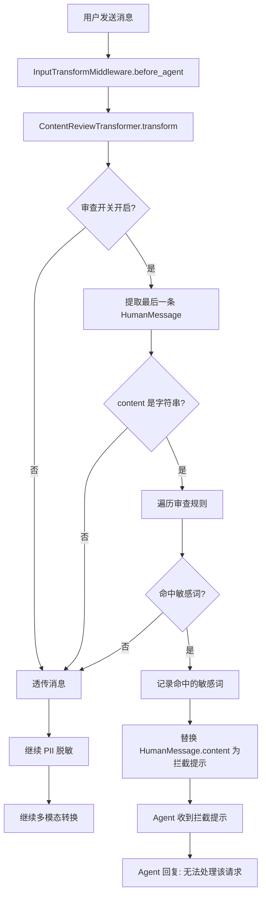
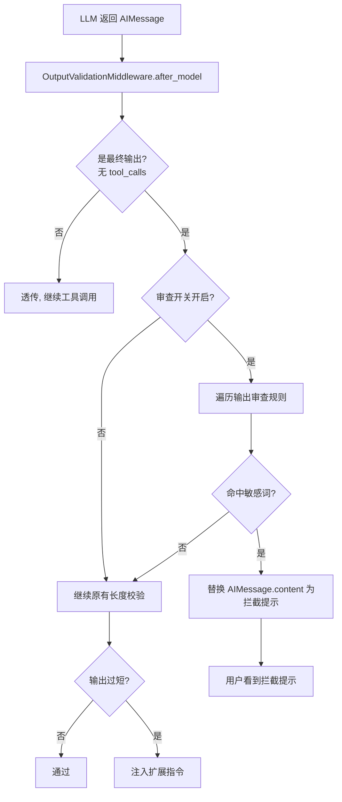

# 内容审查（Content Review）完整设计方案

## 1. 问题定义

当前 DeepAgent 缺少用户输入和 Agent 输出的敏感词拦截能力。用户可以输入任意内容（包括违规、涉政、色情等），Agent 也可能输出不当内容。老项目 `ContentReviewService` 是半成品（配置返回空列表），需要在新架构中完整实现。

## 2. 设计目标

1. 输入审查：用户消息送入 Agent 前，拦截包含敏感词的输入
2. 输出审查：Agent 回复返回给用户前，拦截包含敏感词的输出
3. 工具结果审查：工具返回的数据中如果包含敏感词，在送入 LLM 前拦截
4. 配置化：敏感词列表、拦截提示语、开关均可配置，支持热更新
5. 降级策略：审查异常时放行，不阻断主流程

## 3. 架构设计

### 3.1 在中间件管道中的位置

```
═══════════════════════════════════════════════════════════
 Agent 完整执行链路 × 内容审查切入点
═══════════════════════════════════════════════════════════

 ① before_agent
 ┌──────────────────────────────────────────────────────┐
 │  TracingMiddleware.before_agent                      │
 │  AgentLoggingMiddleware.before_agent                 │
 │  DanglingToolCallMiddleware.before_agent             │
 │  FileProcessMiddleware.before_agent                  │
 │  InputTransformMiddleware.before_agent               │
 │    ├─ ★ ContentReviewTransformer  ← 【输入审查】     │
 │    ├─ PIIRedactTransformer                           │
 │    └─ MultimodalTransformer                          │
 │  MemoryMiddleware.abefore_agent                      │
 └──────────────────────────────────────────────────────┘

 ② before_model（每轮迭代）
 ③ LLM 调用
 ④ after_model（每轮迭代）
 ┌──────────────────────────────────────────────────────┐
 │  ...                                                 │
 │  ★ OutputValidationMiddleware.after_model             │
 │    └─ 输出长度校验 + 【输出敏感词审查】  ← 扩展      │
 └──────────────────────────────────────────────────────┘

 ⑤ wrap_tool_call
 ┌──────────────────────────────────────────────────────┐
 │  TracingMiddleware                                   │
 │  AgentLoggingMiddleware                              │
 │  GuardrailMiddleware                                 │
 │  ★ ToolErrorHandlingMiddleware                       │
 │    └─ 工具结果中的敏感词 → 由输出审查在 after_model  │
 │       阶段统一处理（工具结果会进入下一轮 LLM 输入）  │
 │  ClarificationMiddleware                             │
 └──────────────────────────────────────────────────────┘

 ⑥ after_agent
```

### 3.2 核心设计决策

| 决策 | 方案 | 原因 |
|------|------|------|
| 输入审查放在哪里 | InputTransformMiddleware 管道中的 ContentReviewTransformer | 排在 PII 脱敏之前，先拦截违规内容再脱敏 |
| 输出审查放在哪里 | 扩展 OutputValidationMiddleware | 已有 after_model 钩子，复用现有位置 |
| 工具结果审查 | 不单独做 | 工具结果会作为下一轮 LLM 输入，由输出审查在 after_model 统一覆盖 |
| 审查配置来源 | ContentReviewConfig 配置文件/数据库 | 支持热更新，不需要重启 |
| 审查失败策略 | 输入：替换为拦截提示；输出：替换为拦截提示 | 不抛异常，不中断 Agent 循环 |
| 审查异常策略 | 降级放行 | 对齐老项目，审查模块故障不影响主流程 |

### 3.3 输入审查 vs 输出审查的差异

| 维度 | 输入审查 | 输出审查 |
|------|---------|---------|
| 触发时机 | before_agent（仅一次） | after_model（每轮迭代） |
| 审查对象 | 最后一条 HumanMessage | 最后一条 AIMessage（无 tool_calls 时） |
| 拦截方式 | 替换 HumanMessage 内容为拦截提示 | 替换 AIMessage 内容为拦截提示 |
| 拦截后果 | Agent 看到的是拦截提示，会回复"无法处理" | 用户看到的是拦截提示，Agent 不再继续 |
| 配置字段 | is_input=True 的规则 | is_output=True 的规则 |

## 4. 数据模型

```python
@dataclass
class ContentReviewConfig:
    """内容审查配置 — 对齐老项目 ContentReviewConfig"""
    keywords: list[str]           # 敏感词列表
    input_message: str            # 输入拦截时返回给 Agent 的提示
    output_message: str           # 输出拦截时返回给用户的提示
    is_input: bool = True         # 是否启用输入审查
    is_output: bool = True        # 是否启用输出审查
    case_sensitive: bool = False  # 是否区分大小写

@dataclass
class ContentReviewResult:
    """审查结果"""
    passed: bool
    blocked_keywords: list[str] = field(default_factory=list)
    blocked_reason: str = ""
```

## 5. 详细流程

### 5.1 输入审查流程



### 5.2 输出审查流程



### 5.3 与 Agent 主循环的交互

```
用户: "帮我查一下XXX敏感词相关的客户"

═══ before_agent ═══
ContentReviewTransformer 检测到敏感词 "XXX敏感词"
→ 替换 HumanMessage.content 为:
  "[系统提示] 您的输入包含不当内容，请修改后重试。"

═══ before_model ═══
LLM 收到的消息:
  HumanMessage("[系统提示] 您的输入包含不当内容，请修改后重试。")

═══ LLM 调用 ═══
LLM 回复:
  AIMessage("抱歉，您的输入包含不当内容，我无法处理该请求。请修改后重新提问。")

═══ after_model ═══
OutputValidationMiddleware 检查输出 → 无敏感词 → 通过

═══ 返回给用户 ═══
"抱歉，您的输入包含不当内容，我无法处理该请求。请修改后重新提问。"
```

## 6. 配置管理

### 6.1 配置文件方式（MVP）

```yaml
# data/content_review.yaml
enabled: true
rules:
  - keywords:
      - "敏感词1"
      - "敏感词2"
      - "违规内容"
    input_message: "您的输入包含不当内容，请修改后重试。"
    output_message: "回复内容包含不当信息，已被系统拦截。"
    is_input: true
    is_output: true
    case_sensitive: false
```

### 6.2 数据库方式（生产级）

```sql
CREATE TABLE ai_content_review_config (
    id BIGINT PRIMARY KEY,
    tenant_id BIGINT NOT NULL,
    keywords TEXT NOT NULL,           -- 换行分隔的敏感词列表
    input_message VARCHAR(500),       -- 输入拦截提示
    output_message VARCHAR(500),      -- 输出拦截提示
    is_input SMALLINT DEFAULT 1,      -- 是否启用输入审查
    is_output SMALLINT DEFAULT 1,     -- 是否启用输出审查
    case_sensitive SMALLINT DEFAULT 0,
    delete_flg SMALLINT DEFAULT 0,
    created_at BIGINT NOT NULL,
    updated_at BIGINT NOT NULL
);
```

### 6.3 动态开关

通过 `configurable["content_review_enabled"]` 或 `metadata["content_review"]` 控制：

```python
config = {
    "configurable": {
        "thread_id": thread_id,
        "content_review_enabled": True,  # 全局开关
    }
}
```

## 7. 实现清单

| 序号 | 文件 | 改动 | 说明 |
|------|------|------|------|
| 1 | `src/middleware/content_review.py` | 新建 | ContentReviewService + ContentReviewConfig + ContentReviewResult |
| 2 | `src/middleware/input_transform.py` | 新增 | ContentReviewTransformer（输入审查） |
| 3 | `src/middleware/output_validation.py` | 扩展 | 增加输出敏感词审查逻辑 |
| 4 | `src/middleware/builder.py` | 修改 | 注册 ContentReviewTransformer 到管道（排在 PII 之前） |
| 5 | `src/middleware/__init__.py` | 修改 | 导出新增类 |
| 6 | `data/content_review.yaml` | 新建 | 默认审查配置 |

### 执行顺序（InputTransformMiddleware 管道内）

```
1. ContentReviewTransformer  — 先拦截违规内容
2. PIIRedactTransformer      — 再对合规内容做 PII 脱敏
3. MultimodalTransformer     — 最后做多模态格式转换
```

## 8. 错误处理

| 错误类型 | 处理方式 |
|---------|---------|
| 配置文件不存在 | 降级：审查关闭，全部放行 |
| 配置解析失败 | 降级：审查关闭，全部放行，记录 error 日志 |
| 审查过程异常 | 降级：放行，记录 error 日志 |
| 敏感词列表为空 | 等同于审查关闭 |

对齐老项目的核心原则：**审查模块故障不阻断 Agent 主流程**。
