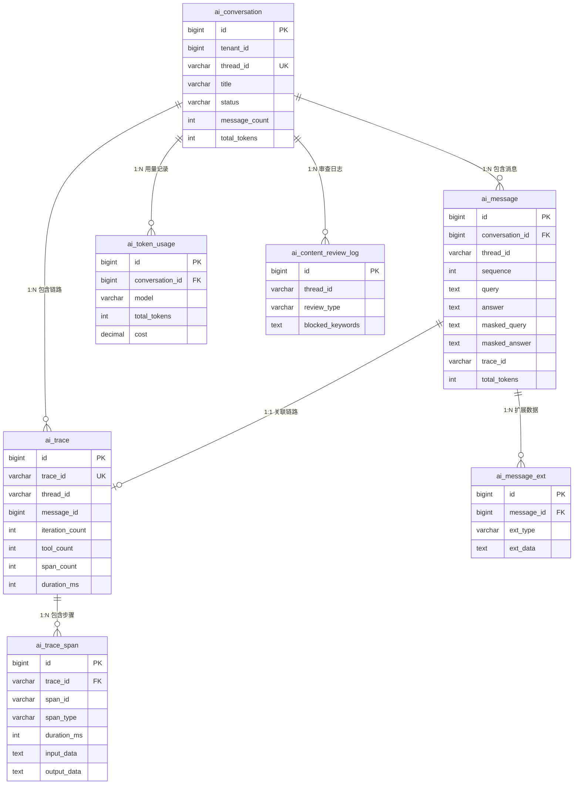
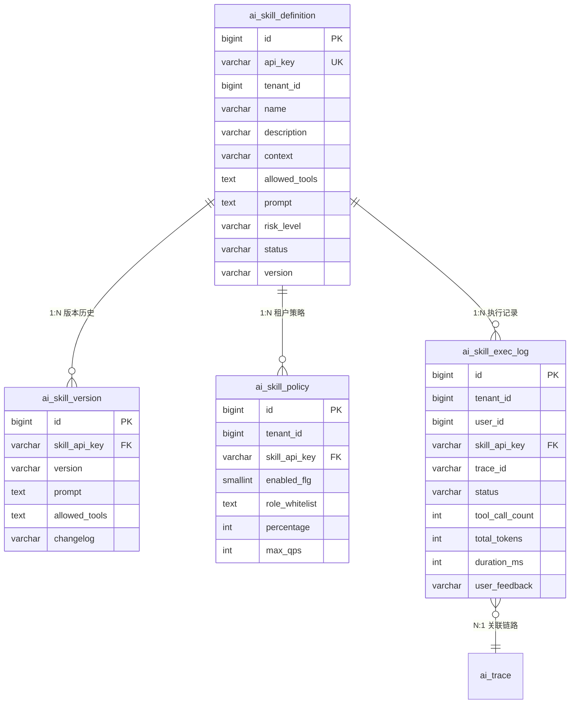

# 数据库表设计 — 全量 DDL

---

## 一、长期记忆数据库表设计

# 长期记忆数据库表设计

## 一、设计目标

```
当前架构:
  PG（部分类别）:  profile / preferences / soul / tools / skills
  向量库（部分类别）: entities / events / cases / patterns
  问题: 数据分散在两个存储中，PG 不完整，向量库无法做复杂查询

目标架构:
  PG（全量，权威数据源）: 所有 8 类 + soul，完整的 L0/L1/L2
  向量库（检索索引）: 需要语义检索的类别，只存 L0 embedding + 元数据
  关系: PG 是主库，向量库是从库（检索加速层）
```

## 二、表结构设计

### 2.1 主表：ai_agent_memory

存储所有类别的记忆，每条记忆一行。

```sql
SET search_path TO paas_ai;

CREATE TABLE IF NOT EXISTS ai_agent_memory (
    -- ── 主键 ──
    id              BIGSERIAL    PRIMARY KEY,
    memory_id       VARCHAR(64)  NOT NULL,          -- 全局唯一 ID（UUID，与向量库 id 一致）

    -- ── 租户隔离 ──
    tenant_id       BIGINT       NOT NULL DEFAULT 0,
    user_id         VARCHAR(64)  NOT NULL,           -- 记忆所属用户

    -- ── 分类 ──
    category        VARCHAR(32)  NOT NULL,           -- profile/preferences/entities/events/cases/patterns/tools/skills/soul
    source_type     VARCHAR(32)  NOT NULL DEFAULT 'insight',  -- insight（增量认知）/ system_data（系统数据快照）

    -- ── 三层内容 ──
    abstract        TEXT         NOT NULL DEFAULT '', -- L0: 一句话摘要（也是 embedding 输入）
    overview        TEXT         NOT NULL DEFAULT '', -- L1: 结构化 Markdown 概览
    content         TEXT         NOT NULL DEFAULT '', -- L2: 完整描述

    -- ── 定位锚点 ──
    merge_key       VARCHAR(512) NOT NULL DEFAULT '', -- 合并键（如 "华为科技/ERP项目"）
    parent_entity   VARCHAR(256) NOT NULL DEFAULT '', -- 父实体（如 "华为科技"）

    -- ── 业务关联（Phase 2）──
    biz_id          VARCHAR(128) NOT NULL DEFAULT '', -- CRM 系统 record_id（如 "opp_001"）
    biz_parent_id   VARCHAR(128) NOT NULL DEFAULT '', -- 父实体 record_id（如 "acc_001"）
    biz_type        VARCHAR(64)  NOT NULL DEFAULT '', -- 业务实体类型（如 "opportunity"）

    -- ── 来源追溯 ──
    thread_id       VARCHAR(64)  NOT NULL DEFAULT '', -- 来源会话 ID
    message_id      BIGINT       NOT NULL DEFAULT 0,  -- 来源消息 ID（可追溯到具体对话轮次）

    -- ── 状态 ──
    status          VARCHAR(20)  NOT NULL DEFAULT 'active',  -- active / archived / expired
    active_count    INT          NOT NULL DEFAULT 0,  -- 被检索命中的次数（热度）
    confidence      DECIMAL(5,4) NOT NULL DEFAULT 1.0, -- 置信度（反思后可能降低）

    -- ── 向量库同步 ──
    vector_synced   SMALLINT     NOT NULL DEFAULT 0,  -- 是否已同步到向量库（0=未同步, 1=已同步）
    vector_id       VARCHAR(64)  NOT NULL DEFAULT '', -- 向量库中的文档 ID（通常 = memory_id）

    -- ── 审计字段（对齐 BaseEntity 规范）──
    delete_flg      SMALLINT     NOT NULL DEFAULT 0,
    created_at      BIGINT       NOT NULL DEFAULT 0,  -- 毫秒时间戳
    created_by      BIGINT       NOT NULL DEFAULT 0,
    updated_at      BIGINT       NOT NULL DEFAULT 0,
    updated_by      BIGINT       NOT NULL DEFAULT 0
);

-- ── 索引 ──

-- 用户 + 类别（最常用的查询路径）
CREATE INDEX IF NOT EXISTS idx_memory_user_cat
    ON ai_agent_memory (tenant_id, user_id, category, delete_flg);

-- 合并键唯一约束（同用户同类别同 merge_key 只保留一条）
CREATE UNIQUE INDEX IF NOT EXISTS uk_memory_merge
    ON ai_agent_memory (tenant_id, user_id, category, merge_key)
    WHERE merge_key != '' AND delete_flg = 0;

-- 父实体查询（目录递归检索：查某客户下的所有记忆）
CREATE INDEX IF NOT EXISTS idx_memory_parent
    ON ai_agent_memory (tenant_id, user_id, parent_entity)
    WHERE parent_entity != '' AND delete_flg = 0;

-- 业务 ID 查询（Phase 2：按 CRM record_id 精确查找）
CREATE INDEX IF NOT EXISTS idx_memory_biz_id
    ON ai_agent_memory (biz_id)
    WHERE biz_id != '';

CREATE INDEX IF NOT EXISTS idx_memory_biz_parent
    ON ai_agent_memory (biz_parent_id)
    WHERE biz_parent_id != '';

-- 状态 + 时间（遗忘策略：查过期记忆）
CREATE INDEX IF NOT EXISTS idx_memory_status_time
    ON ai_agent_memory (tenant_id, category, status, updated_at)
    WHERE delete_flg = 0;

-- 向量同步状态（补偿任务：查未同步的记忆）
CREATE INDEX IF NOT EXISTS idx_memory_vector_sync
    ON ai_agent_memory (vector_synced, updated_at)
    WHERE vector_synced = 0 AND delete_flg = 0;

-- 会话追溯（查某次对话产生了哪些记忆）
CREATE INDEX IF NOT EXISTS idx_memory_thread
    ON ai_agent_memory (tenant_id, thread_id)
    WHERE thread_id != '';

COMMENT ON TABLE ai_agent_memory IS '长期记忆 — 全量存储（8类 + soul），PG 为权威数据源，向量库为检索索引';
```

### 2.2 字段说明

| 字段 | 类型 | 说明 | 示例 |
|:---|:---|:---|:---|
| memory_id | VARCHAR(64) | 全局唯一 ID，与向量库 id 一致 | "a1b2c3d4-..." |
| tenant_id | BIGINT | 租户隔离 | 1001 |
| user_id | VARCHAR(64) | 记忆所属用户 | "user_zhang" |
| category | VARCHAR(32) | 8 类分类 | "entities" |
| source_type | VARCHAR(32) | insight / system_data | "insight" |
| abstract | TEXT | L0 摘要 | "华为/张伟: 喜欢PPT汇报" |
| overview | TEXT | L1 概览 | "## 沟通风格\n- 喜欢PPT..." |
| content | TEXT | L2 完整内容 | "华为联系人张伟喜欢PPT..." |
| merge_key | VARCHAR(512) | 合并键 | "华为/张伟" |
| parent_entity | VARCHAR(256) | 父实体 | "华为" |
| biz_id | VARCHAR(128) | CRM record_id | "con_001" |
| biz_parent_id | VARCHAR(128) | 父实体 record_id | "acc_001" |
| biz_type | VARCHAR(64) | 业务实体类型 | "contact" |
| thread_id | VARCHAR(64) | 来源会话 | "thread_abc123" |
| message_id | BIGINT | 来源消息 | 10086 |
| status | VARCHAR(20) | active/archived/expired | "active" |
| active_count | INT | 检索命中次数 | 5 |
| confidence | DECIMAL | 置信度 | 0.95 |
| vector_synced | SMALLINT | 向量库同步状态 | 1 |
| vector_id | VARCHAR(64) | 向量库文档 ID | "a1b2c3d4-..." |

### 2.3 与旧表 agent_memory 的关系

```
旧表 agent_memory:
  - 只存 profile/preferences/soul/tools/skills
  - 无 tenant_id、无 source_type、无 biz_id、无 status
  - 无向量库同步状态

新表 ai_agent_memory:
  - 存所有 8 类 + soul
  - 完整的租户隔离、来源追溯、业务关联、状态管理
  - 对齐 BaseEntity 规范（delete_flg, created_by, updated_by）

迁移策略:
  1. 新表上线后，新记忆写新表
  2. 旧表数据一次性迁移到新表
  3. 验证无误后废弃旧表
```

---

## 三、各类别的存储示例

### 3.1 entities — 增量认知

```
memory_id:     "uuid-001"
category:      "entities"
source_type:   "insight"
abstract:      "华为/张伟: 喜欢PPT汇报，开会不要绕弯子"
overview:      "## 沟通风格\n- 喜欢PPT配数据\n- 性格直接\n## 建议\n- 开会直奔主题"
content:       "华为联系人张伟喜欢PPT形式的汇报并配上具体数据，性格直接不喜欢绕弯子。开会时直奔主题。"
merge_key:     "华为/张伟"
parent_entity: "华为"
biz_id:        "con_001"        ← Phase 2
biz_parent_id: "acc_001"        ← Phase 2
biz_type:      "contact"        ← Phase 2
thread_id:     "thread_abc"
status:        "active"
```

### 3.2 events — 口头承诺

```
memory_id:     "uuid-002"
category:      "events"
source_type:   "insight"
abstract:      "2026-04-28 招行陈刚私下确认风控平台选我们"
overview:      "## 口头承诺\n- 陈刚私下确认\n## 后续\n- 正式流程还需两周"
content:       "招行陈刚私下表示风控平台项目基本确定选择我们，正式流程还需两周。"
merge_key:     ""
parent_entity: "招行"
biz_id:        ""
thread_id:     "thread_def"
status:        "active"
```

### 3.3 profile — 用户身份

```
memory_id:     "uuid-003"
category:      "profile"
source_type:   "insight"
abstract:      "华东区销售总监，管理15人团队，负责互联网和金融行业"
overview:      "## 身份\n- 角色: 销售总监\n- 区域: 华东区\n## 团队\n- 规模: 15人"
content:       "用户是华东区销售总监，管理15人团队，主要负责互联网和金融行业大客户。"
merge_key:     "profile"
parent_entity: ""
thread_id:     "thread_ghi"
status:        "active"
```

### 3.4 preferences — 偏好

```
memory_id:     "uuid-004"
category:      "preferences"
source_type:   "insight"
abstract:      "数据展示偏好: 表格格式，要看具体数字"
overview:      "## 偏好\n- 格式: 表格\n- 原因: 要看具体数字"
content:       "用户偏好使用表格展示数据，不要图表，因为需要看到具体数字。"
merge_key:     "数据展示偏好"
parent_entity: ""
thread_id:     "thread_jkl"
status:        "active"
```

### 3.5 cases — 问题解决

```
memory_id:     "uuid-005"
category:      "cases"
source_type:   "insight"
abstract:      "查询商机报错 → 字段名stage写成status"
overview:      "## 问题\n- 查询商机报错\n## 原因\n- stage写成status\n## 解决\n- 用query_schema确认"
content:       "查询opportunity时报错，字段名stage写成了status。建议先用query_schema确认字段名。"
merge_key:     ""
parent_entity: ""
thread_id:     "thread_mno"
status:        "active"
```

### 3.6 patterns — 工作流程

```
memory_id:     "uuid-006"
category:      "patterns"
source_type:   "insight"
abstract:      "客户分析流程: 基本信息→商机→联系人→活动"
overview:      "## 步骤\n1. 查基本信息\n2. 查商机\n3. 查联系人\n4. 查活动"
content:       "用户习惯按以下顺序分析客户：基本信息→商机→联系人→活动。"
merge_key:     "客户分析流程"
parent_entity: ""
thread_id:     "thread_pqr"
status:        "active"
```

### 3.7 soul — 用户画像

```
memory_id:     "uuid-007"
category:      "soul"
source_type:   "insight"
abstract:      "用户画像: 华东区销售总监，偏好表格，重点客户华为/招行"
overview:      ""
content:       '{"identity":{"role":"销售总监","region":"华东区"},"preferences":{"display":"表格"},...}'
merge_key:     "soul"
parent_entity: ""
thread_id:     ""
status:        "active"
```

---

## 四、写入流程

### 4.1 双写策略

```
extract_and_update() 提取完成后:
  │
  ├── 1. 写入 PG（主库，同步）
  │     INSERT INTO ai_agent_memory (...) VALUES (...)
  │     ON CONFLICT (tenant_id, user_id, category, merge_key)
  │     DO UPDATE SET abstract=..., content=..., updated_at=...
  │
  ├── 2. 写入向量库（从库，异步）
  │     embed(abstract) → vector
  │     vdb.upsert({id: memory_id, vector, abstract, ...})
  │     成功后: UPDATE ai_agent_memory SET vector_synced=1 WHERE memory_id=...
  │
  └── 3. 向量库写入失败时:
        vector_synced 保持 0
        补偿任务定期扫描 vector_synced=0 的记忆重新同步
```

### 4.2 合并策略（PG 侧）

```
profile:
  merge_key = "profile"（固定）
  ON CONFLICT → content 追加合并（old_content + "\n" + new_content）

preferences:
  merge_key = aspect 名（如 "数据展示偏好"）
  ON CONFLICT → 整条替换（新值覆盖旧值）

entities (insight):
  merge_key = "华为/张伟"
  ON CONFLICT → 整条替换（最新洞察覆盖旧洞察）

events:
  merge_key = ""（空，不合并）
  每条独立插入

cases:
  merge_key = ""（空，不合并）
  每条独立插入

patterns / tools / skills:
  merge_key = 流程名/工具名/技能名
  ON CONFLICT → 整条替换
```

---

## 五、查询场景

### 5.1 常用查询

```sql
-- 查用户的所有记忆（按类别分组）
SELECT category, COUNT(*) FROM ai_agent_memory
WHERE tenant_id = ? AND user_id = ? AND delete_flg = 0 AND status = 'active'
GROUP BY category;

-- 查某客户下的所有洞察
SELECT * FROM ai_agent_memory
WHERE tenant_id = ? AND user_id = ? AND parent_entity = '华为'
  AND delete_flg = 0 AND status = 'active'
ORDER BY updated_at DESC;

-- 查用户 profile
SELECT * FROM ai_agent_memory
WHERE tenant_id = ? AND user_id = ? AND category = 'profile' AND merge_key = 'profile'
  AND delete_flg = 0;

-- 查用户 SOUL
SELECT * FROM ai_agent_memory
WHERE tenant_id = ? AND user_id = ? AND category = 'soul' AND merge_key = 'soul'
  AND delete_flg = 0;

-- 查某次对话产生的记忆
SELECT * FROM ai_agent_memory
WHERE tenant_id = ? AND thread_id = ? AND delete_flg = 0
ORDER BY created_at;

-- 查过期记忆（遗忘策略）
SELECT * FROM ai_agent_memory
WHERE tenant_id = ? AND category = 'events' AND status = 'active'
  AND updated_at < ? AND active_count < 3 AND delete_flg = 0;

-- 查未同步到向量库的记忆（补偿任务）
SELECT * FROM ai_agent_memory
WHERE vector_synced = 0 AND delete_flg = 0
ORDER BY updated_at
LIMIT 100;

-- Phase 2: 按 CRM record_id 查记忆（实体改名不影响）
SELECT * FROM ai_agent_memory
WHERE biz_parent_id = 'acc_001' AND delete_flg = 0 AND status = 'active';
```

### 5.2 SOUL 蒸馏查询

```sql
-- 获取用户所有 active 记忆的 L0 摘要（用于 SOUL 蒸馏）
SELECT category, abstract FROM ai_agent_memory
WHERE tenant_id = ? AND user_id = ? AND category != 'soul'
  AND delete_flg = 0 AND status = 'active'
ORDER BY category, updated_at DESC;
```

### 5.3 VikingFS 目录查询

```sql
-- ls: 列出 entities 类别下的顶层客户
SELECT parent_entity, COUNT(*) as cnt
FROM ai_agent_memory
WHERE tenant_id = ? AND user_id = ? AND category = 'entities'
  AND parent_entity != '' AND delete_flg = 0 AND status = 'active'
GROUP BY parent_entity
ORDER BY parent_entity;

-- ls: 列出某客户下的子条目
SELECT memory_id, merge_key, abstract, updated_at
FROM ai_agent_memory
WHERE tenant_id = ? AND user_id = ? AND category = 'entities'
  AND parent_entity = '华为' AND delete_flg = 0 AND status = 'active'
ORDER BY updated_at DESC;
```

---

## 六、与向量库的关系

```
PG（权威数据源）:
  - 存储全量记忆（8 类 + soul）
  - 支持精确查询（按 category / merge_key / parent_entity / biz_id）
  - 支持复杂查询（JOIN / GROUP BY / 聚合统计）
  - 支持事务（合并策略的原子性）
  - 支持审计（created_by / updated_by / delete_flg）

向量库（检索索引）:
  - 只存需要语义检索的类别（entities / events / cases / patterns）
  - 存储: L0 embedding + 元数据（memory_id / category / parent_entity / user_id）
  - 用途: 语义检索 + BM25 混合检索
  - 不存 L1 / L2（检索命中后从 PG 加载完整内容）

检索流程改进:
  当前: 向量库检索 → 返回 L0 + L1 + L2（全部从向量库读）
  改进: 向量库检索 → 返回 memory_id + score → PG 加载 L0 + L1 + L2
  优势: 向量库只做检索，PG 做数据读取，职责清晰
```

---

## 七、状态管理

### 7.1 状态流转

```
active → archived:
  触发: 反思修正（reflect_on_session / reflect_global）判定记忆过时
  操作: UPDATE status = 'archived', updated_at = now()
  效果: 不再被检索返回，但数据保留（可审计）

active → expired:
  触发: 遗忘策略（cleanup_expired）判定超过保留天数且低热度
  操作: UPDATE status = 'expired', updated_at = now()
  效果: 不再被检索返回，但数据保留

archived / expired → 物理删除:
  触发: 定期清理任务（保留 90 天后物理删除）
  操作: UPDATE delete_flg = 1
```

### 7.2 各类别保留策略

| 类别 | 保留天数 | 过期条件 |
|:---|:---|:---|
| profile | 永不过期 | — |
| preferences | 永不过期 | — |
| soul | 永不过期 | — |
| entities | 180 天 | updated_at 超期 AND active_count < 3 |
| events | 90 天 | updated_at 超期 AND active_count < 3 |
| cases | 180 天 | updated_at 超期 AND active_count < 3 |
| patterns | 365 天 | updated_at 超期 AND active_count < 3 |
| tools | 365 天 | updated_at 超期 AND active_count < 3 |
| skills | 365 天 | updated_at 超期 AND active_count < 3 |


---

## 二、Agent 对话存储表设计

# Agent 对话存储表设计

## 1. 设计背景

当前 DeepAgent 的对话数据全部存在内存中：
- 对话历史：依赖 LangGraph checkpointer（Redis），服务重启后丢失
- 链路追踪：`Tracer` 类用 dict 存储，进程内有效
- 记忆数据：`MemoryStorage` 用 SQLite 本地文件

生产环境需要持久化存储，支持：对话历史回溯、消息审计、链路分析、用量统计、多实例部署。

## 2. 表总览

```
┌─────────────────────────────────────────────────────────┐
│                    ai_conversation                       │
│  一次对话会话（对应一个 thread_id）                       │
├─────────────────────────────────────────────────────────┤
│         │                              │                 │
│    ai_message                    ai_trace                │
│  一条用户问答对                 一次 Agent 执行链路       │
│  (query + answer)              (对应一次用户输入)         │
│         │                              │                 │
│    ai_message_ext               ai_trace_span            │
│  消息扩展数据                   链路中的每个步骤          │
│  (文件/卡片/反馈)              (LLM/工具/记忆/审查)       │
│                                                          │
├─────────────────────────────────────────────────────────┤
│                                                          │
│    ai_content_review_log        ai_token_usage           │
│  内容审查日志                   Token 用量统计            │
│  (输入/输出拦截记录)           (按会话/用户/模型聚合)     │
└─────────────────────────────────────────────────────────┘
```

## 3. 表结构详细设计

### 3.1 ai_conversation — 对话会话

一个 thread_id 对应一条记录，是用户与 Agent 的一次完整对话。

```sql
CREATE TABLE ai_conversation (
    id              BIGINT PRIMARY KEY,
    tenant_id       BIGINT NOT NULL,
    user_id         BIGINT NOT NULL,
    thread_id       VARCHAR(64) NOT NULL,
    agent_name      VARCHAR(100) NOT NULL DEFAULT 'CRM-Agent',
    title           VARCHAR(500) DEFAULT '',
    summary         TEXT DEFAULT '',
    model           VARCHAR(100) DEFAULT '',
    status          VARCHAR(20) NOT NULL DEFAULT 'active',
    message_count   INT NOT NULL DEFAULT 0,
    total_tokens    INT NOT NULL DEFAULT 0,
    total_cost      DECIMAL(10,4) NOT NULL DEFAULT 0,
    last_message_at BIGINT DEFAULT 0,
    ext_info        TEXT DEFAULT '{}',
    delete_flg      SMALLINT NOT NULL DEFAULT 0,
    created_at      BIGINT NOT NULL,
    created_by      BIGINT NOT NULL DEFAULT 0,
    updated_at      BIGINT NOT NULL,
    updated_by      BIGINT NOT NULL DEFAULT 0
);

CREATE UNIQUE INDEX uk_conversation_thread ON ai_conversation(tenant_id, thread_id);
CREATE INDEX idx_conversation_user ON ai_conversation(tenant_id, user_id, delete_flg);
CREATE INDEX idx_conversation_time ON ai_conversation(tenant_id, last_message_at DESC);
```

| 字段 | 说明 |
|------|------|
| thread_id | LangGraph 的 thread_id，全局唯一 |
| title | 对话标题（由 TitleMiddleware 生成） |
| summary | 对话摘要（由 SummarizationMiddleware 生成） |
| status | active / archived / deleted |
| message_count | 消息对数（每次问答 +1） |
| total_tokens | 累计 token 消耗 |
| last_message_at | 最后一条消息时间戳（用于排序） |
| ext_info | JSON 扩展字段（debug_mode、agent 配置等） |

### 3.2 ai_message — 对话消息

一条记录对应一次用户问答对（query + answer），对齐老项目 ai_message。

```sql
CREATE TABLE ai_message (
    id              BIGINT PRIMARY KEY,
    tenant_id       BIGINT NOT NULL,
    conversation_id BIGINT NOT NULL,
    thread_id       VARCHAR(64) NOT NULL,
    sequence        INT NOT NULL DEFAULT 0,
    role            VARCHAR(20) NOT NULL,
    query           TEXT DEFAULT '',
    answer          TEXT DEFAULT '',
    masked_query    TEXT DEFAULT '',
    masked_answer   TEXT DEFAULT '',
    model           VARCHAR(100) DEFAULT '',
    input_tokens    INT NOT NULL DEFAULT 0,
    output_tokens   INT NOT NULL DEFAULT 0,
    total_tokens    INT NOT NULL DEFAULT 0,
    iteration_count INT NOT NULL DEFAULT 0,
    tool_count      INT NOT NULL DEFAULT 0,
    duration_ms     INT NOT NULL DEFAULT 0,
    trace_id        VARCHAR(64) DEFAULT '',
    status          VARCHAR(20) NOT NULL DEFAULT 'success',
    error_message   TEXT DEFAULT '',
    ext_info        TEXT DEFAULT '{}',
    delete_flg      SMALLINT NOT NULL DEFAULT 0,
    created_at      BIGINT NOT NULL,
    created_by      BIGINT NOT NULL DEFAULT 0,
    updated_at      BIGINT NOT NULL,
    updated_by      BIGINT NOT NULL DEFAULT 0
);

CREATE INDEX idx_message_conversation ON ai_message(conversation_id, sequence);
CREATE INDEX idx_message_thread ON ai_message(tenant_id, thread_id, sequence);
CREATE INDEX idx_message_trace ON ai_message(trace_id);
```

| 字段 | 说明 |
|------|------|
| conversation_id | 关联 ai_conversation.id |
| sequence | 消息序号（从 1 递增） |
| role | user / assistant / system |
| query | 用户原始输入 |
| answer | Agent 最终回复 |
| masked_query | PII 脱敏后的输入（送入 LLM 的版本） |
| masked_answer | PII 脱敏后的输出（审计用） |
| trace_id | 关联 ai_trace.trace_id |
| iteration_count | ReAct 循环次数 |
| tool_count | 工具调用次数 |
| duration_ms | 端到端耗时（ms） |

### 3.3 ai_message_ext — 消息扩展数据

存储消息关联的附件、卡片、反馈等非结构化数据。

```sql
CREATE TABLE ai_message_ext (
    id              BIGINT PRIMARY KEY,
    tenant_id       BIGINT NOT NULL,
    message_id      BIGINT NOT NULL,
    ext_type        VARCHAR(50) NOT NULL,
    ext_data        TEXT NOT NULL DEFAULT '{}',
    status          VARCHAR(20) DEFAULT 'active',
    delete_flg      SMALLINT NOT NULL DEFAULT 0,
    created_at      BIGINT NOT NULL,
    updated_at      BIGINT NOT NULL
);

CREATE INDEX idx_message_ext ON ai_message_ext(message_id, ext_type);
```

| ext_type | ext_data 示例 | 说明 |
|----------|--------------|------|
| file | `{"fileName":"客户清单.csv","fileType":"document","url":"..."}` | 上传文件 |
| card | `{"cardType":"table","data":[...]}` | 结构化卡片（表格、图表） |
| feedback | `{"rating":"good","comment":"回答准确"}` | 用户反馈 |
| clarification | `{"type":"missing_info","question":"...","options":[...]}` | 澄清追问 |
| tool_result | `{"toolName":"query_data","input":{...},"output":{...}}` | 工具调用详情 |

### 3.4 ai_trace — 执行链路

一条记录对应一次 Agent 执行（一次用户输入触发的完整 ReAct 循环），对齐当前 `Trace` 类。

```sql
CREATE TABLE ai_trace (
    id              BIGINT PRIMARY KEY,
    tenant_id       BIGINT NOT NULL,
    trace_id        VARCHAR(64) NOT NULL,
    thread_id       VARCHAR(64) NOT NULL,
    message_id      BIGINT DEFAULT 0,
    user_input      TEXT DEFAULT '',
    agent_output    TEXT DEFAULT '',
    model           VARCHAR(100) DEFAULT '',
    agent_name      VARCHAR(100) DEFAULT '',
    status          VARCHAR(20) NOT NULL DEFAULT 'running',
    total_tokens    INT NOT NULL DEFAULT 0,
    total_cost      DECIMAL(10,4) NOT NULL DEFAULT 0,
    iteration_count INT NOT NULL DEFAULT 0,
    tool_count      INT NOT NULL DEFAULT 0,
    span_count      INT NOT NULL DEFAULT 0,
    duration_ms     INT NOT NULL DEFAULT 0,
    start_time      BIGINT NOT NULL,
    end_time        BIGINT DEFAULT 0,
    ext_info        TEXT DEFAULT '{}',
    delete_flg      SMALLINT NOT NULL DEFAULT 0,
    created_at      BIGINT NOT NULL,
    updated_at      BIGINT NOT NULL
);

CREATE UNIQUE INDEX uk_trace_id ON ai_trace(trace_id);
CREATE INDEX idx_trace_thread ON ai_trace(tenant_id, thread_id, start_time DESC);
CREATE INDEX idx_trace_time ON ai_trace(tenant_id, start_time DESC);
```

### 3.5 ai_trace_span — 链路步骤

一条记录对应链路中的一个步骤，对齐当前 `Span` 类。

```sql
CREATE TABLE ai_trace_span (
    id              BIGINT PRIMARY KEY,
    tenant_id       BIGINT NOT NULL,
    trace_id        VARCHAR(64) NOT NULL,
    span_id         VARCHAR(64) NOT NULL,
    parent_span_id  VARCHAR(64) DEFAULT '',
    span_type       VARCHAR(50) NOT NULL,
    span_name       VARCHAR(200) NOT NULL DEFAULT '',
    status          VARCHAR(20) NOT NULL DEFAULT 'running',
    duration_ms     INT NOT NULL DEFAULT 0,
    start_time      BIGINT NOT NULL,
    end_time        BIGINT DEFAULT 0,
    input_data      TEXT DEFAULT '{}',
    output_data     TEXT DEFAULT '{}',
    metadata        TEXT DEFAULT '{}',
    delete_flg      SMALLINT NOT NULL DEFAULT 0,
    created_at      BIGINT NOT NULL
);

CREATE INDEX idx_span_trace ON ai_trace_span(trace_id, start_time);
CREATE INDEX idx_span_type ON ai_trace_span(trace_id, span_type);
```

| span_type 枚举 | 说明 | 来源 |
|----------------|------|------|
| context_build | 上下文构建 | TracingMiddleware.before_agent |
| memory_retrieval | 记忆检索 | MemoryMiddleware |
| intent_analysis | 意图分析 | TracingMiddleware.before_model |
| llm_call | LLM 调用 | TracingMiddleware.after_model |
| tool_call | 工具调用 | TracingMiddleware.wrap_tool_call |
| hierarchical_search | 分层检索 | FTSMemoryEngine.retrieve |
| memory_extract | 记忆提取 | MemoryMiddleware.aafter_agent |
| clarification | 澄清追问 | ClarificationMiddleware |
| content_review | 内容审查 | ContentReviewTransformer |
| error | 异常 | 各中间件 |

### 3.6 ai_content_review_log — 内容审查日志

记录每次输入/输出审查的拦截事件，用于审计和规则优化。

```sql
CREATE TABLE ai_content_review_log (
    id              BIGINT PRIMARY KEY,
    tenant_id       BIGINT NOT NULL,
    thread_id       VARCHAR(64) NOT NULL,
    message_id      BIGINT DEFAULT 0,
    review_type     VARCHAR(20) NOT NULL,
    original_content TEXT NOT NULL,
    blocked_keywords TEXT DEFAULT '[]',
    blocked_reason  VARCHAR(500) DEFAULT '',
    rule_id         BIGINT DEFAULT 0,
    delete_flg      SMALLINT NOT NULL DEFAULT 0,
    created_at      BIGINT NOT NULL
);

CREATE INDEX idx_review_log_thread ON ai_content_review_log(tenant_id, thread_id);
CREATE INDEX idx_review_log_time ON ai_content_review_log(tenant_id, created_at DESC);
```

| review_type | 说明 |
|-------------|------|
| input | 输入审查拦截 |
| output | 输出审查拦截 |

### 3.7 ai_token_usage — Token 用量统计

按会话/用户/模型维度聚合 token 消耗，用于用量管控和计费。

```sql
CREATE TABLE ai_token_usage (
    id              BIGINT PRIMARY KEY,
    tenant_id       BIGINT NOT NULL,
    user_id         BIGINT NOT NULL,
    conversation_id BIGINT DEFAULT 0,
    thread_id       VARCHAR(64) DEFAULT '',
    trace_id        VARCHAR(64) DEFAULT '',
    model           VARCHAR(100) NOT NULL,
    input_tokens    INT NOT NULL DEFAULT 0,
    output_tokens   INT NOT NULL DEFAULT 0,
    total_tokens    INT NOT NULL DEFAULT 0,
    cost            DECIMAL(10,6) NOT NULL DEFAULT 0,
    created_at      BIGINT NOT NULL
);

CREATE INDEX idx_usage_user ON ai_token_usage(tenant_id, user_id, created_at DESC);
CREATE INDEX idx_usage_model ON ai_token_usage(tenant_id, model, created_at DESC);
CREATE INDEX idx_usage_conversation ON ai_token_usage(conversation_id);
```

## 4. 表关系 ER 图



## 5. 数据写入时机

| 表 | 写入时机 | 写入方 |
|---|---|---|
| ai_conversation | 首次对话时创建，每次消息后更新 message_count/total_tokens/last_message_at | server.py 的 /api/chat |
| ai_message | Agent 执行完成后写入（query + answer 一起） | MemoryMiddleware.aafter_agent 或 server.py |
| ai_message_ext | 有附件/反馈/卡片时写入 | FileProcessMiddleware / 前端反馈接口 |
| ai_trace | Tracer.start_trace 时创建，finish_trace 时更新 | Tracer |
| ai_trace_span | 每个 span 完成时写入 | TracingMiddleware 各钩子 |
| ai_content_review_log | 审查拦截时写入 | ContentReviewTransformer / OutputValidationMiddleware |
| ai_token_usage | LLM 调用返回 usage 后写入 | server.py 的 on_chat_model_end |

## 6. 与老项目对比

| 老项目表 | 新表 | 差异 |
|---------|------|------|
| ai_conversation | ai_conversation | 新增 total_tokens/total_cost/last_message_at |
| ai_message | ai_message | 新增 trace_id/iteration_count/tool_count/duration_ms |
| ai_debug_message | ai_trace_span | 老项目只记 4 种 type，新表记 10+ 种 span_type |
| ai_message_data | ai_message_ext | 统一为 ext_type + ext_data 的 KV 模式 |
| ai_conversation_pending | 去掉 | 异步状态由 LangGraph checkpointer 管理 |
| ai_llm_app_audit | ai_token_usage | 拆分为独立用量表，不再混在审计日志中 |
| （无） | ai_trace | 新增，完整链路追踪 |
| （无） | ai_content_review_log | 新增，审查审计 |

## 7. 约束

- 所有表遵循 BaseEntity 规范：id(BIGINT 雪花主键) + delete_flg + created_at/created_by + updated_at/updated_by
- 所有 DDL 兼容 MySQL 和 PostgreSQL，禁止 AUTO_INCREMENT/ENGINE/COMMENT/BOOLEAN/ENUM
- 关联使用 thread_id/trace_id 等业务标识，不使用自增 ID 关联
- TEXT 字段存储 JSON 时使用 `DEFAULT '{}'` 或 `DEFAULT '[]'`


---

## 三、Trace 链路持久化方案

# Trace 链路持久化方案

## 1. 问题定义

当前 Trace 数据全部存在内存中（`Tracer` 类的 `_traces` dict），进程重启即丢失。
index.html 前端需要完整的链路数据支撑 8 个页面：总览仪表盘、Trace Explorer、Trace 详情、Session 浏览器、工具调用分析、意图分析、告警中心、用量报表。

需要将 Trace 数据持久化到 PG（paas_ai schema），同时保持现有内存 Tracer 的实时性（SSE 推送）。

## 2. index.html 链路结构 → 数据库映射

### 2.1 Trace 详情页的链路节点

index.html 展示的一次完整 Trace 包含以下节点（按时间线排列）：

```
📋 context_build          120ms    ← before_agent 阶段
🔍 memory_retrieval       1,800ms  ← MemoryMiddleware
🧠 intent_analysis        600ms    ← 意图分析
🤖 llm_call               580ms    ← 首次 LLM（可能是意图判断）
🌲 hierarchical_search    400ms    ← 分层检索（skill 维度）
  ├─ 🔎 vector_search     80ms       子步骤
  ├─ ⚖️ rerank            60ms       子步骤
  ├─ 🔎 vector_search     70ms       子步骤
  └─ ⚖️ rerank            50ms       子步骤
🌲 hierarchical_search    350ms    ← 分层检索（resource 维度）
🌲 hierarchical_search    300ms    ← 分层检索（memory 维度）
🤖 llm_call Iter 1        2,200ms  ← ReAct 第 1 轮 LLM
🔧 tool:exec_command      500ms    ← 工具调用
🤖 llm_call Iter 2        1,800ms  ← ReAct 第 2 轮 LLM（final）
```

### 2.2 映射到 ai_trace_span 表

每个节点对应 `ai_trace_span` 的一行记录。子步骤通过 `parent_span_id` 关联父节点。

```
ai_trace_span 记录示例：

span_id  | parent | span_type            | span_name                    | duration_ms | metadata
---------|--------|----------------------|------------------------------|-------------|------------------
sp_01    |        | context_build        | context_build                | 120         | {message_count:12, estimated_tokens:4800}
sp_02    |        | memory_retrieval     | memory_retrieval             | 1800        | {query_used:"...", dimensions:[...], hit_count:5}
sp_03    |        | intent_analysis      | intent_analysis              | 600         | {task_type:"操作型", matched_skills:["verify_config"]}
sp_04    |        | llm_call             | llm_call                     | 580         | {output_tokens:200}
sp_05    |        | hierarchical_search  | hierarchical_search skill    | 400         | {search_type:"skill", hit_count:3}
sp_05a   | sp_05  | vector_search        | vector_search                | 80          | {dimension:"task_history", result_count:2}
sp_05b   | sp_05  | rerank               | rerank                       | 60          | {dimension:"task_history", scored_count:2}
sp_05c   | sp_05  | vector_search        | vector_search                | 70          | {dimension:"domain_knowledge", result_count:1}
sp_05d   | sp_05  | rerank               | rerank                       | 50          | {dimension:"domain_knowledge", scored_count:1}
sp_06    |        | hierarchical_search  | hierarchical_search resource | 350         | {search_type:"resource", hit_count:2}
sp_07    |        | hierarchical_search  | hierarchical_search memory   | 300         | {search_type:"memory", hit_count:1}
sp_08    |        | llm_call             | llm_call Iter 1              | 2200        | {iteration:1, output_tokens:5000, tool_calls:["exec_command"], is_final:false}
sp_09    |        | tool_call            | tool:exec_command            | 500         | {input:"...", output:"...", status:"success"}
sp_10    |        | llm_call             | llm_call Iter 2              | 1800        | {iteration:2, output_tokens:7200, is_final:true}
```

### 2.3 span_type 完整枚举

| span_type | 图标 | 说明 | 来源 | metadata 关键字段 |
|-----------|------|------|------|-------------------|
| context_build | 📋 | 上下文构建 | TracingMiddleware.before_agent | message_count, estimated_tokens |
| memory_retrieval | 🔍 | 记忆检索 | MemoryMiddleware | query_used, dimensions, hit_count, items_preview |
| intent_analysis | 🧠 | 意图分析 | TracingMiddleware.before_model | task_type, matched_skills, confidence |
| llm_call | 🤖 | LLM 调用 | TracingMiddleware.after_model | iteration, output_tokens, tool_calls, is_final |
| hierarchical_search | 🌲 | 分层检索 | FTSMemoryEngine.retrieve | search_type(skill/resource/memory), hit_count |
| vector_search | 🔎 | 向量搜索（子步骤） | FTSMemoryEngine.retrieve | dimension, query, result_count |
| rerank | ⚖️ | 重排序（子步骤） | FTSMemoryEngine.retrieve | dimension, scored_count |
| tool_call | 🔧 | 工具调用 | TracingMiddleware.wrap_tool_call | input, output, status |
| memory_extract | 📝 | 记忆提取 | MemoryMiddleware.aafter_agent | extracted_count, dimensions |
| clarification | ❓ | 澄清追问 | ClarificationMiddleware | clarification_type, question, options |
| content_review | 🛡️ | 内容审查 | ContentReviewTransformer | review_type, blocked_keywords |
| compression | 📦 | 上下文压缩 | SummarizationMiddleware | original_count, compressed_count |
| subagent | 🔀 | 子 Agent 委派 | AgentTool | agent_name, instruction |
| error | ❌ | 异常 | 各中间件 | error_type, error_message |
| request | 👤 | 用户输入 | Tracer.start_trace | message |
| response | 🤖 | Agent 输出 | Tracer.finish_trace | content_length |

## 3. 数据流设计

### 3.1 写入时序

```
用户发送消息
  │
  ├─ server.py: tracer.start_trace()
  │    → 内存 Trace 对象创建
  │    → PG: INSERT ai_trace (status=running)
  │    → PG: INSERT ai_trace_span (request span)
  │
  ├─ Agent 执行中（SSE 实时推送）
  │    TracingMiddleware 各钩子产生 span
  │    → 内存 Trace.spans 追加
  │    → SSE 推送 mw_span 事件给前端
  │    （此阶段不写 PG，避免高频写入）
  │
  ├─ Agent 执行完成
  │    server.py: tracer.finish_trace()
  │    → 内存 Trace 标记完成
  │    → PG: 批量 INSERT ai_trace_span（所有 span 一次性写入）
  │    → PG: UPDATE ai_trace (status/duration/tokens/span_count)
  │    → PG: INSERT ai_message
  │    → PG: UPDATE ai_conversation (message_count/tokens)
  │    → PG: INSERT ai_token_usage
  │
  └─ 异步记忆提取（DebounceQueue 回调后）
       → PG: INSERT ai_trace_span (memory_extract span)
```

### 3.2 读取场景

| 页面 | 查询 | SQL 模式 |
|------|------|----------|
| 总览仪表盘 | 最近 24h 聚合统计 | `SELECT COUNT(*), SUM(total_tokens) FROM ai_trace WHERE start_time > ?` |
| Trace Explorer | 分页列表 + 筛选 | `SELECT * FROM ai_trace WHERE tenant_id=? AND status=? ORDER BY start_time DESC` |
| Trace 详情 | 单条 trace + 所有 span | `SELECT * FROM ai_trace WHERE trace_id=?` + `SELECT * FROM ai_trace_span WHERE trace_id=? ORDER BY start_time` |
| Session 浏览器 | 按 thread_id 查消息列表 | `SELECT * FROM ai_message WHERE thread_id=? ORDER BY sequence` |
| 工具调用分析 | 按 tool_call 聚合 | `SELECT span_name, COUNT(*), AVG(duration_ms) FROM ai_trace_span WHERE span_type='tool_call' GROUP BY span_name` |
| 意图分析 | 按 intent_analysis 聚合 | `SELECT metadata->>'task_type', COUNT(*) FROM ai_trace_span WHERE span_type='intent_analysis' GROUP BY 1` |
| 告警中心 | 实时指标查询 | `SELECT COUNT(*) FROM ai_trace WHERE status='error' AND start_time > ? ` |
| 用量报表 | 按时间/模型/Agent 聚合 | `SELECT model, SUM(total_tokens), SUM(cost) FROM ai_token_usage GROUP BY model` |

## 4. 实现方案

### 4.1 TraceWriter — 异步持久化写入器

```python
class TraceWriter:
    """将内存 Trace 异步持久化到 PG

    设计原则：
    - Agent 执行期间不写 PG（避免影响延迟）
    - 执行完成后批量写入（一次 trace 的所有 span 一次性 INSERT）
    - 写入失败不影响主流程（降级为仅内存）
    """

    def on_trace_start(trace: Trace, tenant_id: int) -> None
        """trace 开始时写入 ai_trace（status=running）"""

    def on_trace_finish(trace: Trace, tenant_id: int, conversation_id: int) -> None
        """trace 完成时：
        1. 批量写入所有 ai_trace_span
        2. 更新 ai_trace（status/duration/tokens）
        3. 写入 ai_message
        4. 更新 ai_conversation
        5. 写入 ai_token_usage
        """
```

### 4.2 与现有 Tracer 的集成

```python
# server.py 中的改动

# trace 开始
trace = tracer.start_trace(thread_id, req.message, model=TEXT_MODEL, agent_name="CRM-Agent")
trace_writer.on_trace_start(trace, tenant_id=1)  # 新增

# trace 完成
tracer.finish_trace(trace_id, "success", full_content)
trace_writer.on_trace_finish(trace, tenant_id=1, conversation_id=conv.id)  # 新增
```

### 4.3 Trace 详情 API 的数据源切换

```python
@app.get("/api/traces/{trace_id}")
async def get_trace(trace_id: str):
    # 优先从内存读（实时性）
    trace = tracer.get_trace(trace_id)
    if trace:
        return {"trace": trace.to_dict(), "timeline": trace.to_timeline()}

    # 内存没有 → 从 PG 读（历史数据）
    db_trace = TraceDAO.get_by_trace_id(trace_id)
    if db_trace is None:
        return JSONResponse({"error": "Trace not found"}, status_code=404)
    db_spans = TraceSpanDAO.list_by_trace(trace_id)
    return {"trace": _format_db_trace(db_trace, db_spans)}
```

## 5. Trace 详情页的前端数据结构

对齐 index.html 的 Trace 详情页，API 返回的 JSON 结构：

```json
{
  "trace": {
    "trace_id": "abc-123-def-456",
    "thread_id": "cli__local__user123",
    "user_id": "sender_456",
    "model": "doubao-seed-2-0-lite-260215",
    "status": "success",
    "start_time": 1713160812,
    "total_duration_ms": 6720,
    "total_tokens": 13580,
    "total_cost": 0.12,
    "iteration_count": 2,
    "tool_count": 1,
    "user_input": "帮我写一个 Python 异步爬虫",
    "agent_output": "好的，我来帮你实现...",
    "agent_name": "CRM-Agent",
    "spans": [
      {
        "span_id": "sp_01",
        "parent_span_id": "",
        "span_type": "context_build",
        "span_name": "context_build",
        "status": "success",
        "duration_ms": 120,
        "start_time": 1713160812000,
        "metadata": {"message_count": 12, "estimated_tokens": 4800}
      },
      {
        "span_id": "sp_02",
        "parent_span_id": "",
        "span_type": "memory_retrieval",
        "span_name": "memory_retrieval",
        "status": "success",
        "duration_ms": 1800,
        "metadata": {
          "query_used": "Python 异步爬虫",
          "dimensions": ["task_history", "domain_knowledge", "user_profile"],
          "hit_count": 5,
          "items_preview": [
            {"dimension": "task_history", "content": "上次写过 aiohttp 爬虫..."}
          ]
        }
      },
      {
        "span_id": "sp_05",
        "parent_span_id": "",
        "span_type": "hierarchical_search",
        "span_name": "hierarchical_search skill",
        "status": "success",
        "duration_ms": 400,
        "metadata": {"search_type": "skill", "hit_count": 3},
        "children": [
          {"span_id": "sp_05a", "span_type": "vector_search", "duration_ms": 80, "metadata": {"dimension": "task_history"}},
          {"span_id": "sp_05b", "span_type": "rerank", "duration_ms": 60, "metadata": {"dimension": "task_history"}}
        ]
      },
      {
        "span_id": "sp_08",
        "parent_span_id": "",
        "span_type": "llm_call",
        "span_name": "llm_call Iter 1",
        "status": "success",
        "duration_ms": 2200,
        "metadata": {
          "iteration": 1,
          "output_tokens": 5000,
          "tool_calls": ["exec_command"],
          "is_final": false
        }
      },
      {
        "span_id": "sp_09",
        "parent_span_id": "",
        "span_type": "tool_call",
        "span_name": "tool:exec_command",
        "status": "success",
        "duration_ms": 500,
        "input_data": {"tool_name": "exec_command", "input": "pip install aiohttp"},
        "output_data": {"output": "Successfully installed aiohttp-3.9.1"}
      },
      {
        "span_id": "sp_10",
        "parent_span_id": "",
        "span_type": "llm_call",
        "span_name": "llm_call Iter 2",
        "status": "success",
        "duration_ms": 1800,
        "metadata": {
          "iteration": 2,
          "output_tokens": 7200,
          "is_final": true
        }
      }
    ]
  },
  "timeline": [
    {"span_id": "sp_01", "type": "context_build", "name": "context_build", "offset_ms": 0, "duration_ms": 120, "status": "success"},
    {"span_id": "sp_02", "type": "memory_retrieval", "name": "memory_retrieval", "offset_ms": 120, "duration_ms": 1800, "status": "success"},
    {"span_id": "sp_08", "type": "llm_call", "name": "llm_call Iter 1", "offset_ms": 2920, "duration_ms": 2200, "status": "success"},
    {"span_id": "sp_09", "type": "tool_call", "name": "tool:exec_command", "offset_ms": 5120, "duration_ms": 500, "status": "success"},
    {"span_id": "sp_10", "type": "llm_call", "name": "llm_call Iter 2", "offset_ms": 5620, "duration_ms": 1800, "status": "success"}
  ]
}
```

## 6. Session 浏览器的数据结构

对齐 index.html 的 Session 浏览器页面：

```json
{
  "session": {
    "thread_id": "cli__local__user123",
    "user_id": "sender_456",
    "channel": "CLI",
    "created_at": 1713160800,
    "last_active_at": 1713163500,
    "message_count": 12,
    "total_tokens": 89200,
    "total_cost": 0.78,
    "duration_minutes": 45
  },
  "messages": [
    {
      "sequence": 1,
      "query": "帮我写一个 Python 异步爬虫",
      "answer": "好的，我来帮你实现...",
      "trace_summary": {
        "trace_id": "abc-123",
        "search_types": ["skill", "resource", "memory"],
        "tools_used": ["exec_command"],
        "total_tokens": 13580,
        "duration_ms": 6700,
        "iteration_count": 2,
        "cost": 0.12
      },
      "created_at": 1713160812
    },
    {
      "sequence": 2,
      "query": "加上错误重试机制",
      "answer": "已经添加了指数退避重试机制...",
      "trace_summary": {
        "trace_id": "def-456",
        "search_types": ["skill", "resource"],
        "tools_used": ["read_file", "write_file"],
        "total_tokens": 8200,
        "duration_ms": 4200,
        "iteration_count": 3,
        "cost": 0.07
      },
      "created_at": 1713161130
    }
  ]
}
```

## 7. 聚合查询（仪表盘 + 报表）

### 7.1 总览仪表盘所需的 6 个指标

```sql
-- 请求量 + 环比
SELECT COUNT(*) as total,
       COUNT(*) FILTER (WHERE start_time > :yesterday) as today
FROM ai_trace WHERE tenant_id = :tid AND start_time > :24h_ago;

-- Token 消耗
SELECT SUM(total_tokens), SUM(input_tokens), SUM(output_tokens)
FROM ai_token_usage WHERE tenant_id = :tid AND created_at > :24h_ago;

-- 预估成本
SELECT SUM(cost) FROM ai_token_usage WHERE tenant_id = :tid AND created_at > :24h_ago;

-- 平均延迟 + P95
SELECT AVG(duration_ms), PERCENTILE_CONT(0.95) WITHIN GROUP (ORDER BY duration_ms)
FROM ai_trace WHERE tenant_id = :tid AND start_time > :24h_ago;

-- 成功率
SELECT status, COUNT(*) FROM ai_trace
WHERE tenant_id = :tid AND start_time > :24h_ago GROUP BY status;

-- 平均迭代
SELECT AVG(iteration_count) FROM ai_trace
WHERE tenant_id = :tid AND start_time > :24h_ago;
```

### 7.2 工具调用分析

```sql
-- 工具概览表
SELECT
    span_name as tool_name,
    COUNT(*) as call_count,
    COUNT(*) FILTER (WHERE status = 'success') * 100.0 / COUNT(*) as success_rate,
    AVG(duration_ms) as avg_duration,
    PERCENTILE_CONT(0.95) WITHIN GROUP (ORDER BY duration_ms) as p95_duration
FROM ai_trace_span
WHERE tenant_id = :tid AND span_type = 'tool_call' AND created_at > :7d_ago
GROUP BY span_name
ORDER BY call_count DESC;

-- 调用链模式（连续工具调用序列）
SELECT tools_chain, COUNT(*) as chain_count
FROM (
    SELECT trace_id, STRING_AGG(span_name, '→' ORDER BY start_time) as tools_chain
    FROM ai_trace_span
    WHERE span_type = 'tool_call' AND created_at > :7d_ago
    GROUP BY trace_id
) sub
GROUP BY tools_chain ORDER BY chain_count DESC LIMIT 5;
```

### 7.3 意图分析

```sql
-- 任务类型分布
SELECT metadata::json->>'task_type' as task_type, COUNT(*)
FROM ai_trace_span
WHERE span_type = 'intent_analysis' AND created_at > :7d_ago
GROUP BY 1;

-- 零结果检索
SELECT metadata::json->>'query' as query, metadata::json->>'search_type' as search_type, COUNT(*)
FROM ai_trace_span
WHERE span_type IN ('hierarchical_search', 'vector_search')
  AND (metadata::json->>'hit_count')::int = 0
  AND created_at > :7d_ago
GROUP BY 1, 2 ORDER BY 3 DESC LIMIT 10;
```

## 8. 实现清单

| 序号 | 文件 | 改动 |
|------|------|------|
| 1 | `src/store/trace_writer.py` | 新建 TraceWriter 类 |
| 2 | `server.py` | 集成 TraceWriter（on_trace_start / on_trace_finish） |
| 3 | `server.py` | /api/traces/{id} 增加 PG fallback |
| 4 | `server.py` | 新增 /api/sessions/{thread_id} API |
| 5 | `server.py` | 新增 /api/dashboard/stats API |
| 6 | `server.py` | 新增 /api/tools/stats API |


---

## 四、Skill 存储表设计

# Skill 存储表设计

## 1. 设计背景

当前 Skill 定义存储在 SKILL.md 文件中，通过 SkillLoader 在启动时加载到内存。这种方式存在以下问题：

- 无法支持多租户差异化：不同租户需要不同的 Skill 集合和配置
- 无法支持运行时动态发布：新增/修改 Skill 需要重启服务
- 无法支持灰度发布：无法按租户/角色逐步放量
- 无法支持执行审计：Skill 执行记录无持久化，无法回溯
- 无法支持版本管理：Skill 变更无历史记录

本设计在 paas_ai schema 下新增 Skill 相关表，支撑 toB CRM 线上执行体系。

## 2. 表总览

```
┌─────────────────────────────────────────────────────────────┐
│                     ai_skill_definition                       │
│  Skill 定义主表（一个 Skill 一条记录）                        │
├─────────────────────────────────────────────────────────────┤
│         │                    │                    │           │
│  ai_skill_version     ai_skill_policy     ai_skill_exec_log  │
│  版本历史              发布策略             执行审计日志       │
│  (prompt/config 变更)  (租户/角色灰度)     (每次调用记录)     │
│                                                              │
└─────────────────────────────────────────────────────────────┘
```

## 3. 核心约束

1. 遵循 BaseEntity 规范：id(BIGINT 雪花主键) + delete_flg + created_at/created_by + updated_at/updated_by
2. 兼容 MySQL 和 PostgreSQL，禁止 AUTO_INCREMENT/ENGINE/COMMENT/BOOLEAN/ENUM
3. Skill 使用 api_key 作为业务唯一标识（camelCase），禁止 ID 关联
4. allowed_tools 只能引用系统内置 tool 白名单，禁止脚本类 tool
5. TEXT 字段存储 JSON 时使用 DEFAULT '{}'

## 4. 表结构详细设计

### 4.1 ai_skill_definition — Skill 定义主表

存储 Skill 的完整定义，对应内存中的 SkillDefinition 数据结构。一个 api_key 对应一条记录。

```sql
SET search_path TO paas_ai;

CREATE TABLE IF NOT EXISTS ai_skill_definition (
    -- 主键与标识
    id              BIGINT PRIMARY KEY,
    api_key         VARCHAR(100) NOT NULL,           -- Skill 唯一标识（camelCase，如 verifyConfig）
    tenant_id       BIGINT NOT NULL DEFAULT 0,       -- 0=平台级（所有租户可用），>0=租户自定义

    -- 基本信息
    name            VARCHAR(200) NOT NULL DEFAULT '', -- 显示名称（中文）
    description     VARCHAR(1000) NOT NULL DEFAULT '',-- 一句话描述（必填，用于 LLM 判断何时调用）
    when_to_use     VARCHAR(500) DEFAULT '',          -- 触发关键词（|分隔，如"校验|检查配置|配置审查"）
    owner           VARCHAR(100) DEFAULT '',          -- 负责人

    -- 执行配置
    context         VARCHAR(20) NOT NULL DEFAULT 'inline', -- 执行模式：inline / fork
    agent           VARCHAR(100) DEFAULT '',          -- fork 模式下指定的子 Agent 名称
    model           VARCHAR(100) DEFAULT '',          -- 指定模型（空=继承主模型）
    allowed_tools   TEXT NOT NULL DEFAULT '[]',       -- JSON 数组：允许调用的内置 tool 列表
    arguments       TEXT NOT NULL DEFAULT '[]',       -- JSON 数组：命名参数列表

    -- Skill Prompt（SOP 正文）
    prompt          TEXT NOT NULL DEFAULT '',         -- Markdown 格式的 SOP 提示词

    -- 安全与风险
    risk_level      VARCHAR(20) NOT NULL DEFAULT 'read_only', -- read_only / writes / destructive
    requires_confirmation SMALLINT NOT NULL DEFAULT 0,        -- 执行前是否需要用户确认（0/1）
    max_tool_calls  INT NOT NULL DEFAULT 20,         -- 单次执行最大 tool 调用次数
    timeout_ms      INT NOT NULL DEFAULT 60000,      -- 执行超时（毫秒）
    idempotent_flg  SMALLINT NOT NULL DEFAULT 1,     -- 是否幂等（0/1）

    -- 版本与状态
    version         VARCHAR(20) NOT NULL DEFAULT '1.0.0', -- 当前版本号（语义化）
    status          VARCHAR(20) NOT NULL DEFAULT 'draft', -- draft / published / disabled / archived
    published_at    BIGINT DEFAULT 0,                -- 最近发布时间戳

    -- 度量统计（定期聚合更新）
    exec_count      INT NOT NULL DEFAULT 0,          -- 累计执行次数
    success_count   INT NOT NULL DEFAULT 0,          -- 累计成功次数
    avg_duration_ms INT NOT NULL DEFAULT 0,          -- 平均执行耗时

    -- 扩展
    ext_info        TEXT DEFAULT '{}',               -- JSON 扩展字段（changelog、tags 等）

    -- BaseEntity 审计字段
    delete_flg      SMALLINT NOT NULL DEFAULT 0,
    created_at      BIGINT NOT NULL,
    created_by      BIGINT NOT NULL DEFAULT 0,
    updated_at      BIGINT NOT NULL,
    updated_by      BIGINT NOT NULL DEFAULT 0
);

-- 业务唯一键：同一租户下 api_key 唯一
CREATE UNIQUE INDEX IF NOT EXISTS uk_skill_def_apikey
    ON ai_skill_definition(tenant_id, api_key) WHERE delete_flg = 0;

-- 按状态查询（加载已发布的 Skill）
CREATE INDEX IF NOT EXISTS idx_skill_def_status
    ON ai_skill_definition(tenant_id, status) WHERE delete_flg = 0;

-- 按风险等级查询（安全审计）
CREATE INDEX IF NOT EXISTS idx_skill_def_risk
    ON ai_skill_definition(risk_level, status) WHERE delete_flg = 0;

-- 按负责人查询
CREATE INDEX IF NOT EXISTS idx_skill_def_owner
    ON ai_skill_definition(owner) WHERE delete_flg = 0;
```

| 字段 | 说明 |
|------|------|
| api_key | Skill 唯一标识，camelCase，如 verifyConfig、pipelineAnalysis |
| tenant_id | 0 表示平台级（所有租户可用），>0 表示租户自定义 Skill |
| context | inline=注入当前对话，fork=创建独立子 Agent |
| allowed_tools | JSON 数组，只能包含系统内置 tool，如 ["query_schema","query_data"] |
| risk_level | read_only=只读，writes=含写操作，destructive=含删除操作 |
| status | draft=草稿，published=已发布，disabled=已禁用，archived=已归档 |
| version | 语义化版本号，每次发布递增 |

### 4.2 ai_skill_version — Skill 版本历史

每次 Skill 发布时写入一条版本快照，支持回滚和变更审计。

```sql
CREATE TABLE IF NOT EXISTS ai_skill_version (
    id              BIGINT PRIMARY KEY,
    tenant_id       BIGINT NOT NULL DEFAULT 0,
    skill_api_key   VARCHAR(100) NOT NULL,           -- 关联 ai_skill_definition.api_key
    version         VARCHAR(20) NOT NULL,            -- 版本号（如 1.0.0、1.1.0）

    -- 版本快照（发布时刻的完整配置）
    description     VARCHAR(1000) DEFAULT '',
    when_to_use     VARCHAR(500) DEFAULT '',
    context         VARCHAR(20) NOT NULL DEFAULT 'inline',
    agent           VARCHAR(100) DEFAULT '',
    model           VARCHAR(100) DEFAULT '',
    allowed_tools   TEXT NOT NULL DEFAULT '[]',
    arguments       TEXT NOT NULL DEFAULT '[]',
    prompt          TEXT NOT NULL DEFAULT '',
    risk_level      VARCHAR(20) NOT NULL DEFAULT 'read_only',
    requires_confirmation SMALLINT NOT NULL DEFAULT 0,
    max_tool_calls  INT NOT NULL DEFAULT 20,
    timeout_ms      INT NOT NULL DEFAULT 60000,

    -- 变更说明
    changelog       TEXT DEFAULT '',                  -- 本次变更说明
    published_by    BIGINT NOT NULL DEFAULT 0,       -- 发布人

    -- BaseEntity 审计字段
    delete_flg      SMALLINT NOT NULL DEFAULT 0,
    created_at      BIGINT NOT NULL,
    created_by      BIGINT NOT NULL DEFAULT 0,
    updated_at      BIGINT NOT NULL,
    updated_by      BIGINT NOT NULL DEFAULT 0
);

-- 版本唯一键
CREATE UNIQUE INDEX IF NOT EXISTS uk_skill_version
    ON ai_skill_version(tenant_id, skill_api_key, version) WHERE delete_flg = 0;

-- 按 Skill 查版本列表（时间倒序）
CREATE INDEX IF NOT EXISTS idx_skill_version_list
    ON ai_skill_version(tenant_id, skill_api_key, created_at DESC) WHERE delete_flg = 0;
```

| 字段 | 说明 |
|------|------|
| skill_api_key | 关联 ai_skill_definition.api_key（api_key 关联，非 ID） |
| version | 版本号，与 ai_skill_definition.version 对应 |
| prompt | 该版本的完整 SOP prompt 快照 |
| changelog | 变更说明，如"增加了异常处理步骤" |

### 4.3 ai_skill_policy — Skill 发布策略

控制 Skill 对哪些租户/角色可见，支持灰度发布。

```sql
CREATE TABLE IF NOT EXISTS ai_skill_policy (
    id              BIGINT PRIMARY KEY,
    tenant_id       BIGINT NOT NULL,                 -- 策略生效的租户
    skill_api_key   VARCHAR(100) NOT NULL,           -- 关联 ai_skill_definition.api_key

    -- 策略配置
    enabled_flg     SMALLINT NOT NULL DEFAULT 1,     -- 该租户是否启用此 Skill（0/1）
    role_whitelist  TEXT DEFAULT '[]',               -- JSON 数组：允许使用的角色列表（空=全部角色）
    role_blacklist  TEXT DEFAULT '[]',               -- JSON 数组：禁止使用的角色列表
    user_whitelist  TEXT DEFAULT '[]',               -- JSON 数组：允许使用的用户 ID 列表（灰度）
    percentage      INT NOT NULL DEFAULT 100,        -- 灰度百分比（0-100）

    -- 权限覆盖（租户级可收窄平台级 Skill 的权限）
    override_allowed_tools TEXT DEFAULT '',           -- JSON 数组：覆盖 allowed_tools（空=不覆盖）
    override_risk_level    VARCHAR(20) DEFAULT '',    -- 覆盖 risk_level（空=不覆盖）
    block_destructive_flg  SMALLINT NOT NULL DEFAULT 0, -- 强制禁止 destructive 操作（0/1）

    -- 频控
    max_qps         INT NOT NULL DEFAULT 10,         -- 该租户对此 Skill 的 QPS 上限
    max_daily_exec  INT NOT NULL DEFAULT 1000,       -- 该租户每日最大执行次数
    max_concurrent  INT NOT NULL DEFAULT 5,          -- 最大并发执行数

    -- BaseEntity 审计字段
    delete_flg      SMALLINT NOT NULL DEFAULT 0,
    created_at      BIGINT NOT NULL,
    created_by      BIGINT NOT NULL DEFAULT 0,
    updated_at      BIGINT NOT NULL,
    updated_by      BIGINT NOT NULL DEFAULT 0
);

-- 租户+Skill 唯一键
CREATE UNIQUE INDEX IF NOT EXISTS uk_skill_policy
    ON ai_skill_policy(tenant_id, skill_api_key) WHERE delete_flg = 0;

-- 按 Skill 查所有租户策略
CREATE INDEX IF NOT EXISTS idx_skill_policy_skill
    ON ai_skill_policy(skill_api_key) WHERE delete_flg = 0;
```

| 字段 | 说明 |
|------|------|
| enabled_flg | 0=该租户禁用此 Skill，1=启用 |
| role_whitelist | 空数组=全部角色可用；非空=只有列表中的角色可用 |
| percentage | 灰度百分比，100=全量，50=一半用户可见 |
| override_allowed_tools | 租户级覆盖，只能收窄不能扩大（取交集） |
| max_qps | 防止高成本 Skill 被滥用 |

### 4.4 ai_skill_exec_log — Skill 执行审计日志

每次 Skill 执行写入一条记录，支持回溯、度量统计、异常排查。

```sql
CREATE TABLE IF NOT EXISTS ai_skill_exec_log (
    id              BIGINT PRIMARY KEY,
    tenant_id       BIGINT NOT NULL,
    user_id         BIGINT NOT NULL,
    skill_api_key   VARCHAR(100) NOT NULL,           -- 执行的 Skill
    skill_version   VARCHAR(20) NOT NULL DEFAULT '', -- 执行时的 Skill 版本

    -- 执行上下文
    thread_id       VARCHAR(64) DEFAULT '',          -- 所属对话
    trace_id        VARCHAR(64) DEFAULT '',          -- 关联 ai_trace
    parent_span_id  VARCHAR(64) DEFAULT '',          -- 父 span（嵌套调用时）
    idempotency_key VARCHAR(128) DEFAULT '',         -- 幂等键（写类 Skill）
    exec_mode       VARCHAR(20) NOT NULL DEFAULT 'inline', -- inline / fork
    run_mode        VARCHAR(20) NOT NULL DEFAULT 'execute', -- execute / explain（dry-run）

    -- 输入
    arguments       TEXT DEFAULT '{}',               -- JSON：传入的参数
    formatted_prompt_hash VARCHAR(64) DEFAULT '',    -- prompt 渲染后的 MD5（用于去重分析）

    -- 执行结果
    status          VARCHAR(20) NOT NULL DEFAULT 'running', -- running / success / failed / denied / timeout / cancelled
    output_summary  TEXT DEFAULT '',                 -- 执行结果摘要（前 500 字符）
    error_code      VARCHAR(50) DEFAULT '',          -- 错误码（denied 时的具体原因）
    error_message   TEXT DEFAULT '',                 -- 错误详情

    -- 度量
    tool_calls      TEXT DEFAULT '[]',               -- JSON 数组：调用的 tool 列表 [{name, duration_ms, status}]
    tool_call_count INT NOT NULL DEFAULT 0,          -- tool 调用次数
    llm_call_count  INT NOT NULL DEFAULT 0,          -- LLM 调用次数（fork 模式）
    input_tokens    INT NOT NULL DEFAULT 0,          -- 输入 token
    output_tokens   INT NOT NULL DEFAULT 0,          -- 输出 token
    total_tokens    INT NOT NULL DEFAULT 0,          -- 总 token
    duration_ms     INT NOT NULL DEFAULT 0,          -- 端到端耗时（毫秒）
    start_time      BIGINT NOT NULL,                 -- 开始时间戳
    end_time        BIGINT DEFAULT 0,                -- 结束时间戳

    -- 用户反馈（后续由前端回写）
    user_feedback   VARCHAR(20) DEFAULT '',          -- good / bad / neutral
    feedback_comment TEXT DEFAULT '',                -- 用户反馈备注

    -- BaseEntity 审计字段
    delete_flg      SMALLINT NOT NULL DEFAULT 0,
    created_at      BIGINT NOT NULL,
    created_by      BIGINT NOT NULL DEFAULT 0,
    updated_at      BIGINT NOT NULL,
    updated_by      BIGINT NOT NULL DEFAULT 0
);

-- 按租户+Skill 查执行记录（时间倒序）
CREATE INDEX IF NOT EXISTS idx_skill_exec_tenant_skill
    ON ai_skill_exec_log(tenant_id, skill_api_key, start_time DESC);

-- 按用户查执行记录
CREATE INDEX IF NOT EXISTS idx_skill_exec_user
    ON ai_skill_exec_log(tenant_id, user_id, start_time DESC);

-- 按 trace 关联
CREATE INDEX IF NOT EXISTS idx_skill_exec_trace
    ON ai_skill_exec_log(trace_id) WHERE trace_id != '';

-- 按状态查（排查失败/拒绝）
CREATE INDEX IF NOT EXISTS idx_skill_exec_status
    ON ai_skill_exec_log(tenant_id, status, start_time DESC);

-- 幂等键查重
CREATE INDEX IF NOT EXISTS idx_skill_exec_idempotency
    ON ai_skill_exec_log(tenant_id, idempotency_key)
    WHERE idempotency_key != '' AND status = 'success';

-- 按时间范围统计（度量聚合）
CREATE INDEX IF NOT EXISTS idx_skill_exec_time
    ON ai_skill_exec_log(tenant_id, start_time DESC);
```

| 字段 | 说明 |
|------|------|
| skill_version | 执行时刻的版本号，便于回溯"哪个版本出了问题" |
| exec_mode | inline=主 Agent 内执行，fork=子 Agent 执行 |
| run_mode | execute=真正执行，explain=dry-run 预演 |
| status | running=执行中，success=成功，failed=失败，denied=策略拒绝，timeout=超时，cancelled=用户取消 |
| error_code | 策略拒绝时的具体原因枚举（见下方） |
| tool_calls | JSON 数组，记录每次 tool 调用的名称、耗时、状态 |
| idempotency_key | 写类 Skill 的幂等键，防止重复执行 |
| user_feedback | 用户对本次执行的评价，用于 SkillOptimizer 自改进 |

**error_code 枚举值：**

| error_code | 说明 |
|------------|------|
| not_registered | Skill 未注册 |
| not_published | Skill 未发布 |
| arg_invalid | 参数校验失败 |
| tool_not_allowed | allowed_tools 引用了非白名单 tool |
| script_detected | prompt 中检测到脚本执行关键字 |
| policy_denied | 租户/角色策略拒绝 |
| quota_exceeded | 频控/配额超限 |
| timeout | 执行超时 |
| depth_exceeded | 嵌套深度超限 |
| idempotency_conflict | 幂等键冲突（已成功执行过） |

## 5. 表关系 ER 图



## 6. 数据写入时机

| 表 | 写入时机 | 写入方 |
|---|---|---|
| ai_skill_definition | 管理后台创建/编辑 Skill | Skill 管理 API |
| ai_skill_version | Skill 从 draft→published 时自动快照 | Skill 发布 API |
| ai_skill_policy | 管理后台配置租户策略 | 策略管理 API |
| ai_skill_exec_log | SkillExecutor.execute 开始时创建（status=running），结束时更新 | SkillExecutor |

## 7. 与执行链路的集成

### 7.1 SkillPolicyGate 查询路径

```
SkillPolicyGate.precheck(skill_api_key, tenant_id, user_id, user_role):
  1. SELECT * FROM ai_skill_definition WHERE api_key=? AND status='published' AND delete_flg=0
     → 校验 Skill 存在且已发布
  2. SELECT * FROM ai_skill_policy WHERE tenant_id=? AND skill_api_key=? AND delete_flg=0
     → 校验租户策略（enabled_flg、role_whitelist、percentage）
  3. SELECT COUNT(*) FROM ai_skill_exec_log WHERE tenant_id=? AND skill_api_key=? AND start_time>?
     → 校验频控（max_daily_exec）
  4. 通过 → 写入 ai_skill_exec_log(status='running')
     拒绝 → 写入 ai_skill_exec_log(status='denied', error_code=?)
```

### 7.2 SkillExecutor 更新路径

```
SkillExecutor.execute 完成后:
  UPDATE ai_skill_exec_log SET
    status = 'success' / 'failed' / 'timeout',
    output_summary = ?,
    tool_calls = ?,
    tool_call_count = ?,
    total_tokens = ?,
    duration_ms = ?,
    end_time = ?
  WHERE id = ?

  -- 异步更新 definition 的统计字段
  UPDATE ai_skill_definition SET
    exec_count = exec_count + 1,
    success_count = success_count + (CASE WHEN status='success' THEN 1 ELSE 0 END),
    avg_duration_ms = (avg_duration_ms * (exec_count-1) + ?) / exec_count
  WHERE api_key = ?
```

### 7.3 Skill 加载路径（服务启动 + 运行时）

```
启动时:
  SELECT * FROM ai_skill_definition WHERE status='published' AND delete_flg=0
  → 加载到 SkillRegistry 内存

运行时动态刷新（每 60s 或收到变更通知）:
  SELECT * FROM ai_skill_definition
  WHERE status='published' AND updated_at > ? AND delete_flg=0
  → 增量更新 SkillRegistry
```

## 8. 与现有 SKILL.md 文件的关系

```
SKILL.md 文件（开发态）:
  - 开发者在本地编写 SKILL.md
  - 通过 SkillInstaller 安装到 skills/definitions/ 目录
  - 本地开发/测试使用

ai_skill_definition 表（线上态）:
  - 管理后台创建/编辑，或从 SKILL.md 导入
  - 支持多租户、灰度、版本管理
  - 线上 CRM 系统使用

迁移路径:
  SKILL.md → 解析 frontmatter + body → INSERT INTO ai_skill_definition
  导入工具: SkillImporter.import_from_file(skill_md_path, tenant_id=0)
```

## 9. 常用查询场景

```sql
-- 加载某租户可用的所有 Skill（启动/刷新时）
SELECT d.* FROM ai_skill_definition d
LEFT JOIN ai_skill_policy p ON d.api_key = p.skill_api_key AND p.tenant_id = ?
WHERE d.status = 'published'
  AND d.delete_flg = 0
  AND (d.tenant_id = 0 OR d.tenant_id = ?)
  AND (p.id IS NULL OR p.enabled_flg = 1);

-- 查某 Skill 的执行成功率（最近 7 天）
SELECT
    skill_api_key,
    COUNT(*) as total,
    SUM(CASE WHEN status = 'success' THEN 1 ELSE 0 END) as success,
    AVG(duration_ms) as avg_duration
FROM ai_skill_exec_log
WHERE tenant_id = ? AND skill_api_key = ?
  AND start_time > ? AND delete_flg = 0
GROUP BY skill_api_key;

-- 查被拒绝最多的 Skill（安全审计）
SELECT skill_api_key, error_code, COUNT(*) as cnt
FROM ai_skill_exec_log
WHERE tenant_id = ? AND status = 'denied'
  AND start_time > ? AND delete_flg = 0
GROUP BY skill_api_key, error_code
ORDER BY cnt DESC
LIMIT 20;

-- 查某用户最近的 Skill 执行记录
SELECT * FROM ai_skill_exec_log
WHERE tenant_id = ? AND user_id = ? AND delete_flg = 0
ORDER BY start_time DESC
LIMIT 20;

-- 回滚 Skill 到指定版本
-- Step 1: 查目标版本快照
SELECT * FROM ai_skill_version
WHERE tenant_id = ? AND skill_api_key = ? AND version = ?;
-- Step 2: 用快照数据更新 ai_skill_definition
-- Step 3: 递增 version 号（如 1.1.0 → 1.2.0），写入新的 ai_skill_version 记录

-- 查幂等键是否已成功执行（防重复）
SELECT id FROM ai_skill_exec_log
WHERE tenant_id = ? AND idempotency_key = ? AND status = 'success'
LIMIT 1;
```

## 10. 数据保留策略

| 表 | 保留策略 | 说明 |
|---|---|---|
| ai_skill_definition | 永久保留 | 归档的 Skill 保留定义，不物理删除 |
| ai_skill_version | 永久保留 | 版本历史用于审计，不删除 |
| ai_skill_policy | 跟随 Skill 生命周期 | Skill 归档时策略同步归档 |
| ai_skill_exec_log | 保留 180 天 | 超期数据归档到冷存储或物理删除 |

## 11. 与上一轮 Skill 执行设计的对应关系

| 执行设计概念 | 对应表/字段 |
|---|---|
| SkillDefinition 数据结构 | ai_skill_definition 全部字段 |
| BuiltinToolAllowlist 校验 | ai_skill_definition.allowed_tools + 代码常量双校验 |
| SkillPolicyGate.precheck | ai_skill_policy 查询 + ai_skill_exec_log 频控查询 |
| SkillToolScopeMiddleware | 运行时从 ai_skill_definition.allowed_tools 读取白名单 |
| SkillTracker 度量 | ai_skill_exec_log 聚合统计 |
| SkillOptimizer 自改进 | ai_skill_exec_log.user_feedback + tool_calls 分析 |
| 灰度/分级发布 | ai_skill_policy.percentage + role_whitelist |
| Dry-run 模式 | ai_skill_exec_log.run_mode = 'explain' |
| 幂等键 | ai_skill_exec_log.idempotency_key |
| 版本回滚 | ai_skill_version 快照恢复 |
