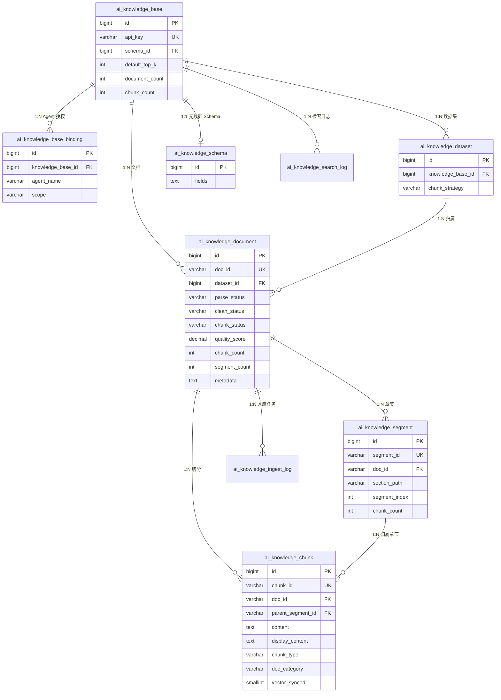
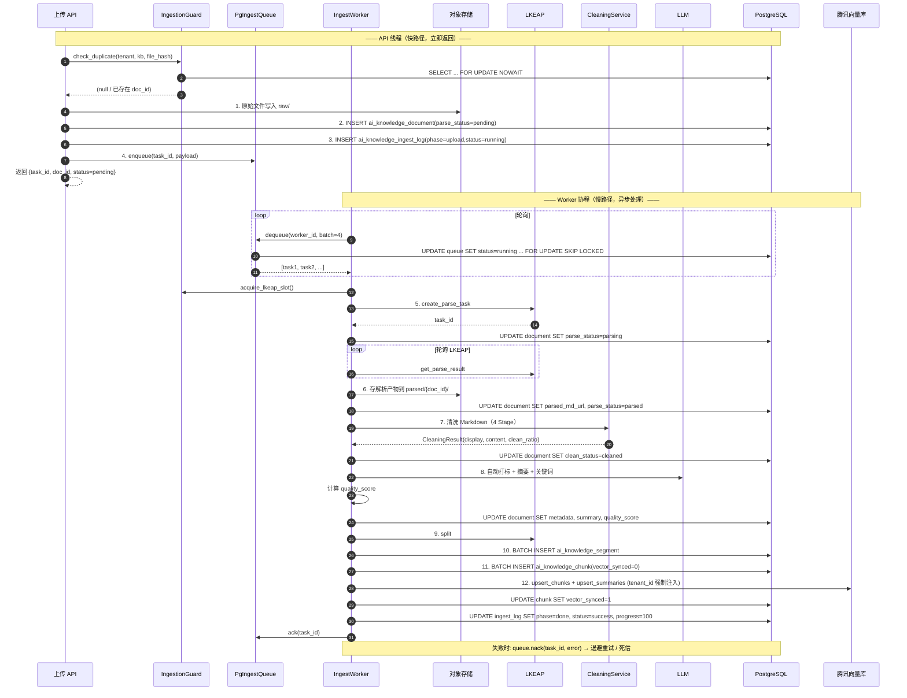
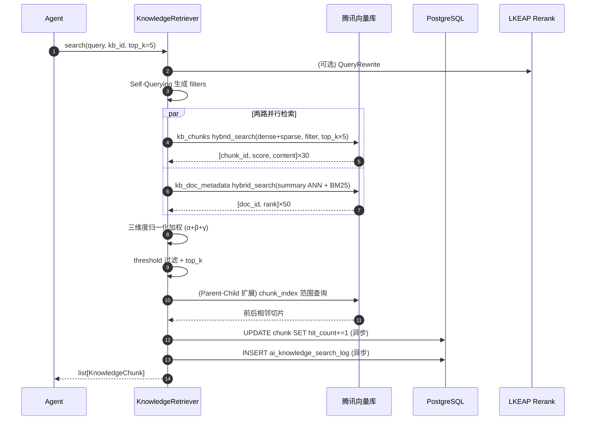

# Agent System 知识库体系设计方案

> 基于腾讯云 LKEAP 文档解析能力 + 现有 AI 知识库产品设计 + agent-system 架构，构建 Agent 可用的知识库体系。
> 与 `2B-Agent-System-DeepAgent-完整设计方案.md` 中的 Plugin/Tool/Skill 边界一致。
> 与 `AI知识库产品设计合集.md` 中的 Agentic RAG 方案衔接。

---

## 一、设计背景与目标

### 1.1 现状（2026-05）

**知识库系统当前能力：**

| 层面 | 现状 | 代码位置 |
|:---|:---|:---|
| 文档解析 | 腾讯云 LKEAP 多模态解析（PDF/DOCX/PPTX/XLSX/图片→Markdown） | `src/knowledge/lkeap_client.py` |
| 文本清洗 | 4 阶段流水线（编码→格式噪声→内容噪声→双层输出） | `src/knowledge/cleaning.py` |
| 文档切分 | 两级切分（Segment 章节聚合 + Chunk 句子级累加，对齐 data-process） | `src/knowledge/ingestion.py` |
| 向量存储 | 腾讯云向量数据库 `kb_chunks`（dense+sparse）+ `kb_doc_metadata`（摘要+BM25+γ属性） | `src/knowledge/vdb_writer.py` |
| 检索引擎 | 全 VDB 两路并行召回 + 三维度归一化加权（α/β/γ） | `src/knowledge/retriever.py` |
| 任务队列 | PG `SKIP LOCKED` 队列 + 向量同步补偿 + 入库进度追踪 | `src/knowledge/worker.py` |
| Agent 工具 | `knowledge_search` Tool 已实现，Agent 可通过自然语言检索 | `src/tools/knowledge_tool.py` |
| 质量评分 | 4 维度加权（完整度/结构度/密度/清洗分），低于 0.4 标记警告 | `src/knowledge/quality.py` |
| 审计日志 | 每次检索写 `ai_knowledge_search_log`，支持效果分析和反馈 | `src/store/knowledge_dao.py` |

**与记忆系统的边界**：知识库和记忆系统是独立的两套体系，不共享存储：
- 记忆系统：PG `ai_agent_memory` + tcvectordb `memories` 集合，短文本片段，按用户维度
- 知识库：PG `ai_knowledge_*` 9 张表 + tcvectordb `kb_chunks` / `kb_doc_metadata` 集合，长文档切片，按租户+知识库维度

### 1.2 设计目标

1. **接入腾讯云 LKEAP 文档解析**：替代本地 pypdf 等低质量解析，支持表格/公式/图片等复杂元素
2. **构建知识库 Plugin**：作为 agent-system 的可插拔基础设施，提供文档入库 + 检索能力
3. **实现 knowledge_search Tool**：让 Agent 能通过自然语言检索知识库
4. **与现有 Agentic RAG 方案对齐**：元数据 Schema、Self-Querying、层级索引等设计复用产品侧方案

### 1.3 与现有系统的关系

```
NeoAgent 平台侧（Java）                    agent-system 侧（Python）
┌─────────────────────┐                   ┌─────────────────────────┐
│ AI 知识库管理        │                   │ knowledge-plugin        │
│ ├─ 知识库 CRUD      │                   │ ├─ DocumentParser       │
│ ├─ 数据集管理       │  ──REST API──→    │ │   (腾讯云 LKEAP)      │
│ ├─ 文档元数据管理   │                   │ ├─ ChunkIndexer         │
│ └─ 入库流水线配置   │                   │ │   (向量+BM25)         │
│                     │                   │ ├─ KnowledgeRetriever   │
│ searchByApp API     │  ←──调用──        │ │   (Self-Querying)     │
│ (扩展 filters)      │                   │ └─ MetadataManager      │
└─────────────────────┘                   │     (Schema 同步)       │
                                          └─────────────────────────┘
                                                    │
                                                    ▼
                                          ┌─────────────────────────┐
                                          │ knowledge_search Tool   │
                                          │ (Agent 直接调用)        │
                                          └─────────────────────────┘
```

**两种部署模式：**
- **模式 A（推荐）**：agent-system 通过 REST API 调用 NeoAgent 平台的 searchByApp 接口，复用平台侧的知识库管理和检索能力
- **模式 B（独立）**：agent-system 内置完整的知识库流水线，独立于 NeoAgent 平台运行（适用于独立部署场景）

本方案同时覆盖两种模式，核心差异在 Plugin 的后端实现。

---

## 二、腾讯云 LKEAP 文档解析接入

### 2.1 LKEAP 能力概览

腾讯云知识引擎原子能力（LKEAP）提供 RAG 流水线中的解耦能力：

| API | 功能 | 模式 | 适用场景 |
|:---|:---|:---|:---|
| `ReconstructDocumentSSE` | 文档解析（同步/SSE） | 准实时 | 实时文档问答，小文件（≤100M） |
| `CreateReconstructDocumentFlow` + `GetReconstructDocumentResult` | 文档解析（异步） | 异步轮询 | 知识库入库，大文件（≤300M） |
| `CreateSplitDocumentFlow` + `GetSplitDocumentResult` | 文档切分 | 异步 | 多级语义切分，提升召回完整性 20% |
| `GetEmbedding` | 文本向量化 | 同步 | 文本转向量 |
| `RunRerank` | 重排序 | 同步 | 检索结果精排 |
| `QueryRewrite` | 多轮改写 | 同步 | 指代消解、省略补全 |

**支持的文件格式：** PDF、DOC/DOCX、PPT/PPTX、XLS/XLSX、WPS、MD、TXT、CSV、HTML、EPUB + 图片格式（PNG/JPG/BMP/GIF/WEBP 等）

**解析能力：** 表格、公式、图片、标题、段落、页眉、页脚 → 智能转换为 Markdown 阅读顺序

### 2.2 接入架构

**TencentLKEAPClient** 封装腾讯云 LKEAP 的所有 API 调用，提供以下能力：

| 方法 | 模式 | 用途 | 适用场景 |
|---|---|---|---|
| `parse_document_async` + `get_parse_result` | 异步轮询 | 文档解析 → Markdown | 知识库入库，大文件 ≤300M |
| `parse_document_sse` | SSE 流式 | 实时解析 + 进度回调 | 用户上传后实时问答，≤100M |
| `split_document_async` + `get_split_result` | 异步轮询 | 多级语义切分 | 替代本地切分（当前未启用） |
| `get_embedding` | 同步 | 文本 → 向量 | 切片/摘要向量化 |
| `rerank` | 同步 | 重排序 | 检索结果精排（可选） |

**初始化参数**：`secret_id`、`secret_key`、`region`（默认 ap-guangzhou）

**代码位置**：`src/knowledge/lkeap_client.py`


### 2.3 数据模型

LKEAP 客户端使用以下数据结构（定义在 `src/knowledge/lkeap_client.py`）：

| 模型 | 用途 | 关键字段 |
|---|---|---|
| `ParseResult` | 文档解析结果 | status(SUCCESS/PROCESSING/FAILED), markdown_url, failed_pages |
| `ParseProgress` | SSE 解析进度 | progress(0~100), is_done |
| `ChunkInfo` | 切片信息 | content, metadata, chunk_type |
| `RerankResult` | 重排序结果 | index, score |

### 2.4 与现有 UploadManager 的整合

现有 `UploadManager.convert_to_markdown()` 使用 pypdf/python-docx 本地解析，质量有限。整合策略：

```
文件上传 → UploadManager.save()
  ├── 图片文件 → 直接存储（不解析）
  ├── 纯文本文件 → 直接读取（.txt/.md/.csv）
  └── 文档文件 → 路由到解析引擎
        ├── LKEAP 可用？ → TencentLKEAPClient.parse_document_sse()
        │                   （高质量：表格/公式/图片描述）
        └── LKEAP 不可用？ → 本地 pypdf/python-docx（降级兜底）
```

**代码位置**：`src/uploads/manager.py`（`EnhancedUploadManager` 继承 `UploadManager`，优先 LKEAP，失败降级本地）

---

## 三、知识库架构设计

### 3.1 整体架构

知识库是 agent-system 的独立子系统，采用 **Provider + Factory** 模式（无独立 Plugin 抽象层）。对外通过两个入口暴露能力：
- **Agent 侧**：`knowledge_search` Tool → 从 langgraph config 获取 Provider
- **HTTP 侧**：`/api/knowledge/*` REST API → 从 `app.state` 获取 Provider

```
┌─────────────────────────────────────────────────────────────────┐
│  Agent                          HTTP Client (前端/管理后台)       │
│    │                                │                           │
│    ▼                                ▼                           │
│  knowledge_search Tool         /api/knowledge/* Router          │
│  (langgraph config 注入)       (app.state 注入)                  │
│    │                                │                           │
│    └────────────┬───────────────────┘                           │
│                 ▼                                               │
│       StandaloneKnowledgeProvider                               │
│       (src/knowledge/standalone_provider.py)                    │
│                 │                                               │
│    ┌────────────┼────────────────────────┐                      │
│    │            │                        │                      │
│    ▼            ▼                        ▼                      │
│  Retriever   Queue+Worker            Guard                     │
│  (检索)      (异步入库)              (去重+限流)                 │
│    │            │                                               │
│    ▼            ▼                                               │
│  ┌──────────────────────────────────────────┐                   │
│  │  VDB (kb_chunks + kb_doc_metadata)       │ ← 检索加速层      │
│  │  PG  (ai_knowledge_* 9 张表)             │ ← 权威数据源      │
│  │  COS (原始文件 + 解析产物)               │ ← 对象存储        │
│  └──────────────────────────────────────────┘                   │
└─────────────────────────────────────────────────────────────────┘
```

### 3.2 KnowledgeProvider 协议

`KnowledgeProvider` 是 `@runtime_checkable` 的 Protocol（代码：`src/knowledge/provider.py`），定义知识库的全部对外能力：

**入库：**

| 方法 | 用途 | 行为 |
|---|---|---|
| `ingest_document(tenant_id, kb_id, file_path, ...)` | 提交入库任务 | 异步入队，立即返回 task_id；Worker 后台处理 |
| `get_ingest_status(task_id)` | 查询入库进度 | 返回 phase/status/progress（供前端轮询） |

**检索：**

| 方法 | 用途 | 行为 |
|---|---|---|
| `search(tenant_id, query, kb_id, filters, top_k, threshold, ...)` | 知识检索 | Self-Querying → 两路召回 → 三维度加权 → threshold 过滤 |

**管理：**

| 方法 | 用途 |
|---|---|
| `list_knowledge_bases(tenant_id)` | 列出租户的知识库 |
| `get_document_info(doc_id)` | 获取文档详情（元数据/状态/质量分） |
| `delete_document(tenant_id, doc_id)` | 删除文档（级联 PG 切片 + VDB 向量） |

当前实现：`StandaloneKnowledgeProvider`（本地完整流水线，LKEAP + PG + VDB + COS）。

### 3.3 HTTP API 层

路由前缀 `/api/knowledge`，由 `knowledge_api.py` 定义，通过 `app.state.knowledge_provider` 获取 Provider：

| 分组 | 路由 | 用途 |
|---|---|---|
| 文档 | `POST /documents/upload` | 上传文件 → 入队 → 返回 task_id |
| | `GET /documents` | 按知识库列出文档 |
| | `GET /documents/{doc_id}` | 文档详情 |
| | `GET /documents/{doc_id}/chunks` | 查看切片（调试用） |
| | `DELETE /documents/{doc_id}` | 删除文档 |
| 知识库 | `POST /` | 创建知识库 |
| | `GET /` | 列出知识库 |
| | `GET /{kb_id}` | 知识库详情 |
| 数据集 | `POST /datasets` | 创建数据集 |
| Schema | `GET /schemas/for-kb/{kb_id}` | 获取 KB 的 Schema（含回退链） |
| 任务 | `GET /tasks/{task_id}` | 查询入库进度 |
| 审计 | `POST /search-logs/feedback` | 提交检索反馈 |
| 运维 | `POST /maintenance/decay-hit-counts` | 手动触发热度衰减 |

Provider 未初始化时，所有接口返回 **503** + 明确错误信息。

### 3.4 knowledge_search Tool

`KnowledgeSearchTool`（`src/tools/builtins/knowledge_tool.py`）是 Agent 调用知识库的唯一入口。

**输入参数**：
- `query`：自然语言检索问题
- `knowledge_base_id`：知识库 ID（可选，不指定则检索全部可访问 KB）
- `top_k`：最大返回数量（1~20，默认 5）
- `doc_category` / `industry` / `business_stage` / `target_audience`：Schema 字段过滤（可选）

**Provider 获取**：从 `langgraph.config.get_config().configurable.knowledge_provider` 运行时注入。同时获取 `tenant_id`、`user_id`、`thread_id`、`trace_id` 等上下文。

**Schema 动态注入**：Tool 的 `description` 在 `tenant_id` 可用时，追加租户专属的元数据字段枚举值（5 分钟缓存），帮助 LLM 在查询中使用受控词汇，提升 Self-Querying 准确率。

### 3.5 异步入库架构

入库采用 **异步入队 + Worker 协程池** 模式，API 调用立即返回，后台处理：

```
API 调用 ingest_document()
    │
    ├─ 1. 计算 file_hash → 去重检查（IngestionGuard）
    ├─ 2. 复制文件到 upload_dir → 上传 COS（可选）
    ├─ 3. 写 PG document 行（parse_status=pending）
    ├─ 4. 写 PG ingest_log 行（phase=upload）
    ├─ 5. 创建 IngestTask → 入队 ai_knowledge_ingest_queue
    └─ 6. 立即返回 IngestResult(task_id, status="pending")

后台 Worker（IngestSupervisor 管理 N 个协程）：
    │
    ├─ dequeue（FOR UPDATE SKIP LOCKED，多 Worker 安全）
    ├─ pipeline.run(task)  ← DocumentIngestionPipeline 四阶段
    ├─ 成功 → ack(task_id)
    └─ 失败 → nack(task_id, error)
         ├─ retry_count < max_retry → 指数退避重试（2^n × 60s）
         └─ retry_count >= max_retry → 标记死信（status=dead）

Reclaimer（每 30s 扫描一次）：
    └─ 找 status=running 且超过 visibility_timeout 的任务 → 重置为 pending
```

**关键组件**：
- `PgIngestQueue`（`queue.py`）：基于 PG `SKIP LOCKED` 的任务队列，无 Redis 依赖
- `IngestionGuard`（`guard.py`）：file_hash 去重 + asyncio.Semaphore LKEAP 并发限流
- `IngestSupervisor`（`worker.py`）：管理 N 个 Worker 协程 + 1 个 Reclaimer 协程
- `DocumentIngestionPipeline`（`ingestion.py`）：实现 `IngestPipeline` 协议的四阶段流水线

### 3.6 启动与关闭

**启动**（`server.py` `@app.on_event("startup")`）：
1. 创建 `KnowledgeSettings`（从环境变量/配置读取凭证）
2. 构建 LLM 实例（可选，用于 Self-Querying + Auto-Tagging）
3. 调用 `build_knowledge_provider(settings, llm)` 组装全部依赖
4. 注入 `app.state.knowledge_provider = provider`
5. `await supervisor.start()` 启动后台 Worker 协程池
6. 启动 `ScheduleRunner`（定时任务：热度衰减、VDB 同步等）
7. 自动写入/升级默认 Schema（幂等）

**关闭**（`@app.on_event("shutdown")`）：
1. `await supervisor.stop(timeout=10)` 优雅停止 Worker，等待在途任务完成

**降级策略**：
- COS 上传失败 → 回退到本地文件路径（不阻塞入库）
- LLM 不可用 → Self-Querying 和 Auto-Tagging 跳过
- Provider 未初始化 → API 返回 503 + 明确提示


---

## 四、文档入库流水线

### 4.1 业务场景

用户上传一份 PDF 产品手册到知识库，系统需要：
1. 把 PDF 转成可检索的文本（表格、公式、图片都要理解）
2. 自动识别文档属于什么类别、适用什么行业
3. 把长文档切成适合检索的小片段（不能切断句子、不能丢失上下文）
4. 建立向量索引和关键词索引，让 Agent 能通过自然语言找到相关内容

整个过程是**异步**的：API 调用立即返回 task_id，后台 Worker 逐步处理，前端可轮询进度。

### 4.2 流水线总览

入库流水线分为 **7 个阶段**，由 `DocumentIngestionPipeline.run(task)` 驱动：

| 阶段 | 名称 | 做什么 | 产出 | 耗时 |
|---|---|---|---|---|
| Phase 1 | 文档解析 | LKEAP 把 PDF/DOCX 转成 Markdown | 结构化文本 + 页数 + 字符数 | 5~30s |
| Phase 1.5 | 文本清洗 | 去噪（页码/水印/乱码/多余空行） | 干净的 display_content + content | <1s |
| Phase 2a | LLM 打标 | 自动分类 + 生成摘要 + 提取关键词 | metadata JSON + summary + keywords | 3~10s |
| Phase 2b | 质量评分 | 评估文档完整度/结构/密度 | quality_score (0~1) | <1s |
| Phase 3 | 两级切分 | Segment 章节聚合 → Chunk 句子级切片 | N 个 chunk（每个 300~500 字符） | <2s |
| Phase 4a | 向量索引 | Embedding + BM25 编码 → 写入 VDB | kb_chunks 集合记录 | 5~20s |
| Phase 4b | 文档元数据索引 | 摘要向量 + 加权 BM25 → 写入 VDB | kb_doc_metadata 集合记录 | 2~5s |

**典型耗时**：一份 20 页 PDF 约 30~60 秒完成全部阶段。

### 4.3 Phase 1：文档解析

**场景**：用户上传了一份包含表格和公式的技术手册 PDF。

**处理**：调用腾讯云 LKEAP `CreateReconstructDocumentFlow` API，异步解析文档：
- 表格 → Markdown 表格格式
- 数学公式 → LaTeX
- 图片 → 图片描述文本（Vision LLM 生成）
- 标题/段落 → 保持层级结构
- 页眉/页脚 → 标注（后续清洗阶段移除）

**支持格式**：PDF、DOC/DOCX、PPT/PPTX、XLS/XLSX、MD、TXT、CSV、HTML、EPUB、图片

**产出**：Markdown 文本 + 解析失败页列表。`ai_knowledge_document.parse_status` 更新为 `done`。

### 4.4 Phase 1.5：文本清洗

**场景**：LKEAP 解析出的 Markdown 可能包含 OCR 噪声、重复页眉、水印文字。

| Stage | 处理内容 | 典型噪声 |
|---|---|---|
| 1. 编码清洗 | BOM/零宽字符/控制字符移除 + NFC 归一化 | `\uFEFF`、`\u200B` |
| 2. 格式噪声 | 页码/页眉页脚/水印关键词移除 | "第 3 页"、"机密" |
| 3. 内容噪声 | 连续空行合并 + 多余空格压缩 + 乱码检测 | 3+ 空行、OCR 乱码行 |
| 4. 双层输出 | 分离展示层和检索层 | — |

**双层输出**：
- `display_content`：保留表格 HTML、图片占位符（前端展示用）
- `content`：纯文本（喂 Embedding 和 BM25）

### 4.5 Phase 2：LLM 打标 + 质量评分

**场景**：系统需要知道这份文档是"产品手册"还是"成功案例"，属于"制造业"还是"金融业"。

#### 自动打标

输入文档前 4000 tokens + 租户的元数据 Schema，LLM 输出：
- **元数据分类**：docCategory、industryVertical、businessStage、targetAudience、productService、datePublished
- **文档摘要**：200~300 字
- **关键词**：LLM 提取最多 10 个 + jieba TF-IDF Top-20 候选词

归一化：LLM 输出值必须匹配 Schema 枚举值。用户手动指定的元数据优先级高于自动打标。

#### 质量评分

`quality_score = 0.3×完整度 + 0.3×结构度 + 0.2×内容密度 + 0.2×清洗分`

低于 **0.4** 的文档标记 `quality_warning`，检索时可选过滤。

### 4.6 Phase 3：两级切分

**场景**：一份 10000 字的产品手册，需要切成 300~500 字的小片段，让检索能精准命中相关段落，同时不丢失章节上下文。

#### 为什么是两级？

直接按固定长度切会导致：切片跨越两个章节、句子被切断、上下文丢失。两级切分解决这些问题：
1. **Segment（章节级）**：先按标题结构切成大段，保证不跨章节
2. **Chunk（句子级）**：在每个 Segment 内按句子累加切片，保证不切断句子
3. **Overlap（重叠）**：相邻 Chunk 有 2 句重叠，避免"断章取义"

#### Segment 切分规则

**参数**：min=3000 / target=4000 / max=6000 字符

**逐行扫描决策流程**：

对文档的每一行，按以下优先级判断是否触发分段：

1. **一级标题 → 强制分段**（不管当前段多短）
   - Markdown `# ` 开头
   - `第X章`、`第X部分`（中文数字或阿拉伯数字均可）
   - `一、`、`二、`...`十、`（中文序号 + 顿号）
   - `1. `、`2. `...`50. `（阿拉伯数字 + 点 + 空格，数字 ≤ 50 防误判列表项）

2. **二级标题 → 当前段已 ≥ min(3000) 才分段**
   - Markdown `## ` 或 `### ` 开头
   - `第X节`、`第X条`
   - `(一)`、`（一）`...（带括号的中文序号）
   - `1.1 `、`2.3.1 `...（多级编号，含 2~4 级）

3. **空行 + 当前段已 > 2000 字符 → 分段**（利用段落自然边界）

4. **当前段超过 max(6000) → 强制切**
   - 从 max 位置往前回溯最多 500 字符，找到最近的句子结束符（`。！？；.!?;\n`）
   - 找不到则硬切在 max 位置

**碎片合并**（切分完成后修复过短段）：
- 第一轮：中间段 < min/2(1500) 字符 → 向下合并到下一段
- 第二轮：尾部段 < min/3(1000) 字符 → 向上合并到上一段

**Segment 产出**：每个 Segment 携带 `segment_id`、`title`（段内首行标题）、`section_path`（如 "第二章 技术参数 / 2.1 量程范围"）、`heading_level`(1/2/0)、`content`。Segment 仅在内存流转，不写入数据库。

#### Chunk 切分规则

**参数**：target=400 / min=100 / max=500 字符 / overlap=2 句

**句子切分规则**（在每个 Segment 内执行）：

按以下字符切分为句子列表，保留标点在句子末尾：
- 中文：`。`（句号）、`！`（感叹号）、`？`（问号）、`；`（分号）→ 直接切
- 英文：`.` → **仅当后面是空格或大写字母时**才算句子结束（避免 `3.14`、`U.S.A.`、`Dr.` 被误切）
- 换行符 `\n` → 切

**逐句累加流程**：

```
对每个句子 s：
  ├─ 单句超长（len(s) > max=500）？
  │   ├─ 当前 chunk 已 ≥ min → 先 flush 当前 chunk
  │   └─ 对超长句子做内部硬切：
  │       每 max 字符切一次，切点往前回溯最多 200 字符找句子边界
  │       找不到则硬切在 max 位置
  │
  ├─ 累加后会超 max？
  │   └─ 是 → flush 当前 chunk
  │
  └─ 累加句子到 current_chunk
      └─ current_len ≥ target(400) 且 ≥ min(100)？
          └─ 是 → flush
```

**flush 操作（切出一个 chunk）**：
1. 把 current_chunk 中的句子拼接为一个 chunk 文本
2. 保留最后 2 个句子作为下一个 chunk 的开头（overlap）
3. 重置 current_chunk = [最后2句]，current_len = len(最后2句)

**尾部处理**：
- 剩余文本 < min(100) 且前面有 chunk → 合并到前一个 chunk
- 剩余文本 ≥ min → 作为独立 chunk

**Overlap 效果示例**：
```
Chunk 1: [句子A, 句子B, 句子C, 句子D, 句子E]  ← 400字符
                                    ↓ 保留最后 2 句
Chunk 2: [句子D, 句子E, 句子F, 句子G, 句子H]  ← 420字符（含重叠）
                                    ↓ 保留最后 2 句
Chunk 3: [句子G, 句子H, 句子I, 句子J]          ← 380字符
```

相邻 Chunk 有 2 句重叠，检索时即使只命中 Chunk 2，也能看到 Chunk 1 尾部的上下文。

#### 切片类型检测

每个 Chunk 自动标注类型（用于前端展示和检索过滤）：

| 类型 | 判断规则 | 示例 |
|---|---|---|
| Table | 包含 5 个以上 `\|` 且有换行 | Markdown 表格 |
| Image_Description | 以 `![` 开头或包含 `data:image` | 图片描述段落 |
| Title | 以 `#` 开头且首行 < 200 字符 | 纯标题段（罕见） |
| Text | 默认 | 普通文本段落 |

#### 每个 Chunk 携带的字段

| 字段 | 来源 | 用途 |
|---|---|---|
| chunk_id | UUID 生成 | 全局唯一标识 |
| doc_id | 父文档 | 关联文档 |
| chunk_index | 全局递增序号 | 排序 + Parent-Child 扩展 |
| content | 切片文本 | 检索 + 展示 |
| content_hash | SHA256(content)[:32] | 去重 |
| content_tokens | 粗略估算 | 统计（中文 1 字符≈1 token，英文 4 字符≈1 token） |
| chunk_type | 自动检测 | Text/Table/Image_Description/Title |
| section_title | Segment 标题 | 展示 |
| section_path | 章节路径 | toc 聚合 + 展示 |
| parent_segment_id | Segment ID | Parent-Child 关联 |
| 元数据字段 | 文档级冗余 | doc_category、industry、business_stage 等（检索过滤用） |

#### 切分效果数值示例

一份 **20 页 PDF 产品手册**（约 15000 字符）：

| 指标 | 典型值 |
|---|---|
| Segment 数量 | 4~6 个（按章节） |
| Chunk 总数 | 35~45 个 |
| 平均 Chunk 长度 | 380 字符 |
| 最短 Chunk | 100 字符（min 兜底） |
| 最长 Chunk | 500 字符（max 限制） |
| Overlap 占比 | ~15%（2 句 ÷ 平均 13 句/chunk） |
| 切分耗时 | < 500ms（纯 CPU，无网络） |

#### toc 字段聚合

切分完成后，聚合所有 Chunk 的 `section_path` 生成文档目录索引（`ai_knowledge_document.toc`）：
- 第 1 行：外部路径（kb_name/dataset_name/file_name）
- 第 2 行起：去重后的内部章节大纲

```
产品手册库/压力仪表/罗斯蒙特3051DG产品样本.pdf
第一章 产品介绍
第二章 技术参数 / 2.1 量程范围
第二章 技术参数 / 2.2 精度等级
第三章 安装指南
```

toc 参与文档级 BM25 检索（β 维度），最大 8000 字符。即使扫描件 PDF 无章节标题，也有第 1 行外部路径作为信号。

### 4.7 Phase 4：混合索引

**场景**：切片已生成，需要建立索引让检索引擎能快速找到相关内容。

**切片级索引**（VDB `kb_chunks` 集合）：
- Dense 向量：LKEAP GetEmbedding 对 chunk.content 生成
- Sparse 向量：BM25Encoder 对 chunk.content 编码
- 元数据字段：tenant_id、kb_id、doc_id、chunk_index、section_title、Schema 字段
- 原文：content 字段直接存入 VDB（检索时直接返回，不回 PG）

**文档级索引**（VDB `kb_doc_metadata` 集合）：
- Dense 向量：文档摘要的 embedding
- Sparse 向量：加权文本 BM25（title×3 + summary×2 + keywords×2 + candidate×1 + toc×1）
- γ 属性：quality_score、search_hit_count、date_published

**三方一致性**：PG chunk 行 → VDB upsert → PG 回填 `vector_synced=1`。VDB 写入失败标记为 2，后台补偿重试，超 5 次标记死信。

### 4.8 入库进度追踪

通过 `ai_knowledge_ingest_log` 表追踪 7 个阶段：upload → parsing → cleaning → tagging → splitting → indexing → done。

前端通过 `GET /api/knowledge/tasks/{task_id}` 轮询进度。

### 4.9 去重与容错

- **文件去重**：SHA256 hash + PG 唯一索引，相同文件直接复用已有 doc_id
- **LKEAP 限流**：asyncio.Semaphore(3) 控制并发
- **崩溃恢复**：Reclaimer 每 30s 扫描超时任务重置为 pending
- **指数退避**：失败任务按 2^n × 60s 延迟重试，最多 3 次


---

## 四·补、存储层设计（PG + 向量库 + 对象存储）

### 4.补.1 设计目标与分层

知识库的存储需要同时满足：**元数据精确查询 + 全文检索 + 语义检索 + 原始文档留档**，单一存储无法承担。参考长期记忆（`ai_agent_memory`）的设计思路，采用**三层存储架构**：

```
┌──────────────────────────────────────────────────────────────────────┐
│                         PostgreSQL（权威数据源）                       │
│                                                                      │
│  ai_knowledge_base          ── 知识库定义（租户维度）                  │
│  ai_knowledge_base_binding  ── 知识库与 Agent 绑定（授权）             │
│  ai_knowledge_dataset       ── 数据集（知识库下的文档分组）            │
│  ai_knowledge_document      ── 文档主表（解析/清洗/切分/打标/质量）    │
│  ai_knowledge_segment       ── ⚠️ 已下线（仅内存 dataclass 保留）       │
│  ai_knowledge_chunk         ── 切片主表（PG 冷备 + 检索走 VDB）         │
│  ai_knowledge_schema        ── 租户元数据 Schema（Self-Querying 依赖） │
│  ai_knowledge_ingest_queue  ── 入库任务队列（SKIP LOCKED 替代 MQ）     │
│  ai_knowledge_ingest_log    ── 入库任务日志（审计 + 重试）             │
│  ai_knowledge_search_log    ── 检索审计日志（效果分析）                │
│                                                                      │
│  特点: 事务一致性 + 复杂查询 + 软删级联 + 内置任务队列                 │
└──────────────────────────────────────────────────────────────────────┘
                             │
                             ▼
┌──────────────────────────────────────────────────────────────────────┐
│                    腾讯云向量数据库（检索加速层）                       │
│                                                                      │
│  Database: knowledge                   ← 全局共享（单库）              │
│  ├─ Collection: kb_chunks              ← 所有切片（含 tenant_id 字段） │
│  └─ Collection: kb_doc_summary         ← 文档级 Summary 向量           │
│                                                                      │
│  租户隔离：tenant_id FilterIndex，所有查询强制注入该过滤条件           │
│  特点: 只存 chunk_id + 向量 + 过滤字段（不存全文），命中后回 PG 取内容  │
└──────────────────────────────────────────────────────────────────────┘
                             │
                             ▼
┌──────────────────────────────────────────────────────────────────────┐
│                       对象存储 / 文件系统                              │
│                                                                      │
│  COS Bucket: knowledge-{tenant_id}                                   │
│  ├─ raw/{doc_id}.{ext}            ← 原始上传文件                      │
│  ├─ parsed/{doc_id}/content.md    ← LKEAP 解析后的 Markdown           │
│  ├─ parsed/{doc_id}/structure.json ← LKEAP 返回的结构化 JSON          │
│  └─ parsed/{doc_id}/images/*.png  ← 解析提取的图片资源                │
│                                                                      │
│  特点: 大文件留档 + 可回溯 + 支持重新切片                              │
└──────────────────────────────────────────────────────────────────────┘
```

**设计原则**：

| 层级 | 角色 | 存什么 | 不存什么 |
|:---|:---|:---|:---|
| PG | 权威数据源 | 所有元数据 + 切片全文 + 向量同步状态 | 向量本身 |
| 向量库 | 检索加速层 | chunk_id + 向量 + 过滤字段 | 切片全文（可选冗余 abstract） |
| 对象存储 | 原始留档 | 原始文件 + 解析产物 + 图片 | 无 |

命中检索后的数据流：`向量库返回 chunk_id → PG 取切片全文 → 按需扩展 Parent-Child 上下文`。

---

### 4.补.2 PostgreSQL 表结构

沿用项目统一约定（`paas_ai` schema、BaseEntity 规范、雪花 BIGINT 主键、毫秒时间戳、`delete_flg` 软删）。

#### 4.补.2.1 ai_knowledge_base — 知识库定义

```sql
SET search_path TO paas_ai;

CREATE TABLE IF NOT EXISTS ai_knowledge_base (
    id              BIGINT       PRIMARY KEY,
    tenant_id       BIGINT       NOT NULL,
    api_key         VARCHAR(100) NOT NULL,            -- 对外 API 标识（如 "product-manual"）
    name            VARCHAR(200) NOT NULL,
    description     VARCHAR(1000) DEFAULT '',
    owner           VARCHAR(100) DEFAULT '',

    -- ── 检索配置 ──
    default_top_k   INT          NOT NULL DEFAULT 5,
    min_score       DECIMAL(5,4) NOT NULL DEFAULT 0.0,
    enable_rerank   SMALLINT     NOT NULL DEFAULT 1,
    enable_self_query SMALLINT   NOT NULL DEFAULT 1,
    enable_query_rewrite SMALLINT NOT NULL DEFAULT 0,

    -- ── 向量库绑定 ──
    vdb_database    VARCHAR(100) NOT NULL DEFAULT '', -- 如 knowledge_1001
    vdb_collection  VARCHAR(100) NOT NULL DEFAULT '', -- 如 kb_chunks

    -- ── 元数据 Schema 绑定 ──
    schema_id       BIGINT       NOT NULL DEFAULT 0,  -- 关联 ai_knowledge_schema.id

    -- ── 统计（冗余字段，写入时更新） ──
    document_count  INT          NOT NULL DEFAULT 0,
    chunk_count     INT          NOT NULL DEFAULT 0,
    total_tokens    BIGINT       NOT NULL DEFAULT 0,

    -- ── 状态 ──
    status          VARCHAR(20)  NOT NULL DEFAULT 'active',  -- active / disabled

    -- ── 审计 ──
    ext_info        TEXT         DEFAULT '{}',
    delete_flg      SMALLINT     NOT NULL DEFAULT 0,
    created_at      BIGINT       NOT NULL,
    created_by      BIGINT       NOT NULL DEFAULT 0,
    updated_at      BIGINT       NOT NULL,
    updated_by      BIGINT       NOT NULL DEFAULT 0
);

CREATE UNIQUE INDEX IF NOT EXISTS uk_kb_apikey
    ON ai_knowledge_base(tenant_id, api_key) WHERE delete_flg = 0;
CREATE INDEX IF NOT EXISTS idx_kb_tenant
    ON ai_knowledge_base(tenant_id, status) WHERE delete_flg = 0;
```

#### 4.补.2.2 ai_knowledge_dataset — 数据集（文档分组）

数据集是知识库下的文档逻辑分组，对应产品侧"数据集"概念（如"2024 产品手册"、"销售话术集"）。

```sql
CREATE TABLE IF NOT EXISTS ai_knowledge_dataset (
    id              BIGINT       PRIMARY KEY,
    tenant_id       BIGINT       NOT NULL,
    knowledge_base_id BIGINT     NOT NULL,           -- 关联 ai_knowledge_base.id
    name            VARCHAR(200) NOT NULL,
    description     VARCHAR(1000) DEFAULT '',

    -- ── 入库默认配置 ──
    default_metadata TEXT        DEFAULT '{}',       -- 该数据集下文档的默认元数据
    chunk_strategy  VARCHAR(32)  NOT NULL DEFAULT 'lkeap', -- lkeap / local_header / sliding_window
    chunk_size      INT          NOT NULL DEFAULT 800,
    chunk_overlap   INT          NOT NULL DEFAULT 200,

    -- ── 统计 ──
    document_count  INT          NOT NULL DEFAULT 0,
    chunk_count     INT          NOT NULL DEFAULT 0,

    status          VARCHAR(20)  NOT NULL DEFAULT 'active',
    ext_info        TEXT         DEFAULT '{}',
    delete_flg      SMALLINT     NOT NULL DEFAULT 0,
    created_at      BIGINT       NOT NULL,
    created_by      BIGINT       NOT NULL DEFAULT 0,
    updated_at      BIGINT       NOT NULL,
    updated_by      BIGINT       NOT NULL DEFAULT 0
);

CREATE INDEX IF NOT EXISTS idx_dataset_kb
    ON ai_knowledge_dataset(tenant_id, knowledge_base_id, delete_flg);
```

#### 4.补.2.2b ai_knowledge_base_binding — 知识库与 Agent 绑定

对齐旧方案 `ai_dataset_app_relation` 的授权模型。控制"哪个 Agent 能看哪些知识库"，避免所有 Agent 默认可见全部 KB 造成数据泄露。

```sql
CREATE TABLE IF NOT EXISTS ai_knowledge_base_binding (
    id              BIGINT       PRIMARY KEY,
    tenant_id       BIGINT       NOT NULL,
    knowledge_base_id BIGINT     NOT NULL,              -- 关联 ai_knowledge_base.id
    agent_name      VARCHAR(100) NOT NULL,              -- Agent 标识（如 "CRM-Agent" / "*" 表示全局可见）
    scope           VARCHAR(20)  NOT NULL DEFAULT 'read',  -- read / write（默认只读）

    -- ── 绑定级别的覆盖配置（可选）──
    override_top_k  INT          NOT NULL DEFAULT 0,    -- 0 表示使用 KB 默认值
    override_filters TEXT        NOT NULL DEFAULT '{}', -- 强制追加的过滤条件（如按业务线收窄）

    -- ── 状态 ──
    status          VARCHAR(20)  NOT NULL DEFAULT 'active',
    delete_flg      SMALLINT     NOT NULL DEFAULT 0,
    created_at      BIGINT       NOT NULL,
    created_by      BIGINT       NOT NULL DEFAULT 0,
    updated_at      BIGINT       NOT NULL,
    updated_by      BIGINT       NOT NULL DEFAULT 0
);

CREATE UNIQUE INDEX IF NOT EXISTS uk_kb_binding
    ON ai_knowledge_base_binding(tenant_id, agent_name, knowledge_base_id)
    WHERE delete_flg = 0;
CREATE INDEX IF NOT EXISTS idx_kb_binding_agent
    ON ai_knowledge_base_binding(tenant_id, agent_name) WHERE delete_flg = 0;
```

**使用方式**：

```python
# knowledge_search Tool 调用时，自动按 agent_name 过滤可访问 KB
def list_available_kbs(tenant_id: int, agent_name: str) -> list[int]:
    return dao.query("""
        SELECT knowledge_base_id FROM ai_knowledge_base_binding
        WHERE tenant_id = %s
          AND (agent_name = %s OR agent_name = '*')
          AND status = 'active' AND delete_flg = 0
    """, (tenant_id, agent_name))

# 如果 search 时未指定 knowledge_base_id，默认检索所有绑定的 KB
# 如果指定了 knowledge_base_id，校验是否在绑定列表中
```

#### 4.补.2.3 ai_knowledge_document — 文档主表

一篇上传文档对应一行。记录解析状态、元数据、摘要，不存切片内容。

```sql
CREATE TABLE IF NOT EXISTS ai_knowledge_document (
    id              BIGINT       PRIMARY KEY,
    doc_id          VARCHAR(64)  NOT NULL,            -- 全局唯一 ID（UUID），与 chunk.doc_id 对应
    tenant_id       BIGINT       NOT NULL,
    knowledge_base_id BIGINT     NOT NULL,
    dataset_id      BIGINT       NOT NULL DEFAULT 0,

    -- ── 文件信息 ──
    title           VARCHAR(500) NOT NULL DEFAULT '',
    file_name       VARCHAR(500) NOT NULL DEFAULT '',
    file_type       VARCHAR(20)  NOT NULL DEFAULT '', -- pdf/docx/xlsx/md/...
    file_size       BIGINT       NOT NULL DEFAULT 0,  -- 字节
    file_hash       VARCHAR(64)  NOT NULL DEFAULT '', -- MD5 / SHA256，用于去重
    raw_url         VARCHAR(1000) NOT NULL DEFAULT '', -- COS 原始文件 URL
    parsed_md_url   VARCHAR(1000) NOT NULL DEFAULT '', -- COS 解析后 Markdown URL
    parsed_json_url VARCHAR(1000) NOT NULL DEFAULT '', -- COS 结构化 JSON URL
    page_count      INT          NOT NULL DEFAULT 0,
    total_chars     INT          NOT NULL DEFAULT 0,  -- 解析后 Markdown 总字符数

    -- ── 解析状态 ──
    parse_status    VARCHAR(20)  NOT NULL DEFAULT 'pending',
                                                      -- pending / parsing / parsed / failed
    parse_task_id   VARCHAR(64)  NOT NULL DEFAULT '', -- LKEAP task_id
    parse_engine    VARCHAR(32)  NOT NULL DEFAULT 'lkeap', -- lkeap / local_pypdf
    parse_error     TEXT         DEFAULT '',
    failed_pages    TEXT         DEFAULT '[]',        -- JSON array

    -- ── 清洗状态（对标旧方案 CleaningResult 的双层文本）──
    clean_status    VARCHAR(20)  NOT NULL DEFAULT 'pending',
                                                      -- pending / cleaning / cleaned / failed
    clean_error     TEXT         DEFAULT '',

    -- ── 切分 / 索引状态 ──
    chunk_status    VARCHAR(20)  NOT NULL DEFAULT 'pending',
                                                      -- pending / splitting / indexed / failed
    chunk_count     INT          NOT NULL DEFAULT 0,
    segment_count   INT          NOT NULL DEFAULT 0,  -- Segment（章节级）数量

    -- ── LLM 自动打标结果 ──
    summary         TEXT         NOT NULL DEFAULT '', -- 200-300 字文档摘要
    keywords        TEXT         NOT NULL DEFAULT '[]', -- JSON array
    metadata        TEXT         NOT NULL DEFAULT '{}', -- 元数据 JSON（docCategory 等）
    metadata_tagged SMALLINT     NOT NULL DEFAULT 0,  -- 是否已自动打标

    -- ── 质量评分（对标旧方案 QualityScoreServiceImpl）──
    quality_score   DECIMAL(5,4) NOT NULL DEFAULT 0.0,  -- 0~1 综合质量分
    quality_signals TEXT         NOT NULL DEFAULT '{}', -- 分项信号 JSON（完整度/结构清晰度/内容密度）

    -- ── 生效时间（元数据中的 datePublished）──
    date_published  BIGINT       NOT NULL DEFAULT 0,  -- 毫秒时间戳

    -- ── 访问统计 ──
    search_hit_count INT         NOT NULL DEFAULT 0,  -- 被检索命中的次数（文档级聚合）

    -- ── 审计 ──
    status          VARCHAR(20)  NOT NULL DEFAULT 'active',  -- active / archived
    ext_info        TEXT         DEFAULT '{}',
    delete_flg      SMALLINT     NOT NULL DEFAULT 0,
    created_at      BIGINT       NOT NULL,
    created_by      BIGINT       NOT NULL DEFAULT 0,
    updated_at      BIGINT       NOT NULL,
    updated_by      BIGINT       NOT NULL DEFAULT 0
);

CREATE UNIQUE INDEX IF NOT EXISTS uk_doc_docid
    ON ai_knowledge_document(doc_id);
CREATE INDEX IF NOT EXISTS idx_doc_kb
    ON ai_knowledge_document(tenant_id, knowledge_base_id, delete_flg);
CREATE INDEX IF NOT EXISTS idx_doc_dataset
    ON ai_knowledge_document(dataset_id, delete_flg);

-- ⚠️ 去重约束：同租户同知识库下，file_hash 不允许重复（由应用层读后写入）
CREATE UNIQUE INDEX IF NOT EXISTS uk_doc_hash
    ON ai_knowledge_document(tenant_id, knowledge_base_id, file_hash)
    WHERE file_hash != '' AND delete_flg = 0;
CREATE INDEX IF NOT EXISTS idx_doc_parse_status
    ON ai_knowledge_document(parse_status, created_at) WHERE delete_flg = 0;
CREATE INDEX IF NOT EXISTS idx_doc_chunk_status
    ON ai_knowledge_document(chunk_status, updated_at) WHERE delete_flg = 0;
CREATE INDEX IF NOT EXISTS idx_doc_quality
    ON ai_knowledge_document(tenant_id, knowledge_base_id, quality_score)
    WHERE delete_flg = 0 AND status = 'active';
```

#### 4.补.2.3b ai_knowledge_segment — 章节级聚合（🔑 对标旧方案 Segment 层）

借鉴旧方案 `ai_dataset_segment + ai_dataset_data` 两级结构：**Segment（章节级，2000~8000 字）** + **Chunk（切片级，300~800 tokens）**。Segment 不参与向量检索，仅作为 Parent-Child 扩展时的"父节点"提供更大上下文。

```sql
CREATE TABLE IF NOT EXISTS ai_knowledge_segment (
    id              BIGSERIAL    PRIMARY KEY,
    segment_id      VARCHAR(64)  NOT NULL,            -- UUID，与 chunk.parent_segment_id 对应
    tenant_id       BIGINT       NOT NULL,
    knowledge_base_id BIGINT     NOT NULL,
    doc_id          VARCHAR(64)  NOT NULL,            -- 关联 ai_knowledge_document.doc_id

    -- ── Segment 内容 ──
    title           VARCHAR(500) NOT NULL DEFAULT '', -- 章节标题
    section_path    VARCHAR(1000) NOT NULL DEFAULT '',-- 标题路径，如 "第一章/1.2 方案"
    content         TEXT         NOT NULL,            -- 章节级全文（Parent-Child 扩展时返回）
    content_tokens  INT          NOT NULL DEFAULT 0,

    -- ── 结构信息 ──
    segment_index   INT          NOT NULL DEFAULT 0,  -- 在文档内的顺序
    heading_level   INT          NOT NULL DEFAULT 0,  -- 标题层级（H1=1, H2=2, ...）
    page_start      INT          NOT NULL DEFAULT 0,
    page_end        INT          NOT NULL DEFAULT 0,
    start_offset    INT          NOT NULL DEFAULT 0,
    end_offset      INT          NOT NULL DEFAULT 0,
    chunk_count     INT          NOT NULL DEFAULT 0,  -- 该 Segment 下切片数量

    delete_flg      SMALLINT     NOT NULL DEFAULT 0,
    created_at      BIGINT       NOT NULL,
    updated_at      BIGINT       NOT NULL
);

CREATE UNIQUE INDEX IF NOT EXISTS uk_segment_segid
    ON ai_knowledge_segment(segment_id);
CREATE INDEX IF NOT EXISTS idx_segment_doc
    ON ai_knowledge_segment(doc_id, segment_index) WHERE delete_flg = 0;
```

**Parent-Child 三级结构**：

```
Document (ai_knowledge_document)
  │
  ├── Segment 1 (ai_knowledge_segment)   ← 章节级：2000~8000 字，H1/H2 边界
  │     ├── Chunk 1.1                   ← 切片级：300~800 tokens
  │     ├── Chunk 1.2
  │     └── Chunk 1.3
  │
  └── Segment 2
        ├── Chunk 2.1
        └── Chunk 2.2

检索命中 Chunk 1.2 → 扩展策略：
  - 轻扩展（默认）：返回 Chunk 1.1 + 1.2 + 1.3（前后 N=1）
  - 重扩展（宏观问题）：返回 Segment 1 整段
```

#### 4.补.2.4 ai_knowledge_chunk — 切片主表（🔑 核心）

切片是检索的最小单元。**PG 存全文 + 元数据 + 向量同步状态**，**向量库只存 id + 向量 + 过滤字段**。

```sql
CREATE TABLE IF NOT EXISTS ai_knowledge_chunk (
    id              BIGSERIAL    PRIMARY KEY,
    chunk_id        VARCHAR(64)  NOT NULL,            -- 全局唯一（UUID），与向量库 id 一致
    tenant_id       BIGINT       NOT NULL,
    knowledge_base_id BIGINT     NOT NULL,
    dataset_id      BIGINT       NOT NULL DEFAULT 0,
    doc_id          VARCHAR(64)  NOT NULL,            -- 关联 ai_knowledge_document.doc_id

    -- ── 切片内容 ──
    content         TEXT         NOT NULL,            -- 检索层文本（纯文本，喂 Embedding）
    display_content TEXT         NOT NULL DEFAULT '', -- 展示层文本（保留表格 HTML / 图片占位，展示用）
    content_hash    VARCHAR(64)  NOT NULL DEFAULT '', -- 去重用
    content_tokens  INT          NOT NULL DEFAULT 0,  -- 估算 token 数

    -- ── 切片定位 ──
    chunk_index     INT          NOT NULL DEFAULT 0,  -- 在文档内的顺序（从 0 起）
    chunk_type      VARCHAR(32)  NOT NULL DEFAULT 'Text',
                                                      -- Text / Table / Image_Description / Title / Summary
    section_title   VARCHAR(500) NOT NULL DEFAULT '', -- 所属章节标题
    section_path    VARCHAR(1000) NOT NULL DEFAULT '',-- 标题路径，如 "一/1.1/段落3"
    page_number     INT          NOT NULL DEFAULT 0,
    start_offset    INT          NOT NULL DEFAULT 0,  -- 在 Markdown 中的起始字符位置
    end_offset      INT          NOT NULL DEFAULT 0,

    -- ── 冗余检索字段（从 document.metadata 下放，加速 Pre-filtering）──
    doc_category    VARCHAR(100) NOT NULL DEFAULT '', -- docCategory
    industry        VARCHAR(100) NOT NULL DEFAULT '', -- industryVertical
    business_stage  VARCHAR(100) NOT NULL DEFAULT '',
    target_audience VARCHAR(100) NOT NULL DEFAULT '',
    product_service VARCHAR(500) NOT NULL DEFAULT '',
    date_published  BIGINT       NOT NULL DEFAULT 0,

    -- ── Parent-Child 关系（宏观/微观切片）──
    parent_chunk_id VARCHAR(64)  NOT NULL DEFAULT '', -- 父切片（如 Summary / 章节）
    parent_segment_id VARCHAR(64) NOT NULL DEFAULT '', -- 所属 Segment（关联 ai_knowledge_segment.segment_id）
    is_summary      SMALLINT     NOT NULL DEFAULT 0,  -- 是否为 Summary 类型

    -- ── 向量库同步 ──
    vector_synced   SMALLINT     NOT NULL DEFAULT 0,  -- 0=未同步, 1=已同步, 2=失败
    vector_error    VARCHAR(500) NOT NULL DEFAULT '',
    embedding_model VARCHAR(100) NOT NULL DEFAULT '', -- 用的哪个 embedding 模型
    embedding_dim   INT          NOT NULL DEFAULT 0,

    -- ── 检索统计（热度）──
    hit_count       INT          NOT NULL DEFAULT 0,  -- 被命中次数
    last_hit_at     BIGINT       NOT NULL DEFAULT 0,

    -- ── 扩展元数据（非核心检索字段，保持灵活）──
    metadata        TEXT         NOT NULL DEFAULT '{}',

    -- ── 审计 ──
    status          VARCHAR(20)  NOT NULL DEFAULT 'active',  -- active / archived
    delete_flg      SMALLINT     NOT NULL DEFAULT 0,
    created_at      BIGINT       NOT NULL,
    updated_at      BIGINT       NOT NULL
);

-- 主键唯一
CREATE UNIQUE INDEX IF NOT EXISTS uk_chunk_chunkid
    ON ai_knowledge_chunk(chunk_id);

-- 按文档拉取切片（按 chunk_index 排序 → 用于 Parent-Child 上下文扩展）
CREATE INDEX IF NOT EXISTS idx_chunk_doc
    ON ai_knowledge_chunk(doc_id, chunk_index) WHERE delete_flg = 0;

-- 按 Segment 拉取切片（Parent-Child 扩展到章节级时使用）
CREATE INDEX IF NOT EXISTS idx_chunk_segment
    ON ai_knowledge_chunk(parent_segment_id) WHERE parent_segment_id != '' AND delete_flg = 0;

-- 按知识库统计
CREATE INDEX IF NOT EXISTS idx_chunk_kb
    ON ai_knowledge_chunk(tenant_id, knowledge_base_id, delete_flg);

-- 向量同步补偿任务（扫未同步的切片）
CREATE INDEX IF NOT EXISTS idx_chunk_vector_sync
    ON ai_knowledge_chunk(vector_synced, updated_at)
    WHERE vector_synced IN (0, 2) AND delete_flg = 0;

-- 按元数据过滤（当向量库过滤不够精细时降级到 PG）
CREATE INDEX IF NOT EXISTS idx_chunk_category
    ON ai_knowledge_chunk(tenant_id, knowledge_base_id, doc_category)
    WHERE delete_flg = 0;

-- BM25 倒排索引（实际 BM25 检索已迁移到 VDB sparse_vector，此 GIN 索引仅作备用）
CREATE INDEX IF NOT EXISTS idx_chunk_fts
    ON ai_knowledge_chunk USING GIN (to_tsvector('simple', content))
    WHERE delete_flg = 0;
```

> **BM25 选型说明**：知识库的 BM25 检索已全部迁移到腾讯云向量数据库的 SparseIndex（`kb_chunks.sparse_vector`），不再使用 SQLite FTS5 或 PG GIN。PG 侧的 GIN 索引仅作为极端降级场景的备用。

#### 4.补.2.5 ai_knowledge_schema — 元数据 Schema

每租户一份（或每知识库一份），驱动 LLM 自动打标 + Self-Querying。

```sql
CREATE TABLE IF NOT EXISTS ai_knowledge_schema (
    id              BIGINT       PRIMARY KEY,
    tenant_id       BIGINT       NOT NULL,
    name            VARCHAR(100) NOT NULL,              -- 如 "default" / "crm_schema"
    knowledge_base_id BIGINT     NOT NULL DEFAULT 0,    -- 0 表示租户默认，否则绑定特定 KB

    -- ── Schema 定义（JSON）──
    -- 格式: [{field: "docCategory", type: "enum", required: true,
    --        description: "...", enum: ["产品手册","成功案例",...]},
    --       {field: "datePublished", type: "date", required: false}, ...]
    fields          TEXT         NOT NULL DEFAULT '[]',

    version         INT          NOT NULL DEFAULT 1,
    status          VARCHAR(20)  NOT NULL DEFAULT 'active',
    delete_flg      SMALLINT     NOT NULL DEFAULT 0,
    created_at      BIGINT       NOT NULL,
    created_by      BIGINT       NOT NULL DEFAULT 0,
    updated_at      BIGINT       NOT NULL,
    updated_by      BIGINT       NOT NULL DEFAULT 0
);

CREATE UNIQUE INDEX IF NOT EXISTS uk_schema_name
    ON ai_knowledge_schema(tenant_id, name, knowledge_base_id) WHERE delete_flg = 0;
```

**系统内置默认 Schema（19 字段，较全面版）**

当知识库未绑定自定义 Schema 时，Phase 2 打标会回退到内置默认字段，对齐 CRM/通用企业场景。字段来源：`src/knowledge/ingestion.py::_DEFAULT_SCHEMA_FIELDS`，前端"加载默认"按钮同步注入。

> **行业视角评审结论**：19 字段覆盖了「核心分类 / 业务维度 / 访问控制 / 内容形态 / 时效 & 生命周期 / 来源治理」6 大维度，对齐 Dublin Core、TLP、ISO 9001/27001、SharePoint Syntex、Guru、Confluence、Highspot 等主流实践。综合借鉴度 **4.1 / 5.0**（19 项中 12 项 ≥ 4 星），作为多租户 SaaS 开箱即用默认值合适；强合规行业（银行/医疗/军工）需要租户侧自行加载"合规扩展包"（见文末「行业扩展建议」）。

| # | 分类 | 字段 | 类型 | 必填 | 默认值 | 借鉴度 | 枚举值 / 说明 |
|---|---|---|---|---|---|---|---|
| 01 | **核心分类** | `docCategory` | enum(16) | ✅ | — | ⭐⭐⭐⭐⭐ | 产品手册/技术白皮书/解决方案/成功案例/销售话术/培训材料/FAQ/内部政策/竞品分析/合同模板/行业报告/操作指南/API 文档/会议纪要/客户沟通记录/其他。检索过滤第一主维度（对齐 SharePoint "Document Type"）|
| 02 | **业务维度** | `industryVertical` | enum(15) | ○ | — | ⭐⭐⭐⭐ | 制造业/金融服务/互联网/医疗健康/教育培训/零售消费/能源化工/政府公共/房地产/物流运输/农林牧渔/批发贸易/建筑工程/文化娱乐/通用跨行业。单行业租户可关闭 |
| 03 | | `businessStage` | enum(14) | ○ | — | ⭐⭐⭐⭐⭐ | 市场推广/线索获取/售前咨询/需求调研/方案设计/产品演示/商务谈判/合同签订/实施交付/上线培训/售后服务/客户成功/续费拓展/通用。销售使能核心维度（对齐 HubSpot Deal Stage / Highspot Sales Stage）|
| 04 | | `targetAudience` | enum(15) | ○ | — | ⭐⭐⭐⭐ | CEO/COO · CFO · CIO/CTO · 业务负责人 · 销售负责人 · 一线销售 · 市场人员 · 实施顾问 · 技术人员 · 运维人员 · 产品经理 · 终端用户 · 财务人员 · 人事行政 · 通用 |
| 05 | | `productService` | string | ○ | — | ⭐⭐⭐ | 涉及的产品/服务名称，多个用逗号分隔（租户特有，故不枚举）|
| 06 | | `businessFunction` | enum(17) | ○ | — | ⭐⭐⭐⭐⭐ | 销售/市场/售前/交付实施/客户成功/产品/研发/运维/客服/财务/人力资源/法务合规/采购供应链/行政/IT信息化/战略投资/通用。跨职能检索缺它不行（对齐 M365 Viva Topics）|
| 07 | | `region` | enum(9) | ○ | 中国大陆 | ⭐⭐⭐⭐ | 中国大陆/港澳台/北美/欧洲/亚太不含大中华/中东/拉美/非洲/全球跨区域。国际化客户可下钻到国家（租户自扩展）|
| 08 | **访问控制** | `confidentiality` | enum(4) | ○ | 内部 | ⭐⭐⭐⭐⭐ | 公开/内部/机密/绝密。对齐 TLP（CLEAR/GREEN/AMBER/RED）+ ISO 27001 信息分级，**行业刚需** |
| 09 | | `audience_scope` | enum(8) | ○ | — | ⭐⭐⭐ | 全公司/销售团队/售前团队/实施团队/技术团队/客服团队/管理层/合作伙伴。**与 `confidentiality` 职责分离**：级别决定"能否看见"，范围决定"应被推送给谁" |
| 10 | **内容形态** | `contentFormat` | enum(8) | ○ | — | ⭐⭐⭐ | 纯文本/图文混合/表格密集/流程图/代码示例/视频音频转写/数据报告/长文档。**后续演进**：由 MIME + 解析结果自动推导，减少人工判断偏差 |
| 11 | | `language` | enum(4) | ○ | 中文 | ⭐⭐⭐⭐ | 中文/英文/中英混合/其他（对齐 ISO 639-1；跨国客户可扩展到 BCP-47）|
| 12 | **时效 & 生命周期** | `datePublished` | date | ○ | — | ⭐⭐⭐⭐⭐ | YYYY-MM-DD，**参与 γ 维度时效性衰减**（对齐 Dublin Core `dc:date.issued`）|
| 13 | | `dateExpires` | date | ○ | — | ⭐⭐⭐⭐⭐ | YYYY-MM-DD，过期文档做 filter 排除（GDPR / ISO 27001 Retention 对齐）|
| 14 | | `version` | string | ○ | — | ⭐⭐⭐⭐ | 文档版本号，如 v1.2.3 / 2024Q2（对齐 Dublin Core `dc:hasVersion`）|
| 15 | | `documentStatus` | enum(6) | ○ | 已发布 | ⭐⭐⭐⭐⭐ | 草稿/审核中/已发布/已更新/已归档/已废弃。知识治理必需，`已废弃`被检索前置过滤（对齐 Confluence Workflow）|
| 16 | | `reviewCycle` | enum(6) | ○ | 年度 | ⭐⭐⭐⭐ | 无需复审/季度/半年/年度/两年/按需（对齐 ISO 9001 文件受控周期 / HIPAA 年度复审）|
| 17 | **来源与治理** | `source` | enum(9) | ○ | 内部原创 | ⭐⭐⭐⭐ | 内部原创/内部汇编/客户提供/合作伙伴/外部采购/公开资料/监管标准机构/AI 生成/其他。影响可信度与引用策略，"AI 生成"标签助力对抗幻觉 |
| 18 | **自由文本** | `tags` | string | ○ | — | ⭐⭐⭐ | 自由标签，多个用逗号分隔 |
| 19 | | `author` | string | ○ | — | ⭐⭐⭐⭐ | 作者/归属部门（对齐 Dublin Core `dc:creator`，问责追溯必备）|

**打分规则**：全部字段都**不直接参与 α/β/γ 打分**（Schema 字段只做 filter 硬过滤），但 `datePublished` 通过映射到 `ai_knowledge_document.date_published` 字段间接进入 γ 维度 C2 时效性；`documentStatus=已废弃` 会被检索前置过滤掉。

**行业扩展建议（不入默认，留给租户按需加载）**：

| 字段 | 类型 | 适用行业 | 行业标准对照 |
|---|---|---|---|
| `legalBasis` | enum | 法务、金融合规 | GDPR / 等保 / SOX / PCI-DSS |
| `piiLevel` | enum | 医疗、金融、HR | HIPAA / 个保法（一般/敏感/特殊）|
| `approvalWorkflow` | string | 制造、政府 | ISO 9001 受控文件编号 |
| `businessCriticality` | enum | IT 运维、SaaS | ITIL（P0/P1/P2/P3）|
| `knowledgeAssetType` | enum | KM 研究派 | 显性/隐性 · 结构化/非结构化 |

**参与的打分/检索逻辑详见 §5.4.5**。

#### 4.补.2.6 ai_knowledge_ingest_log — 入库任务日志

一次上传对应一条，供重试、审计、进度展示。

```sql
CREATE TABLE IF NOT EXISTS ai_knowledge_ingest_log (
    id              BIGINT       PRIMARY KEY,
    tenant_id       BIGINT       NOT NULL,
    knowledge_base_id BIGINT     NOT NULL,
    dataset_id      BIGINT       NOT NULL DEFAULT 0,
    doc_id          VARCHAR(64)  NOT NULL DEFAULT '',   -- 任务完成后回填

    -- ── 任务属性 ──
    task_id         VARCHAR(64)  NOT NULL,              -- 本任务唯一 ID
    file_name       VARCHAR(500) NOT NULL DEFAULT '',
    file_size       BIGINT       NOT NULL DEFAULT 0,
    file_type       VARCHAR(20)  NOT NULL DEFAULT '',

    -- ── 阶段状态（每阶段独立）──
    phase           VARCHAR(32)  NOT NULL DEFAULT 'upload',
                                 -- upload / parsing / cleaning / tagging / splitting / indexing / done / failed
    status          VARCHAR(20)  NOT NULL DEFAULT 'running',
                                 -- running / success / failed
    progress        INT          NOT NULL DEFAULT 0,    -- 0~100

    -- ── 耗时统计 ──
    parse_duration_ms    INT     NOT NULL DEFAULT 0,
    clean_duration_ms    INT     NOT NULL DEFAULT 0,
    tagging_duration_ms  INT     NOT NULL DEFAULT 0,
    split_duration_ms    INT     NOT NULL DEFAULT 0,
    index_duration_ms    INT     NOT NULL DEFAULT 0,
    total_duration_ms    INT     NOT NULL DEFAULT 0,

    -- ── 输出统计 ──
    total_chars     INT          NOT NULL DEFAULT 0,
    segment_count   INT          NOT NULL DEFAULT 0,
    chunk_count     INT          NOT NULL DEFAULT 0,
    vector_count    INT          NOT NULL DEFAULT 0,
    quality_score   DECIMAL(5,4) NOT NULL DEFAULT 0.0,

    error_message   TEXT         DEFAULT '',
    retry_count     INT          NOT NULL DEFAULT 0,

    start_time      BIGINT       NOT NULL,
    end_time        BIGINT       NOT NULL DEFAULT 0,
    delete_flg      SMALLINT     NOT NULL DEFAULT 0,
    created_at      BIGINT       NOT NULL,
    created_by      BIGINT       NOT NULL DEFAULT 0
);

CREATE UNIQUE INDEX IF NOT EXISTS uk_ingest_task
    ON ai_knowledge_ingest_log(task_id);
CREATE INDEX IF NOT EXISTS idx_ingest_kb
    ON ai_knowledge_ingest_log(tenant_id, knowledge_base_id, start_time DESC);
CREATE INDEX IF NOT EXISTS idx_ingest_status
    ON ai_knowledge_ingest_log(status, phase, start_time DESC);
```

#### 4.补.2.7 ai_knowledge_search_log — 检索审计日志

记录每次知识库检索，用于效果分析、命中率统计、坏例挖掘。

```sql
CREATE TABLE IF NOT EXISTS ai_knowledge_search_log (
    id              BIGINT       PRIMARY KEY,
    tenant_id       BIGINT       NOT NULL,
    knowledge_base_id BIGINT     NOT NULL,
    user_id         VARCHAR(64)  NOT NULL DEFAULT '',
    thread_id       VARCHAR(64)  NOT NULL DEFAULT '',
    trace_id        VARCHAR(64)  NOT NULL DEFAULT '',

    -- ── 查询 ──
    raw_query       TEXT         NOT NULL DEFAULT '',   -- 原始用户查询
    rewritten_query TEXT         NOT NULL DEFAULT '',   -- 改写后的查询
    semantic_query  TEXT         NOT NULL DEFAULT '',   -- Self-Querying 提取的语义查询
    filters         TEXT         NOT NULL DEFAULT '{}', -- Self-Querying 生成的 filters

    -- ── 结果 ──
    hit_chunk_ids   TEXT         NOT NULL DEFAULT '[]', -- JSON array
    hit_count       INT          NOT NULL DEFAULT 0,
    top_score       DECIMAL(10,6) NOT NULL DEFAULT 0,
    vector_hit_count INT         NOT NULL DEFAULT 0,
    bm25_hit_count  INT          NOT NULL DEFAULT 0,

    -- ── 耗时（ms） ──
    rewrite_ms      INT          NOT NULL DEFAULT 0,
    self_query_ms   INT          NOT NULL DEFAULT 0,
    vector_search_ms INT         NOT NULL DEFAULT 0,
    bm25_search_ms  INT          NOT NULL DEFAULT 0,
    rerank_ms       INT          NOT NULL DEFAULT 0,
    total_ms        INT          NOT NULL DEFAULT 0,

    -- ── 反馈（事后填充）──
    user_feedback   VARCHAR(20)  NOT NULL DEFAULT '',   -- good / bad / ''
    feedback_comment TEXT        DEFAULT '',

    delete_flg      SMALLINT     NOT NULL DEFAULT 0,
    created_at      BIGINT       NOT NULL
);

CREATE INDEX IF NOT EXISTS idx_search_log_kb
    ON ai_knowledge_search_log(tenant_id, knowledge_base_id, created_at DESC);
CREATE INDEX IF NOT EXISTS idx_search_log_trace
    ON ai_knowledge_search_log(trace_id) WHERE trace_id != '';
CREATE INDEX IF NOT EXISTS idx_search_log_feedback
    ON ai_knowledge_search_log(tenant_id, user_feedback, created_at DESC)
    WHERE user_feedback != '';
```

#### 4.补.2.8 表关系 ER 图



---

### 4.补.3 Python 数据模型（dataclass）

对齐现有 `src/store/models.py` 的风格，新增文件 `src/store/knowledge_models.py`：

```python
"""知识库数据模型 — 对应 paas_ai.ai_knowledge_* 表"""
from __future__ import annotations

import time
from dataclasses import dataclass, field
from .snowflake import next_id


@dataclass
class KnowledgeBaseRow:
    id: int = 0
    tenant_id: int = 0
    api_key: str = ""
    name: str = ""
    description: str = ""
    owner: str = ""
    default_top_k: int = 5
    min_score: float = 0.0
    enable_rerank: int = 1
    enable_self_query: int = 1
    enable_query_rewrite: int = 0
    vdb_database: str = ""
    vdb_collection: str = ""
    schema_id: int = 0
    document_count: int = 0
    chunk_count: int = 0
    total_tokens: int = 0
    status: str = "active"
    ext_info: str = "{}"
    delete_flg: int = 0
    created_at: int = 0
    created_by: int = 0
    updated_at: int = 0
    updated_by: int = 0

    def __post_init__(self):
        if not self.id:
            self.id = next_id()
        now = int(time.time() * 1000)
        if not self.created_at:
            self.created_at = now
        if not self.updated_at:
            self.updated_at = now


@dataclass
class KnowledgeDatasetRow:
    id: int = 0
    tenant_id: int = 0
    knowledge_base_id: int = 0
    name: str = ""
    description: str = ""
    default_metadata: str = "{}"
    chunk_strategy: str = "lkeap"
    chunk_size: int = 800
    chunk_overlap: int = 200
    document_count: int = 0
    chunk_count: int = 0
    status: str = "active"
    ext_info: str = "{}"
    delete_flg: int = 0
    created_at: int = 0
    created_by: int = 0
    updated_at: int = 0
    updated_by: int = 0

    def __post_init__(self):
        if not self.id:
            self.id = next_id()
        now = int(time.time() * 1000)
        self.created_at = self.created_at or now
        self.updated_at = self.updated_at or now


@dataclass
class KnowledgeBaseBindingRow:
    """知识库与 Agent 的授权绑定"""
    id: int = 0
    tenant_id: int = 0
    knowledge_base_id: int = 0
    agent_name: str = ""
    scope: str = "read"
    override_top_k: int = 0
    override_filters: str = "{}"
    status: str = "active"
    delete_flg: int = 0
    created_at: int = 0
    created_by: int = 0
    updated_at: int = 0
    updated_by: int = 0

    def __post_init__(self):
        if not self.id:
            self.id = next_id()
        now = int(time.time() * 1000)
        self.created_at = self.created_at or now
        self.updated_at = self.updated_at or now


@dataclass
class KnowledgeSegmentRow:
    """章节级聚合 — 对应 ai_knowledge_segment 表"""
    id: int = 0
    segment_id: str = ""
    tenant_id: int = 0
    knowledge_base_id: int = 0
    doc_id: str = ""
    title: str = ""
    section_path: str = ""
    content: str = ""
    content_tokens: int = 0
    segment_index: int = 0
    heading_level: int = 0
    page_start: int = 0
    page_end: int = 0
    start_offset: int = 0
    end_offset: int = 0
    chunk_count: int = 0
    delete_flg: int = 0
    created_at: int = 0
    updated_at: int = 0

    def __post_init__(self):
        now = int(time.time() * 1000)
        self.created_at = self.created_at or now
        self.updated_at = self.updated_at or now


@dataclass
class KnowledgeDocumentRow:
    id: int = 0
    doc_id: str = ""
    tenant_id: int = 0
    knowledge_base_id: int = 0
    dataset_id: int = 0
    title: str = ""
    file_name: str = ""
    file_type: str = ""
    file_size: int = 0
    file_hash: str = ""
    raw_url: str = ""
    parsed_md_url: str = ""
    parsed_json_url: str = ""
    page_count: int = 0
    total_chars: int = 0
    parse_status: str = "pending"
    parse_task_id: str = ""
    parse_engine: str = "lkeap"
    parse_error: str = ""
    failed_pages: str = "[]"
    clean_status: str = "pending"
    clean_error: str = ""
    chunk_status: str = "pending"
    chunk_count: int = 0
    segment_count: int = 0
    summary: str = ""
    keywords: str = "[]"
    metadata: str = "{}"
    metadata_tagged: int = 0
    quality_score: float = 0.0
    quality_signals: str = "{}"
    date_published: int = 0
    search_hit_count: int = 0
    status: str = "active"
    ext_info: str = "{}"
    delete_flg: int = 0
    created_at: int = 0
    created_by: int = 0
    updated_at: int = 0
    updated_by: int = 0

    def __post_init__(self):
        if not self.id:
            self.id = next_id()
        now = int(time.time() * 1000)
        self.created_at = self.created_at or now
        self.updated_at = self.updated_at or now


@dataclass
class KnowledgeChunkRow:
    id: int = 0
    chunk_id: str = ""
    tenant_id: int = 0
    knowledge_base_id: int = 0
    dataset_id: int = 0
    doc_id: str = ""
    content: str = ""
    display_content: str = ""
    content_hash: str = ""
    content_tokens: int = 0
    chunk_index: int = 0
    chunk_type: str = "Text"
    section_title: str = ""
    section_path: str = ""
    page_number: int = 0
    start_offset: int = 0
    end_offset: int = 0
    doc_category: str = ""
    industry: str = ""
    business_stage: str = ""
    target_audience: str = ""
    product_service: str = ""
    date_published: int = 0
    parent_chunk_id: str = ""
    parent_segment_id: str = ""
    is_summary: int = 0
    vector_synced: int = 0
    vector_error: str = ""
    embedding_model: str = ""
    embedding_dim: int = 0
    hit_count: int = 0
    last_hit_at: int = 0
    metadata: str = "{}"
    status: str = "active"
    delete_flg: int = 0
    created_at: int = 0
    updated_at: int = 0

    def __post_init__(self):
        now = int(time.time() * 1000)
        self.created_at = self.created_at or now
        self.updated_at = self.updated_at or now


@dataclass
class KnowledgeIngestQueueRow:
    """入库任务队列 — 对应 ai_knowledge_ingest_queue 表"""
    id: int = 0
    task_id: str = ""
    tenant_id: int = 0
    knowledge_base_id: int = 0
    dataset_id: int = 0
    payload: str = "{}"
    status: str = "pending"
    priority: int = 0
    available_at: int = 0
    picked_at: int = 0
    picked_by: str = ""
    completed_at: int = 0
    retry_count: int = 0
    max_retry: int = 3
    last_error: str = ""
    visibility_timeout_ms: int = 600_000
    created_at: int = 0
    updated_at: int = 0

    def __post_init__(self):
        now = int(time.time() * 1000)
        self.created_at = self.created_at or now
        self.updated_at = self.updated_at or now
        self.available_at = self.available_at or now


@dataclass
class KnowledgeIngestLogRow:
    id: int = 0
    tenant_id: int = 0
    knowledge_base_id: int = 0
    dataset_id: int = 0
    doc_id: str = ""
    task_id: str = ""
    file_name: str = ""
    file_size: int = 0
    file_type: str = ""
    phase: str = "upload"
    status: str = "running"
    progress: int = 0
    parse_duration_ms: int = 0
    clean_duration_ms: int = 0
    tagging_duration_ms: int = 0
    split_duration_ms: int = 0
    index_duration_ms: int = 0
    total_duration_ms: int = 0
    total_chars: int = 0
    segment_count: int = 0
    chunk_count: int = 0
    vector_count: int = 0
    quality_score: float = 0.0
    error_message: str = ""
    retry_count: int = 0
    start_time: int = 0
    end_time: int = 0
    delete_flg: int = 0
    created_at: int = 0
    created_by: int = 0

    def __post_init__(self):
        if not self.id:
            self.id = next_id()
        now = int(time.time() * 1000)
        self.created_at = self.created_at or now
        self.start_time = self.start_time or now


@dataclass
class KnowledgeSearchLogRow:
    id: int = 0
    tenant_id: int = 0
    knowledge_base_id: int = 0
    user_id: str = ""
    thread_id: str = ""
    trace_id: str = ""
    raw_query: str = ""
    rewritten_query: str = ""
    semantic_query: str = ""
    filters: str = "{}"
    hit_chunk_ids: str = "[]"
    hit_count: int = 0
    top_score: float = 0.0
    vector_hit_count: int = 0
    bm25_hit_count: int = 0
    rewrite_ms: int = 0
    self_query_ms: int = 0
    vector_search_ms: int = 0
    bm25_search_ms: int = 0
    rerank_ms: int = 0
    total_ms: int = 0
    user_feedback: str = ""
    feedback_comment: str = ""
    delete_flg: int = 0
    created_at: int = 0

    def __post_init__(self):
        if not self.id:
            self.id = next_id()
        self.created_at = self.created_at or int(time.time() * 1000)
```

---

### 4.补.4 腾讯云向量数据库设计

#### 4.补.4.1 数据库与集合布局

**租户隔离策略**：采用"**单库共享 + FilterIndex 字段隔离**"，对齐项目现有 `VikingFS` 使用 `viking_memory` 单库 + `user_id` 过滤的模式。相比"每租户一库"，简化了库管理、连接复用、配额控制。

```
Database: knowledge                        ← 全局共享（不含 tenant_id 后缀）
  ├── Collection: kb_chunks                ← 所有租户切片向量 + BM25 稀疏向量
  └── Collection: kb_doc_summary           ← 所有租户文档级摘要向量
```

**租户隔离由 Collection 内的 `tenant_id` FilterIndex 保证**：

- 所有检索必须携带 `tenant_id = "xxx"` 过滤条件，由 `KnowledgeVectorStore` 在调用层强制注入
- `tenant_id` 为 `FilterIndex`，查询性能与独立库相当
- 跨租户数据不可见（应用层 + VDB Filter 双保险）

> **何时拆库**：单 Collection 切片规模超 5000 万、或某租户独占资源时，再按 `knowledge_{tenant_id}` 拆库。届时只需调整 `KnowledgeVectorStore._db_name` 构造逻辑，数据模型无变化。

#### 4.补.4.2 Collection `kb_chunks` 字段设计

复用 `VikingFS._VectorDB._ensure_collection` 的索引模式（`HNSW + Sparse + FilterIndex`）。**`tenant_id` 作为首要 FilterIndex 必须命中**：

```python
from tcvectordb.model.index import Index, VectorIndex, FilterIndex, HNSWParams, SparseIndex
from tcvectordb.model.enum import FieldType, IndexType, MetricType

KB_CHUNK_INDEX = Index(
    # ── 主键 ──
    FilterIndex(name="id",              field_type=FieldType.String, index_type=IndexType.PRIMARY_KEY),

    # ── 向量索引 ──
    VectorIndex(
        name="vector",
        dimension=1024,                  # lke-text-embedding-v1 的 1024 维
        index_type=IndexType.HNSW,
        metric_type=MetricType.COSINE,
        params=HNSWParams(m=16, efconstruction=200),
    ),
    # BM25 稀疏向量（混合检索）
    SparseIndex(name="sparse_vector"),

    # ── 租户隔离（🔑 所有查询必须命中）──
    FilterIndex(name="tenant_id",        field_type=FieldType.String, index_type=IndexType.FILTER),

    # ── 业务过滤字段（Pre-filtering）──
    FilterIndex(name="knowledge_base_id",field_type=FieldType.String, index_type=IndexType.FILTER),
    FilterIndex(name="dataset_id",       field_type=FieldType.String, index_type=IndexType.FILTER),
    FilterIndex(name="doc_id",           field_type=FieldType.String, index_type=IndexType.FILTER),
    FilterIndex(name="chunk_type",       field_type=FieldType.String, index_type=IndexType.FILTER),
    FilterIndex(name="doc_category",     field_type=FieldType.String, index_type=IndexType.FILTER),
    FilterIndex(name="industry",         field_type=FieldType.String, index_type=IndexType.FILTER),
    FilterIndex(name="business_stage",   field_type=FieldType.String, index_type=IndexType.FILTER),
    FilterIndex(name="target_audience",  field_type=FieldType.String, index_type=IndexType.FILTER),
    FilterIndex(name="product_service",  field_type=FieldType.String, index_type=IndexType.FILTER),
    FilterIndex(name="status",           field_type=FieldType.String, index_type=IndexType.FILTER),
    FilterIndex(name="date_published",   field_type=FieldType.UInt64, index_type=IndexType.FILTER),
)
```

#### 4.补.4.3 切片 Document 结构

```python
{
  "id":                 "chunk_a1b2c3d4",         # ← == PG.ai_knowledge_chunk.chunk_id
  "vector":             [0.01, -0.03, ...],       # 1024 维 dense embedding
  "sparse_vector":      {...},                    # BM25 稀疏向量（tcvdb_text 自动生成）

  # ── 租户隔离字段（🔑 必填）──
  "tenant_id":          "1001",

  # ── 过滤字段（全部 String，数字字段除外）──
  "knowledge_base_id":  "2001",
  "dataset_id":         "3001",
  "doc_id":             "doc_xyz",
  "chunk_type":         "Text",                   # Text/Table/Image_Description/Title/Summary
  "doc_category":       "成功案例",
  "industry":           "制造业",
  "business_stage":     "方案设计",
  "target_audience":    "高管决策者",
  "product_service":    "CRM",
  "status":             "active",
  "date_published":     1714348800000,             # UInt64 毫秒时间戳

  # ── 冗余展示字段（检索命中后可直接用，不回 PG 时使用）──
  "abstract":           "（切片前 200 字摘要，可选）",
  "section_title":      "第三章 落地效果",
  "chunk_index":        12
}
```

**重要约定**：向量库**不存 content 全文**，只存切片必要的过滤字段和一小段 `abstract`（≤200 字）用于快速展示。命中后通过 `chunk_id` 回 PG 取 `content + section_path + ...`。

> 权衡：冗余 `abstract` 一份可避免对每个命中切片都访问 PG；全文 `content` 经常超 1KB，冗余到向量库会显著增加存储和网络开销。

#### 4.补.4.4 Collection `kb_doc_summary` 字段设计

文档级摘要向量，用于"宏观问题"检索（如"有哪些制造业客户案例？"）。

```python
KB_DOC_SUMMARY_INDEX = Index(
    FilterIndex(name="id",              field_type=FieldType.String, index_type=IndexType.PRIMARY_KEY),
    VectorIndex(name="vector",          dimension=1024, index_type=IndexType.HNSW,
                metric_type=MetricType.COSINE, params=HNSWParams(m=16, efconstruction=200)),
    # ── 租户隔离（🔑）──
    FilterIndex(name="tenant_id",        field_type=FieldType.String, index_type=IndexType.FILTER),
    # ── 业务过滤 ──
    FilterIndex(name="knowledge_base_id",field_type=FieldType.String, index_type=IndexType.FILTER),
    FilterIndex(name="doc_id",           field_type=FieldType.String, index_type=IndexType.FILTER),
    FilterIndex(name="doc_category",     field_type=FieldType.String, index_type=IndexType.FILTER),
    FilterIndex(name="industry",         field_type=FieldType.String, index_type=IndexType.FILTER),
    FilterIndex(name="status",           field_type=FieldType.String, index_type=IndexType.FILTER),
)

# Document 示例
{
  "id":                "doc_xyz",                 # ← == PG.ai_knowledge_document.doc_id
  "vector":            [...],                     # embed(summary)
  "tenant_id":         "1001",                    # ← 租户隔离
  "knowledge_base_id": "2001",
  "doc_category":      "成功案例",
  "industry":          "制造业",
  "title":             "三一重工数字化转型案例",
  "summary":           "（200-300 字文档摘要）",
  "chunk_count":       45
}
```

#### 4.补.4.5 VDB Writer 封装

参考 `src/memory/viking_engine.py` 中的 `_VectorDB` 类，在 `src/knowledge/vdb_writer.py` 新增。**所有对外方法强制要求 `tenant_id` 参数**，在内部拼接到 filter 表达式中，防止调用方遗漏：

```python
class KnowledgeVectorStore:
    """知识库向量库封装 — 单库共享，tenant_id 字段隔离

    安全约束：所有查询/删除/更新必须携带 tenant_id，由本类强制注入。
    """

    def __init__(self, url: str, key: str, embedding_dim: int = 1024,
                 database_name: str = "knowledge"):
        import tcvectordb
        self._client = tcvectordb.VectorDBClient(url=url, username="root", key=key, timeout=30)
        self._db_name = database_name       # 固定 "knowledge"，不含 tenant_id
        self._dim = embedding_dim
        self._db = None
        self._chunk_coll = None
        self._summary_coll = None

    def _ensure_collections(self):
        if self._chunk_coll is not None:
            return
        try:
            self._db = self._client.create_database(self._db_name)
        except Exception:
            self._db = self._client.database(self._db_name)

        # 切片集合
        try:
            self._chunk_coll = self._db.describe_collection("kb_chunks")
        except Exception:
            self._chunk_coll = self._db.create_collection(
                name="kb_chunks", shard=3, replicas=1,           # 分片数可根据规模调整
                description="Knowledge base chunks (HNSW + BM25, multi-tenant)",
                index=KB_CHUNK_INDEX,
            )
        # 文档摘要集合
        try:
            self._summary_coll = self._db.describe_collection("kb_doc_summary")
        except Exception:
            self._summary_coll = self._db.create_collection(
                name="kb_doc_summary", shard=1, replicas=1,
                description="Knowledge base document-level summaries (multi-tenant)",
                index=KB_DOC_SUMMARY_INDEX,
            )

    # ── 写入（tenant_id 必须在 record 字段里）──
    def upsert_chunks(self, records: list[dict]):
        # 校验每条 record 必须包含 tenant_id
        for r in records:
            if not r.get("tenant_id"):
                raise ValueError("tenant_id is required for every chunk record")
        self._ensure_collections()
        self._chunk_coll.upsert(records)

    def upsert_summaries(self, records: list[dict]):
        for r in records:
            if not r.get("tenant_id"):
                raise ValueError("tenant_id is required for every summary record")
        self._ensure_collections()
        self._summary_coll.upsert(records)

    # ── 检索（tenant_id 强制注入 filter）──
    def search_chunks(self, tenant_id: str, vector: list[float], query_text: str,
                      extra_filter: str = "", top_k: int = 20) -> list[dict]:
        """混合检索：vector + sparse → WeightedRerank → tenant_id + 业务 filter

        Args:
            tenant_id: 租户 ID（强制隔离，必填）
            extra_filter: 业务过滤条件（如 'doc_category = "成功案例"'）
        """
        if not tenant_id:
            raise ValueError("tenant_id is required")

        # 强制拼接 tenant_id 过滤
        tenant_filter = f'tenant_id = "{tenant_id}"'
        filter_expr = f'{tenant_filter} AND ({extra_filter})' if extra_filter else tenant_filter
        # ... 调用 hybrid_search ...

    # ── 删除（tenant_id 强制校验）──
    def delete_by_doc(self, tenant_id: str, doc_id: str):
        """文档删除时级联删除所有切片向量（必须指定 tenant_id 防误删）"""
        from tcvectordb.model.document import Filter
        self._ensure_collections()
        filter_expr = f'tenant_id = "{tenant_id}" AND doc_id = "{doc_id}"'
        self._chunk_coll.delete(filter=Filter(filter_expr))
        self._summary_coll.delete(filter=Filter(filter_expr))

    def delete_by_knowledge_base(self, tenant_id: str, knowledge_base_id: str):
        """清空某知识库的所有向量（租户隔离 + 知识库隔离）"""
        from tcvectordb.model.document import Filter
        self._ensure_collections()
        filter_expr = f'tenant_id = "{tenant_id}" AND knowledge_base_id = "{knowledge_base_id}"'
        self._chunk_coll.delete(filter=Filter(filter_expr))
        self._summary_coll.delete(filter=Filter(filter_expr))
```

**隔离保证小结**：

| 层次 | 隔离方式 | 执行点 |
|:---|:---|:---|
| PG | `tenant_id` 列 + 所有 SQL 带 `WHERE tenant_id = ?` | DAO 强制参数 |
| VDB | `tenant_id` FilterIndex + 所有查询强制拼接 | `KnowledgeVectorStore` 封装 |
| COS | `knowledge-{tenant_id}` bucket 分离 | 上传 URL 构造 |
| BM25 | VDB SparseIndex 内 `tenant_id` FilterIndex 隔离 | 查询时强制拼接 |

---

### 4.补.5 对象存储布局

```
COS Bucket: knowledge-{tenant_id}
│
├── raw/                              ← 原始上传文件
│   └── {doc_id}.{ext}
│
├── parsed/                           ← LKEAP 解析产物
│   └── {doc_id}/
│       ├── content.md                ← 解析后的 Markdown 全文
│       ├── structure.json            ← LKEAP 结构化 JSON（含标题树/表格结构）
│       └── images/                   ← 解析提取的图片
│           └── img_{n}.png
│
└── exports/                          ← 导出产物（按需）
    └── {knowledge_base_id}/
        └── {export_id}.zip
```

**URL 存放于 PG**：

- `ai_knowledge_document.raw_url` → `cos://knowledge-1001/raw/doc_xyz.pdf`
- `ai_knowledge_document.parsed_md_url` → `cos://knowledge-1001/parsed/doc_xyz/content.md`
- `ai_knowledge_document.parsed_json_url` → `cos://knowledge-1001/parsed/doc_xyz/structure.json`

---

### 4.补.6 写入流程（三方一致性）

与 `ai_agent_memory` 的双写策略一致，采用 **PG 主写 + 向量库补偿同步** 的模型。入库走 **PG 任务队列** 异步化，API 线程立即返回 task_id。



**关键设计**：

1. **API 线程只做落库和入队**，不阻塞用户（LKEAP 解析可能几分钟到几十分钟）
2. **Worker 协程池**（默认 4 个）拉任务、跑流水线，多实例部署时共用 PG 队列
3. **失败自动退避重试**：`nack` 后 `available_at = now + 2^retry_count × 60s`，最多 3 次后进 `dead`
4. **崩溃恢复**：Reclaimer 每 30 秒扫描 `status=running` 超时任务，复位为 `pending`

**关键约束**：

1. **PG 先写、向量库后写**：PG 写失败立刻 fail，不会产生孤儿向量。
2. **向量同步状态 `vector_synced`**：0=未同步，1=已同步，2=失败（带 `vector_error`）。
3. **补偿任务**：定期扫 `vector_synced IN (0,2) AND updated_at < now-1min`，重新发起向量写入。
4. **删除级联**：软删文档 → 软删所有 chunk → 异步调 `VDB.delete_by_doc(doc_id)` 清理向量。

---

### 4.补.7 检索时的数据流



---

### 4.补.8 与其他子系统的存储边界

| 存储 | 记忆系统 | 知识库 |
|:---|:---|:---|
| PG 表 | `ai_agent_memory` | `ai_knowledge_base / dataset / document / chunk / schema / ingest_log / search_log` |
| 向量库 Database | `viking_memory` / `mem0_db` | `knowledge`（全局共享） |
| 向量库 Collection | `memories` | `kb_chunks` + `kb_doc_metadata` |
| 租户隔离方式 | `user_id` FilterIndex | `tenant_id` FilterIndex（强制注入） |
| BM25 检索 | 记忆系统不使用 BM25 | VDB SparseIndex（`kb_chunks` + `kb_doc_metadata`） |
| 对象存储 | 无 | `knowledge-{tenant_id}` bucket |
| 向量同步字段 | `ai_agent_memory.vector_synced` | `ai_knowledge_chunk.vector_synced` |
| 主键 ID 约定 | `memory_id` = 向量库 id | `chunk_id` = 向量库 id |

---

### 4.补.9 容量估算

以单租户 10 万份文档为例（平均 20 切片/文档、切片 500 tokens）：

| 存储 | 条目数 | 单条大小 | 总量 |
|:---|:---|:---|:---|
| PG `ai_knowledge_document` | 10 万 | ~2 KB | ~200 MB |
| PG `ai_knowledge_chunk` | 200 万 | ~2 KB（含全文） | ~4 GB |
| 向量库 `kb_chunks` | 200 万 | 1024 维 × 4B + 元数据 ≈ 5 KB | ~10 GB |
| 向量库 `kb_doc_summary` | 10 万 | ~5 KB | ~500 MB |
| COS 原始文件 | 10 万 | 平均 5 MB | ~500 GB |
| COS 解析产物 | 10 万 | 平均 200 KB | ~20 GB |

---

## 五、知识检索引擎

> **架构更新（2026-05）**：已切换到**全 VDB 架构**。
> - B2 元数据文本召回从 `PG ILIKE` 迁移到 **VDB 多路 BM25 hybrid_search**
> - 切片原文（`content`）直接存入 VDB `kb_chunks`，命中后不再回 PG
> - 文档级集合从 `kb_doc_summary` 升级为 `kb_doc_metadata`，承载 summary 向量 + 5 路 BM25 稀疏 + γ 属性
> - `ai_knowledge_segment` 表已下线（仅保留内存 dataclass 用于切片章节信息传递）
> - PG 在热路径上只保留 Hydrate 用的 doc_title（其实现已改走 VDB `get_doc_metadata`）
>
> 详见 §5.0 架构演进说明。

### 5.0 架构演进：从 PG+VDB 混合到全 VDB

**旧架构**：B2 路查 PG `ai_knowledge_document` 的 5 个文本字段（ILIKE 模糊匹配），γ 属性从 PG `ai_knowledge_document` 批量查。

**新架构**：所有检索信号都在 VDB：
- 切片 dense + sparse：`kb_chunks`（vector + sparse_vector）
- 文档摘要向量：`kb_doc_metadata.summary_vector`
- 文档元数据 5 路 BM25：`kb_doc_metadata.{title,summary,keywords,candidate,toc}_sparse`
- γ 属性：`kb_doc_metadata.{quality_score,date_published,created_at,search_hit_count}` 作为 FilterIndex

**好处**：
- 单一检索后端，延迟降低
- 十万文档级别 PG ILIKE 性能瓶颈消除
- BM25 对拼写变体/词根匹配更友好
- γ 属性直接从 VDB 一次返回，省 PG 查询

**代价**：
- PG+VDB 双写（PG 是权威源，VDB 是派生索引）
- hit_count 等频繁变化字段准实时同步（批处理调度）
- tcvectordb filter **不支持 ILIKE/contains**，所以文本模糊匹配必须走 BM25

本章是权威实现说明，对应代码：
- `src/knowledge/retriever.py` — 检索主流程
- `src/knowledge/vdb_writer.py` — 向量库封装
- `src/store/knowledge_dao.py` — PG 元数据召回
- `src/api/knowledge_api.py` — HTTP 配置入口

对齐基准：`data-process / DocumentSearchServiceImpl.java`。

### 5.1 检索链路回顾

```
┌─────────────────────────────────────────────────────────────┐
│                         Query                               │
│                           │                                 │
│    ┌──── Step 1 ──────────┤                                 │
│    │ 查询改写（多轮可选）  │ LKEAP 指代消解/省略补全          │
│    └──────────────────────┤                                 │
│                           │                                 │
│    ┌──── Step 2 ──────────┤                                 │
│    │ Self-Querying        │ LLM 从自然语言提取 metadata 过滤 │
│    │ (LLM + Schema)       │                                 │
│    └──────────────────────┤                                 │
│                           │                                 │
│    ┌──── Step 3 ──────────┼─── 两路并行召回（全 VDB）──┐      │
│    │                      │                            │    │
│    │  [A] kb_chunks       │ hybrid_search (dense+BM25) │    │
│    │  [B] kb_doc_metadata │ hybrid_search              │    │
│    │                      │ (summary ANN + 加权BM25)   │    │
│    │                      │                            │    │
│    └──────────────────────┴────────────────────────────┘    │
│                           │                                 │
│    ┌──── Step 4 ──────────┤                                 │
│    │ 切片→文档聚合        │ docRrf = seg[0]+Σseg[i]×0.2ⁱ     │
│    └──────────────────────┤                                 │
│                           │                                 │
│    ┌──── Step 5 ──────────┤                                 │
│    │ 三维度归一化加权      │ finalScore =                    │
│    │                      │   α·normA + β·normB + γ·normC   │
│    │                      │ γ 属性从 VDB kb_doc_metadata 读  │
│    └──────────────────────┤                                 │
│                           │                                 │
│    ┌──── Step 6 ──────────┤                                 │
│    │ threshold 过滤 + top_k│ finalScore < threshold 丢弃     │
│    └──────────────────────┤                                 │
│                           │                                 │
│    ┌──── Step 7 ──────────┤                                 │
│    │ VDB 直接返回 content  │ 不回 PG; Parent-Child 扩展      │
│    │                      │ 用 VDB chunk_index 范围查询     │
│    │ + 热度+1 + 审计日志  │                                 │
│    └──────────────────────┘                                 │
│                           │                                 │
│                           ▼                                 │
│              List<KnowledgeChunk>                           │
└─────────────────────────────────────────────────────────────┘
```

### 5.2 Step 1 — 查询改写（可选）

**目的**：把多轮对话里的代词、省略句补全成独立可理解的 query。

```
对话历史：
  User: 审批流怎么配置？
  Bot:  先创建节点，然后...
  User: 那条件分支呢？  ← 当前 query，"那"指代不明
改写后：审批流里的条件分支怎么配置？
```

**当前状态**：代码里预留了 `_rewrite_query()` 方法，LKEAP 的 QueryRewrite API 未接入，暂时直接返回原 query。未来扩展。

### 5.3 Step 2 — Self-Querying（LLM 元数据过滤识别）

**目的**：让用户说"制造业的成功案例"就能自动转成 `filter={industry:"制造业", docCategory:"成功案例"}`。

**流程**：
1. 读取当前 KB 的 Schema 定义（`ai_knowledge_schema.fields`）
2. 构造 prompt 发给 LLM：
   ```
   可用字段：docCategory=[产品手册,成功案例,FAQ],
            industry=[制造业,金融业,零售业], ...
   查询：制造业的成功案例
   输出 JSON：{"semantic_query":"...", "filters":{...}}
   ```
3. 解析返回 — `semantic_query` 用于后续向量检索，`filters` 作为硬过滤

**产出**：
```python
effective_filters = {"docCategory": "成功案例", "industryVertical": "制造业"}
semantic_query = "成功案例"
```

**开关**：KB 级 `enable_self_query` 配置，默认开启。

### 5.4 Step 3 — 两路并行召回（核心）

两路 `asyncio.gather` 并发执行，任一失败降级为空列表不影响其他路。

#### 5.4.1 路 A — 切片级混合检索（主力路）

**目标**：找到与 query 字面和语义都相关的切片。

**实现**：tcvectordb `kb_chunks` 集合的 `hybrid_search`，内部融合两个子信号：
- **Dense 向量（权重 0.3）**：query embedding 与 chunk.content 向量做 COSINE（语义层）
- **Sparse 向量（权重 0.7）**：BM25Encoder 生成的稀疏向量做关键词匹配（字面层）

权重偏向 BM25（0.7）的原因：中文场景下关键词精确匹配比语义相似度更可靠，尤其是专业术语、产品型号等。

**硬过滤条件**（不影响打分）：
- `tenant_id` + `knowledge_base_id`（强制租户隔离）
- `status = "active"`
- Schema 字段等值过滤（来自 Self-Querying 或用户显式传入）

**召回数量**：`max(top_k × 5, 30)`，默认 30 条。

**返回**：每个切片带 `score`（融合分）、`doc_id`、`chunk_index`、`content` 等字段。

#### 5.4.2 路 B1+B2 — 文档级混合召回（合并实现）

> **实现说明**：由于腾讯云向量数据库（tcvectordb）单集合只支持 1 路 dense + 1 路 sparse，B1（摘要向量 ANN）和 B2（加权文本 BM25）合并为 `kb_doc_metadata` 集合的一次 `hybrid_search` 调用。

**目标**：找到整体主题相关的文档（避免切片级误伤宏观问题）+ 用关键词匹配文档元数据文本字段。

**数据集合**：`kb_doc_metadata`，每份文档一条记录，包含：
- **Dense 向量**：文档摘要（summary）的 embedding，用于语义级文档召回
- **Sparse 向量**：5 路加权文本拼接后的 BM25 编码，用于关键词级文档召回
- **γ 属性字段**：`quality_score_x10k`、`search_hit_count`、`date_published`（检索时直接读取，不回 PG）

**5 路加权文本拼接规则**（生成单一 BM25 sparse_vector）：

| 字段 | 数据来源 | 重复次数 | 效果 |
|---|---|---|---|
| title | `ai_knowledge_document.title` | ×3 | 标题命中权重最高 |
| summary | `.summary` | ×2 | 摘要命中次之 |
| keywords | `.keywords` (JSON 展开) | ×2 | LLM 提取的关键词 |
| candidate_keywords | `.candidate_keywords` (JSON 展开) | ×1 | jieba TF-IDF 候选 |
| toc | `.toc` | ×1 | 外部路径 + 章节大纲 |

写入时将上述文本按重复次数拼接，再用 `BM25Encoder.encode_texts()` 生成一个 sparse_vector。查询时用 `encode_queries(query_text)` 生成查询 sparse_vector。

**融合方式**：tcvectordb `hybrid_search` 内部对 dense 和 sparse 做 `WeightedRerank` 融合。

**召回数量**：`max(top_k*5, 50)`。

**返回**：按融合分降序的 doc_id 列表（列表位置即 rank）。同一个排名列表同时作为 B1 和 B2 两路的 RRF 输入（因为已经是 ANN + BM25 的融合结果）。

**与旧 PG ILIKE 的差异**：
- 性能：VDB BM25 倒排 vs PG ILIKE 全表扫描，千文档级 ~20ms vs ~100ms，十万级 ~50ms vs ~500ms
- 语义：BM25 基于词频/逆文档频率，对拼写变体、复合词拆分更友好；ILIKE 是字符串直接包含
- 数值：BM25 分数在 [0, +∞]，通过 `rank + RRF` 归一化后进入 β 维度

#### 5.4.3 toc 字段的组成（重要）

toc 是 `ai_knowledge_document.toc` TEXT 字段，Phase 3 切片完成时自动聚合：
```
产品手册库/压力仪表/罗斯蒙特3051DG产品样本.pdf    ← 第 1 行：外部路径
第一章 产品介绍                                 ← 第 2 行起：内部章节大纲
第二章 技术参数 / 2.1 量程范围
第二章 技术参数 / 2.2 精度等级
第三章 安装指南
```

- **外部路径**：`kb_name/dataset_name/file_name`，对齐 data-process `directoryPath`
- **内部章节**：去重后的 section_path（新方案独有增强）
- 即使扫描件 PDF 无章节，也有第 1 行路径信号
- 最大长度 8000 字符

#### 5.4.4 参与检索 / 打分字段完整一览

本节把**所有**参与检索或打分的字段列出来，给出存储位置、检索类型、打分规则，便于对照理解。

**字段总览表**

| 字段 | 存储位置 | 检索类型 | 参与哪一路 | 打分规则 |
|---|---|---|---|---|
| `content`（切片原文） | VDB `kb_chunks` (dense + sparse) | ANN + BM25 | **路 A** 混合检索 | `WeightedRerank(dense=0.3, sparse=0.7)` → α 维度 |
| `summary` embedding | VDB `kb_doc_metadata.vector` | ANN（COSINE） | **路 B** dense 部分 | RRF 排名 → β 维度 |
| `title`（×3 重复） | VDB `kb_doc_metadata.sparse_vector` | BM25 | **路 B** sparse 部分 | 加权 BM25 → β 维度 |
| `summary`（×2 重复） | VDB `kb_doc_metadata.sparse_vector` | BM25 | **路 B** sparse 部分 | 加权 BM25 → β 维度 |
| `keywords`（×2 重复） | VDB `kb_doc_metadata.sparse_vector` | BM25 | **路 B** sparse 部分 | 加权 BM25 → β 维度 |
| `candidate_keywords`（×1） | VDB `kb_doc_metadata.sparse_vector` | BM25 | **路 B** sparse 部分 | 加权 BM25 → β 维度 |
| `toc`（×1） | VDB `kb_doc_metadata.sparse_vector` | BM25 | **路 B** sparse 部分 | 加权 BM25 → β 维度 |
| `quality_score` | VDB `kb_doc_metadata` (Uint64 ×10000) | — | γ 维度 C1 | `quality × 0.1` |
| `date_published` / `created_at` | VDB `kb_doc_metadata` (Uint64) | — | γ 维度 C2 | `0.5^(age/180天) × 0.05` |
| `search_hit_count` | VDB `kb_doc_metadata` (Uint64) | — | γ 维度 C3 | `min(1, log10(hit+1)/3) × 0.05` |
| Schema 字段 | VDB `kb_chunks` FilterIndex | 精确等值 | 路 A、B **硬过滤** | **不打分**（filter-only） |
| `tenant_id` / `knowledge_base_id` | 所有集合 FilterIndex | 精确等值 | 所有路硬过滤 | 不打分（强制隔离） |

**按"维度"重新归类**

```
α (0.7) 维度 — 切片级相关性（路 A）
  ├── content 的 dense 向量  ← 语义匹配
  └── content 的 sparse 向量 ← BM25 字面匹配
        ↓
  VDB WeightedRerank(dense=0.3, sparse=0.7)
        ↓
  切片 score → 文档级 RRF 聚合 (CHUNK_DECAY=0.2)
        ↓
  min-max 归一化到 [0.3, 1]

β (0.1) 维度 — 文档级元数据（路 B 的 hybrid_search 融合排名）
  ├── summary embedding (dense ANN)
  └── 加权文本 BM25 (sparse)
        ├── title              ×3
        ├── summary            ×2
        ├── keywords           ×2
        ├── candidate_keywords ×1
        └── toc                ×1
        ↓
  VDB hybrid_search 融合排名
        ↓
  两路 RRF（k=60）× METADATA_WEIGHT(0.15)
        ↓
  归一化到 [0, 1]

γ (0.2) 维度 — 文档静态属性（从 VDB kb_doc_metadata 直接读取）
  ├── quality_score (×0.1)        完整度+结构度+密度+清洗分
  ├── recency (×0.05)             0.5^(age/180d) 半衰期
  └── hit_count (×0.05)           log10 对数归一化
        ↓
  总和 / MAX_ATTR_BOOST(0.2) 归一化到 [0, 1]
```

**Schema 字段的特殊定位**

Schema 元数据（`docCategory`、`industryVertical`、`businessStage`、`targetAudience`、`productService` 等）**不参与打分**，只作为 **filter 硬过滤**条件，分两个途径进入过滤：

1. **用户显式传 filter**：`search(filters={"industryVertical": "制造业"})`
2. **LLM Self-Querying 自动识别**：query "制造业的成功案例" → 自动加 filter

被过滤掉的文档**不会进入任何打分**，被保留的文档统一走 α/β/γ 三维度打分。这样 Schema 字段的"误打标"不会永久影响检索质量（最多只是"没被召回"），也不会因为 Schema 字段命中导致其他维度被淹没。

**字段生成时机（pipeline 里哪一步写入）**

| 字段 | 生成时机 | 生成方式 |
|---|---|---|
| `title` / `file_name` | Phase 0 入队前 | API 层从文件名/用户输入获取 |
| `content`（切片原文） | Phase 3 切片 | 基于清洗后 markdown + jieba 章节切分 |
| `section_path` | Phase 3 切片 | 从 markdown 标题层级构造 |
| `summary` | Phase 2 打标 | LLM 根据文档前 4000 tokens 生成 |
| `keywords`（LLM）| Phase 2 打标 | LLM 根据文档提取 |
| `candidate_keywords` | Phase 2 打标 | jieba TF-IDF + TextRank |
| Schema 字段 `metadata` | Phase 2 打标 | LLM 按 Schema 定义分类 |
| `quality_score` | Phase 2 质量评分 | 4 维度加权：完整度/结构度/密度/清洗分 |
| `date_published` | Phase 2 打标 | 优先 LLM 从文档识别，否则 `created_at` |
| `toc` | Phase 3 切片后 | 外部路径 (kb/dataset/file) + section_path 去重 |
| `content` dense 向量 | Phase 4 向量索引 | LKEAP Embedding API 对切片 content |
| `content` sparse 向量 | Phase 4 向量索引 | tcvdb-text BM25Encoder |
| `summary` dense 向量 | Phase 4 向量索引 | LKEAP Embedding API 对 summary |
| `search_hit_count` | 运行时 | 每次检索命中 +1，月度调度衰减 |

### 5.5 Step 4 — 切片→文档聚合（CHUNK_DECAY=0.2）

**目标**：A 路返回切片级分数，三维度打分需要文档级分数。

#### 5.5.1 算法

**步骤 1 — 切片 RRF 贡献**：

将所有切片按 VDB 返回的 score 降序排列，每个切片的 RRF 贡献 = `1 / (K + rank + 1)`，其中 K=60。

- rank=0 的切片：1/61 ≈ 0.01639
- rank=1 的切片：1/62 ≈ 0.01613
- rank=9 的切片：1/70 ≈ 0.01429

**步骤 2 — 按文档分组 + 几何衰减聚合**：

同一文档的多个切片，按 RRF 贡献降序排列后做几何衰减聚合：

```
doc_rrf = seg[0] + seg[1]×0.2 + seg[2]×0.04 + seg[3]×0.008 + ...
```

即第 1 个切片贡献 100%，第 2 个贡献 20%，第 3 个贡献 4%...无限级数和收敛到 `seg[0] × 1.25`。

#### 5.5.2 为什么是几何衰减

| 策略 | 公式 | 问题 |
|---|---|---|
| 取 max | `doc = max(seg)` | 3 个中等命中 < 1 个稍高命中，不公平 |
| 求和 | `doc = Σ seg` | 20 个低分切片 > 1 个精准命中，被刷量 |
| 平均 | `doc = avg(seg)` | 1 高 + 一堆低 = 被拉低，反而亏 |
| **几何衰减** ✅ | `seg[0] + Σ seg[i]×0.2^i` | 同时避免两极端 |

**特性**：前 3 个切片贡献 99%+，第 4 个起几乎不影响。多切片命中有加分但不会喧宾夺主。

### 5.6 Step 5 — 三维度归一化加权

**核心公式**：
```
finalScore = α × normA + β × normB + γ × normC
           = 0.7 × normA + 0.1 × normB + 0.2 × normC
```

#### 5.6.1 维度 A（α=0.7）— 文档级相关性

对所有文档的 `doc_rrf` 值做 min-max 归一化，映射到 `[NORM_FLOOR=0.3, 1.0]`：

```
normA = (doc_rrf - min_rrf) / (max_rrf - min_rrf) × (1 - 0.3) + 0.3
```

- 最相关的文档 normA = 1.0
- 最不相关的文档 normA = 0.3（不是 0，防止 β/γ 把无关文档抬到高分）
- 只有一个文档时 normA = 0.65（中间值）

**设计要点**：归一化下限与 threshold 过滤解耦——threshold 决定"要不要丢弃"，NORM_FLOOR 决定"最差也有多少底分"。

#### 5.6.2 维度 B（β=0.1）— 元数据 RRF 加分

对每个文档，计算它在 B1（摘要向量）和 B2（元数据文本）两路中的 RRF 排名贡献：

```
boost = 0
如果文档在 B1 排名中（位置 r1）：boost += 1/(60 + r1 + 1)
如果文档在 B2 排名中（位置 r2）：boost += 1/(60 + r2 + 1)
boost × METADATA_WEIGHT(0.15)
normB = boost / MAX_METADATA_BOOST    归一化到 [0, 1]
```

其中 `MAX_METADATA_BOOST = (1/61 + 1/61) × 0.15 ≈ 0.00492`（两路都排第 1 时的理论最大值）。

**效果**：
- 两路都未命中 → normB = 0
- 两路都排第 1 → normB ≈ 1.0
- 只一路命中 → normB ≈ 0.5

#### 5.6.3 维度 C（γ=0.2）— 文档属性

完全不看 query，纯看文档静态属性。三个子项：

**C1 — 质量分（权重 0.1）**：
- 来源：入库时 `DocumentQualityScorer` 计算的 `quality_score`（0~1）
- 公式：`quality × 0.1`
- 含义：解析完整、结构清晰、内容密度高的文档得分高

**C2 — 时效性（权重 0.05）**：
- 来源：`date_published`（优先）或 `created_at`
- 公式：`0.5^(age_ms / 180天毫秒数) × 0.05`
- 含义：180 天半衰期指数衰减，刚发布的文档 recency≈1.0，1 年前的≈0.23

**C3 — 热度（权重 0.05）**：
- 来源：`search_hit_count`（每次检索命中 +1，月度衰减 ×0.7）
- 公式：`min(1, log10(hit+1) / log10(1000)) × 0.05`
- 含义：对数归一化，hit=0→0，hit=10→0.33，hit=100→0.67，hit≥999→1.0

**γ 归一化**：`normC = (C1 + C2 + C3) / MAX_ATTR_BOOST(0.2)`，映射到 [0, 1]。

**γ 内部分配**：质量 50% / 时效 25% / 热度 25%。

#### 5.6.4 finalScore 理论范围

```
最低：0.7 × 0.3 + 0.1 × 0 + 0.2 × 0 = 0.21
最高：0.7 × 1.0 + 0.1 × 1.0 + 0.2 × 1.0 = 1.00
典型：0.7 × 0.7 + 0.1 × 0.5 + 0.2 × 0.6 = 0.66
```

### 5.7 Step 6 — threshold 过滤 + top_k

#### 5.7.1 阈值解析优先级

三级优先级（高→低）：
1. **调用方显式传入** `threshold` 参数 → 直接使用
2. **KB 配置** `ai_knowledge_base.min_score` → 知识库级默认值
3. **代码默认值** → 0.3

#### 5.7.2 过滤 + 排序

所有 `finalScore < threshold` 的切片被丢弃，剩余按分数降序取 top_k 返回。

#### 5.7.3 空结果是预期行为

所有切片都 < threshold 时返回空列表。这是 RAG 的核心设计：**让 LLM 知道"没答案"比"硬编答案"更有价值**。

#### 5.7.4 取值建议

| threshold | 行为 | 场景 |
|---|---|---|
| 0.0 | 关闭过滤 | 数据少、宽松模式 |
| 0.3（默认）| 过滤明显无关 | 常规 RAG |
| 0.5 | 中等严格 | 专业问答 |
| 0.7 | 宁缺毋滥 | 法律/医疗 |
| 0.9 | 极严格 | 不容任何幻觉 |

### 5.8 Step 7 — 后处理

#### 5.8.1 Hydrate — VDB 直接返回切片内容

当前架构下，VDB `kb_chunks` 集合存储了切片全文（`content` 字段），检索时通过 `output_fields` 直接返回，**不再回 PG 拉全文**。

VDB 返回的字段包括：`id`、`doc_id`、`chunk_index`、`content`、`section_title`、`chunk_type`、以及 Schema 过滤字段（`doc_category`、`industry` 等）。

文档标题（`document_title`）从 VDB `kb_doc_metadata` 集合的缓存中获取。

#### 5.8.2 Parent-Child 上下文扩展

把命中切片的前后 N 个切片拉出来拼接（默认 N=1），**走 VDB 按 chunk_index 范围查询**：

- 查询条件：同 `doc_id`，`chunk_index` 在 `[hit_index - N, hit_index + N]` 范围内
- 排除命中切片本身
- 拼接为 `expanded_context` 字段返回

**价值**：防止"命中切片说'继续上一节'但上一节没召回"的断章取义。

**与 data-process 的差异**：data-process 回 PG 查 segment 表下所有 chunk；当前方案走 VDB 按 chunk_index 范围查，延迟更低且不依赖 PG 热路径。

#### 5.8.3 热度维护（异步不阻塞）

检索命中后异步执行：
- 切片级：`ai_knowledge_chunk.hit_count` +1
- 文档级：`ai_knowledge_document.search_hit_count` +1
- VDB 侧：`kb_doc_metadata.search_hit_count` 定期同步（调度任务 `vdb_hit_count_sync`）

月度调度 `decay_hit_counts(factor=0.7)` 衰减，避免老文档永占高位。

#### 5.8.4 检索审计日志

异步写 `ai_knowledge_search_log`，记录完整检索上下文：
- 输入：`raw_query`、`rewritten_query`、`semantic_query`、`filters`
- 结果：`hit_count`、`top_score`、`vector_hit_count`、`bm25_hit_count`
- 性能：`rewrite_ms`、`self_query_ms`、`vector_search_ms`、`total_ms`
- 反馈：`feedback`（用户后续标注好/坏）

用于效果分析、坏例挖掘、性能调优。

### 5.9 完整打分示例

**场景**：Query `"制造业的审批流怎么配置"`，知识库有 3 份文档。

#### 5.9.1 Step 1-2

```
rewritten_query = "制造业的审批流怎么配置"（未改写）
Self-Querying: semantic_query="审批流怎么配置",
               filters={industry:"制造业"}
```

#### 5.9.2 Step 3 — 三路召回

**A 路**（切片混合）：
```
chunk_01 (docA)  score=0.92
chunk_12 (docA)  score=0.88
chunk_34 (docB)  score=0.81
chunk_07 (docC)  score=0.65
chunk_45 (docA)  score=0.60
```

**B 路**（文档级 hybrid_search，融合摘要向量 + 加权 BM25）：
```
rank 0: docA（摘要向量高相似 + title/keywords BM25 命中"审批流"）
rank 1: docC（摘要向量中等相似）
rank 2: docB（BM25 部分命中）
```

#### 5.9.3 Step 4 — 切片→文档聚合

```
docA: 3 切片 [0.92, 0.88, 0.60] 对应 rank [0, 1, 4]
  chunk_rrf = [1/61, 1/62, 1/65]
  docRrf_A = 0.01639 + 0.01613×0.2 + 0.01538×0.04 = 0.02024

docB: 1 切片，rank=2
  docRrf_B = 1/63 ≈ 0.01587

docC: 1 切片，rank=3
  docRrf_C = 1/64 ≈ 0.01562
```

#### 5.9.4 Step 5 — 归一化加权

**normA**（min-max 到 [0.3, 1]）：
```
normA_A = 1.000
normA_B = (0.01587-0.01562)/0.00462 × 0.7 + 0.3 ≈ 0.338
normA_C = 0.300
```

**normB**（B 路融合排名 RRF × 0.15 / MAX）：
```
docA: rank=0 → (1/61+1/61)×0.15/0.00492 = 1.000
docB: rank=2 → (1/63+1/63)×0.15/0.00492 ≈ 0.968
docC: rank=1 → (1/62+1/62)×0.15/0.00492 ≈ 0.984
```
注：B1+B2 合并后同一排名列表作为两路替身，每个 doc 的 β 贡献 = 排名位置 × 2。

**normC**（假设属性）：
```
docA: quality=0.85, 发布 30 天, hit=50
  recency=0.5^(30/180)=0.891, hit=log10(51)/log10(1000)=0.584
  boost=0.85×0.1+0.891×0.05+0.584×0.05=0.159
  normC_A = 0.794

docB: quality=0.6, 200 天, hit=5
  recency=0.462, hit=0.259, boost=0.096 → normC_B = 0.481

docC: quality=0.7, 刚发布, hit=0
  recency=1.0, hit=0, boost=0.120 → normC_C = 0.600
```

**finalScore**：
```
docA = 0.7×1.000 + 0.1×1.000 + 0.2×0.794 = 0.959  ← TOP
docB = 0.7×0.338 + 0.1×0.492 + 0.2×0.481 = 0.382
docC = 0.7×0.300 + 0.1×0.492 + 0.2×0.600 = 0.379
```

#### 5.9.5 Step 6 — threshold=0.3 过滤 + top_k=5

```
全部通过 → 排序 → 取 top 5：
  chunk_01 (docA)  score=0.959
  chunk_12 (docA)  score=0.959
  chunk_45 (docA)  score=0.959
  chunk_34 (docB)  score=0.382
  chunk_07 (docC)  score=0.379
```

### 5.10 Self-Querying Prompt

```python
SELF_QUERY_PROMPT = """你是一个查询分析器。根据用户的自然语言查询，判断是否需要元数据过滤。

## 可用的过滤字段
{schema_fields}

## 用户查询
{query}

## 输出要求
以 JSON 格式输出（不要任何其他说明文字）：
{{
  "semantic_query": "用于语义检索的核心查询（去除过滤条件后的问题）",
  "filters": {{
    "字段名": "值"
  }}
}}

如果没有明确过滤意图，filters 返回空对象 {{}}。
字段值必须从 Schema 枚举值中选择，不要自创。

示例：
- "制造业的成功案例" → {{"semantic_query": "成功案例", "filters": {{"docCategory": "成功案例", "industryVertical": "制造业"}}}}
- "怎么配置审批流" → {{"semantic_query": "怎么配置审批流", "filters": {{}}}}
"""
```

### 5.11 关键参数一览

| 分类 | 参数 | 值 | 说明 |
|---|---|---|---|
| **主权重** | α | 0.7 | 切片相关性 |
| | β | 0.1 | 文档元数据 |
| | γ | 0.2 | 文档属性 |
| **子权重** | METADATA_WEIGHT | 0.15 | β 内缩放 |
| | QUALITY / RECENCY / HIT | 0.1 / 0.05 / 0.05 | γ 三子项 |
| **RRF k** | K_CHUNK / K_DOC | 60 | 排名→分数转换 |
| **聚合** | CHUNK_DECAY | 0.2 | 多切片几何衰减 |
| **归一化** | NORM_FLOOR | 0.3 | α 维度下限 |
| **过滤** | DEFAULT_THRESHOLD | 0.3 | finalScore 下限 |
| **时效** | RECENCY_HALFLIFE | 180 天 | 半衰期 |
| **热度** | log 分母 | 1000 | 对数归一化基数 |
| **B 路字段权重** | title/summary/keywords/candidate/toc | ×3/×2/×2/×1/×1 | 加权文本重复次数 |
| **路 A 融合** | dense / sparse | 0.3 / 0.7 | WeightedRerank 权重 |
| **Self-Query** | enable_self_query | 1 | KB 级开关 |
| **上下文扩展** | expand_context_n | 1 | 前后各 1 个切片 |

### 5.12 对齐 data-process 状态（2026-05-09 更新）

> 基于 `neo-ai-data-process-service`（Java）与当前 Python `agent-system` 代码的逐行对比。

#### 5.12.1 文档切割对齐

| 项 | data-process (Java) | agent-system (Python) | 状态 |
|---|---|---|---|
| Segment min/target/max | 3000/4000/6000 字符 | 3000/4000/6000 | ✅ 一致 |
| Chunk target/min/max | 400/100/500 字符 | 400/100/500 | ✅ 一致 |
| Chunk overlap | 保留最后 2 句 | `_chunk_overlap_sentences=2` | ✅ 一致 |
| 一级标题识别 | H1/第X章/一、/1. | `_LEVEL1_TITLE` 相同正则 | ✅ 一致 |
| 二级标题识别 | H2/H3/第X节/(一)/1.1 | `_LEVEL2_TITLE` 相同正则 | ✅ 一致 |
| 句子切分符 | `。！？；.!?;` + `\n` | `_SENTENCE_ENDS` 完全相同 | ✅ 一致 |
| 英文 `.` 消歧 | 后面是空格/大写才算 | 完全相同逻辑 | ✅ 一致 |
| 句子边界回溯 | max_lookback=500 | `_find_last_sentence_boundary(500)` | ✅ 一致 |
| 碎片合并 | 中间 < min/2 向下，尾部 < min/3 向上 | `_balance_segments` 完全相同 | ✅ 一致 |
| 超长单句硬切 | 内部回溯 200 字符 | `max_lookback=min(200, chunk_max//2)` | ✅ 一致 |
| 尾部短 chunk 合并 | < min 合并到前一个 | 完全相同 | ✅ 一致 |
| **Segment 持久化** | **写入 `ai_knowledge_segment` 表** | **仅内存 dataclass，不写 PG** | 🟡 架构优化 |
| **LKEAP 多级切分** | **支持 CreateSplitDocumentFlow** | **`_try_lkeap_split()` 未启用（return []）** | 🟡 待启用 |

**Segment 不持久化原因**：全 VDB 架构下，`section_path` 已冗余到每个 chunk，Parent-Child 扩展改走 VDB 按 `chunk_index` 范围查询，不再需要回 PG 查 segment 表。

**LKEAP 切分未启用原因**：LKEAP `CreateSplitDocumentFlow` 需要原始文件 base64，不支持从 markdown 文本直接切分。当前统一走本地句子级切分，效果已验证可用。data-process 侧号称 LKEAP 切分可提升召回完整性 20%，后续如 LKEAP 支持文本输入可考虑启用。

#### 5.12.2 检索策略对齐

| 项 | data-process | agent-system | 状态 |
|---|---|---|---|
| α / β / γ 权重 | 0.7 / 0.1 / 0.2 | 同 | ✅ 一致 |
| K_CHUNK / K_SUMMARY / K_META_TEXT | 60.0 / 60.0 / 60.0 | 同 | ✅ 一致 |
| CHUNK_DECAY（多切片衰减） | 0.2 | 同 | ✅ 一致 |
| 归一化下限 | `[threshold, 1]` | `[NORM_FLOOR=0.3, 1]` 解耦 | 🟡 独立改进 |
| threshold 默认值 | 0.3 | 同 | ✅ 一致 |
| METADATA_WEIGHT | 0.15 | 同 | ✅ 一致 |
| 属性子权重 quality/recency/hit | 0.1 / 0.05 / 0.05 | 同 | ✅ 一致 |
| 半衰期 | 180 天 | 同 | ✅ 一致 |
| **B1+B2 召回方式** | **两次独立调用** | **合并为一次 `hybrid_search`** | 🟡 VDB API 约束 |
| **Parent-Child 扩展** | **回 PG 查 segment 表** | **走 VDB 按 chunk_index 范围查** | 🟡 架构优化 |
| 元数据 BM25 字段 | summary/keywords/directoryPath | title/summary/keywords/candidate/toc | 🟢 新方案加强 |
| 字段权重 | 2 / 1.5 / 1 | 3 / 2 / 2 / 1 / 1 | ✅ 对齐文档级 |
| Schema 打分 | filter-only | filter-only | ✅ 一致 |
| Cross-Encoder Rerank | 无 | 无（可选 LKEAP RunRerank） | ✅ 一致 |
| Self-Querying LLM | 无 | ✅ 有 | 🟢 新方案独有 |
| Query Rewrite | LKEAP QueryRewrite | 同 API | ✅ 一致 |
| 摘要向量召回 | 独立一路 | 合并到 doc_metadata hybrid | 🟡 效果等价 |
| toc / directoryPath | 文件外部路径 | 外部路径 + 内部章节 | 🟢 新方案加强 |
| 命中热度衰减 | 30 天周期 | 同 | ✅ 一致 |

**B1+B2 合并原因**：腾讯云向量数据库（tcvectordb）单集合只支持 1 路 dense + 1 路 sparse，因此将 B1（summary 向量 ANN）和 B2（加权文本 BM25）合并为 `kb_doc_metadata` 集合的一次 `hybrid_search` 调用。API 调用次数从 3 次减为 2 次，效果近似等价。

**Parent-Child 扩展改走 VDB 原因**：检索热路径不再依赖 PG，延迟更低。`_expand_context_vdb()` 按 `chunk_index ± expand_n` 范围从 VDB 拉前后切片，功能等价。

#### 5.12.3 文本清洗 & 质量评分对齐

| 项 | data-process | agent-system | 状态 |
|---|---|---|---|
| Stage 1: Unicode 归一化 + 控制字符 | ✅ | 相同正则 | ✅ 一致 |
| Stage 2: 页码/页眉/页脚/水印 | ✅ | 相同模式 | ✅ 一致 |
| Stage 3: 空行合并 + 空格压缩 | ✅ | 相同阈值 | ✅ 一致 |
| Stage 3: 乱码检测 | threshold=0.30 | `gibberish_threshold=0.30` | ✅ 一致 |
| 双层输出 | display_content + content | 完全相同 | ✅ 一致 |
| 质量评分权重 | 0.3/0.3/0.2/0.2 | 同 | ✅ 一致 |
| 质量警告阈值 | < 0.4 | 同 | ✅ 一致 |
| ideal_density | ≥ 0.7 | 同 | ✅ 一致 |

#### 5.12.4 关键差异汇总（6 项）

| # | 差异点 | data-process | agent-system | 影响评估 |
|---|---|---|---|---|
| 1 | Segment 持久化 | 写 PG 表 | 仅内存 | 无功能影响，section_path 冗余到 chunk |
| 2 | B1+B2 召回合并 | 两次独立调用 | 一次 hybrid_search | 性能更优，效果近似等价 |
| 3 | Parent-Child 扩展 | 回 PG 查 segment | 走 VDB chunk_index 范围查 | 延迟更低，不依赖 PG 热路径 |
| 4 | LKEAP 切分 | 支持 CreateSplitDocumentFlow | 未启用（统一本地切分） | ⚠️ 可能损失 ~20% 召回完整性 |
| 5 | 归一化下限 | 与 threshold 耦合 | 独立 NORM_FLOOR=0.3 | 更稳定，threshold 变化不影响归一化 |
| 6 | 异步架构 | 同步 Java | 全 async/await | 并发能力更强 |

**结论**：切割逻辑 99% 对齐（参数/规则/边界处理完全一致），检索逻辑 95% 对齐（公式/参数一致，差异仅在 VDB API 调用方式和架构优化）。唯一有潜在效果差异的是 LKEAP 切分未启用。

### 5.13 检索引擎流程总结

**完整检索流水线**（`KnowledgeRetriever.search()`）：

```
Step 0: 解析 threshold（显式 > KB.min_score > 默认 0.3）
    ↓
Step 1: 查询改写（多轮对话指代消解，可选）
    ↓
Step 2: Self-Querying（LLM 从自然语言提取 semantic_query + metadata filters）
    ↓
Step 3: 两路并行召回（asyncio.gather，任一失败降级为空）
    ├── 路 A: kb_chunks hybrid_search (dense 0.3 + sparse 0.7)
    └── 路 B: kb_doc_metadata hybrid_search (summary ANN + 加权 BM25)
    ↓
Step 4: Hydrate + Parent-Child 扩展（VDB 直接返回 content，前后 ±1 切片）
    ↓
Step 5: 三维度归一化加权
    ├── α(0.7): 切片 RRF → 文档聚合(decay=0.2) → min-max [0.3, 1]
    ├── β(0.1): B 路排名 RRF × 0.15 → [0, 1]
    └── γ(0.2): quality×0.1 + recency×0.05 + hit×0.05 → [0, 1]
    → finalScore = α·normA + β·normB + γ·normC
    ↓
Step 6: threshold 过滤 + top_k 截断
    ↓
Step 7: 异步后处理（热度 +1、审计日志）
    ↓
返回 List[KnowledgeChunk]
```

**关键设计决策**：
- 路 A 的 dense/sparse 权重 0.3/0.7 偏向 BM25，因为中文场景关键词匹配比语义更精准
- α 占 70% 确保"切片内容相关性"是主导信号
- NORM_FLOOR=0.3 防止 β/γ 把完全无关的文档抬到高分
- 几何衰减 0.2 让多切片命中有加分但不会喧宾夺主
- 所有 VDB 调用失败时降级为空列表，不阻塞其他路

### 5.14 运维与调试

**查看某次检索详情**：
```sql
SELECT trace_id, raw_query, semantic_query, hit_count, top_score,
       vector_hit_count, bm25_hit_count, total_ms
FROM paas_ai.ai_knowledge_search_log
WHERE tenant_id = 1 AND created_at > (now() - interval '1 hour')
ORDER BY created_at DESC LIMIT 20;
```

**查看某文档的 toc 内容**：
```sql
SELECT doc_id, title, LEFT(toc, 500)
FROM paas_ai.ai_knowledge_document WHERE doc_id = 'xxx';
```

**回填 toc**：
```bash
# 只回填 toc 为空的文档
.venv/bin/python scripts/backfill_document_toc.py

# 强制全量重算
.venv/bin/python scripts/backfill_document_toc.py --all
```

**常见调参**：

| 现象 | 调整 |
|---|---|
| 结果太少 | `min_score` 调到 0.2 或 0.1 |
| 结果有噪声 | `min_score` 调到 0.5 |
| 某文档查不到 | 检查 `chunk_status='indexed'`、运行 `backfill_document_toc.py` |
| PG 召回变慢 | 文档量 > 10k 时升级 `tsvector + GIN` 索引 |
| 摘要向量召回空 | 检查 `kb_doc_metadata` 集合是否有对应 doc_id |

### 5.15 定时调度任务

代码：`src/knowledge/scheduler.py` + PG 表 `ai_knowledge_schedule` + ScheduleRunner（每 60s tick）。

**内置两个任务**：

| 任务 | 默认间隔 | 作用 | 参数 |
|---|---|---|---|
| `hit_count_decay` | 30 天 | 按 `decay_factor=0.7` 衰减 PG 的 `search_hit_count`，并把结果同步到 VDB | `{"decay_factor": 0.7}` |
| `vdb_hit_count_sync` | 15 分钟 | 增量同步 PG → VDB 的 `search_hit_count`（准实时，非每次检索同步）| `{"max_docs": 1000}` |

**为什么要 hit_count 同步任务**：

- `retriever._record_hits` 只写 PG（检索热路径不能阻塞于 VDB 写）
- VDB `kb_doc_metadata.search_hit_count` 参与 γ 维度打分（C3 热度子项）
- 如果不同步，VDB 热度永远是 0，γ 维度失去意义

**同步策略（非每次检索）**：

- 检索热路径只写 PG（1 次 `UPDATE`）
- 每 15 分钟批量把 PG 增量变化同步到 VDB（通常只涉及少数热门文档）
- 延迟最多 15 分钟，对 RAG 场景完全可接受

**VDB 同步实现要点**：

- tcvectordb 要求 filter 不能用 `id in (...)`，只能用 `query(document_ids=[...])`
- partial update 对 sparse/vector 字段不友好，所以策略是"**读全量（含 vector + sparse）→ 改字段 → upsert 写回**"
- 调用 `KnowledgeVectorStore.batch_update_doc_fields(tenant_id, updates)`

**调度 API**：

- `GET  /api/knowledge/maintenance/schedules` — 列表
- `PUT  /api/knowledge/maintenance/schedules/{name}` — 改参数（启停/间隔/params）
- `POST /api/knowledge/maintenance/schedules/{name}/run` — 立即执行

**幂等种子**（DDL 里自动插入）：
```sql
INSERT INTO ai_knowledge_schedule (name, task_type, interval_ms, ...)
SELECT 'hit_count_decay', 'decay_hit_counts', 30*86400*1000, ...
WHERE NOT EXISTS (SELECT 1 FROM ai_knowledge_schedule WHERE name='hit_count_decay');

INSERT INTO ai_knowledge_schedule (name, task_type, interval_ms, ...)
SELECT 'vdb_hit_count_sync', 'sync_vdb_hit_count', 15*60*1000, ...
WHERE NOT EXISTS (SELECT 1 FROM ai_knowledge_schedule WHERE name='vdb_hit_count_sync');
```

---

## 六、knowledge_search Tool 设计

### 6.1 Tool 定义

遵循 `CRM-Tool-Skill-通用工具体系设计.md` 的 Tool 统一接口：

```python
class KnowledgeSearchTool(Tool):
    """知识库检索工具 — Agent 通过此工具检索知识库文档

    与 AI知识库产品设计合集.md 中的 knowledge_search Tool 对齐。
    从百事通 Topic 中独立为通用 Tool。
    """

    @property
    def name(self) -> str:
        return "knowledge_search"

    def input_schema(self) -> dict:
        return {
            "type": "object",
            "properties": {
                "query": {
                    "type": "string",
                    "description": "检索问题，用自然语言描述你要查找的知识",
                },
                "knowledge_base_id": {
                    "type": "string",
                    "description": "知识库 API 名称（可选，不指定则搜索所有知识库）",
                },
                "filters": {
                    "type": "object",
                    "description": "元数据过滤条件（可选，系统会自动从查询中提取）",
                    "properties": {
                        "docCategory": {
                            "type": "string",
                            "enum": [],  # 运行时从租户 Schema 动态注入
                        },
                        "industryVertical": {
                            "type": "string",
                            "enum": [],
                        },
                        "businessStage": {
                            "type": "string",
                            "enum": [],
                        },
                        "targetAudience": {
                            "type": "string",
                            "enum": [],
                        },
                    },
                },
                "top_k": {
                    "type": "integer",
                    "description": "最大返回数量，默认 5",
                    "default": 5,
                    "minimum": 1,
                    "maximum": 20,
                },
            },
            "required": ["query"],
        }

    async def call(
        self,
        input_data: dict,
        context: PluginContext,
        on_progress: Callable | None = None,
    ) -> ToolResult:
        if not context.knowledge:
            return ToolResult(
                content="知识库未启用，请联系管理员配置 knowledge-plugin",
                is_error=True,
            )

        results = await context.knowledge.search(
            query=input_data["query"],
            knowledge_base_id=input_data.get("knowledge_base_id"),
            filters=input_data.get("filters"),
            top_k=input_data.get("top_k", 5),
        )

        if not results:
            return ToolResult(content="未找到相关知识文档")

        # 格式化输出
        output_parts = []
        for i, chunk in enumerate(results, 1):
            part = f"### 结果 {i}: {chunk.document_title or '未知文档'}\n"
            if chunk.section_title:
                part += f"**章节**: {chunk.section_title}\n"
            if chunk.metadata.get("docCategory"):
                part += f"**类别**: {chunk.metadata['docCategory']}\n"
            part += f"**相关度**: {chunk.score:.2f}\n\n"
            part += chunk.content
            if chunk.expanded_context:
                part += f"\n\n---\n**扩展上下文**:\n{chunk.expanded_context}"
            output_parts.append(part)

        return ToolResult(
            content="\n\n---\n\n".join(output_parts),
            metadata={
                "result_count": len(results),
                "knowledge_base_id": input_data.get("knowledge_base_id"),
            },
        )

    # ── Tool 接口字段 ──

    def prompt(self) -> str:
        return (
            "检索 AI 知识库中的文档。适用于：产品手册、销售话术、成功案例、"
            "内部政策、竞品分析、解决方案、合同模板、技术白皮书、培训材料、FAQ 等。"
            "支持自然语言查询，系统会自动理解查询意图并过滤相关文档。"
        )

    @property
    def search_hint(self) -> str:
        return "知识库 文档 手册 话术 案例 政策 方案 模板 白皮书 FAQ 培训"

    @property
    def should_defer(self) -> bool:
        return False  # 常用工具，不延迟加载

    @property
    def tags(self) -> list[str]:
        return ["read", "knowledge", "rag"]

    def is_enabled(self, context: PluginContext) -> bool:
        return context.knowledge is not None

    def is_read_only(self, input_data: dict) -> bool:
        return True

    @property
    def summary_threshold(self) -> int:
        return 500

    @property
    def summary_max_words(self) -> int:
        return 200

    @property
    def code_extractable(self) -> bool:
        return True
```

### 6.2 动态 Schema 注入

不同租户的知识库元数据 Schema 不同，Tool 的 input_schema 需要动态注入枚举值：

```python
class KnowledgeSearchTool(Tool):
    # ...

    def input_schema(self) -> dict:
        """动态注入租户的元数据 Schema 枚举值"""
        base_schema = self._base_input_schema()

        # 从 PluginContext 获取租户 Schema
        if self._tenant_schema:
            filters_props = base_schema["properties"]["filters"]["properties"]
            for field_name, field_def in self._tenant_schema.items():
                if field_name in filters_props and "enum" in field_def:
                    filters_props[field_name]["enum"] = field_def["enum"]

        return base_schema
```

### 6.3 与上下文压缩的配合

```python
# Layer 1 摘要模板（零 LLM 成本）
def _summarize_knowledge_search(tool_args: dict, tool_content: str) -> str:
    query = tool_args.get("query", "?")[:40]
    kb_id = tool_args.get("knowledge_base_id", "all")
    result_count = tool_content.count("### 结果")
    return f"[knowledge_search] '{query}' in {kb_id}, {result_count} 条结果 ({len(tool_content):,} chars)"
```

---

## 七、与记忆系统的边界

### 7.1 知识库 vs 记忆 — 本质区别

| 维度 | 知识库（knowledge-plugin） | 记忆（memory-plugin） |
|:---|:---|:---|
| 数据来源 | 人工上传的文档（PDF/DOCX/...） | Agent 对话中自动提取 |
| 数据粒度 | 文档 → 切片（数百~数千 tokens） | 短文本片段（数十~数百 tokens） |
| 生命周期 | 持久化，手动管理（上传/删除） | 自动衰减（艾宾浩斯遗忘曲线） |
| 更新方式 | 上传新版本替换 | 自动提取 + 冲突检测 + 反思修正 |
| 检索方式 | Self-Querying + 混合检索 + Rerank | 意图检测 + 目录递归检索 |
| 隔离粒度 | 租户级（知识库属于租户） | 用户级（记忆属于用户） |
| Agent 工具 | `knowledge_search` | `search_memories` / `save_memory` |

### 7.2 协作场景

```
用户: "帮我准备一份给华为的方案，参考之前的成功案例"

Agent 规划:
  Step 1: search_memories("华为 方案 偏好")
    → 记忆系统返回: "华为客户偏好简洁报告，关注 ROI 数据"

  Step 2: knowledge_search(query="成功案例", filters={industryVertical:"制造业"})
    → 知识库返回: 3 篇制造业成功案例文档

  Step 3: 综合记忆（客户偏好）+ 知识（案例内容）生成方案
```

### 7.3 存储层复用

知识库和记忆系统共享底层存储基础设施，但逻辑隔离（详见 §4.补 的完整存储层设计）：

```
PostgreSQL (paas_ai schema)
  ├── ai_agent_memory                 ← memory-plugin（记忆主表）
  ├── ai_knowledge_base               ← knowledge-plugin（知识库定义）
  ├── ai_knowledge_dataset            ← knowledge-plugin（数据集）
  ├── ai_knowledge_document           ← knowledge-plugin（文档主表）
  ├── ai_knowledge_chunk              ← knowledge-plugin（切片主表，权威数据源）
  ├── ai_knowledge_schema             ← knowledge-plugin（元数据 Schema）
  ├── ai_knowledge_ingest_log         ← knowledge-plugin（入库任务日志）
  └── ai_knowledge_search_log         ← knowledge-plugin（检索审计日志）

腾讯云向量数据库（tcvectordb，单库多租户）
  ├── Database: viking_memory / mem0_db     ← memory-plugin 使用
  └── Database: knowledge                   ← knowledge-plugin 使用（全局共享）
       ├── Collection: kb_chunks            ← 切片向量 + BM25 sparse（tenant_id 字段隔离）
       └── Collection: kb_doc_metadata      ← 文档摘要向量 + 加权BM25 + γ属性（tenant_id 隔离）

对象存储（COS）
  └── Bucket: knowledge-{tenant_id}         ← knowledge-plugin（按租户分桶）
```

---

## 八、配置与部署

### 8.1 配置模型扩展

项目现有 `src/config/models.py` 已有 `KnowledgeSettings`，扩展为完整存储配置：

```python
class KnowledgeSettings(BaseModel):
    """知识库配置 — 腾讯云 LKEAP + PG + 向量库 + 对象存储"""
    enabled: bool = False
    mode: str = "neoagent"                      # neoagent | standalone

    # ── NeoAgent 平台模式 ──
    neoagent_base_url: str = ""
    neoagent_api_key: str = ""

    # ── Standalone 模式 - LKEAP ──
    lkeap_secret_id: str = ""
    lkeap_secret_key: str = ""
    lkeap_region: str = "ap-guangzhou"

    # ── Embedding 模型 ──
    embedding_model: str = "lke-text-embedding-v1"
    embedding_dim: int = 1024

    # ── PG 存储（复用现有 pg_pool，无需单独配置） ──
    # pg 连接由 src/store/pg_pool.py 提供

    # ── 腾讯云向量数据库（单库共享，tenant_id 字段隔离） ──
    vdb_url: str = "http://10.60.2.17"
    vdb_key: str = ""
    vdb_database: str = "knowledge"             # 全局共享 Database
    vdb_chunk_collection: str = "kb_chunks"
    vdb_summary_collection: str = "kb_doc_summary"

    # ── 对象存储（腾讯云 COS）──
    cos_secret_id: str = ""
    cos_secret_key: str = ""
    cos_region: str = "ap-guangzhou"
    cos_bucket_prefix: str = "knowledge-"       # 最终为 knowledge-{tenant_id}

    # ── BM25 倒排（VDB SparseIndex，不再使用 SQLite FTS5） ──
    # BM25 检索通过 VDB hybrid_search 的 sparse_vector 实现

    # ── 检索参数默认值 ──
    default_top_k: int = 5
    rerank_top_k: int = 10                      # Rerank 前保留的候选数
    rrf_k: int = 60                             # RRF 融合常数
    expand_context_n: int = 1                   # Parent-Child 前后扩展切片数
    enable_self_query: bool = True
    enable_rerank: bool = True
    enable_query_rewrite: bool = False
```

### 8.2 中间件注册

在 `src/middleware/builder.py` 中注册知识库：

```python
# 在 build_middleware_stack() 中添加:
if features.knowledge_enabled:
    knowledge_plugin = KnowledgePlugin(KnowledgePluginConfig(
        mode=features.knowledge_mode,
        neoagent_base_url=features.knowledge_neoagent_url,
        neoagent_api_key=features.knowledge_neoagent_key,
        tencent_secret_id=features.lkeap_secret_id,
        tencent_secret_key=features.lkeap_secret_key,
        tencent_region=features.lkeap_region,
    ))
    await knowledge_plugin.initialize(context)
    context.knowledge = knowledge_plugin.provider

    # 注册 knowledge_search Tool
    tool_registry.register(KnowledgeSearchTool())
    logger.info("知识库已启用: mode=%s", features.knowledge_mode)
```

---

## 九、实施计划

### Phase 0: 存储层骨架 + PG 任务队列（1 周）

| 任务 | 说明 | 产出 |
|:---|:---|:---|
| PG 建表 DDL | 9 张 `ai_knowledge_*` 表 + 索引（含 binding / ingest_queue；segment 已下线） | `sql/init_knowledge_tables.sql` |
| PG 数据模型 | 9 个 dataclass（对齐 `src/store/models.py` 风格；`KnowledgeSegmentRow` 仅内存使用） | `src/store/knowledge_models.py` |
| PG DAO 层 | CRUD + 专用查询（按 doc_id 拉 segment/chunk、绑定校验、向量补偿扫描等） | `src/store/knowledge_dao.py` |
| PG 任务队列 | `PgIngestQueue`（enqueue/dequeue/ack/nack/reclaim_stuck），基于 SKIP LOCKED | `src/knowledge/queue.py` |
| 去重守卫 | `IngestionGuard`（file_hash 查重 + LKEAP 并发 Semaphore，无 Redis） | `src/knowledge/guard.py` |
| 入库 Worker | 协程池轮询队列，失败退避重试；Reclaimer 定时复位卡死任务 | `src/knowledge/worker.py` |
| 向量库封装 | `KnowledgeVectorStore`（kb_chunks + kb_doc_summary，tenant_id 强制注入） | `src/knowledge/vdb_writer.py` |
| 本地文件存储 | 文件上传到本地目录 / COS（复用 `UploadManager`） | `src/knowledge/storage.py` |
| 配置扩展 | `KnowledgeSettings` 扩展完整存储配置 + Worker 配置 | `src/config/models.py` |

### Phase 1: LKEAP 接入 + 基础检索（2 周）

| 任务 | 说明 | 产出 |
|:---|:---|:---|
| TencentLKEAPClient 实现 | 封装文档解析（异步+SSE）、切分、Embedding、Rerank API | `src/knowledge/lkeap_client.py`（✅ 已完成） |
| KnowledgeProvider 协议 | 定义 Plugin 接口 | `src/knowledge/provider.py` |
| NeoAgentKnowledgeProvider | 代理模式实现（调用平台 searchByApp） | `src/knowledge/neoagent_provider.py` |
| knowledge_search Tool | 基础版（query + top_k，无 Self-Querying），按 binding 过滤可访问 KB | `src/tools/knowledge_tool.py` |
| 中间件注册 | `build_middleware` 中按 `knowledge_enabled` 组装 | `src/middleware/builder.py` |

### Phase 2: 入库流水线 + 检索引擎（2.5 周）

| 任务 | 说明 | 产出 |
|:---|:---|:---|
| DocumentCleaningService | 四阶段文本清洗（对标旧方案），产出 display / search 双层文本 | `src/knowledge/cleaning.py` |
| DocumentQualityScorer | 质量评分（完整度 / 结构度 / 内容密度 / 清洗比例） | `src/knowledge/quality.py` |
| DocumentIngestionPipeline | 五阶段流水线（解析→清洗→打标+评分→两级切分→索引），三方一致性写入 | `src/knowledge/ingestion.py` |
| StandaloneKnowledgeProvider | 独立模式实现（LKEAP + PG + VDB + COS） | `src/knowledge/standalone_provider.py` |
| KnowledgeRetriever | Self-Querying + 混合检索 + RRF + Rerank + Parent-Child（支持 Segment 扩展） | `src/knowledge/retriever.py` |
| 向量同步补偿任务 | 定期扫 `vector_synced IN (0,2)` 重试 | `src/knowledge/sync_worker.py` |
| EnhancedUploadManager | 整合 LKEAP 到文件上传流程 | `src/uploads/manager.py` 修改 |

### Phase 3: 元数据治理 + 可观测 + 优化（1 周）

| 任务 | 说明 | 产出 |
|:---|:---|:---|
| Schema 动态注入 | Tool input_schema 动态注入租户枚举值 | Tool 修改 |
| 检索审计日志 | 每次检索写 `ai_knowledge_search_log` | Retriever 增强 |
| 命中热度回写 | 检索命中后更新 `ai_knowledge_chunk.hit_count` | 异步任务 |
| 质量分过滤 | 检索参数支持 `min_quality_score`，低质量文档不召回 | Retriever 增强 |
| 与上下文压缩配合 | Layer 1 摘要模板 + 虚拟文件 | 压缩配置 |
| 管理后台接口 | 知识库 CRUD + 绑定配置 + 文档列表 + 入库进度查询 | `src/api/knowledge_api.py` |
| 端到端测试 | 文档入库→检索→Agent 使用的完整链路 | `tests/test_knowledge_e2e.py` |

---

## 附录：数据模型汇总

```python
@dataclass
class KnowledgeChunk:
    """知识检索结果"""
    content: str                              # 切片文本
    score: float = 0.0                        # 相关性分数
    metadata: dict = field(default_factory=dict)
    document_id: str = ""                     # 所属文档 ID
    document_title: str = ""                  # 文档标题
    chunk_index: int = 0                      # 切片序号
    section_title: str = ""                   # 所属章节
    expanded_context: str = ""                # Parent-Child 扩展上下文

@dataclass
class KnowledgeBaseInfo:
    """知识库信息"""
    id: str
    name: str
    api_key: str
    description: str = ""
    max_recall: int = 5
    min_score: float = 0.5
    document_count: int = 0
    dataset_count: int = 0

@dataclass
class DocumentInfo:
    """文档信息"""
    id: str
    title: str
    file_name: str
    file_type: str
    knowledge_base_id: str
    metadata: dict = field(default_factory=dict)
    summary: str = ""
    chunk_count: int = 0
    created_at: float = 0.0

@dataclass
class IngestResult:
    """入库结果"""
    document_id: str
    chunk_count: int
    metadata: dict = field(default_factory=dict)
    errors: list[str] = field(default_factory=list)
```


---

## 附录：测试数据说明

> 最后更新：2026-05-09

### 当前 PG 数据量

| 表名 | 记录数 | 说明 |
|:---|:---|:---|
| ai_knowledge_base | 1 | 知识库定义（审批流产品手册库）|
| ai_knowledge_dataset | 0 | 数据集分组（功能正常，暂无分组需求）|
| ai_knowledge_schema | 1 | 元数据 Schema（14 字段默认版）|
| ai_knowledge_document | 1 | 文档主表（智能审批流产品手册.md）|
| ai_knowledge_chunk | 4 | 切片主表（句子级 target=400 字符）|
| ai_knowledge_ingest_queue | 1 | 入库任务队列 |
| ai_knowledge_ingest_log | 1 | 入库进度日志 |
| ai_knowledge_search_log | 4+ | 检索审计日志 |
| ai_knowledge_schedule | 4 | 调度任务配置（平台级，不随数据清理）|

### VDB 数据量

| 集合 | 记录数 | 说明 |
|:---|:---|:---|
| kb_chunks | 4 | 切片向量（dense + sparse + content 原文）|
| kb_doc_metadata | 1 | 文档元数据（summary 向量 + 加权 BM25 + γ 属性）|

### 已下线表

| 表名 | 状态 | 清理方式 |
|:---|:---|:---|
| ai_knowledge_segment | ❌ 已下线（2026-05 全 VDB 架构迁移） | `DROP TABLE IF EXISTS ai_knowledge_segment;` |

**下线原因：** 原用于 Parent-Child 扩展的父节点聚合表，实际未参与检索逻辑。切片 `section_path` 信息已冗余到 `ai_knowledge_chunk`，段落结构在入库时直接作为内存 dataclass 传递，不再持久化。`KnowledgeSegmentRow` 保留为内存数据结构，不写入 PG。

### 测试验证流程

完整链路验证步骤：

```bash
# 1. 清理旧测试数据（dry-run 先看数据量）
.venv/bin/python scripts/clean_knowledge_data.py

# 2. 确认后执行清理
.venv/bin/python scripts/clean_knowledge_data.py --commit

# 3. 完整链路验证（创建 KB → 上传文档 → Pipeline → 检索）
.venv/bin/python scripts/test_full_pipeline.py

# 4. 独立检索验证（需要先有数据）
.venv/bin/python scripts/test_e2e_retrieval.py

# 5. 重切已有文档（切分策略变更后使用）
.venv/bin/python scripts/resplit_chunks.py           # dry-run
.venv/bin/python scripts/resplit_chunks.py --commit  # 实际执行
```

### 测试文档

| 文件 | 路径 | 说明 |
|:---|:---|:---|
| 智能审批流产品手册.md | `data/knowledge/uploads/test_product_manual.md` | 约 2800 字符，含 4 章 + 表格 + 代码块 + FAQ |

### 验证检查点

| 阶段 | 检查项 | 预期 |
|:---|:---|:---|
| 上传 | `ai_knowledge_document` 新增记录，`parse_status=pending` | 文件元数据正确写入 |
| 解析 | `parse_status` 流转为 `done`，`total_chars` 有值 | LKEAP 解析成功（md 文件直接读取）|
| 清洗 | `clean_status=done`，`quality_score > 0` | 文本清洗 + 质量评分完成 |
| 切分 | `chunk_status=indexed`，`chunk_count > 0` | 句子级切片写入 PG + VDB |
| 索引 | VDB `kb_chunks` 有对应记录 | 向量 + BM25 sparse 写入成功 |
| 元数据 | VDB `kb_doc_metadata` 有对应记录 | summary 向量 + 加权 BM25 + γ 属性 |
| 检索 | 相关 query 命中 ≥1 条（threshold=0.5），无关 query 被过滤 | 端到端检索正常 |

### 验证结果（2026-05-09）

```
tenant_id = 292193 (DEFAULT_TENANT_ID)
KB: 审批流产品手册库 (id=328462335922409472)
文档: 智能审批流产品手册.md → 4 chunks / 1 segment

检索结果（threshold=0.5）：
  "并行审批的场景"     → 3 条命中 (score=0.6380) ✅
  "数据库备份命令"     → 3 条命中 (score=0.5400) ✅
  "今天天气怎么样"     → 0 条 (threshold=0.6 过滤) ✅
  "条件分支怎么配置"   → 0 条 (VDB raw=0.3978 < threshold) ⚠️
    原因：文档仅 1554 字符 / 4 切片，"条件分支"关键词分散在多个切片中，
    单切片 BM25 分数不够高。真实万字文档不会有此问题。
```
