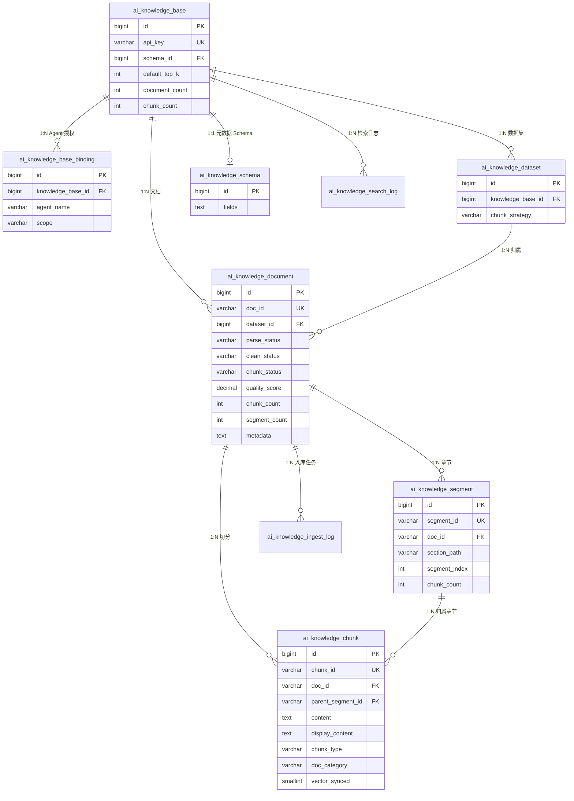
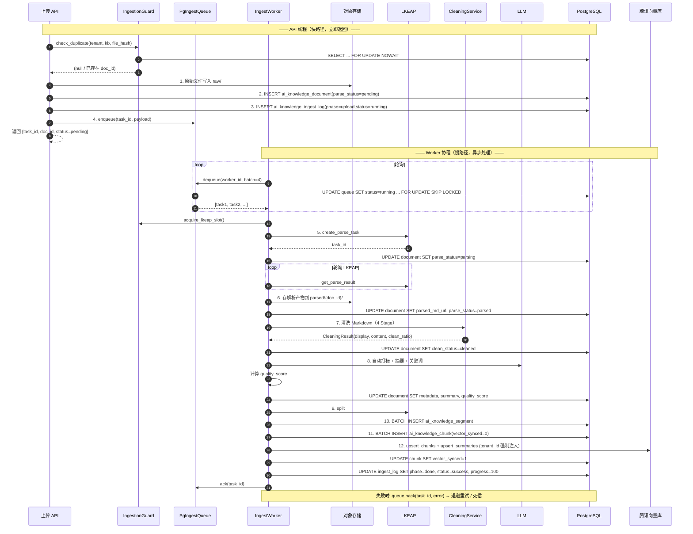
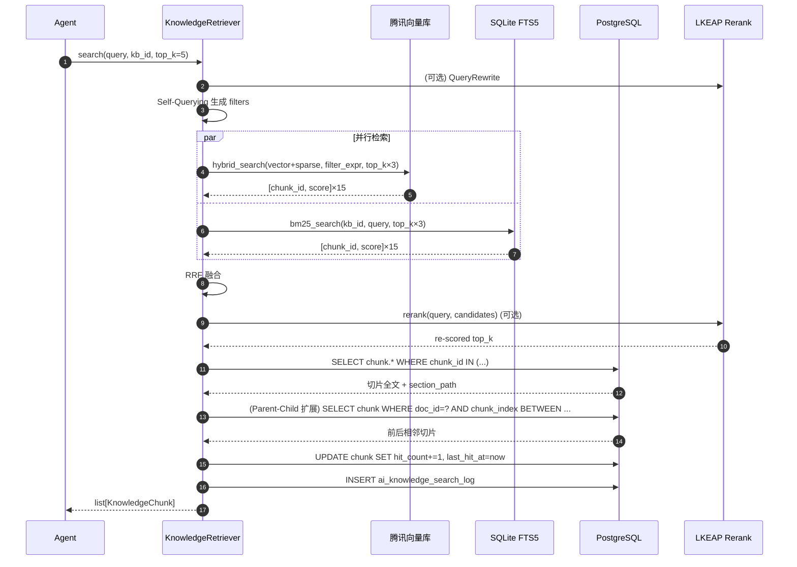

# Agent System 知识库体系设计方案

> 基于腾讯云 LKEAP 文档解析能力 + 现有 AI 知识库产品设计 + agent-system 架构，构建 Agent 可用的知识库体系。
> 与 `2B-Agent-System-DeepAgent-完整设计方案.md` 中的 Plugin/Tool/Skill 边界一致。
> 与 `AI知识库产品设计合集.md` 中的 Agentic RAG 方案衔接。

---

## 一、设计背景与目标

### 1.1 现状分析

**已有能力：**

| 层面 | 现状 | 不足 |
|:---|:---|:---|
| 文档上传 | `UploadManager` 支持 PDF/DOCX/XLSX 本地解析 | 依赖 pypdf/python-docx，解析质量差（无表格/公式/图片理解） |
| 向量存储 | ChromaDB + 腾讯云向量数据库（tcvectordb） | 仅用于 memory，未用于知识库 |
| 记忆系统 | FTS5 + 向量双通道检索 | 记忆是短文本片段，不适合长文档知识 |
| 知识库产品 | AI 知识库已有完整产品设计（元数据 Schema + Agentic RAG） | 产品设计在 NeoAgent 平台侧，agent-system 尚未接入 |
| Agent 工具 | `knowledge_search` Tool 已在 P0 PRD 中定义 | 仅定义了接口，未实现 |

**核心差距：** agent-system 缺少从"文档上传→解析→切片→索引→检索"的完整知识库流水线，无法为 Agent 提供高质量的文档知识检索能力。

### 1.2 设计目标

1. **接入腾讯云 LKEAP 文档解析**：替代本地 pypdf 等低质量解析，支持表格/公式/图片等复杂元素
2. **构建知识库 Plugin**：作为 agent-system 的可插拔基础设施，提供文档入库 + 检索能力
3. **实现 knowledge_search Tool**：让 Agent 能通过自然语言检索知识库
4. **与现有 Agentic RAG 方案对齐**：元数据 Schema、Self-Querying、层级索引等设计复用产品侧方案

### 1.3 与现有系统的关系

```
NeoAgent 平台侧（Java）                    agent-system 侧（Python）
┌─────────────────────┐                   ┌─────────────────────────┐
│ AI 知识库管理        │                   │ knowledge-plugin        │
│ ├─ 知识库 CRUD      │                   │ ├─ DocumentParser       │
│ ├─ 数据集管理       │  ──REST API──→    │ │   (腾讯云 LKEAP)      │
│ ├─ 文档元数据管理   │                   │ ├─ ChunkIndexer         │
│ └─ 入库流水线配置   │                   │ │   (向量+BM25)         │
│                     │                   │ ├─ KnowledgeRetriever   │
│ searchByApp API     │  ←──调用──        │ │   (Self-Querying)     │
│ (扩展 filters)      │                   │ └─ MetadataManager      │
└─────────────────────┘                   │     (Schema 同步)       │
                                          └─────────────────────────┘
                                                    │
                                                    ▼
                                          ┌─────────────────────────┐
                                          │ knowledge_search Tool   │
                                          │ (Agent 直接调用)        │
                                          └─────────────────────────┘
```

**两种部署模式：**
- **模式 A（推荐）**：agent-system 通过 REST API 调用 NeoAgent 平台的 searchByApp 接口，复用平台侧的知识库管理和检索能力
- **模式 B（独立）**：agent-system 内置完整的知识库流水线，独立于 NeoAgent 平台运行（适用于独立部署场景）

本方案同时覆盖两种模式，核心差异在 Plugin 的后端实现。

---

## 二、腾讯云 LKEAP 文档解析接入

### 2.1 LKEAP 能力概览

腾讯云知识引擎原子能力（LKEAP）提供 RAG 流水线中的解耦能力：

| API | 功能 | 模式 | 适用场景 |
|:---|:---|:---|:---|
| `ReconstructDocumentSSE` | 文档解析（同步/SSE） | 准实时 | 实时文档问答，小文件（≤100M） |
| `CreateReconstructDocumentFlow` + `GetReconstructDocumentResult` | 文档解析（异步） | 异步轮询 | 知识库入库，大文件（≤300M） |
| `CreateSplitDocumentFlow` + `GetSplitDocumentResult` | 文档切分 | 异步 | 多级语义切分，提升召回完整性 20% |
| `GetEmbedding` | 文本向量化 | 同步 | 文本转向量 |
| `RunRerank` | 重排序 | 同步 | 检索结果精排 |
| `QueryRewrite` | 多轮改写 | 同步 | 指代消解、省略补全 |

**支持的文件格式：** PDF、DOC/DOCX、PPT/PPTX、XLS/XLSX、WPS、MD、TXT、CSV、HTML、EPUB + 图片格式（PNG/JPG/BMP/GIF/WEBP 等）

**解析能力：** 表格、公式、图片、标题、段落、页眉、页脚 → 智能转换为 Markdown 阅读顺序

### 2.2 接入架构

```python
class TencentLKEAPClient:
    """腾讯云 LKEAP 文档解析客户端

    封装 CreateReconstructDocumentFlow / GetReconstructDocumentResult
    和 ReconstructDocumentSSE 两种模式。
    """

    def __init__(
        self,
        secret_id: str,
        secret_key: str,
        region: str = "ap-guangzhou",
    ) -> None:
        self._secret_id = secret_id
        self._secret_key = secret_key
        self._region = region
        self._client = self._init_client()

    def _init_client(self):
        """延迟初始化腾讯云 SDK 客户端"""
        from tencentcloud.common import credential
        from tencentcloud.lkeap.v20240522 import lkeap_client
        cred = credential.Credential(self._secret_id, self._secret_key)
        return lkeap_client.LkeapClient(cred, self._region)

    # ── 异步模式（大文件，知识库入库） ──

    async def parse_document_async(
        self,
        file_url: str,
        file_type: str,
        start_page: int | None = None,
        end_page: int | None = None,
    ) -> str:
        """异步文档解析 — 返回 task_id，通过轮询获取结果

        适用场景：知识库批量入库，大文件（PDF ≤ 300M）
        """
        from tencentcloud.lkeap.v20240522 import models
        req = models.CreateReconstructDocumentFlowRequest()
        req.FileType = file_type.upper()
        req.FileUrl = file_url
        if start_page:
            req.FileStartPageNumber = start_page
        if end_page:
            req.FileEndPageNumber = end_page
        resp = self._client.CreateReconstructDocumentFlow(req)
        return resp.TaskId

    async def get_parse_result(self, task_id: str) -> ParseResult:
        """轮询获取异步解析结果

        返回：ParseResult(status, markdown_url, markdown_content, failed_pages)
        """
        from tencentcloud.lkeap.v20240522 import models
        req = models.GetReconstructDocumentResultRequest()
        req.TaskId = task_id
        resp = self._client.GetReconstructDocumentResult(req)
        return ParseResult(
            status=resp.Status,
            markdown_url=resp.DocumentRecognizeResultUrl,
            failed_pages=resp.FailedPages or [],
        )

    # ── SSE 模式（小文件，实时问答） ──

    async def parse_document_sse(
        self,
        file_url: str,
        file_type: str,
    ) -> AsyncIterator[ParseProgress]:
        """SSE 实时文档解析 — 流式返回进度和结果

        适用场景：用户上传文件后实时问答，小文件（≤ 100M）
        ResponseType: 1=进度信息, 2=解析结果
        """
        from tencentcloud.lkeap.v20240522 import models
        req = models.ReconstructDocumentSSERequest()
        req.FileType = file_type.upper()
        req.FileUrl = file_url
        # SSE 流式响应
        for event in self._client.ReconstructDocumentSSE(req):
            yield ParseProgress(
                progress=int(event.Progress or 0),
                message=event.ProgressMessage or "",
                result_url=event.DocumentRecognizeResultUrl or "",
                is_done=event.ResponseType == "TASK_RSP",
            )

    # ── 文档切分 ──

    async def split_document_async(
        self,
        file_url: str,
        file_type: str,
    ) -> str:
        """异步文档切分 — 多级语义切分，返回 task_id"""
        from tencentcloud.lkeap.v20240522 import models
        req = models.CreateSplitDocumentFlowRequest()
        req.FileType = file_type.upper()
        req.FileUrl = file_url
        resp = self._client.CreateSplitDocumentFlow(req)
        return resp.TaskId

    async def get_split_result(self, task_id: str) -> SplitResult:
        """获取切分结果"""
        from tencentcloud.lkeap.v20240522 import models
        req = models.GetSplitDocumentResultRequest()
        req.TaskId = task_id
        resp = self._client.GetSplitDocumentResult(req)
        return SplitResult(
            status=resp.Status,
            chunks=[
                ChunkInfo(
                    content=c.Content,
                    metadata=c.Metadata or {},
                    chunk_type=c.ChunkType,
                )
                for c in (resp.SplitResult or [])
            ],
        )

    # ── Embedding + Rerank ──

    async def get_embedding(self, texts: list[str]) -> list[list[float]]:
        """文本向量化"""
        from tencentcloud.lkeap.v20240522 import models
        req = models.GetEmbeddingRequest()
        req.Texts = texts
        resp = self._client.GetEmbedding(req)
        return [item.Embedding for item in resp.Data]

    async def rerank(
        self, query: str, documents: list[str], top_k: int = 5
    ) -> list[RerankResult]:
        """重排序"""
        from tencentcloud.lkeap.v20240522 import models
        req = models.RunRerankRequest()
        req.Query = query
        req.Docs = documents
        req.TopN = top_k
        resp = self._client.RunRerank(req)
        return [
            RerankResult(index=r.Index, score=r.Score)
            for r in resp.Results
        ]


### 2.3 数据模型

```python
@dataclass
class ParseResult:
    """文档解析结果"""
    status: str                    # SUCCESS / PROCESSING / FAILED
    markdown_url: str = ""         # 解析结果 zip 下载地址（含 .md + .json + images/）
    markdown_content: str = ""     # 解析后的 Markdown 文本
    failed_pages: list[int] = field(default_factory=list)

@dataclass
class ParseProgress:
    """SSE 解析进度"""
    progress: int                  # 0~100
    message: str                   # 进度描述
    result_url: str                # 完成时的结果下载地址
    is_done: bool                  # 是否完成

@dataclass
class ChunkInfo:
    """切片信息"""
    content: str                   # 切片文本
    metadata: dict                 # 切片元数据（chunkType, sectionTitle, chunkIndex 等）
    chunk_type: str                # Text / Table / Image_Description / Title / Summary

@dataclass
class RerankResult:
    """重排序结果"""
    index: int                     # 原始文档索引
    score: float                   # 相关性分数
```

### 2.4 与现有 UploadManager 的整合

现有 `UploadManager.convert_to_markdown()` 使用 pypdf/python-docx 本地解析，质量有限。整合策略：

```
文件上传 → UploadManager.save()
  ├── 图片文件 → 直接存储（不解析）
  ├── 纯文本文件 → 直接读取（.txt/.md/.csv）
  └── 文档文件 → 路由到解析引擎
        ├── LKEAP 可用？ → TencentLKEAPClient.parse_document_sse()
        │                   （高质量：表格/公式/图片描述）
        └── LKEAP 不可用？ → 本地 pypdf/python-docx（降级兜底）
```

```python
class EnhancedUploadManager(UploadManager):
    """增强版上传管理器 — 优先使用 LKEAP 解析"""

    def __init__(
        self,
        base_dir: str = "./data/uploads",
        lkeap_client: TencentLKEAPClient | None = None,
    ) -> None:
        super().__init__(base_dir)
        self._lkeap = lkeap_client

    async def convert_to_markdown(self, file_path: str) -> str:
        """优先 LKEAP，降级本地解析"""
        if self._lkeap and self._is_lkeap_supported(file_path):
            try:
                # 上传到临时 COS → 获取 URL → LKEAP 解析
                file_url = await self._upload_to_temp_cos(file_path)
                file_type = Path(file_path).suffix.lstrip(".")
                async for progress in self._lkeap.parse_document_sse(file_url, file_type):
                    if progress.is_done:
                        return await self._download_markdown(progress.result_url)
            except Exception as exc:
                logger.warning("LKEAP 解析失败，降级本地: %s", exc)
        # 降级到本地解析
        return super().convert_to_markdown(file_path)
```

---

## 三、知识库 Plugin 设计

### 3.1 Plugin 定位

遵循 `Plugin-Tool-Skill-边界分析.md` 的设计原则：

```
knowledge-plugin = 可插拔的知识库基础设施
  提供：文档入库流水线 + 知识检索引擎
  消费者：knowledge_search Tool（通过 PluginContext.knowledge 调用）
  可替换性：LKEAP 后端 / 本地后端 / NeoAgent 平台后端
```

### 3.2 Plugin 接口定义

```python
@runtime_checkable
class KnowledgeProvider(Protocol):
    """知识库 Provider 协议 — 与 memory-plugin 的 Provider 模式一致"""

    async def ingest_document(
        self,
        file_path: str,
        metadata: dict | None = None,
        knowledge_base_id: str | None = None,
    ) -> IngestResult:
        """文档入库：解析 → 打标 → 切分 → 索引"""
        ...

    async def search(
        self,
        query: str,
        knowledge_base_id: str | None = None,
        filters: dict | None = None,
        top_k: int = 5,
        enable_rerank: bool = True,
    ) -> list[KnowledgeChunk]:
        """知识检索：Self-Querying → 向量检索 → BM25 → Rerank → 上下文扩展"""
        ...

    async def list_knowledge_bases(
        self,
        tenant_id: str,
    ) -> list[KnowledgeBaseInfo]:
        """列出租户的知识库"""
        ...

    async def get_document_info(
        self,
        document_id: str,
    ) -> DocumentInfo | None:
        """获取文档详情"""
        ...

    async def delete_document(
        self,
        document_id: str,
    ) -> bool:
        """删除文档（级联删除切片和索引）"""
        ...
```

### 3.3 两种 Provider 实现

#### 模式 A：NeoAgent 平台代理（推荐）

```python
class NeoAgentKnowledgeProvider:
    """通过 NeoAgent 平台 API 代理知识库操作

    适用场景：agent-system 作为 NeoAgent 平台的 Agent 引擎，
    知识库管理和检索由平台侧统一处理。
    """

    def __init__(self, base_url: str, api_key: str) -> None:
        self._base_url = base_url
        self._api_key = api_key

    async def search(
        self,
        query: str,
        knowledge_base_id: str | None = None,
        filters: dict | None = None,
        top_k: int = 5,
        enable_rerank: bool = True,
    ) -> list[KnowledgeChunk]:
        """调用 NeoAgent searchByApp API（扩展版，含 filters）"""
        payload = {
            "queryContent": query,
            "knowledgeBaseApiKey": knowledge_base_id,
            "topK": top_k,
            "enableRerank": enable_rerank,
        }
        if filters:
            payload["filters"] = filters
        resp = await self._post("/api/knowledge/searchByApp", payload)
        return [
            KnowledgeChunk(
                content=item["content"],
                score=item.get("score", 0.0),
                metadata=item.get("metadata", {}),
                document_id=item.get("documentId", ""),
                document_title=item.get("documentTitle", ""),
                chunk_index=item.get("chunkIndex", 0),
                section_title=item.get("sectionTitle", ""),
            )
            for item in resp.get("results", [])
        ]

    async def ingest_document(self, file_path, metadata=None, knowledge_base_id=None):
        """调用 NeoAgent 文档入库 API"""
        # 上传文件 → 触发平台侧入库流水线（解析→打标→切分→索引）
        ...
```

#### 模式 B：独立知识库引擎

```python
class StandaloneKnowledgeProvider:
    """独立知识库引擎 — agent-system 内置完整流水线

    适用场景：独立部署，不依赖 NeoAgent 平台。
    使用腾讯云 LKEAP 解析 + 腾讯云向量数据库存储。
    """

    def __init__(
        self,
        lkeap_client: TencentLKEAPClient,
        vector_store: VectorStoreProvider,
        storage: MemoryStorage,
        llm_client: Any = None,
    ) -> None:
        self._lkeap = lkeap_client
        self._vector_store = vector_store
        self._storage = storage
        self._llm = llm_client

    async def ingest_document(
        self,
        file_path: str,
        metadata: dict | None = None,
        knowledge_base_id: str | None = None,
    ) -> IngestResult:
        """完整入库流水线：解析 → 打标 → 切分 → 索引"""

        # Phase 1: 文档解析（LKEAP）
        file_url = await self._upload_to_cos(file_path)
        file_type = Path(file_path).suffix.lstrip(".")
        task_id = await self._lkeap.parse_document_async(file_url, file_type)
        parse_result = await self._poll_until_done(task_id)
        markdown_content = await self._download_markdown(parse_result.markdown_url)

        # Phase 2: 自动打标（LLM）
        doc_metadata = await self._auto_tag(markdown_content, metadata)

        # Phase 3: 语义切分（LKEAP 或本地）
        chunks = await self._split_document(file_url, file_type, markdown_content)

        # Phase 4: 向量索引
        await self._index_chunks(chunks, doc_metadata, knowledge_base_id)

        return IngestResult(
            document_id=doc_metadata["doc_id"],
            chunk_count=len(chunks),
            metadata=doc_metadata,
        )

    async def search(
        self,
        query: str,
        knowledge_base_id: str | None = None,
        filters: dict | None = None,
        top_k: int = 5,
        enable_rerank: bool = True,
    ) -> list[KnowledgeChunk]:
        """检索流水线：向量检索 → BM25 → 融合 → Rerank → 上下文扩展"""

        # Step 1: 向量检索
        vector_results = await self._vector_store.search(
            query, top_k=top_k * 3, filters=filters
        )

        # Step 2: BM25 关键词检索
        bm25_results = self._storage.search(
            query, dimension=f"kb_{knowledge_base_id}" if knowledge_base_id else None,
            top_k=top_k * 3,
        )

        # Step 3: RRF 融合
        merged = self._reciprocal_rank_fusion(vector_results, bm25_results)

        # Step 4: Rerank（LKEAP）
        if enable_rerank and len(merged) > top_k:
            docs = [r.content for r in merged[:top_k * 2]]
            rerank_results = await self._lkeap.rerank(query, docs, top_k)
            merged = [merged[r.index] for r in rerank_results]

        # Step 5: Parent-Child 上下文扩展
        expanded = await self._expand_context(merged[:top_k])

        return expanded
```

### 3.4 Plugin 注册与配置

```python
class KnowledgePlugin:
    """知识库插件 — 注册到 PluginRegistry"""

    name = "knowledge-plugin"

    def __init__(self, config: KnowledgePluginConfig) -> None:
        self._config = config
        self._provider: KnowledgeProvider | None = None

    async def initialize(self, context: PluginContext) -> None:
        """初始化 Provider"""
        if self._config.mode == "neoagent":
            self._provider = NeoAgentKnowledgeProvider(
                base_url=self._config.neoagent_base_url,
                api_key=self._config.neoagent_api_key,
            )
        elif self._config.mode == "standalone":
            lkeap = TencentLKEAPClient(
                secret_id=self._config.tencent_secret_id,
                secret_key=self._config.tencent_secret_key,
                region=self._config.tencent_region,
            )
            self._provider = StandaloneKnowledgeProvider(
                lkeap_client=lkeap,
                vector_store=context.vector_store,
                storage=context.storage,
                llm_client=context.llm,
            )

    @property
    def provider(self) -> KnowledgeProvider:
        if not self._provider:
            raise RuntimeError("knowledge-plugin 未初始化")
        return self._provider


@dataclass
class KnowledgePluginConfig:
    """知识库插件配置"""
    mode: str = "neoagent"                    # neoagent | standalone
    # NeoAgent 模式
    neoagent_base_url: str = ""
    neoagent_api_key: str = ""
    # Standalone 模式
    tencent_secret_id: str = ""
    tencent_secret_key: str = ""
    tencent_region: str = "ap-guangzhou"
```


---

## 四、文档入库流水线

### 4.1 四阶段流水线

与 `AI知识库产品设计合集.md` 中的 Agentic RAG 方案对齐：

```
文件上传
  │
  ▼
┌─────────────────────────────────────────────────────────┐
│ Phase 1: 多模态解析（腾讯云 LKEAP）                       │
│                                                         │
│ PDF/DOCX/PPTX/XLSX/图片 → Markdown                     │
│ ├─ 表格 → Markdown 表格                                 │
│ ├─ 公式 → LaTeX                                        │
│ ├─ 图片 → 图片描述文本（Vision LLM）                     │
│ ├─ 标题/段落 → 层级结构                                  │
│ └─ 页眉/页脚 → 过滤或标注                                │
│                                                         │
│ API: CreateReconstructDocumentFlow (异步，大文件)         ││ API: CreateReconstructDocumentFlow (异步，大文件)         │
│      ReconstructDocumentSSE (SSE，实时小文件)             │
│ 输出: .md 文件 + .json 结构化结果 + images/ 目录          │
└─────────────────────────────────────────────────────────┘
  │
  ▼
┌─────────────────────────────────────────────────────────┐
│ Phase 1.5: 文本清洗（对标旧方案 DocumentCleaningService） │
│                                                         │
│ 输入: LKEAP 解析后的 Markdown                             │
│ 输出: CleaningResult(display_content, content, signals) │
│                                                         │
│ Stage 1 编码清洗（必须）:                                 │
│   ├─ BOM / 零宽字符（U+200B/U+200C/U+200D/U+FEFF）       │
│   ├─ 控制字符（C0/C1 except \n \t）                     │
│   └─ NFC 归一化                                          │
│                                                         │
│ Stage 2 格式噪声（OCR/PDF 场景）:                         │
│   ├─ 页码模式（"第 N 页" / "N/M"）                       │
│   ├─ 页眉/页脚重复串                                     │
│   └─ 水印关键词（"机密" / "仅供内部" ）                   │
│                                                         │
│ Stage 3 内容噪声:                                        │
│   ├─ 连续空行合并（≥3 → 1）                              │
│   ├─ 多余空格（非代码块）                                │
│   └─ Unicode 乱码检测（高熵异常 token 比例）              │
│                                                         │
│ Stage 4 双层文本输出:                                    │
│   ├─ display_content: 保留表格 HTML / 图片占位（展示用）  │
│   └─ content: 纯文本（喂 Embedding / BM25）              │
│                                                         │
│ 产出质量信号: clean_ratio（清洗掉的字符比例）              │
└─────────────────────────────────────────────────────────┘
  │
  ▼
┌─────────────────────────────────────────────────────────┐
│ Phase 2: LLM 自动打标 + 质量评分                          │
│                                                         │
│ 打标输入: 文档全文（或前 4000 tokens）+ 租户元数据 Schema │
│ 打标输出: 元数据 JSON + 文档摘要（200-300 字）+ 关键词    │
│                                                         │
│ 元数据字段（与产品侧 Schema 一致）:                       │
│ ├─ docCategory: 产品手册/销售话术/成功案例/...            │
│ ├─ industryVertical: 制造业/金融服务/...                 │
│ ├─ businessStage: 售前咨询/需求调研/...                  │
│ ├─ targetAudience: 高管决策者/业务负责人/...             │
│ ├─ productService: （租户自定义）                        │
│ └─ datePublished: 文档日期                               │
│                                                         │
│ 归一化: 精确匹配 → 包含匹配 → 向量相似度阈值 > 0.85       │
│                                                         │
│ 质量评分（对标旧方案 QualityScoreServiceImpl）:           │
│   quality_score ∈ [0, 1] = 0.3·完整度 + 0.3·结构度       │
│                          + 0.2·内容密度 + 0.2·清洗比例   │
│   ├─ 完整度: 1 - fail_page_num / total_page_num         │
│   ├─ 结构度: 标题层级覆盖率 + 段落平均长度合理性           │
│   ├─ 内容密度: 非空白字符 / 总字符，≥0.7 → 1             │
│   └─ 清洗比例: 1 - clean_ratio（被清洗掉越多分数越低）    │
│                                                         │
│   低于 0.4 的文档标记为 quality_warning，检索时可选过滤    │
└─────────────────────────────────────────────────────────┘
  │
  ▼
┌─────────────────────────────────────────────────────────┐
│ Phase 3: 两级切分（Segment + Chunk）                      │
│                                                         │
│ Step 3a: Segment 级（章节聚合，2000~8000 字符）           │
│   ├─ 基于 H1/H2 标题树切分                               │
│   ├─ 写入 ai_knowledge_segment                           │
│   └─ 产出 segment_id 列表                                │
│                                                         │
│ Step 3b: Chunk 级（切片，300~800 tokens）                 │
│                                                         │
│ 策略一（优先）: LKEAP 多级语义切分                        │
│   API: CreateSplitDocumentFlow                           │
│   优势: 比传统正则切分提升召回完整性 20%                   │
│                                                         │
│ 策略二（降级）: 本地切分                                  │
│   ├─ 在 Segment 内按 800 tokens 切分 + 200 tokens 重叠   │
│   └─ 表格整体为一个切片（不切分）                         │
│                                                         │
│ 特殊处理:                                                │
│   ├─ 表格 → 整体一个切片                                 │
│   ├─ 图片描述 → 单独切片（chunkType=Image_Description）  │
│   └─ 文档摘要 → Summary 切片（chunkType=Summary）        │
│                                                         │
│ 每个切片携带:                                            │
│   chunkId, parentDocId, parentSegmentId, chunkIndex,     │
│   chunkType, sectionTitle, sectionPath                   │
└─────────────────────────────────────────────────────────┘
  │
  ▼
┌─────────────────────────────────────────────────────────┐
│ Phase 4: 混合索引                                        │
│                                                         │
│ 向量索引:                                                │
│   ├─ Embedding: LKEAP GetEmbedding 或 EmbeddingClient   │
│   ├─ 存储: 腾讯云向量数据库（tcvectordb）                 │
│   └─ Payload: 切片元数据（用于 Pre-filtering）            │
│                                                         │
│ 倒排索引:                                                │
│   ├─ BM25 关键词检索                                     │
│   └─ 存储: SQLite FTS5（复用 MemoryStorage）             │
│                                                         │
│ 文档存储:                                                │
│   ├─ 完整 Markdown 原文（用于 Parent-Child 上下文召回）   │
│   └─ 存储: 文件系统 或 对象存储                           │
└─────────────────────────────────────────────────────────┘
```

### 4.2 自动打标 Prompt

```python
AUTO_TAG_PROMPT = """你是一个文档分类专家。请根据以下文档内容，提取元数据并生成摘要。

## 租户元数据 Schema
{schema_json}

## 文档内容（前 4000 tokens）
{document_content}

## 输出要求
请以 JSON 格式输出：
{{
  "metadata": {{
    "docCategory": "从 Schema 枚举值中选择最匹配的",
    "industryVertical": "从 Schema 枚举值中选择",
    "businessStage": "从 Schema 枚举值中选择",
    "targetAudience": "从 Schema 枚举值中选择",
    "productService": "从 Schema 枚举值中选择（可多选）",
    "datePublished": "从文档中提取日期，格式 YYYY-MM-DD"
  }},
  "summary": "200-300 字的文档摘要，概括核心内容和关键信息",
  "keywords": ["关键词1", "关键词2", "...最多10个"]
}}

注意：
1. 元数据值必须从 Schema 枚举值中选择，不要自创
2. 如果无法确定某个字段，设为 null
3. 摘要要包含文档的核心主题、关键数据点、适用场景
"""
```

### 4.3 入库流水线实现

```python
class DocumentIngestionPipeline:
    """文档入库流水线 — 四阶段处理"""

    def __init__(
        self,
        lkeap: TencentLKEAPClient,
        vector_store: VectorStoreProvider,
        storage: MemoryStorage,
        llm: Any,
        embedding: EmbeddingClient | None = None,
    ) -> None:
        self._lkeap = lkeap
        self._vector_store = vector_store
        self._storage = storage
        self._llm = llm
        self._embedding = embedding

    async def ingest(
        self,
        file_path: str,
        tenant_id: str,
        knowledge_base_id: str,
        user_metadata: dict | None = None,
        schema: dict | None = None,
        on_progress: Callable[[str, int], None] | None = None,
    ) -> IngestResult:
        """执行完整入库流水线"""
        doc_id = uuid.uuid4().hex
        file_type = Path(file_path).suffix.lstrip(".")

        # Phase 1: 解析
        if on_progress:
            on_progress("parsing", 0)
        file_url = await self._upload_to_cos(file_path)
        task_id = await self._lkeap.parse_document_async(file_url, file_type)
        parse_result = await self._poll_parse_result(task_id, on_progress)
        markdown = await self._download_and_extract_markdown(parse_result.markdown_url)

        # Phase 2: 打标
        if on_progress:
            on_progress("tagging", 30)
        doc_metadata = await self._auto_tag(markdown, schema, user_metadata)
        doc_metadata["doc_id"] = doc_id
        doc_metadata["tenant_id"] = tenant_id
        doc_metadata["knowledge_base_id"] = knowledge_base_id
        doc_metadata["file_name"] = Path(file_path).name

        # Phase 3: 切分
        if on_progress:
            on_progress("splitting", 50)
        chunks = await self._split(file_url, file_type, markdown)

        # Phase 4: 索引
        if on_progress:
            on_progress("indexing", 70)
        await self._index(chunks, doc_metadata)

        if on_progress:
            on_progress("done", 100)

        return IngestResult(
            document_id=doc_id,
            chunk_count=len(chunks),
            metadata=doc_metadata,
        )

    async def _auto_tag(
        self, markdown: str, schema: dict | None, user_metadata: dict | None
    ) -> dict:
        """Phase 2: LLM 自动打标"""
        # 截取前 4000 tokens
        content_preview = markdown[:8000]  # 粗略估计 2 chars/token
        schema_json = json.dumps(schema or DEFAULT_SCHEMA, ensure_ascii=False)

        prompt = AUTO_TAG_PROMPT.format(
            schema_json=schema_json,
            document_content=content_preview,
        )
        response = await self._llm.ainvoke(prompt)
        auto_metadata = json.loads(response.content)

        # 合并用户手动指定的元数据（优先级高于自动打标）
        merged = {**auto_metadata.get("metadata", {})}
        if user_metadata:
            merged.update({k: v for k, v in user_metadata.items() if v is not None})

        merged["summary"] = auto_metadata.get("summary", "")
        merged["keywords"] = auto_metadata.get("keywords", [])
        return merged

    async def _split(
        self, file_url: str, file_type: str, markdown: str
    ) -> list[ChunkInfo]:
        """Phase 3: 语义切分（优先 LKEAP，降级本地）"""
        try:
            task_id = await self._lkeap.split_document_async(file_url, file_type)
            result = await self._poll_split_result(task_id)
            if result.chunks:
                return result.chunks
        except Exception as exc:
            logger.warning("LKEAP 切分失败，降级本地: %s", exc)

        # 本地降级切分
        return self._local_split(markdown)

    def _local_split(self, markdown: str) -> list[ChunkInfo]:
        """本地切分 — 基于标题树 + 滑动窗口"""
        chunks = []
        sections = self._split_by_headers(markdown)
        for i, section in enumerate(sections):
            if len(section["content"]) > 1600:  # ~800 tokens
                sub_chunks = self._sliding_window(section["content"], 800, 200)
                for j, sub in enumerate(sub_chunks):
                    chunks.append(ChunkInfo(
                        content=sub,
                        metadata={"sectionTitle": section["title"]},
                        chunk_type="Text",
                    ))
            else:
                chunks.append(ChunkInfo(
                    content=section["content"],
                    metadata={"sectionTitle": section["title"]},
                    chunk_type="Text",
                ))
        return chunks

    async def _index(self, chunks: list[ChunkInfo], doc_metadata: dict) -> None:
        """Phase 4: 混合索引"""
        # 向量索引
        memory_chunks = []
        for i, chunk in enumerate(chunks):
            meta = {
                **doc_metadata,
                "chunk_index": i,
                "chunk_type": chunk.chunk_type,
                "section_title": chunk.metadata.get("sectionTitle", ""),
            }
            memory_chunks.append(MemoryChunk(
                id=f"{doc_metadata['doc_id']}_chunk_{i}",
                content=chunk.content,
                user_id=doc_metadata["tenant_id"],
                metadata=meta,
            ))
        await self._vector_store.add_memories(memory_chunks)

        # FTS5 索引
        kb_id = doc_metadata.get("knowledge_base_id", "default")
        for i, chunk in enumerate(chunks):
            self._storage.add(
                user_id=doc_metadata["tenant_id"],
                content=chunk.content,
                dimension=f"kb_{kb_id}",
                metadata=json.dumps({
                    "doc_id": doc_metadata["doc_id"],
                    "chunk_index": i,
                    "chunk_type": chunk.chunk_type,
                }, ensure_ascii=False),
            )
```

### 4.4 并发控制 + 去重 + 异步任务队列

**设计原则**：不引入 MQ / Redis，所有状态和队列能力都用 **PostgreSQL** 完成。具体做法：

- **去重**：靠 `ai_knowledge_document.uk_doc_hash` 唯一索引（同租户同知识库下 `file_hash` 不重复）
- **并发锁**：靠 `SELECT ... FOR UPDATE NOWAIT` 行级排他锁，替代 Redis `SETNX`
- **任务队列**：新增 `ai_knowledge_ingest_queue` 表，Worker 用 `FOR UPDATE SKIP LOCKED` 拉取，替代 MQ
- **限流**：本地内存 `asyncio.Semaphore`（单实例）或 PG 计数器（多实例）

#### 4.4.1 任务队列表 `ai_knowledge_ingest_queue`

```sql
CREATE TABLE IF NOT EXISTS ai_knowledge_ingest_queue (
    id              BIGSERIAL    PRIMARY KEY,
    task_id         VARCHAR(64)  NOT NULL,             -- 与 ingest_log.task_id 对应
    tenant_id       BIGINT       NOT NULL,
    knowledge_base_id BIGINT     NOT NULL,
    dataset_id      BIGINT       NOT NULL DEFAULT 0,

    -- ── 负载 ──
    payload         TEXT         NOT NULL,             -- JSON：{file_path, file_name, file_hash, user_metadata, ...}

    -- ── 调度状态 ──
    status          VARCHAR(20)  NOT NULL DEFAULT 'pending',
                                 -- pending / running / success / failed / dead
    priority        SMALLINT     NOT NULL DEFAULT 0,   -- 数字越大越优先
    available_at    BIGINT       NOT NULL,             -- 可被调度的时间戳（延迟/重试用）
    picked_at       BIGINT       NOT NULL DEFAULT 0,   -- 被 Worker 领取的时间
    picked_by       VARCHAR(100) NOT NULL DEFAULT '',  -- Worker 标识（host_pid）
    completed_at    BIGINT       NOT NULL DEFAULT 0,

    -- ── 重试 ──
    retry_count     INT          NOT NULL DEFAULT 0,
    max_retry       INT          NOT NULL DEFAULT 3,
    last_error      TEXT         DEFAULT '',

    -- ── 可见性超时（防 Worker 崩溃死锁）──
    visibility_timeout_ms INT    NOT NULL DEFAULT 600000,  -- 10 分钟

    created_at      BIGINT       NOT NULL,
    updated_at      BIGINT       NOT NULL
);

CREATE UNIQUE INDEX IF NOT EXISTS uk_queue_task
    ON ai_knowledge_ingest_queue(task_id);
CREATE INDEX IF NOT EXISTS idx_queue_pick
    ON ai_knowledge_ingest_queue(status, available_at, priority DESC)
    WHERE status IN ('pending', 'running');
CREATE INDEX IF NOT EXISTS idx_queue_tenant
    ON ai_knowledge_ingest_queue(tenant_id, knowledge_base_id, status, created_at DESC);
```

关键字段语义：

| 字段 | 语义 |
|:---|:---|
| `status` | `pending` 待领取 → `running` 处理中 → `success` / `failed` / `dead`（重试耗尽） |
| `available_at` | 任务最早可被调度的时间。`enqueue` 时 = now；重试时 = now + backoff；延迟任务 = now + delay |
| `picked_at` + `visibility_timeout_ms` | 如果任务 `running` 超过 visibility_timeout 仍未完成，扫描任务将其复位为 `pending`（处理 Worker 崩溃）|
| `priority` | 人工上传 > 批量导入，高优先级先处理 |

#### 4.4.2 Worker 调度（SKIP LOCKED 精髓）

```python
class PgIngestQueue:
    """基于 PostgreSQL 的任务队列 — 无 MQ / Redis 依赖"""

    async def enqueue(self, task: IngestTask) -> str:
        """入队。依赖 uk_queue_task 保证幂等。"""
        now = int(time.time() * 1000)
        await dao.execute("""
            INSERT INTO ai_knowledge_ingest_queue
                (task_id, tenant_id, knowledge_base_id, dataset_id,
                 payload, status, priority, available_at, created_at, updated_at)
            VALUES (%s, %s, %s, %s, %s, 'pending', %s, %s, %s, %s)
            ON CONFLICT (task_id) DO NOTHING
        """, (task.task_id, task.tenant_id, task.kb_id, task.dataset_id,
              json.dumps(task.payload, ensure_ascii=False),
              task.priority, now, now, now))
        return task.task_id

    async def dequeue(self, worker_id: str, batch: int = 1) -> list[IngestTask]:
        """出队 — 核心是 FOR UPDATE SKIP LOCKED，多 Worker 并发安全"""
        now = int(time.time() * 1000)
        rows = await dao.fetch("""
            UPDATE ai_knowledge_ingest_queue
            SET status = 'running',
                picked_at = %s,
                picked_by = %s,
                updated_at = %s
            WHERE id IN (
                SELECT id FROM ai_knowledge_ingest_queue
                WHERE status = 'pending' AND available_at <= %s
                ORDER BY priority DESC, id
                LIMIT %s
                FOR UPDATE SKIP LOCKED          -- 🔑 核心
            )
            RETURNING id, task_id, tenant_id, knowledge_base_id,
                      dataset_id, payload, retry_count
        """, (now, worker_id, now, now, batch))
        return [IngestTask.from_row(r) for r in rows]

    async def ack(self, task_id: str) -> None:
        now = int(time.time() * 1000)
        await dao.execute("""
            UPDATE ai_knowledge_ingest_queue
            SET status = 'success', completed_at = %s, updated_at = %s
            WHERE task_id = %s
        """, (now, now, task_id))

    async def nack(self, task_id: str, error: str) -> None:
        """失败回退 — 指数退避重试，耗尽后进死信"""
        now = int(time.time() * 1000)
        await dao.execute("""
            UPDATE ai_knowledge_ingest_queue
            SET status = CASE WHEN retry_count + 1 >= max_retry THEN 'dead' ELSE 'pending' END,
                retry_count = retry_count + 1,
                available_at = %s + (POWER(2, retry_count) * 60 * 1000)::BIGINT,
                last_error = %s,
                updated_at = %s
            WHERE task_id = %s
        """, (now, error[:2000], now, task_id))

    async def reclaim_stuck(self) -> int:
        """定时任务：回收 running 超时的任务（Worker 崩溃场景）"""
        now = int(time.time() * 1000)
        result = await dao.execute("""
            UPDATE ai_knowledge_ingest_queue
            SET status = 'pending', picked_by = '', updated_at = %s
            WHERE status = 'running'
              AND picked_at + visibility_timeout_ms < %s
        """, (now, now))
        return result.rowcount
```

**为什么 SKIP LOCKED 能替代 MQ**：

| 能力 | MQ 实现 | PG `FOR UPDATE SKIP LOCKED` 实现 |
|:---|:---|:---|
| 多 Worker 并发 | 消费者组 + Partition | 多个 Worker 同时跑上面的 SQL，PG 自动分配不冲突的行 |
| 消息持久化 | 存 Broker | 存 PG |
| At-least-once | ACK/NACK | `ack()` 改 `success` / `nack()` 改 `pending` + 退避 |
| 可见性超时 | Consumer 心跳 | `reclaim_stuck()` 定时扫 |
| 延迟消息 | 延迟级别 | `available_at = now + delay` |
| 死信队列 | DLQ Topic | `status = 'dead'`，查询即可 |
| 优先级 | 多队列 | `ORDER BY priority DESC` |

**限制与权衡**：
- 高频场景（> 10k QPS 入队）下 PG 会成为瓶颈，远不如 MQ。但知识库场景入库就是低频（文档级），完全够用
- 需要定时任务（Worker 内 `asyncio` 定时触发 `reclaim_stuck`）
- 多实例部署时所有 Worker 共用一个 PG，比 MQ 多一层网络跳转，但省了独立组件

#### 4.4.3 入库守卫 IngestionGuard（PG 版，无 Redis）

```python
class IngestionGuard:
    """入库守卫 — file_hash 去重 + LKEAP 并发限流"""

    def __init__(self, lkeap_concurrency: int = 3):
        # 本地进程内信号量限制对 LKEAP 的并发调用
        self._lkeap_sem = asyncio.Semaphore(lkeap_concurrency)

    async def check_duplicate(
        self,
        tenant_id: int,
        knowledge_base_id: int,
        file_hash: str,
    ) -> int | None:
        """查是否已入库；返回已存在的 document.id（完全相同时返回以便复用）"""
        row = await dao.fetch_one("""
            SELECT id, doc_id, parse_status, chunk_status FROM ai_knowledge_document
            WHERE tenant_id = %s AND knowledge_base_id = %s AND file_hash = %s
              AND delete_flg = 0
            FOR UPDATE NOWAIT                    -- 🔑 行锁，NOWAIT 立即返回不阻塞
        """, (tenant_id, knowledge_base_id, file_hash))

        if row and row.parse_status == "parsed" and row.chunk_status == "indexed":
            return row.id                       # 完全相同，复用
        if row and row.parse_status in ("pending", "parsing"):
            raise DuplicateIngestionError(
                f"文档 {row.doc_id} 正在入库中，请勿重复提交"
            )
        return None

    @asynccontextmanager
    async def acquire_lkeap_slot(self):
        """控制对 LKEAP 的并发（避免打爆单租户配额）"""
        async with self._lkeap_sem:
            yield
```

**要点**：
- 去重和并发控制全部靠 PG：`uk_doc_hash` 唯一约束 + `FOR UPDATE NOWAIT` 行锁
- LKEAP 限流用进程内 `Semaphore`，多实例各自限流（简单够用；要全局限流再回落到 PG 计数器）
- 不依赖 Redis，部署更简单

#### 4.4.4 部署模型

```
┌──────────────────────────────────────────────────┐
│  agent-system 进程（1~N 个实例）                  │
│                                                  │
│  ┌─── 上传 API ──────┐                           │
│  │  1. 存 COS       │                           │
│  │  2. INSERT document (parse_status=pending)   │
│  │  3. INSERT queue (status=pending)            │
│  └──────────────────┘                           │
│                                                  │
│  ┌─── Ingest Worker（asyncio 协程，每进程 N 个）─┐│
│  │  while True:                                ││
│  │    tasks = queue.dequeue(worker_id, batch=4)││
│  │    for task in tasks:                       ││
│  │      try: await pipeline.run(task)          ││
│  │           queue.ack(task_id)                ││
│  │      except: queue.nack(task_id, error)     ││
│  └─────────────────────────────────────────────┘│
│                                                  │
│  ┌─── Reclaimer（定时 30s）──────────────────┐  │
│  │  queue.reclaim_stuck()                    │  │
│  └───────────────────────────────────────────┘  │
└──────────────────────────────────────────────────┘
          │
          ▼
┌──────────────────────────────────────────────────┐
│   PostgreSQL (paas_ai schema)                    │
│   ├── ai_knowledge_*（主数据 + 队列）             │
└──────────────────────────────────────────────────┘
```

配置：

```python
class KnowledgeSettings(BaseModel):
    # ...
    # ── 入库队列 ──
    ingest_worker_count: int = 4       # 每实例 Worker 协程数
    ingest_batch_size: int = 4         # 每次 dequeue 的任务数
    ingest_poll_interval_ms: int = 500 # 空队列时轮询间隔
    lkeap_concurrency: int = 3         # 对 LKEAP 的并发上限
    reclaim_interval_ms: int = 30000   # Reclaimer 运行间隔
```


---

## 四·补、存储层设计（PG + 向量库 + 对象存储）

### 4.补.1 设计目标与分层

知识库的存储需要同时满足：**元数据精确查询 + 全文检索 + 语义检索 + 原始文档留档**，单一存储无法承担。参考长期记忆（`ai_agent_memory`）的设计思路，采用**三层存储架构**：

```
┌──────────────────────────────────────────────────────────────────────┐
│                         PostgreSQL（权威数据源）                       │
│                                                                      │
│  ai_knowledge_base          ── 知识库定义（租户维度）                  │
│  ai_knowledge_base_binding  ── 知识库与 Agent 绑定（授权）             │
│  ai_knowledge_dataset       ── 数据集（知识库下的文档分组）            │
│  ai_knowledge_document      ── 文档主表（解析/清洗/切分/打标/质量）    │
│  ai_knowledge_segment       ── 章节级聚合（Parent-Child 父节点）       │
│  ai_knowledge_chunk         ── 切片主表（内容 + 向量同步状态）         │
│  ai_knowledge_schema        ── 租户元数据 Schema（Self-Querying 依赖） │
│  ai_knowledge_ingest_queue  ── 入库任务队列（SKIP LOCKED 替代 MQ）     │
│  ai_knowledge_ingest_log    ── 入库任务日志（审计 + 重试）             │
│  ai_knowledge_search_log    ── 检索审计日志（效果分析）                │
│                                                                      │
│  特点: 事务一致性 + 复杂查询 + 软删级联 + 内置任务队列                 │
└──────────────────────────────────────────────────────────────────────┘
                             │
                             ▼
┌──────────────────────────────────────────────────────────────────────┐
│                    腾讯云向量数据库（检索加速层）                       │
│                                                                      │
│  Database: knowledge                   ← 全局共享（单库）              │
│  ├─ Collection: kb_chunks              ← 所有切片（含 tenant_id 字段） │
│  └─ Collection: kb_doc_summary         ← 文档级 Summary 向量           │
│                                                                      │
│  租户隔离：tenant_id FilterIndex，所有查询强制注入该过滤条件           │
│  特点: 只存 chunk_id + 向量 + 过滤字段（不存全文），命中后回 PG 取内容  │
└──────────────────────────────────────────────────────────────────────┘
                             │
                             ▼
┌──────────────────────────────────────────────────────────────────────┐
│                       对象存储 / 文件系统                              │
│                                                                      │
│  COS Bucket: knowledge-{tenant_id}                                   │
│  ├─ raw/{doc_id}.{ext}            ← 原始上传文件                      │
│  ├─ parsed/{doc_id}/content.md    ← LKEAP 解析后的 Markdown           │
│  ├─ parsed/{doc_id}/structure.json ← LKEAP 返回的结构化 JSON          │
│  └─ parsed/{doc_id}/images/*.png  ← 解析提取的图片资源                │
│                                                                      │
│  特点: 大文件留档 + 可回溯 + 支持重新切片                              │
└──────────────────────────────────────────────────────────────────────┘
```

**设计原则**：

| 层级 | 角色 | 存什么 | 不存什么 |
|:---|:---|:---|:---|
| PG | 权威数据源 | 所有元数据 + 切片全文 + 向量同步状态 | 向量本身 |
| 向量库 | 检索加速层 | chunk_id + 向量 + 过滤字段 | 切片全文（可选冗余 abstract） |
| 对象存储 | 原始留档 | 原始文件 + 解析产物 + 图片 | 无 |

命中检索后的数据流：`向量库返回 chunk_id → PG 取切片全文 → 按需扩展 Parent-Child 上下文`。

---

### 4.补.2 PostgreSQL 表结构

沿用项目统一约定（`paas_ai` schema、BaseEntity 规范、雪花 BIGINT 主键、毫秒时间戳、`delete_flg` 软删）。

#### 4.补.2.1 ai_knowledge_base — 知识库定义

```sql
SET search_path TO paas_ai;

CREATE TABLE IF NOT EXISTS ai_knowledge_base (
    id              BIGINT       PRIMARY KEY,
    tenant_id       BIGINT       NOT NULL,
    api_key         VARCHAR(100) NOT NULL,            -- 对外 API 标识（如 "product-manual"）
    name            VARCHAR(200) NOT NULL,
    description     VARCHAR(1000) DEFAULT '',
    owner           VARCHAR(100) DEFAULT '',

    -- ── 检索配置 ──
    default_top_k   INT          NOT NULL DEFAULT 5,
    min_score       DECIMAL(5,4) NOT NULL DEFAULT 0.0,
    enable_rerank   SMALLINT     NOT NULL DEFAULT 1,
    enable_self_query SMALLINT   NOT NULL DEFAULT 1,
    enable_query_rewrite SMALLINT NOT NULL DEFAULT 0,

    -- ── 向量库绑定 ──
    vdb_database    VARCHAR(100) NOT NULL DEFAULT '', -- 如 knowledge_1001
    vdb_collection  VARCHAR(100) NOT NULL DEFAULT '', -- 如 kb_chunks

    -- ── 元数据 Schema 绑定 ──
    schema_id       BIGINT       NOT NULL DEFAULT 0,  -- 关联 ai_knowledge_schema.id

    -- ── 统计（冗余字段，写入时更新） ──
    document_count  INT          NOT NULL DEFAULT 0,
    chunk_count     INT          NOT NULL DEFAULT 0,
    total_tokens    BIGINT       NOT NULL DEFAULT 0,

    -- ── 状态 ──
    status          VARCHAR(20)  NOT NULL DEFAULT 'active',  -- active / disabled

    -- ── 审计 ──
    ext_info        TEXT         DEFAULT '{}',
    delete_flg      SMALLINT     NOT NULL DEFAULT 0,
    created_at      BIGINT       NOT NULL,
    created_by      BIGINT       NOT NULL DEFAULT 0,
    updated_at      BIGINT       NOT NULL,
    updated_by      BIGINT       NOT NULL DEFAULT 0
);

CREATE UNIQUE INDEX IF NOT EXISTS uk_kb_apikey
    ON ai_knowledge_base(tenant_id, api_key) WHERE delete_flg = 0;
CREATE INDEX IF NOT EXISTS idx_kb_tenant
    ON ai_knowledge_base(tenant_id, status) WHERE delete_flg = 0;
```

#### 4.补.2.2 ai_knowledge_dataset — 数据集（文档分组）

数据集是知识库下的文档逻辑分组，对应产品侧"数据集"概念（如"2024 产品手册"、"销售话术集"）。

```sql
CREATE TABLE IF NOT EXISTS ai_knowledge_dataset (
    id              BIGINT       PRIMARY KEY,
    tenant_id       BIGINT       NOT NULL,
    knowledge_base_id BIGINT     NOT NULL,           -- 关联 ai_knowledge_base.id
    name            VARCHAR(200) NOT NULL,
    description     VARCHAR(1000) DEFAULT '',

    -- ── 入库默认配置 ──
    default_metadata TEXT        DEFAULT '{}',       -- 该数据集下文档的默认元数据
    chunk_strategy  VARCHAR(32)  NOT NULL DEFAULT 'lkeap', -- lkeap / local_header / sliding_window
    chunk_size      INT          NOT NULL DEFAULT 800,
    chunk_overlap   INT          NOT NULL DEFAULT 200,

    -- ── 统计 ──
    document_count  INT          NOT NULL DEFAULT 0,
    chunk_count     INT          NOT NULL DEFAULT 0,

    status          VARCHAR(20)  NOT NULL DEFAULT 'active',
    ext_info        TEXT         DEFAULT '{}',
    delete_flg      SMALLINT     NOT NULL DEFAULT 0,
    created_at      BIGINT       NOT NULL,
    created_by      BIGINT       NOT NULL DEFAULT 0,
    updated_at      BIGINT       NOT NULL,
    updated_by      BIGINT       NOT NULL DEFAULT 0
);

CREATE INDEX IF NOT EXISTS idx_dataset_kb
    ON ai_knowledge_dataset(tenant_id, knowledge_base_id, delete_flg);
```

#### 4.补.2.2b ai_knowledge_base_binding — 知识库与 Agent 绑定

对齐旧方案 `ai_dataset_app_relation` 的授权模型。控制"哪个 Agent 能看哪些知识库"，避免所有 Agent 默认可见全部 KB 造成数据泄露。

```sql
CREATE TABLE IF NOT EXISTS ai_knowledge_base_binding (
    id              BIGINT       PRIMARY KEY,
    tenant_id       BIGINT       NOT NULL,
    knowledge_base_id BIGINT     NOT NULL,              -- 关联 ai_knowledge_base.id
    agent_name      VARCHAR(100) NOT NULL,              -- Agent 标识（如 "CRM-Agent" / "*" 表示全局可见）
    scope           VARCHAR(20)  NOT NULL DEFAULT 'read',  -- read / write（默认只读）

    -- ── 绑定级别的覆盖配置（可选）──
    override_top_k  INT          NOT NULL DEFAULT 0,    -- 0 表示使用 KB 默认值
    override_filters TEXT        NOT NULL DEFAULT '{}', -- 强制追加的过滤条件（如按业务线收窄）

    -- ── 状态 ──
    status          VARCHAR(20)  NOT NULL DEFAULT 'active',
    delete_flg      SMALLINT     NOT NULL DEFAULT 0,
    created_at      BIGINT       NOT NULL,
    created_by      BIGINT       NOT NULL DEFAULT 0,
    updated_at      BIGINT       NOT NULL,
    updated_by      BIGINT       NOT NULL DEFAULT 0
);

CREATE UNIQUE INDEX IF NOT EXISTS uk_kb_binding
    ON ai_knowledge_base_binding(tenant_id, agent_name, knowledge_base_id)
    WHERE delete_flg = 0;
CREATE INDEX IF NOT EXISTS idx_kb_binding_agent
    ON ai_knowledge_base_binding(tenant_id, agent_name) WHERE delete_flg = 0;
```

**使用方式**：

```python
# knowledge_search Tool 调用时，自动按 agent_name 过滤可访问 KB
def list_available_kbs(tenant_id: int, agent_name: str) -> list[int]:
    return dao.query("""
        SELECT knowledge_base_id FROM ai_knowledge_base_binding
        WHERE tenant_id = %s
          AND (agent_name = %s OR agent_name = '*')
          AND status = 'active' AND delete_flg = 0
    """, (tenant_id, agent_name))

# 如果 search 时未指定 knowledge_base_id，默认检索所有绑定的 KB
# 如果指定了 knowledge_base_id，校验是否在绑定列表中
```

#### 4.补.2.3 ai_knowledge_document — 文档主表

一篇上传文档对应一行。记录解析状态、元数据、摘要，不存切片内容。

```sql
CREATE TABLE IF NOT EXISTS ai_knowledge_document (
    id              BIGINT       PRIMARY KEY,
    doc_id          VARCHAR(64)  NOT NULL,            -- 全局唯一 ID（UUID），与 chunk.doc_id 对应
    tenant_id       BIGINT       NOT NULL,
    knowledge_base_id BIGINT     NOT NULL,
    dataset_id      BIGINT       NOT NULL DEFAULT 0,

    -- ── 文件信息 ──
    title           VARCHAR(500) NOT NULL DEFAULT '',
    file_name       VARCHAR(500) NOT NULL DEFAULT '',
    file_type       VARCHAR(20)  NOT NULL DEFAULT '', -- pdf/docx/xlsx/md/...
    file_size       BIGINT       NOT NULL DEFAULT 0,  -- 字节
    file_hash       VARCHAR(64)  NOT NULL DEFAULT '', -- MD5 / SHA256，用于去重
    raw_url         VARCHAR(1000) NOT NULL DEFAULT '', -- COS 原始文件 URL
    parsed_md_url   VARCHAR(1000) NOT NULL DEFAULT '', -- COS 解析后 Markdown URL
    parsed_json_url VARCHAR(1000) NOT NULL DEFAULT '', -- COS 结构化 JSON URL
    page_count      INT          NOT NULL DEFAULT 0,
    total_chars     INT          NOT NULL DEFAULT 0,  -- 解析后 Markdown 总字符数

    -- ── 解析状态 ──
    parse_status    VARCHAR(20)  NOT NULL DEFAULT 'pending',
                                                      -- pending / parsing / parsed / failed
    parse_task_id   VARCHAR(64)  NOT NULL DEFAULT '', -- LKEAP task_id
    parse_engine    VARCHAR(32)  NOT NULL DEFAULT 'lkeap', -- lkeap / local_pypdf
    parse_error     TEXT         DEFAULT '',
    failed_pages    TEXT         DEFAULT '[]',        -- JSON array

    -- ── 清洗状态（对标旧方案 CleaningResult 的双层文本）──
    clean_status    VARCHAR(20)  NOT NULL DEFAULT 'pending',
                                                      -- pending / cleaning / cleaned / failed
    clean_error     TEXT         DEFAULT '',

    -- ── 切分 / 索引状态 ──
    chunk_status    VARCHAR(20)  NOT NULL DEFAULT 'pending',
                                                      -- pending / splitting / indexed / failed
    chunk_count     INT          NOT NULL DEFAULT 0,
    segment_count   INT          NOT NULL DEFAULT 0,  -- Segment（章节级）数量

    -- ── LLM 自动打标结果 ──
    summary         TEXT         NOT NULL DEFAULT '', -- 200-300 字文档摘要
    keywords        TEXT         NOT NULL DEFAULT '[]', -- JSON array
    metadata        TEXT         NOT NULL DEFAULT '{}', -- 元数据 JSON（docCategory 等）
    metadata_tagged SMALLINT     NOT NULL DEFAULT 0,  -- 是否已自动打标

    -- ── 质量评分（对标旧方案 QualityScoreServiceImpl）──
    quality_score   DECIMAL(5,4) NOT NULL DEFAULT 0.0,  -- 0~1 综合质量分
    quality_signals TEXT         NOT NULL DEFAULT '{}', -- 分项信号 JSON（完整度/结构清晰度/内容密度）

    -- ── 生效时间（元数据中的 datePublished）──
    date_published  BIGINT       NOT NULL DEFAULT 0,  -- 毫秒时间戳

    -- ── 访问统计 ──
    search_hit_count INT         NOT NULL DEFAULT 0,  -- 被检索命中的次数（文档级聚合）

    -- ── 审计 ──
    status          VARCHAR(20)  NOT NULL DEFAULT 'active',  -- active / archived
    ext_info        TEXT         DEFAULT '{}',
    delete_flg      SMALLINT     NOT NULL DEFAULT 0,
    created_at      BIGINT       NOT NULL,
    created_by      BIGINT       NOT NULL DEFAULT 0,
    updated_at      BIGINT       NOT NULL,
    updated_by      BIGINT       NOT NULL DEFAULT 0
);

CREATE UNIQUE INDEX IF NOT EXISTS uk_doc_docid
    ON ai_knowledge_document(doc_id);
CREATE INDEX IF NOT EXISTS idx_doc_kb
    ON ai_knowledge_document(tenant_id, knowledge_base_id, delete_flg);
CREATE INDEX IF NOT EXISTS idx_doc_dataset
    ON ai_knowledge_document(dataset_id, delete_flg);

-- ⚠️ 去重约束：同租户同知识库下，file_hash 不允许重复（由应用层读后写入）
CREATE UNIQUE INDEX IF NOT EXISTS uk_doc_hash
    ON ai_knowledge_document(tenant_id, knowledge_base_id, file_hash)
    WHERE file_hash != '' AND delete_flg = 0;
CREATE INDEX IF NOT EXISTS idx_doc_parse_status
    ON ai_knowledge_document(parse_status, created_at) WHERE delete_flg = 0;
CREATE INDEX IF NOT EXISTS idx_doc_chunk_status
    ON ai_knowledge_document(chunk_status, updated_at) WHERE delete_flg = 0;
CREATE INDEX IF NOT EXISTS idx_doc_quality
    ON ai_knowledge_document(tenant_id, knowledge_base_id, quality_score)
    WHERE delete_flg = 0 AND status = 'active';
```

#### 4.补.2.3b ai_knowledge_segment — 章节级聚合（🔑 对标旧方案 Segment 层）

借鉴旧方案 `ai_dataset_segment + ai_dataset_data` 两级结构：**Segment（章节级，2000~8000 字）** + **Chunk（切片级，300~800 tokens）**。Segment 不参与向量检索，仅作为 Parent-Child 扩展时的"父节点"提供更大上下文。

```sql
CREATE TABLE IF NOT EXISTS ai_knowledge_segment (
    id              BIGSERIAL    PRIMARY KEY,
    segment_id      VARCHAR(64)  NOT NULL,            -- UUID，与 chunk.parent_segment_id 对应
    tenant_id       BIGINT       NOT NULL,
    knowledge_base_id BIGINT     NOT NULL,
    doc_id          VARCHAR(64)  NOT NULL,            -- 关联 ai_knowledge_document.doc_id

    -- ── Segment 内容 ──
    title           VARCHAR(500) NOT NULL DEFAULT '', -- 章节标题
    section_path    VARCHAR(1000) NOT NULL DEFAULT '',-- 标题路径，如 "第一章/1.2 方案"
    content         TEXT         NOT NULL,            -- 章节级全文（Parent-Child 扩展时返回）
    content_tokens  INT          NOT NULL DEFAULT 0,

    -- ── 结构信息 ──
    segment_index   INT          NOT NULL DEFAULT 0,  -- 在文档内的顺序
    heading_level   INT          NOT NULL DEFAULT 0,  -- 标题层级（H1=1, H2=2, ...）
    page_start      INT          NOT NULL DEFAULT 0,
    page_end        INT          NOT NULL DEFAULT 0,
    start_offset    INT          NOT NULL DEFAULT 0,
    end_offset      INT          NOT NULL DEFAULT 0,
    chunk_count     INT          NOT NULL DEFAULT 0,  -- 该 Segment 下切片数量

    delete_flg      SMALLINT     NOT NULL DEFAULT 0,
    created_at      BIGINT       NOT NULL,
    updated_at      BIGINT       NOT NULL
);

CREATE UNIQUE INDEX IF NOT EXISTS uk_segment_segid
    ON ai_knowledge_segment(segment_id);
CREATE INDEX IF NOT EXISTS idx_segment_doc
    ON ai_knowledge_segment(doc_id, segment_index) WHERE delete_flg = 0;
```

**Parent-Child 三级结构**：

```
Document (ai_knowledge_document)
  │
  ├── Segment 1 (ai_knowledge_segment)   ← 章节级：2000~8000 字，H1/H2 边界
  │     ├── Chunk 1.1                   ← 切片级：300~800 tokens
  │     ├── Chunk 1.2
  │     └── Chunk 1.3
  │
  └── Segment 2
        ├── Chunk 2.1
        └── Chunk 2.2

检索命中 Chunk 1.2 → 扩展策略：
  - 轻扩展（默认）：返回 Chunk 1.1 + 1.2 + 1.3（前后 N=1）
  - 重扩展（宏观问题）：返回 Segment 1 整段
```

#### 4.补.2.4 ai_knowledge_chunk — 切片主表（🔑 核心）

切片是检索的最小单元。**PG 存全文 + 元数据 + 向量同步状态**，**向量库只存 id + 向量 + 过滤字段**。

```sql
CREATE TABLE IF NOT EXISTS ai_knowledge_chunk (
    id              BIGSERIAL    PRIMARY KEY,
    chunk_id        VARCHAR(64)  NOT NULL,            -- 全局唯一（UUID），与向量库 id 一致
    tenant_id       BIGINT       NOT NULL,
    knowledge_base_id BIGINT     NOT NULL,
    dataset_id      BIGINT       NOT NULL DEFAULT 0,
    doc_id          VARCHAR(64)  NOT NULL,            -- 关联 ai_knowledge_document.doc_id

    -- ── 切片内容 ──
    content         TEXT         NOT NULL,            -- 检索层文本（纯文本，喂 Embedding）
    display_content TEXT         NOT NULL DEFAULT '', -- 展示层文本（保留表格 HTML / 图片占位，展示用）
    content_hash    VARCHAR(64)  NOT NULL DEFAULT '', -- 去重用
    content_tokens  INT          NOT NULL DEFAULT 0,  -- 估算 token 数

    -- ── 切片定位 ──
    chunk_index     INT          NOT NULL DEFAULT 0,  -- 在文档内的顺序（从 0 起）
    chunk_type      VARCHAR(32)  NOT NULL DEFAULT 'Text',
                                                      -- Text / Table / Image_Description / Title / Summary
    section_title   VARCHAR(500) NOT NULL DEFAULT '', -- 所属章节标题
    section_path    VARCHAR(1000) NOT NULL DEFAULT '',-- 标题路径，如 "一/1.1/段落3"
    page_number     INT          NOT NULL DEFAULT 0,
    start_offset    INT          NOT NULL DEFAULT 0,  -- 在 Markdown 中的起始字符位置
    end_offset      INT          NOT NULL DEFAULT 0,

    -- ── 冗余检索字段（从 document.metadata 下放，加速 Pre-filtering）──
    doc_category    VARCHAR(100) NOT NULL DEFAULT '', -- docCategory
    industry        VARCHAR(100) NOT NULL DEFAULT '', -- industryVertical
    business_stage  VARCHAR(100) NOT NULL DEFAULT '',
    target_audience VARCHAR(100) NOT NULL DEFAULT '',
    product_service VARCHAR(500) NOT NULL DEFAULT '',
    date_published  BIGINT       NOT NULL DEFAULT 0,

    -- ── Parent-Child 关系（宏观/微观切片）──
    parent_chunk_id VARCHAR(64)  NOT NULL DEFAULT '', -- 父切片（如 Summary / 章节）
    parent_segment_id VARCHAR(64) NOT NULL DEFAULT '', -- 所属 Segment（关联 ai_knowledge_segment.segment_id）
    is_summary      SMALLINT     NOT NULL DEFAULT 0,  -- 是否为 Summary 类型

    -- ── 向量库同步 ──
    vector_synced   SMALLINT     NOT NULL DEFAULT 0,  -- 0=未同步, 1=已同步, 2=失败
    vector_error    VARCHAR(500) NOT NULL DEFAULT '',
    embedding_model VARCHAR(100) NOT NULL DEFAULT '', -- 用的哪个 embedding 模型
    embedding_dim   INT          NOT NULL DEFAULT 0,

    -- ── 检索统计（热度）──
    hit_count       INT          NOT NULL DEFAULT 0,  -- 被命中次数
    last_hit_at     BIGINT       NOT NULL DEFAULT 0,

    -- ── 扩展元数据（非核心检索字段，保持灵活）──
    metadata        TEXT         NOT NULL DEFAULT '{}',

    -- ── 审计 ──
    status          VARCHAR(20)  NOT NULL DEFAULT 'active',  -- active / archived
    delete_flg      SMALLINT     NOT NULL DEFAULT 0,
    created_at      BIGINT       NOT NULL,
    updated_at      BIGINT       NOT NULL
);

-- 主键唯一
CREATE UNIQUE INDEX IF NOT EXISTS uk_chunk_chunkid
    ON ai_knowledge_chunk(chunk_id);

-- 按文档拉取切片（按 chunk_index 排序 → 用于 Parent-Child 上下文扩展）
CREATE INDEX IF NOT EXISTS idx_chunk_doc
    ON ai_knowledge_chunk(doc_id, chunk_index) WHERE delete_flg = 0;

-- 按 Segment 拉取切片（Parent-Child 扩展到章节级时使用）
CREATE INDEX IF NOT EXISTS idx_chunk_segment
    ON ai_knowledge_chunk(parent_segment_id) WHERE parent_segment_id != '' AND delete_flg = 0;

-- 按知识库统计
CREATE INDEX IF NOT EXISTS idx_chunk_kb
    ON ai_knowledge_chunk(tenant_id, knowledge_base_id, delete_flg);

-- 向量同步补偿任务（扫未同步的切片）
CREATE INDEX IF NOT EXISTS idx_chunk_vector_sync
    ON ai_knowledge_chunk(vector_synced, updated_at)
    WHERE vector_synced IN (0, 2) AND delete_flg = 0;

-- 按元数据过滤（当向量库过滤不够精细时降级到 PG）
CREATE INDEX IF NOT EXISTS idx_chunk_category
    ON ai_knowledge_chunk(tenant_id, knowledge_base_id, doc_category)
    WHERE delete_flg = 0;

-- BM25 FTS5 倒排索引（PG 侧使用 GIN + to_tsvector，或 SQLite FTS5 在独立 DB 维护）
CREATE INDEX IF NOT EXISTS idx_chunk_fts
    ON ai_knowledge_chunk USING GIN (to_tsvector('simple', content))
    WHERE delete_flg = 0;
```

> **BM25 选型备注**：项目现有记忆系统使用 SQLite FTS5（`MemoryStorage`），出于工程一致性建议继续复用，以独立维度 `kb_{knowledge_base_id}` 存储。PG 的 GIN 索引作为备选（租户规模大时可迁移）。

#### 4.补.2.5 ai_knowledge_schema — 元数据 Schema

每租户一份（或每知识库一份），驱动 LLM 自动打标 + Self-Querying。

```sql
CREATE TABLE IF NOT EXISTS ai_knowledge_schema (
    id              BIGINT       PRIMARY KEY,
    tenant_id       BIGINT       NOT NULL,
    name            VARCHAR(100) NOT NULL,              -- 如 "default" / "crm_schema"
    knowledge_base_id BIGINT     NOT NULL DEFAULT 0,    -- 0 表示租户默认，否则绑定特定 KB

    -- ── Schema 定义（JSON）──
    -- 格式: [{field: "docCategory", type: "enum", required: true,
    --        description: "...", enum: ["产品手册","成功案例",...]},
    --       {field: "datePublished", type: "date", required: false}, ...]
    fields          TEXT         NOT NULL DEFAULT '[]',

    version         INT          NOT NULL DEFAULT 1,
    status          VARCHAR(20)  NOT NULL DEFAULT 'active',
    delete_flg      SMALLINT     NOT NULL DEFAULT 0,
    created_at      BIGINT       NOT NULL,
    created_by      BIGINT       NOT NULL DEFAULT 0,
    updated_at      BIGINT       NOT NULL,
    updated_by      BIGINT       NOT NULL DEFAULT 0
);

CREATE UNIQUE INDEX IF NOT EXISTS uk_schema_name
    ON ai_knowledge_schema(tenant_id, name, knowledge_base_id) WHERE delete_flg = 0;
```

#### 4.补.2.6 ai_knowledge_ingest_log — 入库任务日志

一次上传对应一条，供重试、审计、进度展示。

```sql
CREATE TABLE IF NOT EXISTS ai_knowledge_ingest_log (
    id              BIGINT       PRIMARY KEY,
    tenant_id       BIGINT       NOT NULL,
    knowledge_base_id BIGINT     NOT NULL,
    dataset_id      BIGINT       NOT NULL DEFAULT 0,
    doc_id          VARCHAR(64)  NOT NULL DEFAULT '',   -- 任务完成后回填

    -- ── 任务属性 ──
    task_id         VARCHAR(64)  NOT NULL,              -- 本任务唯一 ID
    file_name       VARCHAR(500) NOT NULL DEFAULT '',
    file_size       BIGINT       NOT NULL DEFAULT 0,
    file_type       VARCHAR(20)  NOT NULL DEFAULT '',

    -- ── 阶段状态（每阶段独立）──
    phase           VARCHAR(32)  NOT NULL DEFAULT 'upload',
                                 -- upload / parsing / cleaning / tagging / splitting / indexing / done / failed
    status          VARCHAR(20)  NOT NULL DEFAULT 'running',
                                 -- running / success / failed
    progress        INT          NOT NULL DEFAULT 0,    -- 0~100

    -- ── 耗时统计 ──
    parse_duration_ms    INT     NOT NULL DEFAULT 0,
    clean_duration_ms    INT     NOT NULL DEFAULT 0,
    tagging_duration_ms  INT     NOT NULL DEFAULT 0,
    split_duration_ms    INT     NOT NULL DEFAULT 0,
    index_duration_ms    INT     NOT NULL DEFAULT 0,
    total_duration_ms    INT     NOT NULL DEFAULT 0,

    -- ── 输出统计 ──
    total_chars     INT          NOT NULL DEFAULT 0,
    segment_count   INT          NOT NULL DEFAULT 0,
    chunk_count     INT          NOT NULL DEFAULT 0,
    vector_count    INT          NOT NULL DEFAULT 0,
    quality_score   DECIMAL(5,4) NOT NULL DEFAULT 0.0,

    error_message   TEXT         DEFAULT '',
    retry_count     INT          NOT NULL DEFAULT 0,

    start_time      BIGINT       NOT NULL,
    end_time        BIGINT       NOT NULL DEFAULT 0,
    delete_flg      SMALLINT     NOT NULL DEFAULT 0,
    created_at      BIGINT       NOT NULL,
    created_by      BIGINT       NOT NULL DEFAULT 0
);

CREATE UNIQUE INDEX IF NOT EXISTS uk_ingest_task
    ON ai_knowledge_ingest_log(task_id);
CREATE INDEX IF NOT EXISTS idx_ingest_kb
    ON ai_knowledge_ingest_log(tenant_id, knowledge_base_id, start_time DESC);
CREATE INDEX IF NOT EXISTS idx_ingest_status
    ON ai_knowledge_ingest_log(status, phase, start_time DESC);
```

#### 4.补.2.7 ai_knowledge_search_log — 检索审计日志

记录每次知识库检索，用于效果分析、命中率统计、坏例挖掘。

```sql
CREATE TABLE IF NOT EXISTS ai_knowledge_search_log (
    id              BIGINT       PRIMARY KEY,
    tenant_id       BIGINT       NOT NULL,
    knowledge_base_id BIGINT     NOT NULL,
    user_id         VARCHAR(64)  NOT NULL DEFAULT '',
    thread_id       VARCHAR(64)  NOT NULL DEFAULT '',
    trace_id        VARCHAR(64)  NOT NULL DEFAULT '',

    -- ── 查询 ──
    raw_query       TEXT         NOT NULL DEFAULT '',   -- 原始用户查询
    rewritten_query TEXT         NOT NULL DEFAULT '',   -- 改写后的查询
    semantic_query  TEXT         NOT NULL DEFAULT '',   -- Self-Querying 提取的语义查询
    filters         TEXT         NOT NULL DEFAULT '{}', -- Self-Querying 生成的 filters

    -- ── 结果 ──
    hit_chunk_ids   TEXT         NOT NULL DEFAULT '[]', -- JSON array
    hit_count       INT          NOT NULL DEFAULT 0,
    top_score       DECIMAL(10,6) NOT NULL DEFAULT 0,
    vector_hit_count INT         NOT NULL DEFAULT 0,
    bm25_hit_count  INT          NOT NULL DEFAULT 0,

    -- ── 耗时（ms） ──
    rewrite_ms      INT          NOT NULL DEFAULT 0,
    self_query_ms   INT          NOT NULL DEFAULT 0,
    vector_search_ms INT         NOT NULL DEFAULT 0,
    bm25_search_ms  INT          NOT NULL DEFAULT 0,
    rerank_ms       INT          NOT NULL DEFAULT 0,
    total_ms        INT          NOT NULL DEFAULT 0,

    -- ── 反馈（事后填充）──
    user_feedback   VARCHAR(20)  NOT NULL DEFAULT '',   -- good / bad / ''
    feedback_comment TEXT        DEFAULT '',

    delete_flg      SMALLINT     NOT NULL DEFAULT 0,
    created_at      BIGINT       NOT NULL
);

CREATE INDEX IF NOT EXISTS idx_search_log_kb
    ON ai_knowledge_search_log(tenant_id, knowledge_base_id, created_at DESC);
CREATE INDEX IF NOT EXISTS idx_search_log_trace
    ON ai_knowledge_search_log(trace_id) WHERE trace_id != '';
CREATE INDEX IF NOT EXISTS idx_search_log_feedback
    ON ai_knowledge_search_log(tenant_id, user_feedback, created_at DESC)
    WHERE user_feedback != '';
```

#### 4.补.2.8 表关系 ER 图



---

### 4.补.3 Python 数据模型（dataclass）

对齐现有 `src/store/models.py` 的风格，新增文件 `src/store/knowledge_models.py`：

```python
"""知识库数据模型 — 对应 paas_ai.ai_knowledge_* 表"""
from __future__ import annotations

import time
from dataclasses import dataclass, field
from .snowflake import next_id


@dataclass
class KnowledgeBaseRow:
    id: int = 0
    tenant_id: int = 0
    api_key: str = ""
    name: str = ""
    description: str = ""
    owner: str = ""
    default_top_k: int = 5
    min_score: float = 0.0
    enable_rerank: int = 1
    enable_self_query: int = 1
    enable_query_rewrite: int = 0
    vdb_database: str = ""
    vdb_collection: str = ""
    schema_id: int = 0
    document_count: int = 0
    chunk_count: int = 0
    total_tokens: int = 0
    status: str = "active"
    ext_info: str = "{}"
    delete_flg: int = 0
    created_at: int = 0
    created_by: int = 0
    updated_at: int = 0
    updated_by: int = 0

    def __post_init__(self):
        if not self.id:
            self.id = next_id()
        now = int(time.time() * 1000)
        if not self.created_at:
            self.created_at = now
        if not self.updated_at:
            self.updated_at = now


@dataclass
class KnowledgeDatasetRow:
    id: int = 0
    tenant_id: int = 0
    knowledge_base_id: int = 0
    name: str = ""
    description: str = ""
    default_metadata: str = "{}"
    chunk_strategy: str = "lkeap"
    chunk_size: int = 800
    chunk_overlap: int = 200
    document_count: int = 0
    chunk_count: int = 0
    status: str = "active"
    ext_info: str = "{}"
    delete_flg: int = 0
    created_at: int = 0
    created_by: int = 0
    updated_at: int = 0
    updated_by: int = 0

    def __post_init__(self):
        if not self.id:
            self.id = next_id()
        now = int(time.time() * 1000)
        self.created_at = self.created_at or now
        self.updated_at = self.updated_at or now


@dataclass
class KnowledgeBaseBindingRow:
    """知识库与 Agent 的授权绑定"""
    id: int = 0
    tenant_id: int = 0
    knowledge_base_id: int = 0
    agent_name: str = ""
    scope: str = "read"
    override_top_k: int = 0
    override_filters: str = "{}"
    status: str = "active"
    delete_flg: int = 0
    created_at: int = 0
    created_by: int = 0
    updated_at: int = 0
    updated_by: int = 0

    def __post_init__(self):
        if not self.id:
            self.id = next_id()
        now = int(time.time() * 1000)
        self.created_at = self.created_at or now
        self.updated_at = self.updated_at or now


@dataclass
class KnowledgeSegmentRow:
    """章节级聚合 — 对应 ai_knowledge_segment 表"""
    id: int = 0
    segment_id: str = ""
    tenant_id: int = 0
    knowledge_base_id: int = 0
    doc_id: str = ""
    title: str = ""
    section_path: str = ""
    content: str = ""
    content_tokens: int = 0
    segment_index: int = 0
    heading_level: int = 0
    page_start: int = 0
    page_end: int = 0
    start_offset: int = 0
    end_offset: int = 0
    chunk_count: int = 0
    delete_flg: int = 0
    created_at: int = 0
    updated_at: int = 0

    def __post_init__(self):
        now = int(time.time() * 1000)
        self.created_at = self.created_at or now
        self.updated_at = self.updated_at or now


@dataclass
class KnowledgeDocumentRow:
    id: int = 0
    doc_id: str = ""
    tenant_id: int = 0
    knowledge_base_id: int = 0
    dataset_id: int = 0
    title: str = ""
    file_name: str = ""
    file_type: str = ""
    file_size: int = 0
    file_hash: str = ""
    raw_url: str = ""
    parsed_md_url: str = ""
    parsed_json_url: str = ""
    page_count: int = 0
    total_chars: int = 0
    parse_status: str = "pending"
    parse_task_id: str = ""
    parse_engine: str = "lkeap"
    parse_error: str = ""
    failed_pages: str = "[]"
    clean_status: str = "pending"
    clean_error: str = ""
    chunk_status: str = "pending"
    chunk_count: int = 0
    segment_count: int = 0
    summary: str = ""
    keywords: str = "[]"
    metadata: str = "{}"
    metadata_tagged: int = 0
    quality_score: float = 0.0
    quality_signals: str = "{}"
    date_published: int = 0
    search_hit_count: int = 0
    status: str = "active"
    ext_info: str = "{}"
    delete_flg: int = 0
    created_at: int = 0
    created_by: int = 0
    updated_at: int = 0
    updated_by: int = 0

    def __post_init__(self):
        if not self.id:
            self.id = next_id()
        now = int(time.time() * 1000)
        self.created_at = self.created_at or now
        self.updated_at = self.updated_at or now


@dataclass
class KnowledgeChunkRow:
    id: int = 0
    chunk_id: str = ""
    tenant_id: int = 0
    knowledge_base_id: int = 0
    dataset_id: int = 0
    doc_id: str = ""
    content: str = ""
    display_content: str = ""
    content_hash: str = ""
    content_tokens: int = 0
    chunk_index: int = 0
    chunk_type: str = "Text"
    section_title: str = ""
    section_path: str = ""
    page_number: int = 0
    start_offset: int = 0
    end_offset: int = 0
    doc_category: str = ""
    industry: str = ""
    business_stage: str = ""
    target_audience: str = ""
    product_service: str = ""
    date_published: int = 0
    parent_chunk_id: str = ""
    parent_segment_id: str = ""
    is_summary: int = 0
    vector_synced: int = 0
    vector_error: str = ""
    embedding_model: str = ""
    embedding_dim: int = 0
    hit_count: int = 0
    last_hit_at: int = 0
    metadata: str = "{}"
    status: str = "active"
    delete_flg: int = 0
    created_at: int = 0
    updated_at: int = 0

    def __post_init__(self):
        now = int(time.time() * 1000)
        self.created_at = self.created_at or now
        self.updated_at = self.updated_at or now


@dataclass
class KnowledgeIngestQueueRow:
    """入库任务队列 — 对应 ai_knowledge_ingest_queue 表"""
    id: int = 0
    task_id: str = ""
    tenant_id: int = 0
    knowledge_base_id: int = 0
    dataset_id: int = 0
    payload: str = "{}"
    status: str = "pending"
    priority: int = 0
    available_at: int = 0
    picked_at: int = 0
    picked_by: str = ""
    completed_at: int = 0
    retry_count: int = 0
    max_retry: int = 3
    last_error: str = ""
    visibility_timeout_ms: int = 600_000
    created_at: int = 0
    updated_at: int = 0

    def __post_init__(self):
        now = int(time.time() * 1000)
        self.created_at = self.created_at or now
        self.updated_at = self.updated_at or now
        self.available_at = self.available_at or now


@dataclass
class KnowledgeIngestLogRow:
    id: int = 0
    tenant_id: int = 0
    knowledge_base_id: int = 0
    dataset_id: int = 0
    doc_id: str = ""
    task_id: str = ""
    file_name: str = ""
    file_size: int = 0
    file_type: str = ""
    phase: str = "upload"
    status: str = "running"
    progress: int = 0
    parse_duration_ms: int = 0
    clean_duration_ms: int = 0
    tagging_duration_ms: int = 0
    split_duration_ms: int = 0
    index_duration_ms: int = 0
    total_duration_ms: int = 0
    total_chars: int = 0
    segment_count: int = 0
    chunk_count: int = 0
    vector_count: int = 0
    quality_score: float = 0.0
    error_message: str = ""
    retry_count: int = 0
    start_time: int = 0
    end_time: int = 0
    delete_flg: int = 0
    created_at: int = 0
    created_by: int = 0

    def __post_init__(self):
        if not self.id:
            self.id = next_id()
        now = int(time.time() * 1000)
        self.created_at = self.created_at or now
        self.start_time = self.start_time or now


@dataclass
class KnowledgeSearchLogRow:
    id: int = 0
    tenant_id: int = 0
    knowledge_base_id: int = 0
    user_id: str = ""
    thread_id: str = ""
    trace_id: str = ""
    raw_query: str = ""
    rewritten_query: str = ""
    semantic_query: str = ""
    filters: str = "{}"
    hit_chunk_ids: str = "[]"
    hit_count: int = 0
    top_score: float = 0.0
    vector_hit_count: int = 0
    bm25_hit_count: int = 0
    rewrite_ms: int = 0
    self_query_ms: int = 0
    vector_search_ms: int = 0
    bm25_search_ms: int = 0
    rerank_ms: int = 0
    total_ms: int = 0
    user_feedback: str = ""
    feedback_comment: str = ""
    delete_flg: int = 0
    created_at: int = 0

    def __post_init__(self):
        if not self.id:
            self.id = next_id()
        self.created_at = self.created_at or int(time.time() * 1000)
```

---

### 4.补.4 腾讯云向量数据库设计

#### 4.补.4.1 数据库与集合布局

**租户隔离策略**：采用"**单库共享 + FilterIndex 字段隔离**"，对齐项目现有 `VikingFS` 使用 `viking_memory` 单库 + `user_id` 过滤的模式。相比"每租户一库"，简化了库管理、连接复用、配额控制。

```
Database: knowledge                        ← 全局共享（不含 tenant_id 后缀）
  ├── Collection: kb_chunks                ← 所有租户切片向量 + BM25 稀疏向量
  └── Collection: kb_doc_summary           ← 所有租户文档级摘要向量
```

**租户隔离由 Collection 内的 `tenant_id` FilterIndex 保证**：

- 所有检索必须携带 `tenant_id = "xxx"` 过滤条件，由 `KnowledgeVectorStore` 在调用层强制注入
- `tenant_id` 为 `FilterIndex`，查询性能与独立库相当
- 跨租户数据不可见（应用层 + VDB Filter 双保险）

> **何时拆库**：单 Collection 切片规模超 5000 万、或某租户独占资源时，再按 `knowledge_{tenant_id}` 拆库。届时只需调整 `KnowledgeVectorStore._db_name` 构造逻辑，数据模型无变化。

#### 4.补.4.2 Collection `kb_chunks` 字段设计

复用 `VikingFS._VectorDB._ensure_collection` 的索引模式（`HNSW + Sparse + FilterIndex`）。**`tenant_id` 作为首要 FilterIndex 必须命中**：

```python
from tcvectordb.model.index import Index, VectorIndex, FilterIndex, HNSWParams, SparseIndex
from tcvectordb.model.enum import FieldType, IndexType, MetricType

KB_CHUNK_INDEX = Index(
    # ── 主键 ──
    FilterIndex(name="id",              field_type=FieldType.String, index_type=IndexType.PRIMARY_KEY),

    # ── 向量索引 ──
    VectorIndex(
        name="vector",
        dimension=1024,                  # lke-text-embedding-v1 的 1024 维
        index_type=IndexType.HNSW,
        metric_type=MetricType.COSINE,
        params=HNSWParams(m=16, efconstruction=200),
    ),
    # BM25 稀疏向量（混合检索）
    SparseIndex(name="sparse_vector"),

    # ── 租户隔离（🔑 所有查询必须命中）──
    FilterIndex(name="tenant_id",        field_type=FieldType.String, index_type=IndexType.FILTER),

    # ── 业务过滤字段（Pre-filtering）──
    FilterIndex(name="knowledge_base_id",field_type=FieldType.String, index_type=IndexType.FILTER),
    FilterIndex(name="dataset_id",       field_type=FieldType.String, index_type=IndexType.FILTER),
    FilterIndex(name="doc_id",           field_type=FieldType.String, index_type=IndexType.FILTER),
    FilterIndex(name="chunk_type",       field_type=FieldType.String, index_type=IndexType.FILTER),
    FilterIndex(name="doc_category",     field_type=FieldType.String, index_type=IndexType.FILTER),
    FilterIndex(name="industry",         field_type=FieldType.String, index_type=IndexType.FILTER),
    FilterIndex(name="business_stage",   field_type=FieldType.String, index_type=IndexType.FILTER),
    FilterIndex(name="target_audience",  field_type=FieldType.String, index_type=IndexType.FILTER),
    FilterIndex(name="product_service",  field_type=FieldType.String, index_type=IndexType.FILTER),
    FilterIndex(name="status",           field_type=FieldType.String, index_type=IndexType.FILTER),
    FilterIndex(name="date_published",   field_type=FieldType.UInt64, index_type=IndexType.FILTER),
)
```

#### 4.补.4.3 切片 Document 结构

```python
{
  "id":                 "chunk_a1b2c3d4",         # ← == PG.ai_knowledge_chunk.chunk_id
  "vector":             [0.01, -0.03, ...],       # 1024 维 dense embedding
  "sparse_vector":      {...},                    # BM25 稀疏向量（tcvdb_text 自动生成）

  # ── 租户隔离字段（🔑 必填）──
  "tenant_id":          "1001",

  # ── 过滤字段（全部 String，数字字段除外）──
  "knowledge_base_id":  "2001",
  "dataset_id":         "3001",
  "doc_id":             "doc_xyz",
  "chunk_type":         "Text",                   # Text/Table/Image_Description/Title/Summary
  "doc_category":       "成功案例",
  "industry":           "制造业",
  "business_stage":     "方案设计",
  "target_audience":    "高管决策者",
  "product_service":    "CRM",
  "status":             "active",
  "date_published":     1714348800000,             # UInt64 毫秒时间戳

  # ── 冗余展示字段（检索命中后可直接用，不回 PG 时使用）──
  "abstract":           "（切片前 200 字摘要，可选）",
  "section_title":      "第三章 落地效果",
  "chunk_index":        12
}
```

**重要约定**：向量库**不存 content 全文**，只存切片必要的过滤字段和一小段 `abstract`（≤200 字）用于快速展示。命中后通过 `chunk_id` 回 PG 取 `content + section_path + ...`。

> 权衡：冗余 `abstract` 一份可避免对每个命中切片都访问 PG；全文 `content` 经常超 1KB，冗余到向量库会显著增加存储和网络开销。

#### 4.补.4.4 Collection `kb_doc_summary` 字段设计

文档级摘要向量，用于"宏观问题"检索（如"有哪些制造业客户案例？"）。

```python
KB_DOC_SUMMARY_INDEX = Index(
    FilterIndex(name="id",              field_type=FieldType.String, index_type=IndexType.PRIMARY_KEY),
    VectorIndex(name="vector",          dimension=1024, index_type=IndexType.HNSW,
                metric_type=MetricType.COSINE, params=HNSWParams(m=16, efconstruction=200)),
    # ── 租户隔离（🔑）──
    FilterIndex(name="tenant_id",        field_type=FieldType.String, index_type=IndexType.FILTER),
    # ── 业务过滤 ──
    FilterIndex(name="knowledge_base_id",field_type=FieldType.String, index_type=IndexType.FILTER),
    FilterIndex(name="doc_id",           field_type=FieldType.String, index_type=IndexType.FILTER),
    FilterIndex(name="doc_category",     field_type=FieldType.String, index_type=IndexType.FILTER),
    FilterIndex(name="industry",         field_type=FieldType.String, index_type=IndexType.FILTER),
    FilterIndex(name="status",           field_type=FieldType.String, index_type=IndexType.FILTER),
)

# Document 示例
{
  "id":                "doc_xyz",                 # ← == PG.ai_knowledge_document.doc_id
  "vector":            [...],                     # embed(summary)
  "tenant_id":         "1001",                    # ← 租户隔离
  "knowledge_base_id": "2001",
  "doc_category":      "成功案例",
  "industry":          "制造业",
  "title":             "三一重工数字化转型案例",
  "summary":           "（200-300 字文档摘要）",
  "chunk_count":       45
}
```

#### 4.补.4.5 VDB Writer 封装

参考 `src/memory/viking_engine.py` 中的 `_VectorDB` 类，在 `src/knowledge/vdb_writer.py` 新增。**所有对外方法强制要求 `tenant_id` 参数**，在内部拼接到 filter 表达式中，防止调用方遗漏：

```python
class KnowledgeVectorStore:
    """知识库向量库封装 — 单库共享，tenant_id 字段隔离

    安全约束：所有查询/删除/更新必须携带 tenant_id，由本类强制注入。
    """

    def __init__(self, url: str, key: str, embedding_dim: int = 1024,
                 database_name: str = "knowledge"):
        import tcvectordb
        self._client = tcvectordb.VectorDBClient(url=url, username="root", key=key, timeout=30)
        self._db_name = database_name       # 固定 "knowledge"，不含 tenant_id
        self._dim = embedding_dim
        self._db = None
        self._chunk_coll = None
        self._summary_coll = None

    def _ensure_collections(self):
        if self._chunk_coll is not None:
            return
        try:
            self._db = self._client.create_database(self._db_name)
        except Exception:
            self._db = self._client.database(self._db_name)

        # 切片集合
        try:
            self._chunk_coll = self._db.describe_collection("kb_chunks")
        except Exception:
            self._chunk_coll = self._db.create_collection(
                name="kb_chunks", shard=3, replicas=1,           # 分片数可根据规模调整
                description="Knowledge base chunks (HNSW + BM25, multi-tenant)",
                index=KB_CHUNK_INDEX,
            )
        # 文档摘要集合
        try:
            self._summary_coll = self._db.describe_collection("kb_doc_summary")
        except Exception:
            self._summary_coll = self._db.create_collection(
                name="kb_doc_summary", shard=1, replicas=1,
                description="Knowledge base document-level summaries (multi-tenant)",
                index=KB_DOC_SUMMARY_INDEX,
            )

    # ── 写入（tenant_id 必须在 record 字段里）──
    def upsert_chunks(self, records: list[dict]):
        # 校验每条 record 必须包含 tenant_id
        for r in records:
            if not r.get("tenant_id"):
                raise ValueError("tenant_id is required for every chunk record")
        self._ensure_collections()
        self._chunk_coll.upsert(records)

    def upsert_summaries(self, records: list[dict]):
        for r in records:
            if not r.get("tenant_id"):
                raise ValueError("tenant_id is required for every summary record")
        self._ensure_collections()
        self._summary_coll.upsert(records)

    # ── 检索（tenant_id 强制注入 filter）──
    def search_chunks(self, tenant_id: str, vector: list[float], query_text: str,
                      extra_filter: str = "", top_k: int = 20) -> list[dict]:
        """混合检索：vector + sparse → WeightedRerank → tenant_id + 业务 filter

        Args:
            tenant_id: 租户 ID（强制隔离，必填）
            extra_filter: 业务过滤条件（如 'doc_category = "成功案例"'）
        """
        if not tenant_id:
            raise ValueError("tenant_id is required")

        # 强制拼接 tenant_id 过滤
        tenant_filter = f'tenant_id = "{tenant_id}"'
        filter_expr = f'{tenant_filter} AND ({extra_filter})' if extra_filter else tenant_filter
        # ... 调用 hybrid_search ...

    # ── 删除（tenant_id 强制校验）──
    def delete_by_doc(self, tenant_id: str, doc_id: str):
        """文档删除时级联删除所有切片向量（必须指定 tenant_id 防误删）"""
        from tcvectordb.model.document import Filter
        self._ensure_collections()
        filter_expr = f'tenant_id = "{tenant_id}" AND doc_id = "{doc_id}"'
        self._chunk_coll.delete(filter=Filter(filter_expr))
        self._summary_coll.delete(filter=Filter(filter_expr))

    def delete_by_knowledge_base(self, tenant_id: str, knowledge_base_id: str):
        """清空某知识库的所有向量（租户隔离 + 知识库隔离）"""
        from tcvectordb.model.document import Filter
        self._ensure_collections()
        filter_expr = f'tenant_id = "{tenant_id}" AND knowledge_base_id = "{knowledge_base_id}"'
        self._chunk_coll.delete(filter=Filter(filter_expr))
        self._summary_coll.delete(filter=Filter(filter_expr))
```

**隔离保证小结**：

| 层次 | 隔离方式 | 执行点 |
|:---|:---|:---|
| PG | `tenant_id` 列 + 所有 SQL 带 `WHERE tenant_id = ?` | DAO 强制参数 |
| VDB | `tenant_id` FilterIndex + 所有查询强制拼接 | `KnowledgeVectorStore` 封装 |
| COS | `knowledge-{tenant_id}` bucket 分离 | 上传 URL 构造 |
| BM25 FTS5 | `dimension = kb_{knowledge_base_id}` + `tenant_id` 作为条件 | 写入时固定 dimension |

---

### 4.补.5 对象存储布局

```
COS Bucket: knowledge-{tenant_id}
│
├── raw/                              ← 原始上传文件
│   └── {doc_id}.{ext}
│
├── parsed/                           ← LKEAP 解析产物
│   └── {doc_id}/
│       ├── content.md                ← 解析后的 Markdown 全文
│       ├── structure.json            ← LKEAP 结构化 JSON（含标题树/表格结构）
│       └── images/                   ← 解析提取的图片
│           └── img_{n}.png
│
└── exports/                          ← 导出产物（按需）
    └── {knowledge_base_id}/
        └── {export_id}.zip
```

**URL 存放于 PG**：

- `ai_knowledge_document.raw_url` → `cos://knowledge-1001/raw/doc_xyz.pdf`
- `ai_knowledge_document.parsed_md_url` → `cos://knowledge-1001/parsed/doc_xyz/content.md`
- `ai_knowledge_document.parsed_json_url` → `cos://knowledge-1001/parsed/doc_xyz/structure.json`

---

### 4.补.6 写入流程（三方一致性）

与 `ai_agent_memory` 的双写策略一致，采用 **PG 主写 + 向量库补偿同步** 的模型。入库走 **PG 任务队列** 异步化，API 线程立即返回 task_id。



**关键设计**：

1. **API 线程只做落库和入队**，不阻塞用户（LKEAP 解析可能几分钟到几十分钟）
2. **Worker 协程池**（默认 4 个）拉任务、跑流水线，多实例部署时共用 PG 队列
3. **失败自动退避重试**：`nack` 后 `available_at = now + 2^retry_count × 60s`，最多 3 次后进 `dead`
4. **崩溃恢复**：Reclaimer 每 30 秒扫描 `status=running` 超时任务，复位为 `pending`

**关键约束**：

1. **PG 先写、向量库后写**：PG 写失败立刻 fail，不会产生孤儿向量。
2. **向量同步状态 `vector_synced`**：0=未同步，1=已同步，2=失败（带 `vector_error`）。
3. **补偿任务**：定期扫 `vector_synced IN (0,2) AND updated_at < now-1min`，重新发起向量写入。
4. **删除级联**：软删文档 → 软删所有 chunk → 异步调 `VDB.delete_by_doc(doc_id)` 清理向量。

---

### 4.补.7 检索时的数据流



---

### 4.补.8 与其他子系统的存储边界

| 存储 | 记忆系统 | 知识库 |
|:---|:---|:---|
| PG 表 | `ai_agent_memory` | `ai_knowledge_base / dataset / document / chunk / schema / ingest_log / search_log` |
| 向量库 Database | `viking_memory` / `mem0_db` | `knowledge`（全局共享） |
| 向量库 Collection | `memories` | `kb_chunks` + `kb_doc_summary` |
| 租户隔离方式 | `user_id` FilterIndex | `tenant_id` FilterIndex（强制注入） |
| FTS5 维度 | `user_profile` / `task_history` / ... | `kb_{knowledge_base_id}` |
| 对象存储 | 无 | `knowledge-{tenant_id}` bucket |
| 向量同步字段 | `ai_agent_memory.vector_synced` | `ai_knowledge_chunk.vector_synced` |
| 主键 ID 约定 | `memory_id` = 向量库 id | `chunk_id` = 向量库 id |

---

### 4.补.9 容量估算

以单租户 10 万份文档为例（平均 20 切片/文档、切片 500 tokens）：

| 存储 | 条目数 | 单条大小 | 总量 |
|:---|:---|:---|:---|
| PG `ai_knowledge_document` | 10 万 | ~2 KB | ~200 MB |
| PG `ai_knowledge_chunk` | 200 万 | ~2 KB（含全文） | ~4 GB |
| 向量库 `kb_chunks` | 200 万 | 1024 维 × 4B + 元数据 ≈ 5 KB | ~10 GB |
| 向量库 `kb_doc_summary` | 10 万 | ~5 KB | ~500 MB |
| COS 原始文件 | 10 万 | 平均 5 MB | ~500 GB |
| COS 解析产物 | 10 万 | 平均 200 KB | ~20 GB |

---

## 五、知识检索引擎

### 5.1 检索流水线

```
用户查询
  │
  ▼
┌─────────────────────────────────────────────────────────┐
│ Step 1: 查询改写（可选）                                  │
│                                                         │
│ 多轮对话场景：LKEAP QueryRewrite 指代消解 + 省略补全      │
│ "它的价格呢？" → "华为 MatePad 的价格是多少？"            │
└─────────────────────────────────────────────────────────┘
  │
  ▼
┌─────────────────────────────────────────────────────────┐
│ Step 2: Self-Querying 过滤条件生成                        │
│                                                         │
│ LLM 根据查询 + 元数据 Schema 自动生成 filters:           │
│ "制造业的成功案例" → filters: {                           │
│     docCategory: "成功案例",                              │
│     industryVertical: "制造业"                            │
│ }                                                        │
│                                                         │
│ 无明确过滤意图时 filters = null（不过滤）                  │
└─────────────────────────────────────────────────────────┘
  │
  ▼
┌─────────────────────────────────────────────────────────┐
│ Step 3: 混合检索                                         │
│                                                         │
│ 3a. Pre-filtering: 元数据过滤（向量库 Payload 过滤）      │
│ 3b. 向量检索: Embedding → Cosine Similarity → Top K×3   │
│ 3c. BM25 检索: 关键词 → FTS5 → Top K×3                  │
│ 3d. RRF 融合: Reciprocal Rank Fusion 合并两路结果        │
│                                                         │
│ RRF 公式: score = Σ 1/(k + rank_i), k=60               │
└─────────────────────────────────────────────────────────┘
  │
  ▼
┌─────────────────────────────────────────────────────────┐
│ Step 4: Rerank 精排                                      │
│                                                         │
│ LKEAP RunRerank: Cross-Encoder 重排序                    │
│ 输入: query + Top K×2 候选文档                            │
│ 输出: 按相关性重排的 Top K 结果                           │
└─────────────────────────────────────────────────────────┘
  │
  ▼
┌─────────────────────────────────────────────────────────┐
│ Step 5: 上下文扩展（Parent-Child）                        │
│                                                         │
│ 命中切片 → 通过 parentDocId 关联原始文档                  │
│ 自动扩展前后各 1 个切片（可配置）                          │
│ 宏观问题命中 Summary 切片 → 返回文档摘要 + 关键章节       │
└─────────────────────────────────────────────────────────┘
  │
  ▼
返回 list[KnowledgeChunk]
```

### 5.2 Self-Querying Prompt

```python
SELF_QUERY_PROMPT = """你是一个查询分析器。根据用户的自然语言查询，判断是否需要元数据过滤。

## 可用的过滤字段
{schema_fields}

## 用户查询
{query}

## 输出要求
以 JSON 格式输出：
{{
  "semantic_query": "用于语义检索的查询文本（去除过滤条件后的核心问题）",
  "filters": {{
    "字段名": "值"  // 仅在查询中有明确过滤意图时才填写
  }} // 无过滤意图时设为 null
}}

示例：
- "制造业的成功案例" → {{"semantic_query": "成功案例", "filters": {{"docCategory": "成功案例", "industryVertical": "制造业"}}}}
- "怎么配置审批流" → {{"semantic_query": "怎么配置审批流", "filters": null}}
- "给高管看的产品介绍" → {{"semantic_query": "产品介绍", "filters": {{"targetAudience": "高管决策者"}}}}
"""
```

### 5.3 检索引擎实现

```python
class KnowledgeRetriever:
    """知识检索引擎 — Self-Querying + 混合检索 + Rerank"""

    def __init__(
        self,
        vector_store: VectorStoreProvider,
        storage: MemoryStorage,
        lkeap: TencentLKEAPClient | None = None,
        llm: Any = None,
        embedding: EmbeddingClient | None = None,
    ) -> None:
        self._vector_store = vector_store
        self._storage = storage
        self._lkeap = lkeap
        self._llm = llm
        self._embedding = embedding

    async def search(
        self,
        query: str,
        knowledge_base_id: str | None = None,
        filters: dict | None = None,
        top_k: int = 5,
        enable_rerank: bool = True,
        enable_self_query: bool = True,
        schema: dict | None = None,
        conversation_history: list | None = None,
    ) -> list[KnowledgeChunk]:
        """完整检索流水线"""

        # Step 1: 查询改写（多轮对话）
        effective_query = query
        if conversation_history and self._lkeap:
            try:
                effective_query = await self._rewrite_query(query, conversation_history)
            except Exception:
                pass  # 改写失败不影响检索

        # Step 2: Self-Querying
        effective_filters = filters
        semantic_query = effective_query
        if enable_self_query and self._llm and schema and not filters:
            try:
                sq_result = await self._self_query(effective_query, schema)
                semantic_query = sq_result.get("semantic_query", effective_query)
                effective_filters = sq_result.get("filters")
            except Exception:
                pass  # Self-Query 失败不影响检索

        # Step 3: 混合检索
        vector_results = await self._vector_search(
            semantic_query, knowledge_base_id, effective_filters, top_k * 3
        )
        bm25_results = self._bm25_search(
            semantic_query, knowledge_base_id, top_k * 3
        )
        merged = self._rrf_fusion(vector_results, bm25_results)

        # Step 4: Rerank
        if enable_rerank and self._lkeap and len(merged) > top_k:
            merged = await self._rerank(effective_query, merged, top_k)
        else:
            merged = merged[:top_k]

        # Step 5: 上下文扩展
        expanded = await self._expand_context(merged)

        return expanded

    def _rrf_fusion(
        self,
        vector_results: list[KnowledgeChunk],
        bm25_results: list[dict],
        k: int = 60,
    ) -> list[KnowledgeChunk]:
        """Reciprocal Rank Fusion 融合两路检索结果"""
        scores: dict[str, float] = {}
        chunk_map: dict[str, KnowledgeChunk] = {}

        for rank, chunk in enumerate(vector_results):
            chunk_id = chunk.metadata.get("chunk_id", chunk.content[:50])
            scores[chunk_id] = scores.get(chunk_id, 0) + 1.0 / (k + rank + 1)
            chunk_map[chunk_id] = chunk

        for rank, item in enumerate(bm25_results):
            chunk_id = item.get("metadata", {}).get("chunk_id", item["content"][:50])
            scores[chunk_id] = scores.get(chunk_id, 0) + 1.0 / (k + rank + 1)
            if chunk_id not in chunk_map:
                chunk_map[chunk_id] = KnowledgeChunk(
                    content=item["content"],
                    score=0.0,
                    metadata=json.loads(item.get("metadata", "{}")),
                )

        sorted_ids = sorted(scores, key=lambda x: scores[x], reverse=True)
        return [chunk_map[cid] for cid in sorted_ids if cid in chunk_map]

    async def _rerank(
        self, query: str, chunks: list[KnowledgeChunk], top_k: int
    ) -> list[KnowledgeChunk]:
        """LKEAP Rerank 精排"""
        docs = [c.content for c in chunks[:top_k * 2]]
        results = await self._lkeap.rerank(query, docs, top_k)
        return [chunks[r.index] for r in results]

    async def _expand_context(
        self, chunks: list[KnowledgeChunk], expand_n: int = 1
    ) -> list[KnowledgeChunk]:
        """Parent-Child 上下文扩展"""
        expanded = []
        for chunk in chunks:
            doc_id = chunk.metadata.get("doc_id")
            chunk_index = chunk.metadata.get("chunk_index", 0)
            if doc_id:
                # 查找前后 N 个切片
                neighbors = await self._get_neighbor_chunks(
                    doc_id, chunk_index, expand_n
                )
                if neighbors:
                    # 合并上下文
                    context_parts = [n.content for n in neighbors]
                    chunk.expanded_context = "\n".join(context_parts)
            expanded.append(chunk)
        return expanded
```

---

## 六、knowledge_search Tool 设计

### 6.1 Tool 定义

遵循 `CRM-Tool-Skill-通用工具体系设计.md` 的 Tool 统一接口：

```python
class KnowledgeSearchTool(Tool):
    """知识库检索工具 — Agent 通过此工具检索知识库文档

    与 AI知识库产品设计合集.md 中的 knowledge_search Tool 对齐。
    从百事通 Topic 中独立为通用 Tool。
    """

    @property
    def name(self) -> str:
        return "knowledge_search"

    def input_schema(self) -> dict:
        return {
            "type": "object",
            "properties": {
                "query": {
                    "type": "string",
                    "description": "检索问题，用自然语言描述你要查找的知识",
                },
                "knowledge_base_id": {
                    "type": "string",
                    "description": "知识库 API 名称（可选，不指定则搜索所有知识库）",
                },
                "filters": {
                    "type": "object",
                    "description": "元数据过滤条件（可选，系统会自动从查询中提取）",
                    "properties": {
                        "docCategory": {
                            "type": "string",
                            "enum": [],  # 运行时从租户 Schema 动态注入
                        },
                        "industryVertical": {
                            "type": "string",
                            "enum": [],
                        },
                        "businessStage": {
                            "type": "string",
                            "enum": [],
                        },
                        "targetAudience": {
                            "type": "string",
                            "enum": [],
                        },
                    },
                },
                "top_k": {
                    "type": "integer",
                    "description": "最大返回数量，默认 5",
                    "default": 5,
                    "minimum": 1,
                    "maximum": 20,
                },
            },
            "required": ["query"],
        }

    async def call(
        self,
        input_data: dict,
        context: PluginContext,
        on_progress: Callable | None = None,
    ) -> ToolResult:
        if not context.knowledge:
            return ToolResult(
                content="知识库未启用，请联系管理员配置 knowledge-plugin",
                is_error=True,
            )

        results = await context.knowledge.search(
            query=input_data["query"],
            knowledge_base_id=input_data.get("knowledge_base_id"),
            filters=input_data.get("filters"),
            top_k=input_data.get("top_k", 5),
        )

        if not results:
            return ToolResult(content="未找到相关知识文档")

        # 格式化输出
        output_parts = []
        for i, chunk in enumerate(results, 1):
            part = f"### 结果 {i}: {chunk.document_title or '未知文档'}\n"
            if chunk.section_title:
                part += f"**章节**: {chunk.section_title}\n"
            if chunk.metadata.get("docCategory"):
                part += f"**类别**: {chunk.metadata['docCategory']}\n"
            part += f"**相关度**: {chunk.score:.2f}\n\n"
            part += chunk.content
            if chunk.expanded_context:
                part += f"\n\n---\n**扩展上下文**:\n{chunk.expanded_context}"
            output_parts.append(part)

        return ToolResult(
            content="\n\n---\n\n".join(output_parts),
            metadata={
                "result_count": len(results),
                "knowledge_base_id": input_data.get("knowledge_base_id"),
            },
        )

    # ── Tool 接口字段 ──

    def prompt(self) -> str:
        return (
            "检索 AI 知识库中的文档。适用于：产品手册、销售话术、成功案例、"
            "内部政策、竞品分析、解决方案、合同模板、技术白皮书、培训材料、FAQ 等。"
            "支持自然语言查询，系统会自动理解查询意图并过滤相关文档。"
        )

    @property
    def search_hint(self) -> str:
        return "知识库 文档 手册 话术 案例 政策 方案 模板 白皮书 FAQ 培训"

    @property
    def should_defer(self) -> bool:
        return False  # 常用工具，不延迟加载

    @property
    def tags(self) -> list[str]:
        return ["read", "knowledge", "rag"]

    def is_enabled(self, context: PluginContext) -> bool:
        return context.knowledge is not None

    def is_read_only(self, input_data: dict) -> bool:
        return True

    @property
    def summary_threshold(self) -> int:
        return 500

    @property
    def summary_max_words(self) -> int:
        return 200

    @property
    def code_extractable(self) -> bool:
        return True
```

### 6.2 动态 Schema 注入

不同租户的知识库元数据 Schema 不同，Tool 的 input_schema 需要动态注入枚举值：

```python
class KnowledgeSearchTool(Tool):
    # ...

    def input_schema(self) -> dict:
        """动态注入租户的元数据 Schema 枚举值"""
        base_schema = self._base_input_schema()

        # 从 PluginContext 获取租户 Schema
        if self._tenant_schema:
            filters_props = base_schema["properties"]["filters"]["properties"]
            for field_name, field_def in self._tenant_schema.items():
                if field_name in filters_props and "enum" in field_def:
                    filters_props[field_name]["enum"] = field_def["enum"]

        return base_schema
```

### 6.3 与上下文压缩的配合

```python
# Layer 1 摘要模板（零 LLM 成本）
def _summarize_knowledge_search(tool_args: dict, tool_content: str) -> str:
    query = tool_args.get("query", "?")[:40]
    kb_id = tool_args.get("knowledge_base_id", "all")
    result_count = tool_content.count("### 结果")
    return f"[knowledge_search] '{query}' in {kb_id}, {result_count} 条结果 ({len(tool_content):,} chars)"
```

---

## 七、与记忆系统的边界

### 7.1 知识库 vs 记忆 — 本质区别

| 维度 | 知识库（knowledge-plugin） | 记忆（memory-plugin） |
|:---|:---|:---|
| 数据来源 | 人工上传的文档（PDF/DOCX/...） | Agent 对话中自动提取 |
| 数据粒度 | 文档 → 切片（数百~数千 tokens） | 短文本片段（数十~数百 tokens） |
| 生命周期 | 持久化，手动管理（上传/删除） | 自动衰减（艾宾浩斯遗忘曲线） |
| 更新方式 | 上传新版本替换 | 自动提取 + 冲突检测 + 反思修正 |
| 检索方式 | Self-Querying + 混合检索 + Rerank | 意图检测 + 目录递归检索 |
| 隔离粒度 | 租户级（知识库属于租户） | 用户级（记忆属于用户） |
| Agent 工具 | `knowledge_search` | `search_memories` / `save_memory` |

### 7.2 协作场景

```
用户: "帮我准备一份给华为的方案，参考之前的成功案例"

Agent 规划:
  Step 1: search_memories("华为 方案 偏好")
    → 记忆系统返回: "华为客户偏好简洁报告，关注 ROI 数据"

  Step 2: knowledge_search(query="成功案例", filters={industryVertical:"制造业"})
    → 知识库返回: 3 篇制造业成功案例文档

  Step 3: 综合记忆（客户偏好）+ 知识（案例内容）生成方案
```

### 7.3 存储层复用

知识库和记忆系统共享底层存储基础设施，但逻辑隔离（详见 §4.补 的完整存储层设计）：

```
PostgreSQL (paas_ai schema)
  ├── ai_agent_memory                 ← memory-plugin（记忆主表）
  ├── ai_knowledge_base               ← knowledge-plugin（知识库定义）
  ├── ai_knowledge_dataset            ← knowledge-plugin（数据集）
  ├── ai_knowledge_document           ← knowledge-plugin（文档主表）
  ├── ai_knowledge_chunk              ← knowledge-plugin（切片主表，权威数据源）
  ├── ai_knowledge_schema             ← knowledge-plugin（元数据 Schema）
  ├── ai_knowledge_ingest_log         ← knowledge-plugin（入库任务日志）
  └── ai_knowledge_search_log         ← knowledge-plugin（检索审计日志）

腾讯云向量数据库（tcvectordb，单库多租户）
  ├── Database: viking_memory / mem0_db     ← memory-plugin 使用
  └── Database: knowledge                   ← knowledge-plugin 使用（全局共享）
       ├── Collection: kb_chunks            ← 切片向量（tenant_id 字段隔离）
       └── Collection: kb_doc_summary       ← 文档摘要向量（tenant_id 字段隔离）

SQLite FTS5（MemoryStorage，BM25 倒排索引）
  ├── dimension: "user_profile"             ← memory-plugin
  ├── dimension: "task_history"             ← memory-plugin
  └── dimension: "kb_{knowledge_base_id}"   ← knowledge-plugin

对象存储（COS）
  └── Bucket: knowledge-{tenant_id}         ← knowledge-plugin（按租户分桶）
```

---

## 八、配置与部署

### 8.1 配置模型扩展

项目现有 `src/config/models.py` 已有 `KnowledgeSettings`，扩展为完整存储配置：

```python
class KnowledgeSettings(BaseModel):
    """知识库配置 — 腾讯云 LKEAP + PG + 向量库 + 对象存储"""
    enabled: bool = False
    mode: str = "neoagent"                      # neoagent | standalone

    # ── NeoAgent 平台模式 ──
    neoagent_base_url: str = ""
    neoagent_api_key: str = ""

    # ── Standalone 模式 - LKEAP ──
    lkeap_secret_id: str = ""
    lkeap_secret_key: str = ""
    lkeap_region: str = "ap-guangzhou"

    # ── Embedding 模型 ──
    embedding_model: str = "lke-text-embedding-v1"
    embedding_dim: int = 1024

    # ── PG 存储（复用现有 pg_pool，无需单独配置） ──
    # pg 连接由 src/store/pg_pool.py 提供

    # ── 腾讯云向量数据库（单库共享，tenant_id 字段隔离） ──
    vdb_url: str = "http://10.60.2.17"
    vdb_key: str = ""
    vdb_database: str = "knowledge"             # 全局共享 Database
    vdb_chunk_collection: str = "kb_chunks"
    vdb_summary_collection: str = "kb_doc_summary"

    # ── 对象存储（腾讯云 COS）──
    cos_secret_id: str = ""
    cos_secret_key: str = ""
    cos_region: str = "ap-guangzhou"
    cos_bucket_prefix: str = "knowledge-"       # 最终为 knowledge-{tenant_id}

    # ── BM25 倒排（复用 MemoryStorage 的 SQLite FTS5） ──
    bm25_dimension_prefix: str = "kb_"          # 最终为 kb_{knowledge_base_id}

    # ── 检索参数默认值 ──
    default_top_k: int = 5
    rerank_top_k: int = 10                      # Rerank 前保留的候选数
    rrf_k: int = 60                             # RRF 融合常数
    expand_context_n: int = 1                   # Parent-Child 前后扩展切片数
    enable_self_query: bool = True
    enable_rerank: bool = True
    enable_query_rewrite: bool = False
```

### 8.2 中间件注册

在 `src/middleware/builder.py` 中注册知识库：

```python
# 在 build_middleware_stack() 中添加:
if features.knowledge_enabled:
    knowledge_plugin = KnowledgePlugin(KnowledgePluginConfig(
        mode=features.knowledge_mode,
        neoagent_base_url=features.knowledge_neoagent_url,
        neoagent_api_key=features.knowledge_neoagent_key,
        tencent_secret_id=features.lkeap_secret_id,
        tencent_secret_key=features.lkeap_secret_key,
        tencent_region=features.lkeap_region,
    ))
    await knowledge_plugin.initialize(context)
    context.knowledge = knowledge_plugin.provider

    # 注册 knowledge_search Tool
    tool_registry.register(KnowledgeSearchTool())
    logger.info("知识库已启用: mode=%s", features.knowledge_mode)
```

---

## 九、实施计划

### Phase 0: 存储层骨架 + PG 任务队列（1 周）

| 任务 | 说明 | 产出 |
|:---|:---|:---|
| PG 建表 DDL | 10 张 `ai_knowledge_*` 表 + 索引（含 binding / segment / ingest_queue） | `sql/init_knowledge_tables.sql` |
| PG 数据模型 | 10 个 dataclass（对齐 `src/store/models.py` 风格） | `src/store/knowledge_models.py` |
| PG DAO 层 | CRUD + 专用查询（按 doc_id 拉 segment/chunk、绑定校验、向量补偿扫描等） | `src/store/knowledge_dao.py` |
| PG 任务队列 | `PgIngestQueue`（enqueue/dequeue/ack/nack/reclaim_stuck），基于 SKIP LOCKED | `src/knowledge/queue.py` |
| 去重守卫 | `IngestionGuard`（file_hash 查重 + LKEAP 并发 Semaphore，无 Redis） | `src/knowledge/guard.py` |
| 入库 Worker | 协程池轮询队列，失败退避重试；Reclaimer 定时复位卡死任务 | `src/knowledge/worker.py` |
| 向量库封装 | `KnowledgeVectorStore`（kb_chunks + kb_doc_summary，tenant_id 强制注入） | `src/knowledge/vdb_writer.py` |
| 本地文件存储 | 文件上传到本地目录 / COS（复用 `UploadManager`） | `src/knowledge/storage.py` |
| 配置扩展 | `KnowledgeSettings` 扩展完整存储配置 + Worker 配置 | `src/config/models.py` |

### Phase 1: LKEAP 接入 + 基础检索（2 周）

| 任务 | 说明 | 产出 |
|:---|:---|:---|
| TencentLKEAPClient 实现 | 封装文档解析（异步+SSE）、切分、Embedding、Rerank API | `src/knowledge/lkeap_client.py`（✅ 已完成） |
| KnowledgeProvider 协议 | 定义 Plugin 接口 | `src/knowledge/provider.py` |
| NeoAgentKnowledgeProvider | 代理模式实现（调用平台 searchByApp） | `src/knowledge/neoagent_provider.py` |
| knowledge_search Tool | 基础版（query + top_k，无 Self-Querying），按 binding 过滤可访问 KB | `src/tools/knowledge_tool.py` |
| 中间件注册 | `build_middleware` 中按 `knowledge_enabled` 组装 | `src/middleware/builder.py` |

### Phase 2: 入库流水线 + 检索引擎（2.5 周）

| 任务 | 说明 | 产出 |
|:---|:---|:---|
| DocumentCleaningService | 四阶段文本清洗（对标旧方案），产出 display / search 双层文本 | `src/knowledge/cleaning.py` |
| DocumentQualityScorer | 质量评分（完整度 / 结构度 / 内容密度 / 清洗比例） | `src/knowledge/quality.py` |
| DocumentIngestionPipeline | 五阶段流水线（解析→清洗→打标+评分→两级切分→索引），三方一致性写入 | `src/knowledge/ingestion.py` |
| StandaloneKnowledgeProvider | 独立模式实现（LKEAP + PG + VDB + COS） | `src/knowledge/standalone_provider.py` |
| KnowledgeRetriever | Self-Querying + 混合检索 + RRF + Rerank + Parent-Child（支持 Segment 扩展） | `src/knowledge/retriever.py` |
| 向量同步补偿任务 | 定期扫 `vector_synced IN (0,2)` 重试 | `src/knowledge/sync_worker.py` |
| EnhancedUploadManager | 整合 LKEAP 到文件上传流程 | `src/uploads/manager.py` 修改 |

### Phase 3: 元数据治理 + 可观测 + 优化（1 周）

| 任务 | 说明 | 产出 |
|:---|:---|:---|
| Schema 动态注入 | Tool input_schema 动态注入租户枚举值 | Tool 修改 |
| 检索审计日志 | 每次检索写 `ai_knowledge_search_log` | Retriever 增强 |
| 命中热度回写 | 检索命中后更新 `ai_knowledge_chunk.hit_count` | 异步任务 |
| 质量分过滤 | 检索参数支持 `min_quality_score`，低质量文档不召回 | Retriever 增强 |
| 与上下文压缩配合 | Layer 1 摘要模板 + 虚拟文件 | 压缩配置 |
| 管理后台接口 | 知识库 CRUD + 绑定配置 + 文档列表 + 入库进度查询 | `src/api/knowledge_api.py` |
| 端到端测试 | 文档入库→检索→Agent 使用的完整链路 | `tests/test_knowledge_e2e.py` |

---

## 附录：数据模型汇总

```python
@dataclass
class KnowledgeChunk:
    """知识检索结果"""
    content: str                              # 切片文本
    score: float = 0.0                        # 相关性分数
    metadata: dict = field(default_factory=dict)
    document_id: str = ""                     # 所属文档 ID
    document_title: str = ""                  # 文档标题
    chunk_index: int = 0                      # 切片序号
    section_title: str = ""                   # 所属章节
    expanded_context: str = ""                # Parent-Child 扩展上下文

@dataclass
class KnowledgeBaseInfo:
    """知识库信息"""
    id: str
    name: str
    api_key: str
    description: str = ""
    max_recall: int = 5
    min_score: float = 0.5
    document_count: int = 0
    dataset_count: int = 0

@dataclass
class DocumentInfo:
    """文档信息"""
    id: str
    title: str
    file_name: str
    file_type: str
    knowledge_base_id: str
    metadata: dict = field(default_factory=dict)
    summary: str = ""
    chunk_count: int = 0
    created_at: float = 0.0

@dataclass
class IngestResult:
    """入库结果"""
    document_id: str
    chunk_count: int
    metadata: dict = field(default_factory=dict)
    errors: list[str] = field(default_factory=list)
```
