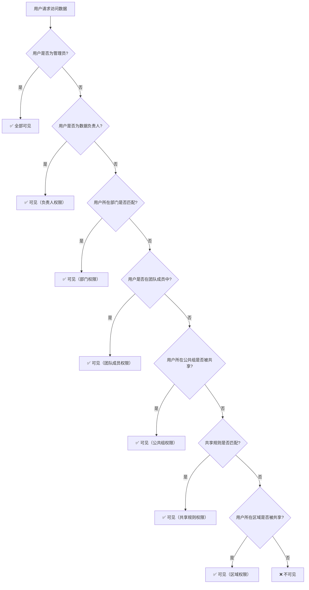
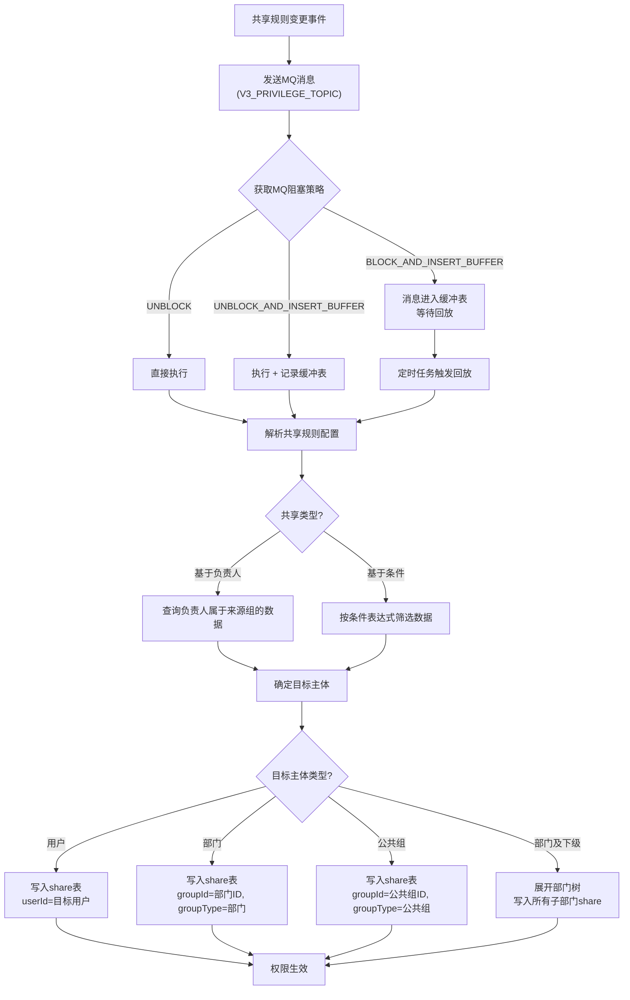
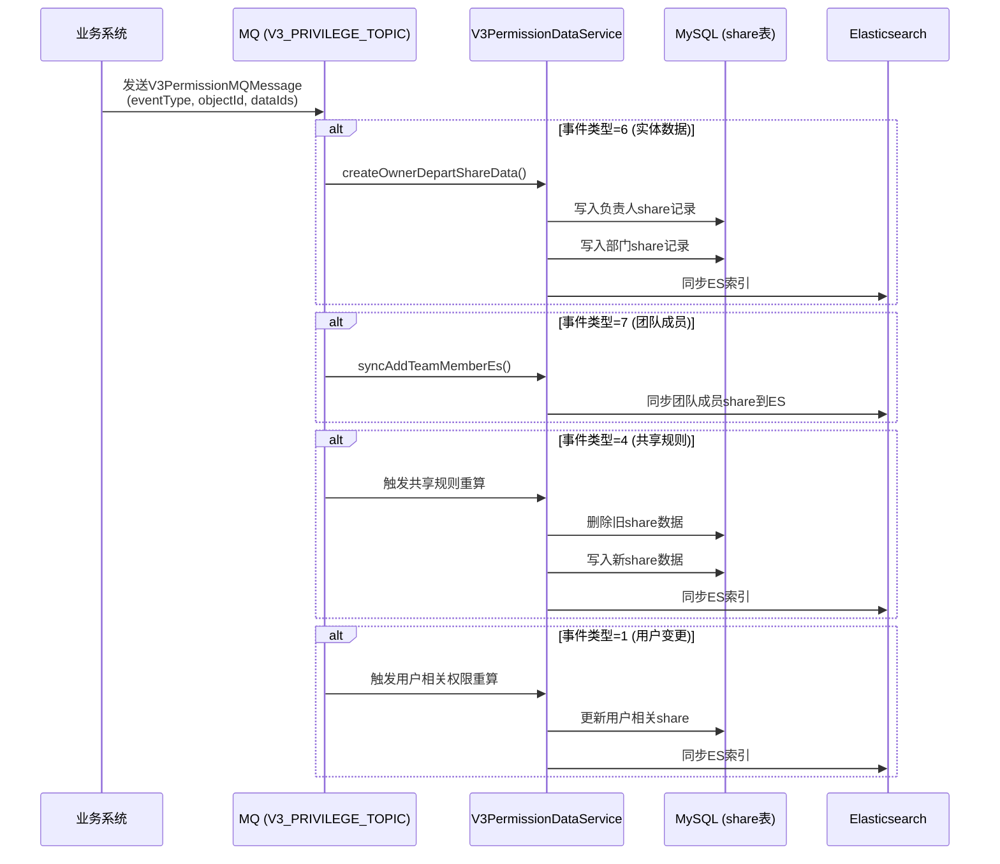
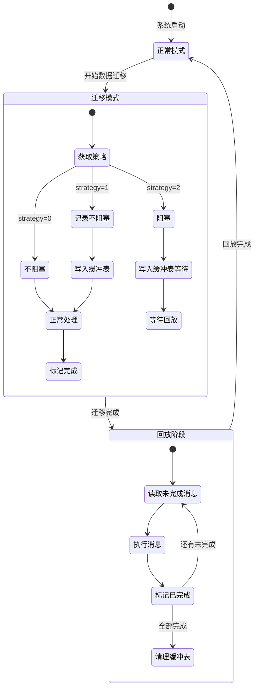
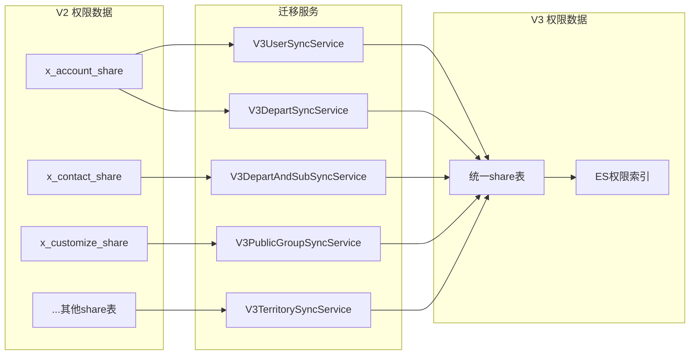
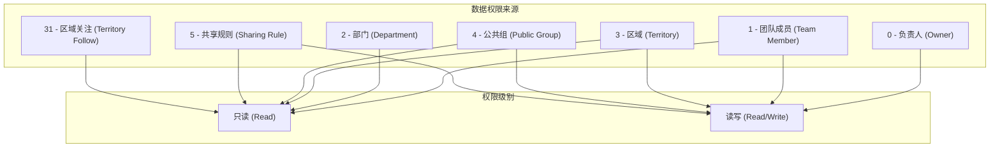

# paas-privilege-core 数据权限完整方案

## 一、项目概述

`paas-privilege-core` 是 aPaaS 平台的数据权限核心模块，基于 Java 8 + Hibernate JPA 构建，属于 `neo-biz-api` 的子模块。它定义了 CRM 系统中数据级别权限控制的完整接口体系，涵盖**共享规则（Sharing Rule）**、**权限组（Privilege Group）**、**V3 权限模型**三大核心子系统。该模块是一个纯接口层（core），不包含实现代码，为上层业务模块提供统一的数据权限契约。

依赖关系：`cloud-multi-tenant`（多租户）→ `base-core` → `paas-core` → `paas-auth-core`（认证）→ `paas-privilege-core`（本模块）

---

## 二、系统架构图

```mermaid
graph TB
    subgraph 入口层["入口层 - MQ消息 / API调用"]
        MQ["MQ消息<br/>(V3_PRIVILEGE_TOPIC)"]
        API["业务API调用"]
    end

    subgraph 核心业务层["核心业务层 - 数据权限"]
        subgraph V2["V2 共享规则体系 (sharingrule)"]
            XBaseShareSvc["XBaseShareService<br/>标准实体共享"]
            XCustomizeSvc["XCustomizeShareService<br/>自定义实体共享"]
            DataCalcSvc["DataPermissionCalculationService<br/>权限计算"]
            MqBlockSvc["MqBlockService<br/>MQ阻塞策略"]
            MsgBufferSvc["MessageBufferService<br/>消息缓冲"]
        end

        subgraph V3["V3 权限模型 (v3)"]
            V3DataSvc["V3PermissionDataService<br/>权限数据CRUD"]
            V3SyncSvc["V3PermissionSynDataService<br/>历史数据同步"]
            V3CheckSvc["V3PermissionCheckService<br/>权限校验"]
            V3ESSvc["V3PrivilegeESQueryService<br/>ES查询"]
            SubjectSvc["XSubjectShareDataService<br/>主体共享数据"]
        end

        subgraph PrivGroup["权限组管理"]
            PrivGroupSvc["XPrivGroupDnService<br/>权限组关系"]
            ObjShareSvc["XObjectsShareService<br/>对象共享删除"]
        end

        subgraph V3Sync["V3 历史数据同步"]
            UserSync["V3UserSyncService"]
            DepartSync["V3DepartSyncService"]
            DepartSubSync["V3DepartAndSubSyncService"]
            PubGroupSync["V3PublicGroupSyncService"]
            TerritorySync["V3TerritorySyncService"]
        end
    end

    subgraph 数据层["数据层"]
        DB["MySQL<br/>(多租户分表)"]
        ES["Elasticsearch<br/>(权限索引)"]
    end

    MQ --> V3DataSvc
    MQ --> MqBlockSvc
    API --> XBaseShareSvc
    API --> XCustomizeSvc
    API --> V3DataSvc

    XBaseShareSvc --> DB
    XCustomizeSvc --> DB
    V3DataSvc --> DB
    V3DataSvc --> ES
    V3SyncSvc --> ES
    V3ESSvc --> ES
    MsgBufferSvc --> DB
    PrivGroupSvc --> DB

---

## 三、目录结构心智模型

```
paas-privilege-core/src/main/java/com/rkhd/interprise/privilege/
├── dto/                          # 权限组相关DTO
│   ├── XPrivGroupUserDn.java     # 权限组-用户关系（用户属于哪个权限组）
│   └── XPrivGroupHierDn.java     # 权限组-层级关系（权限组之间的上下级）
├── service/                      # 🔑 顶层服务接口
│   ├── XObjectsShareService.java # 对象级共享数据删除
│   └── XPrivGroupDnService.java  # 权限组关系维护
├── sharingrule/                  # 🔑 共享规则子系统（V2）
│   ├── constant/
│   │   └── ShareRuleConvertEnums.java  # 共享规则枚举定义（类型/主体/权限/操作符）
│   ├── dto/
│   │   ├── XBaseShare.java             # 共享记录基础DTO
│   │   ├── XCustomizeShare.java        # 自定义实体共享DTO
│   │   ├── XCustomSystemShare.java     # 自定义系统共享DTO
│   │   ├── XShareRuleDto.java          # 共享规则配置DTO
│   │   ├── XShareRuleConditionDto.java # 共享规则条件DTO
│   │   └── MqMessageDto.java          # MQ消息封装DTO
│   ├── model/                          # JPA实体模型（每个CRM对象一张share表）
│   │   ├── BaseShare.java              # 🔑 共享记录基类（@MappedSuperclass）
│   │   ├── CustomSystemShare.java      # 自定义系统共享基类
│   │   ├── CustomizeShare.java         # x_customize_share 表
│   │   ├── AccountShare.java           # x_account_share 表
│   │   ├── ContactShare.java           # x_contact_share 表
│   │   ├── LeadShare.java              # x_lead_share 表
│   │   ├── OpportunityShare.java       # x_opportunity_share 表
│   │   ├── CampaignShare.java          # x_campaign_share 表
│   │   ├── CaseShare.java              # x_case_share 表
│   │   ├── ContractShare.java          # x_contract_share 表
│   │   ├── OrderShare.java             # x_order_share 表
│   │   ├── PaymentShare.java           # x_payment_share 表
│   │   ├── PaymentPlanShare.java       # x_payment_plan_share 表
│   │   ├── ProductShare.java           # x_product_share 表
│   │   ├── CustomSystemShare401.java   # x_custom_system_share_401 表
│   │   └── MessageBuffer.java         # message_buffer 表（MQ消息缓冲）
│   └── service/
│       ├── XBaseShareService.java                # 🔑 标准实体共享CRUD
│       ├── XCustomizeShareService.java           # 自定义实体共享CRUD
│       ├── DataPermissionCalculationService.java # 权限计算（慢SQL分析）
│       ├── MqBlockService.java                   # MQ消息阻塞策略
│       └── MessageBufferService.java             # 消息缓冲管理
└── v3/                           # 🔑 V3权限模型（新一代）
    ├── constant/
    │   └── V3PermissionConstant.java   # V3常量（事件类型/MQ Topic）
    ├── dto/
    │   ├── V3PermissionMQMessage.java  # V3权限MQ消息体
    │   ├── ShareDataDto.java           # 共享数据DTO
    │   ├── ShareDataQueryParam.java    # 共享数据查询参数
    │   ├── CheckResult.java            # 校验结果
    │   ├── SyncResult.java             # 同步结果
    │   ├── V3PrivilegeESDto.java       # ES权限查询结果
    │   └── V3PrivilegeESDetailDto.java # ES权限明细
    └── service/
        ├── V3PermissionDataService.java      # 🔑 V3权限数据CRUD
        ├── V3PermissionSynDataService.java   # V3历史数据同步
        ├── V3PermissionCheckService.java     # V3权限校验
        ├── V3PrivilegeESQueryService.java    # ES权限查询
        ├── XSubjectShareDataService.java     # 主体共享数据管理
        ├── V3UserSyncService.java            # 用户同步
        ├── V3DepartSyncService.java          # 部门同步
        ├── V3DepartAndSubSyncService.java    # 部门及下级同步
        ├── V3PublicGroupSyncService.java     # 公共组同步
        └── V3TerritorySyncService.java       # 区域组同步
```


---

## 四、核心数据模型详解

### 4.1 共享记录模型（BaseShare）

`BaseShare` 是所有共享记录的基类，使用 `@MappedSuperclass` 注解，每个 CRM 标准对象都有独立的 share 表。

```java
@MappedSuperclass
public class BaseShare extends BaseModel {
    Long userId;          // 被共享的用户ID（直接共享给用户时使用）
    Long ruleId;          // 关联的共享规则ID（由规则触发时记录）
    Long dataId;          // 被共享的数据记录ID
    Long groupId;         // 被共享的组ID（部门/公共组/区域）
    Short groupType;      // 组类型（区分部门、公共组、区域等）
    Short accessLevel;    // 访问级别（1=只读, 2=读写）
    Short groupHierAccess = 1; // 组层级访问控制（默认1）
    Long bussinessId;     // 业务ID（关联业务场景）
    Short rowCause;       // 行级原因（标识共享来源：负责人/部门/团队成员/公共组/共享规则/区域）
    Short scope;          // 作用域
    Short deleteFlg;      // 软删除标记
    Long newGroupId;      // 新组ID（双写冗余字段，用于V2→V3迁移）
}
```

**share 表分表策略**：每个标准 CRM 对象一张独立的 share 表：

| 实体类型 | 表名 | 模型类 |
|---------|------|--------|
| 客户 | `x_account_share` | AccountShare |
| 联系人 | `x_contact_share` | ContactShare |
| 线索 | `x_lead_share` | LeadShare |
| 商机 | `x_opportunity_share` | OpportunityShare |
| 市场活动 | `x_campaign_share` | CampaignShare |
| 工单 | `x_case_share` | CaseShare |
| 合同 | `x_contract_share` | ContractShare |
| 订单 | `x_order_share` | OrderShare |
| 回款 | `x_payment_share` | PaymentShare |
| 回款计划 | `x_payment_plan_share` | PaymentPlanShare |
| 产品 | `x_product_share` | ProductShare |
| 自定义实体 | `x_customize_share` | CustomizeShare（多了 entityId 字段） |
| 自定义系统401 | `x_custom_system_share_401` | CustomSystemShare401 |

**关键设计决策**：
- 标准对象每个一张表，避免大表性能问题
- 自定义实体共用 `x_customize_share` 表，通过 `entityId` 区分
- 所有 ID 使用 SnowFlake 雪花算法生成
- `newGroupId` 字段是 V2→V3 迁移的双写冗余字段

### 4.2 权限组关系模型

#### XPrivGroupUserDn（权限组-用户关系）

```java
public class XPrivGroupUserDn {
    Long id;
    Long tenantId;           // 租户ID
    Long userId;             // 用户ID
    Long groupId;            // 权限组ID
    Short groupType;         // 组类型
    Long objectId;           // 实体ID
    Short reason;            // 关系原因
    Short accessLevel;       // 访问级别
    Short userHierAccess;    // 用户层级访问
    Short groupHierAccess = 1; // 组层级访问（默认1）
}
```

#### XPrivGroupHierDn（权限组-层级关系）

```java
public class XPrivGroupHierDn {
    Long id;
    Long tenantId;              // 租户ID
    Long groupId;               // 权限组ID
    Short groupType;            // 组类型
    Long relatedGroupId;        // 关联权限组ID
    Short relatedGroupType;     // 关联组类型
    Short reason;               // 关系原因
    Long objectId;              // 实体ID
    Long ruleId;                // 规则ID
    Short accessLevel;          // 访问级别
    Short userHierAccess;       // 用户层级访问
    Short groupHierAccess;      // 组层级访问
}
```

### 4.3 共享规则配置模型

#### XShareRuleDto（共享规则）

```java
public class XShareRuleDto {
    Long id;
    String objectApikey;     // 实体API Key
    String apikey;           // 规则API Key
    String label;            // 规则名称
    String description;      // 规则描述
    String shareTypeCode;    // 共享类型：owner(基于负责人) / condition(基于条件)
    String fromTypeCode;     // 来源主体类型
    Long fromId;             // 来源主体ID
    String toTypeCode;       // 目标主体类型
    Long toId;               // 目标主体ID
    String criteriaLogic;    // 条件逻辑表达式
    String scopeCode;        // 作用域
    List<XShareRuleConditionDto> conditions; // 条件列表
}
```

#### XShareRuleConditionDto（共享规则条件）

```java
public class XShareRuleConditionDto {
    Long id;
    String itemApikey;       // 字段API Key
    String operatorCode;     // 操作符：equal/notEqual/greaterThan/contain/empty...
    String value;            // 条件值
    Integer rowNo;           // 行号（用于条件排序）
}
```


---

## 五、枚举体系详解

### 5.1 共享规则类型（ShareRuleShareTypeEnum）

| ID | Code | 含义 |
|----|------|------|
| 0 | `owner` | 基于数据负责人 — 当数据负责人属于某个组时，将数据共享给目标组 |
| 1 | `condition` | 基于条件 — 当数据满足指定条件时，将数据共享给目标组 |

### 5.2 共享主体类型（ShareRuleSubjectTypeEnum）

| ID | Code | 含义 | 说明 |
|----|------|------|------|
| 0 | `user` | 用户 | 直接共享给指定用户 |
| 1 | `publicGroup` | 公共组 | 共享给公共组的所有成员 |
| 2 | `depart` | 部门 | 共享给指定部门 |
| -2 | `subDepartWithoutOutter` | 外部部门 | 需判断是否为外部部门 |
| 5 | `departInternalSubDepart` | 部门及内部下级部门 | 开启外部部门时使用（与4互斥） |
| 4 | `departSubDepart` | 部门及下级部门 | 未开启外部部门时使用（与5互斥） |
| 3 | `departAndSubWithoutOutter` | 部门、下级部门及外部下级部门 | 最大范围 |

### 5.3 权限级别（ShareRulePermissionEnum）

| ID | Code | 含义 |
|----|------|------|
| 1 | `read` | 只读 |
| 2 | `write` | 读写 |

### 5.4 条件操作符（ShareRuleOperatorEnum）

| ID | Code | 含义 |
|----|------|------|
| 1 | `equal` | 等于 |
| 2 | `notEqual` | 不等于 |
| 6 | `greaterThan` | 大于 |
| 7 | `greaterEqual` | 大于等于 |
| 8 | `lessThan` | 小于 |
| 9 | `lessEqual` | 小于等于 |
| 10 | `contain` | 包含 |
| 16 | `notContain` | 不包含 |
| 13 | `empty` | 为空 |
| 14 | `notEmpty` | 不为空 |

### 5.5 V3 事件类型（V3PermissionConstant.EventType）

| 值 | 含义 | 触发场景 |
|----|------|---------|
| 1 | 用户事件 | 用户创建/修改/删除/角色变更 |
| 2 | 部门事件 | 部门创建/修改/删除/层级调整 |
| 3 | 公共组事件 | 公共组成员变更 |
| 4 | 共享规则事件 | 共享规则创建/修改/删除 |
| 5 | 区域事件 | 区域创建/修改/删除 |
| 6 | 实体数据事件 | 数据创建/修改/删除/转移 |
| 7 | 团队成员事件 | 团队成员添加/移除 |
| 8 | 区域SHARE数据事件 | 区域共享数据变更 |
| 9 | 实体数据SHARE规则CHECK | 共享规则数据校验 |

### 5.6 V3 ShareType（ShareDataQueryParam.ShareType）

| 枚举值 | 数值 | 含义 |
|--------|------|------|
| OWNER | 0 | 负责人 |
| TEAM_MEMBER | 1 | 团队成员 |
| DEPART | 2 | 部门 |
| TERRITORY | 3 | 区域 |
| PUBLIC_GROUP | 4 | 公共组 |
| SHARE_RULE | 5 | 共享规则 |
| TERRITORY_FOLLOW | 31 | 区域关注 |

---

## 六、核心服务接口详解

### 6.1 XBaseShareService — 标准实体共享服务

这是 V2 体系中最核心的服务，管理标准 CRM 对象的共享记录。

```
核心操作链：
共享规则触发 → 计算匹配数据 → 写入 x_{entity}_share 表 → 权限生效

关键方法分析：
├── get(id, objectId, tenantParam)                    # 按ID查询单条共享记录
├── getList(idList, objectId, tenantParam)             # 批量查询共享记录
├── save(xBaseShare, tenantParam)                      # 保存单条共享记录
├── saveBatch(list, objectId, tenantParam)             # 批量保存（无返回值，性能优先）
├── saveBatchWithReturnValue(list, objectId, tenantParam) # 批量保存（有返回值）
├── update(xBaseShare, tenantParam)                    # 更新共享记录
├── delete(id, objectId, tenantParam)                  # 删除单条
├── deleteList(idList, objectId, tenantParam)          # 批量删除
├── deleteByRuleIdsAndDataIds(ruleIds, dataIds, objectId, tenantParam) # 按规则+数据ID删除
├── deleteByEntityIdAndRuleId(objectId, ruleId, tenantParam)           # 按实体+规则删除
├── deleteByEntityId(objectId, tenantParam)            # 按实体删除所有共享
├── deleteShareRuleData(objectId, notInRuleIds, tenantParam)           # 删除不在列表中的规则数据
├── getIdListByEntityIdAndDataId(objectId, dataId, tenantParam)        # 按实体+数据查ID
├── getIdListByEntityIdAndGroupId(objectId, groupId, tenantParam)      # 按实体+组查ID
├── getIdListByEntityIdAndRuleId(objectId, ruleId, tenantParam)        # 按实体+规则查ID
├── getIdListByEntityIdAndRuleIdAndDataId(objectId, ruleId, dataId, tenantParam) # 三维查询
├── getIdListBySubSharingRule(mainRule, subRule, tenantParam)           # 子共享规则查询
├── countByEntityIdAndRuleId(objectId, ruleId, tenantParam)            # 按规则计数
├── countByEntityIdAndGroupId(objectId, groupId, tenantParam)          # 按组计数
├── getRuleIdListByEntityId(objectId, tenantParam)                     # 获取实体下所有规则ID
├── getRuleIdListByEntityIdAndGroupId(objectId, groupId, tenantParam)  # 获取实体+组下的规则ID
└── queryResultBySql(sql, param, tenantParam)          # 原生SQL查询（共享规则专用）
```

### 6.2 XCustomizeShareService — 自定义实体共享服务

与 `XBaseShareService` 类似，但专门服务于自定义实体（`x_customize_share` 表），通过 `entityId` 区分不同自定义实体。

### 6.3 V3PermissionDataService — V3 权限数据服务

V3 模型的核心数据操作接口，围绕"负责人+部门"的共享数据管理。

```
核心方法：
├── createOwnerDepartShareData(dataIds, objectId, tenantParam)
│   # 创建数据时，自动生成负责人和部门的共享记录
│   # 触发时机：数据新建
│
├── updateOwnerDepartShareData(dataIds, objectId, updateOwner, updateDepart, tenantParam)
│   # 更新负责人/部门共享数据
│   # updateOwner: 是否更新负责人共享
│   # updateDepart: 是否更新部门共享
│   # 触发时机：数据编辑（负责人或部门字段变更）
│
├── transferOwnerDepartShareData(dataIds, objectId, toUserId, tenantParam)
│   # 数据转移时更新共享关系
│   # 触发时机：数据转移操作
│
├── deleteShareDataByDataIds(dataIds, objectId, tenantParam)
│   # 删除数据时清理所有共享记录
│   # 触发时机：数据删除
│
├── getShareIds(queryParam, tenantParam)
│   # 按条件查询share表ID（支持多维度过滤）
│
├── getShareCount(queryParam, tenantParam)
│   # 查询share数据量
│
└── deleteShareData(ids, objectId, tenantParam)
    # 按ID删除共享数据
```

### 6.4 V3PermissionCheckService — V3 权限校验服务

提供全面的权限数据一致性校验能力，支持 13 种校验类型：

```java
enum CheckType {
    USER,                          // 校验用户权限数据
    DEPART,                        // 校验部门权限数据
    PUBLICGROUP,                   // 校验公共组权限数据
    TERRITORY_GROUP,               // 校验区域组权限数据
    ENTITY,                        // 校验实体权限数据
    TEAMMEMBER,                    // 校验团队成员权限数据
    SHARE_RULE,                    // 校验共享规则权限数据
    TERRITORY_DATA,                // 校验区域share数据
    ORIGIN_SHARE_RULE_AUTHGROUP,   // 校验原始共享规则authGroup
    ORIGIN_USER,                   // 校验原始用户（上级用户、所属部门）
    ORIGIN_DEPART,                 // 校验原始部门层级
    ORIGIN_SHARE_RULE,             // 校验原始共享规则配置
    ORIGIN_TEAMMEMBER              // 校验原始团队成员(135,136)
}
```

### 6.5 V3PrivilegeESQueryService — ES 权限查询服务

通过 Elasticsearch 提供高性能的权限数据查询：

```
├── getTeamMemberShareData(entityId, startShareId, pageSize, tenantParam)
│   # 分页查询实体下所有团队成员的share数据
│
├── getShareRuleShareData(entityId, ruleId, startShareId, pageSize, tenantParam)
│   # 分页查询指定共享规则的share数据
│
└── getTerritoryShareData(entityId, startShareId, pageSize, tenantParam)
    # 分页查询实体下所有区域的share数据
```

### 6.6 MqBlockService — MQ 消息阻塞策略服务

在数据迁移场景下，控制 MQ 消息的处理策略：

```
三种策略：
├── UNBLOCK (0)                    # 不阻塞，正常处理
├── UNBLOCK_AND_INSERT_BUFFER (1)  # 不阻塞，但记录到缓冲表（任务完成后标记完成）
└── BLOCK_AND_INSERT_BUFFER (2)    # 阻塞，消息进入缓冲表等待回放

核心方法：
├── getMqExecuteStrategy(tenantId, entityId)  # 获取当前阻塞策略
├── unblockAndInsertBuffer(dto)               # 执行策略1
├── blockAndInsertBuffer(dto)                 # 执行策略2
├── messageReplay(tenantIds)                  # 消息回放
├── getState(tenantIds)                       # 获取消息状态统计
└── deleteMqMessages(tenantIds)               # 清理已完成的缓冲数据
```

### 6.7 V3 历史数据同步服务族

5 个同步服务，用于将 V2 权限数据迁移到 V3 模型：

| 服务 | 同步内容 |
|------|---------|
| V3UserSyncService | 用户权限数据 |
| V3DepartSyncService | 部门权限数据 |
| V3DepartAndSubSyncService | 部门及下级权限组（23,24） |
| V3PublicGroupSyncService | 公共组权限数据 |
| V3TerritorySyncService | 区域组权限数据 |

所有同步服务统一接口：`SyncResult execute(TenantParam tenantParam)`


---

## 七、核心流程分析

### 7.1 数据权限判定总流程



### 7.2 共享规则执行流程



### 7.3 V3 权限事件处理流程



### 7.4 数据迁移 MQ 阻塞流程



---

## 八、V2 与 V3 权限模型对比

| 维度 | V2 模型 | V3 模型 |
|------|---------|---------|
| 存储方式 | 每个标准对象独立share表 | 统一share表 + ES索引 |
| 自定义实体 | `x_customize_share` 单表 + entityId | 统一模型 |
| 权限主体 | groupId + groupType | subjectId + subjectType |
| 查询方式 | 直接SQL查询 | ES高性能查询 |
| 数据同步 | 实时写入 | MQ异步 + ES同步 |
| 校验能力 | 无 | 13种CheckType全面校验 |
| 迁移支持 | - | 5个Sync服务 + MQ阻塞策略 |
| 双写支持 | `newGroupId` 冗余字段 | 原生支持 |

### V2→V3 迁移路径



---

## 九、关键设计决策分析

### 9.1 为什么每个标准对象一张 share 表？

**问题**：如何存储不同对象的共享关系？

**方案**：每个标准 CRM 对象（Account/Contact/Lead 等）独立一张 `x_{entity}_share` 表。

**原因**：
- CRM 系统中，客户/商机等核心对象的数据量巨大（百万级），共享记录可能是数据量的数倍
- 独立表避免了单表过大导致的查询性能问题
- 不同对象的共享策略可能不同，独立表便于差异化处理

**Trade-off**：
- 优势：查询性能好，单表数据量可控
- 劣势：表数量多，代码重复度高（每个 Model 类几乎一样），新增标准对象需要建表

### 9.2 为什么自定义实体共用一张表？

**问题**：自定义实体数量不确定，无法预先建表。

**方案**：所有自定义实体共用 `x_customize_share` 表，通过 `entityId` 字段区分。

**原因**：
- 自定义实体是用户动态创建的，无法预先为每个实体建表
- 通过 `entityId` 索引可以高效过滤

**Trade-off**：
- 优势：灵活，支持任意数量的自定义实体
- 劣势：当自定义实体多且数据量大时，单表可能成为瓶颈

### 9.3 为什么引入 MQ 阻塞策略？

**问题**：数据迁移期间，MQ 消息可能导致数据不一致。

**方案**：三级阻塞策略（不阻塞 / 记录不阻塞 / 完全阻塞）。

**原因**：
- 数据迁移是一次性操作，需要保证迁移期间数据一致性
- 完全阻塞会影响业务，需要灵活的策略选择
- 缓冲表 + 回放机制保证消息不丢失

### 9.4 为什么 V3 引入 ES？

**问题**：V2 模型下，权限查询依赖 SQL，在大数据量下性能不足。

**方案**：V3 模型引入 Elasticsearch 作为权限数据的查询层。

**原因**：
- 权限判定是高频操作，每次数据访问都需要判定
- ES 的倒排索引天然适合"用户能看哪些数据"这类查询
- 支持分页查询，避免一次加载过多数据

---

## 十、数据权限的 7 种来源（rowCause）

根据代码分析，数据权限共有 7 种来源，对应 share 表的 `rowCause` / V3 的 `ShareType`：



---

## 十一、关键文件索引

| 文件 | 关键内容 |
|------|---------|
| `sharingrule/model/BaseShare.java` | 🔑 共享记录基类，定义所有share表的公共字段 |
| `sharingrule/constant/ShareRuleConvertEnums.java` | 🔑 完整的枚举定义（共享类型/主体类型/权限/操作符） |
| `sharingrule/service/XBaseShareService.java` | 🔑 标准实体共享CRUD核心接口 |
| `sharingrule/service/XCustomizeShareService.java` | 自定义实体共享CRUD接口 |
| `sharingrule/service/MqBlockService.java` | MQ消息阻塞策略（数据迁移用） |
| `sharingrule/service/MessageBufferService.java` | 消息缓冲管理 |
| `sharingrule/dto/XShareRuleDto.java` | 共享规则配置DTO |
| `v3/service/V3PermissionDataService.java` | 🔑 V3权限数据CRUD核心接口 |
| `v3/service/V3PermissionCheckService.java` | V3权限校验（13种CheckType） |
| `v3/service/V3PrivilegeESQueryService.java` | ES权限查询接口 |
| `v3/dto/V3PermissionMQMessage.java` | V3权限MQ消息体 |
| `v3/dto/ShareDataQueryParam.java` | 共享数据查询参数（含ShareType枚举） |
| `v3/constant/V3PermissionConstant.java` | V3事件类型常量 |
| `dto/XPrivGroupUserDn.java` | 权限组-用户关系 |
| `dto/XPrivGroupHierDn.java` | 权限组-层级关系 |
| `service/XPrivGroupDnService.java` | 权限组关系维护接口 |

---

## 十二、总结

`paas-privilege-core` 实现了一套完整的 CRM 数据权限体系，核心设计思路是：

1. **共享记录表（Share Table）**：每条数据的每个权限来源都对应一条 share 记录，通过 `rowCause` 区分来源类型
2. **7 种权限来源**：负责人、团队成员、部门、区域、公共组、共享规则、区域关注
3. **两种共享规则**：基于负责人（owner）和基于条件（condition）
4. **V2→V3 演进**：从分表 SQL 查询演进到统一表 + ES 索引的高性能模型
5. **迁移保障**：MQ 阻塞策略 + 消息缓冲 + 回放机制，确保迁移期间数据一致性
6. **多租户隔离**：所有操作都通过 `TenantParam` 进行租户隔离
