# aPaaS 数据权限技术设计方案

> 基于 paas-privilege-core 接口层 + paas-privilege-service 实现层的完整源码分析

---

## 一、文档概述

### 1.1 目标

本文档基于老系统 `paas-privilege-core`（接口层）和 `paas-privilege-service`（实现层，740 个 Java 文件，~113K 行代码）的深度分析，输出一份完整的数据权限技术设计方案，作为新系统 `paas-privilege-service`（Spring Cloud 架构）重构的设计蓝图。

### 1.2 系统定位

数据权限服务是 aPaaS 平台的核心安全基础设施，解决的核心问题是：**"谁能看到哪些数据"**。它是 CRM 系统中最复杂的服务之一，涉及共享规则引擎、权限反规范化、权限匹配链、V3 权限同步等多个子系统。

### 1.3 术语表

| 术语 | 英文 | 含义 |
|------|------|------|
| 数据权限 | Data Permission | 控制用户对业务数据记录的可见性和操作权限 |
| 共享规则 | Sharing Rule | 定义数据在用户/部门/公共组/区域间的自动共享策略 |
| 反规范化 | Denormalize | 将权限关系展开写入冗余表，加速运行时查询 |
| 权限匹配链 | MatchLink | 链式处理模式，逐级判断用户对数据的访问权限 |
| Share 表 | Share Table | 存储共享关系的数据表，每条记录表示一个"数据→主体"的权限授予 |
| 权限主体 | Subject | 被授予权限的对象：用户/部门/公共组/区域 |
| rowCause | Row Cause | 共享记录的来源类型标识 |
| 区域 | Territory | CRM 中按地理或业务维度划分的权限域 |
| 权限组 | Privilege Group | 用于权限计算的组织单元抽象 |

---

## 二、系统架构

### 2.1 整体架构

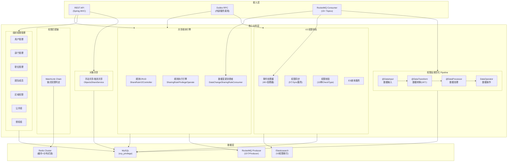
```mermaid
graph TB
    subgraph 接入层["接入层"]
        REST["REST API<br/>(Spring MVC)"]
        DUBBO["Dubbo RPC<br/>(内部服务调用)"]
        MQ_IN["RocketMQ Consumer<br/>(15+ Topics)"]
    end

    subgraph 业务层["核心业务层"]
        subgraph 共享规则["共享规则引擎"]
            SR_CRUD["规则CRUD<br/>ShareRuleV2Controller"]
            SR_ENGINE["规则执行引擎<br/>SharingRulePrivilegeOperate"]
            SR_CONSUMER["数据变更消费者<br/>DataChangeSharingRuleConsumer"]
        end

        subgraph 反规范化["权限反规范化 Pipeline"]
            DN_INPUT["@DataInput<br/>数据输入"]
            DN_TRANSFORM["@DataTransform<br/>数据转换(18个)"]
            DN_PROCESSOR["@DataProcessor<br/>数据处理"]
            DN_OPERATOR["DataOperator<br/>数据操作"]
        end

        subgraph 匹配链["权限匹配链"]
            ML_CHAIN["MatchLink Chain<br/>链式权限判定"]
        end

        subgraph V3权限["V3 权限体系"]
            V3_EVENT["事件处理器<br/>(40+处理器)"]
            V3_SYNC["权限同步<br/>(5个Sync服务)"]
            V3_CHECK["权限校验<br/>(13种CheckType)"]
            V3_ES["ES查询服务"]
        end

        subgraph 组织权限["组织权限管理"]
            USER_MGR["用户管理"]
            DEPT_MGR["部门管理"]
            POS_MGR["职位管理"]
            TEAM_MGR["团队成员"]
            TERR_MGR["区域权限"]
            PUB_GRP["公共组"]
            AUTH_GRP["授权组"]
        end

        subgraph 对象共享["对象共享"]
            OBJ_SHARE["手动共享/取消共享<br/>ObjectsShareService"]
        end
    end

    subgraph 数据层["数据层"]
        MYSQL["MySQL<br/>(xsy_privilege)"]
        REDIS["Redis Cluster<br/>(缓存+分布式锁)"]
        ES["Elasticsearch<br/>(V3权限索引)"]
        MQ_OUT["RocketMQ Producer<br/>(15个Producer)"]
    end

    REST --> 共享规则
    REST --> 组织权限
    REST --> 对象共享
    DUBBO --> 共享规则
    DUBBO --> V3权限
    MQ_IN --> SR_CONSUMER
    MQ_IN --> V3_EVENT
    MQ_IN --> 反规范化

    DN_INPUT --> DN_TRANSFORM
    DN_TRANSFORM --> DN_PROCESSOR
    DN_PROCESSOR --> DN_OPERATOR

    共享规则 --> MYSQL
    反规范化 --> MYSQL
    V3权限 --> ES
    V3权限 --> MYSQL
    组织权限 --> MYSQL
    对象共享 --> MYSQL
    ML_CHAIN --> REDIS
    共享规则 --> MQ_OUT
```


### 2.2 模块依赖关系

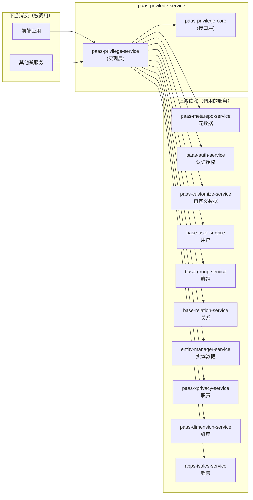
```mermaid
graph LR
    subgraph 本服务["paas-privilege-service"]
        CORE["paas-privilege-core<br/>(接口层)"]
        IMPL["paas-privilege-service<br/>(实现层)"]
    end

    subgraph 上游依赖["上游依赖（调用的服务）"]
        META["paas-metarepo-service<br/>元数据"]
        AUTH["paas-auth-service<br/>认证授权"]
        CUST["paas-customize-service<br/>自定义数据"]
        USER_SVC["base-user-service<br/>用户"]
        GROUP_SVC["base-group-service<br/>群组"]
        REL_SVC["base-relation-service<br/>关系"]
        ENTITY_SVC["entity-manager-service<br/>实体数据"]
        PRIVACY["paas-xprivacy-service<br/>职责"]
        DIM["paas-dimension-service<br/>维度"]
        SALES["apps-isales-service<br/>销售"]
    end

    subgraph 下游消费["下游消费（被调用）"]
        WEB["前端应用"]
        OTHER["其他微服务"]
    end

    IMPL --> CORE
    IMPL --> META
    IMPL --> AUTH
    IMPL --> CUST
    IMPL --> USER_SVC
    IMPL --> GROUP_SVC
    IMPL --> REL_SVC
    IMPL --> ENTITY_SVC
    IMPL --> PRIVACY
    IMPL --> DIM
    IMPL --> SALES

    WEB --> IMPL
    OTHER --> IMPL
```

---

## 三、数据权限模型

### 3.1 权限来源体系（7 种 rowCause）

数据权限的核心设计是 **Share Table 模式**：每条业务数据的每个权限来源都对应一条 share 记录。

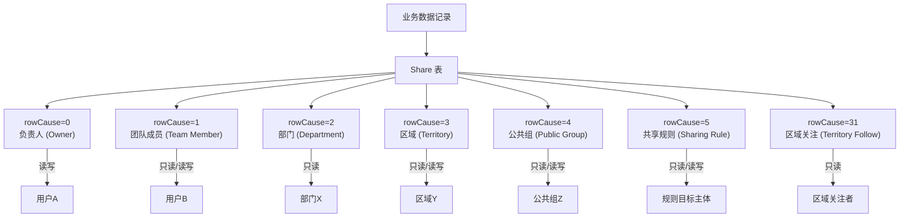
```mermaid
graph TB
    DATA["业务数据记录"] --> SHARE["Share 表"]

    SHARE --> RC0["rowCause=0<br/>负责人 (Owner)"]
    SHARE --> RC1["rowCause=1<br/>团队成员 (Team Member)"]
    SHARE --> RC2["rowCause=2<br/>部门 (Department)"]
    SHARE --> RC3["rowCause=3<br/>区域 (Territory)"]
    SHARE --> RC4["rowCause=4<br/>公共组 (Public Group)"]
    SHARE --> RC5["rowCause=5<br/>共享规则 (Sharing Rule)"]
    SHARE --> RC31["rowCause=31<br/>区域关注 (Territory Follow)"]

    RC0 --> |读写| USER_A["用户A"]
    RC1 --> |只读/读写| USER_B["用户B"]
    RC2 --> |只读| DEPT["部门X"]
    RC3 --> |只读/读写| TERR["区域Y"]
    RC4 --> |只读/读写| PG["公共组Z"]
    RC5 --> |只读/读写| RULE_TARGET["规则目标主体"]
    RC31 --> |只读| TERR_F["区域关注者"]
```

### 3.2 权限判定优先级

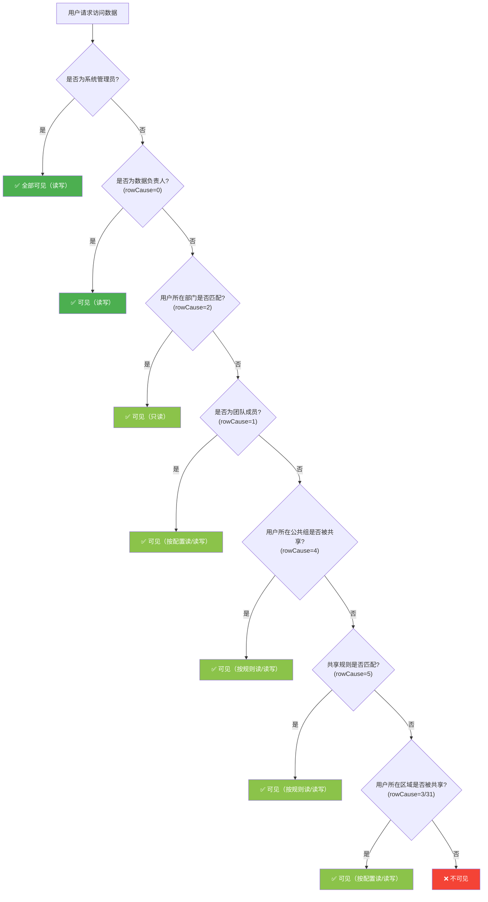
```mermaid
flowchart TD
    START["用户请求访问数据"] --> ADMIN{"是否为系统管理员?"}
    ADMIN -->|是| ALLOW_ALL["✅ 全部可见（读写）"]
    ADMIN -->|否| OWNER{"是否为数据负责人?<br/>(rowCause=0)"}
    OWNER -->|是| ALLOW_RW["✅ 可见（读写）"]
    OWNER -->|否| DEPT{"用户所在部门是否匹配?<br/>(rowCause=2)"}
    DEPT -->|是| ALLOW_DEPT["✅ 可见（只读）"]
    DEPT -->|否| TEAM{"是否为团队成员?<br/>(rowCause=1)"}
    TEAM -->|是| ALLOW_TEAM["✅ 可见（按配置读/读写）"]
    TEAM -->|否| PG{"用户所在公共组是否被共享?<br/>(rowCause=4)"}
    PG -->|是| ALLOW_PG["✅ 可见（按规则读/读写）"]
    PG -->|否| RULE{"共享规则是否匹配?<br/>(rowCause=5)"}
    RULE -->|是| ALLOW_RULE["✅ 可见（按规则读/读写）"]
    RULE -->|否| TERR{"用户所在区域是否被共享?<br/>(rowCause=3/31)"}
    TERR -->|是| ALLOW_TERR["✅ 可见（按配置读/读写）"]
    TERR -->|否| DENY["❌ 不可见"]

    style ALLOW_ALL fill:#4CAF50,color:#fff
    style ALLOW_RW fill:#4CAF50,color:#fff
    style ALLOW_DEPT fill:#8BC34A,color:#fff
    style ALLOW_TEAM fill:#8BC34A,color:#fff
    style ALLOW_PG fill:#8BC34A,color:#fff
    style ALLOW_RULE fill:#8BC34A,color:#fff
    style ALLOW_TERR fill:#8BC34A,color:#fff
    style DENY fill:#F44336,color:#fff
```

### 3.3 Share 表数据模型

#### 3.3.1 核心字段定义

```sql
-- 所有 share 表的公共字段（BaseShare）
CREATE TABLE x_{entity}_share (
    id              BIGINT PRIMARY KEY,     -- 雪花算法ID
    tenant_id       BIGINT NOT NULL,        -- 租户ID（多租户隔离）
    data_id         BIGINT NOT NULL,        -- 被共享的业务数据ID
    user_id         BIGINT,                 -- 被共享的用户ID（直接共享给用户时）
    group_id        BIGINT,                 -- 被共享的组ID（部门/公共组/区域）
    new_group_id    BIGINT,                 -- V3新组ID（双写冗余，迁移用）
    group_type      SMALLINT,               -- 组类型
    rule_id         BIGINT,                 -- 关联的共享规则ID
    bussiness_id    BIGINT,                 -- 业务ID
    access_level    SMALLINT,               -- 访问级别：1=只读, 2=读写
    group_hier_access SMALLINT DEFAULT 1,   -- 组层级访问控制
    row_cause       SMALLINT,               -- 来源类型：0=负责人,1=团队成员,2=部门,3=区域,4=公共组,5=共享规则,31=区域关注
    scope           SMALLINT,               -- 作用域
    delete_flg      SMALLINT,               -- 软删除标记
    created_by      BIGINT,                 -- 创建人
    created_at      BIGINT,                 -- 创建时间
    updated_by      BIGINT,                 -- 更新人
    updated_at      BIGINT,                 -- 更新时间

    INDEX idx_data_id (data_id),
    INDEX idx_user_id (user_id),
    INDEX idx_group_id (group_id),
    INDEX idx_rule_id (rule_id),
    INDEX idx_row_cause (row_cause)
);
```

#### 3.3.2 分表策略

| 分类 | 表名 | 适用场景 | 数据量级 |
|------|------|---------|---------|
| 标准实体（11张） | `x_account_share` | 客户 | 百万级 |
| | `x_contact_share` | 联系人 | 百万级 |
| | `x_lead_share` | 线索 | 百万级 |
| | `x_opportunity_share` | 商机 | 百万级 |
| | `x_campaign_share` | 市场活动 | 十万级 |
| | `x_case_share` | 工单 | 十万级 |
| | `x_contract_share` | 合同 | 十万级 |
| | `x_order_share` | 订单 | 十万级 |
| | `x_payment_share` | 回款 | 十万级 |
| | `x_payment_plan_share` | 回款计划 | 十万级 |
| | `x_product_share` | 产品 | 万级 |
| 自定义实体（1张） | `x_customize_share` | 所有自定义实体（通过 entity_id 区分） | 千万级 |
| 自定义系统（1张） | `x_custom_system_share_401` | 系统自定义对象 | 十万级 |

### 3.4 权限组模型

权限组是权限计算的中间抽象层，用于将"用户→组→数据"的多对多关系进行反规范化。

#### 3.4.1 权限组-用户关系（XPrivGroupUserDn）

```sql
-- 记录用户属于哪些权限组
CREATE TABLE x_priv_group_user_dn (
    id              BIGINT PRIMARY KEY,
    tenant_id       BIGINT NOT NULL,
    user_id         BIGINT NOT NULL,        -- 用户ID
    group_id        BIGINT NOT NULL,        -- 权限组ID
    group_type      SMALLINT,               -- 组类型
    object_id       BIGINT,                 -- 实体ID
    reason          SMALLINT,               -- 关系原因
    access_level    SMALLINT,               -- 访问级别
    user_hier_access SMALLINT,              -- 用户层级访问
    group_hier_access SMALLINT DEFAULT 1,   -- 组层级访问
    
    INDEX idx_user_id (user_id),
    INDEX idx_group_id (group_id)
);
```

#### 3.4.2 权限组-层级关系（XPrivGroupHierDn）

```sql
-- 记录权限组之间的上下级关系
CREATE TABLE x_priv_group_hier_dn (
    id                  BIGINT PRIMARY KEY,
    tenant_id           BIGINT NOT NULL,
    group_id            BIGINT NOT NULL,        -- 权限组ID
    group_type          SMALLINT,               -- 组类型
    related_group_id    BIGINT NOT NULL,        -- 关联权限组ID
    related_group_type  SMALLINT,               -- 关联组类型
    reason              SMALLINT,               -- 关系原因
    object_id           BIGINT,                 -- 实体ID
    rule_id             BIGINT,                 -- 规则ID
    access_level        SMALLINT,               -- 访问级别
    user_hier_access    SMALLINT,               -- 用户层级访问
    group_hier_access   SMALLINT,               -- 组层级访问
    
    INDEX idx_group_id (group_id),
    INDEX idx_related_group_id (related_group_id)
);
```


---

## 四、共享规则引擎

### 4.1 共享规则配置模型

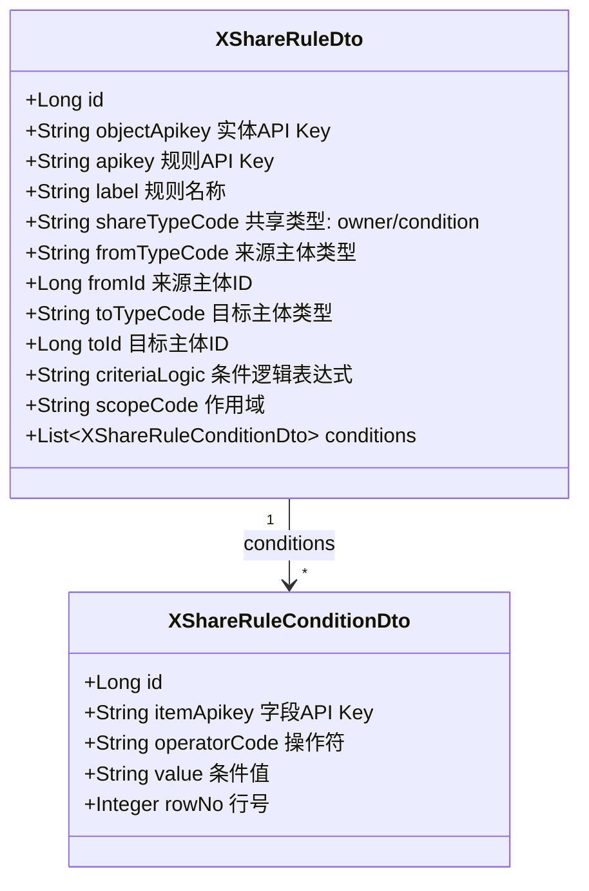
```mermaid
classDiagram
    class XShareRuleDto {
        +Long id
        +String objectApikey     实体API Key
        +String apikey           规则API Key
        +String label            规则名称
        +String shareTypeCode    共享类型: owner/condition
        +String fromTypeCode     来源主体类型
        +Long fromId             来源主体ID
        +String toTypeCode       目标主体类型
        +Long toId               目标主体ID
        +String criteriaLogic    条件逻辑表达式
        +String scopeCode        作用域
        +List~XShareRuleConditionDto~ conditions
    }

    class XShareRuleConditionDto {
        +Long id
        +String itemApikey       字段API Key
        +String operatorCode     操作符
        +String value            条件值
        +Integer rowNo           行号
    }

    XShareRuleDto "1" --> "*" XShareRuleConditionDto : conditions
```

### 4.2 共享规则类型

| 类型 | Code | 含义 | 执行逻辑 |
|------|------|------|---------|
| 基于负责人 | `owner` | 当数据负责人属于来源组时，将数据共享给目标组 | 查询负责人 ∈ fromGroup 的数据 → 写入 share(toGroup) |
| 基于条件 | `condition` | 当数据满足指定条件时，将数据共享给目标组 | 按 conditions 筛选数据 → 写入 share(toGroup) |

### 4.3 共享主体类型

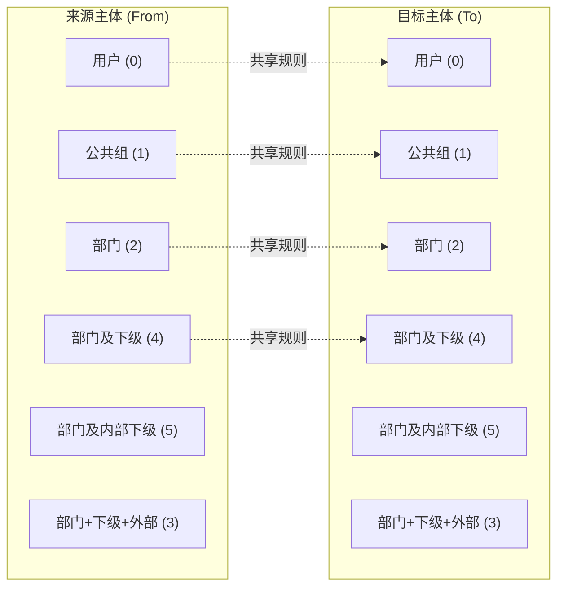
```mermaid
graph LR
    subgraph 来源主体["来源主体 (From)"]
        F_USER["用户 (0)"]
        F_PG["公共组 (1)"]
        F_DEPT["部门 (2)"]
        F_DEPT_SUB["部门及下级 (4)"]
        F_DEPT_INT["部门及内部下级 (5)"]
        F_DEPT_ALL["部门+下级+外部 (3)"]
    end

    subgraph 目标主体["目标主体 (To)"]
        T_USER["用户 (0)"]
        T_PG["公共组 (1)"]
        T_DEPT["部门 (2)"]
        T_DEPT_SUB["部门及下级 (4)"]
        T_DEPT_INT["部门及内部下级 (5)"]
        T_DEPT_ALL["部门+下级+外部 (3)"]
    end

    F_USER -.->|共享规则| T_USER
    F_PG -.->|共享规则| T_PG
    F_DEPT -.->|共享规则| T_DEPT
    F_DEPT_SUB -.->|共享规则| T_DEPT_SUB
```

### 4.4 条件操作符

| ID | Code | 含义 | 适用字段类型 |
|----|------|------|------------|
| 1 | `equal` | 等于 | 所有类型 |
| 2 | `notEqual` | 不等于 | 所有类型 |
| 6 | `greaterThan` | 大于 | 数值/日期 |
| 7 | `greaterEqual` | 大于等于 | 数值/日期 |
| 8 | `lessThan` | 小于 | 数值/日期 |
| 9 | `lessEqual` | 小于等于 | 数值/日期 |
| 10 | `contain` | 包含 | 文本/多选 |
| 16 | `notContain` | 不包含 | 文本/多选 |
| 13 | `empty` | 为空 | 所有类型 |
| 14 | `notEmpty` | 不为空 | 所有类型 |

### 4.5 共享规则执行流程

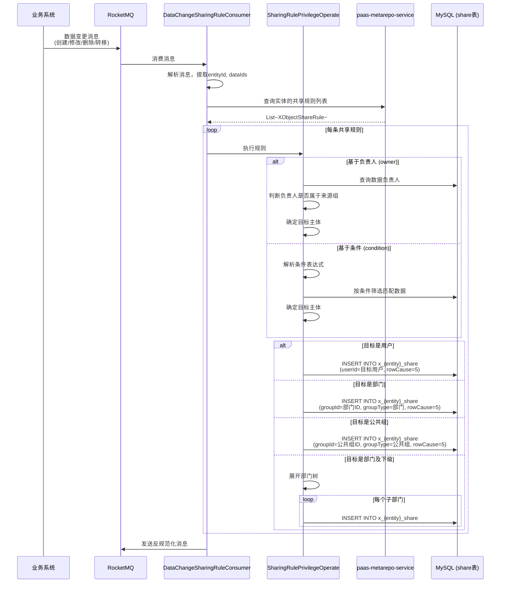
```mermaid
sequenceDiagram
    participant Biz as 业务系统
    participant MQ as RocketMQ
    participant Consumer as DataChangeSharingRuleConsumer
    participant Engine as SharingRulePrivilegeOperate
    participant Meta as paas-metarepo-service
    participant DB as MySQL (share表)

    Biz->>MQ: 数据变更消息<br/>(创建/修改/删除/转移)
    MQ->>Consumer: 消费消息

    Consumer->>Consumer: 解析消息，提取entityId, dataIds

    Consumer->>Meta: 查询实体的共享规则列表
    Meta-->>Consumer: List~XObjectShareRule~

    loop 每条共享规则
        Consumer->>Engine: 执行规则

        alt 基于负责人 (owner)
            Engine->>DB: 查询数据负责人
            Engine->>Engine: 判断负责人是否属于来源组
            Engine->>Engine: 确定目标主体
        else 基于条件 (condition)
            Engine->>Engine: 解析条件表达式
            Engine->>DB: 按条件筛选匹配数据
            Engine->>Engine: 确定目标主体
        end

        alt 目标是用户
            Engine->>DB: INSERT INTO x_{entity}_share<br/>(userId=目标用户, rowCause=5)
        else 目标是部门
            Engine->>DB: INSERT INTO x_{entity}_share<br/>(groupId=部门ID, groupType=部门, rowCause=5)
        else 目标是公共组
            Engine->>DB: INSERT INTO x_{entity}_share<br/>(groupId=公共组ID, groupType=公共组, rowCause=5)
        else 目标是部门及下级
            Engine->>Engine: 展开部门树
            loop 每个子部门
                Engine->>DB: INSERT INTO x_{entity}_share
            end
        end
    end

    Consumer->>MQ: 发送反规范化消息
```

### 4.6 数据变更触发矩阵

| 数据操作 | 触发的权限动作 | 影响的 rowCause |
|---------|--------------|----------------|
| 数据创建 | 创建负责人share + 部门share + 执行匹配的共享规则 | 0, 2, 5 |
| 修改负责人 | 更新负责人share + 重算基于负责人的共享规则 | 0, 5 |
| 修改部门 | 更新部门share | 2 |
| 修改字段值 | 重算基于条件的共享规则 | 5 |
| 数据删除 | 删除所有share记录 | 0, 1, 2, 3, 4, 5, 31 |
| 数据转移 | 更新负责人share + 部门share + 重算共享规则 | 0, 2, 5 |
| 添加团队成员 | 创建团队成员share | 1 |
| 移除团队成员 | 删除团队成员share | 1 |

---

## 五、权限反规范化引擎（Denormalize Pipeline）

### 5.1 设计思想

权限反规范化的核心思想是：将复杂的"用户→组→数据"多级间接关系，展开为扁平化的直接关系表，使运行时权限查询从多表 JOIN 变为单表查询。

### 5.2 Pipeline 架构


```mermaid
flowchart LR
    subgraph Input["@DataInput<br/>数据输入"]
        I1["权限变更事件"]
        I2["组织变更事件"]
        I3["规则变更事件"]
    end

    subgraph Transform["@DataTransform<br/>数据转换 (18个实现)"]
        T1["用户→部门映射"]
        T2["部门→子部门展开"]
        T3["公共组→成员展开"]
        T4["区域→成员展开"]
        T5["职位→用户映射"]
        T6["...其他12个"]
    end

    subgraph Processor["@DataProcessor<br/>数据处理"]
        P1["GroupHier处理器<br/>组层级关系"]
        P2["GroupUser处理器<br/>组用户关系"]
        P3["ObjectsShare处理器<br/>对象共享关系"]
        P4["UserHier处理器<br/>用户层级关系"]
    end

    subgraph Operator["DataOperator<br/>数据操作"]
        O1["批量INSERT"]
        O2["批量DELETE"]
        O3["批量UPDATE"]
    end

    Input --> Transform --> Processor --> Operator

    Operator --> DB["反规范化表<br/>x_priv_group_user_dn<br/>x_priv_group_hier_dn"]
```

### 5.3 注解驱动的自动注册

```java
// 通过注解标记，Spring 启动时自动扫描注册到 Registry
@DataInput(name = "userChange")
public class UserChangeInput { ... }

@DataTransform(name = "userToDepartMapping")
public class UserToDepartTransform { ... }

@DataProcessor(name = "groupUserProcessor")
public class GroupUserProcessor { ... }

// Registry 自动发现并编排执行链
DataInputRegistry.register(input);
DataTransformRegistry.register(transform);
DataProcessorContext.register(processor);
```

### 5.4 反规范化触发场景

| 触发事件 | Input | Transform | Processor | 写入表 |
|---------|-------|-----------|-----------|--------|
| 用户创建/修改 | UserChangeInput | UserToDepartTransform | GroupUserProcessor | x_priv_group_user_dn |
| 部门变更 | DepartChangeInput | DepartToSubDepartTransform | GroupHierProcessor | x_priv_group_hier_dn |
| 公共组成员变更 | PublicGroupInput | PublicGroupMemberTransform | GroupUserProcessor | x_priv_group_user_dn |
| 区域变更 | TerritoryInput | TerritoryMemberTransform | GroupUserProcessor | x_priv_group_user_dn |
| 共享规则变更 | ShareRuleInput | ShareRuleTargetTransform | ObjectsShareProcessor | x_{entity}_share |
| 职位变更 | PositionInput | PositionToUserTransform | UserHierProcessor | x_priv_group_user_dn |

---

## 六、权限匹配链（MatchLink）

### 6.1 设计模式

采用责任链模式（Chain of Responsibility），每个 Matcher 负责一种权限来源的判定，按优先级链式执行。

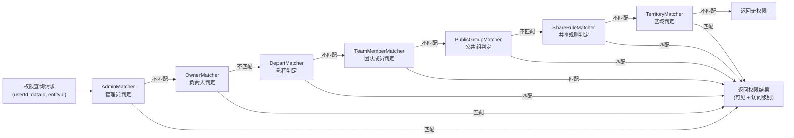
```mermaid
flowchart LR
    REQ["权限查询请求<br/>(userId, dataId, entityId)"] --> M1

    M1["AdminMatcher<br/>管理员判定"] -->|不匹配| M2
    M1 -->|匹配| RESULT

    M2["OwnerMatcher<br/>负责人判定"] -->|不匹配| M3
    M2 -->|匹配| RESULT

    M3["DepartMatcher<br/>部门判定"] -->|不匹配| M4
    M3 -->|匹配| RESULT

    M4["TeamMemberMatcher<br/>团队成员判定"] -->|不匹配| M5
    M4 -->|匹配| RESULT

    M5["PublicGroupMatcher<br/>公共组判定"] -->|不匹配| M6
    M5 -->|匹配| RESULT

    M6["ShareRuleMatcher<br/>共享规则判定"] -->|不匹配| M7
    M6 -->|匹配| RESULT

    M7["TerritoryMatcher<br/>区域判定"] -->|不匹配| DENY
    M7 -->|匹配| RESULT

    RESULT["返回权限结果<br/>(可见 + 访问级别)"]
    DENY["返回无权限"]
```

### 6.2 匹配逻辑伪代码

```java
public class PrivilegeMatchChain {
    private List<PrivilegeMatcher> matchers; // 按优先级排序

    public MatchResult match(Long userId, Long dataId, Long entityId) {
        for (PrivilegeMatcher matcher : matchers) {
            MatchResult result = matcher.match(userId, dataId, entityId);
            if (result.isMatched()) {
                return result; // 短路返回，第一个匹配即生效
            }
        }
        return MatchResult.DENIED;
    }
}
```

---

## 七、V3 权限体系

### 7.1 V3 vs V2 对比

| 维度 | V2 模型 | V3 模型 |
|------|---------|---------|
| 存储 | 每个标准对象独立share表（13张） | 统一share表 + ES索引 |
| 自定义实体 | `x_customize_share` 单表 + entityId | 统一模型 |
| 权限主体标识 | groupId + groupType | subjectId + subjectType |
| 查询方式 | SQL直接查询 | ES倒排索引查询 |
| 数据同步 | 同步写入 | MQ异步 + ES近实时同步 |
| 校验能力 | 无 | 13种CheckType全面校验 |
| 性能 | 大数据量下SQL慢查询 | ES毫秒级响应 |

### 7.2 V3 事件驱动架构

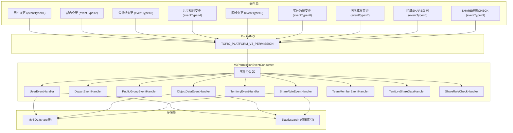
```mermaid
flowchart TD
    subgraph 事件源["事件源"]
        E1["用户变更 (eventType=1)"]
        E2["部门变更 (eventType=2)"]
        E3["公共组变更 (eventType=3)"]
        E4["共享规则变更 (eventType=4)"]
        E5["区域变更 (eventType=5)"]
        E6["实体数据变更 (eventType=6)"]
        E7["团队成员变更 (eventType=7)"]
        E8["区域SHARE数据 (eventType=8)"]
        E9["SHARE规则CHECK (eventType=9)"]
    end

    subgraph MQ["RocketMQ"]
        TOPIC["TOPIC_PLATFORM_V3_PERMISSION"]
    end

    subgraph 消费者["V3PermissionEventConsumer"]
        DISPATCH["事件分发器"]
        H1["UserEventHandler"]
        H2["DepartEventHandler"]
        H3["PublicGroupEventHandler"]
        H4["ShareRuleEventHandler"]
        H5["TerritoryEventHandler"]
        H6["ObjectDataEventHandler"]
        H7["TeamMemberEventHandler"]
        H8["TerritoryShareDataHandler"]
        H9["ShareRuleCheckHandler"]
    end

    subgraph 存储["存储层"]
        DB["MySQL (share表)"]
        ES["Elasticsearch (权限索引)"]
    end

    E1 --> TOPIC
    E2 --> TOPIC
    E3 --> TOPIC
    E4 --> TOPIC
    E5 --> TOPIC
    E6 --> TOPIC
    E7 --> TOPIC
    E8 --> TOPIC
    E9 --> TOPIC

    TOPIC --> DISPATCH
    DISPATCH --> H1
    DISPATCH --> H2
    DISPATCH --> H3
    DISPATCH --> H4
    DISPATCH --> H5
    DISPATCH --> H6
    DISPATCH --> H7
    DISPATCH --> H8
    DISPATCH --> H9

    H1 --> DB
    H1 --> ES
    H6 --> DB
    H6 --> ES
    H4 --> DB
    H4 --> ES
```

### 7.3 V3 MQ 消息体

```java
public class V3PermissionMQMessage {
    Short eventType;              // 事件类型（1-9）
    Long objectId;                // 实体ID
    Short operationType;          // 操作类型（增/删/改）
    List<Long> dataIds;           // 数据ID列表
    Long tenantId;                // 租户ID
    Long userId;                  // 操作用户ID
    Map<String,Object> extParams; // 扩展参数
}
```

### 7.4 V3 ES 索引设计

```json
{
  "v3_privilege_index": {
    "mappings": {
      "properties": {
        "tenantId":    { "type": "long" },
        "entityId":    { "type": "long" },
        "shareId":     { "type": "long" },
        "dataId":      { "type": "long" },
        "subjectId":   { "type": "long" },
        "subjectType": { "type": "integer" },
        "businessId":  { "type": "long" },
        "createdAt":   { "type": "long" },
        "createdBy":   { "type": "long" }
      }
    }
  }
}
```

### 7.5 V3 权限校验体系

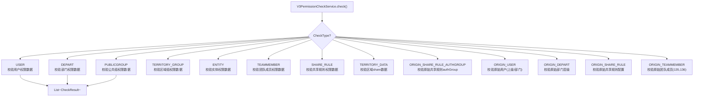
```mermaid
graph TB
    CHECK["V3PermissionCheckService.check()"] --> TYPE{"CheckType?"}

    TYPE --> CT1["USER<br/>校验用户权限数据"]
    TYPE --> CT2["DEPART<br/>校验部门权限数据"]
    TYPE --> CT3["PUBLICGROUP<br/>校验公共组权限数据"]
    TYPE --> CT4["TERRITORY_GROUP<br/>校验区域组权限数据"]
    TYPE --> CT5["ENTITY<br/>校验实体权限数据"]
    TYPE --> CT6["TEAMMEMBER<br/>校验团队成员权限数据"]
    TYPE --> CT7["SHARE_RULE<br/>校验共享规则权限数据"]
    TYPE --> CT8["TERRITORY_DATA<br/>校验区域share数据"]
    TYPE --> CT9["ORIGIN_SHARE_RULE_AUTHGROUP<br/>校验原始共享规则authGroup"]
    TYPE --> CT10["ORIGIN_USER<br/>校验原始用户(上级/部门)"]
    TYPE --> CT11["ORIGIN_DEPART<br/>校验原始部门层级"]
    TYPE --> CT12["ORIGIN_SHARE_RULE<br/>校验原始共享规则配置"]
    TYPE --> CT13["ORIGIN_TEAMMEMBER<br/>校验原始团队成员(135,136)"]

    CT1 --> RESULT["List~CheckResult~"]
    CT2 --> RESULT
    CT3 --> RESULT
```

### 7.6 V3 历史数据同步

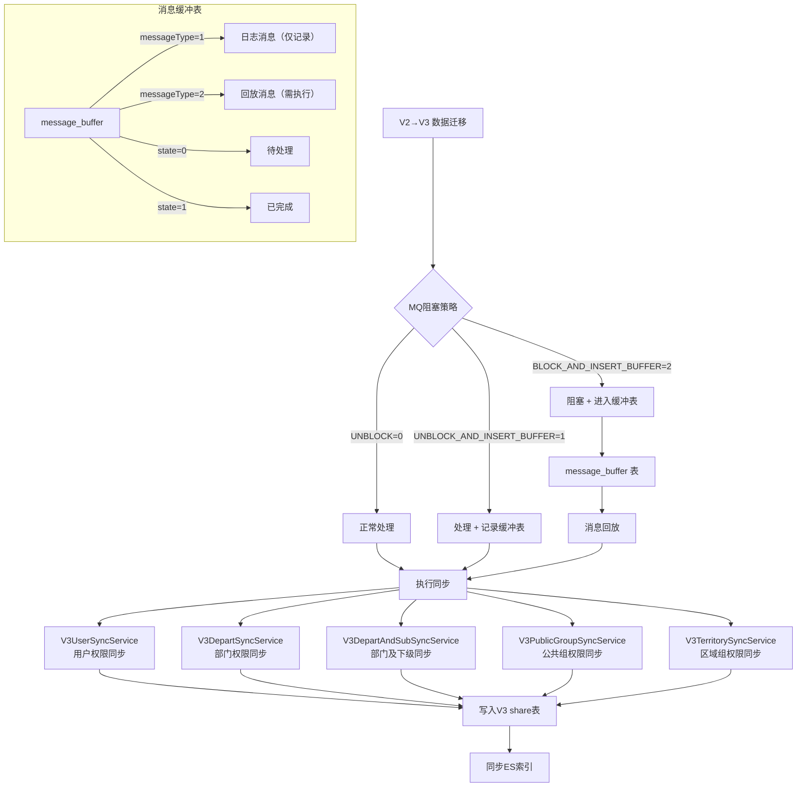
```mermaid
flowchart TD
    START["V2→V3 数据迁移"] --> STRATEGY{"MQ阻塞策略"}

    STRATEGY -->|UNBLOCK=0| NORMAL["正常处理"]
    STRATEGY -->|UNBLOCK_AND_INSERT_BUFFER=1| LOG["处理 + 记录缓冲表"]
    STRATEGY -->|BLOCK_AND_INSERT_BUFFER=2| BLOCK["阻塞 + 进入缓冲表"]

    NORMAL --> SYNC["执行同步"]
    LOG --> SYNC

    SYNC --> S1["V3UserSyncService<br/>用户权限同步"]
    SYNC --> S2["V3DepartSyncService<br/>部门权限同步"]
    SYNC --> S3["V3DepartAndSubSyncService<br/>部门及下级同步"]
    SYNC --> S4["V3PublicGroupSyncService<br/>公共组权限同步"]
    SYNC --> S5["V3TerritorySyncService<br/>区域组权限同步"]

    S1 --> DB["写入V3 share表"]
    S2 --> DB
    S3 --> DB
    S4 --> DB
    S5 --> DB

    DB --> ES["同步ES索引"]

    BLOCK --> BUFFER["message_buffer 表"]
    BUFFER --> REPLAY["消息回放"]
    REPLAY --> SYNC

    subgraph 消息缓冲表
        BUFFER_TABLE["message_buffer"]
        BUFFER_TABLE --> |"messageType=1"| LOG_MSG["日志消息（仅记录）"]
        BUFFER_TABLE --> |"messageType=2"| REPLAY_MSG["回放消息（需执行）"]
        BUFFER_TABLE --> |"state=0"| PENDING["待处理"]
        BUFFER_TABLE --> |"state=1"| DONE["已完成"]
    end
```


---

## 八、MQ 消息体系

### 8.1 Topic 全景

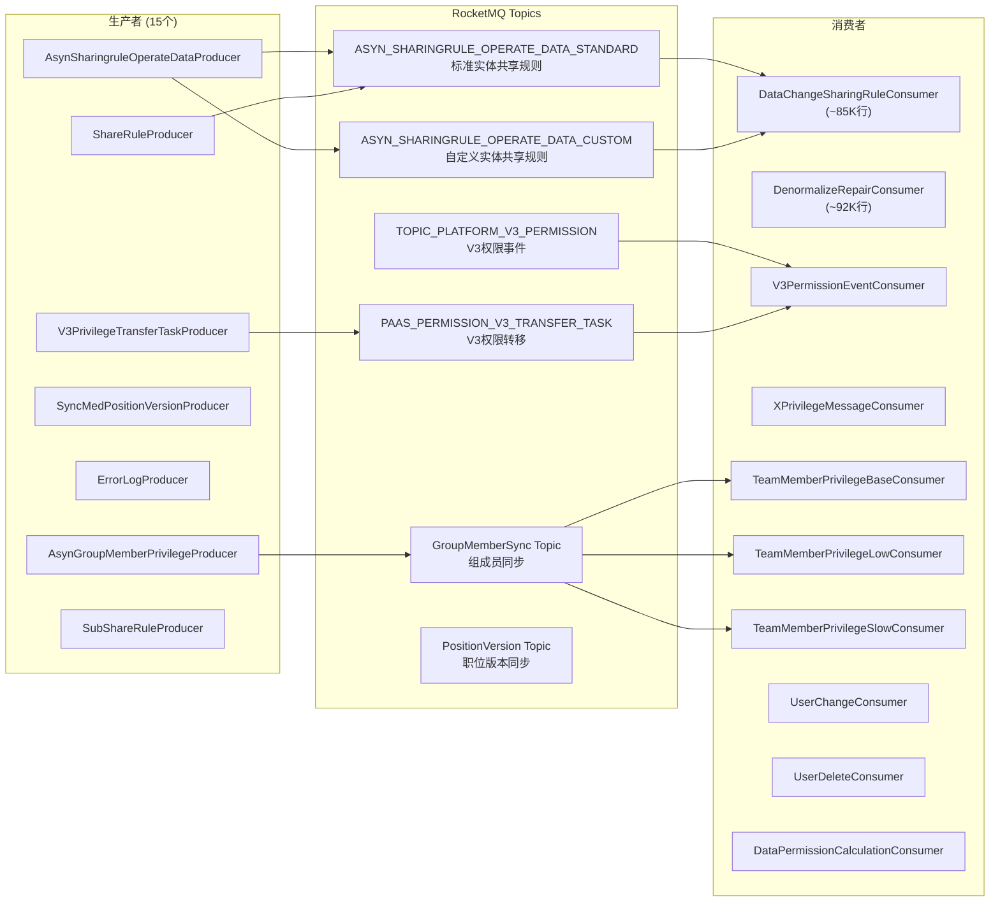
```mermaid
graph LR
    subgraph 生产者["生产者 (15个)"]
        P1["AsynSharingruleOperateDataProducer"]
        P2["V3PrivilegeTransferTaskProducer"]
        P3["AsynGroupMemberPrivilegeProducer"]
        P4["SyncMedPositionVersionProducer"]
        P5["ErrorLogProducer"]
        P6["ShareRuleProducer"]
        P7["SubShareRuleProducer"]
    end

    subgraph Topics["RocketMQ Topics"]
        T1["ASYN_SHARINGRULE_OPERATE_DATA_STANDARD<br/>标准实体共享规则"]
        T2["ASYN_SHARINGRULE_OPERATE_DATA_CUSTOM<br/>自定义实体共享规则"]
        T3["TOPIC_PLATFORM_V3_PERMISSION<br/>V3权限事件"]
        T4["PAAS_PERMISSION_V3_TRANSFER_TASK<br/>V3权限转移"]
        T5["GroupMemberSync Topic<br/>组成员同步"]
        T6["PositionVersion Topic<br/>职位版本同步"]
    end

    subgraph 消费者["消费者"]
        C1["DataChangeSharingRuleConsumer<br/>(~85K行)"]
        C2["DenormalizeRepairConsumer<br/>(~92K行)"]
        C3["V3PermissionEventConsumer"]
        C4["XPrivilegeMessageConsumer"]
        C5["TeamMemberPrivilegeBaseConsumer"]
        C6["TeamMemberPrivilegeLowConsumer"]
        C7["TeamMemberPrivilegeSlowConsumer"]
        C8["UserChangeConsumer"]
        C9["UserDeleteConsumer"]
        C10["DataPermissionCalculationConsumer"]
    end

    P1 --> T1
    P1 --> T2
    P2 --> T4
    P3 --> T5
    P6 --> T1

    T1 --> C1
    T2 --> C1
    T3 --> C3
    T4 --> C3
    T5 --> C5
    T5 --> C6
    T5 --> C7
```

### 8.2 团队成员多优先级消费

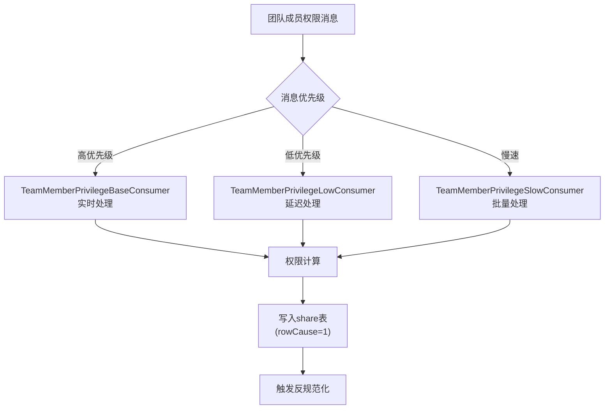
```mermaid
flowchart TD
    MSG["团队成员权限消息"] --> PRIORITY{"消息优先级"}

    PRIORITY -->|高优先级| BASE["TeamMemberPrivilegeBaseConsumer<br/>实时处理"]
    PRIORITY -->|低优先级| LOW["TeamMemberPrivilegeLowConsumer<br/>延迟处理"]
    PRIORITY -->|慢速| SLOW["TeamMemberPrivilegeSlowConsumer<br/>批量处理"]

    BASE --> CALC["权限计算"]
    LOW --> CALC
    SLOW --> CALC

    CALC --> SHARE["写入share表<br/>(rowCause=1)"]
    SHARE --> DN["触发反规范化"]
```

### 8.3 隔离 Topic 机制

大租户独立 Topic，避免影响其他租户的消息消费：

```
标准 Topic: ASYN_SHARINGRULE_OPERATE_DATA_STANDARD
隔离 Topic: ASYN_SHARINGRULE_OPERATE_DATA_STANDARD_{tenantId}

路由逻辑：
if (tenant.isIsolated()) {
    send(isolatedTopic + "_" + tenantId, message);
} else {
    send(standardTopic, message);
}
```

---

## 九、对象共享服务

### 9.1 手动共享流程

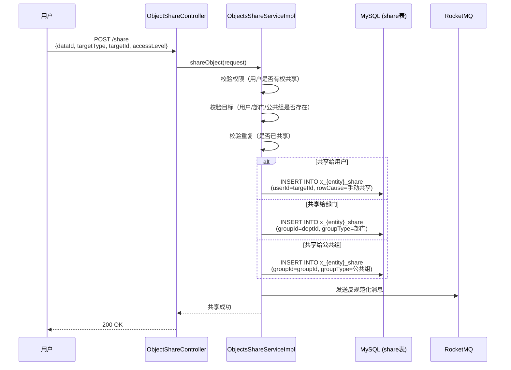
```mermaid
sequenceDiagram
    participant User as 用户
    participant API as ObjectShareController
    participant Svc as ObjectsShareServiceImpl
    participant DB as MySQL (share表)
    participant MQ as RocketMQ

    User->>API: POST /share<br/>{dataId, targetType, targetId, accessLevel}
    API->>Svc: shareObject(request)

    Svc->>Svc: 校验权限（用户是否有权共享）
    Svc->>Svc: 校验目标（用户/部门/公共组是否存在）
    Svc->>Svc: 校验重复（是否已共享）

    alt 共享给用户
        Svc->>DB: INSERT INTO x_{entity}_share<br/>(userId=targetId, rowCause=手动共享)
    else 共享给部门
        Svc->>DB: INSERT INTO x_{entity}_share<br/>(groupId=deptId, groupType=部门)
    else 共享给公共组
        Svc->>DB: INSERT INTO x_{entity}_share<br/>(groupId=groupId, groupType=公共组)
    end

    Svc->>MQ: 发送反规范化消息
    Svc-->>API: 共享成功
    API-->>User: 200 OK
```

### 9.2 取消共享流程

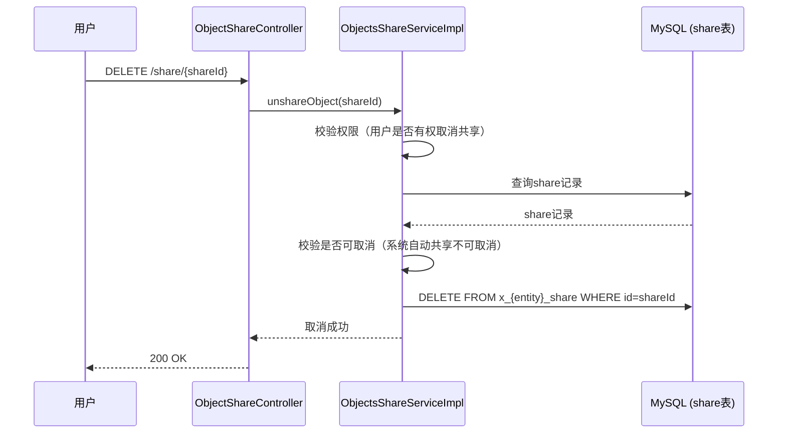
```mermaid
sequenceDiagram
    participant User as 用户
    participant API as ObjectShareController
    participant Svc as ObjectsShareServiceImpl
    participant DB as MySQL (share表)

    User->>API: DELETE /share/{shareId}
    API->>Svc: unshareObject(shareId)

    Svc->>Svc: 校验权限（用户是否有权取消共享）
    Svc->>DB: 查询share记录
    DB-->>Svc: share记录

    Svc->>Svc: 校验是否可取消（系统自动共享不可取消）

    Svc->>DB: DELETE FROM x_{entity}_share WHERE id=shareId
    Svc-->>API: 取消成功
    API-->>User: 200 OK
```

---

## 十、组织权限管理

### 10.1 用户权限生命周期

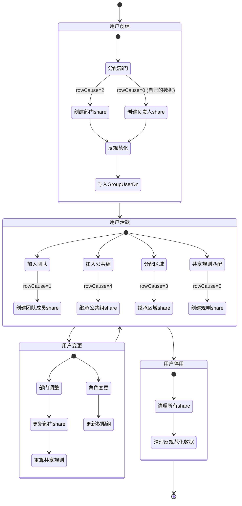
```mermaid
stateDiagram-v2
    [*] --> 用户创建

    state 用户创建 {
        [*] --> 分配部门
        分配部门 --> 创建部门share: rowCause=2
        分配部门 --> 创建负责人share: rowCause=0 (自己的数据)
        创建部门share --> 反规范化
        创建负责人share --> 反规范化
        反规范化 --> 写入GroupUserDn
    }

    用户创建 --> 用户活跃

    state 用户活跃 {
        [*] --> 加入团队
        加入团队 --> 创建团队成员share: rowCause=1
        [*] --> 加入公共组
        加入公共组 --> 继承公共组share: rowCause=4
        [*] --> 分配区域
        分配区域 --> 继承区域share: rowCause=3
        [*] --> 共享规则匹配
        共享规则匹配 --> 创建规则share: rowCause=5
    }

    用户活跃 --> 用户变更

    state 用户变更 {
        [*] --> 部门调整
        部门调整 --> 更新部门share
        更新部门share --> 重算共享规则
        [*] --> 角色变更
        角色变更 --> 更新权限组
    }

    用户变更 --> 用户活跃
    用户活跃 --> 用户停用

    state 用户停用 {
        [*] --> 清理所有share
        清理所有share --> 清理反规范化数据
    }

    用户停用 --> [*]
```

### 10.2 部门权限传播

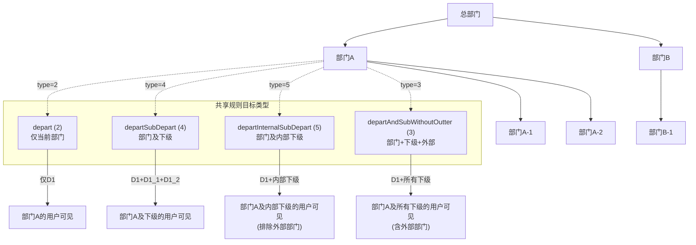
```mermaid
flowchart TD
    ROOT["总部门"] --> D1["部门A"]
    ROOT --> D2["部门B"]
    D1 --> D1_1["部门A-1"]
    D1 --> D1_2["部门A-2"]
    D2 --> D2_1["部门B-1"]

    subgraph 共享规则目标类型
        T2["depart (2)<br/>仅当前部门"]
        T4["departSubDepart (4)<br/>部门及下级"]
        T5["departInternalSubDepart (5)<br/>部门及内部下级"]
        T3["departAndSubWithoutOutter (3)<br/>部门+下级+外部"]
    end

    D1 -.->|"type=2"| T2
    D1 -.->|"type=4"| T4
    D1 -.->|"type=5"| T5
    D1 -.->|"type=3"| T3

    T2 -->|"仅D1"| SCOPE1["部门A的用户可见"]
    T4 -->|"D1+D1_1+D1_2"| SCOPE2["部门A及下级的用户可见"]
    T5 -->|"D1+内部下级"| SCOPE3["部门A及内部下级的用户可见<br/>(排除外部部门)"]
    T3 -->|"D1+所有下级"| SCOPE4["部门A及所有下级的用户可见<br/>(含外部部门)"]
```

---

## 十一、并发与性能设计

### 11.1 分布式锁策略

```java
// 租户级互斥锁，防止同一租户的权限操作并发冲突
@TenantExclusiveLock(key = "privilege:denormalize:{tenantId}:{entityId}")
public void denormalize(Long tenantId, Long entityId) {
    // 反规范化操作
}
```

| 锁场景 | 锁粒度 | 锁实现 | 超时时间 |
|--------|--------|--------|---------|
| 反规范化 | 租户+实体 | Redisson | 30s |
| 共享规则执行 | 租户+实体+规则 | Redisson | 60s |
| 数据转移 | 租户+数据 | Redisson | 30s |
| V3同步 | 租户 | Redisson | 120s |

### 11.2 批量操作优化

```java
// 批量保存share记录，避免逐条INSERT
void saveBatch(List<XBaseShare> shares, Long objectId, TenantParam tenantParam);

// 批量删除，避免逐条DELETE
boolean deleteList(List<Long> idList, Long objectId, TenantParam tenantParam);

// 分页查询，避免一次加载过多数据
List<MessageBuffer> getUnfinishedMessages(Long startId, Integer maxCount, ...);
```

### 11.3 缓存策略

| 缓存对象 | 缓存Key | TTL | 失效策略 |
|---------|---------|-----|---------|
| 实体共享规则列表 | `share_rule:{tenantId}:{entityId}` | 5min | 规则变更时主动失效 |
| 用户权限组 | `user_group:{tenantId}:{userId}` | 5min | 用户变更时主动失效 |
| 部门树 | `dept_tree:{tenantId}` | 10min | 部门变更时主动失效 |
| MQ阻塞策略 | `mq_strategy:{tenantId}:{entityId}` | 1min | 策略变更时主动失效 |

### 11.4 性能指标

| 操作 | 目标 P95 | 说明 |
|------|---------|------|
| 单条数据权限判定 | < 10ms | 走缓存 + 反规范化表 |
| 列表数据权限过滤 | < 100ms | ES 查询（V3） |
| 共享规则执行（单规则） | < 5s | 异步MQ处理 |
| 反规范化（单用户） | < 1s | 异步MQ处理 |
| V3 ES 查询 | < 50ms | ES 倒排索引 |

---

## 十二、MQ 消息阻塞与数据迁移

### 12.1 消息缓冲表设计

```sql
CREATE TABLE message_buffer (
    id           BIGINT PRIMARY KEY,        -- 雪花算法ID
    name         VARCHAR(255),              -- 任务名称
    message_type INT DEFAULT 0,             -- 消息类型：1=日志(仅记录), 2=需回放
    state        INT DEFAULT 0,             -- 状态：0=待处理, 1=已完成
    info         TEXT,                       -- MQ消息主体（JSON）
    tenant_id    BIGINT,                    -- 租户ID
    entity_id    BIGINT,                    -- 实体ID
    topic        VARCHAR(255),              -- MQ Topic
    group_name   VARCHAR(255),              -- MQ Group
    created_by   BIGINT,
    created_at   BIGINT,
    updated_by   BIGINT,
    updated_at   BIGINT,

    INDEX idx_tenant_state (tenant_id, state),
    INDEX idx_message_type (message_type)
);
```

### 12.2 三级阻塞策略详解

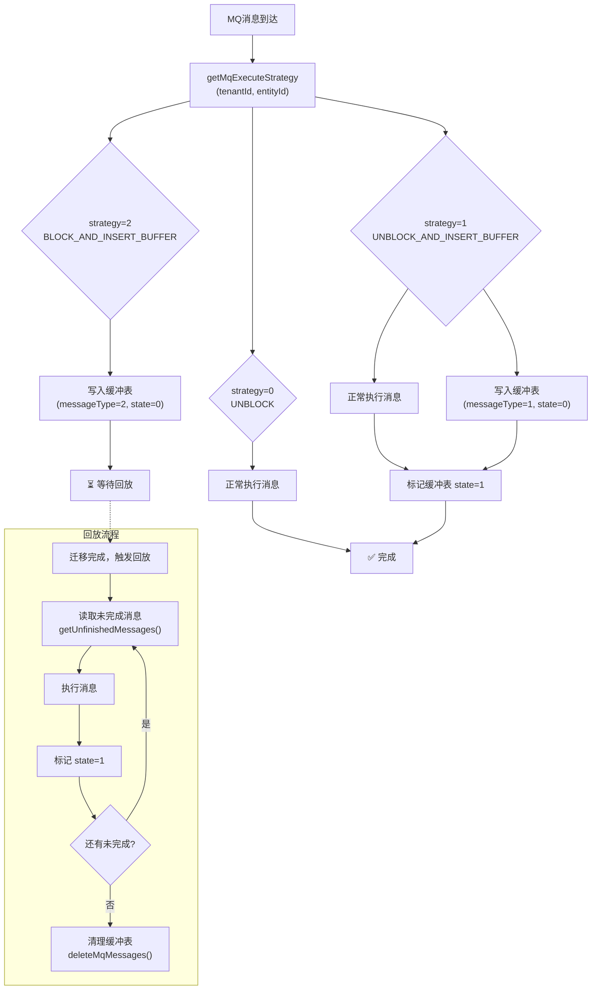
```mermaid
flowchart TD
    MSG["MQ消息到达"] --> GET_STRATEGY["getMqExecuteStrategy<br/>(tenantId, entityId)"]

    GET_STRATEGY --> S0{"strategy=0<br/>UNBLOCK"}
    GET_STRATEGY --> S1{"strategy=1<br/>UNBLOCK_AND_INSERT_BUFFER"}
    GET_STRATEGY --> S2{"strategy=2<br/>BLOCK_AND_INSERT_BUFFER"}

    S0 --> EXEC["正常执行消息"]
    EXEC --> DONE["✅ 完成"]

    S1 --> EXEC2["正常执行消息"]
    S1 --> INSERT_LOG["写入缓冲表<br/>(messageType=1, state=0)"]
    EXEC2 --> MARK_DONE["标记缓冲表 state=1"]
    INSERT_LOG --> MARK_DONE
    MARK_DONE --> DONE

    S2 --> INSERT_BLOCK["写入缓冲表<br/>(messageType=2, state=0)"]
    INSERT_BLOCK --> WAIT["⏳ 等待回放"]

    subgraph 回放流程
        TRIGGER["迁移完成，触发回放"] --> READ["读取未完成消息<br/>getUnfinishedMessages()"]
        READ --> REPLAY_EXEC["执行消息"]
        REPLAY_EXEC --> REPLAY_MARK["标记 state=1"]
        REPLAY_MARK --> MORE{"还有未完成?"}
        MORE -->|是| READ
        MORE -->|否| CLEAN["清理缓冲表<br/>deleteMqMessages()"]
    end

    WAIT -.-> TRIGGER
```

### 12.3 迁移状态监控

```json
// getState() 返回格式
{
    "total": 100,       // 总消息数
    "log": 50,          // 日志消息数
    "logDone": 50,      // 已完成的日志消息数
    "block": 50,        // 阻塞消息数
    "blockDone": 30     // 已完成的阻塞消息数
}
```

---

## 十三、接口设计

### 13.1 REST API

| 方法 | 路径 | 说明 |
|------|------|------|
| GET | `/rest/v2.0/privileges/{objectApiKey}/sharerules` | 查询共享规则列表 |
| POST | `/rest/v2.0/privileges/{objectApiKey}/sharerules` | 创建共享规则 |
| PUT | `/rest/v2.0/privileges/{objectApiKey}/sharerules/{id}` | 更新共享规则 |
| DELETE | `/rest/v2.0/privileges/{objectApiKey}/sharerules/{id}` | 删除共享规则 |
| POST | `/rest/data/v2.0/inner/denormal/share/` | 手动共享 |
| DELETE | `/rest/data/v2.0/inner/denormal/share/{id}` | 取消共享 |
| POST | `/rest/privilege/v3/repair/user` | V3用户权限修复 |
| POST | `/rest/privilege/v3/repair/depart` | V3部门权限修复 |
| POST | `/rest/privilege/v3/repair/publicGroup` | V3公共组权限修复 |
| POST | `/rest/privilege/v3/repair/territory` | V3区域权限修复 |
| GET | `/rest/console/status` | 运维状态查询 |
| POST | `/rest/data/v2.0/privileges/mqBlock/replay` | MQ消息回放 |
| GET | `/rest/data/v2.0/privileges/mqBlock/state` | MQ阻塞状态 |

### 13.2 Dubbo RPC 接口

| 接口 | 方法 | 说明 |
|------|------|------|
| XBaseShareService | save/saveBatch/delete/deleteList/getIdListBy* | 标准实体共享CRUD |
| XCustomizeShareService | save/saveBatch/delete/deleteList/getIdListBy* | 自定义实体共享CRUD |
| V3PermissionDataService | createOwnerDepartShareData/updateOwnerDepartShareData/transferOwnerDepartShareData/deleteShareDataByDataIds | V3权限数据管理 |
| V3PermissionCheckService | check(CheckType, entityId, tenantParam) | V3权限校验 |
| V3PrivilegeESQueryService | getTeamMemberShareData/getShareRuleShareData/getTerritoryShareData | ES权限查询 |
| XSubjectShareDataService | getShareRuleSubjectIdsByObjectId/deleteByRuleIdAndObjectId | 主体共享数据 |
| V3PermissionSynDataService | updatePermissionOfShareData/syncAddTeamMemberEs/syncAddTerritoryEs | V3数据同步 |
| XPrivGroupDnService | createGroupHierDn/createGroupUserDn | 权限组关系维护 |
| XObjectsShareService | deleteShareData | 对象共享删除 |
| DataPermissionCalculationService | sqlSlow | 权限计算（慢SQL） |

---

## 十四、错误处理与容错

### 14.1 异常处理策略

| 场景 | 策略 | 说明 |
|------|------|------|
| MQ消费失败 | 重试3次 + 死信队列 | RocketMQ 自带重试机制 |
| 共享规则执行超时 | 异步重试 + 告警 | 超过60s的规则执行记录告警 |
| ES同步失败 | 重试 + 降级到SQL查询 | ES不可用时降级 |
| 分布式锁获取失败 | 等待重试 + 超时放弃 | 最多等待30s |
| 反规范化失败 | MQ重试 + 修复消费者 | DenormalizeRepairConsumer 专门处理修复 |
| 数据迁移中断 | 消息缓冲 + 回放 | MqBlockService 保证消息不丢失 |

### 14.2 数据一致性保障

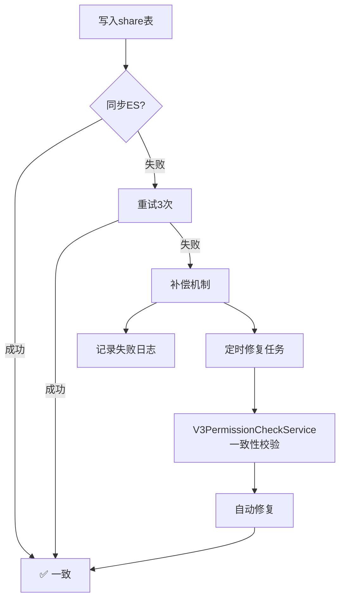
```mermaid
flowchart TD
    WRITE["写入share表"] --> SYNC{"同步ES?"}
    SYNC -->|成功| OK["✅ 一致"]
    SYNC -->|失败| RETRY["重试3次"]
    RETRY -->|成功| OK
    RETRY -->|失败| COMPENSATE["补偿机制"]
    COMPENSATE --> LOG["记录失败日志"]
    COMPENSATE --> REPAIR["定时修复任务"]
    REPAIR --> CHECK["V3PermissionCheckService<br/>一致性校验"]
    CHECK --> FIX["自动修复"]
    FIX --> OK
```

---

## 十五、新系统重构建议

### 15.1 架构演进方向

| 维度 | 老系统 | 新系统建议 |
|------|--------|-----------|
| 服务框架 | Dubbo + ZooKeeper | Spring Cloud + Nacos |
| ORM | Hibernate JPA | MyBatis-Plus |
| 消息队列 | RocketMQ | RocketMQ（保持） |
| 缓存 | Redis + Redisson | Redis + Redisson（保持） |
| 搜索引擎 | Elasticsearch | Elasticsearch（保持） |
| 配置中心 | Apollo | Nacos Config |
| 数据库 | MySQL | MySQL + PostgreSQL（双兼容） |
| 主键策略 | 雪花算法 | 雪花算法（保持） |
| 关联方式 | ID关联 | api_key关联（遵循元数据规范） |

### 15.2 核心重构点

1. **统一 Share 表**：将 13 张标准实体 share 表合并为 1 张统一表，通过 `entity_api_key` 区分，消除代码重复
2. **消除 Dubbo 依赖**：所有 RPC 接口迁移为 Feign Client
3. **Pipeline 简化**：反规范化 Pipeline 从注解驱动改为配置驱动，降低复杂度
4. **ES 索引优化**：V3 ES 索引增加 `entity_api_key` 字段，支持按实体过滤
5. **MQ Topic 精简**：合并冗余 Topic，减少消费者数量
6. **权限匹配链标准化**：MatchLink 改为 Spring Bean 自动注册，支持动态扩展

### 15.3 模块拆分建议

```
paas-privilege-service/
├── paas-privilege-service-core/          # 接口层（对应老 paas-privilege-core）
│   ├── api/                              # 对外接口定义
│   ├── dto/                              # 数据传输对象
│   ├── enums/                            # 枚举定义
│   └── event/                            # 事件定义
├── paas-privilege-service-feign/         # Feign Client
│   └── client/                           # Feign 接口
├── paas-privilege-service-server/        # 实现层
│   ├── config/                           # 配置
│   ├── controller/                       # REST 接口
│   ├── service/                          # 业务逻辑
│   │   ├── share/                        # 共享服务
│   │   ├── sharingrule/                  # 共享规则引擎
│   │   ├── denormalize/                  # 反规范化
│   │   ├── matchlink/                    # 权限匹配链
│   │   ├── organization/                 # 组织权限（用户/部门/职位/区域）
│   │   └── v3/                           # V3权限体系
│   ├── mq/                               # MQ 消费者/生产者
│   ├── mapper/                           # MyBatis Mapper
│   ├── entity/                           # 数据库实体
│   └── cache/                            # 缓存管理
└── sql/                                  # DDL + 迁移脚本
```

### 15.4 数据库表重构

```sql
-- 统一 share 表（替代 13 张分表）
CREATE TABLE p_data_share (
    id              BIGINT PRIMARY KEY,
    tenant_id       BIGINT NOT NULL,
    entity_api_key  VARCHAR(128) NOT NULL,  -- 实体API Key（替代objectId）
    data_id         BIGINT NOT NULL,
    subject_id      BIGINT,                 -- 统一主体ID（替代userId/groupId）
    subject_type    SMALLINT,               -- 主体类型：0=用户,1=团队成员,2=部门,3=区域,4=公共组,5=共享规则,31=区域关注
    rule_api_key    VARCHAR(128),           -- 关联的共享规则API Key
    business_id     BIGINT,
    access_level    SMALLINT DEFAULT 1,     -- 1=只读, 2=读写
    scope           SMALLINT,
    delete_flg      SMALLINT DEFAULT 0,
    created_by      BIGINT,
    created_at      BIGINT,
    updated_by      BIGINT,
    updated_at      BIGINT,

    INDEX idx_tenant_entity (tenant_id, entity_api_key),
    INDEX idx_data_id (data_id),
    INDEX idx_subject (subject_id, subject_type),
    INDEX idx_rule (rule_api_key)
);

-- 统一权限组-用户关系表
CREATE TABLE p_priv_group_user (
    id              BIGINT PRIMARY KEY,
    tenant_id       BIGINT NOT NULL,
    user_id         BIGINT NOT NULL,
    group_id        BIGINT NOT NULL,
    group_type      SMALLINT,
    entity_api_key  VARCHAR(128),
    reason          SMALLINT,
    access_level    SMALLINT,
    created_at      BIGINT,

    INDEX idx_user (tenant_id, user_id),
    INDEX idx_group (tenant_id, group_id)
);

-- 统一权限组-层级关系表
CREATE TABLE p_priv_group_hier (
    id                  BIGINT PRIMARY KEY,
    tenant_id           BIGINT NOT NULL,
    group_id            BIGINT NOT NULL,
    group_type          SMALLINT,
    related_group_id    BIGINT NOT NULL,
    related_group_type  SMALLINT,
    reason              SMALLINT,
    entity_api_key      VARCHAR(128),
    rule_api_key        VARCHAR(128),
    access_level        SMALLINT,
    created_at          BIGINT,

    INDEX idx_group (tenant_id, group_id),
    INDEX idx_related (tenant_id, related_group_id)
);
```

---

## 十六、总结

本技术设计方案完整覆盖了 aPaaS 数据权限系统的所有核心模块：

1. **数据权限模型**：7 种权限来源（rowCause）+ Share Table 模式 + 分表策略
2. **共享规则引擎**：2 种规则类型 × 7 种主体类型 × 10 种条件操作符，MQ 异步执行
3. **权限反规范化**：注解驱动的 Pipeline（Input→Transform→Processor→Operator），18 个 Transform 实现
4. **权限匹配链**：责任链模式，7 级优先级判定
5. **V3 权限体系**：9 种事件类型 × 40+ 处理器，ES 索引加速查询，13 种 CheckType 校验
6. **MQ 消息体系**：15 个 Producer + 10+ Consumer，多优先级消费 + 隔离 Topic
7. **数据迁移保障**：三级阻塞策略 + 消息缓冲 + 回放机制
8. **并发与性能**：分布式锁 + 批量操作 + 缓存策略 + ES 查询优化
9. **新系统重构**：统一 Share 表 + api_key 关联 + Spring Cloud 架构 + MyBatis-Plus
