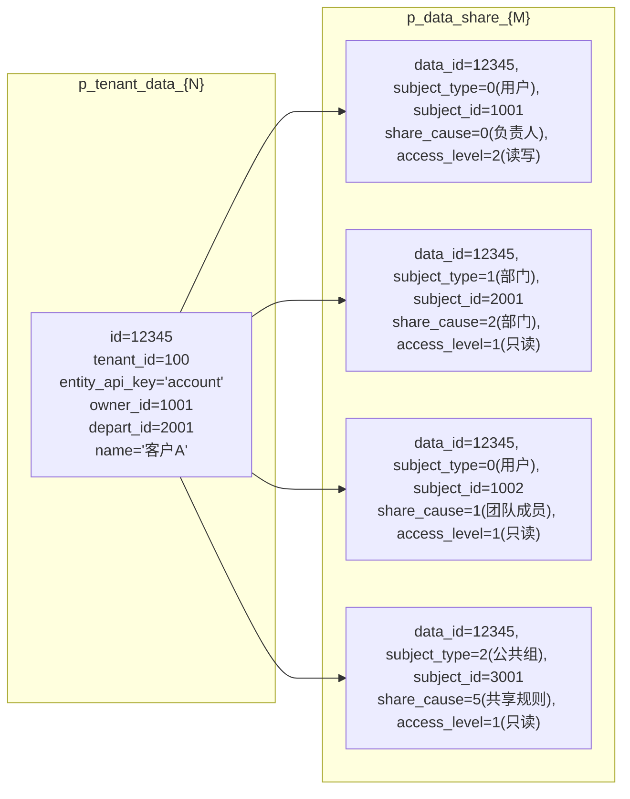
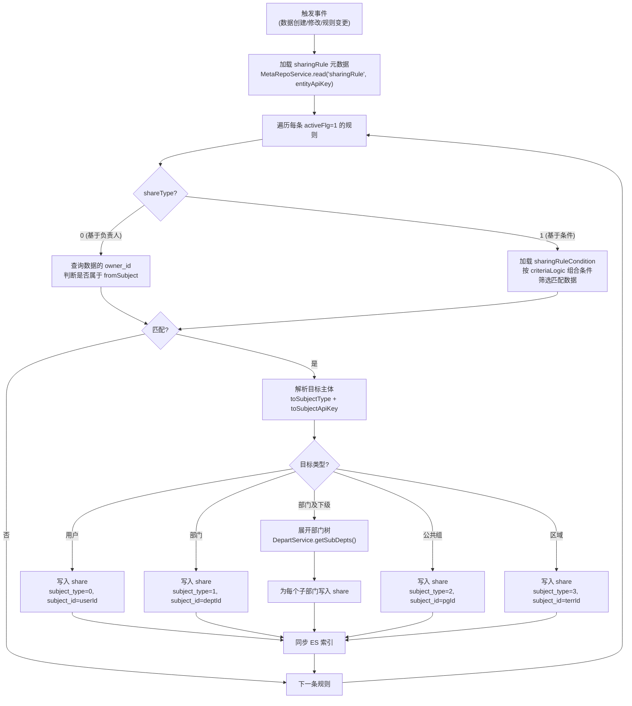
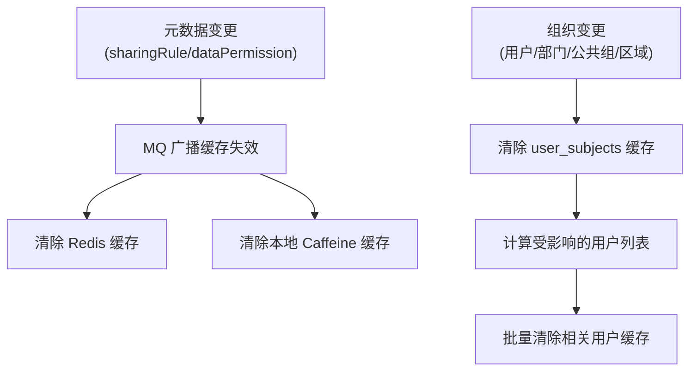
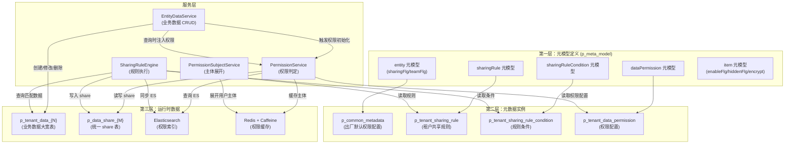

# aPaaS 数据权限详细技术设计方案

> 基于新系统元模型驱动三层架构（元模型→元数据→业务数据）的完整数据权限设计

---

## 一、设计背景与目标

### 1.1 核心问题

数据权限解决的核心问题是：**"谁能看到哪些数据、能做什么操作"**。

在 aPaaS 元数据驱动架构下，所有业务对象（entity）的数据统一存储在 `p_tenant_data` 大宽表中，通过 `entity_api_key` 区分对象类型。数据权限必须与这套三层架构深度对齐：

- 第一层（元模型）：定义数据权限相关的元模型（如共享规则 sharingRule）
- 第二层（元数据）：存储具体的权限配置（如某个 entity 的共享规则实例）
- 第三层（业务数据）：在 `p_tenant_data` 查询时注入权限过滤条件

### 1.2 与三层架构的对齐关系

```
┌─────────────────────────────────────────────────────────────────┐
│ 第一层：元模型注册（p_meta_model）                                │
│   新增元模型：sharingRule、sharingRuleCondition、dataPermission   │
│   db_table 指向 Tenant 级独立快捷表                               │
├─────────────────────────────────────────────────────────────────┤
│ 第二层：元数据实例                                                │
│   Common 级：出厂默认权限配置（p_common_metadata）                 │
│   Tenant 级：租户自定义共享规则（p_tenant_sharing_rule 等）         │
├─────────────────────────────────────────────────────────────────┤
│ 第三层：权限运行时数据                                            │
│   Share 表：p_data_share（统一 share 表，与 p_tenant_data 对齐）   │
│   权限组表：p_priv_subject（反规范化后的主体-数据关系）             │
│   ES 索引：权限高速查询层                                         │
└─────────────────────────────────────────────────────────────────┘
```

---

## 二、元模型层设计（第一层）

### 2.1 新增元模型注册

在 `p_meta_model` 中注册数据权限相关的元模型：

| api_key | label | enable_common | enable_tenant | db_table | entity_dependency | 说明 |
|---------|-------|:---:|:---:|---------|:---:|------|
| `sharingRule` | 共享规则 | 1 | 1 | `p_tenant_sharing_rule` | 1 | 共享规则定义，挂在 entity 下 |
| `sharingRuleCondition` | 共享规则条件 | 1 | 1 | `p_tenant_sharing_rule_condition` | 1 | 共享规则的过滤条件 |
| `dataPermission` | 数据权限配置 | 1 | 1 | `p_tenant_data_permission` | 1 | entity 级数据权限总开关和默认策略 |

### 2.2 元模型间关联（p_meta_link 新增）

| api_key | 父元模型 | 子元模型 | 关联字段 | 级联删除 | 说明 |
|---------|---------|---------|---------|:---:|------|
| `entity_to_sharingRule` | entity | sharingRule | entityApiKey | 是 | 对象包含共享规则 |
| `sharingRule_to_condition` | sharingRule | sharingRuleCondition | ruleApiKey | 是 | 规则包含条件 |
| `entity_to_dataPermission` | entity | dataPermission | entityApiKey | 是 | 对象包含权限配置 |

层级结构扩展：

```
entity（对象）
  ├── item（字段）
  ├── entityLink（关联关系）
  ├── checkRule（校验规则）
  ├── busiType（业务类型）
  ├── ...
  ├── sharingRule（共享规则）          ← 新增
  │     └── sharingRuleCondition      ← 新增
  └── dataPermission（数据权限配置）    ← 新增
```

### 2.3 sharingRule 元模型字段定义（p_meta_item 新增）

| api_key | db_column | label | 类型 | 取值约束 | 说明 |
|---------|-----------|-------|------|---------|------|
| entityApiKey | entity_api_key | 所属对象 | String(固定列) | — | 关联 entity |
| apiKey | api_key | 规则标识 | String(固定列) | — | 全局唯一 |
| label | label | 规则名称 | String(固定列) | — | 显示名 |
| shareType | dbc_smallint1 | 共享类型 | Integer | 0=基于负责人, 1=基于条件 | — |
| fromSubjectType | dbc_smallint2 | 来源主体类型 | Integer | 见 §2.5 SubjectType | — |
| fromSubjectId | dbc_bigint1 | 来源主体ID | Long | — | 用户ID/部门ID/公共组ID |
| fromSubjectApiKey | dbc_varchar1 | 来源主体apiKey | String | — | 部门/公共组的 apiKey |
| toSubjectType | dbc_smallint3 | 目标主体类型 | Integer | 见 §2.5 SubjectType | — |
| toSubjectId | dbc_bigint2 | 目标主体ID | Long | — | — |
| toSubjectApiKey | dbc_varchar2 | 目标主体apiKey | String | — | — |
| accessLevel | dbc_smallint4 | 访问级别 | Integer | 1=只读, 2=读写 | — |
| criteriaLogic | dbc_varchar3 | 条件逻辑 | String | — | AND/OR 表达式 |
| scopeType | dbc_smallint5 | 作用域 | Integer | 0=全部, 1=仅自己 | — |
| activeFlg | dbc_smallint6 | 激活状态 | Integer(0/1) | — | — |
| enableFlg | dbc_smallint7 | 启用标记 | Integer(0/1) | — | — |

### 2.4 sharingRuleCondition 元模型字段定义

| api_key | db_column | label | 类型 | 说明 |
|---------|-----------|-------|------|------|
| entityApiKey | entity_api_key | 所属对象 | String(固定列) | — |
| ruleApiKey | dbc_varchar1 | 所属规则apiKey | String | 关联 sharingRule |
| itemApiKey | dbc_varchar2 | 条件字段apiKey | String | 关联 item |
| operatorCode | dbc_varchar3 | 操作符 | String | equal/notEqual/greaterThan/contain/empty 等 |
| conditionValue | dbc_varchar4 | 条件值 | String | — |
| rowNo | dbc_smallint1 | 行号 | Integer | 条件排序 |

### 2.5 dataPermission 元模型字段定义

| api_key | db_column | label | 类型 | 取值约束 | 说明 |
|---------|-----------|-------|------|---------|------|
| entityApiKey | entity_api_key | 所属对象 | String(固定列) | — | — |
| defaultAccess | dbc_smallint1 | 默认访问级别 | Integer | 0=私有, 1=只读, 2=读写 | 组织默认权限 |
| hierarchyAccess | dbc_smallint2 | 层级访问 | Integer | 0=无, 1=只读, 2=读写 | 上级是否可见下级数据 |
| ownerAccess | dbc_smallint3 | 负责人权限 | Integer | 1=只读, 2=读写 | 负责人默认权限 |
| teamAccess | dbc_smallint4 | 团队成员权限 | Integer | 0=无, 1=只读, 2=读写 | 团队成员默认权限 |
| territoryAccess | dbc_smallint5 | 区域权限 | Integer | 0=无, 1=只读, 2=读写 | 区域默认权限 |
| sharingFlg | dbc_smallint6 | 启用共享 | Integer(0/1) | — | 是否允许手动共享 |
| sharingRuleFlg | dbc_smallint7 | 启用共享规则 | Integer(0/1) | — | 是否启用自动共享规则 |

### 2.6 SubjectType 枚举（p_meta_option 注册）

| option_code | option_key | label | 说明 |
|:-----------:|-----------|-------|------|
| 0 | user | 用户 | 直接指定用户 |
| 1 | publicGroup | 公共组 | 公共组的所有成员 |
| 2 | depart | 部门 | 仅当前部门 |
| 3 | departAndSub | 部门及下级 | 含所有下级部门 |
| 4 | departInternal | 部门及内部下级 | 排除外部部门 |
| 5 | territory | 区域 | 销售区域 |

### 2.7 与 entity 元模型的关联

entity 元模型已有的权限相关字段：

| entity 字段 | db_column | 含义 | 与数据权限的关系 |
|------------|-----------|------|----------------|
| `sharingFlg` | dbc_smallint11 | 启用共享 | 控制该 entity 是否支持手动共享 |
| `teamFlg` | dbc_smallint7 | 启用团队 | 控制该 entity 是否支持团队成员权限 |
| `groupMemberFlg` | dbc_int7 | 启用组成员 | 控制该 entity 是否支持公共组权限 |

这些字段作为 entity 级的权限开关，与 `dataPermission` 元数据配合使用。


---

## 三、元数据实例层设计（第二层）

### 3.1 存储路由

遵循新系统统一的 Common/Tenant 双层存储架构：

| 元模型 | Common 存储 | Tenant 存储 | 合并读取 |
|--------|-----------|-----------|---------|
| sharingRule | `p_common_metadata` (WHERE metamodel_api_key='sharingRule') | `p_tenant_sharing_rule` | Common + Tenant 合并，Tenant 覆盖 |
| sharingRuleCondition | `p_common_metadata` | `p_tenant_sharing_rule_condition` | 同上 |
| dataPermission | `p_common_metadata` | `p_tenant_data_permission` | 同上 |

Tenant 级表结构与 `p_common_metadata` 完全一致（固定列 + dbc_xxxN 扩展列 + tenant_id），通过 `DynamicTableNameHolder` 路由。

### 3.2 Common 级出厂数据

系统出厂时，为每个标准 entity 预置默认的 `dataPermission` 配置：

```sql
-- 示例：account 对象的默认数据权限配置
INSERT INTO p_common_metadata (
    id, metamodel_api_key, entity_api_key, api_key, label, namespace,
    dbc_smallint1, -- defaultAccess = 0 (私有)
    dbc_smallint2, -- hierarchyAccess = 1 (上级只读)
    dbc_smallint3, -- ownerAccess = 2 (负责人读写)
    dbc_smallint4, -- teamAccess = 1 (团队成员只读)
    dbc_smallint5, -- territoryAccess = 0 (区域无)
    dbc_smallint6, -- sharingFlg = 1 (允许手动共享)
    dbc_smallint7  -- sharingRuleFlg = 1 (允许共享规则)
) VALUES (
    {snowflake_id}, 'dataPermission', 'account', 'account_data_permission',
    '客户数据权限', 'system',
    0, 1, 2, 1, 0, 1, 1
);
```

### 3.3 Tenant 级自定义

租户可以：
- 覆盖 Common 级的 `dataPermission` 配置（如将 account 的 defaultAccess 改为只读）
- 创建自定义 `sharingRule`（如"将华东区客户共享给华东销售组"）
- 遮蔽删除 Common 级的共享规则（插入 delete_flg=1 的 Tenant 记录）

### 3.4 共享规则实例示例

```
sharingRule 实例（存储在 p_tenant_sharing_rule）：
┌──────────────────────────────────────────────────────────────┐
│ api_key: 'sr_east_china_account'                             │
│ entity_api_key: 'account'                                    │
│ label: '华东区客户共享给华东销售组'                              │
│ shareType: 0 (基于负责人)                                     │
│ fromSubjectType: 2 (部门)                                    │
│ fromSubjectApiKey: 'dept_east_china'                         │
│ toSubjectType: 1 (公共组)                                    │
│ toSubjectApiKey: 'pg_east_sales'                             │
│ accessLevel: 1 (只读)                                        │
│ activeFlg: 1                                                 │
└──────────────────────────────────────────────────────────────┘

sharingRuleCondition 实例（基于条件的规则才有）：
┌──────────────────────────────────────────────────────────────┐
│ ruleApiKey: 'sr_vip_account'                                 │
│ itemApiKey: 'level'                                          │
│ operatorCode: 'equal'                                        │
│ conditionValue: 'vip'                                        │
│ rowNo: 1                                                     │
└──────────────────────────────────────────────────────────────┘
```

### 3.5 元数据读取流程（与现有架构一致）

```
读取某 entity 的共享规则列表：
    1. 查 p_common_metadata WHERE metamodel_api_key='sharingRule' AND entity_api_key=?
    2. 通过 CommonMetadataConverter 转为 SharingRule 业务对象
    3. 查 p_tenant_sharing_rule WHERE tenant_id=? AND entity_api_key=?
    4. 合并：Tenant 覆盖 Common，delete_flg=1 隐藏
    5. 返回 List<SharingRule>
```

---

## 四、运行时数据层设计（第三层）

### 4.1 统一 Share 表设计

老系统为每个标准 entity 建独立 share 表（13 张），新系统统一为一张 `p_data_share` 表，与 `p_tenant_data` 的设计理念一致——通过 `entity_api_key` 区分对象类型。

```sql
CREATE TABLE p_data_share (
    -- ---- 主键与租户 ----
    id                  BIGINT       NOT NULL,
    tenant_id           BIGINT       NOT NULL,

    -- ---- 数据标识（与 p_tenant_data 对齐）----
    entity_api_key      VARCHAR(100) NOT NULL,   -- 所属对象类型
    data_id             BIGINT       NOT NULL,   -- 被共享的业务数据 ID（关联 p_tenant_data.id）

    -- ---- 权限主体（统一模型）----
    subject_id          BIGINT,                  -- 主体 ID（用户ID/部门ID/公共组ID/区域ID）
    subject_type        SMALLINT     NOT NULL,   -- 主体类型（见 §4.2）

    -- ---- 权限属性 ----
    access_level        SMALLINT     NOT NULL DEFAULT 1,  -- 1=只读, 2=读写
    share_cause         SMALLINT     NOT NULL,   -- 共享来源（见 §4.3）

    -- ---- 业务关联 ----
    rule_api_key        VARCHAR(128),            -- 关联的共享规则 apiKey（sharingRule 元数据）
    business_id         BIGINT,                  -- 业务 ID（扩展用途）

    -- ---- 审计字段 ----
    delete_flg          SMALLINT     NOT NULL DEFAULT 0,
    created_at          BIGINT,
    created_by          BIGINT,
    updated_at          BIGINT,
    updated_by          BIGINT,

    PRIMARY KEY (id)
);

-- ---- 核心索引 ----
-- 按数据查权限（"这条数据谁能看"）
CREATE INDEX idx_ds_tid_eak_did ON p_data_share (tenant_id, entity_api_key, data_id);
-- 按主体查数据（"这个用户能看哪些数据"）
CREATE INDEX idx_ds_tid_eak_sub ON p_data_share (tenant_id, entity_api_key, subject_id, subject_type);
-- 按共享规则查数据（规则变更时批量操作）
CREATE INDEX idx_ds_tid_eak_rule ON p_data_share (tenant_id, entity_api_key, rule_api_key);
-- 按共享来源查数据（按类型清理）
CREATE INDEX idx_ds_tid_eak_cause ON p_data_share (tenant_id, entity_api_key, share_cause);
-- 按数据+来源查（更新负责人/部门时精确定位）
CREATE INDEX idx_ds_tid_did_cause ON p_data_share (tenant_id, data_id, share_cause);
```

### 4.2 subject_type 枚举

| 值 | 含义 | subject_id 指向 | 说明 |
|:--:|------|----------------|------|
| 0 | 用户 | 用户 ID | 直接授权给用户 |
| 1 | 部门 | 部门 ID | 部门内所有用户可见 |
| 2 | 公共组 | 公共组 ID | 公共组内所有成员可见 |
| 3 | 区域 | 区域 ID | 区域内所有用户可见 |

### 4.3 share_cause 枚举（7 种权限来源）

| 值 | 含义 | 触发时机 | access_level |
|:--:|------|---------|:---:|
| 0 | 负责人 (Owner) | 数据创建/转移 | 2(读写) |
| 1 | 团队成员 (Team Member) | 添加团队成员 | 按配置 |
| 2 | 部门 (Department) | 数据创建/部门变更 | 按 dataPermission 配置 |
| 3 | 区域 (Territory) | 区域分配 | 按配置 |
| 4 | 公共组 (Public Group) | 公共组规则匹配 | 按配置 |
| 5 | 共享规则 (Sharing Rule) | 规则执行 | 按规则配置 |
| 6 | 手动共享 (Manual Share) | 用户手动操作 | 按用户选择 |

### 4.4 分表策略

`p_data_share` 采用与 `p_tenant_data` 相同的分表策略：

```
表池: p_data_share_0 ~ p_data_share_999（预建 1000 张）
分配粒度: (tenant_id, entity_api_key)
分配策略: Least-Loaded
路由表: p_data_share_route（结构同 p_tenant_data_route）
路由方式: DynamicTableNameHolder
```

```sql
CREATE TABLE p_data_share_route (
    id              BIGINT       NOT NULL,
    tenant_id       BIGINT       NOT NULL,
    entity_api_key  VARCHAR(255) NOT NULL,
    table_index     INT          NOT NULL,   -- 0~999
    created_at      BIGINT       DEFAULT NULL,
    PRIMARY KEY (id),
    UNIQUE INDEX idx_sr_tid_eak (tenant_id, entity_api_key),
    INDEX idx_sr_table (table_index)
);
```

设计决策：share 表的分表数量（1000）少于业务数据表（2000），因为 share 记录的行大小远小于业务数据（share 行约 100 字节 vs 业务数据行约 1.5KB），同等行数下存储量更小。

### 4.5 与 p_tenant_data 的关联关系



关键设计点：
- `p_data_share.data_id` 关联 `p_tenant_data.id`
- 两张表的 `entity_api_key` 必须一致
- 两张表的 `tenant_id` 必须一致
- share 表的分表路由独立于业务数据表的分表路由


---

## 五、权限写入流程（与业务数据 CRUD 联动）

### 5.1 数据创建时的权限初始化

当 `EntityDataService.create()` 执行时，在步骤 6（后置处理）中触发权限初始化：

```
POST /entity/data/{entityApiKey}
Body: { "name": "客户A", "ownerId": 1001, "departId": 2001, ... }

权限初始化流程:
    │
    ├─ 1. 读取 dataPermission 元数据
    │     dp = MetaRepoService.read('dataPermission', entityApiKey, tenantId)
    │     // 合并 Common + Tenant，得到该 entity 的权限配置
    │
    ├─ 2. 创建负责人 share（share_cause=0）
    │     INSERT INTO p_data_share (
    │       tenant_id, entity_api_key, data_id,
    │       subject_id={ownerId}, subject_type=0(用户),
    │       access_level={dp.ownerAccess}, share_cause=0
    │     )
    │
    ├─ 3. 创建部门 share（share_cause=2）
    │     if dp.defaultAccess > 0:  // 非私有模式
    │       INSERT INTO p_data_share (
    │         tenant_id, entity_api_key, data_id,
    │         subject_id={departId}, subject_type=1(部门),
    │         access_level={dp.defaultAccess}, share_cause=2
    │       )
    │
    ├─ 4. 发送 MQ 事件触发共享规则匹配
    │     MQ.send(TOPIC_DATA_PERMISSION, {
    │       eventType: 'DATA_CREATED',
    │       tenantId, entityApiKey, dataId,
    │       ownerId, departId
    │     })
    │
    └─ 5. 异步：共享规则引擎匹配
          SharingRuleEngine.matchAndApply(tenantId, entityApiKey, dataId)
          // 遍历该 entity 的所有 activeFlg=1 的 sharingRule
          // 基于负责人：判断 ownerId 是否属于 fromSubject
          // 基于条件：判断数据字段值是否满足 conditions
          // 匹配成功：写入 share_cause=5 的 share 记录
```

### 5.2 数据修改时的权限更新

```
PUT /entity/data/{entityApiKey}/{id}
Body: { "ownerId": 1002, "departId": 2002, "level": "S" }

权限更新流程:
    │
    ├─ 1. 检测变更字段
    │     changedFields = detectChanges(oldRecord, newRecord)
    │
    ├─ 2. 负责人变更（ownerId 变化）
    │     if 'ownerId' in changedFields:
    │       // 更新负责人 share
    │       UPDATE p_data_share SET subject_id={newOwnerId}
    │         WHERE tenant_id=? AND data_id=? AND share_cause=0
    │       // 重算基于负责人的共享规则
    │       MQ.send(TOPIC_DATA_PERMISSION, {eventType: 'OWNER_CHANGED', ...})
    │
    ├─ 3. 部门变更（departId 变化）
    │     if 'departId' in changedFields:
    │       UPDATE p_data_share SET subject_id={newDepartId}
    │         WHERE tenant_id=? AND data_id=? AND share_cause=2
    │
    └─ 4. 其他字段变更（可能影响基于条件的共享规则）
          if changedFields 包含共享规则条件引用的字段:
            MQ.send(TOPIC_DATA_PERMISSION, {eventType: 'FIELD_CHANGED', ...})
            // 异步重算基于条件的共享规则
```

### 5.3 数据删除时的权限清理

```
DELETE /entity/data/{entityApiKey}/{id}

权限清理流程:
    │
    ├─ 1. 软删除业务数据
    │     UPDATE p_tenant_data SET delete_flg=1 WHERE id=? AND tenant_id=?
    │
    └─ 2. 软删除所有 share 记录
          UPDATE p_data_share SET delete_flg=1
            WHERE tenant_id=? AND entity_api_key=? AND data_id=?
```

### 5.4 数据转移时的权限重建

```
POST /entity/data/{entityApiKey}/{id}/transfer
Body: { "toUserId": 1003 }

权限重建流程:
    │
    ├─ 1. 更新业务数据的 owner_id
    │     UPDATE p_tenant_data SET owner_id={toUserId}, depart_id={toUserDeptId}
    │       WHERE id=? AND tenant_id=?
    │
    ├─ 2. 更新负责人 share
    │     UPDATE p_data_share SET subject_id={toUserId}
    │       WHERE tenant_id=? AND data_id=? AND share_cause=0
    │
    ├─ 3. 更新部门 share
    │     UPDATE p_data_share SET subject_id={toUserDeptId}
    │       WHERE tenant_id=? AND data_id=? AND share_cause=2
    │
    └─ 4. 重算共享规则
          MQ.send(TOPIC_DATA_PERMISSION, {eventType: 'DATA_TRANSFERRED', ...})
```

### 5.5 数据变更触发矩阵

| 业务操作 | 触发的权限动作 | 同步/异步 | 影响的 share_cause |
|---------|--------------|:---------:|:------------------:|
| 数据创建 | 创建负责人share + 部门share + 匹配共享规则 | 同步+异步 | 0, 2, 5 |
| 修改负责人 | 更新负责人share + 重算基于负责人的规则 | 同步+异步 | 0, 5 |
| 修改部门 | 更新部门share | 同步 | 2 |
| 修改字段值 | 重算基于条件的共享规则 | 异步 | 5 |
| 数据删除 | 软删除所有share | 同步 | 0,1,2,3,4,5,6 |
| 数据转移 | 更新负责人+部门share + 重算规则 | 同步+异步 | 0, 2, 5 |
| 添加团队成员 | 创建团队成员share | 同步 | 1 |
| 移除团队成员 | 删除团队成员share | 同步 | 1 |
| 手动共享 | 创建手动共享share | 同步 | 6 |
| 取消共享 | 删除手动共享share | 同步 | 6 |

---

## 六、权限查询流程（与业务数据查询联动）

### 6.1 列表查询的权限注入

在 `EntityDataService.list()` 的步骤 5（动态 SQL 生成）中注入权限过滤：

```
GET /entity/data/{entityApiKey}?page=1&size=20

权限注入流程:
    │
    ├─ 1. 判断用户是否拥有全量数据访问权限
    │     if hasFullDataAccess(tenantId, userId): 跳过权限过滤
    │
    ├─ 2. 获取用户的权限主体集合
    │     subjects = PermissionSubjectService.getUserSubjects(tenantId, userId)
    │     // 返回: [
    │     //   {type: 0(用户), id: userId},
    │     //   {type: 1(部门), id: userDeptId},
    │     //   {type: 1(部门), id: parentDeptId},  // 上级部门（如果 hierarchyAccess > 0）
    │     //   {type: 2(公共组), id: pgId1},
    │     //   {type: 2(公共组), id: pgId2},
    │     //   {type: 3(区域), id: terrId}
    │     // ]
    │
    ├─ 3. 构建权限子查询
    │     permissionSql = """
    │       EXISTS (
    │         SELECT 1 FROM p_data_share_{M} ds
    │         WHERE ds.tenant_id = td.tenant_id
    │           AND ds.entity_api_key = td.entity_api_key
    │           AND ds.data_id = td.id
    │           AND ds.delete_flg = 0
    │           AND (
    │             (ds.subject_type = 0 AND ds.subject_id IN ({userIds}))
    │             OR (ds.subject_type = 1 AND ds.subject_id IN ({deptIds}))
    │             OR (ds.subject_type = 2 AND ds.subject_id IN ({pgIds}))
    │             OR (ds.subject_type = 3 AND ds.subject_id IN ({terrIds}))
    │           )
    │       )
    │     """
    │
    └─ 4. 注入到业务查询
          SELECT {columns} FROM p_tenant_data_{N} td
          WHERE td.tenant_id = ? AND td.entity_api_key = ?
            AND td.delete_flg = 0
            AND {permissionSql}    -- 权限过滤注入
            AND {businessFilters}  -- 业务过滤条件
          ORDER BY {sorts}
          LIMIT ? OFFSET ?
```

### 6.2 权限主体展开逻辑

```
PermissionSubjectService.getUserSubjects(tenantId, userId):
    │
    ├─ 1. 用户自身
    │     subjects.add({type: 0, id: userId})
    │
    ├─ 2. 用户所在部门
    │     userDept = UserService.getUserDept(tenantId, userId)
    │     subjects.add({type: 1, id: userDept.id})
    │
    ├─ 3. 上级部门链（如果 hierarchyAccess > 0）
    │     // 注意：这里是反向的——上级能看下级的数据
    │     // 所以需要展开的是用户的下级部门
    │     // 但在查询时，是查"数据的部门是否在用户的可见范围内"
    │     // 实际实现：查 share 表中 subject_type=1 且 subject_id=用户所在部门
    │
    ├─ 4. 用户所在公共组
    │     publicGroups = PublicGroupService.getUserGroups(tenantId, userId)
    │     for pg in publicGroups:
    │       subjects.add({type: 2, id: pg.id})
    │
    ├─ 5. 用户所在区域
    │     territories = TerritoryService.getUserTerritories(tenantId, userId)
    │     for terr in territories:
    │       subjects.add({type: 3, id: terr.id})
    │
    └─ 6. 缓存结果
          Redis.set("user_subjects:{tenantId}:{userId}", subjects, TTL=5min)
```

### 6.3 单条查询的权限校验

```
GET /entity/data/{entityApiKey}/{id}

权限校验流程:
    │
    ├─ 1. 查询数据
    │     record = SELECT * FROM p_tenant_data WHERE id=? AND tenant_id=?
    │
    ├─ 2. 快速判定
    │     if hasFullDataAccess(tenantId, userId): return ALLOW(READ_WRITE)
    │     if record.owner_id == userId: return ALLOW(READ_WRITE)
    │
    ├─ 3. 查 share 表
    │     subjects = getUserSubjects(tenantId, userId)
    │     shares = SELECT * FROM p_data_share
    │       WHERE tenant_id=? AND data_id=? AND delete_flg=0
    │       AND (subject_type, subject_id) IN subjects
    │
    ├─ 4. 计算最高权限
    │     maxAccess = shares.stream()
    │       .mapToInt(s -> s.accessLevel)
    │       .max()
    │       .orElse(0)  // 0=无权限
    │
    └─ 5. 返回结果
          if maxAccess == 0: return DENY
          if maxAccess == 1: return ALLOW(READ_ONLY)
          if maxAccess == 2: return ALLOW(READ_WRITE)
```

### 6.4 ES 加速查询层

对于大数据量场景，直接 JOIN share 表性能不足，引入 ES 索引：

```json
// ES 索引设计
{
  "index": "p_data_share_index",
  "mappings": {
    "properties": {
      "tenantId":       { "type": "long" },
      "entityApiKey":   { "type": "keyword" },
      "dataId":         { "type": "long" },
      "subjectId":      { "type": "long" },
      "subjectType":    { "type": "short" },
      "shareCause":     { "type": "short" },
      "accessLevel":    { "type": "short" },
      "ruleApiKey":     { "type": "keyword" },
      "deleteFlg":      { "type": "short" },
      "createdAt":      { "type": "long" }
    }
  }
}
```

ES 查询模式：先从 ES 查出用户可见的 data_id 列表，再用 data_id IN (...) 查业务数据表。

```
高性能权限查询流程:
    1. ES 查询: 用户可见的 data_id 集合
       POST p_data_share_index/_search
       { "query": { "bool": { "must": [
           { "term": { "tenantId": 100 } },
           { "term": { "entityApiKey": "account" } },
           { "term": { "deleteFlg": 0 } },
           { "bool": { "should": [
             { "bool": { "must": [{"term":{"subjectType":0}},{"terms":{"subjectId":[1001]}}] } },
             { "bool": { "must": [{"term":{"subjectType":1}},{"terms":{"subjectId":[2001,2002]}}] } },
             { "bool": { "must": [{"term":{"subjectType":2}},{"terms":{"subjectId":[3001]}}] } }
           ]}}
       ]}}}

    2. 提取 data_id 列表（去重）

    3. 业务数据查询: WHERE id IN (data_id_list) AND {businessFilters}
```


---

## 七、共享规则引擎

### 7.1 规则执行流程



### 7.2 条件匹配引擎

条件匹配需要将 `sharingRuleCondition` 中的 `itemApiKey` + `operatorCode` + `conditionValue` 转换为 SQL WHERE 子句，查询 `p_tenant_data` 中匹配的数据。

```
条件匹配流程:
    │
    ├─ 1. 加载条件列表
    │     conditions = MetaRepoService.read('sharingRuleCondition',
    │       entityApiKey, tenantId, WHERE ruleApiKey=?)
    │
    ├─ 2. 获取字段映射
    │     fieldMappings = FieldMappingService.getMappings(tenantId, entityApiKey)
    │
    ├─ 3. 条件转 SQL
    │     for cond in conditions:
    │       mapping = fieldMappings.get(cond.itemApiKey)
    │       dbColumn = mapping.dbColumn  // 如 dbc_varchar3
    │       dbValue = ColumnValueConverter.toDbValue(cond.conditionValue, mapping)
    │       sqlClause = operatorToSql(cond.operatorCode, dbColumn, dbValue)
    │       // 如: dbc_varchar3 = 'vip'
    │
    ├─ 4. 组合条件（按 criteriaLogic）
    │     if criteriaLogic == 'AND':
    │       fullWhere = sqlClauses.join(' AND ')
    │     else:
    │       fullWhere = parseCriteriaLogic(criteriaLogic, sqlClauses)
    │       // 支持 "(1 AND 2) OR 3" 这样的表达式
    │
    └─ 5. 查询匹配数据
          SELECT id FROM p_tenant_data_{N}
          WHERE tenant_id=? AND entity_api_key=? AND delete_flg=0
            AND {fullWhere}
```

### 7.3 操作符到 SQL 的映射

| operatorCode | SQL 映射 | 示例 |
|-------------|---------|------|
| equal | `{col} = ?` | `dbc_varchar3 = 'vip'` |
| notEqual | `{col} != ?` | `dbc_varchar3 != 'vip'` |
| greaterThan | `{col} > ?` | `dbc_bigint1 > 1000` |
| greaterEqual | `{col} >= ?` | `dbc_bigint1 >= 1000` |
| lessThan | `{col} < ?` | `dbc_decimal1 < 99.99` |
| lessEqual | `{col} <= ?` | `dbc_decimal1 <= 99.99` |
| contain | `{col} LIKE '%' || ? || '%'` | `dbc_varchar1 LIKE '%科技%'` |
| notContain | `{col} NOT LIKE '%' || ? || '%'` | — |
| empty | `{col} IS NULL` | `dbc_varchar3 IS NULL` |
| notEmpty | `{col} IS NOT NULL` | `dbc_varchar3 IS NOT NULL` |

---

## 八、MQ 事件体系

### 8.1 Topic 设计

| Topic | 生产者 | 消费者 | 说明 |
|-------|--------|--------|------|
| `TOPIC_DATA_PERMISSION` | EntityDataService | SharingRuleConsumer | 数据变更触发权限重算 |
| `TOPIC_ORG_CHANGE` | UserService/DeptService | OrgChangeConsumer | 组织变更触发权限重算 |
| `TOPIC_SHARE_SYNC_ES` | ShareService | EsSyncConsumer | share 数据同步到 ES |

### 8.2 消息体设计

```java
public class DataPermissionEvent {
    private String eventType;        // DATA_CREATED/OWNER_CHANGED/FIELD_CHANGED/DATA_DELETED/DATA_TRANSFERRED
    private Long tenantId;
    private String entityApiKey;
    private List<Long> dataIds;
    private Long userId;             // 操作用户
    private Map<String, Object> changedFields;  // 变更字段（key=apiKey, value=newValue）
    private Map<String, Object> extParams;
}

public class OrgChangeEvent {
    private String eventType;        // USER_CHANGED/DEPT_CHANGED/PG_CHANGED/TERRITORY_CHANGED
    private Long tenantId;
    private Long subjectId;          // 变更的主体 ID
    private Integer subjectType;     // 主体类型
    private String changeType;       // ADD/UPDATE/DELETE
    private Map<String, Object> extParams;
}
```

### 8.3 组织变更对权限的影响

| 组织变更 | 影响 | 处理方式 |
|---------|------|---------|
| 用户部门调整 | 用户可见数据范围变化 | 清除用户权限主体缓存，重算部门相关 share |
| 部门层级调整 | 部门下所有用户的可见范围变化 | 批量重算受影响部门的 share |
| 公共组成员变更 | 组内用户可见数据范围变化 | 清除相关用户的权限主体缓存 |
| 区域调整 | 区域内用户可见数据范围变化 | 重算区域相关 share |
| 共享规则变更 | 规则匹配的数据范围变化 | 删除旧规则 share + 重新执行规则 |

---

## 九、缓存设计

### 9.1 缓存层次

| 缓存对象 | 缓存 Key | 存储 | TTL | 失效策略 |
|---------|---------|------|-----|---------|
| 用户权限主体集合 | `user_subjects:{tenantId}:{userId}` | Redis | 5min | 用户/部门/公共组/区域变更时清除 |
| entity 权限配置 | `data_perm:{tenantId}:{entityApiKey}` | Redis + Caffeine | 10min | dataPermission 元数据变更时清除 |
| entity 共享规则列表 | `share_rules:{tenantId}:{entityApiKey}` | Redis + Caffeine | 5min | sharingRule 元数据变更时清除 |
| share 表分表路由 | `ds_route:{tenantId}:{entityApiKey}` | Redis | 1h | 首次分配后不变 |
| 字段映射（复用） | `field_mapping:{tenantId}:{entityApiKey}` | Redis + Caffeine | 10min | item 元数据变更时清除 |

### 9.2 缓存失效联动



---

## 十、列级权限设计

### 10.1 与 item 元数据的联动

item 元数据已有的权限控制字段：

| item 字段 | 含义 | 列级权限用途 |
|-----------|------|------------|
| `enableFlg` | 是否启用 | 禁用字段不返回 |
| `hiddenFlg` | 是否隐藏 | 隐藏字段不返回 |
| `creatable` | 新建时可赋值 | 创建时是否接受该字段 |
| `updatable` | 可更新 | 更新时是否接受该字段 |
| `readonlyStatus` | 只读状态 | 特定状态下只读 |
| `visibleStatus` | 可见状态 | 特定状态下不可见 |
| `encrypt` | 加密字段 | 需要脱敏处理 |
| `accessControl` | 访问控制 | LOOKUP 字段的访问控制 |

### 10.2 列级过滤流程

在 `EntityDataService.list()` 和 `EntityDataService.get()` 的响应阶段：

```
列级过滤:
    │
    ├─ 1. 获取字段映射（已含 item 元数据属性）
    │     fieldMappings = FieldMappingService.getMappings(tenantId, entityApiKey)
    │
    ├─ 2. 过滤不可见字段
    │     for (apiKey, mapping) in fieldMappings:
    │       if mapping.enableFlg != 1: remove(apiKey)
    │       if mapping.hiddenFlg == 1: remove(apiKey)
    │       if mapping.visibleStatus 不满足当前状态: remove(apiKey)
    │
    ├─ 3. 加密字段脱敏
    │     for (apiKey, mapping) in fieldMappings:
    │       if mapping.encrypt == 1:
    │         record[apiKey] = mask(record[apiKey])  // 如 138****0000
    │
    └─ 4. 写操作字段过滤
          if 操作 == CREATE:
            for (apiKey, mapping) in requestBody:
              if mapping.creatable != 1: reject(apiKey)
          if 操作 == UPDATE:
            for (apiKey, mapping) in requestBody:
              if mapping.updatable != 1: reject(apiKey)
              if mapping.readonlyStatus 满足当前状态: reject(apiKey)
```

---

## 十一、性能设计

### 11.1 性能指标

| 操作 | 目标 P95 | 实现方式 |
|------|---------|---------|
| 单条数据权限判定 | < 10ms | 快速路径（admin/owner 短路）+ Redis 缓存 |
| 列表权限过滤（20条/页） | < 100ms | EXISTS 子查询 + 索引覆盖 |
| 大数据量列表（>10万条） | < 200ms | ES 预查 data_id + IN 查询 |
| 共享规则执行（单规则） | < 5s | MQ 异步 + 批量写入 |
| 权限主体展开 | < 5ms | Redis 缓存 |

### 11.2 查询优化策略

```
权限查询优化决策树:
    │
    ├─ 用户拥有全量数据访问权限？ → 跳过权限过滤（最快路径）
    │
    ├─ entity 的 defaultAccess=2(读写)？ → 跳过权限过滤（全员可见）
    │
    ├─ 数据量 < 10万？ → EXISTS 子查询（SQL 层过滤）
    │     SELECT ... FROM p_tenant_data td
    │     WHERE ... AND EXISTS (SELECT 1 FROM p_data_share ds WHERE ds.data_id = td.id AND ...)
    │
    └─ 数据量 >= 10万？ → ES 预查模式
          Step 1: ES 查出可见 data_id 集合
          Step 2: SELECT ... FROM p_tenant_data WHERE id IN (...)
```

### 11.3 批量操作优化

```java
// 批量写入 share 记录（数据创建/共享规则执行）
void batchInsertShares(List<DataShare> shares, String entityApiKey, TenantParam tenant) {
    // 1. 路由到目标分表
    int tableIndex = ShareRouteService.getTableIndex(tenant.getId(), entityApiKey);
    String tableName = "p_data_share_" + tableIndex;

    // 2. JDBC batch insert（每批 500 条）
    DynamicTableNameHolder.executeWith(tableName, () -> {
        Lists.partition(shares, 500).forEach(batch -> {
            dataShareMapper.batchInsert(batch);
        });
    });

    // 3. 异步同步 ES
    esSyncProducer.send(shares);
}
```

---

## 十二、数据迁移设计

### 12.1 老系统 → 新系统迁移

| 老系统 | 新系统 | 迁移策略 |
|--------|--------|---------|
| `x_account_share` | `p_data_share_{N}` (entity_api_key='account') | 逐表迁移，转换字段名 |
| `x_contact_share` | `p_data_share_{N}` (entity_api_key='contact') | 同上 |
| `x_customize_share` | `p_data_share_{N}` (entity_api_key=对应值) | 按 entityId 映射到 entity_api_key |
| 其他 10 张标准 share 表 | `p_data_share_{N}` | 同上 |
| `x_priv_group_user_dn` | `p_priv_subject` | 字段映射转换 |
| `x_priv_group_hier_dn` | `p_priv_subject_hier` | 字段映射转换 |

### 12.2 字段映射转换

| 老字段 | 新字段 | 转换规则 |
|--------|--------|---------|
| `user_id` | `subject_id` (subject_type=0) | 直接映射 |
| `group_id` + `group_type` | `subject_id` + `subject_type` | group_type 映射到 subject_type |
| `rule_id` | `rule_api_key` | 通过 sharingRule 元数据查 ID→apiKey |
| `row_cause` | `share_cause` | 直接映射（值相同） |
| `access_level` | `access_level` | 直接映射 |
| `bussiness_id` | `business_id` | 直接映射 |
| `new_group_id` | 不需要 | V3 迁移字段，新系统不需要 |
| `scope` | 不需要 | 新系统通过 dataPermission 元数据控制 |
| `entity_id` (customize_share) | `entity_api_key` | 通过 entity 元数据查 ID→apiKey |

### 12.3 迁移脚本伪代码

```python
def migrate_share_table(old_table, entity_api_key, tenant_id):
    """迁移单个老 share 表到新统一 share 表"""

    # 1. 确定新表路由
    table_index = allocate_share_route(tenant_id, entity_api_key)
    new_table = f"p_data_share_{table_index}"

    # 2. 分批读取老数据
    offset = 0
    batch_size = 1000
    while True:
        old_rows = query(f"""
            SELECT * FROM {old_table}
            WHERE tenant_id = {tenant_id}
            ORDER BY id
            LIMIT {batch_size} OFFSET {offset}
        """)
        if not old_rows:
            break

        # 3. 转换字段
        new_rows = []
        for row in old_rows:
            new_row = {
                'id': snowflake_id(),
                'tenant_id': row['tenant_id'],
                'entity_api_key': entity_api_key,
                'data_id': row['data_id'],
                'subject_id': row['user_id'] or row['group_id'],
                'subject_type': map_subject_type(row['group_type'], row['user_id']),
                'access_level': row['access_level'],
                'share_cause': row['row_cause'],
                'rule_api_key': map_rule_id_to_apikey(row['rule_id']),
                'business_id': row['bussiness_id'],
                'delete_flg': row['delete_flg'] or 0,
                'created_at': row['created_at'],
                'created_by': row['created_by'],
            }
            new_rows.append(new_row)

        # 4. 批量写入新表
        batch_insert(new_table, new_rows)
        offset += batch_size

    # 5. 同步 ES
    sync_to_es(tenant_id, entity_api_key)
```

---

## 十三、完整架构总览



---

## 十四、总结

本方案完全基于新系统的元模型驱动三层架构设计，核心对齐点：

1. **元模型层**：新增 `sharingRule`、`sharingRuleCondition`、`dataPermission` 三个元模型，注册到 `p_meta_model`，字段定义注册到 `p_meta_item`，遵循 dbc_xxxN 列分配规则
2. **元数据层**：权限配置作为元数据实例存储在 Common/Tenant 双层大宽表中，支持出厂默认 + 租户自定义 + 遮蔽删除，通过 `DynamicTableNameHolder` 路由
3. **运行时层**：统一 `p_data_share` 表替代老系统 13 张分表，通过 `entity_api_key` 区分对象类型，采用与 `p_tenant_data` 相同的 Least-Loaded 分表策略
4. **字段映射**：共享规则条件引擎复用 `FieldMappingService` 将 `itemApiKey` 转为 `dbColumn`，复用 `ColumnValueConverter` 进行值转换，复用 `DynamicSqlBuilder` 生成参数化 SQL
5. **列级权限**：直接复用 item 元数据的 `enableFlg`/`hiddenFlg`/`creatable`/`updatable`/`encrypt` 等字段，无需额外存储
6. **缓存体系**：复用现有 Redis + Caffeine 二级缓存架构，通过 MQ 广播失效
7. **分表路由**：share 表独立路由表 `p_data_share_route`，与业务数据路由 `p_tenant_data_route` 结构一致但独立管理
