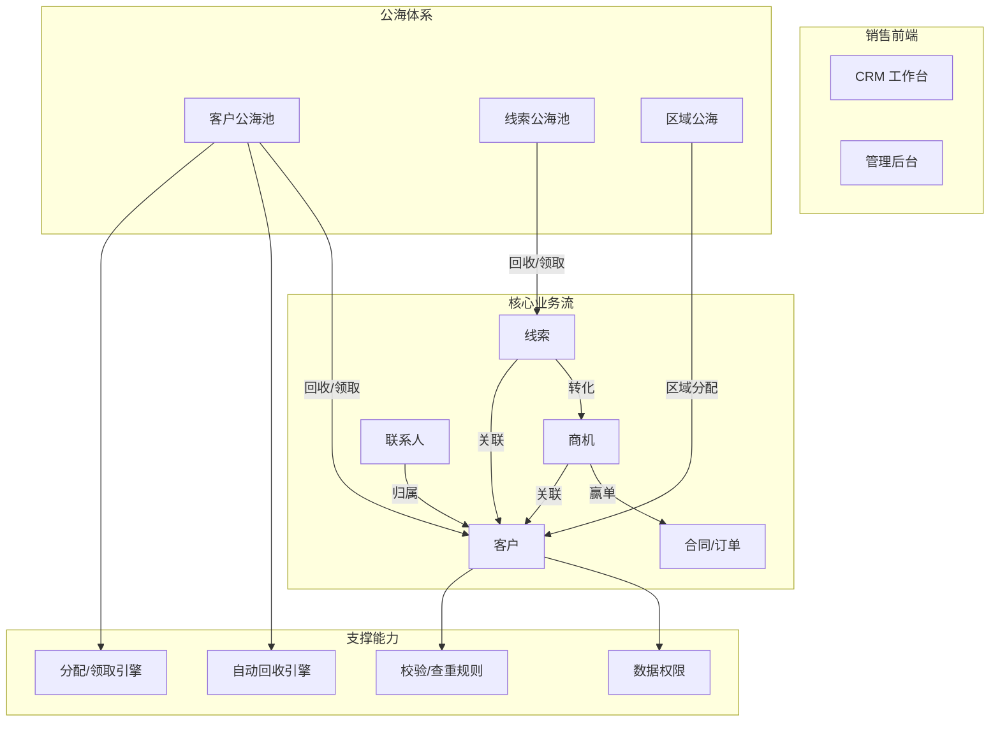
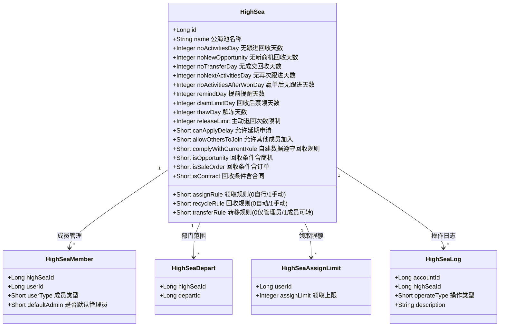
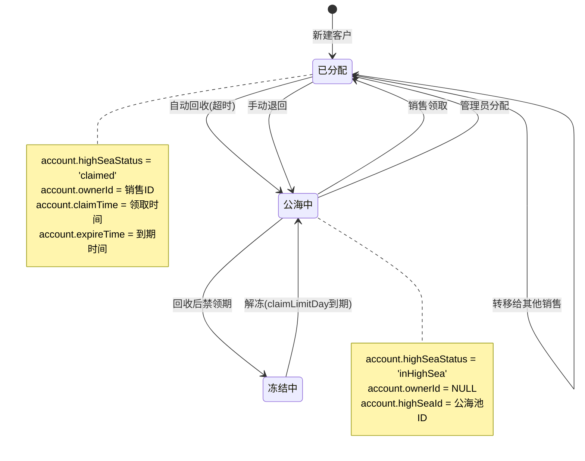
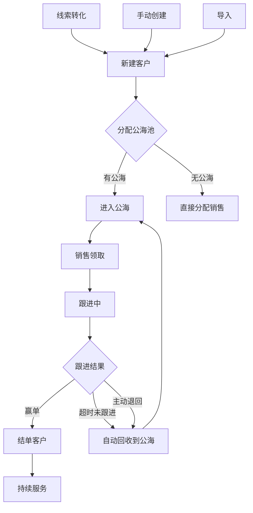
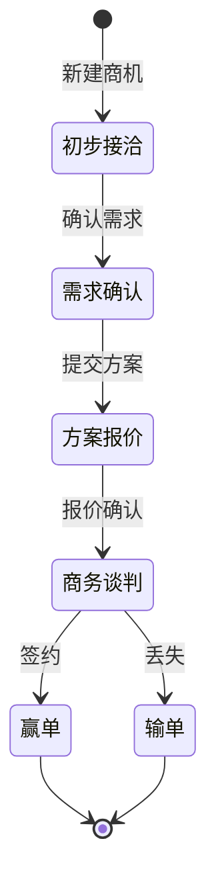
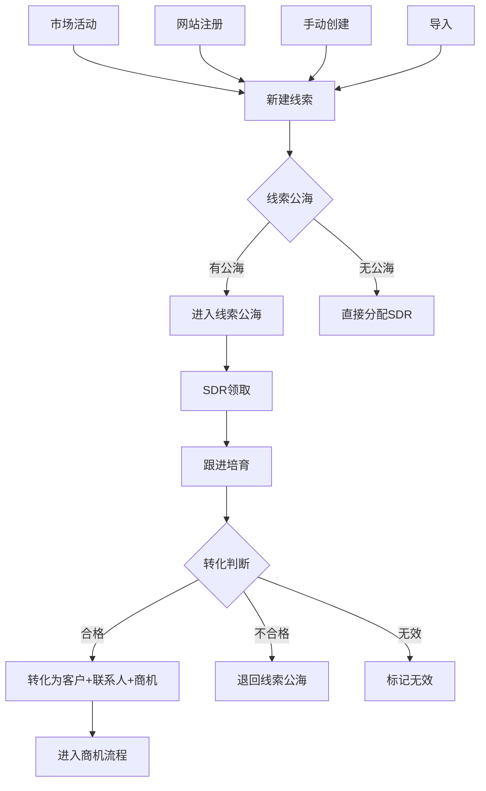
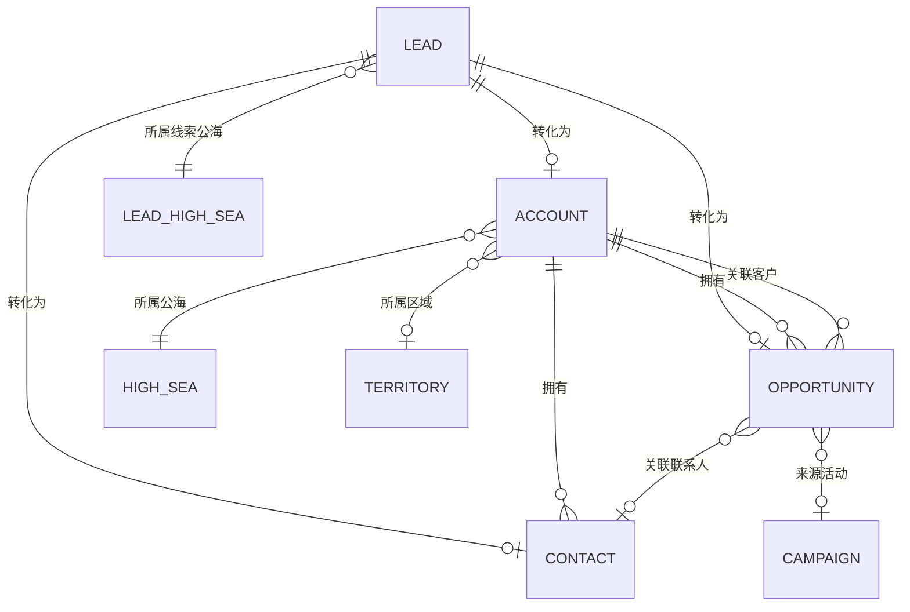

# 公海池·客户·商机·线索 — 产品设计深度分析

> 基于老系统源码分析 | 2026-04-25

---

## 一、系统架构总览



---

## 二、公海池产品设计

### 2.1 业务定位

公海池是 CRM 的**客户资源流转中枢**，解决三个核心问题：
1. **防止客户资源沉淀**：销售长期不跟进的客户自动回收到公海
2. **公平分配销售资源**：新销售可以从公海领取客户
3. **提升客户转化率**：让有能力的销售接手被放弃的客户

### 2.2 公海池模型（老系统 a_high_sea）



### 2.3 公海池核心流程



### 2.4 自动回收规则引擎

老系统的回收判断逻辑（`HighSeaRecycleRuleCacheServiceImpl`）：

| 回收条件 | 字段 | 判断逻辑 |
|---------|------|---------|
| 无跟进 | noActivitiesDay | 最近活动时间距今 > N 天 |
| 无新商机 | noNewOpportunity | 客户下无新建商机 > N 天 |
| 无成交 | noTransferDay | 客户下无赢单商机 > N 天 |
| 无再次跟进 | noNextActivitiesDay | 上次跟进后无新跟进 > N 天 |
| 赢单后无跟进 | noActivitiesAfterWonDay | 赢单后无跟进 > N 天 |

回收条件之间是 **OR 关系**：任一条件满足即触发回收。

### 2.5 权限模型

```
公海池权限 = 公海池成员(HighSeaMember) + 部门范围(HighSeaDepart)

操作权限判断：
├── 领取: assignRule=0(自行领取) + (是成员 OR 有全部数据更新权限 OR 是管理员)
├── 分配: 有全部数据更新权限 OR 是公海池管理员
├── 转移: transferRule=1(成员可转) OR 有全部数据更新权限 OR 是管理员
└── 查看: 有全部数据查看权限 OR 是公海池管理员
```

---

## 三、客户（Account）产品设计

### 3.1 客户生命周期



### 3.2 客户与公海的关联字段

| account 字段 | 类型 | 说明 |
|-------------|------|------|
| highSeaId | REFER→highSea | 所属公海池 |
| highSeaStatus | SELECT | active/inactive/inHighSea/claimed |
| claimTime | DATE | 领取时间 |
| expireTime | DATE | 到期时间（领取时间 + 回收天数） |
| releaseDescription | TEXT | 退回描述 |
| territoryHighSeaId | REFER→territory | 所属区域公海 |
| score | INTEGER | 客户分值（影响领取优先级） |

### 3.3 客户核心操作

| 操作 | 触发条件 | 业务逻辑 |
|------|---------|---------|
| 领取 | 销售点击"领取" | 设置 ownerId、claimTime、expireTime、highSeaStatus='claimed' |
| 退回 | 销售点击"退回公海" | 清空 ownerId、设置 highSeaStatus='inHighSea'、记录 releaseDescription |
| 分配 | 管理员点击"分配" | 设置 ownerId、claimTime、highSeaStatus='claimed' |
| 转移 | 销售/管理员点击"转移" | 更换 ownerId、重置 claimTime |
| 自动回收 | 定时任务检测超时 | 清空 ownerId、设置 highSeaStatus='inHighSea'、发送提醒 |

---

## 四、商机（Opportunity）产品设计

### 4.1 商机阶段模型



### 4.2 商机与客户/公海的关系

- 商机必须关联一个客户（accountId）
- 商机的创建/赢单/输单会影响客户的公海回收判断
- `noNewOpportunity`：客户下无新商机 → 触发回收
- `noTransferDay`：客户下无赢单商机 → 触发回收
- 商机赢单后，客户标记为 `isCustomer=true`

### 4.3 商机核心字段

| 字段 | 类型 | 说明 |
|------|------|------|
| accountId | REFER→account | 关联客户 |
| contactId | REFER→contact | 关联联系人 |
| campaignId | REFER→campaign | 来源市场活动 |
| amount | REAL | 商机金额 |
| stageName | SELECT | 商机阶段 |
| probability | PERCENT | 赢单概率 |
| expectedCloseDate | DATE | 预计成交日期 |
| priceBookId | REFER→priceBook | 价格手册 |

---

## 五、线索（Lead）产品设计

### 5.1 线索生命周期



### 5.2 线索转化（L2O: Lead to Opportunity）

老系统的线索转化是一个复杂的事务操作（`LeadHighSeaServiceImpl`）：

```
线索转化流程：
1. 创建客户（Account）或关联已有客户
2. 创建联系人（Contact）
3. 创建商机（Opportunity）
4. 将线索标记为"已转化"
5. 复制线索的自定义字段到客户/联系人
6. 触发工作流/审批流
7. 更新线索公海状态
```

### 5.3 线索公海（独立于客户公海）

老系统有独立的线索公海（`LeadHighSea`），与客户公海结构类似但独立管理：
- 独立的回收规则
- 独立的成员管理
- 独立的领取限额

### 5.4 疑似查重

老系统对线索有**疑似查重**功能（`LeadSeemDuplicateRule`）：
- 线索创建时自动检测是否与已有客户/联系人/商机重复
- 支持跨实体查重（线索 vs 客户、线索 vs 联系人）
- 查重结果标记在线索上，不阻断创建

---

## 六、四实体关联关系



---

## 七、新系统 vs 老系统差距分析

### 7.1 已实现

| 能力 | 状态 |
|------|------|
| 公海池 CRUD（10 个公海池） | ✅ |
| 客户关联公海池（highSeaId REFER） | ✅ |
| 公海回收规则配置（6 种天数） | ✅ |
| 领取/回收/转移规则配置 | ✅ |
| 客户新建表单（元数据驱动） | ✅ |
| 省市区级联 | ✅ |
| 120 条客户种子数据 | ✅ |

### 7.2 P0 待实现

| 能力 | 说明 |
|------|------|
| 公海池成员管理 | HighSeaMember 子实体，控制谁能看/领取公海中的客户 |
| 公海池部门范围 | HighSeaDepart 子实体，控制哪些部门的客户进入该公海 |
| 客户领取/退回操作 | 前端按钮 + 后端 API（更新 ownerId/highSeaStatus/claimTime） |
| 自动回收定时任务 | 扫描超时客户，自动回收到公海 |
| 领取限额 | 每个销售最多持有 N 个客户 |

### 7.3 P1 待实现

| 能力 | 说明 |
|------|------|
| 线索公海 | 独立的线索公海体系 |
| 线索转化（L2O） | 线索 → 客户+联系人+商机 |
| 商机阶段管理 | 阶段流转 + 赢单/输单 |
| 疑似查重 | 跨实体查重 |
| 公海操作日志 | 领取/退回/分配/转移的操作记录 |
| 回收提醒 | 回收前 N 天发送提醒通知 |
| 区域公海 | territory 实体扩展为公海区域 |

### 7.4 P2 待实现

| 能力 | 说明 |
|------|------|
| 延期申请 | 销售申请延长持有时间 |
| 解冻机制 | 回收后冻结期 |
| 自建数据规则 | 销售自建的客户是否遵守回收规则 |
| 回收条件组合 | 商机+订单+合同多条件组合判断 |
| AI 智能查重 | 商机的 AI 疑似查重 |
