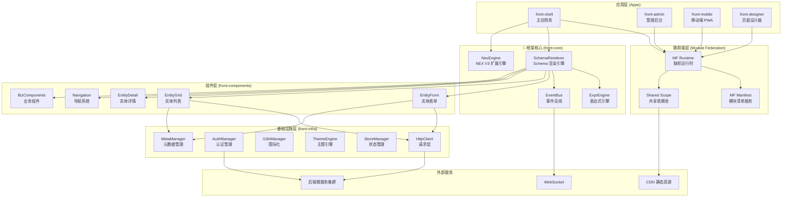
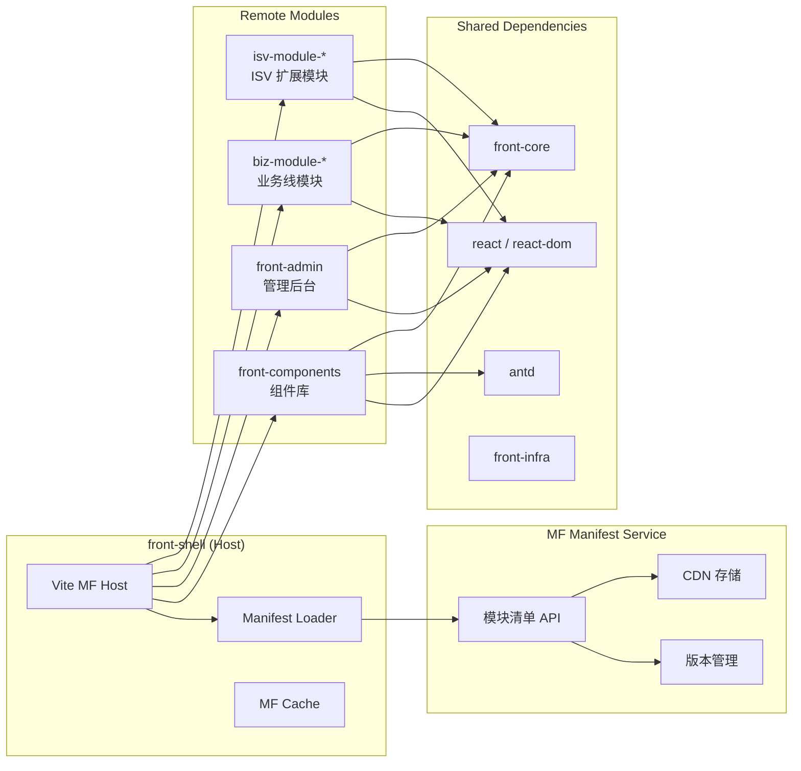
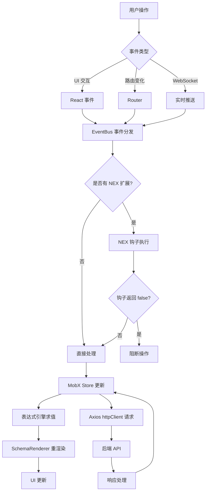
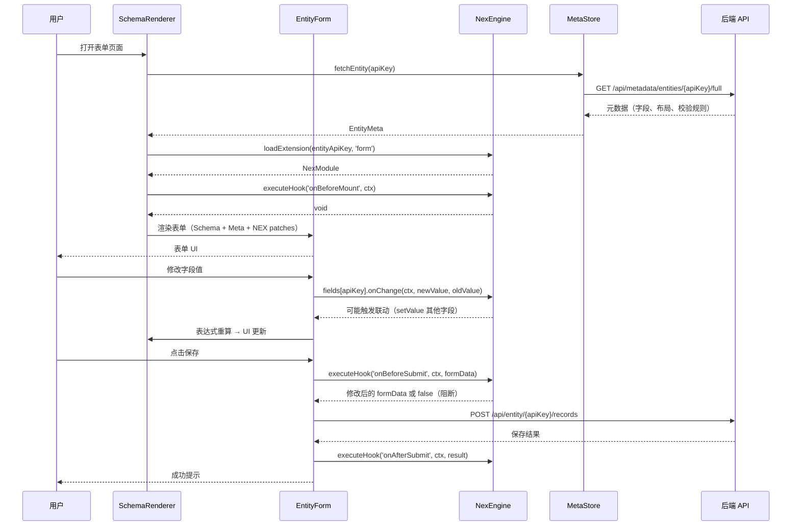
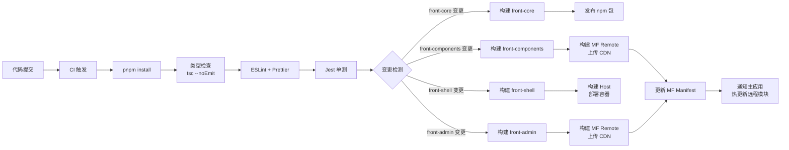
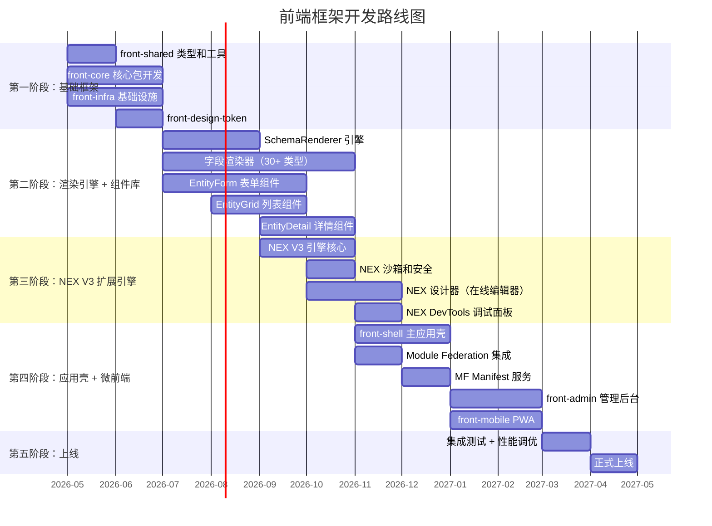

# paas-front-platform 新一代前端框架设计方案

> 版本：1.4 | 日期：2026-04-15
> 定位：aPaaS 元数据驱动平台的全新前端框架，支持 NEX 扩展点和 Module Federation 微前端
> 更新：移除前端 LogicTree/VarSpace，布局完全由后端元数据驱动

---

## 一、设计目标

### 1.1 核心设计目标

| 维度 | 目标 |
|------|------|
| 技术栈 | React 19 + Function Component + Hooks |
| 构建 | Vite 8 + pnpm workspace（秒级 HMR） |
| 状态管理 | MobX + mobx-react-lite（响应式、class store、自动追踪） |
| 渲染引擎 | 自研 Schema Renderer（可控、可调试） |
| 扩展点 | NEX V3（沙箱隔离、类型安全、ESM 模块） |
| 微前端 | Vite Module Federation（原生 ESM、运行时动态加载） |
| 布局驱动 | 后端布局元数据驱动，前端纯渲染（零前端布局逻辑） |
| 多端 | 响应式 + 条件渲染，一套代码覆盖 Web/Mobile/Admin |

### 1.2 技术选型总览

| 层级 | 技术 | 版本 | 选型理由 |
|------|------|------|---------|
| 运行时 | Node.js | 22 LTS | 原生 ESM、性能提升 |
| 框架 | React | 19.x | Server Components、Concurrent Mode |
| 语言 | TypeScript | 5.9+ | 满足类型安全 |
| 构建 | Vite | 8.x (Rolldown) | Rust 引擎、原生 MF 支持 |
| UI 组件 | Ant Design | 6.x | 与 metarepo-web 统一 |
| 状态管理 | MobX | 6.x | 响应式自动追踪、class store、observer 组件 |
| 样式 | Tailwind CSS | 4.x | 原子化、Design Token 集成 |
| 路由 | React Router | 7.x | 数据路由、类型安全 |
| 请求 | Axios | 1.x | 成熟稳定、拦截器机制、自动 snake/camel 转换 |
| 测试 | Jest | 29.x | 成熟稳定、生态丰富、ts-jest 支持 |
| Monorepo | pnpm workspace | 10.x | 快速、严格依赖 |
| 微前端 | @module-federation/vite | 1.x | Vite 原生 Module Federation |

---

## 二、整体架构

### 2.1 系统架构图



### 2.2 Monorepo 包结构

```
paas-front-platform/                   # pnpm workspace root
├── pnpm-workspace.yaml
├── package.json
├── tsconfig.base.json
├── jest.config.cjs
│
├── packages/
│   ├── front-core/                    # 🔑 框架核心（零 UI 依赖）
│   │   ├── src/
│   │   │   ├── schema/                # Schema 渲染引擎
│   │   │   ├── nex/                   # NEX V3 扩展引擎
│   │   │   ├── expr-engine/           # 表达式引擎
│   │   │   ├── event-bus/             # 事件总线
│   │   │   └── index.ts
│   │   └── package.json
│   │
│   ├── front-infra/                   # 基础设施层
│   │   ├── src/
│   │   │   ├── http/                  # HTTP 客户端（拦截器、重试、缓存）
│   │   │   ├── auth/                  # 认证管理（Token、SSO）
│   │   │   ├── i18n/                  # 国际化
│   │   │   ├── theme/                 # 主题引擎（Design Token）
│   │   │   ├── store/                 # MobX Store 工厂
│   │   │   ├── meta/                  # 元数据管理（缓存、合并）
│   │   │   └── index.ts
│   │   └── package.json
│   │
│   ├── front-components/              # UI 组件层
│   │   ├── src/
│   │   │   ├── entity-form/           # 实体表单
│   │   │   ├── entity-grid/           # 实体列表（AG-Grid 或自研）
│   │   │   ├── entity-detail/         # 实体详情
│   │   │   ├── navigation/            # 导航系统
│   │   │   ├── layout/                # 布局组件
│   │   │   ├── field-items/           # 字段渲染器
│   │   │   ├── actions/               # 操作按钮系统
│   │   │   └── index.ts
│   │   └── package.json
│   │
│   ├── front-design-token/            # 设计令牌
│   │   └── package.json
│   │
│   └── front-shared/                  # 共享类型和工具
│       ├── src/
│       │   ├── types/                 # 全局类型定义
│       │   ├── utils/                 # 纯函数工具
│       │   └── constants/             # 常量
│       └── package.json
│
├── apps/
│   ├── front-shell/                   # 🔑 主应用壳
│   │   ├── src/
│   │   │   ├── bootstrap.tsx          # 应用启动
│   │   │   ├── mf-config.ts           # Module Federation 配置
│   │   │   ├── routes/                # 路由配置
│   │   │   ├── layouts/               # 应用布局
│   │   │   └── pages/                 # 壳页面
│   │   ├── vite.config.ts
│   │   └── package.json
│   │
│   ├── front-admin/                   # 管理后台
│   │   ├── src/
│   │   ├── vite.config.ts
│   │   └── package.json
│   │
│   ├── front-mobile/                  # 移动端 PWA
│   │   └── package.json
│   │
│   └── front-designer/                # 页面/扩展设计器
│       └── package.json
│
└── tools/
    ├── front-cli/                     # 开发 CLI 工具
    ├── front-eslint-config/           # ESLint 共享配置
    └── front-tsconfig/                # TypeScript 共享配置
```

---

## 三、核心模块详细设计

### 3.1 Schema Renderer — 自研 Schema 渲染引擎

#### 3.1.1 设计理念

自研轻量级 Schema Renderer，核心原则：

- **可调试**：每个 Schema 节点对应一个 React 组件，DevTools 可直接定位
- **可扩展**：通过注册机制支持自定义渲染器
- **类型安全**：Schema 定义有完整 TypeScript 类型
- **性能可控**：基于 React 19 Concurrent Mode，支持优先级调度

#### 3.1.2 核心类型定义

```typescript
// packages/front-core/src/schema/types.ts

/** Schema 节点基础类型 */
interface SchemaNode {
  /** 组件类型，对应注册的渲染器 */
  type: string
  /** 唯一标识 */
  key?: string
  /** 子节点 */
  children?: SchemaNode | SchemaNode[]
  /** 是否可见 */
  visible?: boolean | string  // string 为表达式
  /** 是否禁用 */
  disabled?: boolean | string
  /** CSS 类名 */
  className?: string
  /** 内联样式 */
  style?: React.CSSProperties
  /** 扩展属性（透传给渲染器） */
  [key: string]: unknown
}

/** 页面 Schema */
interface PageSchema extends SchemaNode {
  type: 'page'
  title?: string
  body: SchemaNode | SchemaNode[]
  toolbar?: SchemaNode[]
  aside?: SchemaNode
}

/** 表单 Schema */
interface FormSchema extends SchemaNode {
  type: 'entity-form'
  entityApiKey: string
  layoutApiKey?: string
  formType: 'create' | 'edit' | 'copy'
  fields?: FieldSchema[]
}

/** 列表 Schema */
interface GridSchema extends SchemaNode {
  type: 'entity-grid'
  entityApiKey: string
  columns?: ColumnSchema[]
  pagination?: PaginationConfig
  filters?: FilterSchema[]
}

/** 字段 Schema */
interface FieldSchema extends SchemaNode {
  type: 'field'
  apiKey: string
  itemType: string
  label?: string
  required?: boolean | string
  helpText?: string
  onChange?: string  // 表达式或函数引用
}

/** 渲染器注册配置 */
interface RendererConfig<P = any> {
  type: string
  component: React.ComponentType<P>
  /** 渲染优先级 */
  priority?: number
  /** 是否支持设计器拖拽 */
  designable?: boolean
}
```

#### 3.1.3 渲染器注册与解析

```typescript
// packages/front-core/src/schema/registry.ts

class RendererRegistry {
  private renderers = new Map<string, RendererConfig>()
  private resolvers: RendererResolver[] = []

  /** 注册渲染器 */
  register(config: RendererConfig): void {
    this.renderers.set(config.type, config)
  }

  /** 批量注册 */
  registerAll(configs: RendererConfig[]): void {
    configs.forEach(c => this.register(c))
  }

  /** 添加自定义解析器（NEX 扩展用） */
  addResolver(resolver: RendererResolver): void {
    this.resolvers.push(resolver)
    this.resolvers.sort((a, b) => (b.priority ?? 0) - (a.priority ?? 0))
  }

  /** 解析 Schema 节点对应的渲染器 */
  resolve(schema: SchemaNode): RendererConfig | null {
    // 1. 优先走自定义解析器（NEX 扩展注入的渲染器）
    for (const resolver of this.resolvers) {
      const result = resolver.resolve(schema)
      if (result) return result
    }
    // 2. 走注册表
    return this.renderers.get(schema.type) ?? null
  }
}

type RendererResolver = {
  priority?: number
  resolve: (schema: SchemaNode) => RendererConfig | null
}

/** 全局单例 */
export const rendererRegistry = new RendererRegistry()
```

#### 3.1.4 SchemaRenderer 组件

```tsx
// packages/front-core/src/schema/SchemaRenderer.tsx

import { memo, Suspense, useMemo } from 'react'
import { rendererRegistry } from './registry'
import { useExprEval } from '../expr-engine/hooks'
import { ErrorBoundary } from './ErrorBoundary'

interface SchemaRendererProps {
  schema: SchemaNode
  /** 父级上下文数据 */
  data?: Record<string, unknown>
  /** 渲染路径（调试用） */
  path?: string
}

export const SchemaRenderer = memo(function SchemaRenderer({
  schema,
  data,
  path = '$'
}: SchemaRendererProps) {
  const evalExpr = useExprEval()
  const logicNode = useLogicNode(schema)

  // 表达式求值：visible
  const visible = useMemo(() => {
    if (typeof schema.visible === 'string') {
      return evalExpr(schema.visible, data)
    }
    return schema.visible !== false
  }, [schema.visible, data, evalExpr])

  if (!visible) return null

  // 解析渲染器
  const config = rendererRegistry.resolve(schema)
  if (!config) {
    if (import.meta.env.DEV) {
      return <div data-schema-path={path}>未找到渲染器: {schema.type}</div>
    }
    return null
  }

  const Component = config.component
  const childPath = `${path}.${schema.key ?? schema.type}`

  return (
    <ErrorBoundary fallback={<div>渲染错误: {schema.type}</div>}>
      <Suspense fallback={null}>
        <Component
          {...schema}
          __path={childPath}
          __data={data}
          __logicNode={logicNode}
        >
          {renderChildren(schema.children, data, childPath)}
        </Component>
      </Suspense>
    </ErrorBoundary>
  )
})

function renderChildren(
  children: SchemaNode | SchemaNode[] | undefined,
  data: Record<string, unknown> | undefined,
  parentPath: string
) {
  if (!children) return null
  const arr = Array.isArray(children) ? children : [children]
  return arr.map((child, i) => (
    <SchemaRenderer
      key={child.key ?? `${child.type}-${i}`}
      schema={child}
      data={data}
      path={`${parentPath}[${i}]`}
    />
  ))
}
```

### 3.2 NEX V3 扩展引擎

#### 3.2.1 设计要点

| 维度 | 方案 | 说明 |
|------|------|------|
| 代码格式 | ESM 模块（编译后） | 扩展代码用 TypeScript 编写，设计器编译为 ESM |
| 沙箱隔离 | iframe sandbox / ShadowRealm | 生产环境隔离执行，防止扩展代码污染主应用 |
| 类型安全 | TypeScript + 类型包生成 | `@front-platform/nex-types` 提供完整 API 类型 |
| 作用域 | 统一 NexScope（按场景分） | 一个实体 + 一个场景 = 一个扩展模块 |
| 生命周期 | 完整钩子体系 | onBeforeMount / onMounted / onDataLoaded / onBeforeSubmit / onAfterSubmit / onBeforeUnmount |
| 调试 | DevTools 面板 + Source Map | 专用 Chrome DevTools 面板，支持断点调试 |
| 版本管理 | 服务端版本 + 增量更新 | 后端存储扩展代码，按版本号增量下发 |

#### 3.2.2 核心类型定义

```typescript
// packages/front-core/src/nex/types.ts

/** NEX 场景类型 */
type NexScene = 'form' | 'grid' | 'detail' | 'home' | 'custom'

/** NEX 扩展定义 */
interface NexExtension {
  /** 扩展唯一标识 */
  id: string
  /** 目标实体 apiKey */
  entityApiKey: string
  /** 目标场景 */
  scene: NexScene
  /** 目标布局 apiKey（可选） */
  layoutApiKey?: string
  /** 扩展版本 */
  version: number
  /** 编译后的扩展代码（ESM 格式） */
  compiledCode: string
  /** Source Map（调试用） */
  sourceMap?: string
  /** 扩展元信息 */
  meta: {
    author: string
    updatedAt: string
    nexCodeVersion: number
    description?: string
  }
}

/** NEX 扩展上下文 — 传递给扩展代码的 API */
interface NexContext {
  /** 当前实体信息 */
  entity: {
    apiKey: string
    name: string
    items: EntityItem[]
  }
  /** 表单操作 API */
  form: {
    getValue: (fieldApiKey: string) => unknown
    setValue: (fieldApiKey: string, value: unknown) => void
    getValues: () => Record<string, unknown>
    setValues: (values: Record<string, unknown>) => void
    validate: () => Promise<boolean>
    submit: () => Promise<void>
    reset: () => void
  }
  /** 列表操作 API */
  grid: {
    refresh: () => void
    getSelectedRows: () => Record<string, unknown>[]
    setFilter: (filters: Record<string, unknown>) => void
  }
  /** 导航 API */
  navigator: {
    openForm: (params: OpenFormParams) => void
    openDetail: (params: OpenDetailParams) => void
    openDialog: (params: DialogParams) => Promise<unknown>
    openDrawer: (params: DrawerParams) => void
    goBack: () => void
  }
  /** HTTP 请求（受限，走代理） */
  http: {
    get: (url: string, params?: Record<string, unknown>) => Promise<unknown>
    post: (url: string, data?: unknown) => Promise<unknown>
  }
  /** 工具方法 */
  util: {
    message: { success: Fn; error: Fn; warning: Fn }
    confirm: (content: string) => Promise<boolean>
    i18n: (key: string, defaultValue?: string) => string
    dayjs: typeof import('dayjs')
  }
  /** 事件系统 */
  on: (event: string, handler: Function) => () => void
  emit: (event: string, payload?: unknown) => void
}

/** NEX 扩展模块导出格式 */
interface NexModule {
  /** 场景钩子 */
  hooks?: {
    /** 页面加载前 */
    onBeforeMount?: (ctx: NexContext) => void | Promise<void>
    /** 页面加载后 */
    onMounted?: (ctx: NexContext) => void
    /** 页面卸载前 */
    onBeforeUnmount?: (ctx: NexContext) => void
    /** 数据加载后 */
    onDataLoaded?: (ctx: NexContext, data: unknown) => void
    /** 表单提交前 */
    onBeforeSubmit?: (ctx: NexContext, data: unknown) => unknown | false
    /** 表单提交后 */
    onAfterSubmit?: (ctx: NexContext, result: unknown) => void
  }
  /** 字段级扩展 */
  fields?: Record<string, {
    visible?: boolean | ((ctx: NexContext) => boolean)
    disabled?: boolean | ((ctx: NexContext) => boolean)
    required?: boolean | ((ctx: NexContext) => boolean)
    helpText?: string
    onChange?: (ctx: NexContext, value: unknown, oldValue: unknown) => void
    /** 自定义渲染器 */
    render?: (ctx: NexContext, props: unknown) => React.ReactNode
  }>
  /** Schema 补丁（合并到原始 Schema） */
  schemaPatch?: (schema: SchemaNode, ctx: NexContext) => SchemaNode
  /** 自定义操作按钮 */
  actions?: Array<{
    key: string
    label: string
    icon?: string
    position: 'toolbar' | 'more' | 'inline'
    visible?: (ctx: NexContext) => boolean
    onClick: (ctx: NexContext) => void | Promise<void>
  }>
}
```

#### 3.2.3 NEX 引擎实现

```typescript
// packages/front-core/src/nex/NexEngine.ts

class NexEngine {
  private extensions = new Map<string, NexModule>()
  private sandbox: NexSandbox

  constructor() {
    this.sandbox = new NexSandbox()
  }

  /** 加载扩展 */
  async loadExtension(ext: NexExtension): Promise<void> {
    const key = this.buildKey(ext.entityApiKey, ext.scene, ext.layoutApiKey)

    // 在沙箱中执行扩展代码
    const module = await this.sandbox.execute<NexModule>(
      ext.compiledCode,
      ext.sourceMap
    )

    this.extensions.set(key, module)
  }

  /** 获取扩展 */
  getExtension(
    entityApiKey: string,
    scene: NexScene,
    layoutApiKey?: string
  ): NexModule | null {
    const key = this.buildKey(entityApiKey, scene, layoutApiKey)
    return this.extensions.get(key) ?? null
  }

  /** 执行生命周期钩子 */
  async executeHook(
    hookName: keyof NexModule['hooks'],
    ctx: NexContext,
    ...args: unknown[]
  ): Promise<unknown> {
    const ext = this.getExtension(
      ctx.entity.apiKey,
      this.getCurrentScene(),
      undefined
    )
    if (!ext?.hooks?.[hookName]) return undefined

    try {
      return await ext.hooks[hookName]!(ctx, ...args)
    } catch (error) {
      console.error(`[NEX] Hook ${hookName} 执行失败:`, error)
      // 扩展错误不应阻断主流程
      return undefined
    }
  }

  /** 合并 Schema 补丁 */
  applySchemaPatches(
    schema: SchemaNode,
    ctx: NexContext
  ): SchemaNode {
    const ext = this.getExtension(
      ctx.entity.apiKey,
      this.getCurrentScene(),
      undefined
    )
    if (!ext?.schemaPatch) return schema

    try {
      return ext.schemaPatch(schema, ctx)
    } catch (error) {
      console.error('[NEX] Schema patch 执行失败:', error)
      return schema
    }
  }

  private buildKey(
    entityApiKey: string,
    scene: NexScene,
    layoutApiKey?: string
  ): string {
    return layoutApiKey
      ? `${entityApiKey}:${scene}:${layoutApiKey}`
      : `${entityApiKey}:${scene}`
  }

  private getCurrentScene(): NexScene {
    // 从路由或上下文推断当前场景
    return 'form' // 简化示例
  }
}

export const nexEngine = new NexEngine()
```

#### 3.2.4 NEX 沙箱

```typescript
// packages/front-core/src/nex/NexSandbox.ts

class NexSandbox {
  /**
   * 在受限环境中执行扩展代码
   * 策略：
   * 1. 生产环境：使用 ShadowRealm（Chrome 127+）或 iframe 沙箱
   * 2. 开发环境：直接执行（方便调试）
   */
  async execute<T>(code: string, sourceMap?: string): Promise<T> {
    if (import.meta.env.DEV) {
      return this.executeInDev<T>(code)
    }
    return this.executeInSandbox<T>(code)
  }

  private async executeInDev<T>(code: string): Promise<T> {
    // 开发环境：通过 dynamic import data URL
    const blob = new Blob([code], { type: 'application/javascript' })
    const url = URL.createObjectURL(blob)
    try {
      const module = await import(/* @vite-ignore */ url)
      return module.default as T
    } finally {
      URL.revokeObjectURL(url)
    }
  }

  private async executeInSandbox<T>(code: string): Promise<T> {
    // 生产环境：iframe 沙箱隔离
    return new Promise((resolve, reject) => {
      const iframe = document.createElement('iframe')
      iframe.style.display = 'none'
      iframe.sandbox.add('allow-scripts')
      document.body.appendChild(iframe)

      const channel = new MessageChannel()
      channel.port1.onmessage = (e) => {
        document.body.removeChild(iframe)
        if (e.data.error) {
          reject(new Error(e.data.error))
        } else {
          resolve(e.data.result as T)
        }
      }

      iframe.contentWindow!.postMessage(
        { type: 'execute', code },
        '*',
        [channel.port2]
      )
    })
  }
}
```


### 3.3 Module Federation — 微前端方案

#### 3.3.1 架构设计

统一使用 Vite 原生 Module Federation（基于 `@module-federation/vite`），配合 Manifest 服务实现运行时动态加载。



#### 3.3.2 Host 配置（front-shell）

```typescript
// apps/front-shell/vite.config.ts

import { defineConfig } from 'vite'
import react from '@vitejs/plugin-react'
import { federation } from '@module-federation/vite'

export default defineConfig({
  plugins: [
    react(),
    federation({
      name: 'front_shell',
      remotes: {
        // 静态远程模块（核心组件库，始终加载）
        front_components: {
          type: 'module',
          name: 'front_components',
          entry: 'https://cdn.example.com/front-components/remoteEntry.js',
          entryGlobalName: 'front_components',
        },
        // 动态远程模块（通过 Manifest 服务运行时解析）
        // 业务线模块和 ISV 模块通过 registerRemotes() 动态注册
      },
      shared: {
        react: { singleton: true, requiredVersion: '^19.0.0' },
        'react-dom': { singleton: true, requiredVersion: '^19.0.0' },
        'react-router-dom': { singleton: true },
        antd: { singleton: true, requiredVersion: '^6.0.0' },
        '@front-platform/core': { singleton: true },
        '@front-platform/infra': { singleton: true },
        '@front-platform/shared': { singleton: true },
        mobx: { singleton: true },
        dayjs: { singleton: true },
      },
    }),
  ],
})
```

#### 3.3.3 Remote 配置（front-components）

```typescript
// packages/front-components/vite.config.ts

import { defineConfig } from 'vite'
import react from '@vitejs/plugin-react'
import { federation } from '@module-federation/vite'

export default defineConfig({
  plugins: [
    react(),
    federation({
      name: 'front_components',
      filename: 'remoteEntry.js',
      exposes: {
        // 按功能域导出，支持按需加载
        './EntityForm': './src/entity-form/index.ts',
        './EntityGrid': './src/entity-grid/index.ts',
        './EntityDetail': './src/entity-detail/index.ts',
        './Navigation': './src/navigation/index.ts',
        './FieldItems': './src/field-items/index.ts',
        './Actions': './src/actions/index.ts',
        './Layout': './src/layout/index.ts',
      },
      shared: {
        react: { singleton: true },
        'react-dom': { singleton: true },
        antd: { singleton: true },
        '@front-platform/core': { singleton: true },
        '@front-platform/infra': { singleton: true },
      },
    }),
  ],
})
```

#### 3.3.4 动态模块加载器

```typescript
// packages/front-core/src/mf/ModuleLoader.ts

interface ModuleManifest {
  name: string
  version: string
  entry: string
  exposes: Record<string, string>
  dependencies?: Record<string, string>
}

class ModuleLoader {
  private manifests = new Map<string, ModuleManifest>()
  private loadedModules = new Map<string, unknown>()
  private manifestServiceUrl: string

  constructor(manifestServiceUrl: string) {
    this.manifestServiceUrl = manifestServiceUrl
  }

  /** 从 Manifest 服务拉取模块清单 */
  async fetchManifests(tenantId: string): Promise<void> {
    const response = await fetch(
      `${this.manifestServiceUrl}/api/mf/manifests?tenantId=${tenantId}`
    )
    const manifests: ModuleManifest[] = await response.json()

    for (const manifest of manifests) {
      this.manifests.set(manifest.name, manifest)
    }
  }

  /** 动态加载远程模块 */
  async loadModule<T = unknown>(
    moduleName: string,
    exposedPath: string
  ): Promise<T> {
    const cacheKey = `${moduleName}/${exposedPath}`
    if (this.loadedModules.has(cacheKey)) {
      return this.loadedModules.get(cacheKey) as T
    }

    const manifest = this.manifests.get(moduleName)
    if (!manifest) {
      throw new Error(`模块 ${moduleName} 未在清单中注册`)
    }

    // 动态注册远程模块
    // @ts-ignore - Module Federation runtime API
    await __federation_method_setRemote(moduleName, {
      url: () => Promise.resolve(manifest.entry),
      format: 'esm',
      from: 'runtime',
    })

    // 加载指定导出
    // @ts-ignore
    const module = await __federation_method_getRemote(
      moduleName,
      exposedPath
    )

    this.loadedModules.set(cacheKey, module)
    return module as T
  }

  /** React 懒加载包装 */
  lazyLoad<T extends React.ComponentType<any>>(
    moduleName: string,
    exposedPath: string
  ): React.LazyExoticComponent<T> {
    return React.lazy(async () => {
      const module = await this.loadModule<{ default: T }>(
        moduleName,
        exposedPath
      )
      return module
    })
  }
}

export const moduleLoader = new ModuleLoader(
  import.meta.env.VITE_MF_MANIFEST_URL
)
```

### 3.4 后端布局元数据驱动

#### 3.4.1 设计理念

布局完全由后端元数据驱动，前端不维护任何布局逻辑树。核心原则：

- **后端为主**：页面结构、字段排列、分组、可见性规则、联动逻辑全部在后端定义
- **前端纯渲染**：SchemaRenderer 接收后端下发的 JSON Schema，递归渲染为 React 组件
- **表达式引擎**：可见性/禁用等动态规则通过 ExprEngine 在前端求值，但规则定义来自后端

#### 3.4.2 后端布局元数据结构

后端通过 `/api/metadata/layouts/{entityApiKey}` 下发完整的页面布局 Schema：

```typescript
/** 后端下发的布局元数据 */
interface LayoutMeta {
  /** 布局唯一标识 */
  apiKey: string
  /** 关联实体 */
  entityApiKey: string
  /** 布局类型 */
  layoutType: 'form' | 'grid' | 'detail' | 'home'
  /** 布局名称 */
  label: string
  /** 页面 Schema（JSON 结构，直接传给 SchemaRenderer） */
  schema: SchemaNode
  /** 字段级规则（可见性、必填、禁用等表达式） */
  fieldRules: Record<string, FieldRule>
  /** 操作按钮定义 */
  actions: ActionMeta[]
  /** 布局版本号 */
  version: number
}

interface FieldRule {
  visible?: string   // 表达式，如 "category === 'enterprise'"
  disabled?: string  // 表达式
  required?: string  // 表达式
  helpText?: string
}

interface ActionMeta {
  key: string
  label: string
  icon?: string
  position: 'toolbar' | 'more' | 'inline'
  visible?: string  // 表达式
  actionType: 'submit' | 'navigate' | 'api' | 'custom'
  actionConfig: Record<string, unknown>
}
```

#### 3.4.3 前端渲染流程

```
后端 API → LayoutMeta（JSON） → SchemaRenderer → React 组件树
                                      ↓
                               ExprEngine 求值（visible/disabled 表达式）
                                      ↓
                               RendererRegistry 解析组件类型
                                      ↓
                               递归渲染子节点
```

前端不维护任何布局状态树，所有布局变更通过后端 API 重新拉取 LayoutMeta 实现。

### 3.5 元数据管理层

```typescript
// packages/front-infra/src/meta/MetaManager.ts

import { makeAutoObservable, runInAction } from 'mobx'
import type { EntityMeta } from '@front-platform/shared'
import { httpClient } from '../http/client'

interface EntityMeta {
  apiKey: string
  name: string
  nameKey: string
  namespace: 'system' | 'product' | 'custom'
  items: EntityItemMeta[]
  links: EntityLinkMeta[]
  busiTypes: BusiTypeMeta[]
}

interface EntityItemMeta {
  apiKey: string
  label: string
  labelKey: string
  itemType: string
  dbColumn: string
  required: boolean
  unique: boolean
  defaultValue?: unknown
  pickOptions?: PickOptionMeta[]
  referenceEntity?: string
  helpText?: string
}

/** 元数据缓存 Store（MobX class store + Axios 请求） */
class MetaStore {
  entities = new Map<string, EntityMeta>()
  loading = new Set<string>()
  private waiters = new Map<string, Array<(entity: EntityMeta) => void>>()

  constructor() {
    makeAutoObservable(this, {}, { autoBind: true })
  }

  async fetchEntity(apiKey: string): Promise<EntityMeta> {
    const cached = this.entities.get(apiKey)
    if (cached) return cached

    // 去重：已在加载中则等待
    if (this.loading.has(apiKey)) {
      return new Promise<EntityMeta>((resolve) => {
        const list = this.waiters.get(apiKey) ?? []
        list.push(resolve)
        this.waiters.set(apiKey, list)
      })
    }

    this.loading.add(apiKey)

    try {
      // 直接使用 Axios httpClient 请求
      const { data } = await httpClient.get<EntityMeta>(
        `/api/metadata/entities/${apiKey}/full`
      )

      runInAction(() => {
        this.entities.set(apiKey, data)
        this.loading.delete(apiKey)
      })

      // 通知等待者
      const waiters = this.waiters.get(apiKey)
      if (waiters) {
        waiters.forEach((resolve) => resolve(data))
        this.waiters.delete(apiKey)
      }

      return data
    } catch (error) {
      runInAction(() => {
        this.loading.delete(apiKey)
      })
      throw error
    }
  }

  getEntity(apiKey: string) {
    return this.entities.get(apiKey)
  }

  invalidate(apiKey: string) {
    this.entities.delete(apiKey)
  }
}

export const metaStore = new MetaStore()
```

---

## 四、数据流架构

### 4.1 整体数据流



### 4.2 表单数据流（核心场景）



---

## 五、NEX V3 扩展开发体验

### 5.1 扩展代码示例

ISV 或业务线开发者编写的扩展代码（TypeScript，在设计器中编辑）：

```typescript
// 客户实体表单扩展
import type { NexModule, NexContext } from '@front-platform/core'

const extension: NexModule = {
  hooks: {
    async onBeforeMount(ctx) {
      // 页面加载前：根据业务类型隐藏某些字段
      const busiType = ctx.form.getValue('busiTypeApiKey')
      if (busiType === 'vip_customer') {
        ctx.emit('show-vip-badge')
      }
    },

    onDataLoaded(ctx, data) {
      // 数据加载后：自动计算某些字段
      const amount = data.amount as number
      const discount = data.discountRate as number
      if (amount && discount) {
        ctx.form.setValue('finalAmount', amount * (1 - discount / 100))
      }
    },

    async onBeforeSubmit(ctx, data) {
      // 提交前校验
      const phone = data.phone as string
      if (phone && !phone.startsWith('+')) {
        ctx.util.message.warning('请输入带国际区号的手机号')
        return false // 阻断提交
      }
      return data
    },
  },

  fields: {
    // 字段级扩展
    'customItem1__c': {
      visible: (ctx) => ctx.form.getValue('category') === 'enterprise',
      onChange(ctx, value) {
        // 联动：自定义字段1变化时更新字段2
        if (value === 'special') {
          ctx.form.setValue('customItem2__c', 'auto-filled')
        }
      },
    },
    'amount': {
      helpText: '请输入不含税金额',
      required: (ctx) => ctx.form.getValue('contractType') === 'formal',
    },
  },

  actions: [
    {
      key: 'send-welcome-email',
      label: '发送欢迎邮件',
      icon: 'mail',
      position: 'toolbar',
      visible: (ctx) => ctx.form.getValue('status') === 'active',
      async onClick(ctx) {
        const confirmed = await ctx.util.confirm('确认发送欢迎邮件？')
        if (!confirmed) return
        await ctx.http.post('/api/custom/send-welcome', {
          recordId: ctx.form.getValue('id'),
        })
        ctx.util.message.success('邮件已发送')
      },
    },
  ],
}

export default extension
```

---

## 六、构建与部署

### 6.1 构建流水线



### 6.2 MF Manifest 服务

```typescript
// 后端服务：管理模块联邦的版本和入口地址

interface MFManifestEntry {
  name: string           // 模块名
  version: string        // 语义化版本
  entry: string          // remoteEntry.js CDN 地址
  exposes: string[]      // 导出列表
  tenantScope: 'global' | 'tenant'  // 全局模块 or 租户级模块
  tenantId?: string      // 租户级模块的租户 ID
  status: 'active' | 'canary' | 'deprecated'
}

// API: GET /api/mf/manifests?tenantId=xxx
// 返回该租户可用的所有模块清单
// 合并逻辑：global 模块 + 该租户的 tenant 模块
```

---

## 七、开发路线图



---

## 八、核心设计决策总结

| 维度 | 方案 | 选型理由 |
|------|------|---------|
| 渲染引擎 | 自研 SchemaRenderer | 完全可控、可调试、性能可优化，不受第三方框架制约 |
| 布局驱动 | 后端布局元数据 + SchemaRenderer | 布局结构/字段规则/操作按钮全部后端定义，前端纯渲染 |
| 扩展点 | NEX V3（ESM 模块 + 沙箱隔离） | TypeScript 类型安全、Source Map 可调试、iframe 沙箱安全隔离 |
| 微前端 | Vite Module Federation + Manifest 服务 | 原生 ESM、运行时动态加载、租户级模块隔离、独立部署 |
| 状态管理 | MobX + mobx-react-lite | 响应式自动追踪、class store 直观、observer 精确重渲染 |
| 构建工具 | Vite 8（Rolldown 引擎） | Rust 编译、秒级 HMR、原生 MF 支持 |
| 样式方案 | Tailwind CSS 4 + Design Token | 原子化 CSS、零运行时、Design Token 原生集成 |
| 数据请求 | Axios 1.x + httpClient 封装 | 成熟稳定、拦截器机制、自动 snake/camel key 转换、token 注入 |
| 测试框架 | Jest 29 + ts-jest | 成熟稳定、生态丰富、jsdom 环境、ts-jest 原生 TS 支持 |
| 多端策略 | 响应式布局 + 条件渲染 + PWA | 一套代码覆盖 Web/Mobile/Admin，95% 逻辑复用 |
| Monorepo | pnpm workspace | 严格依赖管理、快速安装、原生 workspace 协议 |
| 国际化 | 自研 i18n（基于 xxxKey 元数据字段） | 与元数据 labelKey/descriptionKey 体系对齐 |


---

## 九、metarepo-web 迁移记录

> 日期：2026-04-15 | 状态：Phase 0 完成

### 9.1 迁移背景

`paas-front-platform` 仓库原有两套独立代码：

| 代码 | 来源 | 问题 |
|------|------|------|
| `src/` | 从 metarepo-web 迁移的业务代码 | 使用自建 `src/infra/http.ts`，硬编码 localStorage key，未接入框架层 |
| `packages/front-*` | 新框架层（@front-platform/core、infra、shared 等） | 已实现 httpClient、authStore、STORAGE_KEYS，但未被业务代码使用 |

### 9.2 已完成的改动（Phase 0）

#### 9.2.1 HTTP 层统一

`src/api/*.ts`（5 个文件）的 import 全部从旧的本地 http 实例切换到框架包：

```diff
- import { http } from '@/infra/http'
+ import { httpClient as http } from '@front-platform/infra'
```

涉及文件：`auth.ts`、`entityData.ts`、`entityManage.ts`、`metarepo.ts`、`permission.ts`

#### 9.2.2 localStorage key 统一

`src/api/auth.ts` 和 `src/hooks/useAuth.ts` 中硬编码的 `'neo_token'` / `'neo_user'` 全部替换为 `@front-platform/shared` 导出的 `STORAGE_KEYS` 常量，与框架层 `authStore` / `httpClient` 拦截器保持一致。

#### 9.2.3 删除旧 HTTP 层

`src/infra/http.ts` 已删除，功能完全由 `packages/front-infra/src/http/client.ts` 替代。

#### 9.2.4 Admin 页面迁移

`src/pages/admin/*`（17 个页面文件）已迁移到 `apps/front-admin/src/pages/`。`front-admin` 通过 `@/` 别名引用 `src/` 下的共享业务代码（api、hooks、components、types、config）。

#### 9.2.5 Shell 应用集成

`apps/front-shell/` 已成为唯一入口：
- `bootstrap.tsx` → 应用启动（替代旧 `src/main.tsx`）
- `ShellApp.tsx` → 路由 + 认证守卫（替代旧 `src/App.tsx`），通过 `useAuthStore` 管理认证状态
- `LoginPage.tsx` → 登录页（替代旧 `src/pages/LoginPage.tsx`），使用 `httpClient` + `useAuthStore`
- `vite.config.ts` → 包含 `@/` 别名和后端代理配置

#### 9.2.6 根目录清理

已删除的根目录文件（职责已转移到 `apps/front-shell/`）：
- `vite.config.ts`
- `tsconfig.json`
- `index.html`
- `eslint.config.js`

根 `package.json` 的 `scripts.dev` 已改为 `pnpm --filter @front-platform/shell dev`。

#### 9.2.7 无用代码清理

已删除的死代码：

| 文件/目录 | 原因 |
|-----------|------|
| `src/App.tsx` | 旧根组件，被 `ShellApp.tsx` 替代 |
| `src/main.tsx` | 旧入口，被 `bootstrap.tsx` 替代 |
| `src/index.css` | 旧样式，已复制到 shell |
| `src/infra/http.ts` | 被 `@front-platform/infra` 的 `httpClient` 替代 |
| `src/hooks/useAuth.ts` | 仅被旧 App.tsx 和 LoginPage 使用，shell 使用 `useAuthStore` |
| `src/hooks/usePermissionValidation.ts` | 未被任何文件引用 |
| `src/components/auth/*`（11 个文件） | 仅被旧 LoginPage 使用，shell 有独立登录页 |
| `src/pages/admin/*`（17 个文件） | 已迁移到 `apps/front-admin/src/pages/` |
| `src/pages/LoginPage.tsx` | 被 shell 的 LoginPage 替代 |

### 9.3 当前目录结构

```
paas-front-platform/
├── pnpm-workspace.yaml
├── package.json                       # workspace root，scripts 指向 shell
├── tsconfig.base.json                 # 共享 TS 配置
│
├── src/                               # 共享业务代码（被 admin/shell 通过 @/ 别名引用）
│   ├── api/                           # API 层（已统一使用 @front-platform/infra）
│   ├── components/admin/              # Admin UI 组件
│   ├── components/common/             # 通用组件
│   ├── components/metamodel/          # 元模型组件
│   ├── components/schema/             # Schema 浏览组件
│   ├── config/navigation.ts           # 导航配置
│   ├── hooks/                         # 业务 Hooks（7 个）
│   └── types/                         # 业务类型定义
│
├── packages/
│   ├── front-core/                    # @front-platform/core — 框架核心
│   ├── front-infra/                   # @front-platform/infra — httpClient, authStore, i18n, theme, meta
│   ├── front-shared/                  # @front-platform/shared — types, utils, STORAGE_KEYS
│   ├── front-components/              # @front-platform/components — 实体表单/列表/详情
│   └── front-design-token/            # @front-platform/design-token — Design Token
│
├── apps/
│   ├── front-shell/                   # @front-platform/shell — 主应用壳（唯一入口）
│   │   ├── src/bootstrap.tsx          # 应用启动
│   │   ├── src/ShellApp.tsx           # 路由 + 认证守卫
│   │   ├── src/pages/LoginPage.tsx    # 登录页
│   │   ├── src/layouts/ShellLayout.tsx
│   │   ├── vite.config.ts            # Vite 配置 + @/ 别名 + 代理
│   │   └── index.html
│   ├── front-admin/                   # @front-platform/admin — 管理后台
│   │   ├── src/pages/                 # 从 src/pages/admin/ 迁移的 17 个页面
│   │   ├── src/index.ts               # 导出 AdminConsolePage
│   │   ├── vite.config.ts            # Vite 配置 + @/ 别名 + 代理
│   │   └── tsconfig.json
│   ├── front-designer/
│   └── front-mobile/
│
├── server/                            # Node BFF（开发用）
└── tools/                             # ESLint/TSConfig 共享配置
```

### 9.4 后续迁移计划

| Phase | 内容 | 状态 |
|-------|------|------|
| Phase 0 | HTTP/Auth 统一 + Admin 迁移 + Shell 集成 + 死代码清理 | ✅ 完成 |
| Phase 1 | 将 `src/` 共享代码拆分到对应 packages（api → infra，hooks → 各 package） | 待开始 |
| Phase 2 | front-admin 通过 Module Federation 作为 remote 暴露给 shell | 待开始 |
| Phase 3 | 接入 SchemaRenderer，替换手写页面为 Schema 驱动 | 待开始 |
| Phase 4 | NEX V3 扩展引擎集成 | 待开始 |
