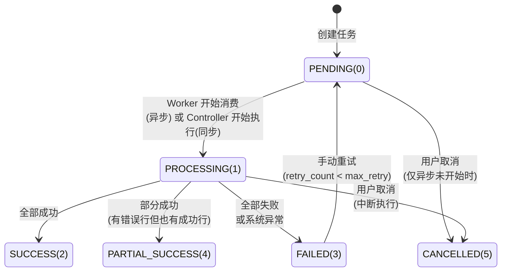
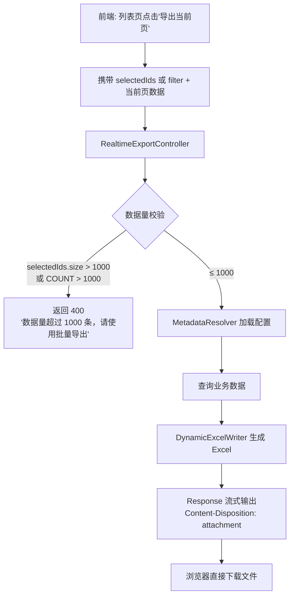
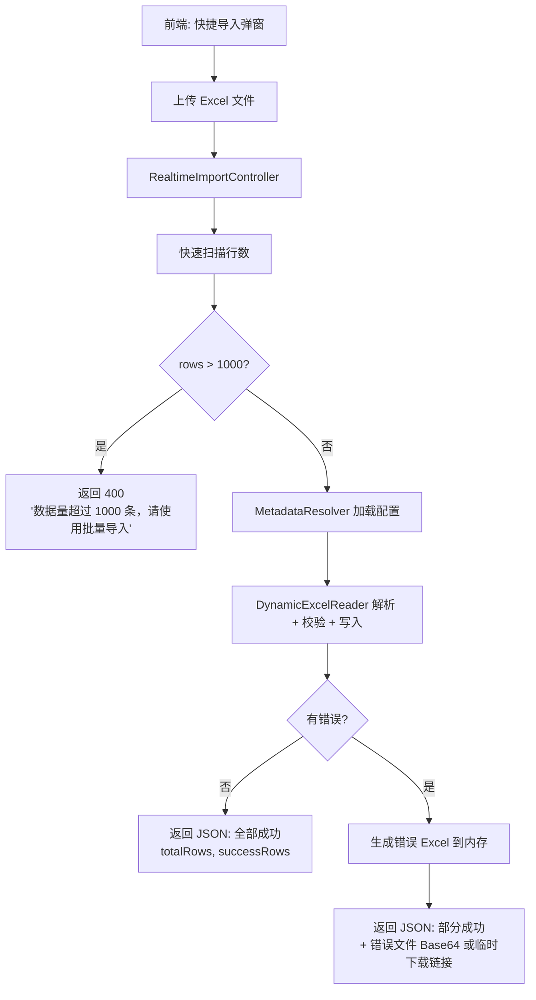
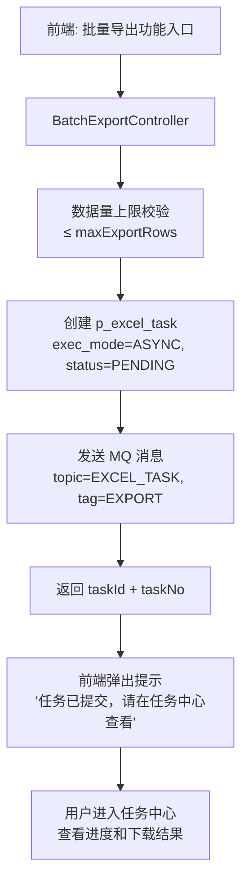
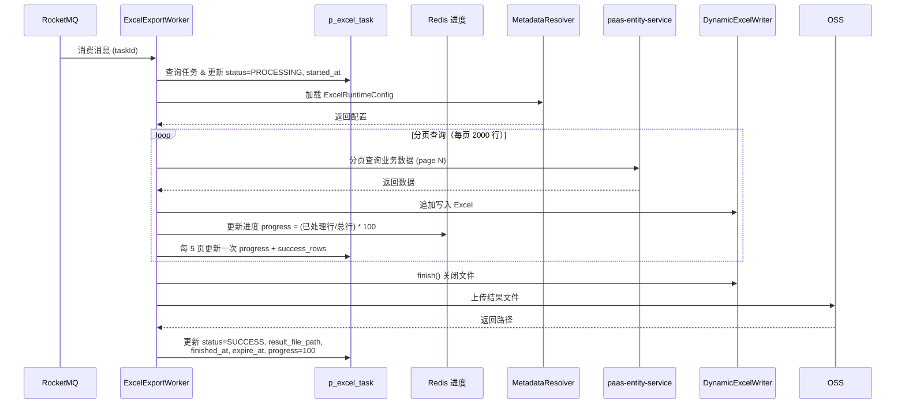
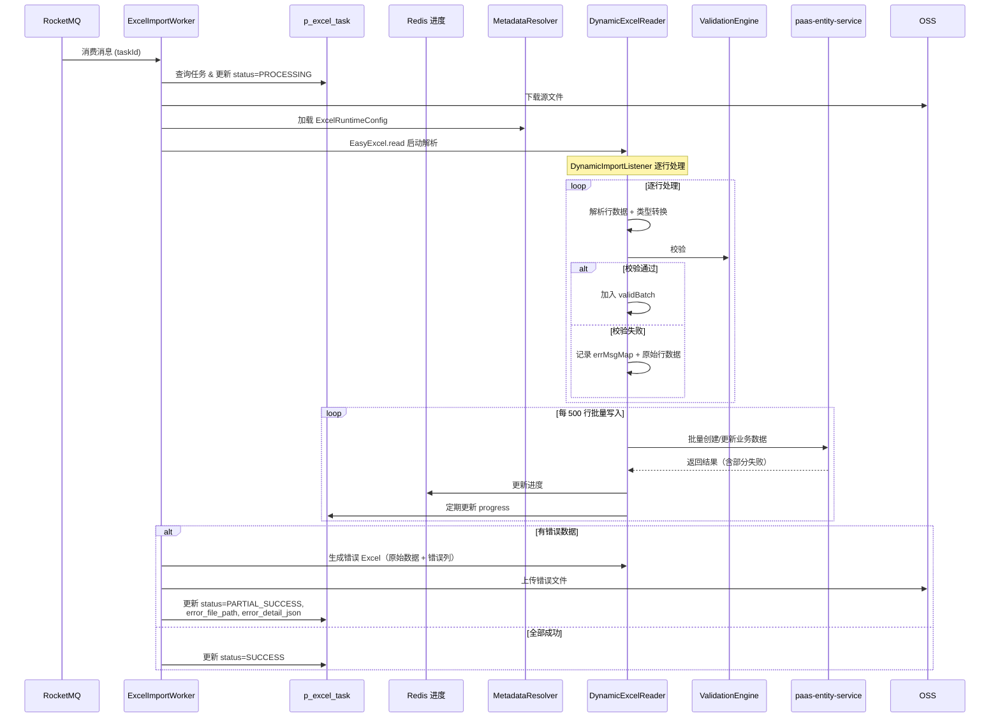
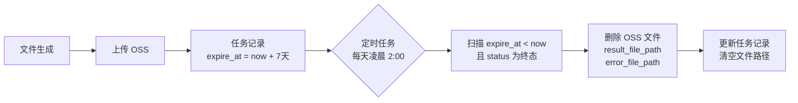

# 任务中心与同步/异步执行详细设计

> 本文档是《元数据驱动导入导出框架设计方案》第 6 章的增强替代，完整覆盖：
> - 两种场景的清晰划分：实时场景（同步）vs 批量场景（异步）
> - 个人任务列表数据模型
> - MQ 异步消费流程
> - 任务状态机与进度追踪
> - 前端任务中心页面设计
> - 后端实现核心类设计

## 1. 设计目标

### 1.1 核心原则：场景决定执行模式

系统存在两种本质不同的使用场景，执行模式由**场景**决定，而非由数据量决定：

| 场景 | 执行模式 | 入口 | 说明 |
|:---|:---|:---|:---|
| 实时场景 | 同步 | 列表页"导出当前页"、详情页"导出本条"、快捷导入少量数据 | 用户期望即时拿到结果，限制 ≤ 1000 条 |
| 批量场景 | 异步（始终） | 专门的"批量导入"/"批量导出"功能入口 | 无论 1 条还是 50000 条，都走 MQ 异步 + 任务列表 |

```
实时场景：用户点击 → 同步执行 → 直接下载/返回结果（秒级）
批量场景：用户提交 → 创建任务 → MQ 异步消费 → 任务列表查看进度和结果
```

### 1.2 设计目标

| 目标 | 说明 |
|:---|:---|
| 场景分离 | 实时和批量走不同的 API 和执行路径，职责清晰 |
| 实时秒级响应 | 实时场景同步执行，≤ 1000 条硬限制，超过拒绝并引导用户走批量入口 |
| 批量始终异步 | 批量场景无论数据量大小，都走 MQ + 任务列表，保证可追溯 |
| 个人任务列表 | 每个用户可查看自己发起的所有批量任务，含状态、进度、结果 |
| 结果可追溯 | 任务完成后结果文件保留 7 天，用户可随时回看和下载 |

## 2. 数据模型

### 2.1 任务表 DDL

```sql
-- 个人导入导出任务表
-- 同时兼容 MySQL 和 PostgreSQL，遵循全局基线约束
CREATE TABLE p_excel_task (
    -- BaseEntity 基础字段
    id                  BIGINT NOT NULL,
    delete_flg          SMALLINT NOT NULL DEFAULT 0,
    created_at          BIGINT NOT NULL,
    created_by          BIGINT NOT NULL,
    updated_at          BIGINT NOT NULL,
    updated_by          BIGINT NOT NULL,

    -- 租户隔离
    tenant_id           BIGINT NOT NULL,

    -- 任务基本信息
    task_no             VARCHAR(64) NOT NULL,       -- 任务编号（展示用，如 EXP-20260415-0001）
    task_type           SMALLINT NOT NULL,           -- 1=导出, 2=导入, 3=模板生成
    task_label          VARCHAR(256),                -- 任务显示名（如"客户数据导出"）
    entity_api_key      VARCHAR(128) NOT NULL,       -- 关联 Entity
    entity_label        VARCHAR(128),                -- Entity 显示名（冗余，避免查询）
    profile_api_key     VARCHAR(128),                -- 关联 ExcelProfile
    busi_type_api_key   VARCHAR(128),                -- 关联 BusiType

    -- 执行模式
    exec_mode           SMALLINT NOT NULL DEFAULT 0, -- 0=同步, 1=异步
    import_mode         SMALLINT,                    -- 导入模式: 1=INSERT, 2=UPSERT, 3=UPDATE
    upsert_key          VARCHAR(128),                -- UPSERT 匹配字段 apiKey

    -- 状态与进度
    status              SMALLINT NOT NULL DEFAULT 0, -- 见状态机定义
    progress            SMALLINT NOT NULL DEFAULT 0, -- 0~100
    total_rows          INT NOT NULL DEFAULT 0,
    success_rows        INT NOT NULL DEFAULT 0,
    error_rows          INT NOT NULL DEFAULT 0,
    skip_rows           INT NOT NULL DEFAULT 0,      -- 跳过行数（重复数据等）

    -- 文件信息
    source_file_path    VARCHAR(512),                -- 导入源文件 OSS 路径
    source_file_name    VARCHAR(256),                -- 原始文件名
    source_file_size    BIGINT,                      -- 文件大小（字节）
    result_file_path    VARCHAR(512),                -- 导出/模板结果文件 OSS 路径
    result_file_name    VARCHAR(256),                -- 结果文件名
    error_file_path     VARCHAR(512),                -- 错误明细文件 OSS 路径

    -- 执行详情
    error_message       VARCHAR(2000),               -- 失败原因摘要
    error_detail_json   TEXT,                        -- 前 50 条错误明细 JSON
    filter_json         TEXT,                        -- 导出筛选条件 JSON
    started_at          BIGINT,                      -- 开始执行时间戳
    finished_at         BIGINT,                      -- 完成时间戳
    expire_at           BIGINT,                      -- 文件过期时间（7天后）

    -- MQ 相关
    mq_msg_id           VARCHAR(128),                -- MQ 消息 ID（异步任务）
    retry_count         SMALLINT NOT NULL DEFAULT 0, -- 重试次数
    max_retry           SMALLINT NOT NULL DEFAULT 3, -- 最大重试次数

    PRIMARY KEY (id)
);

-- 索引：个人任务列表查询（核心查询路径）
CREATE INDEX idx_excel_task_user ON p_excel_task (tenant_id, created_by, status, created_at);
-- 索引：按状态查询待处理任务
CREATE INDEX idx_excel_task_status ON p_excel_task (tenant_id, status, created_at);
-- 索引：任务编号唯一
CREATE UNIQUE INDEX uk_excel_task_no ON p_excel_task (tenant_id, task_no);
```

### 2.2 任务状态机



| 状态码 | 名称 | 说明 |
|:---:|:---|:---|
| 0 | PENDING | 已创建，等待执行（异步任务已发送 MQ） |
| 1 | PROCESSING | 正在执行中（Worker 已消费，或同步执行中） |
| 2 | SUCCESS | 全部成功完成 |
| 3 | FAILED | 执行失败（系统异常或全部数据校验失败） |
| 4 | PARTIAL_SUCCESS | 部分成功（有成功行也有错误行，生成了错误文件） |
| 5 | CANCELLED | 已取消 |

### 2.3 Java Entity

```java
@Data
@TableName("p_excel_task")
public class ExcelTaskEntity extends BaseEntity {

    private Long tenantId;

    // 任务基本信息
    private String taskNo;
    private Integer taskType;        // TaskTypeEnum: 1=EXPORT, 2=IMPORT, 3=TEMPLATE
    private String taskLabel;
    private String entityApiKey;
    private String entityLabel;
    private String profileApiKey;
    private String busiTypeApiKey;

    // 执行模式
    private Integer execMode;        // ExecModeEnum: 0=SYNC, 1=ASYNC
    private Integer importMode;      // ImportModeEnum: 1=INSERT, 2=UPSERT, 3=UPDATE
    private String upsertKey;

    // 状态与进度
    private Integer status;          // TaskStatusEnum
    private Integer progress;
    private Integer totalRows;
    private Integer successRows;
    private Integer errorRows;
    private Integer skipRows;

    // 文件信息
    private String sourceFilePath;
    private String sourceFileName;
    private Long sourceFileSize;
    private String resultFilePath;
    private String resultFileName;
    private String errorFilePath;

    // 执行详情
    private String errorMessage;
    private String errorDetailJson;
    private String filterJson;
    private Long startedAt;
    private Long finishedAt;
    private Long expireAt;

    // MQ 相关
    private String mqMsgId;
    private Integer retryCount;
    private Integer maxRetry;
}
```

### 2.4 枚举定义

```java
public enum TaskTypeEnum {
    EXPORT(1, "导出"),
    IMPORT(2, "导入"),
    TEMPLATE(3, "模板生成");
}

public enum ExecModeEnum {
    SYNC(0, "同步"),
    ASYNC(1, "异步");
}

public enum TaskStatusEnum {
    PENDING(0, "待处理"),
    PROCESSING(1, "处理中"),
    SUCCESS(2, "成功"),
    FAILED(3, "失败"),
    PARTIAL_SUCCESS(4, "部分成功"),
    CANCELLED(5, "已取消");
}

public enum ImportModeEnum {
    INSERT(1, "新增"),
    UPSERT(2, "新增或更新"),
    UPDATE(3, "仅更新");
}
```


## 3. 场景分离：实时 vs 批量

### 3.1 两种场景的本质区别

```mermaid
graph LR
    subgraph 实时场景 — 同步执行
        RT_IN[列表页/详情页<br/>快捷操作入口] --> RT_API[/api/v1/excel-realtime/**]
        RT_API --> RT_EXEC[当前线程同步执行<br/>≤ 1000 条硬限制]
        RT_EXEC --> RT_RESP[直接返回文件流<br/>或 JSON 结果]
    end

    subgraph 批量场景 — 始终异步
        BT_IN[专门的批量导入<br/>批量导出功能入口] --> BT_API[/api/v1/excel-batch/**]
        BT_API --> BT_TASK[创建 p_excel_task<br/>发送 MQ 消息]
        BT_TASK --> BT_MQ[MQ Worker 异步消费]
        BT_MQ --> BT_LIST[任务列表查看<br/>进度和结果]
    end
```

| 维度 | 实时场景 | 批量场景 |
|:---|:---|:---|
| 前端入口 | 列表页"导出当前页"、详情页"导出本条"、快捷导入 | 专门的"批量导入"/"批量导出"功能按钮 |
| API 路径 | `/api/v1/excel-realtime/export`、`/realtime/import` | `/api/v1/excel-batch/export`、`/batch/import` |
| 执行模式 | 始终同步，当前线程执行 | 始终异步，MQ 消费执行 |
| 数据量限制 | 硬限制 ≤ 1000 条，超过直接拒绝 | 无下限（1 条也走异步），上限由 ExcelProfile 配置 |
| 是否写任务表 | 不写 p_excel_task，无痕执行 | 始终写 p_excel_task，记录到个人任务列表 |
| 响应方式 | 直接返回文件流（导出）或 JSON 结果（导入） | 返回 taskId，前端跳转/轮询任务中心 |
| 用户感知 | 点击即得，秒级响应 | "任务已提交"提示 → 任务中心查看进度 |
| 错误处理 | 直接返回错误信息 | 生成错误文件，任务列表可下载 |
| 文件存储 | 不上传 OSS，直接流式输出 | 上传 OSS，7 天过期 |

### 3.2 实时场景 API 与流程

#### 3.2.1 实时导出

```
POST /api/v1/excel-realtime/export
```



```java
/**
 * 实时导出 — 同步执行，直接返回文件流
 * 不写 p_excel_task，不上传 OSS
 */
@RestController
@RequestMapping("/api/v1/excel-realtime")
public class RealtimeExcelController {

    private static final int REALTIME_MAX_ROWS = 1000;

    @PostMapping("/export")
    public void realtimeExport(@RequestBody RealtimeExportRequest request,
                                HttpServletResponse response) {
        // 1. 数据量校验
        int count;
        if (CollectionUtils.isNotEmpty(request.getSelectedIds())) {
            count = request.getSelectedIds().size();
        } else {
            count = entityDataService.countByFilter(
                request.getEntityApiKey(), request.getFilter());
        }

        if (count > REALTIME_MAX_ROWS) {
            throw new BusinessException(String.format(
                "当前筛选结果 %d 条，超过实时导出上限 %d 条，请使用批量导出功能",
                count, REALTIME_MAX_ROWS));
        }

        // 2. 加载元数据配置
        ExcelRuntimeConfig config = metadataResolver.resolve(
            request.getEntityApiKey(), request.getProfileApiKey(),
            request.getBusiTypeApiKey());

        // 3. 查询数据
        List<Map<String, Object>> data = entityDataService.queryByFilter(
            request.getEntityApiKey(), request.getFilter(),
            request.getSort(), request.getSelectedIds());

        // 4. 直接写入 Response 流
        String fileName = URLEncoder.encode(
            config.getEntityLabel() + "_" + DateUtils.format(new Date(), "yyyyMMdd") + ".xlsx",
            StandardCharsets.UTF_8);
        response.setContentType("application/vnd.openxmlformats-officedocument.spreadsheetml.sheet");
        response.setHeader("Content-Disposition", "attachment; filename=" + fileName);

        dynamicExcelWriter.writeToStream(config, data, response.getOutputStream());
    }
}

/**
 * 实时导出请求 — 轻量级，无 taskId 概念
 */
@Data
public class RealtimeExportRequest {
    private String entityApiKey;
    private String profileApiKey;
    private String busiTypeApiKey;
    private Map<String, Object> filter;
    private List<SortField> sort;
    private List<String> selectedIds;  // 勾选的记录 ID
}
```

#### 3.2.2 实时导入

```
POST /api/v1/excel-realtime/import (multipart)
```



```java
@PostMapping("/import")
public RealtimeImportResult realtimeImport(
        @RequestParam("file") MultipartFile file,
        @RequestParam("entityApiKey") String entityApiKey,
        @RequestParam(value = "profileApiKey", required = false) String profileApiKey,
        @RequestParam(value = "busiTypeApiKey", required = false) String busiTypeApiKey,
        @RequestParam(value = "importMode", defaultValue = "INSERT") String importMode) {

    // 1. 快速扫描行数
    int rowCount = quickRowCount(file.getInputStream());
    if (rowCount > REALTIME_MAX_ROWS) {
        throw new BusinessException(String.format(
            "文件包含 %d 行数据，超过实时导入上限 %d 条，请使用批量导入功能",
            rowCount, REALTIME_MAX_ROWS));
    }

    // 2. 同步执行导入（不写任务表，不上传 OSS）
    ExcelRuntimeConfig config = metadataResolver.resolve(entityApiKey, profileApiKey, busiTypeApiKey);
    ImportExecutionResult result = dynamicExcelReader.executeImport(
        file.getInputStream(), config, ImportModeEnum.valueOf(importMode));

    // 3. 构建响应
    RealtimeImportResult resp = new RealtimeImportResult();
    resp.setTotalRows(result.getTotalRows());
    resp.setSuccessRows(result.getSuccessRows());
    resp.setErrorRows(result.getErrorRows());

    if (result.getErrorRows() > 0) {
        // 错误文件生成临时下载链接（5 分钟过期，不走 OSS 长期存储）
        byte[] errorFileBytes = result.getErrorFileBytes();
        String tempKey = "excel:realtime:error:" + UUID.randomUUID();
        redisTemplate.opsForValue().set(tempKey,
            Base64.getEncoder().encodeToString(errorFileBytes), 5, TimeUnit.MINUTES);
        resp.setErrorFileToken(tempKey);
        resp.setErrors(result.getTopErrors(10));
    }

    return resp;
}

/**
 * 实时导入结果 — 直接返回，无需轮询
 */
@Data
public class RealtimeImportResult {
    private int totalRows;
    private int successRows;
    private int errorRows;
    private String errorFileToken;       // 错误文件临时下载 token（5 分钟有效）
    private List<ImportError> errors;    // 前 10 条错误摘要
}
```

### 3.3 批量场景 API 与流程

批量场景**始终异步**，无论数据量是 1 条还是 50000 条，都走 MQ + 任务列表。

#### 3.3.1 批量导出

```
POST /api/v1/excel-batch/export
```



```java
/**
 * 批量导出 — 始终异步，始终写任务表
 */
@RestController
@RequestMapping("/api/v1/excel-batch")
public class BatchExcelController {

    @PostMapping("/export")
    public BatchExportResponse batchExport(@RequestBody BatchExportRequest request) {
        Long userId = SecurityContextHolder.getUserId();
        Long tenantId = TenantContextHolder.get();

        // 1. 并发控制
        concurrencyGuard.checkAndAcquire(tenantId, userId);

        // 2. 预估数据量 & 上限校验
        int estimatedCount;
        if (CollectionUtils.isNotEmpty(request.getSelectedIds())) {
            estimatedCount = request.getSelectedIds().size();
        } else {
            estimatedCount = entityDataService.countByFilter(
                request.getEntityApiKey(), request.getFilter());
        }

        ExcelRuntimeConfig config = metadataResolver.resolve(
            request.getEntityApiKey(), request.getProfileApiKey(),
            request.getBusiTypeApiKey());

        if (estimatedCount > config.getMaxExportRows()) {
            throw new BusinessException(String.format(
                "数据量 %d 条超过导出上限 %d 条，请缩小筛选范围",
                estimatedCount, config.getMaxExportRows()));
        }

        if (estimatedCount == 0) {
            throw new BusinessException("当前筛选条件下没有数据可导出");
        }

        // 3. 创建任务记录
        ExcelTaskEntity task = new ExcelTaskEntity();
        task.setTenantId(tenantId);
        task.setTaskNo(taskService.generateTaskNo(TaskTypeEnum.EXPORT.getCode()));
        task.setTaskType(TaskTypeEnum.EXPORT.getCode());
        task.setTaskLabel(config.getEntityLabel() + "数据导出");
        task.setEntityApiKey(request.getEntityApiKey());
        task.setEntityLabel(config.getEntityLabel());
        task.setProfileApiKey(request.getProfileApiKey());
        task.setBusiTypeApiKey(request.getBusiTypeApiKey());
        task.setExecMode(ExecModeEnum.ASYNC.getCode());
        task.setStatus(TaskStatusEnum.PENDING.getCode());
        task.setTotalRows(estimatedCount);
        task.setFilterJson(JsonUtils.toJson(request.getFilter()));
        taskMapper.insert(task);

        // 4. 发送 MQ
        String msgId = mqProducer.send(
            ExcelMqConstants.TOPIC_EXCEL_TASK,
            ExcelMqConstants.TAG_EXPORT,
            new ExcelTaskMessage(task.getId(), tenantId));
        task.setMqMsgId(msgId);
        taskMapper.updateById(task);

        // 5. 返回
        return BatchExportResponse.submitted(task);
    }

    @PostMapping("/import")
    public BatchImportResponse batchImport(
            @RequestParam("file") MultipartFile file,
            @RequestParam("entityApiKey") String entityApiKey,
            @RequestParam(value = "profileApiKey", required = false) String profileApiKey,
            @RequestParam(value = "busiTypeApiKey", required = false) String busiTypeApiKey,
            @RequestParam(value = "importMode", defaultValue = "INSERT") String importMode,
            @RequestParam(value = "upsertKey", required = false) String upsertKey) {

        Long userId = SecurityContextHolder.getUserId();
        Long tenantId = TenantContextHolder.get();

        // 1. 并发控制
        concurrencyGuard.checkAndAcquire(tenantId, userId);

        // 2. 上传源文件到 OSS（保证可追溯）
        String sourceFilePath = fileOperatorProvider.upload(file, getTempPath(tenantId));

        // 3. 快速扫描行数 & 上限校验
        int rowCount = quickRowCount(file);
        ExcelRuntimeConfig config = metadataResolver.resolve(entityApiKey, profileApiKey, busiTypeApiKey);

        if (rowCount > config.getMaxImportRows()) {
            throw new BusinessException(String.format(
                "文件包含 %d 行数据，超过导入上限 %d 条，请拆分文件",
                rowCount, config.getMaxImportRows()));
        }

        // 4. 创建任务记录
        ExcelTaskEntity task = new ExcelTaskEntity();
        task.setTenantId(tenantId);
        task.setTaskNo(taskService.generateTaskNo(TaskTypeEnum.IMPORT.getCode()));
        task.setTaskType(TaskTypeEnum.IMPORT.getCode());
        task.setTaskLabel(config.getEntityLabel() + "数据导入");
        task.setEntityApiKey(entityApiKey);
        task.setEntityLabel(config.getEntityLabel());
        task.setProfileApiKey(profileApiKey);
        task.setBusiTypeApiKey(busiTypeApiKey);
        task.setExecMode(ExecModeEnum.ASYNC.getCode());
        task.setImportMode(ImportModeEnum.valueOf(importMode).getCode());
        task.setUpsertKey(upsertKey);
        task.setStatus(TaskStatusEnum.PENDING.getCode());
        task.setTotalRows(rowCount);
        task.setSourceFilePath(sourceFilePath);
        task.setSourceFileName(file.getOriginalFilename());
        task.setSourceFileSize(file.getSize());
        taskMapper.insert(task);

        // 5. 发送 MQ
        String msgId = mqProducer.send(
            ExcelMqConstants.TOPIC_EXCEL_TASK,
            ExcelMqConstants.TAG_IMPORT,
            new ExcelTaskMessage(task.getId(), tenantId));
        task.setMqMsgId(msgId);
        taskMapper.updateById(task);

        // 6. 返回
        return BatchImportResponse.submitted(task);
    }
}
```

#### 3.3.2 批量响应模型

```java
/**
 * 批量导出响应 — 始终异步，只返回 taskId
 */
@Data
public class BatchExportResponse {
    private String taskId;
    private String taskNo;
    private Integer estimatedRows;
    private String message;

    public static BatchExportResponse submitted(ExcelTaskEntity task) {
        BatchExportResponse resp = new BatchExportResponse();
        resp.setTaskId(String.valueOf(task.getId()));
        resp.setTaskNo(task.getTaskNo());
        resp.setEstimatedRows(task.getTotalRows());
        resp.setMessage(String.format(
            "导出任务 %s 已提交，预计处理 %d 条数据，请在任务中心查看进度",
            task.getTaskNo(), task.getTotalRows()));
        return resp;
    }
}

/**
 * 批量导入响应 — 始终异步，只返回 taskId
 */
@Data
public class BatchImportResponse {
    private String taskId;
    private String taskNo;
    private Integer estimatedRows;
    private String sourceFileName;
    private String message;

    public static BatchImportResponse submitted(ExcelTaskEntity task) {
        BatchImportResponse resp = new BatchImportResponse();
        resp.setTaskId(String.valueOf(task.getId()));
        resp.setTaskNo(task.getTaskNo());
        resp.setEstimatedRows(task.getTotalRows());
        resp.setSourceFileName(task.getSourceFileName());
        resp.setMessage(String.format(
            "导入任务 %s 已提交，文件 %s 包含 %d 行数据，请在任务中心查看进度",
            task.getTaskNo(), task.getSourceFileName(), task.getTotalRows()));
        return resp;
    }
}
```

## 4. MQ 异步消费流程

### 4.1 MQ 消息定义

```java
/**
 * MQ Topic 和 Tag 常量
 */
public interface ExcelMqConstants {
    String TOPIC_EXCEL_TASK = "EXCEL_TASK";
    String TAG_EXPORT = "EXPORT";
    String TAG_IMPORT = "IMPORT";

    // 消费组
    String CONSUMER_GROUP = "CG_EXCEL_TASK";

    // 延迟重试级别（RocketMQ）
    int RETRY_DELAY_LEVEL = 3; // 10s
}

@Data
@AllArgsConstructor
@NoArgsConstructor
public class ExcelTaskMessage implements Serializable {
    private Long taskId;
    private Long tenantId;
}
```

### 4.2 异步导出 Worker



```java
/**
 * 异步导出 Worker — MQ 消费者
 */
@Component
@RocketMQMessageListener(
    topic = ExcelMqConstants.TOPIC_EXCEL_TASK,
    selectorExpression = ExcelMqConstants.TAG_EXPORT,
    consumerGroup = ExcelMqConstants.CONSUMER_GROUP + "_EXPORT"
)
public class ExcelExportWorker implements RocketMQListener<ExcelTaskMessage> {

    private static final int PAGE_SIZE = 2000;
    private static final int PROGRESS_UPDATE_INTERVAL = 5; // 每 5 页更新一次 DB

    @Override
    public void onMessage(ExcelTaskMessage message) {
        Long taskId = message.getTaskId();
        ExcelTaskEntity task = taskMapper.selectById(taskId);

        // 幂等检查：只处理 PENDING 状态的任务
        if (task == null || task.getStatus() != TaskStatusEnum.PENDING.getCode()) {
            return;
        }

        try {
            // 切换租户上下文
            TenantContextHolder.set(message.getTenantId());

            // 更新状态为处理中
            task.setStatus(TaskStatusEnum.PROCESSING.getCode());
            task.setStartedAt(System.currentTimeMillis());
            taskMapper.updateById(task);

            // 加载元数据配置
            ExcelExportRequest request = rebuildRequest(task);
            ExcelRuntimeConfig config = metadataResolver.resolve(request);

            // 分页导出
            File tempFile = FileUploadUtil.createTempFile(
                generateFileName(config, "export"));
            int totalProcessed = 0;
            int pageNo = 0;

            try (ExcelStreamWriter writer = new ExcelStreamWriter(tempFile, config)) {
                while (true) {
                    List<Map<String, Object>> pageData = entityDataService.queryByFilter(
                        request.getEntityApiKey(),
                        request.getFilter(),
                        request.getSort(),
                        pageNo, PAGE_SIZE);

                    if (pageData.isEmpty()) break;

                    writer.writeRows(pageData);
                    totalProcessed += pageData.size();
                    pageNo++;

                    // 更新进度
                    int progress = task.getTotalRows() > 0
                        ? (int)(totalProcessed * 100L / task.getTotalRows())
                        : 0;
                    updateProgress(task, progress, totalProcessed);

                    if (pageData.size() < PAGE_SIZE) break;
                }
            }

            // 上传 OSS
            String resultPath = uploadToOss(task, tempFile);

            // 更新最终状态
            task.setStatus(TaskStatusEnum.SUCCESS.getCode());
            task.setResultFilePath(resultPath);
            task.setResultFileName(tempFile.getName());
            task.setSuccessRows(totalProcessed);
            task.setTotalRows(totalProcessed);
            task.setProgress(100);
            task.setFinishedAt(System.currentTimeMillis());
            task.setExpireAt(System.currentTimeMillis() + 7 * 24 * 3600 * 1000L);
            taskMapper.updateById(task);

            // 清理临时文件
            tempFile.delete();

        } catch (Exception e) {
            handleFailure(task, e);
        } finally {
            TenantContextHolder.clear();
        }
    }

    private void handleFailure(ExcelTaskEntity task, Exception e) {
        log.error("导出任务失败: taskId={}", task.getId(), e);
        task.setStatus(TaskStatusEnum.FAILED.getCode());
        task.setErrorMessage(truncate(e.getMessage(), 2000));
        task.setFinishedAt(System.currentTimeMillis());
        task.setRetryCount(task.getRetryCount() + 1);
        taskMapper.updateById(task);

        // 可重试的异常 & 未超过最大重试次数 → 重新投递 MQ
        if (isRetryable(e) && task.getRetryCount() < task.getMaxRetry()) {
            task.setStatus(TaskStatusEnum.PENDING.getCode());
            taskMapper.updateById(task);
            mqProducer.sendDelayed(
                ExcelMqConstants.TOPIC_EXCEL_TASK,
                ExcelMqConstants.TAG_EXPORT,
                new ExcelTaskMessage(task.getId(), task.getTenantId()),
                ExcelMqConstants.RETRY_DELAY_LEVEL);
        }
    }

    /**
     * 进度更新：Redis 实时 + DB 定期批量
     */
    private void updateProgress(ExcelTaskEntity task, int progress, int successRows) {
        // Redis 实时更新（前端轮询读取）
        String key = "excel:task:progress:" + task.getId();
        redisTemplate.opsForHash().putAll(key, Map.of(
            "progress", String.valueOf(progress),
            "successRows", String.valueOf(successRows),
            "status", String.valueOf(TaskStatusEnum.PROCESSING.getCode())
        ));
        redisTemplate.expire(key, 30, TimeUnit.MINUTES);

        // DB 定期更新（降低写压力）
        task.setProgress(progress);
        task.setSuccessRows(successRows);
        taskMapper.updateById(task);
    }
}
```

### 4.3 异步导入 Worker



```java
@Component
@RocketMQMessageListener(
    topic = ExcelMqConstants.TOPIC_EXCEL_TASK,
    selectorExpression = ExcelMqConstants.TAG_IMPORT,
    consumerGroup = ExcelMqConstants.CONSUMER_GROUP + "_IMPORT"
)
public class ExcelImportWorker implements RocketMQListener<ExcelTaskMessage> {

    @Override
    public void onMessage(ExcelTaskMessage message) {
        Long taskId = message.getTaskId();
        ExcelTaskEntity task = taskMapper.selectById(taskId);

        if (task == null || task.getStatus() != TaskStatusEnum.PENDING.getCode()) {
            return;
        }

        try {
            TenantContextHolder.set(message.getTenantId());

            task.setStatus(TaskStatusEnum.PROCESSING.getCode());
            task.setStartedAt(System.currentTimeMillis());
            taskMapper.updateById(task);

            // 下载源文件
            File sourceFile = fileOperatorProvider.getObject(
                task.getSourceFileName(), task.getSourceFilePath());

            // 加载元数据配置
            ExcelRuntimeConfig config = metadataResolver.resolve(
                task.getEntityApiKey(), task.getProfileApiKey(),
                task.getBusiTypeApiKey());

            // 创建导入监听器（带进度回调）
            DynamicImportListener listener = new DynamicImportListener(
                config, validationEngine, dynamicTypeConverter,
                entityDataService, task.getImportMode(), task.getUpsertKey());

            // 注册进度回调
            listener.setProgressCallback((processed, errors) -> {
                int progress = task.getTotalRows() > 0
                    ? (int)(processed * 100L / task.getTotalRows()) : 0;
                updateProgress(task, progress, processed - errors, errors);
            });

            // 执行导入
            EasyExcel.read(sourceFile, listener)
                .sheet().headRowNumber(1).doRead();

            // 处理结果
            int successRows = listener.getSuccessCount();
            int errorRows = listener.getErrorCount();
            int skipRows = listener.getSkipCount();

            task.setSuccessRows(successRows);
            task.setErrorRows(errorRows);
            task.setSkipRows(skipRows);
            task.setTotalRows(successRows + errorRows + skipRows);
            task.setProgress(100);
            task.setFinishedAt(System.currentTimeMillis());
            task.setExpireAt(System.currentTimeMillis() + 7 * 24 * 3600 * 1000L);

            if (errorRows > 0 && successRows > 0) {
                // 部分成功：生成错误文件
                task.setStatus(TaskStatusEnum.PARTIAL_SUCCESS.getCode());
                String errorFilePath = generateErrorFile(task, listener, config);
                task.setErrorFilePath(errorFilePath);
                task.setErrorDetailJson(buildErrorDetailJson(listener, 50));
            } else if (errorRows > 0 && successRows == 0) {
                task.setStatus(TaskStatusEnum.FAILED.getCode());
                String errorFilePath = generateErrorFile(task, listener, config);
                task.setErrorFilePath(errorFilePath);
                task.setErrorMessage("全部数据校验失败");
                task.setErrorDetailJson(buildErrorDetailJson(listener, 50));
            } else {
                task.setStatus(TaskStatusEnum.SUCCESS.getCode());
            }

            taskMapper.updateById(task);

            // 清理临时文件
            sourceFile.delete();

        } catch (Exception e) {
            handleFailure(task, e);
        } finally {
            TenantContextHolder.clear();
        }
    }
}
```


## 5. 个人任务列表 API

### 5.1 API 设计

```typescript
// ==================== 任务中心 API ====================

// 个人任务列表（分页）
GET /api/v1/excel-tasks/my
  Query: {
    page: number,          // 页码，从 1 开始
    pageSize: number,      // 每页条数，默认 20
    taskType?: number,     // 筛选：1=导出, 2=导入, 3=模板
    status?: number,       // 筛选：0~5
    entityApiKey?: string, // 筛选：按对象
    startDate?: number,    // 筛选：创建时间起
    endDate?: number,      // 筛选：创建时间止
  }
  Response: {
    total: number,
    list: ExcelTaskVO[]
  }

// 任务详情
GET /api/v1/excel-tasks/{taskId}
  Response: ExcelTaskDetailVO

// 任务进度（轮询用，优先读 Redis）
GET /api/v1/excel-tasks/{taskId}/progress
  Response: {
    status: number,
    progress: number,      // 0~100
    successRows: number,
    errorRows: number,
    totalRows: number
  }

// 下载结果文件
GET /api/v1/excel-tasks/{taskId}/download
  Response: 302 Redirect → OSS 签名链接

// 下载错误文件
GET /api/v1/excel-tasks/{taskId}/error-file
  Response: 302 Redirect → OSS 签名链接

// 取消任务（仅 PENDING 状态可取消）
POST /api/v1/excel-tasks/{taskId}/cancel
  Response: { success: boolean, message: string }

// 重试任务（仅 FAILED 状态且 retryCount < maxRetry）
POST /api/v1/excel-tasks/{taskId}/retry
  Response: { success: boolean, taskId: string }

// 删除任务记录（软删除，仅终态任务可删）
DELETE /api/v1/excel-tasks/{taskId}
  Response: { success: boolean }

// 批量删除
POST /api/v1/excel-tasks/batch-delete
  Body: { taskIds: string[] }
  Response: { success: boolean, deletedCount: number }
```

### 5.2 响应 VO 定义

```java
/**
 * 任务列表 VO（精简，用于列表展示）
 */
@Data
public class ExcelTaskVO {
    private String taskId;
    private String taskNo;           // EXP-20260415-0001
    private Integer taskType;        // 1=导出, 2=导入, 3=模板
    private String taskTypeLabel;    // "导出" / "导入" / "模板生成"
    private String taskLabel;        // "客户数据导出"
    private String entityApiKey;
    private String entityLabel;      // "客户"
    private Integer execMode;        // 0=同步, 1=异步
    private Integer status;
    private String statusLabel;      // "成功" / "处理中" / "失败"
    private Integer progress;        // 0~100
    private Integer totalRows;
    private Integer successRows;
    private Integer errorRows;
    private Boolean hasResultFile;   // 是否有结果文件可下载
    private Boolean hasErrorFile;    // 是否有错误文件可下载
    private String sourceFileName;   // 导入的原始文件名
    private Long createdAt;
    private Long finishedAt;
    private Long expireAt;           // 文件过期时间
    private Boolean expired;         // 文件是否已过期
}

/**
 * 任务详情 VO（完整信息）
 */
@Data
public class ExcelTaskDetailVO extends ExcelTaskVO {
    private String profileApiKey;
    private String busiTypeApiKey;
    private Integer importMode;
    private String importModeLabel;
    private String upsertKey;
    private Integer skipRows;
    private Long sourceFileSize;
    private String errorMessage;
    private List<ImportError> errorSummary;  // 前 50 条错误摘要
    private Long startedAt;
    private Integer retryCount;
    private Integer maxRetry;
    private Boolean canRetry;        // 是否可重试
    private Boolean canCancel;       // 是否可取消
    private String resultUrl;        // 结果文件签名下载链接
    private String errorFileUrl;     // 错误文件签名下载链接
}
```

### 5.3 后端 Service 实现

```java
@Service
public class ExcelTaskService {

    @Autowired
    private ExcelTaskMapper taskMapper;
    @Autowired
    private RedisTemplate<String, String> redisTemplate;
    @Autowired
    private FileOperatorProvider fileOperatorProvider;

    /**
     * 个人任务列表查询
     * 核心查询：WHERE tenant_id=? AND created_by=? AND delete_flg=0
     *          ORDER BY created_at DESC
     */
    public PageResult<ExcelTaskVO> getMyTasks(Long tenantId, Long userId,
                                               ExcelTaskQueryRequest query) {
        LambdaQueryWrapper<ExcelTaskEntity> wrapper = new LambdaQueryWrapper<>();
        wrapper.eq(ExcelTaskEntity::getTenantId, tenantId)
               .eq(ExcelTaskEntity::getCreatedBy, userId)
               .eq(ExcelTaskEntity::getDeleteFlg, 0);

        // 可选筛选条件
        if (query.getTaskType() != null) {
            wrapper.eq(ExcelTaskEntity::getTaskType, query.getTaskType());
        }
        if (query.getStatus() != null) {
            wrapper.eq(ExcelTaskEntity::getStatus, query.getStatus());
        }
        if (query.getEntityApiKey() != null) {
            wrapper.eq(ExcelTaskEntity::getEntityApiKey, query.getEntityApiKey());
        }
        if (query.getStartDate() != null) {
            wrapper.ge(ExcelTaskEntity::getCreatedAt, query.getStartDate());
        }
        if (query.getEndDate() != null) {
            wrapper.le(ExcelTaskEntity::getCreatedAt, query.getEndDate());
        }

        wrapper.orderByDesc(ExcelTaskEntity::getCreatedAt);

        Page<ExcelTaskEntity> page = taskMapper.selectPage(
            new Page<>(query.getPage(), query.getPageSize()), wrapper);

        List<ExcelTaskVO> voList = page.getRecords().stream()
            .map(this::toVO)
            .collect(Collectors.toList());

        return new PageResult<>(page.getTotal(), voList);
    }

    /**
     * 获取任务进度（优先 Redis，降级 DB）
     */
    public TaskProgressVO getProgress(Long taskId) {
        // 优先从 Redis 读取实时进度
        String key = "excel:task:progress:" + taskId;
        Map<Object, Object> cached = redisTemplate.opsForHash().entries(key);

        if (!cached.isEmpty()) {
            TaskProgressVO vo = new TaskProgressVO();
            vo.setStatus(Integer.parseInt((String) cached.get("status")));
            vo.setProgress(Integer.parseInt((String) cached.get("progress")));
            vo.setSuccessRows(Integer.parseInt((String) cached.get("successRows")));
            vo.setErrorRows(Integer.parseInt(
                cached.getOrDefault("errorRows", "0").toString()));
            return vo;
        }

        // Redis 无数据，从 DB 读取
        ExcelTaskEntity task = taskMapper.selectById(taskId);
        TaskProgressVO vo = new TaskProgressVO();
        vo.setStatus(task.getStatus());
        vo.setProgress(task.getProgress());
        vo.setSuccessRows(task.getSuccessRows());
        vo.setErrorRows(task.getErrorRows());
        vo.setTotalRows(task.getTotalRows());
        return vo;
    }

    /**
     * 取消任务
     */
    public void cancelTask(Long taskId, Long userId) {
        ExcelTaskEntity task = taskMapper.selectById(taskId);
        if (task == null || !task.getCreatedBy().equals(userId)) {
            throw new BusinessException("任务不存在或无权操作");
        }
        if (task.getStatus() != TaskStatusEnum.PENDING.getCode()) {
            throw new BusinessException("仅待处理状态的任务可取消");
        }
        task.setStatus(TaskStatusEnum.CANCELLED.getCode());
        task.setFinishedAt(System.currentTimeMillis());
        taskMapper.updateById(task);
    }

    /**
     * 重试任务
     */
    public ExcelTaskEntity retryTask(Long taskId, Long userId) {
        ExcelTaskEntity task = taskMapper.selectById(taskId);
        if (task == null || !task.getCreatedBy().equals(userId)) {
            throw new BusinessException("任务不存在或无权操作");
        }
        if (task.getStatus() != TaskStatusEnum.FAILED.getCode()) {
            throw new BusinessException("仅失败状态的任务可重试");
        }
        if (task.getRetryCount() >= task.getMaxRetry()) {
            throw new BusinessException("已达最大重试次数");
        }

        task.setStatus(TaskStatusEnum.PENDING.getCode());
        task.setRetryCount(task.getRetryCount() + 1);
        task.setErrorMessage(null);
        task.setProgress(0);
        task.setSuccessRows(0);
        task.setErrorRows(0);
        taskMapper.updateById(task);

        // 重新投递 MQ
        String tag = task.getTaskType() == TaskTypeEnum.EXPORT.getCode()
            ? ExcelMqConstants.TAG_EXPORT : ExcelMqConstants.TAG_IMPORT;
        mqProducer.send(ExcelMqConstants.TOPIC_EXCEL_TASK, tag,
            new ExcelTaskMessage(task.getId(), task.getTenantId()));

        return task;
    }

    /**
     * 生成任务编号
     * 格式：{类型前缀}-{日期}-{4位序号}
     * 如：EXP-20260415-0001, IMP-20260415-0023
     */
    public String generateTaskNo(Integer taskType) {
        String prefix;
        switch (taskType) {
            case 1: prefix = "EXP"; break;
            case 2: prefix = "IMP"; break;
            case 3: prefix = "TPL"; break;
            default: prefix = "TSK";
        }
        String date = DateUtils.format(new Date(), "yyyyMMdd");
        long seq = redisTemplate.opsForValue().increment("excel:task:seq:" + date);
        return String.format("%s-%s-%04d", prefix, date, seq);
    }
}
```

## 6. 前端任务中心设计

### 6.1 入口与路由

任务中心作为全局功能，在顶部导航栏提供入口：

```
顶部导航栏右侧：[🔔 通知] [📋 任务中心(3)] [👤 用户]
                                    ↑ 角标显示进行中的任务数
```

路由：`/tasks/excel`

### 6.2 任务列表页

```
┌─────────────────────────────────────────────────────────────────┐
│ 📋 我的导入导出任务                                               │
│                                                                 │
│ ┌─────────┬─────────┬──────────┬──────────────┐                │
│ │ 类型 ▼  │ 状态 ▼  │ 对象 ▼   │ 🔍 搜索任务编号 │                │
│ │ 全部    │ 全部    │ 全部     │              │                │
│ └─────────┴─────────┴──────────┴──────────────┘                │
│                                                                 │
│ ┌───────────────────────────────────────────────────────────┐   │
│ │ 任务编号        类型   对象   状态        进度   操作       │   │
│ ├───────────────────────────────────────────────────────────┤   │
│ │ EXP-20260415   导出   客户   ⏳ 处理中    ████░░ 67%      │   │
│ │ -0003                                    3350/5000       │   │
│ │                                          [取消]          │   │
│ ├───────────────────────────────────────────────────────────┤   │
│ │ IMP-20260415   导入   联系人  ⚠️ 部分成功  ████████ 100%   │   │
│ │ -0002                        980成功 20失败              │   │
│ │                              [下载结果] [下载错误文件]     │   │
│ ├───────────────────────────────────────────────────────────┤   │
│ │ EXP-20260415   导出   商机   ✅ 成功      ████████ 100%   │   │
│ │ -0001                        1200条                      │   │
│ │                              [下载] (7天后过期)           │   │
│ ├───────────────────────────────────────────────────────────┤   │
│ │ IMP-20260414   导入   客户   ❌ 失败      ░░░░░░░░ 0%    │   │
│ │ -0005                        文件格式错误                 │   │
│ │                              [重试] [删除]               │   │
│ └───────────────────────────────────────────────────────────┘   │
│                                                                 │
│ 共 23 条  < 1 2 3 >                                             │
└─────────────────────────────────────────────────────────────────┘
```

### 6.3 任务详情抽屉

点击任务行展开右侧抽屉：

```
┌──────────────────────────────────┐
│ 任务详情  IMP-20260415-0002   ✕  │
│                                  │
│ 基本信息                          │
│ ├ 任务类型：导入                   │
│ ├ 业务对象：联系人                 │
│ ├ 执行模式：异步                   │
│ ├ 导入模式：新增或更新             │
│ ├ 匹配字段：邮箱                   │
│ ├ 源文件：contacts_20260415.xlsx  │
│ ├ 文件大小：2.3 MB                │
│                                  │
│ 执行结果                          │
│ ├ 状态：⚠️ 部分成功               │
│ ├ 总行数：1000                    │
│ ├ 成功：980                       │
│ ├ 失败：20                        │
│ ├ 跳过：0                         │
│ ├ 开始时间：2026-04-15 14:30:22  │
│ ├ 完成时间：2026-04-15 14:31:05  │
│ ├ 耗时：43 秒                     │
│                                  │
│ 错误摘要（前 10 条）               │
│ ┌────┬──────┬──────────────┐     │
│ │ 行 │ 列   │ 错误信息      │     │
│ ├────┼──────┼──────────────┤     │
│ │ 15 │ 邮箱 │ 格式不正确    │     │
│ │ 23 │ 姓名 │ 不能为空      │     │
│ │ 45 │ 行业 │ 无效的选项值  │     │
│ │ ...│      │              │     │
│ └────┴──────┴──────────────┘     │
│                                  │
│ [下载错误文件] [重试]              │
│                                  │
│ 文件有效期至：2026-04-22          │
└──────────────────────────────────┘
```

### 6.4 进行中任务的实时进度

对于 PROCESSING 状态的任务，前端通过轮询展示实时进度：

```typescript
/**
 * 任务进度轮询 Hook
 */
function useTaskProgress(taskId: string, enabled: boolean) {
  return useQuery({
    queryKey: ['excel-task-progress', taskId],
    queryFn: () => api.get(`/api/v1/excel-tasks/${taskId}/progress`),
    enabled,
    refetchInterval: (data) => {
      // 处理中：每 2 秒轮询
      if (data?.status === 1) return 2000;
      // 终态：停止轮询
      return false;
    },
  });
}

/**
 * 任务列表中进行中任务的进度条组件
 */
function TaskProgressBar({ task }: { task: ExcelTaskVO }) {
  const { data: progress } = useTaskProgress(
    task.taskId,
    task.status === 1 // 仅 PROCESSING 状态轮询
  );

  const current = progress ?? task;

  return (
    <div>
      <Progress
        percent={current.progress}
        status={current.status === 3 ? 'exception' : 'active'}
        size="small"
      />
      <span className="text-xs text-gray-500">
        {current.successRows}/{current.totalRows}
      </span>
    </div>
  );
}
```

### 6.5 全局通知

异步任务完成后，通过 WebSocket 或轮询推送通知到前端顶部：

```typescript
/**
 * 全局任务完成通知
 * 在 App 顶层注册，监听进行中任务的状态变化
 */
function useTaskNotification() {
  const { data: pendingTasks } = useQuery({
    queryKey: ['my-pending-tasks'],
    queryFn: () => api.get('/api/v1/excel-tasks/my', {
      params: { status: '0,1', pageSize: 10 }
    }),
    refetchInterval: 5000, // 每 5 秒检查
  });

  // 当任务从 PROCESSING 变为终态时弹出通知
  useEffect(() => {
    // 对比上次状态，发现新完成的任务则弹出 notification
    const completed = findNewlyCompleted(prevTasks, pendingTasks);
    completed.forEach(task => {
      if (task.status === 2) {
        notification.success({
          message: `${task.taskLabel} 完成`,
          description: `成功处理 ${task.successRows} 条数据`,
          btn: <Button onClick={() => downloadResult(task)}>下载</Button>
        });
      } else if (task.status === 4) {
        notification.warning({
          message: `${task.taskLabel} 部分完成`,
          description: `${task.successRows} 条成功，${task.errorRows} 条失败`,
          btn: <Button onClick={() => navigate(`/tasks/excel`)}>查看详情</Button>
        });
      }
    });
  }, [pendingTasks]);

  // 返回进行中任务数（用于角标）
  return {
    processingCount: pendingTasks?.list?.filter(
      t => t.status === 0 || t.status === 1
    ).length ?? 0
  };
}
```

## 7. 并发控制与限流

### 7.1 租户级限流

```java
/**
 * 任务提交前的并发控制
 */
@Component
public class TaskConcurrencyGuard {

    private static final int MAX_CONCURRENT_PER_TENANT = 5;  // 每租户最多 5 个并行任务
    private static final int MAX_CONCURRENT_PER_USER = 3;    // 每用户最多 3 个并行任务

    public void checkAndAcquire(Long tenantId, Long userId) {
        // 检查租户级并发
        int tenantActive = taskMapper.countActiveByTenant(tenantId);
        if (tenantActive >= MAX_CONCURRENT_PER_TENANT) {
            throw new BusinessException(
                "当前租户有 " + tenantActive + " 个任务正在执行，请稍后再试");
        }

        // 检查用户级并发
        int userActive = taskMapper.countActiveByUser(tenantId, userId);
        if (userActive >= MAX_CONCURRENT_PER_USER) {
            throw new BusinessException(
                "您有 " + userActive + " 个任务正在执行，请等待完成后再提交");
        }
    }
}
```

### 7.2 数据量上限

| 场景 | 同步上限 | 异步上限 | 超限处理 |
|:---|:---|:---|:---|
| 导出 | 1000 行 | 50000 行（可配置） | 超过异步上限拒绝，提示缩小筛选范围 |
| 导入 | 1000 行 | 10000 行（可配置） | 超过异步上限拒绝，提示拆分文件 |
| 模板生成 | 始终同步 | — | — |

```java
/**
 * 数据量校验
 */
public void validateDataSize(int rowCount, ExcelRuntimeConfig config,
                              boolean isImport) {
    int maxRows = isImport ? config.getMaxImportRows() : config.getMaxExportRows();
    if (rowCount > maxRows) {
        String action = isImport ? "导入" : "导出";
        throw new BusinessException(String.format(
            "%s数据量 %d 条超过上限 %d 条，请%s",
            action, rowCount, maxRows,
            isImport ? "拆分文件后重试" : "缩小筛选范围"));
    }
}
```

## 8. 文件生命周期管理



```java
/**
 * 过期文件清理定时任务
 */
@Scheduled(cron = "0 0 2 * * ?")
public void cleanExpiredFiles() {
    List<ExcelTaskEntity> expiredTasks = taskMapper.selectExpired(
        System.currentTimeMillis());

    for (ExcelTaskEntity task : expiredTasks) {
        try {
            if (task.getResultFilePath() != null) {
                fileOperatorProvider.removeFileByService(task.getResultFilePath());
            }
            if (task.getErrorFilePath() != null) {
                fileOperatorProvider.removeFileByService(task.getErrorFilePath());
            }
            // 清空文件路径但保留任务记录
            task.setResultFilePath(null);
            task.setErrorFilePath(null);
            taskMapper.updateById(task);
        } catch (Exception e) {
            log.error("清理过期文件失败: taskId={}", task.getId(), e);
        }
    }
}
```

## 9. 目录结构增强

在原设计的 `task/` 包基础上扩展：

```
excel/
├── task/
│   ├── ExcelTaskService.java          # 🔑 任务 CRUD + 列表查询 + 进度
│   ├── ExcelTaskController.java       # 🔑 任务中心 API（/excel-tasks/my 等）
│   ├── ExportDispatcher.java          # 🔑 导出同步/异步调度器
│   ├── ImportDispatcher.java          # 🔑 导入同步/异步调度器
│   ├── ExcelExportWorker.java         # MQ 异步导出消费者
│   ├── ExcelImportWorker.java         # MQ 异步导入消费者
│   ├── TaskConcurrencyGuard.java      # 并发控制
│   ├── TaskFileCleanupJob.java        # 过期文件清理定时任务
│   └── ExcelMqConstants.java          # MQ 常量
├── model/
│   ├── ExcelTaskEntity.java           # 任务表实体
│   ├── ExcelTaskVO.java               # 列表 VO
│   ├── ExcelTaskDetailVO.java         # 详情 VO
│   ├── ExcelExportResponse.java       # 导出统一响应
│   ├── ExcelImportResponse.java       # 导入统一响应
│   ├── ExcelTaskQueryRequest.java     # 列表查询参数
│   ├── TaskProgressVO.java            # 进度 VO
│   └── ExcelTaskMessage.java          # MQ 消息体
├── mapper/
│   └── ExcelTaskMapper.java           # 任务表 Mapper
└── enums/
    ├── TaskTypeEnum.java
    ├── TaskStatusEnum.java
    ├── ExecModeEnum.java
    └── ImportModeEnum.java
```

前端增强：

```
src/
├── pages/
│   └── task-center/
│       ├── index.tsx                   # 🔑 任务列表页
│       ├── components/
│       │   ├── TaskTable.tsx           # 任务表格
│       │   ├── TaskDetailDrawer.tsx    # 任务详情抽屉
│       │   ├── TaskProgressBar.tsx     # 进度条组件
│       │   ├── TaskStatusTag.tsx       # 状态标签
│       │   ├── TaskFilter.tsx          # 筛选栏
│       │   └── ErrorSummaryTable.tsx   # 错误摘要表格
│       ├── hooks/
│       │   ├── useMyTasks.ts           # 个人任务列表 Hook
│       │   ├── useTaskProgress.ts      # 进度轮询 Hook
│       │   └── useTaskActions.ts       # 取消/重试/删除 Hook
│       └── types.ts
├── components/
│   └── TaskNotification.tsx            # 🔑 全局任务完成通知（App 顶层）
└── layouts/
    └── HeaderTaskBadge.tsx             # 顶部导航任务角标
```

## 10. 关键设计决策总结

| 决策 | 方案 | 原因 |
|:---|:---|:---|
| 场景分离而非数据量判断 | 实时场景（同步）和批量场景（异步）走不同 API | 用户心智模型清晰：快捷操作即时响应，批量操作去任务中心看；避免"有时同步有时异步"的不确定感 |
| 实时场景硬限 1000 条 | 超过直接拒绝，引导走批量入口 | 1000 条 Excel 处理通常 < 3 秒，用户体验可接受；超过则响应时间不可控，不如明确拒绝 |
| 批量场景始终异步 | 即使只有 1 条数据也走 MQ + 任务列表 | 保证行为一致性，用户不会困惑"为什么这次直接下载了，上次要去任务中心"；任务列表完整可追溯 |
| 实时场景不写任务表 | 不产生 p_excel_task 记录 | 实时操作是轻量级的，写任务表增加无意义的 DB 开销和列表噪音 |
| 进度双写 Redis + DB | Redis 实时（前端轮询），DB 定期（持久化） | Redis 保证轮询性能（2 秒间隔），DB 保证数据不丢 |
| 文件 7 天过期 | expire_at + 定时清理 | 平衡存储成本和用户需求，7 天足够用户下载 |
| 任务编号可读 | EXP-20260415-0001 格式 | 用户可口头沟通任务，比纯 ID 友好 |
| 失败可重试 | 最多 3 次，延迟 10 秒 | 网络抖动等临时故障可自动恢复，避免用户手动重新提交 |
| 用户级并发限制 3 | 每用户最多 3 个并行批量任务 | 防止单用户占满资源，保证公平性 |
| 前端轮询而非 WebSocket | 2~5 秒轮询间隔 | 实现简单，对实时性要求不高（秒级延迟可接受），避免 WS 连接管理复杂度 |
