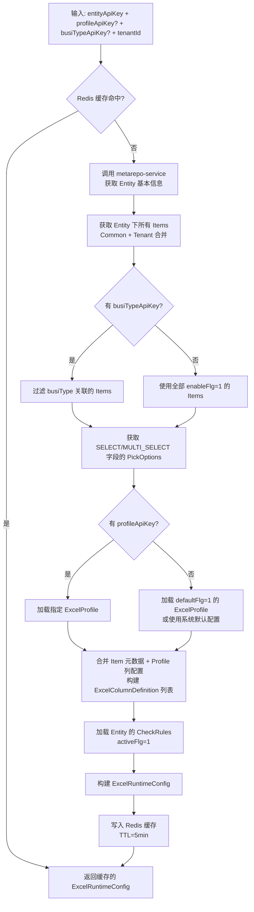
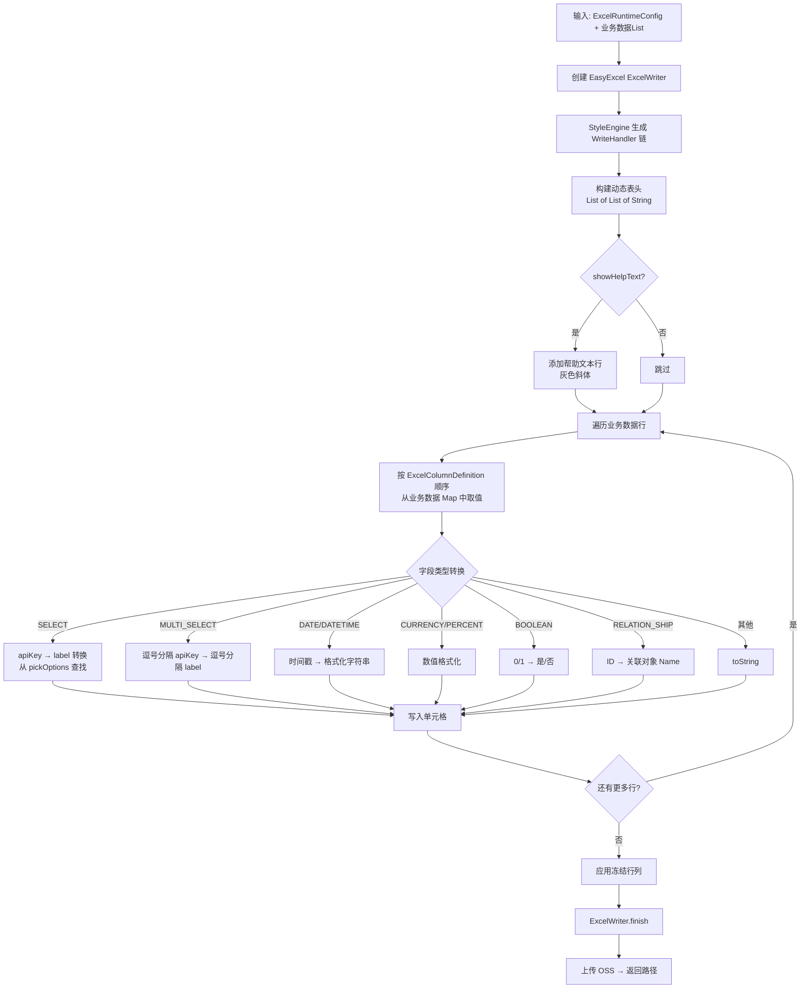
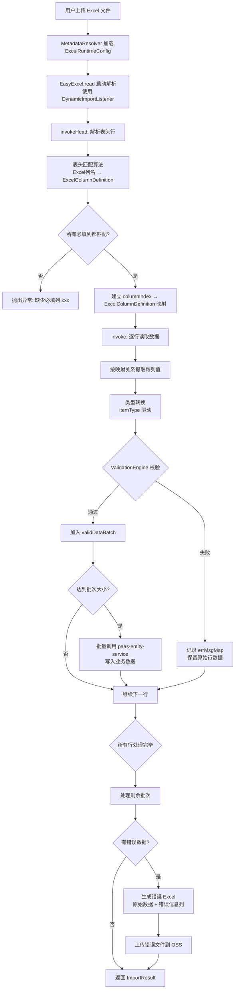
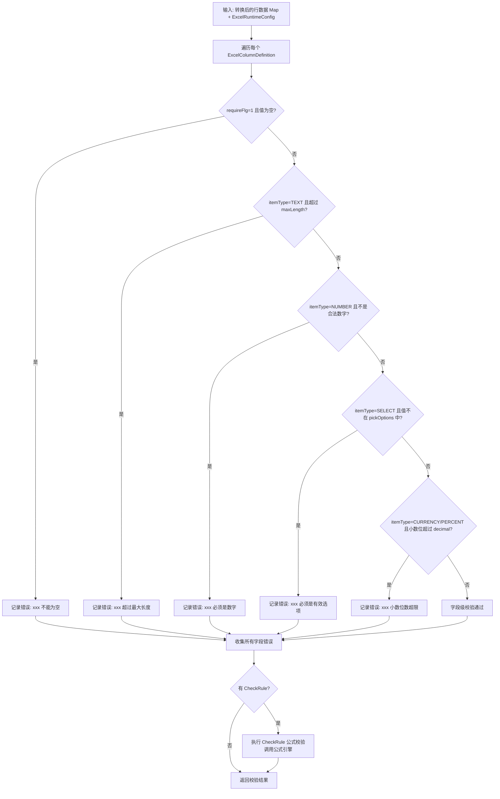
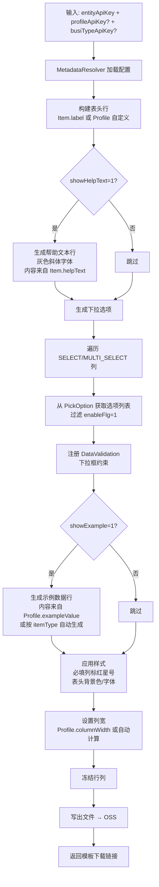
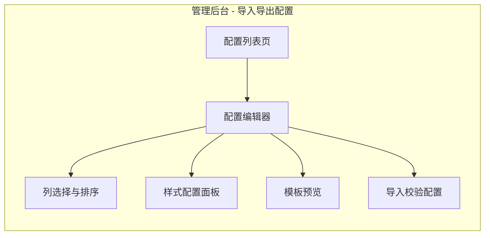
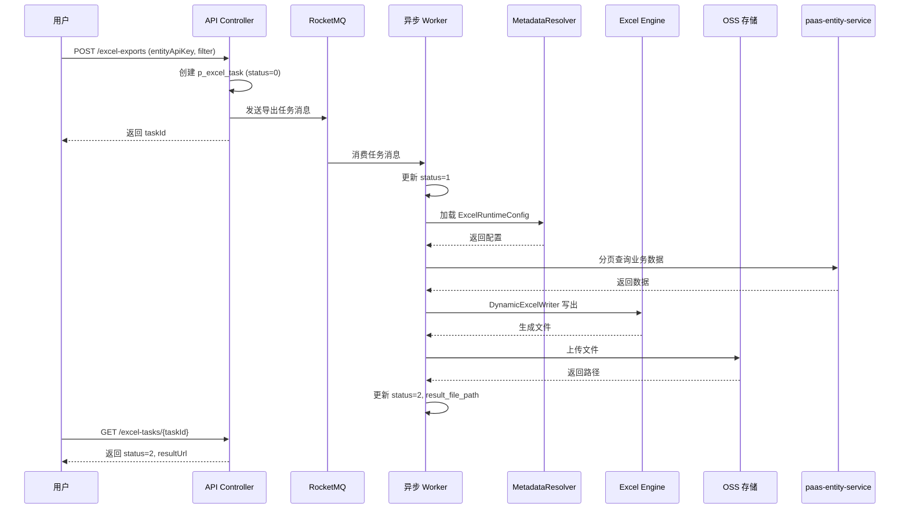

# 元数据驱动的导入导出框架 — 完整设计方案

## 1. 设计背景与目标

### 1.1 现状问题

老系统 `core-excel` 模块存在以下核心问题：

1. **硬编码绑定**：每个业务对象的导入导出都需要编写专用的 Java Class（带 `@ExcelProperty` 注解），新增/修改字段必须改代码、发版
2. **无法动态适配**：租户自定义字段（custom item）无法自动出现在导入导出模板中
3. **校验规则割裂**：Excel 校验注解（`@ExcelValid`/`@ExcelStrValid` 等）与元数据中的 `checkRule`、`requireFlg`、`maxLength` 等完全独立维护，存在不一致风险
4. **样式不可配置**：导出样式（列宽、字体、颜色、冻结行列等）硬编码在 `ExcelStyleUtils` 中，无法按租户/对象定制
5. **无模板管理**：没有"导入模板"的概念，用户需要先导出空数据才能获得模板
6. **选项值未联动**：SELECT/MULTI_SELECT 字段的下拉选项需要手动传入 `selectMap`，未与 `pickOption` 元数据自动关联

### 1.2 设计目标

构建一套**元数据驱动**的导入导出框架，实现：

| 目标 | 说明 |
|:---|:---|
| 零代码适配 | 新增 Entity/Item 后，导入导出自动适配，无需编写 Java Class |
| 校验规则统一 | 导入校验直接读取元数据的 requireFlg、maxLength、itemType、checkRule |
| 样式可配置 | 管理后台可视化配置导出样式（列宽、冻结、颜色、排序等），存储为元数据 |
| 模板自动生成 | 基于 Entity + Item 元数据自动生成导入模板（含表头、下拉选项、校验提示） |
| 多租户隔离 | 不同租户的自定义字段、样式配置、模板互相隔离 |
| 向后兼容 | 保留 EasyExcel 底层引擎，老业务可渐进迁移 |

## 2. 系统架构

### 2.1 整体架构图

```mermaid
graph TB
    subgraph 前端层
        ADMIN[管理后台<br/>React + Antd]
        BIZ_UI[业务前端<br/>导入导出触发]
    end

    subgraph API 网关层
        GW[paas-gateway]
    end

    subgraph 导入导出服务层
        EXPORT_CTL[ExportController<br/>导出 API]
        IMPORT_CTL[ImportController<br/>导入 API]
        TEMPLATE_CTL[TemplateController<br/>模板 API]
        STYLE_CTL[ExcelStyleController<br/>样式配置 API]
    end

    subgraph 核心引擎层
        META_RESOLVER[MetadataResolver<br/>元数据解析器]
        DYNAMIC_WRITER[DynamicExcelWriter<br/>动态导出引擎]
        DYNAMIC_READER[DynamicExcelReader<br/>动态导入引擎]
        TEMPLATE_GEN[TemplateGenerator<br/>模板生成器]
        STYLE_ENGINE[StyleEngine<br/>样式引擎]
        VALID_ENGINE[ValidationEngine<br/>校验引擎]
    end

    subgraph 元数据层
        META_SVC[paas-metarepo-service<br/>Entity/Item/PickOption/CheckRule]
        STYLE_REPO[ExcelProfile 存储<br/>导出样式配置元数据]
    end

    subgraph 基础设施层
        OSS[FileOperatorProvider<br/>OSS 文件存储]
        MQ[RocketMQ<br/>异步任务]
        CACHE[Redis<br/>元数据缓存]
        EASYEXCEL[alibaba/easyexcel]
    end

    ADMIN --> GW
    BIZ_UI --> GW
    GW --> EXPORT_CTL
    GW --> IMPORT_CTL
    GW --> TEMPLATE_CTL
    GW --> STYLE_CTL

    EXPORT_CTL --> META_RESOLVER
    IMPORT_CTL --> META_RESOLVER
    TEMPLATE_CTL --> META_RESOLVER
    STYLE_CTL --> STYLE_REPO

    META_RESOLVER --> META_SVC
    META_RESOLVER --> CACHE

    EXPORT_CTL --> DYNAMIC_WRITER
    IMPORT_CTL --> DYNAMIC_READER
    TEMPLATE_CTL --> TEMPLATE_GEN

    DYNAMIC_WRITER --> STYLE_ENGINE
    DYNAMIC_WRITER --> EASYEXCEL
    DYNAMIC_WRITER --> OSS

    DYNAMIC_READER --> VALID_ENGINE
    DYNAMIC_READER --> EASYEXCEL
    DYNAMIC_READER --> OSS

    TEMPLATE_GEN --> STYLE_ENGINE
    TEMPLATE_GEN --> EASYEXCEL
    TEMPLATE_GEN --> OSS

    VALID_ENGINE --> META_SVC

    IMPORT_CTL --> MQ
    EXPORT_CTL --> MQ
end
```


### 2.2 模块职责

| 模块 | 职责 | 部署位置 |
|:---|:---|:---|
| MetadataResolver | 从 metarepo 获取 Entity/Item/PickOption/CheckRule，构建运行时元数据模型 | paas-platform-service |
| DynamicExcelWriter | 基于元数据动态生成 Excel 表头、数据行、下拉选项、样式 | paas-platform-service |
| DynamicExcelReader | 基于元数据动态解析 Excel 行数据，执行类型转换和校验 | paas-platform-service |
| TemplateGenerator | 基于元数据生成导入模板（含表头、下拉、校验提示、示例数据） | paas-platform-service |
| StyleEngine | 读取 ExcelProfile 配置，生成 EasyExcel 的 WriteHandler 链 | paas-platform-service |
| ValidationEngine | 基于 Item 元数据（itemType/requireFlg/maxLength/decimal 等）+ CheckRule 执行导入校验 | paas-platform-service |
| ExcelProfile 存储 | 导出样式配置的 CRUD，作为新元模型存储在 Common/Tenant 层 | paas-metarepo-service |
| 管理后台前端 | 样式配置可视化编辑器、模板预览、导入导出任务管理 | paas-front-platform（front-admin） |

### 2.3 核心数据流

```
【导出】
业务请求(entityApiKey + 筛选条件 + profileApiKey)
  → MetadataResolver 加载 Entity + Items + PickOptions + ExcelProfile
  → DynamicExcelWriter 动态构建表头(Item.label) + 数据行(业务数据按 dbColumn 映射)
  → StyleEngine 应用样式配置(列宽/冻结/颜色)
  → EasyExcel 写出文件 → OSS 上传 → 返回下载链接

【导入】
用户上传 Excel 文件
  → MetadataResolver 加载 Entity + Items + PickOptions + CheckRules
  → DynamicExcelReader 解析表头(匹配 Item.label/apiKey)
  → 逐行读取 → 类型转换(itemType 驱动) → ValidationEngine 校验
  → 校验通过的数据批量写入 paas-entity-service
  → 校验失败的数据生成错误 Excel → OSS 上传 → 返回结果

【模板生成】
请求(entityApiKey + busiTypeApiKey? + profileApiKey?)
  → MetadataResolver 加载 Entity + Items + PickOptions
  → TemplateGenerator 生成表头 + 下拉选项 + 校验提示行 + 示例数据行
  → StyleEngine 应用样式 → OSS 上传 → 返回下载链接
```

## 3. 数据模型设计

### 3.1 新增元模型：excelProfile（导出配置）

> 作为新元模型注册到 p_meta_model，遵循 Common/Tenant 双层存储

```sql
-- p_meta_model 注册
INSERT INTO p_meta_model (api_key, label, label_key, namespace, metamodel_type,
  enable_common, enable_tenant, entity_dependency, db_table, description)
VALUES ('excelProfile', '导入导出配置', 'meta.model.excelProfile', 'system', 1,
  1, 1, 1, 'p_tenant_excel_profile', '定义 Entity 的 Excel 导入导出样式和字段配置');
```

#### excelProfile 字段定义

| api_key | db_column | label | 类型 | 说明 |
|:---|:---|:---|:---|:---|
| namespace | namespace | 命名空间 | String | system/product/custom |
| entityApiKey | entity_api_key | 所属对象 | String | 关联 Entity |
| apiKey | api_key | 配置apiKey | String | 同一 Entity 内唯一 |
| label | label | 配置名称 | String | 如"标准导出"、"简洁导出" |
| labelKey | label_key | 多语言Key | String | 国际化 |
| description | description | 描述 | String | — |
| customFlg | custom_flg | 自定义标记 | Integer(0/1) | 基类提供 |
| deleteFlg | delete_flg | 删除标记 | Integer(0/1) | 基类提供 |
| profileType | dbc_int1 | 配置类型 | Integer | 1=导出, 2=导入, 3=导入导出通用 |
| defaultFlg | dbc_smallint1 | 默认配置 | Integer(0/1) | 每种 profileType 最多一个默认 |
| enableFlg | dbc_smallint2 | 启用标记 | Integer(0/1) | — |
| busiTypeApiKey | dbc_varchar1 | 业务类型 | String | 可选，按业务类型区分配置 |
| fileFormat | dbc_int2 | 文件格式 | Integer | 1=XLSX, 2=XLS, 3=CSV |
| sheetName | dbc_varchar2 | Sheet名称 | String | 默认取 Entity.label |
| freezeRow | dbc_int3 | 冻结行数 | Integer | 默认 1（冻结表头） |
| freezeCol | dbc_int4 | 冻结列数 | Integer | 默认 0 |
| maxExportRows | dbc_int5 | 最大导出行数 | Integer | 默认 50000 |
| maxImportRows | dbc_int6 | 最大导入行数 | Integer | 默认 10000 |
| headerBgColor | dbc_varchar3 | 表头背景色 | String | RGB 如 "91,155,213" |
| headerFontColor | dbc_varchar4 | 表头字体色 | String | RGB 如 "255,255,255" |
| headerFontSize | dbc_int7 | 表头字号 | Integer | 默认 11 |
| headerBoldFlg | dbc_smallint3 | 表头加粗 | Integer(0/1) | 默认 1 |
| dataFontSize | dbc_int8 | 数据字号 | Integer | 默认 11 |
| rowHeight | dbc_int9 | 行高 | Integer | 默认 20 |
| headerRowHeight | dbc_int10 | 表头行高 | Integer | 默认 25 |
| showHelpTextFlg | dbc_smallint4 | 显示帮助行 | Integer(0/1) | 模板中表头下方显示 helpText |
| showExampleFlg | dbc_smallint5 | 显示示例行 | Integer(0/1) | 模板中显示示例数据 |
| columnConfig | dbc_textarea1 | 列配置JSON | String | 详见 3.2 |
| globalStyle | dbc_textarea2 | 全局样式JSON | String | 扩展样式配置 |

#### dbc 列使用汇总

| 列类型 | 使用编号 | 总数 |
|:---|:---|:---|
| dbc_varchar | 1~4 | 4 |
| dbc_int | 1~10 | 10 |
| dbc_smallint | 1~5 | 5 |
| dbc_textarea | 1~2 | 2 |
| 合计 | | 21 |


### 3.2 columnConfig JSON 结构

`columnConfig` 存储每个字段在 Excel 中的展示配置，是一个 JSON 数组：

```json
{
  "columns": [
    {
      "itemApiKey": "name",
      "columnOrder": 0,
      "columnWidth": 20,
      "visibleFlg": 1,
      "headerLabel": null,
      "headerLabelKey": null,
      "dateFormat": "yyyy-MM-dd",
      "numberFormat": "#,##0.00",
      "horizontalAlignment": "LEFT",
      "wrapTextFlg": 0,
      "selectSourceType": "PICK_OPTION",
      "importMappingFlg": 1,
      "importRequireFlg": null,
      "helpText": null,
      "exampleValue": "张三"
    },
    {
      "itemApiKey": "industry",
      "columnOrder": 1,
      "columnWidth": 15,
      "visibleFlg": 1,
      "headerLabel": "所属行业",
      "selectSourceType": "PICK_OPTION",
      "importMappingFlg": 1
    }
  ],
  "version": 1
}
```

#### 字段说明

| 字段 | 类型 | 说明 |
|:---|:---|:---|
| itemApiKey | String | 关联 Item.apiKey，唯一标识列 |
| columnOrder | Integer | 列排序序号，从 0 开始 |
| columnWidth | Integer | 列宽（字符数），null 则自动计算 |
| visibleFlg | Integer(0/1) | 是否在导出中显示，0=隐藏 |
| headerLabel | String | 自定义表头文字，null 则取 Item.label |
| headerLabelKey | String | 自定义表头多语言 Key |
| dateFormat | String | 日期格式，仅 DATE/DATETIME 类型有效 |
| numberFormat | String | 数字格式，仅 NUMBER/CURRENCY/PERCENT 类型有效 |
| horizontalAlignment | String | 水平对齐：LEFT/CENTER/RIGHT |
| wrapTextFlg | Integer(0/1) | 是否自动换行 |
| selectSourceType | String | 下拉数据源：PICK_OPTION（从元数据）/ CUSTOM（自定义列表） |
| customSelectValues | String[] | 自定义下拉值列表，仅 selectSourceType=CUSTOM 时有效 |
| importMappingFlg | Integer(0/1) | 导入时是否参与字段映射 |
| importRequireFlg | Integer(0/1) | 导入时是否必填，null 则取 Item.requireFlg |
| helpText | String | 自定义帮助文本，null 则取 Item.helpText |
| exampleValue | String | 模板中的示例值 |

### 3.3 运行时元数据模型（Java）

```java
/**
 * 运行时解析后的 Excel 列定义，融合 Item 元数据 + ExcelProfile 配置
 */
public class ExcelColumnDefinition {
    private String itemApiKey;        // 字段 apiKey
    private String dbColumn;          // 数据库列名（dbc_xxxN）
    private String headerLabel;       // 最终表头文字
    private int itemType;             // 字段类型（ItemTypeEnum）
    private int columnOrder;          // 列序号
    private int columnWidth;          // 列宽
    private boolean required;         // 是否必填
    private Integer maxLength;        // 最大长度
    private Integer minLength;        // 最小长度
    private Integer decimal;          // 小数位数
    private String dateFormat;        // 日期格式
    private String numberFormat;      // 数字格式
    private String horizontalAlignment; // 对齐方式
    private boolean wrapText;         // 自动换行
    private boolean visible;          // 是否可见
    private boolean importMapping;    // 导入映射
    private String helpText;          // 帮助文本
    private String exampleValue;      // 示例值
    private List<PickOptionValue> pickOptions; // 下拉选项
    private String referEntityApiKey; // 关联对象（RELATION_SHIP 类型）
}

public class PickOptionValue {
    private String apiKey;    // 选项 apiKey（存储值）
    private String label;     // 选项显示文字
    private int optionOrder;  // 排序
}

/**
 * 完整的 Excel 运行时配置，由 MetadataResolver 构建
 */
public class ExcelRuntimeConfig {
    private String entityApiKey;
    private String entityLabel;
    private String profileApiKey;
    private String sheetName;
    private int fileFormat;           // XLSX/XLS/CSV
    private int freezeRow;
    private int freezeCol;
    private int maxExportRows;
    private int maxImportRows;
    private ExcelStyleConfig headerStyle;  // 表头样式
    private ExcelStyleConfig dataStyle;    // 数据样式
    private boolean showHelpText;
    private boolean showExample;
    private List<ExcelColumnDefinition> columns; // 有序列定义
    private List<CheckRuleDefinition> checkRules; // 校验规则
}
```

## 4. 核心流程详细设计

### 4.1 MetadataResolver — 元数据解析器



**关键设计决策**：

1. **Item 过滤规则**：
   - `enableFlg=0` 的字段不出现在导出中
   - `hiddenFlg=1` 的字段默认不出现，但 Profile 中可显式配置 `visibleFlg=1` 覆盖
   - `itemType` 为 FORMULA(6)/ROLLUP(7)/COMPUTED(27) 的字段仅导出不导入
   - `itemType` 为 AUTONUMBER(20) 的字段仅导出不导入
   - `itemType` 为 IMAGE(19)/AUDIO(22) 的字段不参与导入导出

2. **列排序优先级**：Profile.columnConfig.columnOrder > Item.itemOrder > Item 创建顺序

3. **缓存策略**：按 `tenantId:entityApiKey:profileApiKey` 作为缓存 Key，元数据变更时通过 MQ 广播失效

### 4.2 DynamicExcelWriter — 动态导出引擎



**核心实现要点**：

```java
/**
 * 动态导出引擎 — 不依赖 Java Class 注解，完全由元数据驱动
 */
public class DynamicExcelWriter {

    /**
     * 动态构建表头
     * 老系统：Class 上的 @ExcelProperty 注解
     * 新系统：ExcelColumnDefinition.headerLabel
     */
    public List<List<String>> buildDynamicHead(ExcelRuntimeConfig config) {
        return config.getColumns().stream()
            .filter(ExcelColumnDefinition::isVisible)
            .sorted(Comparator.comparingInt(ExcelColumnDefinition::getColumnOrder))
            .map(col -> Collections.singletonList(col.getHeaderLabel()))
            .collect(Collectors.toList());
    }

    /**
     * 业务数据行转换
     * 老系统：EasyExcel 通过反射读取 Java Bean 字段
     * 新系统：从 Map<String, Object> 按 dbColumn/itemApiKey 取值 + 类型转换
     */
    public List<Object> convertDataRow(Map<String, Object> bizData,
                                        List<ExcelColumnDefinition> columns) {
        return columns.stream()
            .filter(ExcelColumnDefinition::isVisible)
            .map(col -> convertCellValue(bizData.get(col.getItemApiKey()), col))
            .collect(Collectors.toList());
    }
}
```


### 4.3 DynamicExcelReader — 动态导入引擎



**表头匹配算法**：

```java
/**
 * 智能表头匹配：支持多种匹配策略
 * 优先级：精确匹配 label > 精确匹配 apiKey > 模糊匹配 label
 */
public class HeaderMatcher {

    public Map<Integer, ExcelColumnDefinition> matchHeaders(
            Map<Integer, String> excelHeaders,
            List<ExcelColumnDefinition> columns) {

        Map<Integer, ExcelColumnDefinition> result = new LinkedHashMap<>();
        Set<String> matchedApiKeys = new HashSet<>();

        // 第一轮：精确匹配 label（忽略前后空格）
        for (Map.Entry<Integer, String> entry : excelHeaders.entrySet()) {
            String headerText = entry.getValue().trim();
            for (ExcelColumnDefinition col : columns) {
                if (!matchedApiKeys.contains(col.getItemApiKey())
                    && col.getHeaderLabel().trim().equals(headerText)) {
                    result.put(entry.getKey(), col);
                    matchedApiKeys.add(col.getItemApiKey());
                    break;
                }
            }
        }

        // 第二轮：精确匹配 apiKey（支持开发者直接用 apiKey 作表头）
        for (Map.Entry<Integer, String> entry : excelHeaders.entrySet()) {
            if (result.containsKey(entry.getKey())) continue;
            String headerText = entry.getValue().trim();
            for (ExcelColumnDefinition col : columns) {
                if (!matchedApiKeys.contains(col.getItemApiKey())
                    && col.getItemApiKey().equals(headerText)) {
                    result.put(entry.getKey(), col);
                    matchedApiKeys.add(col.getItemApiKey());
                    break;
                }
            }
        }

        // 校验必填列是否全部匹配
        List<String> missingRequired = columns.stream()
            .filter(c -> c.isRequired() && c.isImportMapping()
                         && !matchedApiKeys.contains(c.getItemApiKey()))
            .map(ExcelColumnDefinition::getHeaderLabel)
            .collect(Collectors.toList());

        if (!missingRequired.isEmpty()) {
            throw new ImportValidationException(
                "缺少必填列: " + String.join(", ", missingRequired));
        }

        return result;
    }
}
```

**类型转换引擎**：

```java
/**
 * 基于 itemType 的动态类型转换
 * 替代老系统的 6 个硬编码 Converter 类
 */
public class DynamicTypeConverter {

    public Object convert(String cellValue, ExcelColumnDefinition column) {
        if (cellValue == null || cellValue.trim().isEmpty()) {
            return null;
        }
        String value = cellValue.trim();

        switch (column.getItemType()) {
            case ItemTypeEnum.TEXT:
            case ItemTypeEnum.EMAIL:
            case ItemTypeEnum.PHONE:
            case ItemTypeEnum.URL:
                return value;

            case ItemTypeEnum.NUMBER:
                return parseLong(value, column);

            case ItemTypeEnum.CURRENCY:
            case ItemTypeEnum.PERCENT:
                return parseDecimal(value, column);

            case ItemTypeEnum.DATE:
            case ItemTypeEnum.DATETIME:
                return parseDate(value, column);

            case ItemTypeEnum.BOOLEAN:
                return parseBoolean(value);

            case ItemTypeEnum.SELECT:
                return resolvePickOption(value, column.getPickOptions());

            case ItemTypeEnum.MULTI_SELECT:
                return resolveMultiPickOption(value, column.getPickOptions());

            case ItemTypeEnum.RELATION_SHIP:
            case ItemTypeEnum.MASTER_DETAIL:
                return resolveRelation(value, column);

            case ItemTypeEnum.TEXTAREA:
                return value;

            default:
                return value;
        }
    }

    /**
     * SELECT 类型：用户输入 label → 转换为 apiKey 存储
     * 老系统需要手动写 Converter，新系统自动从 pickOptions 查找
     */
    private String resolvePickOption(String label, List<PickOptionValue> options) {
        return options.stream()
            .filter(o -> o.getLabel().equals(label))
            .findFirst()
            .map(PickOptionValue::getApiKey)
            .orElse(null); // null 会在校验阶段报错
    }
}
```

### 4.4 ValidationEngine — 校验引擎



**校验规则映射（老系统注解 → 新系统元数据）**：

| 老系统注解 | 新系统元数据来源 | 说明 |
|:---|:---|:---|
| `@ExcelValid` | `Item.requireFlg=1` | 必填校验 |
| `@ExcelStrValid(length=N)` | `Item.maxLength=N` | 字符串长度校验 |
| `@ExcelIntValid(min,max)` | `Item.itemType=NUMBER` + 业务规则 | 整数范围校验 |
| `@ExcelDecimalValid(min,max)` | `Item.itemType=CURRENCY/PERCENT` + `Item.decimal` | 小数校验 |
| `@ExcelStrSelectValid(values)` | `PickOption` 列表 | 枚举值校验 |
| `@ExcelStrMatchValid(pattern)` | `Item.typeProperty` 中的 pattern 配置 | 正则校验 |
| 无 | `CheckRule.checkFormula` | 跨字段公式校验（新增能力） |

### 4.5 TemplateGenerator — 模板生成器



**模板特色功能**：

1. **必填标记**：必填字段表头自动添加红色星号 `*客户名称`
2. **帮助文本行**：表头下方灰色斜体行，显示每列的填写说明
3. **下拉选项**：SELECT/MULTI_SELECT 字段自动生成 Excel 下拉框
4. **示例数据**：可选的示例数据行，帮助用户理解格式
5. **数据校验提示**：通过 Excel 的 DataValidation 设置输入提示（如"请输入不超过 200 字的文本"）


## 5. 管理后台前端设计

### 5.1 功能模块



### 5.2 页面设计

#### 5.2.1 配置列表页

路由：`/admin/entity/:entityApiKey/excel-profiles`

| 区域 | 内容 |
|:---|:---|
| 顶部 | Entity 名称 + 面包屑导航 |
| 操作栏 | 新建配置、批量删除 |
| 列表 | 配置名称、类型（导入/导出/通用）、业务类型、默认标记、启用状态、操作（编辑/复制/删除/预览） |

#### 5.2.2 配置编辑器（核心页面）

路由：`/admin/entity/:entityApiKey/excel-profiles/:profileApiKey/edit`

采用左右分栏布局：

```
┌─────────────────────────────────────────────────────────┐
│ 基础信息                                                  │
│ ┌──────────┬──────────┬──────────┬──────────┐           │
│ │ 配置名称  │ 配置类型  │ 业务类型  │ 文件格式  │           │
│ └──────────┴──────────┴──────────┴──────────┘           │
├────────────────────────┬────────────────────────────────┤
│ 左侧：列选择与排序      │ 右侧：选中列的属性配置           │
│                        │                                │
│ ☑ *客户名称    ≡ ↑↓    │ 字段信息                        │
│ ☑  所属行业    ≡ ↑↓    │ ├ apiKey: industry             │
│ ☑  联系电话    ≡ ↑↓    │ ├ 类型: SELECT                 │
│ ☐  创建时间    ≡ ↑↓    │ ├ 必填: 否                     │
│ ☐  修改时间    ≡ ↑↓    │                                │
│ ☑  客户等级    ≡ ↑↓    │ 导出配置                        │
│                        │ ├ 自定义表头: [所属行业]         │
│ [全选] [反选]           │ ├ 列宽: [15]                   │
│                        │ ├ 对齐: [居左 ▼]               │
│                        │ ├ 日期格式: —                   │
│                        │ ├ 数字格式: —                   │
│                        │ ├ 自动换行: [否]                │
│                        │                                │
│                        │ 导入配置                        │
│                        │ ├ 参与导入映射: [是]             │
│                        │ ├ 导入必填: [跟随元数据]         │
│                        │ ├ 帮助文本: [请选择行业分类]     │
│                        │ ├ 示例值: [互联网]              │
│                        │                                │
├────────────────────────┴────────────────────────────────┤
│ 全局样式配置                                              │
│ ┌──────────┬──────────┬──────────┬──────────┐           │
│ │ 表头背景色 │ 表头字体色 │ 表头字号  │ 表头加粗  │           │
│ │ [#5B9BD5] │ [#FFFFFF] │ [11]     │ [✓]     │           │
│ ├──────────┼──────────┼──────────┼──────────┤           │
│ │ 数据字号  │ 行高     │ 表头行高  │ 冻结行数  │           │
│ │ [11]     │ [20]     │ [25]     │ [1]      │           │
│ ├──────────┼──────────┼──────────┼──────────┤           │
│ │ 冻结列数  │ 最大导出行 │ 最大导入行 │ Sheet名  │           │
│ │ [0]      │ [50000]  │ [10000]  │ [客户]   │           │
│ └──────────┴──────────┴──────────┴──────────┘           │
│                                                         │
│ 模板配置                                                  │
│ ┌──────────┬──────────┐                                 │
│ │ 显示帮助行 │ 显示示例行 │                                 │
│ │ [✓]      │ [✓]      │                                 │
│ └──────────┴──────────┘                                 │
│                                                         │
│ [保存] [预览导出] [预览模板] [取消]                         │
└─────────────────────────────────────────────────────────┘
```

#### 5.2.3 模板预览

点击"预览模板"按钮后，弹出模态框展示模板效果：

```
┌─────────────────────────────────────────────────────┐
│ 模板预览 — 客户导入模板                                │
│                                                     │
│ ┌────────┬────────┬────────┬────────┬────────┐     │
│ │*客户名称│ 所属行业│ 联系电话│ 客户等级│ 客户来源│     │
│ ├────────┼────────┼────────┼────────┼────────┤     │
│ │必填，最大│请从下拉 │请输入手 │请从下拉 │请从下拉 │     │
│ │200字    │框选择   │机号码   │框选择   │框选择   │     │
│ ├────────┼────────┼────────┼────────┼────────┤     │
│ │张三公司 │互联网   │138xxxx │A级     │官网     │     │
│ ├────────┼────────┼────────┼────────┼────────┤     │
│ │        │  ▼     │        │  ▼     │  ▼     │     │
│ └────────┴────────┴────────┴────────┴────────┘     │
│                                                     │
│ [下载模板] [关闭]                                     │
└─────────────────────────────────────────────────────┘
```

### 5.3 前端技术实现要点

| 功能 | 技术方案 |
|:---|:---|
| 列拖拽排序 | `@dnd-kit/sortable` 或 Antd `Transfer` + 自定义排序 |
| 颜色选择器 | Antd `ColorPicker` 组件 |
| 模板预览 | 后端生成 Excel → 前端用 `SheetJS` 渲染预览，或直接用 HTML Table 模拟 |
| 列配置编辑 | 右侧 `Form` 组件，选中列时动态切换表单内容 |
| 实时预览 | 编辑样式时，底部 HTML Table 实时反映样式变化（纯前端渲染） |

### 5.4 前端 API 设计

```typescript
// ==================== 配置 CRUD ====================
GET    /api/v1/excel-profiles?entityApiKey={entityApiKey}
POST   /api/v1/excel-profiles
PUT    /api/v1/excel-profiles/{profileApiKey}
DELETE /api/v1/excel-profiles/{profileApiKey}

// 获取 Entity 的可用字段列表（供配置编辑器使用）
GET    /api/v1/excel-profiles/available-columns?entityApiKey={entityApiKey}&busiTypeApiKey={busiTypeApiKey}

// ==================== 实时场景（同步，≤ 1000 条） ====================
// 实时导出 — 直接返回文件流
POST   /api/v1/excel-realtime/export
  Body: { entityApiKey, profileApiKey?, busiTypeApiKey?, filter, sort, selectedIds }
  Response: 文件流（Content-Disposition: attachment）

// 实时导入 — 直接返回 JSON 结果
POST   /api/v1/excel-realtime/import (multipart)
  Body: { file, entityApiKey, profileApiKey?, busiTypeApiKey?, importMode }
  Response: { totalRows, successRows, errorRows, errorFileToken, errors[] }

// 实时导入错误文件下载（临时，5 分钟过期）
GET    /api/v1/excel-realtime/error-file/{token}

// ==================== 批量场景（始终异步，走任务列表） ====================
// 批量导出
POST   /api/v1/excel-batch/export
  Body: { entityApiKey, profileApiKey?, busiTypeApiKey?, filter, sort, selectedIds }
  Response: { taskId, taskNo, estimatedRows, message }

// 批量导入
POST   /api/v1/excel-batch/import (multipart)
  Body: { file, entityApiKey, profileApiKey?, busiTypeApiKey?, importMode, upsertKey? }
  Response: { taskId, taskNo, estimatedRows, sourceFileName, message }

// ==================== 模板生成（始终同步） ====================
POST   /api/v1/excel-templates/generate
  Body: { entityApiKey, profileApiKey?, busiTypeApiKey? }
  Response: { templateUrl }

// ==================== 任务中心（仅批量任务） ====================
GET    /api/v1/excel-tasks/my?page=&pageSize=&taskType=&status=&entityApiKey=
GET    /api/v1/excel-tasks/{taskId}
GET    /api/v1/excel-tasks/{taskId}/progress
GET    /api/v1/excel-tasks/{taskId}/download
GET    /api/v1/excel-tasks/{taskId}/error-file
POST   /api/v1/excel-tasks/{taskId}/cancel
POST   /api/v1/excel-tasks/{taskId}/retry
DELETE /api/v1/excel-tasks/{taskId}
```

## 6. 异步任务设计

### 6.1 任务模型

大数据量的导入导出采用异步任务模式：

```sql
CREATE TABLE p_excel_task (
    id              BIGINT PRIMARY KEY,
    tenant_id       BIGINT NOT NULL,
    task_type       SMALLINT NOT NULL,        -- 1=导出, 2=导入, 3=模板生成
    entity_api_key  VARCHAR(128) NOT NULL,
    profile_api_key VARCHAR(128),
    status          SMALLINT NOT NULL DEFAULT 0, -- 0=待处理, 1=处理中, 2=成功, 3=失败, 4=部分成功
    total_rows      INT DEFAULT 0,
    success_rows    INT DEFAULT 0,
    error_rows      INT DEFAULT 0,
    progress        SMALLINT DEFAULT 0,       -- 0~100
    result_file_path VARCHAR(512),            -- 导出/模板文件 OSS 路径
    error_file_path  VARCHAR(512),            -- 错误文件 OSS 路径
    source_file_path VARCHAR(512),            -- 导入源文件 OSS 路径
    error_message   TEXT,
    filter_json     TEXT,                     -- 导出筛选条件
    created_by      BIGINT,
    created_at      BIGINT,
    updated_at      BIGINT,
    delete_flg      SMALLINT DEFAULT 0
);
```

### 6.2 异步流程



### 6.3 场景分离策略

| 场景 | 执行模式 | 说明 |
|:---|:---|:---|
| 实时导出（列表页/详情页快捷操作） | 始终同步 | ≤ 1000 条硬限制，直接返回文件流，不写任务表 |
| 实时导入（快捷导入弹窗） | 始终同步 | ≤ 1000 条硬限制，直接返回 JSON 结果，不写任务表 |
| 批量导出（专门的批量导出入口） | 始终异步 | 无论数据量大小，都走 MQ + 任务列表 |
| 批量导入（专门的批量导入入口） | 始终异步 | 无论数据量大小，都走 MQ + 任务列表 |
| 模板生成 | 始终同步 | 模板数据量小，直接返回 |

> 详细设计见 [任务中心与同步异步详细设计](./任务中心与同步异步详细设计.md) 第 3 章

## 7. 与老系统的对比和迁移

### 7.1 架构对比

| 维度 | 老系统 (core-excel) | 新系统 (metadata-excel) |
|:---|:---|:---|
| 驱动方式 | Java Class 注解驱动 | 元数据驱动（零代码） |
| 字段定义 | `@ExcelProperty` 硬编码 | Entity + Item 元数据动态获取 |
| 校验规则 | 6 种自定义注解 | Item 属性 + CheckRule 公式 |
| 类型转换 | 6 个 Converter 类 | DynamicTypeConverter 统一处理 |
| 下拉选项 | 手动传入 selectMap | 自动从 PickOption 获取 |
| 样式配置 | ExcelStyleUtils 硬编码 | ExcelProfile 元数据可配置 |
| 模板生成 | 无 | TemplateGenerator 自动生成 |
| 多租户 | 无隔离 | Common/Tenant 双层配置 |
| 异步处理 | 无 | MQ + 任务表 |
| 错误处理 | 生成错误 Excel | 保留 + 增强（行号/列名/错误类型） |

### 7.2 迁移策略

采用**渐进式迁移**，新老并行：

```
Phase 1（基础能力）：
  - 实现 MetadataResolver + DynamicExcelWriter + DynamicExcelReader
  - 实现 ValidationEngine（覆盖老系统 6 种校验）
  - 新 Entity 默认使用新框架

Phase 2（配置能力）：
  - 实现 ExcelProfile 元模型 + CRUD API
  - 实现管理后台配置编辑器
  - 实现 TemplateGenerator

Phase 3（异步 + 增强）：
  - 实现异步任务框架
  - 实现大数据量分页导出
  - 实现 CheckRule 公式校验集成

Phase 4（全量迁移）：
  - 老业务逐步切换到新框架
  - 老 core-excel 降级为兼容层
```

### 7.3 向后兼容

新框架保留对老模式的兼容：

```java
/**
 * 兼容适配器：允许老业务继续使用 Java Class 注解模式
 * 内部将 @ExcelProperty 注解转换为 ExcelColumnDefinition
 */
public class LegacyClassAdapter {

    public ExcelRuntimeConfig fromAnnotatedClass(Class<?> clazz) {
        // 读取 @ExcelProperty 注解 → 构建 ExcelColumnDefinition
        // 读取 @ExcelValid 等校验注解 → 构建校验规则
        // 返回 ExcelRuntimeConfig
    }
}
```

## 8. 关键数据结构汇总

### 8.1 导出请求

```java
@Data
public class ExcelExportRequest {
    private String entityApiKey;       // 必填
    private String profileApiKey;      // 可选，不传用默认
    private String busiTypeApiKey;     // 可选
    private Map<String, Object> filter; // 筛选条件
    private List<SortField> sort;      // 排序
    private List<String> selectedIds;  // 勾选导出的记录 ID
    private boolean asyncFlg;          // 强制异步
}
```

### 8.2 导入请求

```java
@Data
public class ExcelImportRequest {
    private String entityApiKey;       // 必填
    private String profileApiKey;      // 可选
    private String busiTypeApiKey;     // 可选
    private String sourceFilePath;     // OSS 文件路径
    private ImportMode importMode;     // INSERT / UPSERT / UPDATE
    private String upsertKeyItemApiKey; // UPSERT 模式的匹配字段
}

public enum ImportMode {
    INSERT,   // 仅新增
    UPSERT,   // 存在则更新，不存在则新增（按 upsertKey 匹配）
    UPDATE    // 仅更新（必须包含 ID 列）
}
```

### 8.3 导入结果

```java
@Data
public class ExcelImportResult {
    private String taskId;
    private int totalRows;
    private int successRows;
    private int errorRows;
    private String errorFilePath;      // 错误文件 OSS 路径
    private List<ImportError> errors;  // 前 N 条错误摘要
}

@Data
public class ImportError {
    private int rowIndex;
    private String columnName;
    private String errorMessage;
    private String cellValue;
}
```

## 9. 安全与权限

| 维度 | 设计 |
|:---|:---|
| 数据权限 | 导出时调用 paas-privilege-service 过滤数据，用户只能导出有权限的记录 |
| 字段权限 | 根据用户角色的字段可见性过滤导出列，无权限的字段不出现在 Excel 中 |
| 导入权限 | 校验用户对目标 Entity 的创建/更新权限 |
| 文件安全 | OSS 文件路径包含 tenantId 隔离，下载链接带签名且有过期时间 |
| 配置权限 | ExcelProfile 的创建/编辑仅限管理员角色 |
| 审计日志 | 导入导出操作记录到 p_excel_task，含操作人、时间、数据量 |

## 10. 性能设计

| 场景 | 策略 |
|:---|:---|
| 元数据加载 | Redis 缓存 ExcelRuntimeConfig，TTL=5min，元数据变更时 MQ 广播失效 |
| 大数据量导出 | 分页查询（每页 5000 行）+ EasyExcel 流式写入，内存恒定 |
| 大数据量导入 | 500 行一批 handleBatch，批量调用 entity-service 写入 |
| 下拉选项 | PickOption 数量 > 1000 时降级为文本输入（Excel 下拉框性能限制） |
| 并发控制 | 同一租户同一 Entity 同时最多 3 个导入/导出任务 |
| 文件大小 | 导出文件超过 50MB 自动切分为多个文件（ZIP 打包） |

## 11. 目录结构设计（新项目）

```
paas-platform-service/
└── paas-platform-service-core/
    └── src/main/java/com/xiaoshouyi/paas/platform/
        └── excel/                              # 🔑 导入导出模块
            ├── config/
            │   └── ExcelAutoConfiguration.java # Spring 自动配置
            ├── controller/
            │   ├── ExcelExportController.java  # 导出 API
            │   ├── ExcelImportController.java  # 导入 API
            │   ├── ExcelTemplateController.java # 模板 API
            │   └── ExcelProfileController.java # 配置管理 API
            ├── model/
            │   ├── ExcelColumnDefinition.java  # 运行时列定义
            │   ├── ExcelRuntimeConfig.java     # 运行时完整配置
            │   ├── ExcelExportRequest.java     # 导出请求
            │   ├── ExcelImportRequest.java     # 导入请求
            │   ├── ExcelImportResult.java      # 导入结果
            │   ├── ExcelTaskEntity.java        # 任务表实体
            │   └── PickOptionValue.java        # 选项值
            ├── engine/
            │   ├── MetadataResolver.java       # 🔑 元数据解析器
            │   ├── DynamicExcelWriter.java     # 🔑 动态导出引擎
            │   ├── DynamicExcelReader.java     # 🔑 动态导入引擎
            │   ├── DynamicImportListener.java  # 导入行监听器
            │   ├── DynamicTypeConverter.java   # 类型转换引擎
            │   ├── ValidationEngine.java       # 🔑 校验引擎
            │   ├── TemplateGenerator.java      # 模板生成器
            │   └── HeaderMatcher.java          # 表头匹配器
            ├── style/
            │   ├── StyleEngine.java            # 样式引擎
            │   ├── DynamicStyleWriteHandler.java
            │   ├── FreezeWriteHandler.java
            │   └── SelectOptionWriteHandler.java
            ├── task/
            │   ├── ExcelTaskService.java       # 任务管理
            │   ├── ExcelExportWorker.java      # 导出异步 Worker
            │   └── ExcelImportWorker.java      # 导入异步 Worker
            ├── legacy/
            │   └── LegacyClassAdapter.java     # 老系统兼容适配器
            └── mapper/
                └── ExcelTaskMapper.java        # 任务表 Mapper
```

前端目录（paas-front-platform / apps/front-admin）：

```
src/
└── pages/
    └── excel-profile/
        ├── index.tsx                    # 配置列表页
        ├── ProfileEditor.tsx            # 🔑 配置编辑器主页面
        ├── components/
        │   ├── ColumnSelector.tsx       # 左侧列选择与排序
        │   ├── ColumnPropertyPanel.tsx  # 右侧列属性配置
        │   ├── GlobalStylePanel.tsx     # 全局样式配置
        │   ├── TemplatePreview.tsx      # 模板预览
        │   └── ColorPickerField.tsx     # 颜色选择器
        ├── hooks/
        │   ├── useExcelProfile.ts       # 配置 CRUD Hook
        │   └── useAvailableColumns.ts   # 可用字段加载 Hook
        └── types.ts                     # TypeScript 类型定义
```

## 12. 实施计划

| 阶段 | 周期 | 交付物 |
|:---|:---|:---|
| Phase 1: 核心引擎 | 2 周 | MetadataResolver + DynamicExcelWriter + DynamicExcelReader + ValidationEngine + DynamicTypeConverter |
| Phase 2: 模板 + 配置 | 2 周 | ExcelProfile 元模型 + TemplateGenerator + 配置 CRUD API |
| Phase 3: 管理后台 | 2 周 | 配置列表页 + 配置编辑器 + 模板预览 |
| Phase 4: 异步任务 | 1 周 | 任务表 + MQ Worker + 进度查询 |
| Phase 5: 权限 + 优化 | 1 周 | 数据权限/字段权限集成 + 性能优化 + 大数据量测试 |
| Phase 6: 迁移 | 持续 | 老业务逐步切换 + LegacyClassAdapter |


---

## 附录：增强设计文档

第 6 章（异步任务设计）已由独立文档完整替代和增强，详见：

→ **[任务中心与同步异步详细设计](./任务中心与同步异步详细设计.md)**

增强内容包括：
- 场景分离设计：实时场景（同步，≤1000 条）vs 批量场景（始终异步，走 MQ + 任务列表）
- 实时场景 API 与实现（RealtimeExcelController，直接返回文件流/JSON）
- 批量场景 API 与实现（BatchExcelController，始终创建任务 + 发 MQ）
- MQ 异步消费 Worker 完整实现（导出分页 + 导入逐行 + 进度追踪 + 失败重试）
- 前端任务中心页面设计（列表 + 详情抽屉 + 实时进度 + 全局通知）
- 并发控制与限流（租户级 5 并发 / 用户级 3 并发）
- 文件生命周期管理（7 天过期 + 定时清理）


→ **[文件存储层设计 — 支持 AWS S3](./文件存储层设计-支持AWS-S3.md)**

增强内容包括：
- 老系统 core-file 6 个已知问题的修复方案
- AWS S3 完整实现设计（AwsS3OperatorProvider + AwsS3FileProvider）
- 兼容 MinIO 等 S3 兼容存储（自定义 Endpoint + Path Style Access）
- 新项目 FileStorageService 统一接口设计（精简为 6 个方法）
- LocalFileStorage 开发/测试环境实现
- 与导入导出框架的集成点说明
