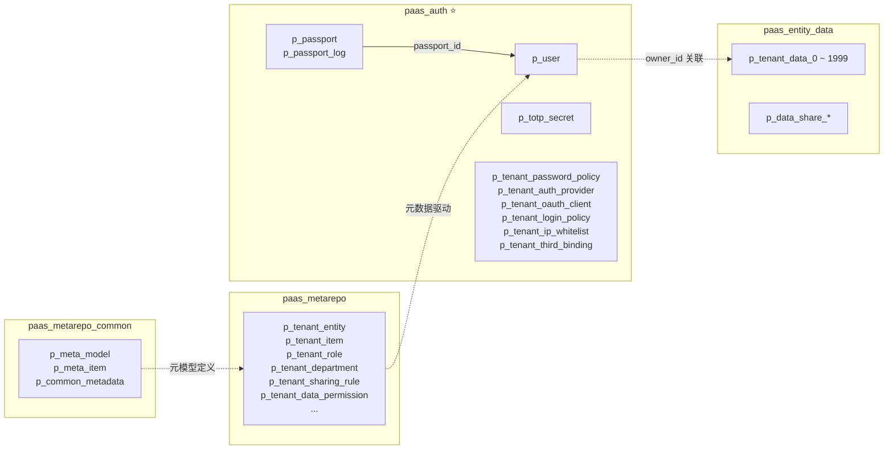
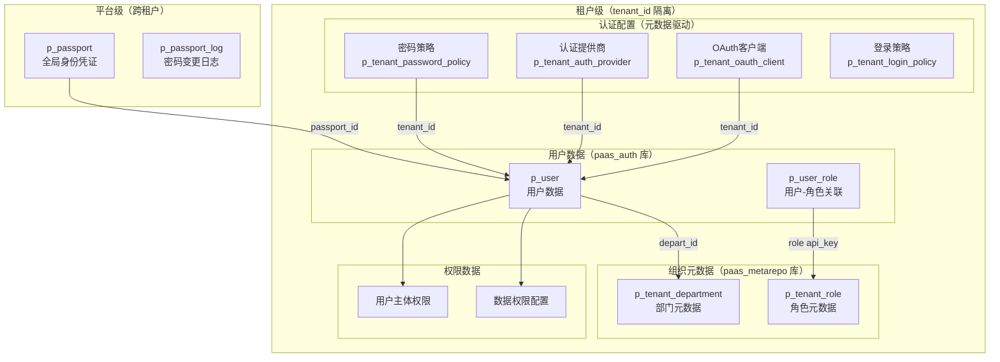
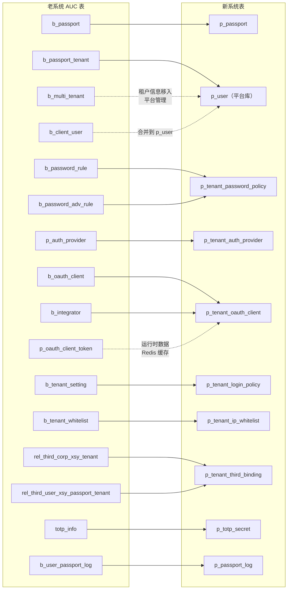
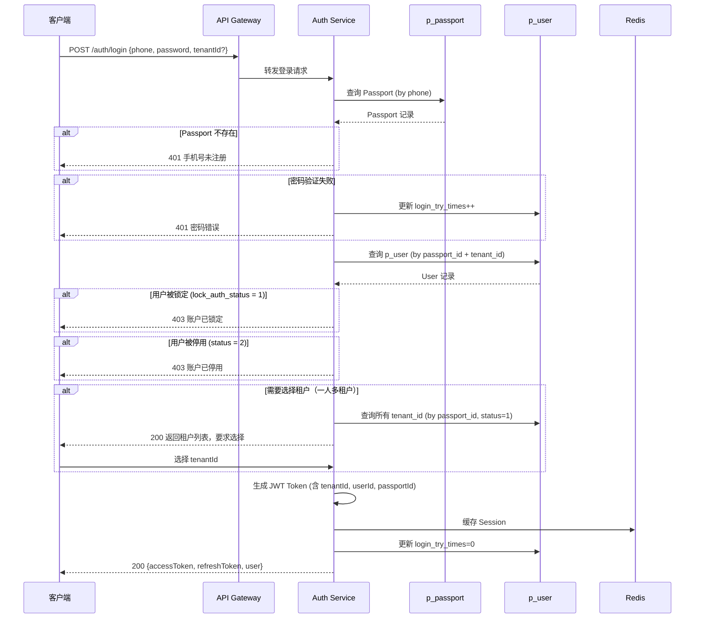
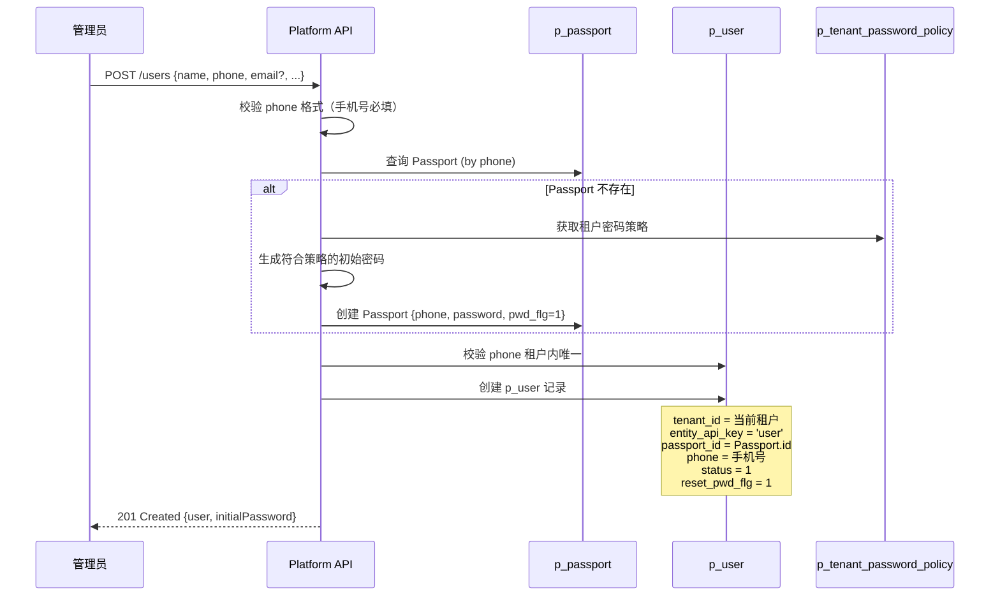
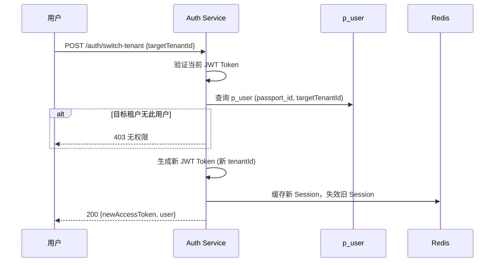
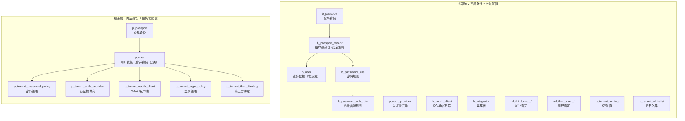

# aPaaS 多租户与用户体系设计方案

> 基于老项目 AUC（xsy-infr-auc-passport）源码分析 + 新平台元数据驱动架构重新设计

---

## 一、老系统 AUC 架构分析

### 1.1 老系统整体架构

老系统的认证/用户中心（AUC）由三个服务组成：

| 服务 | 职责 | 数据库 |
|:---|:---|:---|
| xsy-infr-auc-passport | AUC 基础设施层，核心实体定义 + DAO + Service | auc 库 |
| xsy-service-passport | Passport 业务服务层，对外 API | auc 库 |
| base-passport-service | 基础 Passport 服务，SSO/OAuth 集成 | auc 库 |

### 1.2 老系统数据库表全景

```mermaid
erDiagram
    b_passport {
        BIGINT id PK "雪花ID"
        VARCHAR email "邮箱（登录凭证）"
        VARCHAR phone "手机号（登录凭证）"
        VARCHAR password "密码（加密存储）"
        SMALLINT valid "有效状态 0/1"
        SMALLINT pwd_flg "密码标记 0自定义/1系统生成"
        SMALLINT del_flg "删除标记"
        SMALLINT type "类型 0默认"
        VARCHAR password_rule_json "密码规则JSON"
        BIGINT created_at
        BIGINT updated_at
    }

    b_multi_tenant {
        BIGINT id PK "雪花ID = tenantId"
        VARCHAR company "公司名称"
        VARCHAR description "描述"
        INT type "租户类型 0标准/1快消/2财富"
        INT edition "版本 10免费/20专业/30企业/40旗舰"
        BIGINT employee_count "员工人数"
        VARCHAR phone "电话"
        VARCHAR pn "合作伙伴code"
        VARCHAR sub_pn "下级合作伙伴code"
        INT init_status "初始化状态"
        INT pay_status "付费状态 0试用/1已付费"
        BIGINT pay_created_at "付费时间"
        INT agent_flg "代理商标记"
        BIGINT account_id "客户ID"
        BIGINT pod_id "POD ID"
        SMALLINT is_notice "通知开关 0关/1开"
        SMALLINT is_mfa "MFA开关 0关/1开"
        BIGINT created_at
    }

    b_passport_tenant {
        BIGINT id PK "雪花ID"
        BIGINT tenant_id FK "租户ID"
        BIGINT passport_id FK "Passport ID"
        INT type "0主租户/1其他租户"
        VARCHAR api_access_token "API Token"
        VARCHAR security_token "安全令牌"
        VARCHAR open_id "OpenID"
        INT lock_status "锁定状态 0/1"
        BIGINT password_rule_id "密码规则ID"
        INT try_times "尝试次数"
        BIGINT try_lock_time "锁定时间"
        INT reset_password_flg "重置密码标记"
        INT user_type "用户类型"
        BIGINT pwd_expire_at "密码过期时间"
        BIGINT pwd_updated_at "密码更新时间"
        VARCHAR user_name "用户名"
    }

    b_password_rule {
        BIGINT id PK
        VARCHAR rule_name "规则名称"
        INT password_length "密码长度"
        INT contain_rule "包含规则 0无限制/1大小写/2大小写+数字/3全部"
        INT try_times_lock "尝试锁定次数"
        SMALLINT system_flg "系统预制 0/1"
        INT status "状态 0停用/1启用"
        INT active_days "有效期天数"
        INT diff_pwd_count "记住密码个数"
        INT logout_switch "登出开关"
    }

    b_tenant_setting {
        BIGINT id PK
        BIGINT tenant_id FK
        VARCHAR biz_key "配置键"
        VARCHAR biz_value "配置值"
    }

    b_tenant_whitelist {
        BIGINT id PK
        BIGINT tenant_id FK
        BIGINT start_ip "起始IP"
        BIGINT end_ip "结束IP"
        INT status "0启用/1禁用"
        INT type "0 web/2 mobile"
        VARCHAR description
    }

    b_oauth_client {
        BIGINT id PK
        VARCHAR client_id "客户端ID"
        VARCHAR client_secret "客户端密钥"
        VARCHAR redirect_url "回调URL"
        VARCHAR name "名称"
        SMALLINT type "0 OAuth/1企业集成/2共享/3产品/4 C端/5站点/6互联"
        SMALLINT del_flg
        SMALLINT all_tenant_flg "0全部/1部分"
        BIGINT pod_id
        VARCHAR scope
        VARCHAR jwt_public_key
    }

    b_integrator {
        BIGINT id PK
        VARCHAR client_id FK
        SMALLINT enable_flg "启用标记"
        SMALLINT trust_flg "信任标记"
        SMALLINT integrator_type "集成器类型"
        BIGINT access_token_validity "Token有效期"
        BIGINT refresh_token_validity "刷新Token有效期"
        BIGINT access_day_limit "日访问限制"
        BIGINT access_second_limit "秒访问限制"
    }

    p_auth_provider {
        BIGINT id PK
        VARCHAR provider_key "提供商Key"
        VARCHAR provider_type "类型"
        VARCHAR name "名称"
        VARCHAR login_prefix "登录前缀"
        VARCHAR client_id
        VARCHAR client_secret
        VARCHAR authorize_url "认证URL"
        VARCHAR token_url "Token URL"
        VARCHAR userinfo_url "用户信息URL"
        SMALLINT status "1启用/0停用"
        VARCHAR corp_id "企业ID"
        INT client_type "-1 all/0 prm/1 crm"
    }

    p_oauth_client_token {
        BIGINT id PK
        VARCHAR provider_type
        VARCHAR client_id
        VARCHAR open_id
        VARCHAR access_token
        VARCHAR refresh_token
        BIGINT token_expired_at
        BIGINT provider_id
    }

    b_client_user {
        BIGINT id PK
        BIGINT client_info_id
        BIGINT user_id FK "业务用户ID"
        VARCHAR client_id FK
        BIGINT passport_id FK
        BIGINT tenant_id FK
        INT status "1启用"
        BIGINT created_at
        BIGINT updated_at
    }

    rel_third_corp_xsy_tenant {
        BIGINT id PK
        BIGINT tenant_id FK
        VARCHAR corp_id "第三方企业ID"
        VARCHAR third_source "来源 qywx/weixin"
        INT binding_type "0新建/1已有"
        VARCHAR hash_key "corpid+tenantid MD5"
    }

    rel_third_user_xsy_passport_tenant {
        BIGINT id PK
        VARCHAR third_uid "第三方用户ID"
        BIGINT tenant_id FK
        BIGINT passport_id FK
        VARCHAR third_source "来源"
    }

    totp_info {
        BIGINT id PK
        BIGINT tenant_id FK
        BIGINT passport_id FK
        VARCHAR totp_secret "TOTP密钥"
    }

    b_user_passport_log {
        BIGINT id PK
        BIGINT passport_id FK
        VARCHAR password "历史密码"
        BIGINT created_at
    }

    b_passport ||--o{ b_passport_tenant : "1:N 一个passport可属于多个租户"
    b_multi_tenant ||--o{ b_passport_tenant : "1:N 一个租户有多个用户"
    b_multi_tenant ||--o{ b_tenant_setting : "1:N"
    b_multi_tenant ||--o{ b_tenant_whitelist : "1:N"
    b_multi_tenant ||--o{ rel_third_corp_xsy_tenant : "1:N"
    b_passport_tenant ||--o{ rel_third_user_xsy_passport_tenant : "1:N"
    b_passport ||--o{ totp_info : "1:N"
    b_passport ||--o{ b_user_passport_log : "1:N"
    b_passport_tenant ||--o{ b_client_user : "1:N"
    b_multi_tenant ||--o{ p_auth_provider : "1:N"
    b_multi_tenant ||--o{ b_password_rule : "1:N"
```



### 1.3 老系统核心设计特征

**三层身份模型：Passport → PassportTenant → User（业务数据）**

```
Passport（全局身份）
  ├── email / phone / password（登录凭证，跨租户唯一）
  └── PassportTenant（租户级身份，N:M 关联）
        ├── tenant_id + passport_id（租户内身份）
        ├── lock_status / password_rule_id（租户级安全策略）
        ├── api_access_token / security_token（租户级Token）
        └── User（业务数据 p_user 表，平台库）
              ├── name / phone / status / type（业务属性）
              ├── owner_id / dim_depart（组织归属）
              └── passport_id（反向关联 Passport）
```

**关键设计决策分析：**

| 设计点 | 老系统方案 | 优点 | 问题 |
|:---|:---|:---|:---|
| 身份与租户分离 | Passport 跨租户，PassportTenant 租户级 | 支持一人多租户 | 三表 JOIN 查询复杂 |
| 密码存储 | Passport 级全局密码 | 一处修改全局生效 | 无法租户级独立密码策略 |
| 安全策略 | PassportTenant 级锁定/密码规则 | 租户独立安全策略 | 密码规则 ID 关联复杂 |
| 用户数据 | 独立 b_user 业务表 | 业务属性灵活扩展 | 与 Passport 双向关联维护成本高 |
| OAuth | 独立 b_oauth_client + b_integrator | 灵活的客户端管理 | 表过多，关系复杂 |
| 第三方绑定 | rel_third_* 关联表 | 支持多种第三方 | 扩展字段 expand_* 语义不清 |


---

## 二、新系统多租户与用户体系设计

### 2.1 设计原则

1. **元数据驱动**：用户（User）作为实体数据存储在 `p_user` 表中，通过元数据定义字段，与 Account/Lead 等业务实体同构
2. **认证与业务分离**：认证凭证（Passport）独立于业务用户数据，但简化关联层级
3. **租户隔离**：所有租户级数据通过 `tenant_id` 隔离，平台级数据（Passport）全局共享
4. **数据库分离**：多租/用户/认证相关表存储在 `paas_metarepo`（平台库），与实体数据库（`paas_entity_data`，存储 p_tenant_data 分片表）物理隔离
5. **api_key 关联**：遵循平台规范，元数据间使用 api_key 关联，禁止 ID 关联
6. **兼容老数据**：保留 passport_id 作为认证桥接，支持数据迁移

### 2.2 数据库分库设计

多租/用户/认证相关的表独立为 `paas_auth` 库，与元数据库（`paas_metarepo`）和实体数据库（`paas_entity_data`）物理隔离：

| 数据库 | 用途 | 包含的表 |
|:---|:---|:---|
| `paas_metarepo_common` | 元模型定义 + Common 级元数据 | p_meta_model, p_meta_item, p_meta_link, p_meta_option, p_common_metadata |
| `paas_metarepo` | Tenant 级元数据 + 运行时 | p_tenant_entity, p_tenant_item, p_tenant_role, p_tenant_department, p_tenant_sharing_rule, p_tenant_data_permission, ... |
| **`paas_auth`** | **多租/用户/认证** | **p_passport, p_passport_log, p_user, p_user_role, p_totp_secret, p_tenant_password_policy, p_tenant_auth_provider, p_tenant_oauth_client, p_tenant_login_policy, p_tenant_ip_whitelist, p_tenant_third_binding** |
| `paas_entity_data` | 业务实体数据（大宽表分片） | p_tenant_data_0 ~ p_tenant_data_1999, p_data_share_*, p_public_group_member |

**为什么独立 `paas_auth` 库：**

1. **职责单一**：认证/用户/多租是独立的平台基础设施，与元数据定义（paas_metarepo）和业务实体数据（paas_entity_data）职责不同
2. **认证高频联查**：登录鉴权需要 p_passport + p_user 联查，同库避免跨库 JOIN
3. **独立运维**：用户/认证数据的备份策略、安全审计、扩容节奏与元数据和业务数据不同
4. **安全隔离**：密码、Token、密钥等敏感数据集中在一个库，便于加密存储和访问控制
5. **不污染元数据库**：paas_metarepo 专注元数据，不混入认证业务表



### 2.3 新系统架构总览



### 2.4 核心数据模型设计

#### 2.4.1 平台级：p_passport（全局身份凭证表）

> 对应老系统 `b_passport`，简化字段，保持跨租户唯一身份
> **登录凭证为手机号**，email 不作为登录凭证

```sql
-- ============================================================
-- p_passport 全局身份凭证表
-- 平台级，跨租户唯一，存储登录凭证
-- 登录账号 = 手机号（phone），全局唯一
-- 兼容 PostgreSQL
-- ============================================================
CREATE TABLE IF NOT EXISTS p_passport (
    id                  BIGINT          NOT NULL,
    phone               VARCHAR(50)     NOT NULL,
    password            VARCHAR(255)    NOT NULL,
    password_salt       VARCHAR(64),
    valid               SMALLINT        DEFAULT 1,
    pwd_flg             SMALLINT        DEFAULT 0,
    del_flg             SMALLINT        DEFAULT 0,
    created_at          BIGINT,
    updated_at          BIGINT,

    PRIMARY KEY (id)
);

CREATE UNIQUE INDEX IF NOT EXISTS idx_passport_phone ON p_passport (phone);
```

| 字段 | 类型 | 说明 |
|:---|:---|:---|
| id | BIGINT | 雪花ID，即 passport_id |
| phone | VARCHAR(50) | **手机号（唯一登录凭证，全局唯一，NOT NULL）** |
| password | VARCHAR(255) | 密码（BCrypt 加密） |
| password_salt | VARCHAR(64) | 密码盐值（可选，BCrypt 自带盐） |
| valid | SMALLINT | 有效状态 0无效/1有效 |
| pwd_flg | SMALLINT | 0自定义密码/1系统生成（首次需重置） |
| del_flg | SMALLINT | 删除标记 0正常/1删除 |

**与老系统对比：**
- **去掉 `email` 字段**：email 不再作为登录凭证，仅在 p_user 中作为用户属性
- 去掉 `type` 字段（统一为一种类型）
- 去掉 `password_rule_json`（密码规则移到租户级策略表）
- 新增 `password_salt`（增强安全性）
- 去掉 `phone_bak` / `email_bak`（历史遗留字段）

#### 2.4.2 平台级：p_passport_log（密码变更日志）

> 对应老系统 `b_user_passport_log`

```sql
CREATE TABLE IF NOT EXISTS p_passport_log (
    id                  BIGINT          NOT NULL,
    passport_id         BIGINT          NOT NULL,
    password            VARCHAR(255)    NOT NULL,
    change_type         SMALLINT        DEFAULT 0,
    created_at          BIGINT,
    created_by          BIGINT,

    PRIMARY KEY (id)
);

CREATE INDEX IF NOT EXISTS idx_passport_log_pid ON p_passport_log (passport_id);
```

| 字段 | 说明 |
|:---|:---|
| change_type | 0密码修改/1密码重置/2管理员重置 |

#### 2.4.3 租户级：p_user（用户表）

> 这是核心设计变化：用户数据存储在 `p_user` 中，与 Account/Lead 等业务实体同构（共享 19 个公共字段），通过元数据定义字段。
> **p_user 存储在 `paas_auth` 库**，与元数据库（`paas_metarepo`）和实体数据库（`paas_entity_data`）物理隔离。

**登录凭证约束：用户登录账号必须是手机号。** email 仅作为用户属性字段，不作为登录凭证。

**p_user 表结构（19 个公共字段 + 用户业务固定列 + dbc 扩展列）：**

```sql
-- ============================================================
-- p_user 用户表
-- 存储在 paas_auth 库（认证库），不在 paas_metarepo 或 paas_entity_data
-- 与 p_tenant_data 大宽表同构（19 个公共字段 + dbc 扩展列）
-- 兼容 PostgreSQL
-- ============================================================
CREATE TABLE IF NOT EXISTS p_user (

    -- ===== 19 个公共字段（与 p_tenant_data 完全一致） =====
    -- 基础 15 列
    id                  BIGINT          NOT NULL,
    tenant_id           BIGINT          NOT NULL,
    entity_api_key      VARCHAR(100)    NOT NULL DEFAULT 'user',
    name                VARCHAR(300),
    owner_id            BIGINT,
    depart_id           BIGINT,
    busitype_api_key    VARCHAR(100),
    applicant_id        BIGINT,
    delete_flg          SMALLINT        DEFAULT 0,
    created_at          BIGINT,
    created_by          BIGINT,
    updated_at          BIGINT,
    updated_by          BIGINT,
    lock_status         INTEGER         DEFAULT 1,
    approval_status     INTEGER,
    -- 扩展 4 列
    workflow_stage      VARCHAR(255),
    currency_unit       INTEGER,
    currency_rate       DECIMAL(20,4),
    territory_id        BIGINT,

    -- ===== 用户业务固定列 =====
    phone               VARCHAR(50)     NOT NULL,
    email               VARCHAR(255),
    passport_id         BIGINT,
    status              SMALLINT        DEFAULT 1,
    user_type           SMALLINT        DEFAULT 0,
    avatar_url          VARCHAR(500),

    -- 组织关系
    manager_id          BIGINT,
    position            VARCHAR(255),

    -- 认证安全（从老 PassportTenant 合并）
    lock_auth_status    SMALLINT        DEFAULT 0,
    pwd_rule_id         BIGINT,
    pwd_expire_at       BIGINT,
    pwd_updated_at      BIGINT,
    login_try_times     SMALLINT        DEFAULT 0,
    login_lock_time     BIGINT,
    reset_pwd_flg       SMALLINT        DEFAULT 0,

    -- API/Token
    api_access_token    VARCHAR(255),
    security_token      VARCHAR(255),
    open_id             VARCHAR(255),

    -- ===== dbc 扩展列（与 p_tenant_data 同规格，支持租户自定义字段） =====
    -- dbc_varchar 1~50 VARCHAR(300)
    dbc_varchar1 VARCHAR(300), dbc_varchar2 VARCHAR(300), dbc_varchar3 VARCHAR(300),
    dbc_varchar4 VARCHAR(300), dbc_varchar5 VARCHAR(300), dbc_varchar6 VARCHAR(300),
    dbc_varchar7 VARCHAR(300), dbc_varchar8 VARCHAR(300), dbc_varchar9 VARCHAR(300),
    dbc_varchar10 VARCHAR(300), dbc_varchar11 VARCHAR(300), dbc_varchar12 VARCHAR(300),
    dbc_varchar13 VARCHAR(300), dbc_varchar14 VARCHAR(300), dbc_varchar15 VARCHAR(300),
    dbc_varchar16 VARCHAR(300), dbc_varchar17 VARCHAR(300), dbc_varchar18 VARCHAR(300),
    dbc_varchar19 VARCHAR(300), dbc_varchar20 VARCHAR(300), dbc_varchar21 VARCHAR(300),
    dbc_varchar22 VARCHAR(300), dbc_varchar23 VARCHAR(300), dbc_varchar24 VARCHAR(300),
    dbc_varchar25 VARCHAR(300), dbc_varchar26 VARCHAR(300), dbc_varchar27 VARCHAR(300),
    dbc_varchar28 VARCHAR(300), dbc_varchar29 VARCHAR(300), dbc_varchar30 VARCHAR(300),
    dbc_varchar31 VARCHAR(300), dbc_varchar32 VARCHAR(300), dbc_varchar33 VARCHAR(300),
    dbc_varchar34 VARCHAR(300), dbc_varchar35 VARCHAR(300), dbc_varchar36 VARCHAR(300),
    dbc_varchar37 VARCHAR(300), dbc_varchar38 VARCHAR(300), dbc_varchar39 VARCHAR(300),
    dbc_varchar40 VARCHAR(300), dbc_varchar41 VARCHAR(300), dbc_varchar42 VARCHAR(300),
    dbc_varchar43 VARCHAR(300), dbc_varchar44 VARCHAR(300), dbc_varchar45 VARCHAR(300),
    dbc_varchar46 VARCHAR(300), dbc_varchar47 VARCHAR(300), dbc_varchar48 VARCHAR(300),
    dbc_varchar49 VARCHAR(300), dbc_varchar50 VARCHAR(300),

    -- dbc_bigint 1~30 BIGINT
    dbc_bigint1 BIGINT, dbc_bigint2 BIGINT, dbc_bigint3 BIGINT, dbc_bigint4 BIGINT,
    dbc_bigint5 BIGINT, dbc_bigint6 BIGINT, dbc_bigint7 BIGINT, dbc_bigint8 BIGINT,
    dbc_bigint9 BIGINT, dbc_bigint10 BIGINT, dbc_bigint11 BIGINT, dbc_bigint12 BIGINT,
    dbc_bigint13 BIGINT, dbc_bigint14 BIGINT, dbc_bigint15 BIGINT, dbc_bigint16 BIGINT,
    dbc_bigint17 BIGINT, dbc_bigint18 BIGINT, dbc_bigint19 BIGINT, dbc_bigint20 BIGINT,
    dbc_bigint21 BIGINT, dbc_bigint22 BIGINT, dbc_bigint23 BIGINT, dbc_bigint24 BIGINT,
    dbc_bigint25 BIGINT, dbc_bigint26 BIGINT, dbc_bigint27 BIGINT, dbc_bigint28 BIGINT,
    dbc_bigint29 BIGINT, dbc_bigint30 BIGINT,

    -- dbc_decimal 1~10 DECIMAL(20,4)
    dbc_decimal1 DECIMAL(20,4), dbc_decimal2 DECIMAL(20,4), dbc_decimal3 DECIMAL(20,4),
    dbc_decimal4 DECIMAL(20,4), dbc_decimal5 DECIMAL(20,4), dbc_decimal6 DECIMAL(20,4),
    dbc_decimal7 DECIMAL(20,4), dbc_decimal8 DECIMAL(20,4), dbc_decimal9 DECIMAL(20,4),
    dbc_decimal10 DECIMAL(20,4),

    -- dbc_smallint 1~10 SMALLINT
    dbc_smallint1 SMALLINT, dbc_smallint2 SMALLINT, dbc_smallint3 SMALLINT,
    dbc_smallint4 SMALLINT, dbc_smallint5 SMALLINT, dbc_smallint6 SMALLINT,
    dbc_smallint7 SMALLINT, dbc_smallint8 SMALLINT, dbc_smallint9 SMALLINT,
    dbc_smallint10 SMALLINT,

    -- dbc_textarea 1~5 TEXT
    dbc_textarea1 TEXT, dbc_textarea2 TEXT, dbc_textarea3 TEXT,
    dbc_textarea4 TEXT, dbc_textarea5 TEXT,

    -- dbc_multi 1~5 JSONB（多选）
    dbc_multi1 JSONB, dbc_multi2 JSONB, dbc_multi3 JSONB,
    dbc_multi4 JSONB, dbc_multi5 JSONB,

    PRIMARY KEY (id)
);

-- 核心索引
CREATE INDEX IF NOT EXISTS idx_puser_tid ON p_user (tenant_id);
CREATE INDEX IF NOT EXISTS idx_puser_tid_status ON p_user (tenant_id, status);
CREATE INDEX IF NOT EXISTS idx_puser_passport ON p_user (passport_id);
CREATE INDEX IF NOT EXISTS idx_puser_tid_dept ON p_user (tenant_id, depart_id);
CREATE INDEX IF NOT EXISTS idx_puser_tid_mgr ON p_user (tenant_id, manager_id);
CREATE INDEX IF NOT EXISTS idx_puser_owner ON p_user (owner_id);
CREATE UNIQUE INDEX IF NOT EXISTS idx_puser_tid_phone ON p_user (tenant_id, phone);
CREATE INDEX IF NOT EXISTS idx_puser_tid_email ON p_user (tenant_id, email);
CREATE INDEX IF NOT EXISTS idx_puser_tid_openid ON p_user (tenant_id, open_id);
CREATE INDEX IF NOT EXISTS idx_puser_tid_updated ON p_user (tenant_id, updated_at);
```

**19 个公共字段对照表：**

| # | 公共字段 apiKey | db_column | 类型 | p_user 中的列名 | 说明 |
|:---|:---|:---|:---|:---|:---|
| 1 | id | id | BIGINT | id | 雪花算法主键 |
| 2 | tenantId | tenant_id | BIGINT | tenant_id | 租户 ID |
| 3 | entityApiKey | entity_api_key | VARCHAR(100) | entity_api_key | 固定值 'user' |
| 4 | name | name | VARCHAR(300) | name | 用户姓名 |
| 5 | ownerId | owner_id | BIGINT | owner_id | 数据所有人 |
| 6 | departId | depart_id | BIGINT | depart_id | 所属部门 |
| 7 | busitypeApiKey | busitype_api_key | VARCHAR(100) | busitype_api_key | 业务类型 |
| 8 | applicantId | applicant_id | BIGINT | applicant_id | 审批提交人 |
| 9 | approvalStatus | approval_status | INTEGER | approval_status | 审批状态 |
| 10 | lockStatus | lock_status | INTEGER | lock_status | 锁定状态 |
| 11 | createdAt | created_at | BIGINT | created_at | 创建时间 |
| 12 | createdBy | created_by | BIGINT | created_by | 创建人 |
| 13 | updatedAt | updated_at | BIGINT | updated_at | 修改时间 |
| 14 | updatedBy | updated_by | BIGINT | updated_by | 修改人 |
| 15 | deleteFlg | delete_flg | SMALLINT | delete_flg | 软删除标记 |
| 16 | workflowStage | workflow_stage | VARCHAR | workflow_stage | 工作流阶段 |
| 17 | currencyUnit | currency_unit | INTEGER | currency_unit | 币种 |
| 18 | currencyRate | currency_rate | DECIMAL(20,4) | currency_rate | 汇率 |
| 19 | territoryId | territory_id | BIGINT | territory_id | 区域 ID |

**用户业务固定列说明：**

| 分类 | 字段 | 来源 | 说明 |
|:---|:---|:---|:---|
| 登录凭证 | phone | 老 Passport.phone | **登录账号（手机号），租户内唯一，NOT NULL** |
| 用户属性 | email | 老 Passport.email | 邮箱（仅属性，非登录凭证） |
| 认证桥接 | passport_id | 老 PassportTenant | 关联全局 p_passport |
| 用户状态 | status | 老 User.status | 1启用/2停用 |
| 用户类型 | user_type | 老 PassportTenant.user_type | 0普通/1管理员/... |
| 头像 | avatar_url | 老 User.icon | 头像 URL |
| 组织关系 | manager_id, position | 老 User + 新增 | 上级、职位 |
| 安全策略 | lock_auth_status, pwd_rule_id, pwd_expire_at, pwd_updated_at, login_try_times, login_lock_time, reset_pwd_flg | 老 PassportTenant | 租户级安全策略（从 PassportTenant 合并） |
| API/Token | api_access_token, security_token, open_id | 老 PassportTenant | API 访问凭证 |
| 扩展列 | dbc_varchar*, dbc_bigint*, dbc_decimal*, dbc_smallint*, dbc_textarea*, dbc_multi* | 元数据驱动 | 租户自定义字段 |

**关键设计决策：**

1. **合并 PassportTenant 到 p_user**：老系统 `b_passport_tenant` 的安全策略字段合并到 p_user，减少一层 JOIN
2. **手机号为唯一登录凭证**：`phone` 字段 NOT NULL + 租户内唯一索引，email 仅为属性字段
3. **19 个公共字段完整保留**：与 p_tenant_data 大宽表结构对齐，确保 CommonFieldProvider 注入机制、数据权限过滤、审批流等通用能力无缝适用
4. **dbc 扩展列**：p_user 作为独立实体表，扩展列数量按用户场景裁剪（50 varchar + 30 bigint + 10 decimal + 10 smallint + 5 textarea + 5 multi = 110 列），不需要与 p_tenant_data 的 670 列完全一致
5. **数据库隔离**：p_user 存储在 `paas_auth` 库（认证库），与 `paas_metarepo`（元数据库）和 `paas_entity_data`（实体数据库）物理隔离


#### 2.4.4 租户级：p_tenant_password_policy（密码策略表）

> 对应老系统 `b_password_rule` + `b_password_adv_rule`，合并为一张表

```sql
CREATE TABLE IF NOT EXISTS p_tenant_password_policy (
    id                  BIGINT          NOT NULL,
    tenant_id           BIGINT          NOT NULL,
    api_key             VARCHAR(255)    NOT NULL,
    label               VARCHAR(255),
    label_key           VARCHAR(255),
    namespace           VARCHAR(50)     DEFAULT 'system',
    system_flg          SMALLINT        DEFAULT 0,
    status              SMALLINT        DEFAULT 1,
    password_length     INTEGER         DEFAULT 8,
    contain_rule        INTEGER         DEFAULT 0,
    try_times_lock      INTEGER         DEFAULT 5,
    active_days         INTEGER         DEFAULT 0,
    diff_pwd_count      INTEGER         DEFAULT 3,
    force_modify_days   INTEGER         DEFAULT 0,
    lock_minutes        INTEGER         DEFAULT 30,
    logout_switch       SMALLINT        DEFAULT 0,
    description         VARCHAR(500),
    description_key     VARCHAR(255),
    del_flg             SMALLINT        DEFAULT 0,
    created_at          BIGINT,
    created_by          BIGINT,
    updated_at          BIGINT,
    updated_by          BIGINT,

    PRIMARY KEY (id)
);

CREATE INDEX IF NOT EXISTS idx_tpp_tid ON p_tenant_password_policy (tenant_id);
CREATE UNIQUE INDEX IF NOT EXISTS idx_tpp_tid_ak ON p_tenant_password_policy (tenant_id, api_key);
```

| 字段 | 来源 | 说明 |
|:---|:---|:---|
| password_length | b_password_rule.PASSWORD_LENGTH | 最小密码长度 |
| contain_rule | b_password_rule.CONTAIN_RULE | 0无限制/1大小写/2大小写+数字/3全部 |
| try_times_lock | b_password_rule.TRY_TIMES_LOCK | 尝试锁定次数 |
| active_days | b_password_rule.ACTIVE_DAYS | 密码有效期天数，0=永不过期 |
| diff_pwd_count | b_password_rule.DIFF_PWD_COUNT | 不可重复的历史密码数 |
| force_modify_days | b_password_adv_rule.FORCE_MODIFI_DAYS | 强制修改天数 |
| lock_minutes | 新增（替代 b_password_adv_rule.LOCK_DAYS） | 锁定时长（分钟），更精细 |
| logout_switch | b_password_rule.logout_switch | 登出开关 |

#### 2.4.5 租户级：p_tenant_auth_provider（认证提供商表）

> 对应老系统 `p_auth_provider`，简化字段

```sql
CREATE TABLE IF NOT EXISTS p_tenant_auth_provider (
    id                  BIGINT          NOT NULL,
    tenant_id           BIGINT          NOT NULL,
    api_key             VARCHAR(255)    NOT NULL,
    label               VARCHAR(255),
    label_key           VARCHAR(255),
    namespace           VARCHAR(50)     DEFAULT 'custom',
    provider_type       VARCHAR(50)     NOT NULL,
    provider_key        VARCHAR(255),
    client_id           VARCHAR(255),
    client_secret       VARCHAR(500),
    authorize_url       VARCHAR(500),
    token_url           VARCHAR(500),
    userinfo_url        VARCHAR(500),
    status              SMALLINT        DEFAULT 1,
    corp_id             VARCHAR(255),
    trust_domain        VARCHAR(500),
    login_prefix        VARCHAR(255),
    config_json         TEXT,
    del_flg             SMALLINT        DEFAULT 0,
    created_at          BIGINT,
    created_by          BIGINT,
    updated_at          BIGINT,
    updated_by          BIGINT,

    PRIMARY KEY (id)
);

CREATE INDEX IF NOT EXISTS idx_tap_tid ON p_tenant_auth_provider (tenant_id);
CREATE UNIQUE INDEX IF NOT EXISTS idx_tap_tid_ak ON p_tenant_auth_provider (tenant_id, api_key);
CREATE INDEX IF NOT EXISTS idx_tap_tid_type ON p_tenant_auth_provider (tenant_id, provider_type);
```

**设计改进：**
- 老系统 `p_auth_provider` 有 20+ 个字段用于不同第三方（企微、钉钉、飞书等），新设计用 `config_json` TEXT 字段存储各提供商的差异化配置
- `provider_type` 枚举：`standard`（标准OAuth）、`qywx`（企业微信）、`dingtalk`（钉钉）、`feishu`（飞书）、`saml`（SAML SSO）、`oidc`（OpenID Connect）

#### 2.4.6 租户级：p_tenant_oauth_client（OAuth 客户端表）

> 对应老系统 `b_oauth_client` + `b_integrator`，合并简化

```sql
CREATE TABLE IF NOT EXISTS p_tenant_oauth_client (
    id                  BIGINT          NOT NULL,
    tenant_id           BIGINT          NOT NULL,
    api_key             VARCHAR(255)    NOT NULL,
    label               VARCHAR(255),
    label_key           VARCHAR(255),
    namespace           VARCHAR(50)     DEFAULT 'custom',
    client_id           VARCHAR(255)    NOT NULL,
    client_secret       VARCHAR(500)    NOT NULL,
    redirect_url        VARCHAR(500),
    client_type         SMALLINT        DEFAULT 0,
    scope               VARCHAR(500),
    enable_flg          SMALLINT        DEFAULT 1,
    trust_flg           SMALLINT        DEFAULT 0,
    access_token_ttl    BIGINT          DEFAULT 7200,
    refresh_token_ttl   BIGINT          DEFAULT 2592000,
    rate_limit_day      BIGINT          DEFAULT 10000,
    rate_limit_second   BIGINT          DEFAULT 100,
    jwt_public_key      TEXT,
    del_flg             SMALLINT        DEFAULT 0,
    created_at          BIGINT,
    created_by          BIGINT,
    updated_at          BIGINT,
    updated_by          BIGINT,

    PRIMARY KEY (id)
);

CREATE INDEX IF NOT EXISTS idx_toc_tid ON p_tenant_oauth_client (tenant_id);
CREATE UNIQUE INDEX IF NOT EXISTS idx_toc_tid_ak ON p_tenant_oauth_client (tenant_id, api_key);
CREATE UNIQUE INDEX IF NOT EXISTS idx_toc_clientid ON p_tenant_oauth_client (client_id);
```

| 字段 | 来源 | 说明 |
|:---|:---|:---|
| client_type | b_oauth_client.type | 0 OAuth/1企业集成/2共享/3产品/4 C端 |
| access_token_ttl | b_integrator.ACCESS_TOKEN_VALIDITY | Token 有效期（秒） |
| refresh_token_ttl | b_integrator.REFRESH_TOKEN_VALIDITY | 刷新 Token 有效期（秒） |
| rate_limit_day | b_integrator.ACCESS_DAY_LIMIT | 日访问限制 |
| rate_limit_second | b_integrator.ACCESS_SECOND_LIMIT | 秒访问限制 |

#### 2.4.7 租户级：p_tenant_login_policy（登录策略表）

> 新增，整合老系统 `b_tenant_whitelist` + `b_tenant_setting` 中的登录相关配置

```sql
CREATE TABLE IF NOT EXISTS p_tenant_login_policy (
    id                  BIGINT          NOT NULL,
    tenant_id           BIGINT          NOT NULL,
    api_key             VARCHAR(255)    NOT NULL,
    label               VARCHAR(255),
    label_key           VARCHAR(255),
    namespace           VARCHAR(50)     DEFAULT 'system',
    mfa_flg             SMALLINT        DEFAULT 0,
    notice_flg          SMALLINT        DEFAULT 1,
    ip_whitelist_flg    SMALLINT        DEFAULT 0,
    session_timeout     BIGINT          DEFAULT 7200,
    concurrent_login    SMALLINT        DEFAULT 1,
    config_json         TEXT,
    del_flg             SMALLINT        DEFAULT 0,
    created_at          BIGINT,
    created_by          BIGINT,
    updated_at          BIGINT,
    updated_by          BIGINT,

    PRIMARY KEY (id)
);

CREATE INDEX IF NOT EXISTS idx_tlp_tid ON p_tenant_login_policy (tenant_id);
CREATE UNIQUE INDEX IF NOT EXISTS idx_tlp_tid_ak ON p_tenant_login_policy (tenant_id, api_key);
```

#### 2.4.8 租户级：p_tenant_ip_whitelist（IP 白名单表）

> 对应老系统 `b_tenant_whitelist`

```sql
CREATE TABLE IF NOT EXISTS p_tenant_ip_whitelist (
    id                  BIGINT          NOT NULL,
    tenant_id           BIGINT          NOT NULL,
    api_key             VARCHAR(255)    NOT NULL,
    label               VARCHAR(255),
    start_ip            BIGINT          NOT NULL,
    end_ip              BIGINT          NOT NULL,
    status              SMALLINT        DEFAULT 0,
    access_type         SMALLINT        DEFAULT 0,
    description         VARCHAR(500),
    del_flg             SMALLINT        DEFAULT 0,
    created_at          BIGINT,
    created_by          BIGINT,
    updated_at          BIGINT,
    updated_by          BIGINT,

    PRIMARY KEY (id)
);

CREATE INDEX IF NOT EXISTS idx_tiw_tid ON p_tenant_ip_whitelist (tenant_id);
CREATE INDEX IF NOT EXISTS idx_tiw_tid_status ON p_tenant_ip_whitelist (tenant_id, status);
```

#### 2.4.9 租户级：p_tenant_third_binding（第三方绑定表）

> 合并老系统 `rel_third_corp_xsy_tenant` + `rel_third_user_xsy_passport_tenant`

```sql
CREATE TABLE IF NOT EXISTS p_tenant_third_binding (
    id                  BIGINT          NOT NULL,
    tenant_id           BIGINT          NOT NULL,
    api_key             VARCHAR(255)    NOT NULL,
    binding_level       SMALLINT        NOT NULL,
    third_source        VARCHAR(50)     NOT NULL,
    corp_id             VARCHAR(255),
    third_uid           VARCHAR(255),
    passport_id         BIGINT,
    user_id             BIGINT,
    binding_type        SMALLINT        DEFAULT 0,
    hash_key            VARCHAR(64),
    config_json         TEXT,
    del_flg             SMALLINT        DEFAULT 0,
    created_at          BIGINT,
    created_by          BIGINT,
    updated_at          BIGINT,
    updated_by          BIGINT,

    PRIMARY KEY (id)
);

CREATE INDEX IF NOT EXISTS idx_ttb_tid ON p_tenant_third_binding (tenant_id);
CREATE INDEX IF NOT EXISTS idx_ttb_tid_source ON p_tenant_third_binding (tenant_id, third_source);
CREATE INDEX IF NOT EXISTS idx_ttb_corpid ON p_tenant_third_binding (corp_id);
CREATE INDEX IF NOT EXISTS idx_ttb_thirduid ON p_tenant_third_binding (third_uid, third_source);
```

| 字段 | 说明 |
|:---|:---|
| binding_level | 0=租户级绑定（corp↔tenant），1=用户级绑定（third_user↔passport） |
| third_source | qywx/dingtalk/feishu/weixin/saml 等 |
| corp_id | 第三方企业ID（租户级绑定时填写） |
| third_uid | 第三方用户ID（用户级绑定时填写） |
| config_json | 扩展配置（替代老系统的 expand_* 字段） |

#### 2.4.10 平台级：p_totp_secret（MFA TOTP 密钥表）

> 对应老系统 `totp_info`

```sql
CREATE TABLE IF NOT EXISTS p_totp_secret (
    id                  BIGINT          NOT NULL,
    tenant_id           BIGINT          NOT NULL,
    passport_id         BIGINT          NOT NULL,
    totp_secret         VARCHAR(255)    NOT NULL,
    verified_flg        SMALLINT        DEFAULT 0,
    del_flg             SMALLINT        DEFAULT 0,
    created_at          BIGINT,
    created_by          BIGINT,
    updated_at          BIGINT,
    updated_by          BIGINT,

    PRIMARY KEY (id)
);

CREATE UNIQUE INDEX IF NOT EXISTS idx_totp_tid_pid ON p_totp_secret (tenant_id, passport_id);
```


---

## 三、新老系统表映射关系

### 3.1 表映射总览



### 3.2 字段级映射（核心表）

#### b_passport_tenant → p_user 字段映射

| 老字段 (b_passport_tenant) | 新字段 (p_user) | 说明 |
|:---|:---|:---|
| id | id | 直接映射 |
| tenant_id | tenant_id | 直接映射（公共字段 #2） |
| — | entity_api_key | 新增，固定值 'user'（公共字段 #3） |
| user_name | name | 重命名（公共字段 #4） |
| — | owner_id | 新增，默认自己（公共字段 #5） |
| — | depart_id | 新增，替代老 dim_depart（公共字段 #6） |
| — | busitype_api_key | 新增（公共字段 #7） |
| — | delete_flg | 新增（公共字段 #15） |
| passport_id | passport_id | 直接映射 |
| — | phone | 从 Passport.phone 映射（**登录账号，NOT NULL**） |
| — | email | 从 Passport.email 映射（仅属性） |
| type | — | 不再区分主/其他租户 |
| api_access_token | api_access_token | 直接映射 |
| security_token | security_token | 直接映射 |
| open_id | open_id | 直接映射 |
| lock_status | lock_auth_status | 重命名，避免与公共字段 lock_status 冲突 |
| password_rule_id | pwd_rule_id | 重命名 |
| try_times | login_try_times | 重命名 |
| try_lock_time | login_lock_time | 重命名 |
| reset_password_flg | reset_pwd_flg | 重命名 |
| user_type | user_type | 直接映射 |
| pwd_expire_at | pwd_expire_at | 直接映射 |
| pwd_updated_at | pwd_updated_at | 直接映射 |

---

## 四、核心流程设计

### 4.1 用户登录流程



### 4.2 用户创建流程



### 4.3 一人多租户切换流程



---

## 五、与现有系统的集成

### 5.1 与元数据系统集成

p_user 作为实体数据，需要在元数据系统中注册：

```
元模型层：p_meta_model 注册 "entity" 元模型
元数据层：p_common_metadata 注册 User 实体定义
  ├── entity api_key = "user"
  ├── db_table = "p_user"
  ├── label = "用户"
  └── namespace = "system"
字段层：p_common_metadata 注册 User 字段定义（不含 19 个公共字段，公共字段由 CommonFieldProvider 注入）
  ├── item api_key = "phone", db_column = "phone", item_type = "PHONE"（登录账号，必填）
  ├── item api_key = "email", db_column = "email", item_type = "EMAIL"
  ├── item api_key = "passportId", db_column = "passport_id", item_type = "BIGINT"
  ├── item api_key = "status", db_column = "status", item_type = "PICKLIST"
  ├── item api_key = "userType", db_column = "user_type", item_type = "PICKLIST"
  ├── item api_key = "avatarUrl", db_column = "avatar_url", item_type = "IMAGE"
  ├── item api_key = "managerId", db_column = "manager_id", item_type = "LOOKUP"（引用 user）
  ├── item api_key = "position", db_column = "position", item_type = "TEXT"
  ├── item api_key = "lockAuthStatus", db_column = "lock_auth_status", item_type = "BOOLEAN"
  ├── item api_key = "pwdRuleId", db_column = "pwd_rule_id", item_type = "BIGINT"
  └── ... (扩展列通过 dbc_* 映射)
```

> 19 个公共字段（id, tenantId, entityApiKey, name, ownerId, departId, busitypeApiKey, applicantId, approvalStatus, lockStatus, createdAt, createdBy, updatedAt, updatedBy, deleteFlg, workflowStage, currencyUnit, currencyRate, territoryId）由 `CommonFieldProvider` 在查询 item 列表时动态注入，不在 p_common_metadata 中存储。

### 5.2 与数据权限系统集成

p_user 实体需要配置数据权限：

```
p_tenant_data_permission 配置：
  ├── entity_api_key = "user"
  ├── default_access = 2 (只读)
  ├── hierarchy_access = 1 (启用层级)
  ├── owner_access = 7 (完全控制)
  └── sharing_flg = 1 (启用共享)
```

### 5.3 与 Gateway 集成

```
paas-gateway 认证过滤器：
  1. 从 Request Header 提取 JWT Token
  2. 验证 Token 签名和有效期
  3. 从 Token 中提取 tenantId + userId + passportId
  4. 注入 RequestContext：
     - X-Tenant-Id: {tenantId}
     - X-User-Id: {userId}
     - X-Passport-Id: {passportId}
  5. 下游服务通过 Header 获取当前用户上下文
```

---

## 六、数据迁移方案

### 6.1 迁移策略

| 阶段 | 内容 | 风险 |
|:---|:---|:---|
| Phase 1 | p_passport ← b_passport（1:1 迁移） | 低 |
| Phase 2 | p_user ← b_passport_tenant + 老 User 业务数据（合并） | 中 |
| Phase 3 | p_tenant_password_policy ← b_password_rule + b_password_adv_rule | 低 |
| Phase 4 | p_tenant_auth_provider ← p_auth_provider | 低 |
| Phase 5 | p_tenant_oauth_client ← b_oauth_client + b_integrator | 中 |
| Phase 6 | p_tenant_third_binding ← rel_third_* 两张表 | 中 |
| Phase 7 | p_tenant_login_policy ← b_tenant_setting（筛选登录相关配置） | 低 |
| Phase 8 | p_tenant_ip_whitelist ← b_tenant_whitelist | 低 |

### 6.2 关键迁移 SQL 示例

```sql
-- Phase 1: 迁移 Passport（仅保留手机号作为登录凭证）
INSERT INTO p_passport (id, phone, password, valid, pwd_flg, del_flg, created_at, updated_at)
SELECT id, phone, password, valid, pwd_flg, del_flg, created_at, updated_at
FROM b_passport
WHERE del_flg = 0 AND phone IS NOT NULL AND phone != '' AND phone != 'null';

-- Phase 2: 合并 PassportTenant + 老 User 到 p_user
-- 需要关联老系统的业务数据表（通过 passport_id 关联）
INSERT INTO p_user (
    id, tenant_id, entity_api_key, name, owner_id, depart_id,
    busitype_api_key, delete_flg, created_at, created_by, updated_at, updated_by,
    lock_status, approval_status,
    phone, email, passport_id, status, user_type,
    lock_auth_status, pwd_rule_id, pwd_expire_at, pwd_updated_at,
    login_try_times, login_lock_time, reset_pwd_flg,
    api_access_token, security_token, open_id
)
SELECT
    pt.id,                              -- id
    pt.tenant_id,                       -- tenant_id
    'user',                             -- entity_api_key（固定值）
    COALESCE(pt.user_name, p.phone),    -- name
    pt.id,                              -- owner_id（默认自己）
    NULL,                               -- depart_id（后续补充）
    NULL,                               -- busitype_api_key
    0,                                  -- delete_flg
    p.created_at,                       -- created_at
    NULL,                               -- created_by
    p.updated_at,                       -- updated_at
    NULL,                               -- updated_by
    1,                                  -- lock_status（默认正常）
    NULL,                               -- approval_status
    p.phone,                            -- phone（登录账号）
    p.email,                            -- email（仅属性）
    pt.passport_id,                     -- passport_id
    1,                                  -- status = 启用
    COALESCE(pt.user_type, 0),          -- user_type
    COALESCE(pt.lock_status, 0),        -- lock_auth_status
    pt.password_rule_id,                -- pwd_rule_id
    pt.pwd_expire_at,                   -- pwd_expire_at
    pt.pwd_updated_at,                  -- pwd_updated_at
    COALESCE(pt.try_times, 0),          -- login_try_times
    pt.try_lock_time,                   -- login_lock_time
    COALESCE(pt.reset_password_flg, 0), -- reset_pwd_flg
    pt.api_access_token,                -- api_access_token
    pt.security_token,                  -- security_token
    pt.open_id                          -- open_id
FROM b_passport_tenant pt
JOIN b_passport p ON pt.passport_id = p.id
WHERE p.del_flg = 0 AND p.phone IS NOT NULL AND p.phone != '' AND p.phone != 'null';
```

---

## 七、新老系统对比总结

### 7.1 表数量对比

| 维度 | 老系统 | 新系统 | 变化 |
|:---|:---:|:---:|:---|
| 总表数 | 16 | 10 | -6（合并简化） |
| 平台级表 | 1 (b_passport) | 3 (p_passport, p_passport_log, p_totp_secret) | 职责更清晰 |
| 租户级表 | 15 | 7 | 大幅简化 |

### 7.2 核心改进

| 改进点 | 老系统 | 新系统 | 收益 |
|:---|:---|:---|:---|
| 身份层级 | Passport → PassportTenant → User（三层） | Passport → User（两层） | 减少 JOIN，查询性能提升 |
| 用户数据 | 独立 b_user + PassportTenant 双表 | 统一 p_user 平台表 | 元数据驱动，可扩展 |
| 密码策略 | b_password_rule + b_password_adv_rule（两表） | p_tenant_password_policy（一表） | 配置简化 |
| OAuth | b_oauth_client + b_integrator（两表） | p_tenant_oauth_client（一表） | 合并简化 |
| 第三方绑定 | rel_third_corp_* + rel_third_user_*（两表，expand_* 扩展） | p_tenant_third_binding（一表，config_json） | 统一模型，语义清晰 |
| 认证提供商 | p_auth_provider（20+ 字段，各第三方混杂） | p_tenant_auth_provider（核心字段 + config_json） | 可扩展，不膨胀 |
| 租户设置 | b_tenant_setting（KV 通用表） | p_tenant_login_policy（结构化） | 类型安全，可校验 |
| 命名规范 | 混合大小写列名（SECURITY_TOKEN, PWD_EXPIRE_AT） | 统一 snake_case | 规范一致 |
| 关联方式 | ID 关联 | api_key 关联（配置表） + ID 关联（运行时表） | 跨环境迁移友好 |

### 7.3 架构图对比


